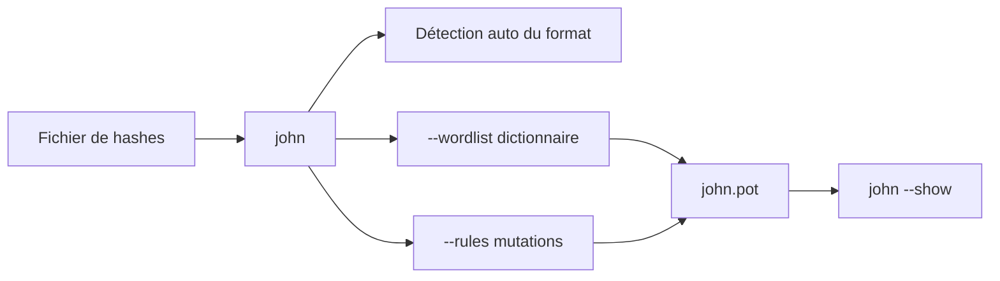

# 💥 John the Ripper — Cracking CPU & audit de mots de passe

> [!info] **En 1 phrase**
> John the Ripper = cracker **CPU** historique, réputé pour la détection **automatique du format** et l'audit des fichiers `/etc/shadow` via `unshadow`, avec une version **jumbo** qui supporte des centaines de formats.

---

## 🧾 Overview

John the Ripper (JtR) est le cracker de mots de passe **orienté CPU** de référence, développé à l'origine par Solar Designer (Openwall). La version **jumbo** — paquet `john` par défaut sur Kali — étend le noyau avec **plus de 470 formats** : Unix, Windows NT, Kerberos, clés SSH, archives ZIP/RAR/7z, documents PDF/Office, etc.

Le projet vit sur `openwall/john` (branche `bleeding-jumbo`, ~13 500 étoiles). La dernière version taguée est **1.9.0-jumbo-1** (2019) ; les paquets binaires (`john-packages`) publient des builds **rolling** (rolling-2404) et **v1.9.1-ce** (février 2026) pour Windows, macOS et Flatpak/Snap. Arch embarque `john 1.9.0.jumbo1`. Une édition commerciale **Pro** existe pour les entreprises.

| Fait | Valeur |
|---|---|
| Version | 1.9.0-jumbo-1 (2019) ; builds rolling/1.9.1-ce ; Arch 1.9.0.jumbo1 |
| Licence | GPLv2+ (core), compatible GPL pour jumbo |
| Langage | C (C99), formats en C + OpenCL/CUDA pour GPU |
| Auteur | Openwall (Solar Designer) + communauté jumbo |
| Formats | 470+ (jumbo) ; ~12 formats en core seul |
| Spécificité | Auto-détection du format, `unshadow`, potfile `john.pot` |
| GUI | Johnny (officielle) |

---

## 🎯 Concept
John the Ripper (JtR) est le cracker de mots de passe **orienté CPU** de référence, alternative à hashcat (GPU). Sa force : la **détection automatique du format** du hash (on lui donne un hash, il devine `sha512crypt`, `NT`, `krb5tgs`...) et l'application de **règles de mutation** (`--rules`) qui transforment chaque mot du dictionnaire en variantes (leet speak, suffixes, casse...). Avec la version **jumbo** (paquet par défaut sur Kali), il supporte des centaines de formats : Unix, Windows NT, Kerberos, clés SSH, PDF, ZIP, RAR... L'utilitaire `unshadow` fusionne `/etc/passwd` et `/etc/shadow` pour l'audit des comptes Unix. Les résultats sont stockés dans le potfile `john.pot` et relus avec `--show`. Dans un pentest, il s'utilise dès qu'un hash est récupéré (dump NTDS, Kerberoast, AS-REP, fichier chiffré).



---

## 🧠 Concepts fondamentaux

### CPU vs GPU : la place de John dans le workflow

| Critère | John (CPU) | hashcat (GPU) |
|---|---|---|
| Formats | 470+ (jumbo), auto-détection | 300+ modes, choix manuel obligatoire |
| Vitesse brute | Limitée aux cœurs CPU | GPU : des millions de hash/s |
| Extraction de hashes | Scripts `*2john` intégrés | Format natif (hashcat `-m`) |
| Cas typiques | Fichiers chiffrés, formats rares, audit Unix | Masses de hashes rapides (NTLM, MD5) |

Workflow réaliste : utiliser les `*2john` pour extraire et identifier, cracker les hashes rapides sur GPU (hashcat) et les formats rares/lents sur CPU (John).

### La détection automatique de format

John examine chaque ligne du fichier de hashes et applique ses **formats actifs** pour trouver celui qui matche (structure, préfixe `$6$`, longueur...). On peut forcer avec `--format=<fmt>` pour accélérer ou lever une ambiguïté. `john --list=formats` liste tout ; `--list=subformats` les variantes.

### Les règles de mangling (`--rules`)

Un mot du dictionnaire est transformé en de nombreuses variantes via des règles : `Single` (rapide, dérivées du login), `all` (exhaustif), `Jumbo`, ou des règles custom dans `john.conf`. Ex. `password` → `Password`, `password1`, `p@ssw0rd`, `password!`, etc.

### Le potfile et `--show`

Les mots de passe trouvés sont enregistrés dans `~/.john/john.pot`. `john --show fichier` relit le potfile et affiche les comptes crackés (et seulement ceux-là) — il faut lui passer le **même `--format`** que lors du crack.

---

## 🛠️ Installation
```bash
# Linux (Kali / Debian / Ubuntu) — paquet jumbo
sudo apt update && sudo apt install -y john

# Arch
sudo pacman -S john

# Fedora / RHEL
sudo dnf install -y john

# macOS
brew install john-jumbo

# Windows : binaires jumbo précompilés (run/john.exe) depuis openwall.com/john
# ou build "v1.9.1-ce" (winX64) depuis github.com/openwall/john-packages/releases

# Conteneur
docker run -it --rm kalilinux/kali-rolling bash -c "apt update && apt install -y john && john --list=formats | wc -l"

# Compilation jumbo depuis les sources (longue)
git clone https://github.com/openwall/john.git
cd john/src
./configure && make -s clean && make -s
```

> [!note] À vérifier
> Vérifie que le paquet installé est bien la version **jumbo** : `john --list=build-info | head -3` doit mentionner « jumbo ». Sur certaines distributions (Debian stable), le paquet `john` peut être le core réduit ; compiler depuis les sources dans ce cas.

---

## ⚙️ Configuration

- **`john.conf`** (dans le répertoire `run/`) : règles de mangling, modes incrémentaux, paramètres. Personnalisable : `[List.Rules:MyRules]` permet d'ajouter ses propres règles de mutation.
- **Potfile** : par défaut `~/.john/john.pot` ; déplaçable avec `--pot=<fichier>` (utile pour isoler des sessions).
- **Sessions** : `--session=<nom>` nomme une session ; `--restore` la reprend ; les fichiers `.rec` contiennent l'état.
- **`john.conf` complet** : `-j` inutile en CLI ; l'édition se fait directement dans le fichier.

```bash
# Exemple de règle personnalisée dans john.conf
# [List.Rules:MyRules]
# l            = tout en minuscules
# c            = capitaliser la première lettre
# Az"2026"     = ajouter le suffixe 2026
```

---

## 🏗️ Architecture interne

JtR est organisé autour d'un noyau (moteur de cracking, ordonnancement des modes, potfile) et d'une **bibliothèque de formats** (`--list=formats`), chacun implémentant le calcul du hash (ou une accélération OpenCL/CUDA).

```text
john (noyau)
   ├── formats C (470+ dans jumbo) : nt, sha512crypt, krb5tgs...
   │     ├── CPU (C)
   │     └── GPU (OpenCL/CUDA, formats accélérés)
   ├── modes : wordlist, single, incremental, markov, external
   ├── outils : unshadow, *2john (zip2john, pdf2john, ssh2john...)
   ├── john.conf (règles, modes incrémentaux)
   └── john.pot (résultats) + *.rec (état de session)
```

Les **scripts `*2john`** convertissent des fichiers chiffrés (ZIP, PDF, RAR, Office, keepass, clés SSH) ou des formats binaires (NTDS.dit, WPA capture) en hashes exploitables. `unshadow` fusionne `/etc/passwd` et `/etc/shadow` pour l'audit Unix.

---

## ⌨️ Commandes
```bash
# Dictionnaire simple (format auto-détecté)
john --wordlist=/usr/share/wordlists/rockyou.txt hash.txt

# Format forcé + règles de mutation
john --format=nt --rules=Single --wordlist=rockyou.txt hash.txt
john --format=krb5tgs --wordlist=rockyou.txt tgs.txt

# Audit des comptes Unix
unshadow /etc/passwd /etc/shadow > combined.txt
john --wordlist=rockyou.txt combined.txt
john --show combined.txt

# Formats disponibles + benchmark
john --list=formats | grep -i nt
john --test
```

## 🎚️ Options et flags

| Option | Effet |
|---|---|
| `--wordlist=<fichier>` | Dictionnaire de mots de passe |
| `--rules` | Règles de mangling (`Single`, `all`, `Jumbo`) |
| `--format=<fmt>` | Force le format (`nt`, `krb5tgs`, `raw-md5`...) sinon auto-détection |
| `--show` | Affiche les mots de passe crackés (depuis john.pot) |
| `--list=formats` | Liste tous les formats supportés (jumbo) |
| `--session=<nom>` | Nomme la session pour une reprise avec `--restore` |
| `--incremental` | Force brute (masque) quand le dict échoue |
| `--fork=<N>` | Parallélise sur N cœurs CPU |
| `--pot=<fichier>` | Emplacement du potfile |

### Audit des comptes Unix
```bash
unshadow /etc/passwd /etc/shadow > combined.txt
john --wordlist=/usr/share/wordlists/rockyou.txt combined.txt
john --show combined.txt
```

### Formats fréquents (jumbo)
| Hash | `--format` |
|---|---|
| Unix sha512crypt | `sha512crypt` (auto-détecté) |
| Windows NT | `nt` |
| Kerberoast | `krb5tgs` |
| AS-REP Roast | `krb5asrep` |
| NetNTLMv2 | `netntlmv2` |
| WPA/WPA2 | `wpapsk` |
| ZIP / PDF | `zip` / `pdf` |
| MySQL | `mysql-sha1` |
| DCC2 | `dcc2` |

---

## 🧪 Exemples pratiques

### Cracker un hash NT (dump Windows)
```bash
echo 'aad3b435b51404eeaad3b435b51404ee:31d6cfe0d16ae931b73c59d7e0c089c0' > ntlm.txt
john --format=nt --wordlist=rockyou.txt ntlm.txt
john --format=nt --show ntlm.txt
```

### Fichier ZIP protégé
```bash
zip2john secret.zip > zip.hash
john --wordlist=rockyou.txt zip.hash
john --show zip.hash
```

### Hash MD5 avec règles
```bash
john --format=raw-md5 --rules=all --wordlist=rockyou.txt md5.txt
```

### Benchmark du CPU
```bash
john --test --format=nt
john --test  # tous les formats (long)
```

---

## 🧪 Workflow complet (scénario pas à pas)
1. **Étape 1 — Récupérer les hashes** : depuis une session root compromise, extraire les comptes Unix.
   ```bash
   unshadow /etc/passwd /etc/shadow > combined.txt
   ```
2. **Étape 2 — Premier passage** : dictionnaire simple, format auto-détecté.
   ```bash
   john --wordlist=/usr/share/wordlists/rockyou.txt combined.txt
   ```
3. **Étape 3 — Second passage** : règles de mutation pour varier le dictionnaire.
   ```bash
   john --wordlist=rockyou.txt --rules=Single combined.txt
   ```
4. **Étape 4 — Afficher les résultats**.
   ```bash
   john --show combined.txt
   ```
5. **Étape 5 — Tester les mots de passe trouvés** sur d'autres comptes (reuse) et documenter.

---

## 🎬 Scénarios avancés
### Scénario 1 : Cracking d'un TGS Kerberoast
Un TGS récupéré avec `GetUserSPNs.py` (Impacket) est cracké avec le format `krb5tgs`.
```bash
john --format=krb5tgs --wordlist=rockyou.txt tgs.txt
john --format=krb5tgs --show tgs.txt
```

### Scénario 2 : Cracking d'un fichier ZIP protégé par mot de passe
Extraire le hash du ZIP puis le cracker.
```bash
zip2john secret.zip > zip.hash
john --wordlist=rockyou.txt zip.hash
john --show zip.hash
```

### Scénario 3 : Force brute incrémentale sur un hash NT
Quand le dictionnaire échoue, tenter un masque de longueur contrôlée.
```bash
john --format=nt --incremental=Digits --min-length=4 --max-length=8 hash.txt
```

### Scénario 4 : Clé SSH privée protégée par passphrase
```bash
ssh2john id_rsa > ssh.hash
john --wordlist=rockyou.txt ssh.hash
john --show ssh.hash
```

---

## 🛡️ Cybersecurity use cases

### Pentest / Red team
- **Kerberoasting / AS-REP Roasting** : cracker les TGS/AS-REP extraits d'Active Directory.
- **Dump NTDS** : cracker les hashes NTLM/AES d'un `ntds.dit`.
- **Fichiers chiffrés** : ZIP, PDF, Office, keepass récupérés sur un poste.
- **Audit Unix** : `unshadow` + john sur les comptes d'une machine compromise.

### CTF
- John est omniprésent : hash, archive chiffrée, clé SSH, WPA. L'auto-détection évite de se tromper de format.

### SOC / Blue team (usage défensif)
- **Audit interne de mots de passe** : vérifier que les comptes (ou hashes de test) ne sont pas faibles.
- **Vérification de politiques** : `pw-inspector` + john pour évaluer la robustesse des mots de passe d'un parc.

---

## 🎯 MITRE ATT&CK

| Technique | ID | Rôle de John |
|---|---|---|
| Brute Force: Password Cracking | T1110.002 | Cracking offline des hashes (dictionnaire, règles, incremental) |
| OS Credential Dumping: NTDS | T1003.003 | Cracking des hashes NTLM/AES issus du dump |
| OS Credential Dumping: /etc/passwd & /etc/shadow | T1003.008 | Audit des comptes Unix via `unshadow` |
| Steal or Forge Kerberos Tickets: Kerberoasting | T1558.003 | Cracking des TGS-REP (`krb5tgs`) |
| Steal or Forge Kerberos Tickets: AS-REP Roasting | T1558.004 | Cracking des AS-REP (`krb5asrep`) |

> [!note] À vérifier
> JtR n'est pas référencé comme logiciel ATT&CK (le logiciel de cracking le plus proche est hashcat, S0488). Les ID ci-dessus décrivent les techniques que John exécute en pratique.

---

## 🛡️ Defensive Security

| Signe | Défense |
|---|---|
| Utilisation CPU soutenue sur un poste d'analyse (multi-cœurs) | Détection d'outils de cracking (signatures, listes de processus), EDR |
| Hashes volés (NTDS.dit, /etc/shadow) corrélés à des mots de passe faibles | Mots de passe forts, **gMSA** pour les comptes de service |
| Crack en local sur un GPU/CPU partagé | **MFA / clés SSH** : neutralise le recours au mot de passe |
| Kerberoast : TGS demandés en masse | Surveiller les événements 4769, comptes de service gMSA |
| Hash chiffré rapide (MD5/NTLM) en clair dans les logs | **SHA-512/crypt** et algo lents, salage correct, audit régulier |
| Utilisation de `unshadow`/`*2john` sur une machine compromise | Corrélation d'outils (audit Unix + extraction de hashes) |

---

## 🤖 Automatisation

### Session nommée et reprise
```bash
john --session=audit1 --wordlist=rockyou.txt hash.txt
# Interruption (Ctrl+C) puis reprise :
john --restore=audit1
```

### Parsing du potfile pour un rapport
```bash
john --show --format=nt hash.txt | grep ":" | cut -d: -f1,2 > comptes_crackes.txt
```

### Boucle multi-formats (après identification)
```bash
for fmt in nt krb5tgs sha512crypt; do
  john --format=$fmt --wordlist=rockyou.txt --rules=Single "$1"
done
```

---

## 📤 Output et parsing

- **Écran** : affiche les mots de passe trouvés au fil de l'eau.
- **Potfile** `~/.john/john.pot` : stocke `hash:motsdepasse` en clair — à protéger.
- **`--show`** : résumé lisible des comptes crackés d'un fichier.
- **`--pot`** : pointer vers un potfile alternatif (isolation par engagement).

```bash
john --show combined.txt
# root:password123:1000:0:root,,,:/root:/bin/bash
```

---

## 🔗 Intégrations

| Outil | Intégration |
|---|---|
| hashcat | Complémentaire : hashes rapides → GPU ; formats rares → John |
| hash-identifier / hashid | Identifier le format avant de forcer `--format` |
| Name-That-Hash | Normalisation des formats (modes John inclus) |
| zip2john / pdf2john / ssh2john | Extraction de hashes depuis fichiers chiffrés |
| unshadow | Préparation des fichiers `/etc/passwd`+`/etc/shadow` |
| Johnny | GUI officielle (liste des sessions, résultats) |

---

## 🔄 Alternatives

| Outil | Différence avec John |
|---|---|
| hashcat | GPU first, modes numérotés, pas d'auto-détection ni de `*2john` |
| hashcat --example-hashes | Vérification de format par exemple |
| ophcrack | Rainbow tables LM/NTLM (obsolète pour la plupart des usages) |
| medusa / ncrack | Brute-force en ligne, pas de cracking offline |
| cain (Windows, legacy) | Cracker Windows historique, abandonné |

---

## ⚡ Performance

- **CPU** : parallélisable avec `--fork=<N>` (N cœurs) ; `john --test` benchmarke chaque format.
- **GPU** : certains formats jumbo ont des accélérations OpenCL/CUDA, mais hashcat reste supérieur en vitesse brute.
- **Ordres de grandeur** : les hashes rapides (raw MD5, NT) se comptent en dizaines de millions/s sur GPU, en millions/s CPU ; les hashes lents (bcrypt, sha512crypt, WPA) en milliers/s.
- **Astuces** : dédupliquer les wordlists, commencer par `--rules=Single`, cibler les formats lents avec des règles limitées.

> [!note] À vérifier
> Chiffres issus de l'usage communautaire ; le benchmark exact dépend du CPU, du format et de la version. Toujours exécuter `john --test` sur sa machine.

---

## 🛠️ Troubleshooting

| Problème | Cause probable | Solution |
|---|---|---|
| `No password hashes loaded` | Format non reconnu ou `*2john` non utilisé | Identifier le format, ou extraire via le script `*2john` adapté |
| `--show` ne renvoie rien | `--format` différent de celui du crack | Relancer avec le même `--format` |
| Format manquant (NT, krb5tgs) | Version core, pas jumbo | Installer/compiler la version jumbo |
| `Can't load, unsupported ciphertext format` | Hash malformé (espaces, encodage) | Nettoyer le fichier, vérifier la ligne |
| Session figée après interruption | `.rec` corrompu | `john --restore` ou recommencer avec `--session` |
| Très lent sur formats lents | bcrypt/sha512crypt | Réduire `--rules`, cibler le dictionnaire, passer aux GPU si dispo |

---

## 🔐 Sécurité de l'outil

- **Licence** : GPLv2+ (core Openwall) ; jumbo libre et open source. Édition **Pro** commerciale (optimisations, wordlists).
- **Potfile** : `john.pot` contient les mots de passe **en clair** — ne jamais le laisser sur une machine compromise, le protéger (chmod 600).
- **Confidentialité** : le cracking est 100 % local, aucun hash n'est exfiltré.
- **Intégrité** : télécharger les binaires depuis openwall.com/john ou les releases GitHub officielles (signatures fournies).

---

## ⚠️ Limitations

- **Vitesse CPU** : sans GPU, les gros volumes de hashes rapides sont lents vs hashcat.
- **Formats « exotiques »** : certains formats binaires (NTDS.dit) nécessitent un script `*2john` spécifique.
- **Auto-détection imparfaite** : les hashs de même structure (MD5 vs NTLM) peuvent être ambigus — vérifier le contexte.
- **Installation** : la version jumbo n'est pas toujours le paquet par défaut selon la distribution.

---

## 📋 Cheatsheet

```bash
# Dictionnaire
john --wordlist=rockyou.txt hash.txt

# Règles
john --wordlist=rockyou.txt --rules=Single hash.txt

# Format forcé
john --format=nt --wordlist=rockyou.txt hash.txt

# Audit Unix
unshadow passwd shadow > combined.txt
john --wordlist=rockyou.txt combined.txt
john --show combined.txt

# Archives / fichiers chiffrés
zip2john a.zip > a.hash && john a.hash
pdf2john a.pdf > a.hash && john a.hash
ssh2john id_rsa > k.hash && john k.hash

# Reprise de session
john --session=s1 --wordlist=rockyou.txt hash.txt
john --restore=s1

# Benchmark
john --test
john --list=formats
```

## ⚡ Quick reference

| Hash | Format john | Extraction |
|---|---|---|
| SHA-512 crypt (`$6$`) | `sha512crypt` | direct |
| SHA-256 crypt (`$5$`) | `sha256crypt` | direct |
| MD5 crypt (`$1$`) | `md5crypt` | direct |
| NTLM | `nt` | direct (dump) |
| Kerberoast TGS | `krb5tgs` | GetUserSPNs.py |
| AS-REP Roast | `krb5asrep` | GetNPUsers.py |
| NetNTLMv2 | `netntlmv2` | responder (hashv2) |
| WPA/WPA2 | `wpapsk` | hcxdumptool / aircrack capture |
| ZIP (classic) | `zip` | zip2john |
| RAR | `rar` | rar2john |
| PDF | `pdf` | pdf2john |
| Office | `office` | office2john |
| KeePass | `keepass` | keepass2john |
| Clé SSH | `ssh` | ssh2john |

---

## 🔍 Détection & Défense
| Signe | Défense |
|---|---|
| Utilisation CPU soutenue sur un poste d'analyse (multi-cœurs) | Détection d'outils de cracking (signatures, listes de processus), EDR |
| Hashes volés (NTDS.dit, /etc/shadow) corrélés à des mots de passe faibles | Mots de passe forts, **gMSA** pour les comptes de service |
| Crack en local sur un GPU/CPU partagé | **MFA / clés SSH** : neutralise le recours au mot de passe |
| Kerberoast : TGS demandés en masse | Surveiller les événements 4769, comptes de service gMSA |
| Hash chiffré rapide (MD5/NTLM) en clair dans les logs | **SHA-512/crypt** et algo lents, salage correct, audit régulier |

---

## ⚠️ Tips & Pièges
> [!tip] 💡 **Tips**
> - `--show` doit être appelé avec **le même `--format`** que le crack, sinon il ne renvoie rien.
> - Commence par `--rules=Single` (rapide) avant `--rules=all` (lent).
> - Si un GPU est dispo, préfère hashcat ; John excelle en audit CPU et en auto-détection.
> - Utilise `--session` dès le début : tu pourras reprendre avec `--restore` sans perdre la progression.
> - Pour les fichiers chiffrés, laisse les `*2john` extraire le hash : donner le fichier brut à john ne marche pas.

> [!warning] ⚠️ **Pièges**
> - Sans la version **jumbo**, les formats modernes (NT, Kerberos, ZIP) manquent : vérifie avec `john --list=formats | grep -i nt`.
> - Le potfile `~/.john/john.pot` contient les mots de passe **en clair** : protège-le et ne le laisse jamais sur une machine compromise.
> - L'auto-détection peut confondre MD5 et NTLM (même longueur) : croise avec le contexte et `hashid`.

---

## 📚 References

### Official
> [!info] 📚 **Sources**
> - [openwall/john (GitHub)](https://github.com/openwall/john)
> - [Openwall — John the Ripper](https://www.openwall.com/john/)
> - [john-packages (binaires Windows/macOS/flatpak)](https://github.com/openwall/john-packages/releases)
> - [Wiki John (openwall.info)](https://openwall.info/wiki/john)

### Security & Community
> [!info] 📚 **Ressources complémentaires**
> - [openwall/john-samples (exemples de hashes)](https://github.com/openwall/john-samples)
> - [MITRE ATT&CK — Kerberoasting T1558.003](https://attack.mitre.org/techniques/T1558/003/)
> - [MITRE ATT&CK — Password Cracking T1110.002](https://attack.mitre.org/techniques/T1110/002/)

---

➡️ **Liens :** [[Tools|🧰 Outils]] · [[Techniques/Password Cracking|🔐 Password Cracking]] · [[Techniques/Kerberoasting|🧀 Kerberoasting]] · [[Outils/Outil - hashcat|hashcat]] · [[Outils/Outil - hash-identifier|hash-identifier]] · [[Outils/Outil - hashid|hashid]] · [[Outils/Outil - Name-That-Hash|Name-That-Hash]]
