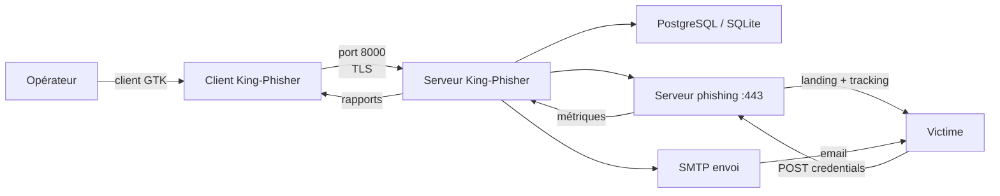

# King-Phisher — Framework complet de phishing et de sensibilisation

> [!info] **En 1 phrase**
> King-Phisher est un framework open source pour créer, déployer et analyser des campagnes de phishing, avec un serveur central, un client GUI, une API et des capacités de credential harvesting et de tracking.

---

## Overview

| Champ | Valeur |
|---|---|
| Nom complet | King-Phisher |
| Description | Framework client-serveur de gestion de campagnes de phishing : serveur central (campagnes, cibles, métriques), client GUI GTK, credential harvesting, tracking et plugins |
| Catégorie | Social Engineering & Phishing |
| Sous-catégorie | Phishing Campaign Management |
| Type d'outil | Application client-serveur (Python) |
| Licence | BSD 3-Clause |
| Open source / propriétaire | Open source |
| Langage(s) | Python (client GTK), SQL, JavaScript/HTML (templates) |
| Développeur / organisation | Andrew Hay — SecureState (ex-RSA Security) |
| Dépôt officiel | https://github.com/securephreak/King-Phisher |
| Documentation officielle | https://king-phisher.readthedocs.io |
| Date de création | 2014 |
| État du projet | **non maintenu** (dernière release v1.4.1, 2020-05-28) — fork communautaire CrimsonForge-io/king-phisher |
| Dernière version connue | v1.4.1 (28 mai 2020) |
| Systèmes compatibles | Linux (Kali), Windows, macOS (client) ; serveur sur Linux |
| Site d'essai | https://demo.king-phisher.com (démo historique, non garantie) |

> [!note] À vérifier
> Le dépôt d'origine est archivé ; le fork `CrimsonForge-io/king-phisher` reste le plus actif pour des correctifs. Privilégier [[Outil - GoPhish]] pour toute nouvelle campagne.

---

## Concept

King-Phisher est un framework de phishing développé par Andrew Hay pour RSA Security, construit sur une architecture **client-serveur**. Le **serveur** centralise les campagnes, les templates d'emails, les landing pages, les cibles et toutes les métriques (stockage PostgreSQL ou SQLite), tandis que le **client** graphique (GTK) permet à un opérateur de piloter plusieurs serveurs à distance depuis une seule interface. Cette mutualisation le distingue de la plupart des outils concurrents : une équipe d'engagement peut gérer des dizaines de campagnes sur plusieurs VPS tout en agrégeant les résultats dans le client.

Le cœur du produit est un **serveur de phishing intégré** qui héberge les landing pages de capture (credential harvesting avec capture optionnelle du mot de passe saisi dans le champ « username »), gère les redirections post-capture et sert le **tracking** : ouverture d'email (pixel), clic sur le lien, soumission de formulaire. Un moteur de templates (variables `{{FirstName}}`, `{{Organization}}`, etc.) permet de personnaliser chaque email envoyé par SMTP.

Dans un engagement, King-Phisher couvre la chaîne complète : préparation des cibles, envoi, hébergement du leurre, capture et restitution des métriques. Il est historiquement l'outil de référence pour les campagnes de sensibilisation d'entreprise ; son usage doit rester cadré par une **autorisation écrite** et un périmètre défini, les données capturées étant purgées après restitution du rapport.



---

## Concepts fondamentaux

| Concept | Explication |
|---|---|
| Serveur (server) | Daemon Python centralisant campagnes, templates, cibles, métriques et credentials (PostgreSQL ou SQLite) |
| Client (client) | GUI GTK (écrit en Python) qui pilote un ou plusieurs serveurs à distance |
| Campagne | Conteneur : nom, serveur de phishing, dates, URL de redirection post-capture, liste de cibles |
| Template d'email | Gabarit avec variables `{{FirstName}}`, `{{LastName}}`, `{{Organization}}`, `{{Email}}`, `{{From}}` |
| Landing page | Page de phishing hébergée par le serveur ; capture les soumissions et peut rediriger vers le site réel |
| Credential harvesting | Capture des identifiants soumis (username/password, champs personnalisés) |
| Tracking | Pixel d'ouverture, redirection de clic, enregistrement des soumissions par cible |
| Profil SMTP | Configuration d'envoi (hôte, port, TLS, identifiants, `From`) |
| Plugin | Extensions Python (ex : analyse, post-traitement) chargées par le serveur |
| Base de données | SQLite par défaut ; PostgreSQL recommandé pour le multi-serveur |

---

## Installation

### Paquet Kali Linux

```bash
sudo apt update && sudo apt install -y king-phisher
# Le paquet installe le serveur (king-phisher-server) et le client (king-phisher)
```

### Depuis les sources (fork actif)

```bash
sudo apt install -y python3 python3-pip libgtk-3-dev
git clone https://github.com/CrimsonForge-io/king-phisher.git
cd king-phisher
sudo python3 setup.py install
```

### Docker (serveur)

```bash
docker run -d -p 8000:8000 -p 443:443 --name kp kingphisher/king-phisher:latest
# Vérifier le tag disponible ; l'image officielle n'est plus mise à jour depuis 2020
```

> [!warning] Prérequis & problèmes potentiels
> - Le projet d'origine (Python 2) ne compile plus sur les systèmes récents : utiliser le fork `CrimsonForge-io/king-phisher` ou l'installation par paquet Kali.
> - Le client GTK requiert un affichage graphique (X11/Wayland) ; en SSH, utiliser le client seul sur sa machine et un serveur distant.
> - Les ports 8000 (protocole client-serveur) et 443 (phishing) doivent être libres.

---

## Configuration

La configuration se fait dans **`server_config.py`** (serveur) et via l'interface du client pour les profils SMTP, templates et campagnes.

| Paramètre | Rôle | Valeur possible | Impact | Exemple |
|---|---|---|---|---|
| `database` | Type de base | `sqlite` / `postgresql` | Stockage des données | `"postgresql"` |
| `server.ip` / `server.port` | Écoute du serveur | IP + port | Accessibilité du client | `0.0.0.0:8000` |
| `phishing_server.ip` / `phishing_server.port` | Serveur de phishing | IP + port | Hébergement landing | `0.0.0.0:443` |
| `server.tls_certificate` | Certificat du protocole | chemin .pem | Chiffrement client-serveur | `/etc/ssl/kp/server.pem` |
| `phishing_server.tls_certificate` | Certificat HTTPS | chemin .pem | HTTPS des landing pages | `/etc/ssl/kp/phish.pem` |
| `email_defaults` | Valeurs SMTP par défaut | dict | Envoi simplifié | `{"host": "smtp.example.com"}` |
| `root_directory` | Racine des fichiers de campagne | chemin | Stockage des assets | `/var/lib/king-phisher` |

```python
# server_config.py — extrait
database = "sqlite"
server = {
    "ip": "0.0.0.0",
    "port": 8000,
    "tls_certificate": "/etc/ssl/kp/server.pem",
}
phishing_server = {
    "ip": "0.0.0.0",
    "port": 443,
    "tls_certificate": "/etc/ssl/kp/phish.pem",
}
```

> [!note] À vérifier
> La config précise des clés évolue selon les versions (v1.x). Se référer à `server_config.py` fourni dans le dépôt.

---

## Architecture interne

King-Phisher est découpé en deux composants Python distincts :

- **Serveur (`king-phisher-server`)** : daemon qui expose le protocole de contrôle (TCP/TLS, port 8000 par défaut), gère l'authentification des opérateurs, la persistance (SQLite/PostgreSQL), les templates, les campagnes, le serveur de phishing (port 443), l'envoi SMTP et le moteur de plugins.
- **Client (`king-phisher`)** : application GTK3 qui se connecte au(x) serveur(s), gère la création/édition des campagnes, l'import des cibles, l'aperçu des emails et le reporting.
- **Moteur de templates** : syntaxe de type mustache (`{{Variable}}`) étendue avec des helpers (dates, URL de tracking).
- **Couche de persistance** : SQLAlchemy sur SQLite (par défaut) ou PostgreSQL — schéma des campagnes, cibles, événements (envoyé, ouvert, cliqué, soumis) et credentials.
- **Serveur de phishing** : sert les landing pages et le tracking (ouverture/clic/soumission) ; réutilise le moteur de templates pour les pages dynamiques.
- **Système de plugins** : modules Python chargés au démarrage du serveur pour étendre les fonctionnalités.

Flux d'exécution : le client crée la campagne → le serveur génère les URLs de tracking uniques par cible → SMTP envoie les emails → clic = requête au serveur de phishing (enregistrée) → landing affichée → soumission POST = credentials stockés + redirection → les événements sont horodatés et consultables dans le client.

---

## Commandes

### Commandes principales

```bash
# Lancer le serveur
sudo king-phisher-server

# Lancer le client graphique
king-phisher
```

| Commande | Objectif | Résultat attendu |
|---|---|---|
| `king-phisher-server` | Démarre le serveur | Daemon sur 0.0.0.0:8000 |
| `king-phisher-server -C config.py` | Démarre avec une config spécifique | Respect de la config passée |
| `king-phisher-server -L DEBUG` | Démarre avec un niveau de log précis | Logs verbeux |
| `king-phisher` | Ouvre le client GTK | GUI de pilotage |
| `king-phisher --help` | Aide du client | Liste des options |

### Commandes avancées

```bash
# Serveur en arrière-plan
sudo nohup king-phisher-server > /var/log/king-phisher.log 2>&1 &

# Vérifier l'écoute
ss -tlnp | grep -E ':(8000|443)'
```

---

## Options et flags

| Option | Description | Exemple | Niveau |
|---|---|---|---|
| `-C <fichier>` | Fichier de configuration serveur | `king-phisher-server -C server_config.py` | Intermediate |
| `-L <niveau>` | Niveau de log | `king-phisher-server -L DEBUG` | Intermediate |
| `-D` / `--daemonize` | Détacher en arrière-plan | `king-phisher-server -D` | Advanced |
| `-P <pidfile>` | Fichier PID | `king-phisher-server -P /run/kp.pid` | Advanced |
| `--version` | Version | `king-phisher --version` | Basic |

> [!tip] Options les plus utiles au quotidien
> `-C` (configs multiples), `-L DEBUG` pour diagnostiquer les échecs SMTP ou de connexion client, `-D` pour un serveur qui survit à la fermeture du terminal.

---

## Exemples pratiques

### Beginner

```bash
# 1) Démarrer le serveur
sudo king-phisher-server
# 2) Ouvrir le client et se connecter (IP 127.0.0.1, port 8000, compte admin)
king-phisher
# 3) Onglet Campaigns → New Campaign → remplir le nom et la durée
# 4) Ajouter une cible test jdoe@example.com
# 5) Créer un template d'email, lancer la campagne, suivre les métriques
```

### Intermediate

```bash
# Import CSV des cibles (colonnes : nom, prénom, email)
echo "Dupont,Jean,jean.dupont@corp.local" > cibles.csv
echo "Martin,Marie,marie.martin@corp.local" >> cibles.csv
# Dans le client : Campaigns → Targets → Import CSV
```

### Advanced

```bash
# Créer un template personnalisé avec les variables King-Phisher
# {{FirstName}} {{LastName}} {{Organization}} {{Email}} {{From}} {{URL}}
```

### Expert

```bash
# Utiliser un script d'extension / plugin pour post-traiter les captures
# python3 scripts/example_plugin.py --server 10.10.20.15 --port 8000
```

---

## Workflow complet (scénario pas à pas)

1. **Étape 1 — Démarrer le serveur** — `sudo king-phisher-server`, noter l'adresse (ex : 10.10.20.15) et le port 8000.
   ```bash
   sudo king-phisher-server -L INFO
   ```
2. **Étape 2 — Se connecter depuis le client** — renseigner l'IP, le port 8000 et les identifiants administrateur créés à l'installation.
3. **Étape 3 — Créer une campagne** — onglet *Campaigns* : nom, serveur de phishing (IP:443), dates de début/fin, URL de redirection post-capture.
4. **Étape 4 — Ajouter les cibles** — import CSV ou ajout manuel (nom, prénom, email).
   ```bash
   echo "Dupont,Jean,jean.dupont@corp.local" > cibles.csv
   ```
5. **Étape 5 — Créer le template d'email et la landing page** — variables `{{FirstName}}`, `{{Organization}}`, lien `{{URL}}` ; la landing page capture les soumissions et redirige vers le vrai site.
   ```html
   <!-- Template email -->
   <p>Bonjour {{FirstName}},</p>
   <p><a href="{{URL}}">Cliquez ici pour actualiser votre mot de passe</a></p>
   ```
6. **Étape 6 — Configurer le profil SMTP et lancer** — choisir le profil, vérifier la délivrabilité (SPF/DKIM), démarrer l'envoi.
7. **Étape 7 — Analyser les métriques** — ouvertures, clics, soumissions par cible ; export CSV pour le rapport d'audit.

---

## Scénarios avancés

### Scénario 1 : campagne multi-serveurs mutualisée

```bash
# Déployer le serveur King-Phisher sur plusieurs VPS (ex : 10.10.20.15 et 10.10.20.16)
# Dans le client : cocher "Use multiple servers" lors de la création de campagne
# Les métriques des deux serveurs sont agrégées dans le client central
```

L'agrégation multi-serveurs permet de répartir l'envoi (éviter les limites anti-spam) tout en gardant un reporting unique pour le client.

### Scénario 2 : harvestionnage avec redirection intelligente

```bash
# Dans la campagne : URL de redirection → https://www.example.com
# La landing page capture les identifiants puis redirige la victime vers le
# vrai site : le test reste discret et la victime ne se doute de rien
```

### Scénario 3 : capture de champs personnalisés (extrapolation à partir du harvestionnage)

```bash
# Dans la landing page, ajouter un champ supplémentaire (ex : numéro de téléphone)
# La soumission POST enregistre username/password + les champs personnalisés
# dans la base, consultables sous l'onglet Credentials
```

### Scénario 4 : campagne récurrente de sensibilisation

```bash
# 1. Dupliquer une campagne précédente depuis le client
# 2. Changer le prétexte (RTT, congés, alerte sécurité)
# 3. Lancer un test sur 5 % des cibles, analyser, ajuster
# 4. Lancer la campagne complète et exporter le rapport CSV
```

---

## Cybersecurity use cases

| Phase | Utilisation |
|---|---|
| Initial Access | Envoi du leurre et hébergement de la landing (T1566.002) |
| Credential Access | Capture des identifiants soumis (T1111 si OTP) |
| Collection | Récupération structurée des credentials par cible |
| Persistence (démo) | Campagnes récurrentes pour mesurer la résilience humaine |
| Reporting | Export CSV des métriques pour le rapport d'audit |
| Red team | Landing pages clonées pour tests ciblés de phishing 2FA (si OTP) |

---

## MITRE ATT&CK

| Tactique | Technique / Sub-technique | ID | Raison | Détection | Mitigation |
|---|---|---|---|---|---|
| Initial Access | Phishing: Spearphishing Link | T1566.002 | Emails avec lien vers la landing King-Phisher | Analyse URL, sandbox | SPF/DKIM/DMARC, filtrage web |
| Initial Access | Phishing: Spearphishing Attachment | T1566.001 | Pièces jointes .html jointes au template | Blocage des pièces jointes | Filtrage des pièces jointes |
| Credential Access | Steal Web Session Cookie | T1539 | Landing pages capturant les soumissions | Détection de replay | Cookies HttpOnly, rotation |
| Credential Access | Multi-Factor Authentication Interception | T1111 | Champs OTP ajoutés aux landing | Double saisie anormale | FIDO2/WebAuthn |
| Collection | Data from Local System | T1005 | Données soumises stockées en base | Accès base surveillé | Contrôle d'accès, chiffrement |

> [!note] Ne renseigner que si l'association est réellement pertinente.
> King-Phisher est l'archétype T1566.002 avec capture de credentials en bout de chaîne.

---

## Defensive Security

### Signes observables

| Indicateur | Détail |
|---|---|
| Email avec domaine ou nom d'affichage inconnu | Spoofing de l'expéditeur |
| URLs contenant un identifiant de tracking par cible | Tracking King-Phisher dans les liens |
| Pixel d'ouverture distant | Image invisible chargée depuis le serveur de phishing |
| Landing page avec URL ne correspondant pas au certificat | Serveur phish sur IP brute ou domaine neuf |
| Masses d'emails depuis une même IP | Envoi SMTP groupé (rate limit) |
| Soumissions de formulaire vers un domaine inconnu | POST vers la landing page |

### Règles de détection (Sigma / Suricata / YARA)

```yaml
# Sigma — accès aux URLs de tracking de campagne de phishing
title: Phishing Campaign Tracking URI Access
id: b2c3d4e5-0001-4567-89ab-cdef01234567
status: experimental
logsource:
    category: proxy
detection:
    selection:
        url|contains:
            - '/track/'
            - 'rid='
            - '?campaign='
    condition: selection
falsepositives:
    - URL shorteners using similar parameters
level: medium
```

```bash
# Suricata — détection d'un POST de credentials vers une landing
alert tcp any any -> any 443 (msg:"ET Phishing credentials POST to landing page"; \
  content:"POST"; http_method; content:"username"; http_client_body; nocase; \
  classtype:attempted-user; sid:20260005; rev:1;)
```

---

## Automatisation

```bash
# Bash — vérifier la disponibilité du serveur et du serveur de phishing
nc -zv 10.10.20.15 8000
nc -zv 10.10.20.15 443
curl -sk https://10.10.20.15/ -o /dev/null -w "%{http_code}\n"
```

```python
# Python — ébauche de pilotage du protocole serveur (schéma interne, dépend de la version)
# King-Phisher n'expose pas d'API REST officielle ; l'automatisation passe par
# le protocole client-serveur propriétaire ou par l'interface graphique.
import socket, ssl

s = socket.socket()
ctx = ssl.create_default_context()
ctx.check_hostname = False
ctx.verify_mode = ssl.CERT_NONE
ss = ctx.wrap_socket(s, server_hostname="10.10.20.15")
ss.connect(("10.10.20.15", 8000))
print("Connexion au serveur King-Phisher établie")
ss.close()
```

---

## Output et parsing

King-Phisher agrège les métriques par cible : **envoyé**, **ouvert**, **cliqué**, **soumis**, avec horodatage. L'export se fait par le client (CSV).

```bash
# Les rapports sont exportés via le client : Campaigns → Export (CSV)
# Colonnes typiques : first_name, last_name, email, status, opened_at, clicked_at, submitted_at
```

```python
# Python — lecture d'un export CSV
import csv
with open("rapport_campagne.csv", newline="", encoding="utf-8") as f:
    for row in csv.DictReader(f):
        if row.get("submitted_at"):
            print(row["email"], row["submitted_at"])
```

---

## Intégrations

- [[Tools| Outils]] global
- [[Outil - GoPhish]] — successeur moderne (API REST, interface web) pour les nouvelles campagnes
- [[Outil - SET]] — vecteurs d'email alternatifs (payloads, HTA)
- [[Outil - BeEF]] — hook du navigateur après clic sur la landing
- [[Outil - SocialFish]] / [[Outil - CredSniper]] — landing pages de capture simples
- [[Outil - Nmap]] — vérification des ports 8000/443 sur le serveur de campagne

```text
Client GTK → Serveur (8000) → PostgreSQL → SMTP → victime → landing (443) → tracking → CSV
```

---

## Alternatives

| Outil | Avantages | Inconvénients | Cas d'usage |
|---|---|---|---|
| [[Outil - GoPhish]] | Maintenu, interface web, API REST | Pas de client GTK | Remplacement recommandé |
| [[Outil - SET]] | Intégré Metasploit, multi-vecteurs | Interface lourde | Campagnes multi-vecteurs |
| [[Outil - Evilginx2]] | Bypass 2FA, session réelle | Infrastructure lourde | Red team MFA |
| [[Outil - SocialFish]] | Rapide, tunneling intégré | Peu de tracking | Démo |
| PhishDeck / uPhish | GUI riches | Moins éprouvés | Alternatives commerciales |

> **Quand utiliser King-Phisher plutôt que GoPhish ?** Uniquement sur des infrastructures anciennes ou pour exploiter une installation existante ; le projet n'étant plus maintenu, [[Outil - GoPhish]] est recommandé pour toute nouvelle campagne.

---

## Performance

- Serveur Python : consommation mémoire modérée (dépend de PostgreSQL) ; adapté à des campagnes de quelques milliers de cibles.
- L'envoi SMTP est séquentiel : pour de gros volumes, multiplier les serveurs (fonctionnalité native multi-serveurs) et espacer les lancements.
- SQLite suffit pour des campagnes petites/moyennes ; PostgreSQL est recommandé pour la production et le multi-serveurs.
- Le pixel d'ouverture peut être bloqué par les clients mail : le taux d'ouverture est une **borne basse**.

> [!note] À vérifier
> Pas de benchmarks officiels publiés ; ordres de grandeur issus de retours d'expérience de la communauté.

---

## Troubleshooting

### Common problems

#### Problème : le client ne se connecte pas au serveur

- **Cause** : port 8000 bloqué par le firewall, ou TLS non configuré côté serveur.
- **Solution** : ouvrir le port 8000, vérifier le certificat dans `server_config.py`, tester avec `nc -zv 10.10.20.15 8000`.
- **Vérification** : logs du serveur (`-L DEBUG`).

#### Problème : erreur Python lors de l'installation depuis les sources

- **Cause** : le dépôt d'origine dépend de Python 2 et de librairies obsolètes.
- **Solution** : utiliser le fork `CrimsonForge-io/king-phisher` ou le paquet Kali.
- **Vérification** : `python3 -c "import king_phisher"` (absence d'erreur).

#### Problème : les emails partent en spam

- **Cause** : pas de SPF/DKIM/DMARC sur le domaine d'envoi.
- **Solution** : aligner SPF/DKIM, utiliser un domaine dédié, tester la délivrabilité.
- **Vérification** : envoi vers une boîte contrôlée et inspection des headers.

#### Problème : landing page en 404

- **Cause** : le serveur de phishing (port 443) ne tourne pas ou le certificat est invalide.
- **Solution** : vérifier l'écoute sur 443 et le certificat configuré.
- **Vérification** : `curl -skI https://10.10.20.15/`.

---

## Sécurité de l'outil

- **Protocole client-serveur** : chiffré par TLS (port 8000) — générer un certificat dédié, ne pas exposer hors réseau d'engagement.
- **Authentification** : comptes opérateurs gérés par le serveur — restreindre les droits et changer les mots de passe par défaut.
- **Données capturées** : credentials stockés dans PostgreSQL/SQLite — chiffrer le serveur, purger après restitution.
- **Certificats** : servir les landing pages en HTTPS avec un certificat valide pour le domaine dédié.
- **Légal** : campagnes autorisées par écrit, périmètre défini, exclusion des données personnelles superflues.
- **Journalisation** : conserver les logs pendant la mission puis les purger ; le projet n'étant plus maintenu, ne pas l'utiliser en environnement sensible.

---

## Limitations

- **Projet non maintenu** : dernière release v1.4.1 (2020), dépendances obsolètes (Python 2 côté historique).
- Pas de phishing 2FA persistant : la capture d'un OTP ne donne pas une session rejouable (utiliser Evilginx2).
- Pas d'API REST officielle : l'automatisation passe par le protocole propriétaire ou le GUI.
- Client GTK uniquement : pas d'interface web de pilotage (contrairement à GoPhish).
- Le tracking d'ouverture est faussé par les clients qui bloquent les images distantes.
- Compatibilité limitée avec les distributions récentes sans le fork communautaire.

---

## Cheatsheet

```bash
# Lancer le serveur et le client
sudo king-phisher-server
king-phisher

# Serveur avec config et logs
sudo king-phisher-server -C server_config.py -L DEBUG

# Vérifier l'écoute
ss -tlnp | grep -E ':(8000|443)'

# Test de la landing
curl -skI https://10.10.20.15/

# Import CSV des cibles (nom,prénom,email)
echo "Dupont,Jean,jean.dupont@corp.local" > cibles.csv
```

```text
# Variables de template
{{FirstName}} {{LastName}} {{Organization}} {{Email}} {{From}} {{URL}}
```

---

## Quick reference

| | |
|---|---|
| **À quoi sert-il ?** | Créer, déployer et analyser des campagnes de phishing avec un client graphique multi-serveurs |
| **Quand l'utiliser ?** | Campagnes de sensibilisation sur des infrastructures existantes (projet non maintenu) |
| **Commande principale** | `sudo king-phisher-server` puis `king-phisher` (client GTK) |
| **Alternative principale** | [[Outil - GoPhish]] (maintenu) / [[Outil - SET]] |
| **Concepts importants** | Serveur central, client GTK, template `{{}}`, landing page, tracking, multi-serveurs |
| **Liens associés** | [[Outil - GoPhish]] · [[Outil - SET]] · [[Outil - BeEF]] |

---

## Détection & Défense

| Signe | Défense |
|---|---|
| Email avec domaine ou nom d'affichage inconnu | Vérifier l'expéditeur, SPF/DKIM/DMARC |
| URL sur un domaine non corporate ou une IP brute | Hover pour vérifier le lien réel, passer par le proxy filtrant |
| Page de login avec URL ne correspondant pas au certificat | Contrôler l'URL et le cadenas HTTPS |
| Masses d'emails provenant d'une même IP | Filtrage anti-spam, limites d'envoi et listes noires IP |
| Pixel de tracking d'ouverture détecté dans l'email | Bloquer le chargement d'images distantes par défaut |
| Lien court ou domaine récemment enregistré | Détection de nouveaux domaines (DNS alerting) |

---

## Tips & Pièges

> [!tip] **Tips**
> - Utilisez les **variables de template** (`{{FirstName}}`, `{{Organization}}`) : un email personnalisé passe mieux les filtres anti-spam et attire plus de clics.
> - Activez le **tracking d'ouverture** et paramétrez la redirection post-capture vers le vrai site : le test reste discret.
> - Exploitez la fonctionnalité **multi-serveurs** native pour répartir l'envoi et agréger les métriques dans un seul client.
> - Exportez les métriques en **CSV** pour votre rapport : les statistiques de King-Phisher s'intègrent directement à une présentation.

> [!warning] **Pièges**
> - Le projet n'est **plus maintenu** : sur un système récent, l'installation depuis le dépôt d'origine échoue — utiliser le paquet Kali ou le fork `CrimsonForge-io/king-phisher`.
> - Le serveur doit rester accessible depuis le client : vérifiez le port **8000** dans le firewall.
> - Sans SMTP correctement configuré (SPF/DKIM), les emails partent en spam et faussent les résultats.
> - Le client GTK nécessite un affichage graphique : ne l'exécutez pas en SSH sans X forwarding.

---

## References

### Official

- Dépôt d'origine : https://github.com/securephreak/King-Phisher
- Fork actif : https://github.com/CrimsonForge-io/king-phisher
- Documentation : https://king-phisher.readthedocs.io
- Releases : https://github.com/securephreak/King-Phisher/releases

### Security references

- MITRE ATT&CK T1566.002 — Spearphishing Link : https://attack.mitre.org/techniques/T1566/002/
- MITRE ATT&CK T1111 — Multi-Factor Authentication Interception : https://attack.mitre.org/techniques/T1111/
- OWASP — Phishing : https://owasp.org/www-community/attacks/Phishing
- NIST SP 800-53 — Security Awareness Training (AT-2) : https://csrc.nist.gov/

### Community

- Article d'introduction (RSA/SecureState) : https://github.com/securephreak/King-Phisher/blob/master/README.md
- Discussions du fork CrimsonForge-io : https://github.com/CrimsonForge-io/king-phisher/issues

---

**Liens :** [[Tools| Outils]] · [[Outil - GoPhish|GoPhish]] · [[Outil - SET|SET]] · [[Outil - Evilginx2|Evilginx2]] · [[Outil - BeEF|BeEF]]
