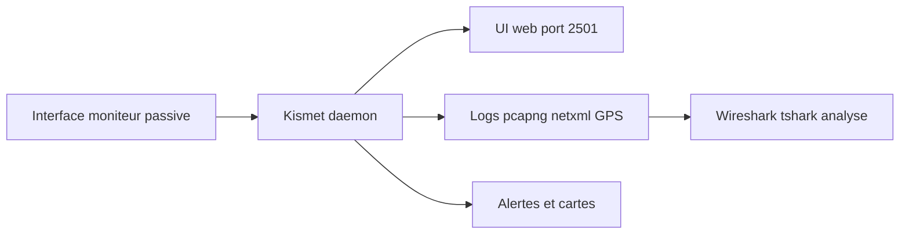

# 📡 Kismet — Wireless & Réseau

> [!info] **En 1 phrase**
> Détecteur **passif** de signaux **WiFi, Bluetooth et SDR**, avec interface web, logging **pcap** et cartographie des appareils — autant un outil de surveillance RF défensif qu'une base de renseignement pour l'offensif.

---

## 🧾 Overview

| Champ | Valeur |
|---|---|
| Nom complet | Kismet |
| Description | Récepteur/analyseur de spectre passif multi-protocoles : WiFi (802.11 a/b/g/n/ac/ax), Bluetooth/BLE, ADS-B, SDR, RF météo… avec UI web, alertes, GPS et logging |
| Catégorie | 📡 Wireless & Réseau |
| Sous-catégorie | Reconnaissance & surveillance RF (WIDS / OSINT radio) |
| Fonction principale | Découverte passive d'AP, clients, réseaux cachés et appareils radio ; enregistrement pcapng ; cartographie géolocalisée |
| Type d'outil | Framework (daemon + UI web + clients) |
| Licence | GPL-2.0 |
| Open source / propriétaire | Open source |
| Langage(s) de programmation | C++ (daemon et captureurs), JavaScript/HTML5 (UI web), Python (scripts) |
| Développeur / organisation | Mike Kershaw « dragorn » et communauté Kismet Wireless |
| Projet officiel | Kismet Wireless |
| Dépôt officiel | https://github.com/kismetwireless/kismet |
| Documentation officielle | https://www.kismetwireless.net/docs/ |
| Date de création | 2001 (projet original de Michael Kershaw) |
| État du projet | actif (sorties régulières 2023-07-R1, 2025-09-R1) |
| Dernière version connue | 2025-09-R1 (4 septembre 2025) ; versionnés par date, pas de tags GitHub |
| Systèmes compatibles | Linux (recommandé), BSD, macOS (capture limitée), OpenWRT, Android (Kismet for Android) |

> [!note] Pour vérifier / compléter
> Kismet versionne par **date de release** (ex. `2025-09-R1`) et non par numéro : vérifier la version via `kismet --version` ou l'onglet « Help/About » de l'UI. La liste exacte des datasources dépend des captureurs compilés (`kismet_capture_*`).

---

## 🎯 Concept

`kismet` écoute **sans émettre** (mode passif, très discret) : il identifie les points d'accès, les clients, les réseaux cachés (SSID révélé par les probes), les appareils Bluetooth/BLE et les signaux SDR (via `rtl433`, `rtlamr`, `rtsdr`), avec un **GPS** pour la cartographie géolocalisée. Il écrit des **captures pcapng** réutilisables par Wireshark/tshark et expose une **UI web** riche (cartes, graphes, alertes) sur le port 2501. Côté offensif, les données Kismet permettent de préparer des attaques ciblées (canaux, BSSID/MAC, périphériques connectés) ; côté défensif, il détecte les AP rogue, les attaques par probe et les signaux anormaux.

Architecture modulaire : un **démon** central capture, des **sources de données** (interfaces moniteur, Bluetooth, radios SDR) alimentent, et les clients (UI web, scripts) consomment en temps réel via websocket. Le projet, fondé en 2001 par Michael Kershaw, est historiquement LA référence de la surveillance WiFi passive (à l'origine sous GTK+), avant sa refonte en démon + UI web avec la gamme 2019+. Il est utilisé aussi bien par les red teams (recon RF) que par les équipes défensives (WIDS maison).



---

## 🧠 Concepts fondamentaux

| Concept | Explication |
|---|---|
| Mode passif | Kismet n'émet jamais : écoute seulement → indétectable par les AP (contrairement aux injections) |
| Datasource | Source de données : interface moniteur, interface Bluetooth (hci), récepteur SDR, fichier pcap, etc. |
| Channel hopping | Rotation rapide sur les canaux 2,4/5/6 GHz ; laisse passer les bursts courts → fixer `-c` pour cibler |
| SSID caché | Réseau dont le beacon est vide ; Kismet le révèle via les probe requests des clients |
| NetXML | Format XML historique de sortie (devices, GPS) — alimente les exports et les outils de cartographie |
| GPSXML / GPS map | Fichiers de géolocalisation ; cartes intégrées dans l'UI web (OpenStreetMap) |
| WIDS (Wireless IDS) | Kismet peut alerter sur AP rogue, deauth anormales, trames suspectes |
| Client tracking | Suivi des MAC clients, de leur puissance (RSSI) et de leur historique de connexion |
| Web UI (port 2501) | Console web temps réel : graphes, cartes, tables de devices, recherche |
| Captureurs (kismet_capture_*) | Binaires dédiés par type de source : `kismet_capture_linuxwifi`, `kismet_capture_bluetooth`, `kismet_capture_rtl433`… |
| Alerts | Événements déclencheurs (nouvel AP, changement de canal…) émis par le démon, visibles dans l'UI et les logs |

---

## 🛠️ Installation

### Debian / Ubuntu / Kali Linux

```bash
sudo apt update && sudo apt install -y kismet
# Droits : ajouter l'utilisateur aux groupes requis
sudo usermod -a -G kismet,dialout $USER
# Lancer le serveur de configuration initial (choix des sources)
sudo kismet --setup
```

### Arch Linux

```bash
sudo pacman -S kismet
```

### Fedora / RHEL

```bash
sudo dnf install kismet
```

### macOS

```bash
brew install kismet
# Attention : capture WiFi très limitée (macOS bloque le mode moniteur sur la plupart des cartes)
```

### Windows

```powershell
# Non supporté nativement pour la capture WiFi
# Contournement : Kali en VM (Kismet for Android sur mobile, ou via un Raspberry Pi)
```

### Docker

```bash
docker pull kismetwireless/kismet
# L'accès à l'interface radio (moniteur) doit être exposé avec --privileged --net=host
# Les datasources matérielles (USB WiFi, SDR) ne sont pas fiables en conteneur
```

### Compilation depuis les sources

```bash
git clone https://github.com/kismetwireless/kismet.git
cd kismet && ./configure && make && sudo make install
```

> [!warning] ⚠️ Prérequis & problèmes potentiels
> - Groupes `kismet` et `dialout` requis pour fonctionner **sans root** (accès USB/série).
> - La carte WiFi doit supporter le **mode moniteur** (la plupart des cartes, mais les pilotes propriétaires peuvent bloquer).
> - Les datasources Bluetooth nécessitent une interface HCI accessible ; SDR nécessite les libs `rtl-sdr`/`airspy`.
> - Le `--setup` initial est obligatoire pour configurer la collecte avant le premier lancement.

---

## ⚙️ Configuration

La configuration principale vit dans `/etc/kismet/kismet.conf` (ou `kismet_site.conf` pour les overrides). On y déclare les **sources de données** (`source=`), les **fichiers de log**, le port HTTP, les alertes et le comportement du channel hopping.

| Paramètre | Rôle | Valeur possible | Impact | Exemple |
|---|---|---|---|---|
| `source=` | Déclare une datasource | `linuxwifi:name=w0,device=wlan0mon` | Alimente le démon | `source=linuxwifi:name=w0,device=wlan0mon` |
| `source=bluetooth:` | Source Bluetooth | `device=hci0` | Ajoute BLE/BT | `source=bluetooth:name=bt0,device=hci0` |
| `source=rtl433:` | Source SDR ISM | `device=0` | Capte les capteurs 433 MHz | `source=rtl433:name=rtl0,device=0` |
| `httpport=` | Port de l'UI web | 2501 | Exposition web | `httpport=2501` |
| `logtypes=` | Types de logs | `pcapng,netxml,gpsxml,alert` | Formats générés | `logtypes=pcapng,netxml,gpsxml,alert` |
| `kismet_logdir=` | Dossier des logs | chemin | Où écrire | `kismet_logdir=/pentest/rf` |
| `wifictl_hopper_interval=` | Vitesse de hopping (s) | 1-20 | Granularité du scan | `wifictl_hopper_interval=5` |
| `alert_*` | Seuils d'alertes | diverses | Notifications | `alert_dot11probe=1` |

---

## 🏗️ Architecture interne

Kismet moderne (gamme 2019+) est un **démon C++** multi-thread qui ingère des paquets de plusieurs sources et les normalise dans un modèle de données unifié (devices, phy, sub-phy) :

1. **Captureurs** — des processus/binaires `kismet_capture_*` (par ex. `kismet_capture_linuxwifi`, `kismet_capture_bluetooth`, `kismet_capture_rtl433`, `kismet_capture_sdr_*`) capturent les trames brutes de chaque source et les transmettent au démon via IPC (fichiers, sockets).
2. **Daemon** — décode les trames (WIFI / BLUETOOTH / SDR selon le phy), fait le **tracking des devices** (association MAC/SSID/channel/RSSI), le **fingerprinting** et génère les **alertes**.
3. **Fichiers de log** — en continu : `Kismet-*.pcapng` (trames), `Kismet-*.netxml` (liste XML des devices), `Kismet-*.gpsxml` (position GPS), `Kismet-*.alert` (événements).
4. **API HTTP** — le démon expose une API REST (`/devices/...json`) et un flux **websocket** pour les clients temps réel.
5. **UI web** — application HTML5/JS sur `http://<ip>:2501` : cartes, graphes, tables, moteur de recherche, commandes (changer de canal, déclarer une source).
6. **Extensibilité** — les datasources et protocols sont des plugins ; le modèle de données est étendu par « phy » (WiFi, Bluetooth, SDR, Zigbee…).

L'ensemble fonctionne en **pur passif** : aucune trame émise par Kismet lui-même, ce qui le rend invisible aux AP et clients surveillés.

---

## ⌨️ Commandes

### Commandes principales

```bash
sudo kismet --no-root --override-kismet-logdir /pentest/rf wlan0mon
```

| Commande | Objectif | Résultat attendu |
|---|---|---|
| `kismet` | Démarre le démon + UI web sur `http://<ip>:2501` | Console web accessible |
| `kismet --no-root` (`-n`) | Fonctionne sans privilèges root (via les groupes) | Capture par groupe `kismet`/`dialout` |
| `kismet --setup` | Assistant de configuration des sources | `kismet.conf` rempli |
| `kismet -c <canal>` | Cible un canal précis (ex. `-c 6`) | Chasse ciblée sur ce canal |
| `kismet --override-kismet-logdir <dir>` | Dossier des logs | pcapng/netxml/gpsxml dedans |
| `kismet --config <fichier>` | Fichier de config spécifique | Configuration alternative |
| `kismet --force-local` | Force le mode local | Lancement même avec clients connectés |
| `kismet --verbose` | Verbosité accrue | Debug datasources |

### Commandes avancées

```bash
# Chasse ciblée sur canal 6 avec logs dédiés
sudo kismet --no-root -c 6 --override-kismet-logdir /pentest/rf wlan0mon

# Surveiller le JSON des devices en temps réel (pour scripting/SIEM)
curl -s http://localhost:2501/devices/views/physical/all_devices.json | jq '.'
```

---

## 🎚️ Options et flags

| Option | Description | Exemple | Niveau |
|---|---|---|---|
| `--no-root` / `-n` | Sans privilèges root | `kismet --no-root` | Basic |
| `--setup` | Assistant de configuration | `kismet --setup` | Basic |
| `-c <canal>` | Canal ciblé | `kismet -c 6 wlan0mon` | Intermediate |
| `--override-kismet-logdir <dir>` | Dossier de logs | `--override-kismet-logdir /rf` | Intermediate |
| `--config <fichier>` | Config alternative | `--config /etc/kismet/custom.conf` | Advanced |
| `--force-local` | Forcer mode local | `--force-local` | Advanced |
| `--verbose` | Verbosité | `--verbose` | Advanced |
| `--no-plugins` | Désactive les plugins | `--no-plugins` | Expert |
| `--alert-silent` | Supprime les alertes console | `--alert-silent` | Expert |

> [!tip] Options les plus utiles au quotidien
> - `--no-root` pour fonctionner en groupe, sans escalade permanente.
> - `-c <canal>` pour une chasse ciblée (les bursts courts sont sinon perdus).
> - `--override-kismet-logdir` pour centraliser les captures de l'audit.
> - `--setup` à la première installation pour déclarer correctement les sources.

---

## 🧪 Exemples pratiques

### Beginner

```bash
# Objectif : premier scan passif du spectre local
sudo kismet --no-root
# Ouvrir http://localhost:2501 : voir les AP, clients, réseaux cachés
```

Résultat attendu : la table Devices liste les AP et clients avec canal, puissance et chiffrement. Erreur fréquente : source non déclarée → reconfigurer avec `--setup`.

### Intermediate

```bash
# Objectif : chasse ciblée sur un canal + export netxml des cibles
sudo kismet --no-root -c 6 --override-kismet-logdir /pentest/rf wlan0mon
# Après quelques minutes :
grep -o '<BSSID>[^<]*</BSSID>' /pentest/rf/Kismet-*.netxml | sort -u
```

### Advanced

```bash
# Objectif : ajouter une source Bluetooth et une source SDR pour une vue multi-spectre
# Déclarer dans kismet.conf :
#   source=bluetooth:name=bt0,device=hci0
#   source=rtl433:name=rtl0,device=0
sudo kismet --no-root --config /etc/kismet/kismet.conf
```

### Expert

```bash
# Objectif : alerting automatique sur nouvel AP (WIDS maison)
# Dans kismet.conf : activer l'alerte sur nouveau device 802.11
#   alert_dot11ap=1
# Puis interroger l'API et pousser vers un SIEM :
curl -s http://localhost:2501/devices/views/physical/all_devices.json \
  | jq -r '.phy80211[] | select(.device.manuf != null) | "\(.device.macaddr)\t\(.device.manuf)"'
```

---

## 🧪 Workflow complet (scénario pas à pas)

1. **Étape 1 — Passer la carte en mode moniteur** et lancer Kismet avec des logs dédiés.
   ```bash
   sudo airmon-ng check kill && sudo airmon-ng start wlan0
   sudo kismet --no-root --override-kismet-logdir /pentest/rf wlan0mon
   ```
2. **Étape 2 — Ouvrir l'interface web** `http://localhost:2501` : tableau des devices, graphes de puissance par canal, onglet « Maps ».
3. **Étape 3 — Identifier les réseaux cachés** : Kismet montre le **SSID via les probes clients** même sans beacon apparent.
4. **Étape 4 — Cartographier avec le GPS** : pendant la marche, connecter un GPS ; à la fin, vérifier les fichiers générés.
   ```bash
   # Fichiers générés : ALERT, NETXML, PCAPNG, GPSXML
   ls /pentest/rf/
   ```
5. **Étape 5 — Analyser la capture** : préparer l'attaque avec tshark/Wireshark (BSSID, canal, clients connectés).
   ```bash
   tshark -r /pentest/rf/capture.pcapng -Y "wlan.fc.type_subtype == 0x08"
   ```

---

## 🎬 Scénarios avancés

### Scénario 1 : Détection d'un AP rogue avec un WIDS maison

Surveiller en continu le spectre et alerter sur l'apparition d'un point d'accès non déclaré.

```bash
# 1. Lancer Kismet en démon avec logs dédiés
sudo kismet --no-root --override-kismet-logdir /srv/kismet wlan0mon

# 2. Interroger l'API web en temps réel (JSON) pour lister les AP
curl -s http://localhost:2501/devices/views/physical/all_devices.json | jq '.'

# 3. Filtrer par ESSID connus vs inconnus ; tout AP non autorisé = rogue
# 4. Croiser avec la table de référence des AP légitimes (BSSID attendus)
# 5. Automatiser : crontab + script qui parse le JSON et envoie une alerte SIEM
```

### Scénario 2 : Recon RF ciblée avant attaque Wi-Fi

Cartographier un bâtiment pour choisir la cible et le canal avant une attaque WPA2.

```bash
# 1. Fixer le canal de la cible pour ne pas rater les bursts courts
sudo kismet --no-root -c 6 wlan0mon

# 2. Repérer le client connecté le plus actif (candidat à la deauth)
#    → consulter l'onglet Devices, trier par « packets » décroissant

# 3. Exporter la liste des cibles au format netxml
grep -o '<BSSID>[^<]*</BSSID>' kismet-*.netxml | sort -u

# 4. Passer le relais aux outils actifs : airodump-ng pour la capture
sudo airodump-ng -c 6 --bssid <BSSID> -w cap wlan0mon
```

### Scénario 3 : Couvrir Bluetooth et SDR avec des datasources additionnelles

Élargir la surveillance passive aux appareils Bluetooth/BLE et aux capteurs radio ISM.

```bash
# 1. Vérifier que les binaires de capture complémentaires sont présents
ls /usr/lib/kismet/ 2>/dev/null || find /usr -name 'kismet_capture*'

# 2. Déclarer les sources dans kismet.conf (bluetooth via hci, rtl_433 pour l'ISM)
#    source=bluetooth:name=bt0,device=hci0
#    source=rtl433:name=rtl0,device=0

# 3. Relancer Kismet avec la config complète
sudo kismet --no-root --config /etc/kismet/kismet.conf

# 4. Suivre beacons BLE, trackers et capteurs ISM dans l'UI web (onglet Devices)
```

---

## 🛡️ Cybersecurity use cases

| Phase | Utilisation |
|---|---|
| Reconnaissance | Cartographie passive du spectre (AP, clients, BSSID, canaux, RSSI) |
| OSINT / Physical | Découverte de réseaux cachés (SSID via probes), géolocalisation GPS |
| Offensive (pre-attack) | Choix de la cible, du canal, du client à déauthentifier |
| Defense | WIDS : détection d'AP rogue, de deauth anormales, de probes suspiciennes |
| Forensics | Captures pcapng complètes analysables dans Wireshark/tshark |
| Red team | Surveillance Bluetooth/BLE et capteurs SDR autour du périmètre |

---

## 🎯 MITRE ATT&CK

| Tactique | Technique / Sub-technique | ID | Raison | Détection | Mitigation |
|---|---|---|---|---|---|
| Reconnaissance | Network Sniffing | T1040 | Capture passive du trafic radio (WiFi/BLE/SDR) | L'écoute passive est indétectable | Chiffrement (WPA3, TLS), cloisonnement |
| Reconnaissance | Active Scanning | T1595 | Le mode passif prépare un scan/attaque actif ciblé | WIDS sur l'activité actuelle | WIDS, monitoring |
| Discovery | Wi-Fi Discovery | T1016 (adjacent) | Énumération des AP/clients pour planifier une attaque | Analyse des logs réseau | Segmentation, 802.1X |
| Collection | Data from Local System (capture RF) | T1005 | Pcapng des trames collectées en vue d'analyse | Contrôle des fichiers et postes | Politique de postes, DLP |

> [!note] Ne renseigner que si l'association est réellement pertinente.
> Kismet étant **passif**, son usage principal est la **reconnaissance** (T1040, T1595) ; le vol de données en découle via l'analyse des captures.

---

## 🛡️ Defensive Security

### Signes observables

| Indicateur | Détail |
|---|---|
| Comportement du spectre (monitoré par un autre WIDS) | Kismet n'émet pas : indétectable radio — détection par l'usage (processus, USB) |
| Processus `kismet`, `kismet_capture_*` sur un poste | Usage local de l'outil (forensics poste) |
| Fichiers `Kismet-*.pcapng/netxml/gpsxml` | Traces des captures sur disque |
| Interfaces en mode moniteur | `iw dev` montre le type monitor |
| Connexions à `http://<ip>:2501` | Console web d'administration |

### Règles de détection (Sigma / Suricata / Snort / YARA)

```yaml
# Exemple Sigma : détection d'un poste qui passe une carte en mode moniteur
title: Wireless Interface Forced to Monitor Mode
id: 7e5a3c4d-0003-4c00-a000-000000000003
status: experimental
description: Détection du passage d'une interface Wi-Fi en mode moniteur (précurseur de capture)
logsource:
  category: process_creation
  product: linux
detection:
  selection:
    Image|endswith: ['/iw', '/airmon-ng']
    CommandLine|contains: ['set type monitor', 'start']
  condition: selection
level: low
```

```bash
# Exemple Suricata/Snort : trafic vers l'UI web de Kismet (port 2501)
alert tcp any any -> any 2501 (msg:"Potential Kismet web UI access"; \
  classtype:policy-violation; sid:1000003; rev:1;)
```

---

## 🤖 Automatisation

```bash
# Export périodique des devices vers un SIEM via l'API JSON
#!/bin/bash
# /usr/local/bin/kismet-export.sh
curl -s http://localhost:2501/devices/views/physical/all_devices.json \
  | jq -r '.phy80211[] | "\(.device.macaddr)\t\(.device.manuf // "unknown")\t\(.signal.rssi // 0)"' \
  > /srv/kismet/export/$(date +%F-%T).tsv
```

```python
#!/usr/bin/env python3
# Objectif : scruter l'API Kismet et alerter sur les nouveaux AP (WIDS maison)
import json, requests, time

KNOWN = {"AA:BB:CC:DD:EE:FF", "11:22:33:44:55:66"}

def scan():
    r = requests.get("http://localhost:2501/devices/views/physical/all_devices.json", timeout=10)
    for dev in r.json().get("phy80211", []):
        bssid = dev["device"]["macaddr"]
        if bssid not in KNOWN and "ssid" in dev:
            print(f"[!] AP inconnu : {bssid} {dev['ssid']}")

while True:
    try:
        scan()
    except Exception as exc:
        print(f"[!] erreur : {exc}")
    time.sleep(60)
```

---

## 📤 Output et parsing

Kismet produit **pcapng** (trames brutes), **netxml** (devices), **gpsxml** (positions), **alert** (événements), plus une **API JSON** temps réel. Le XML et le JSON se parsent facilement ; le pcapng est analysable dans [[Outil - Wireshark]] / [[Outil - tshark]].

```bash
# Lister les BSSID depuis un netxml
grep -o '<BSSID>[^<]*</BSSID>' Kismet-*.netxml | sort -u

# Devices + fabricants via l'API JSON
curl -s http://localhost:2501/devices/views/physical/all_devices.json | jq -r '.[].device | "\(.macaddr) \(.manuf)"'

# Trames 802.11 probe/beacon dans le pcapng
tshark -r Kismet-*.pcapng -Y "wlan.fc.type_subtype == 0x08" -T fields -e wlan.bssid
```

```python
# Exemple de parsing netxml avec ElementTree
import xml.etree.ElementTree as ET
import glob

for f in glob.glob("Kismet-*.netxml"):
    root = ET.parse(f).getroot()
    for wire in root.findall("wireless-network"):
        essid = wire.findtext("SSID/essid")
        bssid = wire.findtext("BSSID")
        channel = wire.findtext("channel")
        print(f"{bssid}\t{essid}\tch {channel}")
```

---

## 🔗 Intégrations

```text
Kismet (passif) → pcapng → Wireshark / tshark → analyse forensique
Kismet → netxml/json → SIEM / ELK / scripts d'alerte (WIDS)
Kismet → BSSID/canal → airodump-ng / hcxdumptool → capture active → crack
Kismet → GPS → cartes (OpenStreetMap, Google Earth via KML)
```

- [[Tools|🧰 Outils]]
- [[Outil - tshark]] · [[Outil - Wireshark]] — analyse des captures pcapng
- [[Outil - aircrack-ng]] · [[Outil - hcxdumptool]] — phase active post-recon
- [[Outil - Wifite]] · [[Outil - Reaver]] — exploitation des cibles découvertes

---

## 🔄 Alternatives

| Outil | Avantages | Inconvénients | Cas d'usage |
|---|---|---|---|
| airodump-ng | Léger, capture rapide, intégré à aircrack-ng | Pas d'UI web, pas de GPS, moins de datasources | Capture ciblée rapide |
| Wireshark (live capture) | Analyse détaillée, GUI | Pas de channel hopping automatique | Analyse fin de pcap |
| Airmon / `airodump` passif | Simple | Monoprotocole | Recon WiFi rapide |
| Yagi/RTLSDR + rtl_433 | SDR brut | Pas de tracking devices intégré | Capteurs ISM |

> **Quand utiliser Kismet plutôt qu'airodump-ng ?** Pour la **surveillance passive longue** multi-protocoles avec cartographie GPS et alerting (WIDS) : airodump-ng reste meilleur pour la capture ciblée immédiate avant crack.

---

## ⚡ Performance

- Kismet est conçu pour tourner **en continu** : charge CPU faible en WiFi pur (décodage C++ optimisé) ; les datasources SDR et Bluetooth ajoutent du coût.
- Le **channel hopping** est la principale limite : plus le spectre est large, plus chaque canal est peu écouté — l'intervalle se règle (`wifictl_hopper_interval`).
- Multi-radio : avec plusieurs cartes, on peut allouer une carte par bande (2,4 / 5 / 6 GHz) pour couvrir sans hopping.
- Fichiers de log : un pcapng passif reste modeste (pas d'injection) ; netxml/gpsxml sont compacts.
- Pas de chiffres officiels : l'empreinte mémoire typique se compte en dizaines de Mo (selon le nombre de devices trackés).

---

## 🛠️ Troubleshooting

### Common problems

#### Problème : aucune source trouvée / écran de devices vide

- **Cause** : datasource non déclarée ou mauvaise interface.
- **Solution** : `sudo kismet --setup`, puis déclarer explicitement `wlan0mon` en argument.
- **Vérification** : l'UI affiche la source active dans l'onglet « Sources ».

#### Problème : permission denied sur l'interface USB

- **Cause** : l'utilisateur n'appartient pas aux groupes `kismet`/`dialout`.
- **Solution** : `sudo usermod -a -G kismet,dialout $USER` puis reconnexion.
- **Vérification** : `kismet --no-root` démarre sans erreur de capture.

#### Problème : les réseaux cachés n'apparaissent pas

- **Cause** : hopping trop rapide ou aucun client ne probe.
- **Solution** : fixer le canal de la cible (`-c 6`) et attendre une probe client.
- **Vérification** : le device apparaît avec un SSID après une probe.

#### Problème : les bursts courts sont perdus

- **Cause** : channel hopping par défaut trop large.
- **Solution** : `-c <canal>` ou réduire le spectre couvert ; utiliser une carte par bande.
- **Vérification** : le compteur de paquets par device augmente sur le canal fixé.

---

## 🔐 Sécurité de l'outil

- Kismet est **pur passif** : il n'émet aucune trame — parfait pour une usage légal de surveillance de son propre spectre, et discret côté opérateur.
- Attention aux **traces** : les logs (pcapng, netxml, gpsxml) révèlent les emplacements (GPS) et le contenu du trafic — à chiffrer et détruire après analyse.
- L'**UI web** (port 2501) n'a pas d'authentification native : ne l'exposer que sur une interface de confiance (localhost/VPN) pour éviter qu'un tiers ne voie ou ne pilote la capture.
- L'API JSON peut être interrogée par n'importe quel client réseau : prévoir un firewall si déployé en production.
- Usage réglementé selon les juridictions : l'écoute radio de tiers sans autorisation peut être illégale.

---

## ⚠️ Limitations

- **Passif par conception** : Kismet ne peut pas déauthentifier, injecter, ni tester d'injection.
- Le channel hopping **rate des événements courts** sur des spectres larges.
- macOS : capture WiFi très limitée (pilotes propriétaires, pas de moniteur sur la plupart des cartes).
- Windows : pas de capture native — VM ou matériel dédié requis.
- La détection de **réseaux cachés** dépend des probes clients (pas garantie sans activité).
- Les datasources SDR/Bluetooth nécessitent du **matériel dédié** et des drivers.
- Pas de crack intégré : c'est une plateforme de renseignement, pas un outil d'attaque directe.

---

## 📋 Cheatsheet

```bash
# Mode moniteur puis lancement Kismet avec logs
sudo airmon-ng check kill && sudo airmon-ng start wlan0
sudo kismet --no-root --override-kismet-logdir /pentest/rf wlan0mon

# Chasse ciblée sur un canal
sudo kismet --no-root -c 6 wlan0mon

# Premier setup des sources
sudo kismet --setup

# Sources multiples (WiFi + Bluetooth + SDR)
#   source=linuxwifi:name=w0,device=wlan0mon
#   source=bluetooth:name=bt0,device=hci0
#   source=rtl433:name=rtl0,device=0
sudo kismet --no-root --config /etc/kismet/kismet.conf

# Exporter les BSSID découverts
grep -o '<BSSID>[^<]*</BSSID>' Kismet-*.netxml | sort -u

# API JSON (devices)
curl -s http://localhost:2501/devices/views/physical/all_devices.json | jq '.'

# Analyse des trames de la capture
tshark -r Kismet-*.pcapng -Y "wlan.fc.type_subtype == 0x08"
```

---

## ⚡ Quick reference

| | |
|---|---|
| **À quoi sert-il ?** | Surveillance passive du spectre (WiFi, Bluetooth, SDR) avec cartographie, alertes et logging pcapng |
| **Quand l'utiliser ?** | Recon RF discrète, WIDS, préparation d'attaques WiFi ciblées, cartographie GPS |
| **Commande principale** | `sudo kismet --no-root --override-kismet-logdir /pentest/rf wlan0mon` |
| **Alternative principale** | airodump-ng (capture ciblée) / Airmon |
| **Concepts importants** | Mode passif, channel hopping, datasources, netxml, UI web port 2501, SSID cachés |
| **Liens associés** | [[Techniques/Attaques WiFi - Outils & Recon\|🧰 Outils & Recon]] · [[Outil - Wireshark]] · [[Outil - aircrack-ng]] |

---

## 🔍 Détection & Défense

| Signe | Défense |
|---|---|
| Kismet est aussi défensif : il détecte les AP rogue, probes suspectes, deauth anormales | Déployer un daemon Kismet + alertes = WIDS maison sur le spectre |
| Scan passif impossible à détecter (aucune émission) | Chiffrer en WPA3 : le scan passif ne donne que de la métadonnée, pas le trafic |
| Beacons et SSID diffusés = carte du déploiement | Réduire la puissance des AP et désactiver la diffusion de SSID quand possible |
| Cartes GPS révèlent la géographie des déploiements | Éviter les AP « portables » non référencés dans l'inventaire |
| Logs netxml/pcapng exploitables par l'attaquant | Surveiller les accès physiques aux points réseau et les connexions USB |

---

## ⚠️ Tips & Pièges

> [!tip] 💡 **Tips**
> - Kismet fonctionne **sans injection** (mode passif) : c'est l'outil de choix pour la **recon discrète**.
> - Les logs pcapng sont directement exploitables par Wireshark et par la plupart des outils d'analyse Wi-Fi.
> - Utilise l'API web JSON pour automatiser l'export des devices vers tes scripts ou un SIEM.
> - Avec plusieurs cartes, alloue une carte par bande pour éviter le hopping.

> [!warning] ⚠️ **Pièges**
> - Le channel hopping par défaut rate les bursts courts : fixe un canal (`-c 6`) pour une chasse ciblée.
> - N'oublie pas `--no-root` ni les groupes (`kismet`, `dialout`) sinon les interfaces USB sont invisibles.
> - Les sources « auto » peuvent choisir la mauvaise carte si plusieurs interfaces sont présentes : déclare toujours ta source explicitement.
> - Ne pas exposer le port 2501 (UI sans authentification) hors d'un réseau de confiance.

---

## 📚 References

### Official

- Site officiel : https://www.kismetwireless.net/
- GitHub officiel : https://github.com/kismetwireless/kismet
- Documentation : https://www.kismetwireless.net/docs/
- Versions (date-based) : https://www.kismetwireless.net/releases/

### Security references

- MITRE ATT&CK T1040 — Network Sniffing : https://attack.mitre.org/techniques/T1040/
- MITRE ATT&CK T1595 — Active Scanning : https://attack.mitre.org/techniques/T1595/
- MITRE ATT&CK T1005 — Data from Local System : https://attack.mitre.org/techniques/T1005/

### Community

- Forums/discussions Kismet : https://github.com/kismetwireless/kismet/discussions
- Wiki de la communauté : https://www.kismetwireless.net/docs/readme/
- Kismet for Android : https://play.google.com/store/apps/details?id=com.kismetwireless.kismet

---

> [!info] 📚 **Sources**
> - [GitHub officiel Kismet](https://github.com/kismetwireless/kismet)
> - [Documentation Kismet](https://www.kismetwireless.net/)
> - [Releases (2025-09-R1, 4 septembre 2025)](https://www.kismetwireless.net/releases/)

➡️ **Liens :** [[Tools|🧰 Outils]] · [[Techniques/Attaques WiFi - Outils & Recon|🧰 Outils & Recon]] · [[Techniques/Attaques WiFi - Préparation & Basiques|🧰 Préparation]] · [[Techniques/Attaques WiFi - Rogue AP|🎭 Rogue AP]] · [[Outil - aircrack-ng]] · [[Outil - Wireshark]]
