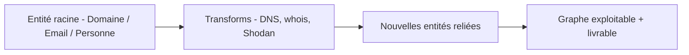

# 🕵️ Maltego — Link Analysis pour la recon OSINT

> [!info] **En 1 phrase**
> Maltego est un outil de « link analysis » qui visualise sous forme de graphe les relations entre entités (personnes, domaines, emails, IP) lors d'une recon OSINT.

---

## 🧾 Overview

| Champ | Valeur |
|---|---|
| Nom complet | Maltego (Graph / Maltego Desktop) |
| Description | Outil de link analysis : graphe interactif des entités (domaines, IP, emails, personnes, organisations) et de leurs relations, alimenté par des transforms qui interrogent des sources OSINT |
| Catégorie | Reconnaissance & OSINT |
| Sous-catégorie | Link analysis / graphe de relations |
| Fonction principale | Visualiser et enrichir les relations entre entités d'une cible |
| Type d'outil | Application de bureau (GUI) + bibliothèques/API |
| Licence | Propriétaire (Community Edition gratuite pour usage non commercial) |
| Open source / propriétaire | Propriétaire (kit de développement d'entités/transforms open source) |
| Langage(s) de programmation | Java (client), transforms en Java/Python/Perl/Node via le kit |
| Développeur / organisation | Maltego Technologies |
| Projet officiel | Maltego |
| Dépôt officiel | https://github.com/maltego |
| Documentation officielle | https://docs.maltego.com |
| Date de création | 2008 (application Maltego de l'époque) |
| État du projet | actif |
| Dernière version connue | 4.12.1 (2026-07-20) |
| Systèmes compatibles | Windows, macOS, Linux (Debian/Fedora), nécessite Java Runtime |

> [!note] Pour vérifier / compléter
> Maltego est propriétaire : la Community Edition gratuite couvre l'usage non commercial. Les versions payantes (CTID, Pro) débloquent les transform sets privés, l'intégration Radar et le support. Les versions et fonctionnalités exactes évoluent : vérifier sur le site officiel.

---

## 🎯 Concept

Maltego transforme les données de recon en **graphe interactif** : chaque élément est une *entité* (domaine, personne, email, IP, organisation) et chaque relation est un *lien*. Les **transforms** sont des plugins qui interrogent des sources (DNS, whois, Shodan, réseaux sociaux, Certificate Transparency) et créent de nouvelles entités reliées à la précédente. Idéal pour identifier qui se cache derrière une infrastructure, relier des emails à des domaines, et présenter des résultats exploitables. La **Community Edition** gratuite couvre l'essentiel (transforms publics, usage non commercial), tandis que les versions payantes (CTID, Pro) débloquent les transform sets privés et l'intégration Radar.

Sa place dans le pentest : phase de **reconnaissance / OSINT**, avant tout scan actif. Le graphe sert aussi de **livrable visuel** pour le rapport : il montre les relations de confiance, les surfaces d'attaque oubliées (sous-domaines non documentés, IP inattendues) et prépare des campagnes de phishing ciblées (cibles, emails, employés). Chaque entité peut être enrichie avec des **notes**, des **détails personnalisés** et des **tags**, ce qui facilite la reprise par le reste de l'équipe.

Les entités se répartissent en familles : **sociales** (personnes, emails, téléphones, comptes sociaux), **infrastructure** (domaines, IP, netblocks, serveurs DNS), **dossiers** (fichiers, hashtags) et **organisations**. Chaque transform produit un résultat typé qui relance la chaîne : un email donne un domaine, un domaine donne des IP, une IP donne un netblock, et ainsi de suite. Cette propagation automatique est ce qui rend le graphe vivant : la densité des liens révèle rapidement les points centraux.



---

## 🧠 Concepts fondamentaux

| Concept | Explication |
|---|---|
| Entité | Objet typé du graphe : domaine, IP, email, personne, organisation, netblock… |
| Transform | Plugin qui interroge une source (DNS, whois, Shodan, certif. de transparence) et crée des entités reliées |
| Graphe | Visualisation des entités et de leurs relations ; l'analyse de la densité révèle les points centraux |
| Link analysis | Analyse des liens pour trouver des connexions non évidentes entre éléments |
| Transform set | Groupe de transforms (public, privé, CTID…) ; certains sont réservés aux éditions payantes |
| Entity kit / Transform kit | Kits de développement pour créer ses propres entités et transforms (Java, Python…) |
| Radar | Tableau de bord de suivi des investigations (éditions avancées) |
| HXL / Export | Formats d'échange et d'export des résultats du graphe |

---

## 🛠️ Installation

### Debian / Ubuntu / Kali Linux

```bash
# Télécharger l'installateur .deb depuis le site officiel (nécessite un compte gratuit)
wget https://cdn.maltego.com/downloads/maltego.deb   # URL indicative
sudo apt install ./maltego.deb
# Prérequis : JRE 11+ (Java)
sudo apt install default-jre
```

### Arch Linux

```bash
# AUR : maltego
yay -S maltego
```

### Fedora / RHEL

```bash
# Télécharger l'installateur .rpm depuis le site officiel
sudo dnf install ./maltego.rpm   # URL indicative
```

### macOS

```bash
# Télécharger le .dmg depuis le site officiel et glisser Maltego dans Applications
open Maltego.dmg
```

### Windows

```powershell
# Télécharger l'installateur .exe depuis le site officiel (compte gratuit requis)
Invoke-WebRequest -Uri https://cdn.maltego.com/downloads/maltego.exe -OutFile maltego.exe   # URL indicative
.\maltego.exe
```

### Docker

```bash
# Pas de version Docker officielle stable du client desktop.
# L'API Maltego (fichier de transform, CTID) s'utilise sans GUI pour certains scripts.
```

> [!warning] ⚠️ Prérequis & problèmes potentiels
> - Java Runtime (JRE 11+) obligatoire : sans lui, l'application ne démarre pas.
> - Un compte (gratuit) est nécessaire au premier lancement pour s'identifier.
> - Les téléchargements passent par le site officiel : les URLs exactes peuvent changer — vérifier sur maltego.com/downloads.

---

## ⚙️ Configuration

Configuration principale : après le premier lancement (identifiants du compte), via l'interface.

| Paramètre | Rôle | Valeur possible | Impact | Exemple |
|---|---|---|---|---|
| Compte Maltego | Identification au lancement | compte gratuit ou payant | Éditions accessibles (CE, CTID, Pro) | compte CE |
| Transform sets | Sélection des transforms actifs | publics / privés / CTID | Sources interrogées | activer « DNS » et « Shodan » |
| API keys (transforms) | Clés pour les sources tierces | clé Shodan, VirusTotal… | Enrichissements des sources privées | clé API Shodan |
| Serveurs de transform | Réseau de machines exécutant les transforms | local / remote (CTID) | Vitesse et types de transforms | serveur local |
| Graphe par défaut | Entités et layout au démarrage | différents modèles | Point de départ des investigations | « Domain » template |
| Proxy réseau | Accès aux sources | host/port | Sortie réseau (SI entreprise) | 127.0.0.1:8080 |

> [!note] À vérifier
> Les libellés exacts des menus changent selon les versions. Les API keys des transforms sont généralement définies dans les paramètres des transform sets.

---

## 🏗️ Architecture interne

- **Client Java** : application de bureau multiplateforme (Windows, macOS, Linux) qui gère l'affichage du graphe, la manipulation des entités et le lancement des transforms.
- **Serveurs de transform** : machines (locales ou hébergées par Maltego, CTID) qui exécutent les transforms et renvoient les résultats au client.
- **Moteur de transforms** : chaque transform est un exécutable (Java, Python, Perl, Node…) communiquant via le protocole Maltego ; l'entrée/sortie est sérialisée au format XML.
- **Modèle d'entités** : hiérarchie typée (noms, propriétés, icônes, couleurs) définie par le schéma Maltego ; les kits permettent d'étendre le modèle.
- **Base de données locale du graphe** : persistance des investigations (graphes, entités, notes) pour reprendre un travail plus tard.
- **API Radar / CTID** : intégration des écosystèmes de collaboration et de la console de gestion des transforms.

---

## ⌨️ Commandes

### Commandes principales

```bash
# Maltego est une application graphique : pas de CLI principale.
# On lance le client :
maltego
# Les transforms s'exécutent dans l'interface (clic droit sur une entité → Run Transform).
```

| Action | Objectif | Résultat attendu |
|---|---|---|
| Lancer Maltego | Ouvrir le client | Fenêtre du graphe |
| Créer une entité | Ajouter une entité racine (domaine, email…) | Entité dans le graphe |
| Run Transform | Enrichir l'entité depuis une source | Nouvelles entités reliées |
| Expand Transforms | Lancer tous les transforms d'une catégorie | Graphe densifié |
| Export graph | Générer un livrable | Fichier PDF/PNG/CSV |
| Search | Chercher des entités/sources | Liste de résultats |

### Commandes avancées

```bash
# Fichiers de transform : un transform est un programme autonome testable en ligne de commande
# (exemple d'appel simplifié ; chaque transform reçoit ses paramètres via le protocole XML)
./my_transform.py -in Domain -value example.com > result.xml
# La console Radar et l'API permettent l'automatisation côté serveur (éditions avancées).
```

---

## 🎚️ Options et flags

| Option | Description | Exemple | Niveau |
|---|---|---|---|
| Run Transform | Lancer un transform sur une entité | clic droit → Run Transform | Basic |
| Expand Transforms | Lancer tous les transforms de la catégorie | « Expand Transforms » | Intermediate |
| New Graph | Créer une nouvelle investigation | Fichier → New | Basic |
| Import | Importer une liste d'entités (CSV, HXL) | Import Entities | Intermediate |
| Export | Exporter le graphe (PDF, PNG, CSV) | Export Graph | Basic |
| Properties | Modifier les propriétés d'une entité | panneau Properties | Intermediate |
| Notes / Tags | Annoter les entités | panneau Notes | Intermediate |
| Transform sets | Activer/désactiver les sources | Manage Transform Sets | Advanced |
| API keys | Configurer les clés des sources | Settings → API | Advanced |
| Serveurs de transform | Choisir local/remote | Settings → Servers | Advanced |
| Run Locally | Exécuter un transform sur la machine locale | option du transform | Expert |
| Radar | Suivi de l'investigation (éditions avancées) | onglet Radar | Expert |

> [!tip] Options les plus utiles au quotidien
> « Run Transform » sur une entité racine, « Expand Transforms » pour densifier le graphe, et « Export Graph » pour le livrable. « Import » permet de charger des listes (sous-domaines, emails) en masse.

---

## 🧪 Exemples pratiques

### Beginner

```bash
# 1. Lancer Maltego
# 2. Créer une entité "Domain" : example.com
# 3. Clic droit → Run Transform → "To DNS Name" (résolution DNS)
# 4. Les sous-domaines et IP apparaissent reliés au domaine
```

### Intermediate

```bash
# 1. Importer une liste de sous-domaines (CSV) en entités "DNS Name"
# 2. Lancer "To IP Address" pour mapper chaque nom vers ses IP
# 3. Sur une IP : "To Netblock" puis "To Physical Location" (géo)
# 4. Noter et tagger les entités intéressantes pour le rapport
```

### Advanced

```bash
# 1. Depuis un email : transform "To Person" puis "To Social Networks"
# 2. Depuis un domaine : "To Certificate" (Certificate Transparency) pour trouver des domaines proches
# 3. Depuis une personne : "To Email Address" (fuites, sources publiques)
# 4. Exporter le graphe en PDF/PNG pour le livrable
```

### Expert

```bash
# 1. Développer un transform maison (Python) : "To Custom API" qui interroge une source privée
# 2. Lancer le transform via le fichier de transform (test hors GUI)
./custom_transform.py -in Domain -value example.com
# 3. Déployer le transform sur un serveur local/remote et le charger dans Maltego
# 4. Automatiser une enquête via l'API Radar (éditions avancées)
```

---

## 🧪 Workflow complet (scénario pas à pas)

1. **Créer l'entité racine** — démarrer l'investigation depuis une donnée connue.
   ```bash
   # Dans Maltego : New Graph → entité "Domain" → example.com
   ```
2. **Enrichir le domaine** — lancer les transforms DNS (sous-domaines, IP).
   ```bash
   # Run Transform → To DNS Name, To IP Address
   ```
3. **Suivre l'infrastructure** — des IP vers les netblocks et la géolocalisation.
   ```bash
   # Sur une IP : To Netblock, To Physical Location
   ```
4. **Remonter aux personnes** — depuis les emails/domaines vers les profils et comptes.
   ```bash
   # To Person, To Social Networks, To Email Address
   ```
5. **Exporter le livrable** — produire le graphe pour le rapport.
   ```bash
   # Export Graph → PDF/PNG + liste CSV des entités
   ```

---

## 🎬 Scénarios avancés

### Scénario 1 : cartographie d'une infrastructure cible

```bash
# Entité "Domain" example.com
# Transforms : To DNS Name, To IP Address, To Netblock, To Certificate
# Résultat : cartographie complète domaine → IP → netblocks + certificats (dont CT)
```

### Scénario 2 : OSINT autour d'une personne

```bash
# Entité "Email Address" ou "Person"
# Transforms : To Person, To Social Networks, To Email Address, To Organization
# Résultat : réseau social et professionnel pour préparer un test d'ingénierie sociale
```

### Scénario 3 : enrichissement d'une liste de sous-domaines

```bash
# Import CSV de sous-domaines en entités "DNS Name"
# Transforms : To IP Address puis To Netblock
# Résultat : regroupement de l'infrastructure et détection de sous-domaines oubliés
```

---

## 🛡️ Cybersecurity use cases

| Phase | Utilisation |
|---|---|
| Reconnaissance | Cartographie des relations domaine/IP/netblock |
| OSINT | Collecte et croisement de données publiques (whois, CT, réseaux sociaux) |
| Énumération | Découverte de sous-domaines et de certificats via Certificate Transparency |
| Ingénierie sociale | Cartographie des employés, emails et profils pour des tests ciblés |
| Rapports | Livrable visuel du graphe d'infrastructure pour le client |

---

## 🎯 MITRE ATT&CK

| Tactique | Technique / Sub-technique | ID | Raison | Détection | Mitigation |
|---|---|---|---|---|---|
| Reconnaissance | Gather Victim Identity Information | T1589 | Collecte d'informations sur personnes/emails/organisations via les transforms OSINT | Logs des plateformes de données consultées | Politique de divulgation, veille sur les données exposées |
| Reconnaissance | Gather Victim Org Information | T1591 | Cartographie de l'infrastructure et des relations de l'organisation | Logs des sources publiques consultées | Réduction de la surface d'information publique |
| Reconnaissance | Search Open Technical Databases | T1596 | Interrogation de Certificate Transparency, whois, bases publiques via transforms | Logs des services interrogés | Surveillance des fuites, minimisation des données publiques |
| Reconnaissance | Active Scanning : Scanning IP Blocks | T1595.001 | Les IP/netblocks cartographiés préparent un scan actif | Logs réseau (balayage) | Rate limiting, firewall |

> [!note] Ne renseigner que si l'association est réellement pertinente.
> Maltego s'utilise principalement en phases passives d'OSINT : T1589, T1591, T1596. L'activité est peu détectable car elle repose sur des sources publiques tierces.

---

## 🛡️ Defensive Security

### Signes observables

| Indicateur | Détail |
|---|---|
| Pics de requêtes vers des bases OSINT (whois, CT, DNS) depuis une même IP | Corrélation possible avec une phase de recon |
| Interrogations croisées (email → domaine → IP) | Signature d'utilisation d'un outil de link analysis |
| Trafic DNS vers de nombreux sous-domaines | Cartographie de l'infrastructure |
| Téléchargements de rapports CT en volume | Recherche de certificats liés au domaine |

### Règles de détection (Sigma / Suricata / Snort / YARA)

```yaml
# Sigma — Interrogation en masse de sources OSINT depuis un endpoint
# (adaptation pédagogique ; corréler avec les logs des services publics consultés)
title: Bulk OSINT Data Collection
id: 5c8e1a2b-4d6f-4e0a-9b3c-2a8d4f6e0c71
status: test
logsource:
    product: network
detection:
    selection:
        dest_domain|endswith:
            - 'maltego.com'
            - 'virustotal.com'
            - 'shodan.io'
        # Exemple indicatif : volume anormal d'appels
    condition: selection
falsepositives:
    - Legitimate research or SOC usage
level: low
```

```yaml
# YARA — détection des fichiers/classes caractéristiques du client Maltego
rule Maltego_Client_Detection {
    meta:
        description = "Detection of Maltego client artifacts"
        author = "SOC"
    strings:
        $a = "Maltego"
        $b = "Transform"
        $c = "Entity"
    condition:
        any of them
}
```

> [!note] À vérifier
> Exemples pédagogiques : l'activité Maltego est peu détectable car elle repose sur des sources publiques tierces. Adapter aux sources de logs disponibles (proxy, EDR, logs des services).

---

## 🤖 Automatisation

```bash
# Bash — préparer une liste d'entités pour import
for d in example.com example.org; do
    echo "$d" >> domains.txt
done
# Le fichier CSV se réimporte ensuite dans Maltego (Import Entities)
```

```python
# Python — exemple de fichier de transform Maltego (protocole simplifié)
import sys, json, urllib.request

def transform(entity_type, value):
    # Interroger une source : ex. whois ou une API publique
    req = urllib.request.urlopen(f"https://example.com/api?q={value}")
    data = json.loads(req.read())
    results = []
    for item in data.get("hosts", []):
        results.append({"type": "maltego.IPAddress", "value": item})
    return results

if __name__ == "__main__":
    # Appelé par Maltego via le protocole XML ; ici exemple simplifié
    print("ok")
```

```yaml
# Planification — récupération des données à importer
# (cron) 0 8 * * 1  python3 collect_osint.py -d example.com -o entities.csv
```

> [!note] À vérifier
> Le protocole exact des fichiers de transform (XML) doit être respecté pour l'intégration réelle dans Maltego. Ceci est un exemple pédagogique simplifié.

---

## 📤 Output et parsing

```bash
# Export des entités du graphe en CSV pour parsing
# Dans Maltego : Export → Entities → CSV
# Puis en CLI :
cut -d',' -f1,2 entities.csv | head -20
# Export graph PNG/PDF pour le livrable
# Export → Graph → PNG / PDF
```

```python
# Python — parsing du CSV d'entités exporté
import csv
with open("entities.csv") as f:
    for row in csv.reader(f):
        print(row[0], "->", row[1])  # type -> valeur
```

---

## 🔗 Intégrations

- [[Tools|🧰 Outils]] global
- [[Outil - Amass|Amass]] — sources de sous-domaines à importer dans le graphe
- [[Outil - subfinder|subfinder]] — liste de sous-domaines à importer
- [[Outil - Censys|Censys]] / [[Outil - Shodan CLI|Shodan CLI]] — sources via API (transforms ou export)
- [[Outil - theHarvester|theHarvester]] — emails/domaines à croiser dans le graphe
- [[Outil - SpiderFoot|SpiderFoot]] — alternative automatisée de collecte OSINT
- [[01 - Reconnaissance|🕵️ Reconnaissance]]

```text
subfinder / theHarvester → (import) → Maltego → Export graphe → rapport
   ↓                            ↑
  Shodan / Censys / CT  ←───────┘  (transforms)
```

---

## 🔄 Alternatives

| Outil | Avantages | Inconvénients | Cas d'usage |
|---|---|---|---|
| [[Outil - SpiderFoot|SpiderFoot]] | Automatisé, CLI, gratuit | Graphe moins visuel | Collecte OSINT automatisée |
| Recon-ng | Modules modulaires, CLI | Pas de graphe interactif | Framework de recon |
| MISP / Threat intel | Partage de données, flux | Lourd pour du simple OSINT | CTI et partage |
| Casefile | Relationnel, léger | Limité aux relations | Analyse manuelle légère |
| Excel / Neo4j (maison) | Personnalisable | Mise en place longue | Graphes sur mesure |

> **Quand utiliser SpiderFoot plutôt que Maltego ?** Pour une collecte automatisée et silencieuse sans GUI. Maltego reste supérieur pour la visualisation interactive et le livrable visuel.

---

## ⚡ Performance

- Charge : le client Java est gourmand en mémoire sur les très grands graphes (des milliers d'entités).
- Les transforms distants (CTID) déportent l'exécution et réduisent la charge locale.
- L'usage de transforms en masse (Expand) peut générer beaucoup d'entités : penser à limiter par sets et par résultats.
- Pas de benchmark officiel : la performance dépend du réseau, des sources et du volume de transforms.

> [!note] À vérifier
> Aucun chiffre officiel de performance n'est publié par Maltego Technologies. Adapter les volumétries au matériel local.

---

## 🛠️ Troubleshooting

### Common problems

#### Problème : l'application ne démarre pas

- **Cause** : Java Runtime (JRE) manquant ou trop ancien.
- **Solution** : installer un JRE 11+ conforme à la version de Maltego.
- **Vérification** : `java -version` en ligne de commande.

#### Problème : les transforms ne renvoient rien

- **Cause** : source tierce (Shodan, VirusTotal…) nécessite une clé API absente ou invalide.
- **Solution** : configurer la clé dans les paramètres du transform set concerné.
- **Vérification** : tester la clé via l'API de la source.

#### Problème : le graphe est illisible (trop d'entités)

- **Cause** : transforms lancés en masse sans filtrage.
- **Solution** : limiter les sets de transforms, utiliser « Collapse » et les vues (views).
- **Vérification** : activer une vue et cacher les entités inutiles.

#### Problème : édition CE limitée (transforms privés inaccessibles)

- **Cause** : transform sets réservés aux éditions payantes (CTID, Pro).
- **Solution** : passer à l'édition supérieure ou remplacer par un transform maison local.
- **Vérification** : comparer les sets disponibles selon l'édition.

---

## 🔐 Sécurité de l'outil

- **Collecte passive** : Maltego interroge des sources publiques tierces : l'activité est peu visible par la cible.
- **Clés API** : stocker les clés (Shodan, VirusTotal…) de manière sécurisée ; certaines évoluent selon les éditions.
- **Données** : le graphe contient des informations sensibles sur des personnes : à traiter avec prudence et dans un cadre autorisé.
- **Exécution des transforms** : ne charger que des transforms de confiance (sécurité de l'exécution du code).
- **Usage légal** : l'OSINT reste soumis aux règles (RGPD pour les données personnelles, autorisation des tests).

---

## ⚠️ Limitations

- Outil propriétaire : les fonctionnalités avancées (CTID, Radar) sont payantes.
- Client Java gourmand en ressources sur les grands graphes.
- Dépendance aux sources tierces : les transforms peuvent échouer si une API change ou impose une clé payante.
- Pas de CLI native pour l'automatisation complète de l'investigation.
- Usage non commercial restreint dans la Community Edition.

---

## 📋 Cheatsheet

```bash
# Démarrage
maltego

# Workflow type
# 1. New Graph
# 2. Entité "Domain" → example.com
# 3. Run Transform : To DNS Name / To IP Address
# 4. To Netblock / To Certificate
# 5. Export Graph → PDF/PNG + CSV

# Test d'un transform local (fichier de transform)
./my_transform.py -in Domain -value example.com
```

---

## ⚡ Quick reference

| | |
|---|---|
| **À quoi sert-il ?** | Visualiser les relations entre entités (domaines, IP, emails, personnes) lors d'une recon OSINT |
| **Quand l'utiliser ?** | Phase de reconnaissance passive, avant tout scan actif |
| **Commande principale** | Lancer Maltego, créer une entité, Run Transform |
| **Alternative principale** | SpiderFoot (automatisé), Recon-ng (CLI) |
| **Concepts importants** | Entités, transforms, graphe, link analysis, transform sets, CTID |
| **Liens associés** | [[Outil - SpiderFoot]] · [[Outil - theHarvester]] · [[Outil - Shodan CLI]] · [[Outil - Censys]] |

---

## 🔍 Détection & Défense

| Signe | Défense |
|---|---|
| Pics de requêtes vers bases OSINT (whois, CT, DNS) | Veille sur l'exposition des données publiques |
| Interrogations croisées email → domaine → IP | Corrélation des logs des sources consultées |
| Volume de requêtes DNS sur de nombreux sous-domaines | Monitoring DNS anormal |
| Téléchargements de rapports CT | Surveillance des nouveaux certificats (certificate transparency) |

---

## ⚠️ Tips & Pièges

> [!tip] 💡 **Tips**
> - Commence par « Expand Transforms » sur une entité pour densifier le graphe, puis affine.
> - Importe tes listes (sous-domaines, emails) en CSV pour les transformer en entités en masse.
> - Utilise les vues (views) et « Collapse » pour garder un graphe lisible sur les grosses investigations.
> - Exporte le graphe en PDF/PNG : c'est un excellent livrable pour le rapport.

> [!warning] ⚠️ **Pièges**
> - L'édition CE ne donne pas accès à tous les transforms (privés/payants).
> - Un graphe sans filtrage devient vite illisible : limite les sets et le volume de résultats.
> - Les données personnelles collectées (RGPD) : à traiter avec prudence et dans un cadre autorisé.
> - Les transforms dépendent de sources tierces : une clé API invalide ou une API modifiée casse l'enrichissement.

---

## 📚 References

### Official

- Site officiel Maltego : https://www.maltego.com
- Téléchargements : https://www.maltego.com/downloads/
- Documentation : https://docs.maltego.com
- GitHub (kits et communauté) : https://github.com/maltego

### Security references

- MITRE ATT&CK T1589 — Gather Victim Identity Information : https://attack.mitre.org/techniques/T1589/
- MITRE ATT&CK T1591 — Gather Victim Org Information : https://attack.mitre.org/techniques/T1591/
- MITRE ATT&CK T1596 — Search Open Technical Databases : https://attack.mitre.org/techniques/T1596/

### Community

- Maltego Community (forum) : https://maltego.help
- Blog Maltego : https://www.maltego.com/blog/
- OSINT Framework (annuaire de sources) : https://osintframework.com

---

➡️ **Liens :** [[Tools|🧰 Outils]] · [[Outil - theHarvester|theHarvester]] · [[Outil - SpiderFoot|SpiderFoot]] · [[01 - Reconnaissance|🔎 Reconnaissance]]
