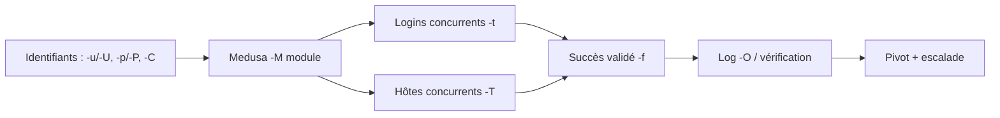
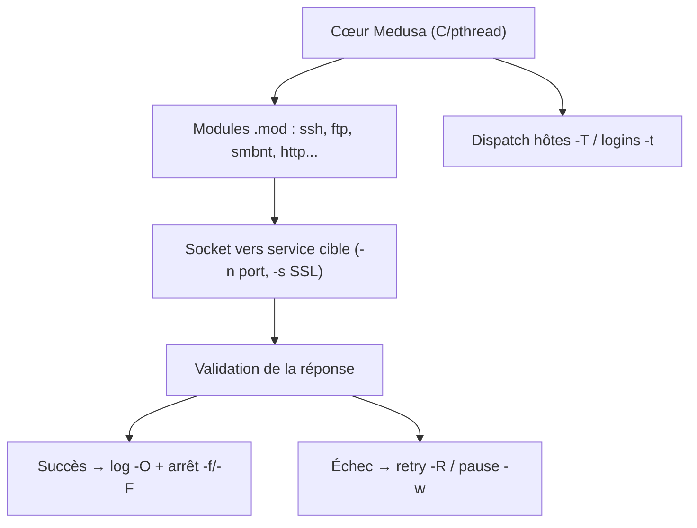

# Medusa — Brute-force en ligne massivement parallèle

> [!info] **En 1 phrase**
> Medusa = brute-force en ligne **massivement parallèle**, alternative moins connue à hydra, pilotée par modules (`-M`) avec un contrôle fin du threading.

---

## Overview

| Champ | Valeur |
|---|---|
| Nom complet | Medusa Parallel Network Login Auditor |
| Description | Brute-force d'authentification réseau parallèle et modulaire : test de couples utilisateur/mot de passe sur de nombreux services (SSH, FTP, SMB/NTLM, HTTP, RDP, VNC, MSSQL, MySQL, PostgreSQL…) |
| Catégorie | Exploitation & Cracking |
| Sous-catégorie | Attaque de mots de passe en ligne |
| Fonction principale | Tester massivement des identifiants sur des services exposés, avec parallélisme multi-hôtes |
| Type d'outil | CLI |
| Licence | GPL-2.0 |
| Open source / propriétaire | Open source |
| Langage(s) de programmation | C (threads pthread) + modules `.mod` compilés |
| Développeur / organisation | Joe Mondloch (JoMo-Kun), Foofus Networks |
| Projet officiel | jmk-foofus/medusa |
| Dépôt officiel | https://github.com/jmk-foofus/medusa |
| Documentation officielle | https://jmk-foofus.github.io/medusa/medusa.html |
| Date de création | 2005 (version 1.0) |
| État du projet | actif (reprise en 2025 après 10 ans de dormance) |
| Dernière version connue | 2.3 (14 mai 2025) |
| Systèmes compatibles | Linux / macOS (builds testés sur Debian, Ubuntu, Kali, Fedora, BackBox) |

> [!note] Pour vérifier / compléter
> Champs laissés vides si l'information n'est pas confirmée par une source officielle.

---

## Concept

Medusa appartient à la même famille que [[Outil - hydra]] : tester des couples user/mot de passe sur un service distant. Sa particularité est le **parallélisme massif basé sur pthread** : les logins sont testés en concurrence (`-t`) et plusieurs hôtes peuvent être attaqués simultanément (`-T`), avec un partage des dictionnaires sans duplication mémoire (contrairement à hydra qui forke un processus par cible). L'architecture **modulaire** — chaque service est un module `.mod` indépendant — rend l'ajout de protocoles simple et n'exige aucune modification du cœur de l'outil.

Historiquement, Medusa est né en 2005 chez Foofus Networks de la frustration avec la stabilité d'hydra, puis est resté sans release pendant près de dix ans avant la sortie de la **version 2.3 (mai 2025)**, à l'occasion du 20ᵉ anniversaire du projet : migration vers OpenSSL 3.x, support **SMBv2/3 et SMB signing** via libsmb2, et conservation du **pass-the-hash** dans le module `smbnt`.

Dans un pentest, il se place en **phase d'exploitation / accès initial** : une fois un service exposé identifié (via [[Outil - Nmap]]), il teste les identifiants faibles. Sa gestion multi-hôtes le rend adapté au **credential stuffing** et au **password spraying** sur un parc de machines. Son point faible reste une documentation et une communauté plus restreintes que hydra : il faut vérifier les options de chaque module avec `medusa -M <module> -q` avant une campagne.



---

## Concepts fondamentaux

| Concept | Explication |
|---|---|
| **Thread vs processus** | Medusa est pthread-based : un thread par tentative, partage mémoire des listes ; hydra fork des processus (plus de surcharge sur de gros dictionnaires) |
| **Module `.mod`** | Chaque service (ssh, ftp, smbnt…) est un module compilé indépendant ; `medusa -d` liste les modules installés |
| **Parallélisme `-t` vs `-T`** | `-t` = logins testés en concurrence sur un hôte ; `-T` = hôtes testés en concurrence |
| **Credential stuffing** | Rejeu d'identifiants issus d'une fuite (`-C combo` ou `-U/-P`) |
| **Password spraying** | Un mot de passe probable sur de nombreux comptes (`-U users.txt -p MotDePasse`), avec `-w` pour espacer les tentatives |
| **Pass-the-hash** | Le module `smbnt` accepte un hash NT comme « mot de passe » pour s'authentifier sans le clair |
| **Lockout policy** | Politique de verrouillage de comptes : impose ralentissements (`-w`, `-r`) et évite les rafales |
| **Formats d'entrée** | `-C fichier` accepte des combinaisons `host:user:pass[:module]` pour des ciblages précis |

---

## Installation

### Debian / Ubuntu / Kali Linux

```bash
sudo apt update && sudo apt install -y medusa
medusa -V
```

### Arch Linux

```bash
sudo pacman -S medusa
```

### Fedora / RHEL

```bash
sudo dnf install medusa
```

### macOS

```bash
brew install medusa
# Alternative : compilation avec OpenSSL 3 (Homebrew)
git clone https://github.com/jmk-foofus/medusa.git && cd medusa
./configure --with-ssl=/opt/homebrew/opt/openssl@3
make && sudo make install
```

### Windows

```powershell
# Pas de binaire officiel Windows : utiliser WSL2 ou une VM Kali
# wsl --install -d Kali-Linux, puis :
wsl sudo apt update && wsl sudo apt install -y medusa
```

### Docker

```bash
docker run --rm -it kalilinux/kali-rolling bash -c "apt update && apt install -y medusa && medusa -d"
```

### Compilation depuis les sources

```bash
git clone https://github.com/jmk-foofus/medusa.git && cd medusa
./configure && make && sudo make install
medusa -d   # liste les modules disponibles
```

> [!warning] Prérequis & problèmes potentiels
> Dépendances par module : `libssl` (OpenSSL), `libpq` (PostgreSQL), `libssh2` (SSH), `libsmb2` (SMBv2/3, non packagé partout), `libsvn` (SVN), `freerdp3-dev` (RDP). Sur Debian/Ubuntu : `build-essential automake libssl-dev libpq-dev libssh2-1-dev libsvn-dev freerdp3-dev`. Sans `libsmb2`, le module `smbnt` ne gère que SMBv1.

---

## Configuration

Medusa n'a pas de fichier de configuration global : tout se passe en arguments CLI. Les « paramètres de module » (`-m`) sont le seul levier de réglage par service.

| Paramètre | Rôle | Valeur possible | Impact | Exemple |
|---|---|---|---|---|
| `-m <param>` | Paramètre propre au module | dépend du module | Conditionne le comportement du module | `-M http -m "GET:/admin"`, `-M smbnt -m "PASS:DOMAIN"` |
| `-t <n>` | Logins testés en concurrence | 1-… | Vitesse vs charge réseau | `-t 4` |
| `-T <n>` | Hôtes testés en concurrence | 1-… | Vitesse vs charge globale | `-T 10` |
| `-w <s>` | Pause entre tentatives | secondes | Anti-lockout | `-w 60` |
| `-r <s>` / `-R <n>` | Délai entre retries / nb de retries | s / n | Robustesse réseau | `-r 3 -R 2` |
| `-O <fichier>` | Fichier de log des résultats | chemin | Reprise et audit | `-O ssh.log` |
| `-Z <carte>` | Reprendre un scan depuis une carte de scan précédente | chemin | Reprise de campagne | `-Z scan.map` |

---

## Architecture interne

Medusa est écrit en C et s'appuie sur **pthread** pour paralléliser les tentatives. L'outil charge au démarrage les modules `.mod` présents dans `/usr/local/lib/medusa/modules` (ou le dossier courant). Chaque module implémente des fonctions d'initialisation, de test d'une authentification et de finalisation ; le cœur orchestre les threads, la répartition des tâches entre hôtes et la gestion des sockets (vérification de disponibilité `-c`, timeouts). Les modules communiquent avec le cœur via un contrat d'interface défini dans les en-têtes C partagés.

Au moment de l'exécution : (1) le cœur lit les cibles (`-h`/`-H`/`-C`), les identifiants (`-u`/`-U`/`-p`/`-P`/`-C`), (2) les threads dispatchés par hôte ouvrent des connexions aux ports (module par défaut ou `-n`), (3) chaque tentative est validée par la réponse du service, (4) les succès sont logués (`-O`) et stoppent l'hôte si `-f` (ou tout l'audit si `-F`). Le module `smbnt` illustre la complexité interne : support des modes LMv1/LMv2/NTLMv1/NTLMv2, négociation de signing, et hash-passing — en 2.3 il bascule sur **libsmb2** pour SMBv2/3 avec autodétection du protocole.



---

## Commandes

### Commandes principales

```bash
# Syntaxe générale
medusa [-h hôte|-H fichier] [-u user|-U fichier] [-p pass|-P fichier] [-C fichier] -M module [OPT]

# SSH : un user + dictionnaire, 4 logins concurrents, stop au premier succès
medusa -h 10.10.20.15 -u admin -P pass.txt -M ssh -t 4 -f

# Multi-hôtes : tous les hôtes de hosts.txt, 2 logins/hôte, 10 hôtes en parallèle
medusa -H hosts.txt -U users.txt -P pass.txt -M ftp -t 2 -T 10

# HTTP Basic sur une URL précise
medusa -h 10.10.20.15 -u admin -P pass.txt -M http -m "GET:/admin" -f

# Combinaisons user:pass d'une fuite (credential stuffing) sur SMB
medusa -h 10.10.20.15 -C combos.txt -M smbnt -f
```

| Commande | Objectif | Résultat attendu |
|---|---|---|
| `medusa -h cible -U users -P pass -M ssh` | Bruteforce SSH | Succès/échecs par couple |
| `medusa -H fichier -U users -P pass -M ftp` | Bruteforce FTP multi-hôtes | Couples valides par hôte |
| `medusa -h cible -u admin -P pass -M http -m "GET:/admin"` | HTTP Basic auth | Accès validé affiché |
| `medusa -h cible -C combos.txt -M smbnt` | Rejeu de fuite (combo) | Identifiants encore valides |
| `medusa -h cible -U users -p 'MotDePasse' -M rdp -n 3389` | Password spraying RDP | Comptes utilisant ce mot de passe |

### Commandes avancées

```bash
# Spray anti-lockout : un mot de passe, beaucoup de comptes, pause 60 s
medusa -H hosts.txt -U users.txt -p 'MotDePasse2026!' -M smbnt -w 60 -f

# Tests supplémentaires : n=null, s=same user, r=user inversé
medusa -h 10.10.20.15 -U users.txt -P pass.txt -M ssh -e nsr -f

# Port custom + SSL + log
medusa -h 10.10.20.15 -n 2222 -s -U users.txt -P pass.txt -M ssh -f -O ssh.log

# VNC avec gestion de l'anti-bruteforce RealVNC (délai max 30 s)
medusa -h 10.10.20.15 -u '' -P pass.txt -M vnc -m "MAXSLEEP:30" -f
```

---

## Options et flags

| Option | Description | Exemple | Niveau |
|---|---|---|---|
| `-h <hôte>` / `-H <fichier>` | Cible unique / liste de cibles | `-H hosts.txt` | Basic |
| `-u <user>` / `-U <fichier>` | Un utilisateur / une liste | `-U users.txt` | Basic |
| `-p <pass>` / `-P <fichier>` | Un mot de passe / un dictionnaire | `-P rockyou.txt` | Basic |
| `-C <fichier>` | Fichier de combinaisons `host:user:pass[:module]` | `-C combos.txt` | Advanced |
| `-M <module>` | Module d'attaque (`-d` pour lister) | `-M ssh` | Basic |
| `-m <param>` | Paramètre du module | `-m "GET:/admin"` | Intermediate |
| `-t <n>` | Logins testés en concurrence | `-t 4` | Intermediate |
| `-T <n>` | Hôtes testés en concurrence | `-T 10` | Advanced |
| `-L` | Paralléliser par utilisateur (1 user/thread) | `-L` | Expert |
| `-f` | Stop de l'hôte après le 1er succès | `-f` | Basic |
| `-F` | Stop de tout l'audit après le 1er succès | `-F` | Advanced |
| `-e nsr` | Tests suppl. : n=null, s=user, r=user inversé | `-e ns` | Intermediate |
| `-n <port>` | Port non standard | `-n 2222` | Intermediate |
| `-s` | Active SSL/TLS | `-s` | Intermediate |
| `-w <s>` | Pause entre tentatives (anti-lockout) | `-w 60` | Advanced |
| `-r <s>` / `-R <n>` | Délai / nombre de retries | `-r 3 -R 2` | Advanced |
| `-O <fichier>` | Fichier de log des résultats | `-O ssh.log` | Intermediate |
| `-Z <carte>` | Reprise d'un scan (map) | `-Z scan.map` | Expert |
| `-d` | Liste les modules disponibles | `-d` | Basic |
| `-q` | Affiche l'usage d'un module (`-M <mod> -q`) | `-M smbnt -q` | Intermediate |
| `-V` | Version | `-V` | Basic |

> [!tip] Options les plus utiles au quotidien
> `-d` (liste des modules), `-M <module> -q` (options du module), `-t` (concurrence logins), `-T` (concurrence hôtes), `-f` (stop au premier succès), `-O` (log propre).

---

## Exemples pratiques

### Beginner

```bash
# Objectif : brute-force SSH avec un dictionnaire réduit
medusa -h 10.10.20.15 -u admin -P /usr/share/wordlists/rockyou.txt -M ssh -t 4 -f
# Objectif : FTP multi-utilisateurs
medusa -h 10.10.20.15 -U users.txt -P pass.txt -M ftp -f
```
Résultat attendu : `ACCOUNT FOUND` pour les couples valides. Erreur fréquente : module indisponible → lancer `medusa -d` pour vérifier qu'il est compilé.

### Intermediate

```bash
# Objectif : HTTP Basic auth sur un portail interne
medusa -h 10.10.20.15 -u admin -P pass.txt -M http -m "GET:/admin.php" -t 8 -f
# Objectif : rejeu de paires user:pass d'une fuite
medusa -h 10.10.20.15 -C fuite_combos.txt -M ssh -t 4 -f
```
Le format de `-C` est `host:user:pass` (le module peut être précisé en 4ᵉ champ).

### Advanced

```bash
# Objectif : password spraying SMB sur tout un parc sans verrouiller les comptes
medusa -H hosts.txt -U users.txt -p 'Eté2026!' -M smbnt -w 90 -t 1 -T 4 -f -O spray.log
# Objectif : campagne multi-modules sur une même machine
medusa -h 10.10.20.30 -U users.txt -P pass.txt -M ssh  -t 4 -O ssh.log  &
medusa -h 10.10.20.30 -U users.txt -P pass.txt -M ftp  -t 4 -O ftp.log  &
wait
grep "SUCCESS" ssh.log ftp.log
```

### Expert

```bash
# Objectif : vérifier le hash-passing SMB sur le domaine
medusa -h 10.10.20.15 -u admin -p 'aad3b435b51404eeaad3b435b51404ee:8846f7eaee8fb117ad06bdd830b7586c' -M smbnt -m "GROUP:DOMAIN" -f
# Objectif : reprendre une campagne interrompue
medusa -Z scan.map -H hosts.txt -U users.txt -P pass.txt -M ssh -O ssh.log -f
```

---

## Workflow complet (scénario pas à pas)

1. **Reconnaissance** — identifier les services exposés sur le parc.
   ```bash
   nmap -sV -p22,21,445,3389,443 10.10.20.0/24
   ```
2. **Découverte d'un compte** — un user `backup` trouvé dans une note publique d'un wiki interne.
3. **Bruteforce ciblé FTP** — dictionnaire adapté, parallélisme prudent.
   ```bash
   medusa -h 10.10.20.20 -u backup -P /usr/share/wordlists/rockyou.txt -M ftp -t 3 -f
   ```
   → couple `backup:backup2024` validé.
4. **Credential stuffing** — réutiliser le couple sur tous les hôtes du fichier `hosts.txt`.
   ```bash
   medusa -H hosts.txt -u backup -p backup2024 -M ssh -f
   ```
5. **Vérification et pivot** — confirmer les accès (SSH, lecture de fichiers), puis pivoter (voir [[Techniques/Pivoting et Tunneling]]).
   ```bash
   ssh backup@10.10.20.31 -i cle.pem   # exemple de vérification manuelle
   ```

---

## Scénarios avancés

### Scénario 1 : Password spraying anti-lockout sur un domaine

Un mot de passe probable (`'Eté2026!'`) sur de nombreux comptes, avec une pause de 90 s pour ne pas déclencher les verrouillages de comptes.

```bash
medusa -H dc.acme.local -U users.txt -p 'Eté2026!' -M smbnt -m "GROUP:DOMAIN" -w 90 -t 1 -f -O spray.log
```
Le log `spray.log` consolide les comptes valides ; on peut ensuite pivoter avec [[Outil - Evil-WinRM]] ou [[Outil - CrackMapExec]].

### Scénario 2 : Attaque multi-modules consolidée sur un parc

Paralléliser plusieurs services en tâches de fond et consolider les logs `-O`.

```bash
for host in 10.10.20.30 10.10.20.31 10.10.20.32; do
  medusa -h "$host" -U users.txt -P pass.txt -M ssh -t 4 -O "ssh_$host.log" &
  medusa -h "$host" -U users.txt -P pass.txt -M vnc -t 4 -O "vnc_$host.log" &
done
wait
cat ssh_*.log vnc_*.log | grep "ACCOUNT FOUND"
```
Stratégie : commencer par un seul service et un dictionnaire réduit avant d'élargir — les logs permettent de reprendre sans rejouer les tentatives épuisées.

### Scénario 3 : Validation de mot de passe par défaut sur des équipements réseau

Un parc d'équipements avec comptes par défaut (`admin:admin`, `cisco:cisco`…).

```bash
medusa -H equipements.txt -u admin -P /usr/share/seclists/Passwords/default-passwords.txt -M telnet -t 4 -f
medusa -H equipements.txt -u admin -P default-passwords.txt -M ssh -n 22 -f
```

---

## Cybersecurity use cases

| Phase | Utilisation |
|---|---|
| Accès initial | Validation d'identifiants faibles sur des services exposés |
| Énumération | Test de comptes par défaut (`-e nsr`), comptes de service |
| Exploitation | Obtention d'un accès légitime (T1078) après brute-force |
| Mouvement latéral | Réutilisation des couples sur d'autres hôtes du parc |
| Exfiltration / impact | Accès aux ressources protégées par les identifiants trouvés |

---

## MITRE ATT&CK

| Tactique | Technique / Sub-technique | ID | Raison | Détection | Mitigation |
|---|---|---|---|---|---|
| Credential Access | Brute Force : Password Guessing | T1110.001 | Test systématique de mots de passe sur un compte | Alertes sur échecs d'authentification (Event 4625) | Mots de passe forts, lockout |
| Credential Access | Brute Force : Password Spraying | T1110.003 | Un mot de passe sur plusieurs comptes (`-U -p`) | Corrélation des pics d'échecs par compte | MFA, comptes à privilèges minimes |
| Credential Access | Brute Force : Credential Stuffing | T1110.004 | Rejeu de fuites (`-C combos`) | Alertes sur logins réussis anormaux depuis IP inconnue | MFA, rotation après fuite |
| Initial Access | Valid Accounts | T1078 | Utilisation des identifiants trouvés | UBA / détection de comportement inhabituel | Détection de compromission de comptes |
| Lateral Movement | Remote Services | T1021 | Pivot avec les identifiants sur SSH/RDP/SMB | Corrélation des sessions réseau | Segmentation, MFA pour services distants |

> [!note] Ne renseigner que si l'association est réellement pertinente.

---

## Defensive Security

### Signes observables

| Indicateur | Détail |
|---|---|
| Rafales de tentatives d'authentification depuis une même IP | Volumes anormaux d'Event 4625 (Windows) ou de `Failed password` (auth.log) |
| Échecs sur plusieurs services en même temps | Corréler SSH + FTP + RDP vers la même source |
| Verrouillages de comptes (Event 4740 Windows) | Conséquence directe d'un bruteforce non maîtrisé |
| Un seul mot de passe testé sur beaucoup de comptes | Pattern typique de password spraying |
| Connexions RDP/SSH simultanées multiples | Sessions multiples anormales sur un hôte |

### Règles de détection (Sigma / Suricata / Snort / YARA)

```yaml
# Exemple Sigma : lockout policy (Windows) — compte verrouillé après bruteforce
title: Account Lockout Triggered
id: 7f8d2a5e-9c41-4e6f-8b2a-1d3c5e7f9a01
status: experimental
logsource:
  product: windows
  service: security
detection:
  selection:
    EventID: 4740
  condition: selection
level: high
tags:
  - attack.t1110
```

```bash
# Exemple Suricata : détection des rafales d'échecs SSH depuis une même source
alert tcp any any -> any 22 (msg:"Potential SSH brute force"; \
  flow:established,to_server; content:"Password"; \
  threshold: type both, track by_src, count 10, seconds 60; \
  sid:20260002; rev:1;)
```

---

## Automatisation

```bash
# Script : spray sur un parc avec gestion du lockout et log horodaté
date_suffix=$(date +%Y%m%d_%H%M)
medusa -H hosts.txt -U users.txt -p 'MotDePasse2026!' -M smbnt \
  -w 60 -t 1 -T 8 -f -O "spray_${date_suffix}.log"
grep "ACCOUNT FOUND" "spray_${date_suffix}.log" | awk '{print $4}' > valid_accounts.txt
```

```python
# Orchestration : générer les combos -C depuis un dump de fuite, puis lancer Medusa
import csv, subprocess

with open("fuite.csv") as fh:
    rows = list(csv.DictReader(fh))
combos = ["10.10.20.15:{}:{}:ssh".format(r["user"], r["hash"]) for r in rows if r.get("hash")]
open("combos.txt", "w").write("\n".join(combos))

subprocess.run(["medusa", "-h", "10.10.20.15", "-C", "combos.txt",
                "-M", "ssh", "-t", "4", "-f", "-O", "stuffing.log"], check=True)
```

---

## Output et parsing

La sortie de Medusa affiche pour chaque tentative son statut (`ACCOUNT FOUND`, `ACCOUNT RE-USE`, erreur) et, avec `-O`, journalise tout dans un fichier texte. Il n'y a pas de format JSON natif : on parse le texte ou on passe par les logs.

```bash
# Extraire les couples valides d'un log Medusa
grep "ACCOUNT FOUND" spray.log | sed -E 's/.*host: ([^ ]+).*user: ([^ ]+) (.*)/\1:\2/' | sort -u
# Compter les échecs par hôte (volume = signal)
grep -c "FAILED" ssh_10.10.20.30.log
```

```python
# Parsing Python d'un log Medusa
import re
pattern = re.compile(r"ACCOUNT FOUND:.*?\[host\] (\S+) \[user\] (\S+) \[password\] (\S+)")
found = []
with open("ssh.log") as fh:
    for line in fh:
        m = pattern.search(line)
        if m:
            found.append(tuple(m.groups()))
print(f"{len(found)} comptes valides : {found}")
```

---

## Intégrations

```text
Nmap -sV → service exposé → Medusa -M <module> → identifiants valides → CrackMapExec / Evil-WinRM / Impacket → SIEM
```

- [[Tools| Outils]]
- [[Outil - hydra]] — alternative majeure (plus de modules, syntaxe différente)
- [[Outil - ncrack]] — alternative orientée haute vitesse / timing templates
- [[Outil - Patator]] — alternative pour conditions de succès fines
- [[Outil - Nmap]] — détection des services ciblés
- [[Outil - CrackMapExec]] / [[Outil - Evil-WinRM]] — exploitation des identifiants SMB/WinRM
- [[Outil - Impacket]] — réutilisation des accès (psexec, wmiexec)
- [[Outil - Responder]] — capture de hashes complémentaire

---

## Alternatives

| Outil | Avantages | Inconvénients | Cas d'usage |
|---|---|---|---|
| [[Outil - hydra]] | Plus de modules, communauté/doc massive | Fork par hôte (surcharge), moins stable sur gros dicts | Bruteforce polyvalent multi-protocoles |
| [[Outil - ncrack]] | Connexions parallèles par hôte, timing templates | Modules moins nombreux, non maintenu depuis 2019 | Haute vitesse sur services tolérants |
| [[Outil - Patator]] | Conditions de succès fines, log JSON, resume | Syntaxe non standard (positions FILE0) | Fuzzing et logins personnalisés |
| [[Outil - Kerbrute]] | Silencieux pour Kerberos (pas de lockout) | Limitée à Kerberos | Spraying AD sans bruit |
| **Quand utiliser Medusa plutôt que hydra ?** | Pour des campagnes multi-hôtes très parallèles et stables sur de gros dictionnaires, ou pour le hash-passing SMB via le module `smbnt`. | | |

---

## Performance

Medusa utilise **pthread** : les listes d'utilisateurs/mots de passe sont partagées en mémoire entre threads (pas de duplication comme avec les forks d'hydra), ce qui réduit fortement la surcharge sur de gros dictionnaires. `-t` contrôle les logins concurrents par hôte, `-T` les hôtes concurrents ; une valeur `-T` trop élevée sature le réseau et peut faire tomber la cible (à éviter hors lab). Chaque tentative consomme une connexion TCP : sur des services à coût d'authentification élevé (SSH, RDP), le facteur limitant est souvent le serveur, pas Medusa. L'option `-c` règle le délai d'attente de vérification de socket (défaut 500 µs) et `-L` parallélise par utilisateur pour équilibrer la charge. Chiffres indicatifs uniquement : des tests communautaires placent Medusa au même niveau que hydra en débit brut, avec une meilleure stabilité sur les longues campagnes.

---

## Troubleshooting

### Common problems

#### Problème : « No such module found »

- **Cause** : le module n'a pas été compilé (dépendance manquante) ou le dossier des modules est mal configuré.
- **Solution** : installer les dépendances du module puis recompiler ; vérifier le chemin avec `medusa -d`.
- **Vérification** : `medusa -d` liste-t-il le module ? Existe-t-il dans `/usr/local/lib/medusa/modules` ?

#### Problème : timeouts massifs / faux échecs

- **Cause** : `-t` trop élevé sur un service qui limite les connexions, ou firewalld qui droppe.
- **Solution** : baisser `-t`, ajouter `-r 3 -R 2`, vérifier avec `-c` le délai de socket.
- **Vérification** : une tentative unique fonctionne-t-elle (ex. `ssh admin@10.10.20.15`) ?

#### Problème : comptes verrouillés pendant la campagne

- **Cause** : trop de tentatives sur le même compte (pas de `-w`, dictionnaire trop gros).
- **Solution** : `-w 60`, limiter `-t`, passer en mode spray (`-U -p`).
- **Vérification** : Event 4740 sur la cible Windows / `faillock` sur Linux.

#### Problème : le module `smbnt` échoue sur des cibles modernes

- **Cause** : SMBv1 désactivé côté cible et Medusa sans libsmb2.
- **Solution** : compiler avec `libsmb2` (SMBv2/3, signing) ou basculer sur [[Outil - CrackMapExec]].
- **Vérification** : `medusa -M smbnt -q` affiche-t-il les options de négociation ?

---

## Sécurité de l'outil

- **Usage autorisé uniquement** : Medusa est un outil de test d'intrusion ; toute campagne doit avoir un périmètre écrit. Les verrouillages de comptes peuvent constituer un DoS d'authentification.
- **Privilèges** : aucun privilège root n'est requis, ce qui limite la surface d'attaque du binaire ; exécuter avec un utilisateur dédié dans un lab.
- **Fichiers sensibles** : les logs `-O` et les cartes `-Z` contiennent des identifiants valides — les chiffrer et les supprimer après l'engagement.
- **Binaire non signé** : les builds maison ne sont pas signés ; vérifier les checksums des sources GitHub et compiler depuis le dépôt officiel.
- **Aucune télémétrie** : Medusa ne remonte aucune donnée ; en revanche le trafic généré est très visible (rafales de connexions) et doit être routé prudemment (`-w`, débits faibles).

---

## Limitations

- **Pas de support des services non prévus** : chaque protocole nécessite un module `.mod` compilé (plus de 24 modules, mais pas d'extension à chaud).
- **Documentation limitée** : la man page et le README sont moins détaillés que ceux d'hydra ; certaines options de module ne sont documentées que par `-q`.
- **Windows non supporté nativement** (build expérimental, WSL2 recommandé).
- **Dépendances lourdes** : libsmb2 et FreeRDP ne sont pas packagés partout.
- **Aucun timing template type Nmap** : le contrôle du débit se fait manuellement (`-w`, `-t`).
- **Les protocoles applicatifs complexes** (formulaires web multi-étapes) sont mieux servis par [[Outil - Patator]] ou Burp.

---

## Cheatsheet

```bash
# Lister les modules et voir les options d'un module
medusa -d
medusa -M smbnt -q

# Bruteforce simple
medusa -h 10.10.20.15 -u admin -P pass.txt -M ssh -t 4 -f
medusa -h 10.10.20.15 -U users.txt -P pass.txt -M ftp -f

# Multi-hôtes
medusa -H hosts.txt -U users.txt -P pass.txt -M ssh -t 2 -T 10

# HTTP Basic / VNC / RDP
medusa -h 10.10.20.15 -u admin -P pass.txt -M http -m "GET:/admin" -f
medusa -h 10.10.20.15 -u '' -P pass.txt -M vnc -f
medusa -h 10.10.20.15 -U users.txt -P pass.txt -M rdp -n 3389 -f

# Tests supplémentaires + port custom + SSL
medusa -h 10.10.20.15 -U users.txt -P pass.txt -M ssh -e ns -n 2222 -s -f

# Spray anti-lockout
medusa -H hosts.txt -U users.txt -p 'MotDePasse2026!' -M smbnt -w 60 -f

# Log + reprise
medusa -h 10.10.20.15 -U users.txt -P pass.txt -M ssh -O ssh.log -f
medusa -Z ssh.log -H hosts.txt -U users.txt -P pass.txt -M ssh
```

---

## Quick reference

| | |
|---|---|
| **À quoi sert-il ?** | Brute-force d'authentification parallèle multi-hôtes par modules |
| **Quand l'utiliser ?** | Service exposé identifié, phase exploitation/accès initial |
| **Commande principale** | `medusa -h <cible> -U users -P pass -M <module> -f` |
| **Alternative principale** | [[Outil - hydra]] |
| **Concepts importants** | Modules `.mod`, `-t`/`-T`, credential stuffing, password spraying, pass-the-hash |
| **Liens associés** | [[Outil - hydra]] · [[Outil - ncrack]] · [[Outil - CrackMapExec]] |

---

## Détection & Défense

| Signe | Défense |
|---|---|
| Rafales d'échecs d'authentification | Lockout policy + rate limiting par IP |
| Multiples services attaqués en parallèle | Corrélation SIEM des logs d'authentification |
| Un seul mot de passe sur de nombreux comptes | Alertes sur pics d'échecs par compte, MFA |
| Connexions depuis une IP anormale | Blocage pare-feu après N échecs (fail2ban) |
| Comptes de service à mots de passe faibles | Mots de passe forts + rotation, moindre privilège |
| Verrouillages de comptes répétés (Event 4740) | Révision des politiques de verrouillage |

---

## Tips & Pièges

> [!tip] **Tips**
> - Pour un **spray** (anti-lockout), utilise `-U users.txt -p MotDePasse` plutôt que `-P`.
> - Vérifie les modules avec `medusa -d` et leurs options avec `medusa -M <module> -q`.
> - Utilise `-O` pour logguer proprement et pouvoir reprendre une campagne.
> - `-e nsr` valide les comptes vides/par défaut (null, user=pass, user inversé) en un seul passage.

> [!warning] **Pièges**
> - Ne confonds pas `-t` (logins concurrents) et `-T` (hôtes concurrents) : un `-T` trop élevé sature le réseau.
> - `-w` est en secondes, `-r` aussi : un `-w` omis avec un gros dictionnaire verrouille les comptes.
> - Le module `smbnt` sans libsmb2 ne gère que SMBv1 : cibles modernes → compiler avec libsmb2 ou utiliser [[Outil - CrackMapExec]].
> - `-F` stoppe tout l'audit dès le premier succès : à réserver aux cibles uniques.

---

## References

### Official

- Documentation officielle : https://jmk-foofus.github.io/medusa/medusa.html
- GitHub officiel : https://github.com/jmk-foofus/medusa
- Page Foofus : https://foofus.net/tools/medusa/
- Comparaison Medusa vs Ncrack vs Hydra : https://jmk-foofus.github.io/medusa/medusa-compare.html

### Security references

- MITRE ATT&CK Brute Force : https://attack.mitre.org/techniques/T1110/
- OWASP Testing for Weak Credentials : https://owasp.org/www-project-web-security-testing-guide/
- NIST 800-63B (authentification) : https://pages.nist.gov/800-63-3/sp800-63b.html

### Community

- Kali Tools — medusa : https://www.kali.org/tools/medusa/
- Article « Medusa 2.3 Released » (Foofus blog) : https://foofus.net/
- Write-ups hydra/medusa sur les plateformes de labs (HTB, TryHackMe)

---

**Liens :** [[Tools| Outils]] · [[Techniques/Password Spraying| Password Spraying]] · [[Techniques/Pivoting et Tunneling| Pivoting et Tunneling]]
