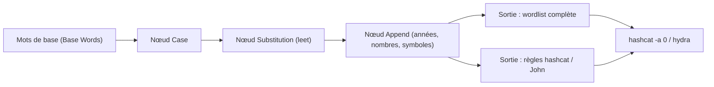

# Mentalist — Génération graphique de wordlists par mutation

> [!info] **En 1 phrase**
> Mentalist est un générateur de wordlists en GUI Windows qui applique des mutations visuelles (leet, chiffres, années, casse) et un générateur de phrases — pour prototyper un pipeline de mots sans écrire une ligne de script.

---

## Overview

| Champ | Valeur |
|---|---|
| Nom complet | Mentalist |
| Description | Générateur graphique de wordlists par chaînage de nœuds de mutation (casse, substitution, append/prepend) |
| Catégorie | Wordlists & Générateurs |
| Sous-catégorie | Mutation / génération de mots de passe (GUI) |
| Fonction principale | Construire une chaîne de transformations sur des mots de base et produire une wordlist ou des règles hashcat/John |
| Type d'outil | GUI (interface Tkinter), scriptable par lignes de commande de lancement |
| Licence | MIT |
| Open source / propriétaire | Open source |
| Langage(s) de programmation | Python 3 (interface Tkinter) |
| Développeur / organisation | sc0tfree (Scott) — wiki et contributions de Henry Prince |
| Projet officiel | https://github.com/sc0tfree/mentalist |
| Dépôt officiel | https://github.com/sc0tfree/mentalist |
| Documentation officielle | https://github.com/sc0tfree/mentalist/wiki |
| Date de création | ~2017 (release v1.0 le 2017-11-07) |
| État du projet | maintenu (v2.0 sur master, Python 3.11+) |
| Dernière version connue | 2.0 (release officielle : v1.0) |
| Systèmes compatibles | Linux / macOS / Windows (GUI Tkinter ; binaires précompilés v1.0) |

> [!note] Pour vérifier / compléter
> La v2.0 n'est disponible que par installation depuis les sources (Poetry/pip) ; les applications précompilées des releases correspondent à la v1.0 (Python 3.6-3.10).

---

## Concept

Mentalist est l'outil graphique du projet hashcat-friendly pour la génération de wordlists. Là où CUPP interroge le profil d'une victime et Crunch énumère des charsets, Mentalist propose une **interface visuelle par nœuds** : on assemble une « chaîne » de transformations (casse, substitutions type leetspeak, ajout de nombres/années/symboles, mots en préfixe ou suffixe) sur des mots de base, puis on génère soit la **wordlist complète**, soit — point fort — les **règles hashcat et John the Ripper** qui reproduisent la même chaîne à la volée. Cette double sortie le rend aussi efficace comme outil pédagogique : on visualise l'effet de chaque mutation, on estime le volume, puis on déporte la logique dans les moteurs de cracking sans générer de fichiers intermédiaires.

Son modèle mental reflète les « paradigmes humains » de construction de mots de passe : capitaliser la première lettre, remplacer les lettres par des chiffres, coller une année ou un symbole à la fin. Chaque nœud de la chaîne applique ses attributs et déduplique les variantes produites pour chaque mot de base. Développé par sc0tfree, il est distribué en v1.0 avec binaires précompilés (PyInstaller), puis modernisé en v2.0 (Python 3.11+, installation Poetry). Place dans un pentest : post-recon, pour transformer une petite liste (CeWL, CUPP, SecLists) en une wordlist de mutations réalistes pour des cibles humaines ou des PSK Wi-Fi.



---

## Concepts fondamentaux

| Concept | Explication |
|---|---|
| Chaîne (chain) | Séquence de nœuds traitant successivement les mots ; le premier nœud est toujours « Base Words » |
| Nœud (node) | Étape de transformation : Base Words, Case, Substitution, Append, Prepend (5 types) |
| Attribut | Action d'un nœud (ex. « Uppercase All », « Years: 1950-2025 ») ; les attributs d'un même nœud sont mutuellement exclusifs |
| Déduplication par nœud | Chaque nœud ne transmet que les variantes uniques d'un mot de base au nœud suivant |
| Base Words | Mot(s) racine : fichier personnalisé, chaîne, dictionnaire anglais (`words`), noms communs US, etc. |
| Case | Transformations de casse : lowercase/uppercase total, première lettre, bascule du N-ième caractère |
| Substitution | Remplacement de caractères (leet `a→4`, `e→3`...) : toutes, première ou dernière occurrence |
| One at a Time / All at Once | Substituer un caractère à la fois (produit N variantes) ou tous en une passe (produit 1 variante) |
| Append / Prepend | Ajout en fin/début de mot : mots, nombres (0-100 à 0-10000), années (1950-2025), dates, symboles, codes US |
| Sortie règles | Traduction de la chaîne en syntaxe hashcat (`-r`) ou John (`--rules`) au lieu de la wordlist complète |

---

## Installation

### Debian / Ubuntu / Kali Linux

```bash
# v2.0 depuis les sources (Poetry)
git clone https://github.com/sc0tfree/mentalist.git && cd mentalist
pip install .          # ou : poetry install
mentalist

# Prérequis GUI : librairie Tk
sudo apt install -y python3-tk
```

### Autres Linux (Arch, Fedora/RHEL) & macOS

```bash
git clone https://github.com/sc0tfree/mentalist.git && cd mentalist
pip install .          # ou : python3 -m pip install .
mentalist
# prérequis GUI si absent : tk (pacman -S tk) / python3-tkinter
```

### Windows

```powershell
# Option 1 : binaire précompilé v1.0 (releases officielles)
# https://github.com/sc0tfree/mentalist/releases/tag/v1.0
.\Mentalist.exe

# Option 2 : v2.0 depuis les sources
git clone https://github.com/sc0tfree/mentalist.git
cd mentalist
pip install .
mentalist
```

### Docker

Pas d'image officielle ; l'interface Tkinter rend l'usage en conteneur hasardeux (X11 requis). Alternative : utiliser Mentalist en local et partager les règles générées (`docker run --rm -e DISPLAY=$DISPLAY -v /tmp/.X11-unix:/tmp/.X11-unix python:3.11 ...` n'est qu'un wrapper non supporté).

> [!warning] Prérequis & problèmes potentiels
> Python 3.11+ requis pour la v2.0 ; les binaires v1.0 couvrent Python 3.6-3.10. L'interface Tkinter exige le paquet `python3-tk`/`tk` sous Linux, souvent absent par défaut. Sous Kali, les distributions anciennes peuvent pointer vers la v1.0 via les paquets communautaires — privilégier l'installation depuis les sources.

---

## Configuration

Pas de fichier de configuration : tout se règle dans la GUI. Les chaînes se **persistent** (sauvegarde/chargement) via le menu — utile pour réutiliser un pattern sur plusieurs cibles.

| Paramètre | Rôle | Valeur possible | Impact | Exemple |
|---|---|---|---|---|
| Nœud Base Words | Mots racines | Fichier, chaîne, dictionnaire, noms, slang | Détermine toute la chaîne | Fichier CeWL de l'entreprise |
| Nœud Case | Casse | Lowercase/Upper all, première lettre, Toggle Nth | Multiplie par 2-3 les variantes | `Test` vs `TEST` |
| Nœud Substitution | Remplacement | Toutes / 1re / dernière occurrence, one-at-a-time | Leet `a→4 e→3` ou caractères custom | `test` → `t3st` |
| Nœud Append/Prepend | Ajout | Nombres, années, dates, symboles, mots, codes US | Explosion du volume (×101 à ×10001) | Années 1950-2025 |
| Sortie | Mode de génération | Wordlist, règles hashcat, règles John, base words | Taille disque vs vitesse de crack | Règles hashcat pour `-r` |
| Persistance | Sauvegarde de chaîne | Fichier de chaîne (save/load) | Reproduire le pattern | Chaîne « entreprise 2025 » |

---

## Architecture interne

Mentalist est une application **Tkinter** (Python) séparée en logique GUI et logique de transformation. Les nœuds sont des classes (`BaseWords`, `Case`, `Substitution`, `Append`, `Prepend`) dotées d'attributs mutuellement exclusifs ; le moteur traverse la chaîne et, pour chaque mot de base, applique les attributs de chaque nœud en dédupliquant les variantes produites (chaque nœud ne transmet que les mots uniques). Certains attributs (ex. `Numbers: Small (0-100)`) créent 101 sorties par mot d'entrée — d'où l'importance d'estimer le volume avant génération.

L'originalité réside dans le **générateur de règles** : chaque nœud expose une traduction vers la syntaxe hashcat et John (`to_hashcat_rule()` / `to_john_rule()`). Par exemple une chaîne « Title case → leet (a→@, e→3) → append 2024! » produit la règle `c sa@ se3 $2 $0 $2 $4 $!`. Limite documentée : les attributs « Replace First/Last Instance » ne sont pas traduisibles en règles — l'outil propose alors de les convertir en « Replace All Instances ». Le fichier `mentalist.spec` (PyInstaller) sert à produire les binaires des releases ; un dossier `tests/` couvre le moteur de génération et la conversion en règles.

---

## Commandes

### Commandes principales

```bash
mentalist                          # lancer la GUI (v2.0, après pip install)
python -m mentalist                # alternative équivalente
```

| Commande | Objectif | Résultat attendu |
|---|---|---|
| `mentalist` | Ouvrir l'interface graphique | Fenêtre Tkinter : chaîne de nœuds + génération |
| `python -m mentalist` | Même chose, via module Python | Fenêtre Tkinter |
| `.\Mentalist.exe` | Lancer le binaire précompilé (Windows v1.0) | Fenêtre Tkinter |
| `pip install .` (dans le dépôt) | Installer la v2.0 depuis les sources | Commande `mentalist` disponible |

### Commandes avancées

```bash
# Reconstruire le binaire PyInstaller (v1.0) pour distribution
pyinstaller mentalist.spec

# Lancer les tests du moteur (dépôt source)
python -m pytest tests/
```

---

## Options et flags

Mentalist étant une GUI, ses « options » sont les nœuds et leurs attributs (mutuellement exclusifs au sein d'un nœud) :

| Option (nœud/attribut) | Description | Exemple | Niveau |
|---|---|---|---|
| Base Words — Custom File | Wordlist de départ importée | Fichier CeWL/CUPP | Basic |
| Base Words — Custom String | Mots saisis à la main | `acme admin root` | Basic |
| Base Words — Dictionnaires intégrés | Dictionnaire anglais `words`, noms US, slang, mois | « English Dictionary » | Intermediate |
| Case — Lowercase/Uppercase All | Tout minuscule ou tout majuscule | `test` → `TEST` | Basic |
| Case — Uppercase First | Première lettre en majuscule | `test` → `Test` | Basic |
| Case — Toggle Nth | Bascule de casse du N-ième caractère | `Test` (N=2) → `TESt` | Advanced |
| Substitution — Replace All | Remplace toutes les occurrences (leet) | `test` → `t3st` | Basic |
| Substitution — One at a Time | Une substitution à la fois (N variantes) | `apple` → `@pple`, `appl3` | Advanced |
| Append/Prepend — Numbers | Nombres (Small 0-100, Basic 0-1000, Full 0-10000) | `test42` | Basic |
| Append/Prepend — Years | Années 1950-2025 | `test2024` | Basic |
| Append/Prepend — Dates | Dates formatées (mmddyy, etc.) avec zéros | `test121599` | Advanced |
| Append/Prepend — Special Chars | Symboles, un à la fois | `test!` | Intermediate |
| Append/Prepend — Words | Autres mots (phrases de passe) | `test-secret` | Intermediate |
| Sortie — Full Wordlist | Wordlist complète | Fichier `.txt` | Basic |
| Sortie — Hashcat/John Rules | Règles `-r` / `--rules` | `c sa@ se3 $2 ...` | Intermediate |

> [!tip] Options les plus utiles au quotidien
> Commence par Base Words « Custom File » (CeWL/CUPP) puis enchaîne Case → Substitution (leet) → Append Years. Vérifie le volume estimé avant génération, et préfère la sortie « Règles hashcat » dès que la chaîne est validée : le cracking consomme moins de disque et accepte plus de mutations.

---

## Exemples pratiques

### Beginner

```bash
# Objectif : première wordlist en 2 minutes
mentalist
# 1. Base Words → Custom File → /tmp/mots_cewl.txt (10 mots de base)
# 2. Case → Uppercase First
# 3. Append → Years (1950-2025)
# 4. Generate → Full Wordlist → /tmp/wordlist.txt
wc -l /tmp/wordlist.txt
```

### Intermediate

```bash
# Objectif : leet + chiffres + casse, export en règles hashcat
mentalist
# 1. Base Words → Custom String : admin jean acme
# 2. Case → Lowercase All
# 3. Substitution → Replace All Instances : a→@, e→3, i→1, o→0, s→5
# 4. Append → Small Numbers 0-100
# 5. Generate → Hashcat Rules → /tmp/regles.rule
# Puis : hashcat -m 1000 ntlm.txt base.txt -r /tmp/regles.rule
```

### Advanced

```bash
# Objectif : phrases de passe d'entreprise (prénom + symbole + produit + année)
mentalist
# 1. Base Words → Custom File : /tmp/prenoms.txt (alex, marie, pierre)
# 2. Prepend → Custom String : acme
# 3. Append → Words → Custom File : /tmp/produits.txt (vpn, intranet, mail)
# 4. Append → Years 2020-2025
# 5. Generate → Full Wordlist ; vérifier /tmp/phrases.txt
# Utilisation : hydra -l admin -P phrases.txt 10.10.20.15 http-post-form ...
```

### Expert

```bash
# Objectif : substitution One at a Time + dates + persistance de la chaîne
mentalist
# 1. Base Words → Custom String : test
# 2. Substitution → Replace All Instances, mode "One at a Time" (a→@, e→3)
#    → produit test, t3st, te5t, @ppl3... (une substitution par variante)
# 3. Append → Dates (1960-2000, format mmddyy, leading zeros)
# 4. Save Chain → /tmp/chain_entreprise.json (réutilisable pour la cible suivante)
# 5. Generate → John Rules ; usage : john --rules=mentalist hash.txt
```

---

## Workflow complet (scénario pas à pas)

1. **Préparer la matière** — une petite wordlist de mots-clés (CeWL, CUPP ou extrait de SecLists) :
   ```bash
   cewl -d 2 -m 5 -w /tmp/mots.txt https://www.cible-example.com
   ```
2. **Ouvrir Mentalist** et définir Base Words sur ce fichier :
   ```bash
   mentalist
   ```
3. **Chaîner les mutations** — Case (Uppercase First) → Substitution (leet) → Append Years :
   ```text
   Exemple sur "admin" : Admin -> @dmin -> @dmin2024, @dmin1998...
   ```
4. **Vérifier l'aperçu** — chaque bloc s'affiche avant génération, avec le volume estimé (explosion à prévoir si Append Full 0-10000).
5. **Exporter** — wordlist complète ou règles :
   ```bash
   # Sortie via l'interface : /tmp/wordlist.txt ou /tmp/regles.rule
   wc -l /tmp/wordlist.txt
   ```
6. **Cracker** — hors-ligne avec hashcat (wordlist ou règles) :
   ```bash
   hashcat -m 1000 ntlm.txt /tmp/wordlist.txt -r /usr/share/hashcat/rules/best64.rule
   # ou, si règles exportées : hashcat -m 1000 ntlm.txt /tmp/mots.txt -r /tmp/regles.rule
   ```

---

## Scénarios avancés

### Scénario 1 : mot de passe Wi-Fi personnel (WPA2-PSK)

Base : prénom + animal + année. Chaîne : Case → Substitution (leet) → Append Years → Append Special Chars.

```text
1. Base Words : mot (prénom), rex (animal)
2. Case : Uppercase First
3. Substitution : e→3, a→4, i→1, o→0, s→5
4. Append : Years 1990-2025 puis Special Chars (! @ #)
5. Exporter la wordlist, puis crack du handshake
```
```bash
hashcat -m 22000 handshake.hc22000 /tmp/wordlist.txt
```

### Scénario 2 : phrases de passe corporatives (passphrases)

Utiliser Prepend/Append Words pour composer des phrases type `mot1-mot22024` :

```text
1. Base Words : liste de prénoms (OSINT LinkedIn)
2. Prepend : Custom String (acme, admin, service)
3. Append Words : produits / départements / ville
4. Append : Years 2020-2025
5. Exporter et tester avec hydra sur l'auth web ou le VPN
```

### Scénario 3 : rejouer un pattern validé sur une nouvelle cible

La persistance des chaînes évite de tout reconstruire : on charge la chaîne « entreprise » et on change seulement Base Words.

```text
1. Save Chain après validation (fichier .json)
2. Nouvelle cible : Load Chain, remplacer Base Words (Custom File)
3. Régénérer — le pattern de mutations est identique
```

---

## Cybersecurity use cases

| Phase | Utilisation |
|---|---|
| Préparation d'attaque | Génération de wordlists de mutations avant cracking (T1110) |
| Cracking hors-ligne | Wordlist ou règles pour hashcat / John (T1110.002) |
| Accès initial | Password guessing / spraying sur comptes humains (T1110.001 / .003) |
| Attaques Wi-Fi | Wordlists PSK mutées pour WPA/WPA2-PMKID |
| Post-exploitation | Test de réutilisation des patterns mutés entre services (T1110.004) |

---

## MITRE ATT&CK

| Tactique | Technique / Sub-technique | ID | Raison | Détection | Mitigation |
|---|---|---|---|---|---|
| Credential Access | Brute Force: Password Guessing | T1110.001 | Wordlists mutées testées en ligne | Échecs 4625 répétés par source | Verrouillage progressif, MFA |
| Credential Access | Brute Force: Password Cracking | T1110.002 | Wordlists/règles crackées hors-ligne | Volume de logins anormal après fuite | MFA, rotation, politique robuste |
| Credential Access | Brute Force: Password Spraying | T1110.003 | Un candidat muté par compte | Échecs distribués sur comptes variés | MFA, alertes UEBA, seuils |
| Credential Access | Brute Force: Credential Stuffing | T1110.004 | Réutilisation des mutations découvertes | Logins réussis depuis IP/UA inhabituels | MFA, détection de creds recyclés |

> [!note] Ne renseigner que si l'association est réellement pertinente.

---

## Defensive Security

### Signes observables

| Indicateur | Détail |
|---|---|
| Mots dérivés de mots-clés d'entreprise | Logs/audits montrant prénom + année + symbole (ex. `Alex2024!`) |
| Patterns leet/années prévisibles | `a→@`, `e→3`, années 1990-2025 dans les hashes retrouvés |
| Processus GUI de génération | Fenêtres Tkinter / `mentalist`, fichiers de chaîne `.json` |
| Explosion des échecs de logon | Vagues de tentatives sur de nombreux comptes (spraying) |

### Règles de détection (Sigma / Suricata / Snort / YARA)

```yaml
# Exemple Sigma — échecs d'authentification distribués (spraying)
title: Password Spraying - Multiple Failed Logon Types
status: experimental
logsource:
  product: windows
  service: security
detection:
  selection:
    EventID: 4625
    LogonType:
      - 3
      - 10
  timeframe: 15m
  condition:
    selection | count() by SourceNetworkAddress > 20
    and TargetUserName | count() distinct > 5
falsepositives:
  - Scripts de test d'intégration
level: medium
```

```bash
# Exemple Suricata — rafale d'échecs HTTP 401 depuis une source
alert tcp $EXTERNAL_NET any -> $HOME_NET 80 (msg:"Potential password spray - HTTP 401 storm"; flow:to_server,established; content:"HTTP/1.1 401"; threshold:type both, track by_src, count 30, seconds 300; classtype:attempted-recon; sid:1000044; rev:1;)
```

---

## Automatisation

```bash
# Bash — lancer Mentalist, puis traiter la wordlist générée
mentalist &
# après export manuel :
awk 'length($0)>=8 && length($0)<=12' /tmp/wordlist.txt | sort -u > /tmp/clean.txt

# Bash — utiliser les règles exportées avec hashcat en boucle
for f in /tmp/mots.txt; do
  hashcat -m 1000 ntlm.txt "$f" -r /tmp/regles.rule --force
done
```

```python
# Python — rejouer la logique Mentalist en headless via le moteur de règles
# (exemple : simuler une chaîne "leet + année" sans la GUI)
import re

def mutate(base, leet=None, years=range(1990, 2026)):
    out = []
    for w in base:
        v = w
        if leet:
            for a, b in leet.items():
                v = v.replace(a, b)
        out.extend(f"{v}{y}" for y in years)
    return sorted(set(out))

mots = ["admin", "jean", "acme"]
regles = {a: b for a, b in zip("aeios", "@3105")}
resultat = mutate(mots, regles)
print(len(resultat), resultat[:5])
```

---

## Output et parsing

Mentalist propose **trois modes de sortie** (wiki « Output ») :

| Mode | Description | Usage |
|---|---|---|
| Full Wordlist | La wordlist complète en fichier texte | `hashcat -a 0`, `hydra -P` |
| Hashcat/John Rules | Les règles équivalentes à la chaîne | `hashcat -r`, `john --rules` |
| Base Words Only | Uniquement les mots de base (non mutés) | Afficher/vérifier la source |

```bash
# Parsing de la wordlist générée
sort -u /tmp/wordlist.txt | wc -l
awk 'length($0)>=8' /tmp/wordlist.txt | grep -E "2024|@" | head -20
```

```python
# Python — vérifier la couverture de la chaîne (leet + années)
with open("/tmp/wordlist.txt") as f:
    mots = [l.strip() for l in f]
print("total :", len(mots))
print("avec année 2020-2025 :",
      sum(1 for m in mots if m[-4:].isdigit() and 2020 <= int(m[-4:]) <= 2025))
```

---

## Intégrations

```text
CeWL / CUPP / SecLists → Mentalist (mots de base) → wordlist ou règles → hashcat / John / hydra
Mentalist (règles) → hashcat -r → mutation à la volée sans fichier géant
```

- [[Tools| Outils]]
- [[Outil - hashcat|hashcat]] — consommation des wordlists et des règles exportées
- [[Outil - John the Ripper|John the Ripper]] — consommation des règles (`--rules=mentalist`)
- [[Outil - CeWL|CeWL]] et [[Outil - CUPP|CUPP]] — production des mots de base
- [[Outil - rsmangler|rsmangler]] et [[Outil - pydictor|pydictor]] — alternatives de mutation en CLI
- [[Outil - SecLists|SecLists]] et [[Outil - OneRuleToRuleThemAll|OneRuleToRuleThemAll]] — compléments
- [[Techniques/Password Cracking| Password Cracking]] · [[Techniques/Password Spraying|Password Spraying]]

---

## Alternatives

| Outil | Avantages | Inconvénients | Cas d'usage |
|---|---|---|---|
| [[Outil - rsmangler|rsmangler]] | CLI rapide, mutations variées | Pas de GUI ni de règles | Linux/automatisation |
| [[Outil - pydictor|pydictor]] | Très riche, extensible Python | Config complexe | Automatisation scriptée |
| [[Outil - CUPP|CUPP]] | Profil OSINT de la victime | Pas de visualisation | Cible identifiée personnellement |
| hashcat `-r` | Règles intégrées, zéro génération | Syntaxe à maîtriser | Mutations à la volée |
| [[Outil - Crunch|Crunch]] | Masques de position | Pas de mutations humaines | Bruteforce exhaustif |
| [[Outil - kwprocessor|kwprocessor]] | Marches clavier | Pas de GUI | Patterns clavier |

> **Quand utiliser Mentalist plutôt que rsmangler ?** Quand tu veux *voir* l'effet de chaque mutation et exporter des règles hashcat/John : la GUI rend le prototypage de pattern immédiat. En environnement headless (SSH, CI) ou pour une pipeline répétable, rsmangler/pydictor en CLI restent plus adaptés.

---

## Performance

Mentalist est du Python : pour des chaînes raisonnables, la génération est quasi instantanée, mais la **combinatoire explose** avec les attributs Append/Prepend. L'attribut `Numbers: Full (0-10000)` crée 10 001 variantes par mot de base ; un `Append Words` croise chaque mot avec chaque mot de la liste annexe (N×M). La déduplication par nœud atténue le volume (un nœud ne transmet que les variantes uniques) mais pas la charge mémoire du nœud lui-même. La v2.0 (Python 3.11+) reste monoprocessus ; les chaînes très larges doivent être exportées en **règles** plutôt qu'en wordlist complète — c'est le levier principal pour réduire temps et espace disque. Les binaires PyInstaller v1.0 démarrent plus vite que l'interpréteur en mode sources.

---

## Troubleshooting

### Common problems

#### Problème : la fenêtre ne s'ouvre pas (Tkinter absent sous Linux)

- **Cause** : le paquet Tk n'est pas installé (`ModuleNotFoundError: No module named '_tkinter'`).
- **Solution** : `sudo apt install python3-tk` (Debian/Ubuntu/Kali) ou `pacman -S tk` (Arch).
- **Vérification** : `python3 -c "import tkinter"` doit réussir.

#### Problème : erreur de version Python lors de l'installation v2.0

- **Cause** : la v2.0 exige Python 3.11+ (installation Poetry/pip).
- **Solution** : mettre à jour Python, ou utiliser les binaires v1.0 (compatibles 3.6-3.10).
- **Vérification** : `python3 --version`.

#### Problème : « Replace First/Last Instance » bloqué en sortie règles

- **Cause** : ces attributs ne sont pas traduisibles en règles hashcat/John.
- **Solution** : accepter la proposition de conversion en « Replace All Instances » (comportement équivalent supporté en règles).
- **Vérification** : la génération de règles aboutit après conversion.

#### Problème : génération trop lente ou disque plein

- **Cause** : attribut Append large (`Full 0-10000`) appliqué à une base volumineuse.
- **Solution** : réduire la base, utiliser `Small 0-100`, ou exporter en règles.
- **Vérification** : surveiller l'estimation de volume affichée avant génération.

#### Problème : binaire v1.0 bloqué par SmartScreen/AV

- **Cause** : binaire PyInstaller non signé signalé par Windows Defender.
- **Solution** : installer depuis les sources (`pip install .`) ou exclure le dossier du scan en environnement contrôlé.
- **Vérification** : la GUI s'ouvre après l'ajout de l'exclusion.

---

## Sécurité de l'outil

Mentalist s'exécute localement, sans réseau ni télémétrie : pas de collecte de données. Le README porte un disclaimer explicite — usage uniquement à des fins d'information ou dans le cadre d'audits autorisés. À noter : les chaînes sauvegardées (`.json`) et les wordlists générées contiennent les données de mots de passe de la cible ; les protéger et les supprimer après usage. Sur Windows, les binaires PyInstaller non signés peuvent être bloqués par l'antivirus — en environnement professionnel, privilégier l'installation depuis les sources. L'outil ne contient aucune fonctionnalité de vol de données ; il reste un outil offensif réservé aux périmètres autorisés (lab, CTF, audit mandaté).

---

## Limitations

- **GUI uniquement** : pas de mode headless/CLI pour générer sans interface (les règles générées, elles, se réutilisent en CLI).
- **Contenus US par défaut** : noms (men/women/pets), area codes et zip codes sont américains — penser aux fichiers personnalisés pour les cibles francophones.
- **Règles limitées** : « Replace First/Last Instance » non supportés en sortie règles.
- **Pas de marches clavier** : Mentalist ne génère pas les motifs de type `qwerty`/`1qaz2wsx` (voir kwprocessor).
- **Combinatoire** : les attributs Append larges font exploser la mémoire et le disque.
- **Pas d'API** : la génération est pilotée par l'interface, pas scriptable à distance.

---

## Cheatsheet

```bash
# Installation v2.0 (Python 3.11+)
git clone https://github.com/sc0tfree/mentalist.git && cd mentalist
pip install .
mentalist

# Binaire Windows v1.0
.\Mentalist.exe

# Workflow GUI type
# Base Words (Custom File) -> Case (Uppercase First) -> Substitution (leet) -> Append Years -> Generate

# Après export wordlist : filtrer et cracker
awk 'length($0)>=8 && length($0)<=12' /tmp/wordlist.txt | sort -u > /tmp/clean.txt
hashcat -m 1000 ntlm.txt /tmp/clean.txt

# Après export règles
hashcat -m 1000 ntlm.txt /tmp/mots.txt -r /tmp/regles.rule
john --rules=mentalist hash.txt

# Cracking WPA avec la wordlist générée
hashcat -m 22000 handshake.hc22000 /tmp/wordlist.txt
```

---

## Quick reference

| | |
|---|---|
| **À quoi sert-il ?** | Générer des wordlists par chaînage visuel de mutations (casse, leet, chiffres, années, phrases) |
| **Quand l'utiliser ?** | Post-recon, pour transformer une liste de mots-clés en candidates réalistes (humains, WPA) |
| **Commande principale** | `mentalist` (GUI) puis Base Words → mutations → Generate |
| **Alternative principale** | rsmangler, pydictor (CLI) / hashcat `-r` (règles) |
| **Concepts importants** | Chaîne de nœuds, attributs mutuellement exclusifs, déduplication par nœud, sortie wordlist ou règles |
| **Liens associés** | [[Techniques/Password Cracking| Password Cracking]] · [[Outil - hashcat|hashcat]] · [[Outil - rsmangler|rsmangler]] |

---

## Détection & Défense

| Signe | Défense |
|---|---|
| Mots dérivés du contexte (prénom, ville, année) | Politique de passphrases aléatoires, blacklist des patterns |
| Patterns leet/années prévisibles | Contrôle d'entropie et de diversité, rejet des dérivés |
| Réutilisation des schémas entre services | Rotation régulière + MFA obligatoire |
| Tentatives multiples avec mutations proches | Verrouillage progressif, corrélation UEBA |
| Wordlists/chaînes retrouvées sur poste | Chiffrement, purge des données OSINT |

---

## Tips & Pièges

> [!tip] **Tips**
> L'aperçu par bloc permet de valider chaque mutation avant génération : teste d'abord sur 10 mots de base pour contrôler la taille estimée. Exporte en **règles hashcat/John** dès que le pattern est validé : même rendu, moins de disque, plus de flexibilité. Sauvegarde la chaîne (Save Chain) pour rejouer le pattern sur la cible suivante. Associe Mentalist à CUPP (mots de base) pour des candidats très personnalisés. Vérifie la cohérence casse/leet avec l'aperçu avant l'export final.

> [!warning] **Pièges**
> Le volume explose vite : chaque attribut Append multiplie la liste — vérifie l'estimation avant de générer. L'ordre des nœuds compte : `Case` puis `Substitution` ne donne pas le même résultat que l'inverse (déduplication comprise). « Replace First/Last Instance » ne passe pas en règles : prévois la conversion en « Replace All ». C'est une **GUI** : pas d'automatisation directe en pipeline — en headless, préfère rsmangler ou hashcat `-r`. Sous Linux, `python3-tk` doit être installé.

---

## References

### Official

- Dépôt GitHub officiel : https://github.com/sc0tfree/mentalist
- Wiki officiel (How It Works, Node Attributes, Output, Persistence) : https://github.com/sc0tfree/mentalist/wiki
- Releases officielles (binaires v1.0) : https://github.com/sc0tfree/mentalist/releases

### Security references

- MITRE ATT&CK — Brute Force (T1110) : https://attack.mitre.org/techniques/T1110/
- MITRE ATT&CK — Password Spraying (T1110.003) : https://attack.mitre.org/techniques/T1110/003/
- OWASP Authentication Cheat Sheet : https://cheatsheetseries.owasp.org/cheatsheets/Authentication_Cheat_Sheet.html
- NIST SP 800-63B (politiques de mots de passe) : https://pages.nist.gov/800-63-3/sp800-63b.html

### Community

- Wiki Mentalist — Node Attributes (détail de tous les attributs) : https://github.com/sc0tfree/mentalist/wiki/Node-Attributes
- Articles sur les « paradigms » de construction de mots de passe (leet, années, casse)
- Write-ups de génération de wordlists (PortSwigger Research, HackTricks)

---

**Liens :** [[Tools| Outils]] · [[Outil - hashcat|hashcat]] · [[Outil - John the Ripper|John the Ripper]] · [[Outil - rsmangler|rsmangler]] · [[Outil - CUPP|CUPP]] · [[Techniques/Password Cracking| Password Cracking]]
