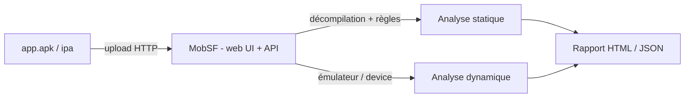

# MobSF — Analyse de sécurité mobile (statique + dynamique)

> [!info] **En 1 phrase**
> **MobSF (Mobile Security Framework)** est une plateforme web d'analyse **statique et dynamique**
> automatique des APK / IPA / Android : elle détecte les vulnérabilités, les secrets et les API
> dangereuses, génère un **rapport détaillé** et expose une **API REST** pour automatiser les scans.

---

## Overview

| Champ | Valeur |
|---|---|
| Nom complet | Mobile Security Framework (MobSF) |
| Description | Plateforme web d'analyse statique et dynamique automatisée d'applications mobiles (Android, iOS, Windows) |
| Catégorie | Mobile & Reverse Engineering |
| Sous-catégorie | Scanner SAST mobile clé en main + analyse dynamique |
| Fonction principale | Upload d'un APK/IPA/AAB → scan statique → rapport HTML/PDF/JSON (scorecard 0-100) |
| Type d'outil | Application web (Django) + API REST + CLI (mobsf) |
| Licence | GNU GPL v3 |
| Langage(s) de programmation | Python (Django), JavaScript (frontend), scripts d'analyse |
| Développeur / organisation | Ajin Abraham / communauté MobSF (OpenSecurity) |
| Projet officiel | MobSF/Mobile-Security-Framework-MobSF |
| Dépôt officiel | https://github.com/MobSF/Mobile-Security-Framework-MobSF |
| Documentation officielle | https://mobsf.github.io/Mobile-Security-Framework-MobSF/ |
| Dernière version connue | 4.5.2 (10/08/2026) |
| Systèmes compatibles | Linux, Windows, macOS (analyse iOS requiert macOS) — Docker, venv Python 3.x |

> [!note] À vérifier
> Version relevée au moment de la rédaction (4.5.2) ; vérifier la dernière release sur https://github.com/MobSF/Mobile-Security-Framework-MobSF/releases et le changelog pour la liste exacte des nouveautés 4.5.x (ajout du support des AAB/source code selon les versions).

---

## Concept

On dépose un APK/IPA (ou un projet source), MobSF le **décompile** (dex → smali, parse du manifest, des
certs et des ressources), exécute une centaine de **contrôles de sécurité** (permissions, composants
exportés, cleartext, crypto faible, secrets hardcodés) et produit un rapport HTML/JSON. Le mode
**dynamique** (émulateur ou device) relance l'app et capture activités, logs et fichiers. C'est l'équivalent
d'un **scanner SAST mobile clé en main**.

MobSF se place dans la phase **analyse d'application mobile** d'un pentest : il fournit en quelques minutes
une cartographie des risques (surface d'attaque, secrets, endpoints) qu'on approfondit ensuite avec des
outils de reverse (jadx, APKTool, Frida). Son API REST permet de l'intégrer dans un pipeline CI/CD pour un
contrôle qualité continu.



---

## Concepts fondamentaux

| Concept | Explication |
|---|---|
| Analyse statique (SAST) | Analyse du code et des ressources sans exécution : permissions, manifeste, bytecode, secrets, librairies |
| Analyse dynamique (DAST) | Exécution dans un émulateur/device contrôlé : capture des activités, logs, fichiers, trafic réseau |
| Scorecard | Note de sécurité (0-100) et moyenne CVSS calculées à partir des findings — clé pour la CI/CD |
| Fichiers pris en charge | APK/AAB (Android), IPA (iOS), APPX (Windows) et archives ZIP de code source (Java/Kotlin/Swift/Obj-C) |
| Obfuscation / packers | Détection de ProGuard/R8, DexProtector, application des règles en conséquence |
| AVD (Android Virtual Device) | Émulateur requis pour le mode dynamique (MobSF fournit des scripts de configuration) |
| Xposed / Frida | Frameworks d'instrumentation utilisés par le module dynamique de MobSF |
| Rapport JSON | Sortie exploitable par script (findings, secrets, permissions, domains) — format documenté |

---

## Installation

### Docker (recommandé)

```bash
docker pull opensecurity/mobile-security-framework-mobsf:latest
docker run -it --rm -p 8000:8000 opensecurity/mobile-security-framework-mobsf
# UI : http://127.0.0.1:8000   (identifiants admin / admin par défaut — à changer)
```

### Installation locale (Python)

```bash
git clone https://github.com/MobSF/Mobile-Security-Framework-MobSF && cd Mobile-Security-Framework-MobSF
./setup.sh          # Linux/macOS : installe les dépendances système + Python
# ou pip3 install mobsf  (paquet PyPI)
mobsf --host 127.0.0.1 --port 8000
# navigateur : http://127.0.0.1:8000
```

### Docker Compose (avec base MySQL optionnelle)

```yaml
services:
  mobsf:
    image: opensecurity/mobile-security-framework-mobsf:latest
    ports:
      - "8000:8000"
    volumes:
      - ./mobsf:/root/.MobSF
```

> [!warning] Prérequis & problèmes potentiels
> - Le **mode dynamique** exige un émulateur Android (AVD) configuré, une machine virtuelle, le framework Xposed et un proxy (Burp) : à préparer séparément.
> - L'analyse **iOS** (IPA) ne fonctionne pleinement que sous **macOS**.
> - Sous Windows, préférer Docker ou le sous-système WSL : certaines dépendances (aapt, wkhtmltopdf/weasyprint) posent problème en natif.

---

## Configuration

MobSF se configure via des **variables d'environnement** (ou `MobSF/settings.py`).

| Variable | Rôle | Valeur possible | Impact | Exemple |
|---|---|---|---|---|
| `MOBSF_API_KEY` | Clé d'API pour les appels REST | chaîne aléatoire | Authentifie `/api/v1/*` (désactivée par défaut) | `MOBSF_API_KEY=mysecret` |
| `SECRET_KEY` | Clé Django (sessions, CSRF) | chaîne aléatoire | Sécurité de la session web | `SECRET_KEY=$(openssl rand -hex 32)` |
| `DEBUG` | Mode debug Django | `0`/`1` | Active les logs détaillés (jamais en prod) | `DEBUG=1` |
| `ALLOWED_HOSTS` | Hôtes autorisés | `*` ou liste | Contrôle d'accès HTTP | `ALLOWED_HOSTS=127.0.0.1,localhost` |
| `MAX_SIZE_UPLOAD` | Taille max d'upload (Mo) | entier | Évite les fichiers énormes | `MAX_SIZE_UPLOAD=100` |
| `DATABASE_ENGINE` / `DATABASE_HOST` | Base de données (SQLite par défaut, MySQL/MariaDB supporté) | `django.db.backends.sqlite3` \| `mysql` | Persistance des scans | `DATABASE_ENGINE=mysql` |
| `DOCKER` | Mode conteneur | `0`/`1` | Ajuste chemins et comportements | défini par l'image officielle |

---

## Architecture interne

- **Django** : framework web — UI (templates, JS), administration des scans, sessions et API.
- **Modules d'analyse statique** : `static_analyzer/` avec des sous-modules Android (APK/AAB : aapt, apksigner, décompilation smali, règles), iOS (IPA : class-dump, otool), Windows (APPX), et analyse de code source (Java/Kotlin, Swift/Obj-C).
- **Analyseur dynamique** : `dynamic_analyzer/` — pilotage de l'émulateur via ADB, installation de l'app, instrumentation Xposed/Frida, capture des logs (logcat), des activités, du trafic (proxy) et des fichiers (local + application).
- **Moteur de règles** : plus d'une centaine de contrôles (OWASP MASVS/MSTG) appliqués au manifeste, aux sources, aux strings, aux permissions et aux librairies tierces.
- **Génération de rapports** : rapports HTML (UI), PDF, JSON (`report_json`), scorecard (0-100 + CVSS moyen).
- **API REST v1** : `api/` — endpoints `upload`, `scan`, `scan_status`, `report_json`, `pdf_report`, `scorecard`, `delete_scan`, `apps`, et endpoints dynamiques (`dynamic_analyze`, `frida_live_api`).
- **Stockage** : base SQLite/MySQL pour les métadonnées, filesystem pour les binaires et fichiers décompilés (sous `uploads/` et `downloads/`).

---

## Commandes

### CLI

```bash
mobsf --host 127.0.0.1 --port 8000          # lancer le serveur
mobsf --host 0.0.0.0 --port 8000            # écouter sur toutes les interfaces (VM d'analyse)
mobsf --help                                # options disponibles
```

### API REST (clé API requise)

```bash
curl -X POST http://127.0.0.1:8000/api/v1/upload -F "file=@app.apk" -H "Authorization: <clé API>"
curl -X POST http://127.0.0.1:8000/api/v1/scan -d "hash=<hash>" -H "Authorization: <clé API>"
curl http://127.0.0.1:8000/api/v1/report_json/<hash> -H "Authorization: <clé API>"
curl http://127.0.0.1:8000/api/v1/scorecard/<hash> -H "Authorization: <clé API>"
curl -X POST http://127.0.0.1:8000/api/v1/delete_scan -d "hash=<hash>" -H "Authorization: <clé API>"
```

La clé API se récupère dans l'UI (Settings → API) ou en CLI lors d'une connexion device.

| Commande | Effet |
|---|---|
| `/api/v1/upload` | Envoie le fichier, renvoie un hash de scan |
| `/api/v1/scan` | Déclenche l'analyse statique complète |
| `/api/v1/scan_status` | Statut d'un scan en cours (polling CI) |
| `/api/v1/report_json/<hash>` | Récupère le rapport JSON (automatisable) |
| `/api/v1/scorecard/<hash>` | Note globale (0-100) et résumé |
| `/api/v1/pdf_report/<hash>` | Génère le rapport PDF |
| `/api/v1/delete_scan` | Supprime un scan (BDD + fichiers) |
| `/api/v1/apps` | Liste des applications scannées |
| `/api/v1/dynamic_analyze` | Lance l'analyse dynamique (émulateur) |
| `/api/v1/frida_live_api` | Exécute des scripts Frida à la volée |

---

## Options et flags

### CLI

| Option | Description | Exemple |
|---|---|---|
| `--host <ip>` | Adresse d'écoute | `mobsf --host 127.0.0.1` |
| `--port <port>` | Port d'écoute | `mobsf --port 8000` |
| `--help` | Aide | `mobsf --help` |

### API — paramètres des endpoints principaux

| Endpoint | Méthode | Paramètres | Réponse |
|---|---|---|---|
| `/api/v1/upload` | POST | `file` (multipart), optionnel `app_name`/`file_name` | `{ "hash": "…", "file_name": "…" }` |
| `/api/v1/scan` | POST | `hash`, optionnel `scan_type` | `{ "type": "apk", "app_name": "…", "score": 88 }` |
| `/api/v1/scan_status` | POST | `hash` | `{ "ready": true, "status": "scan done" }` |
| `/api/v1/report_json/<hash>` | GET | — | Rapport JSON complet |
| `/api/v1/scorecard/<hash>` | GET | — | Note + stats CVSS |
| `/api/v1/pdf_report/<hash>` | GET | — | Binaire PDF |
| `/api/v1/delete_scan` | POST | `hash` | `{ "deleted": true }` |
| `/api/v1/dynamic_analyze` | POST | `hash`, `env`, `action` | Statut de l'analyse dynamique |
| `/api/v1/frida_live_api` | POST | `hash`, `commands`, `codes` | Résultats des scripts Frida |

> [!tip] Options les plus utiles au quotidien
> `upload` → `scan` → `scorecard` est le trio de base pour une CI : upload, scan synchrone, puis lecture de la note et du `report_json`.

---

## Exemples pratiques

### Beginner

```bash
# Objectif : premier scan d'un APK dans l'UI
# 1) Ouvrir http://127.0.0.1:8000
# 2) Glisser-déposer app.apk sur la page d'accueil
# 3) Ouvrir le rapport HTML et lire la note (scorecard) + les findings critiques
```

### Intermediate

```bash
# Objectif : scan automatisé via l'API
curl -X POST http://127.0.0.1:8000/api/v1/upload -F "file=@app.apk" -H "Authorization: $MOBSF_KEY"
# → récupérer le hash, puis :
curl -X POST http://127.0.0.1:8000/api/v1/scan -d "hash=<hash>" -H "Authorization: $MOBSF_KEY"
curl http://127.0.0.1:8000/api/v1/scorecard/<hash> -H "Authorization: $MOBSF_KEY"
```

### Advanced

```bash
# Objectif : extraire tous les secrets et endpoints du rapport JSON
curl http://127.0.0.1:8000/api/v1/report_json/<hash> -H "Authorization: $MOBSF_KEY" \
  | jq -r '.secrets[]?.files[]?.secrets[]? | "\(.title): \(.secret)"'
curl http://127.0.0.1:8000/api/v1/report_json/<hash> -H "Authorization: $MOBSF_KEY" \
  | jq -r '.domains[]?.url' | sort -u
```

### Expert

```bash
# Objectif : analyse dynamique complète
# 1) Configurer l'émulateur AVD (scripts fournis par MobSF : ./scripts/setupAVD.sh)
# 2) Dans l'UI : Dynamic Analyzer → choisir l'émulateur
# 3) Lancer, interagir avec l'app, puis exporter activités/logs/trafic
# 4) Coupler à Burp (proxy) pour capturer les requêtes en clair
```

---

## Workflow complet (scénario pas à pas)

Scénario : auditer rapidement une app et extraire la note + les secrets hardcodés.

```text
1. Récupérer la clé API dans l'UI (Settings → API) :  EXEMPLE_API_KEY
2. Upload :  curl -X POST http://127.0.0.1:8000/api/v1/upload \
       -F "file=@app.apk" -H "Authorization: EXEMPLE_API_KEY"
   → réponse :  {"hash": "abc123..."}
3. Scanner :  curl -X POST http://127.0.0.1:8000/api/v1/scan \
       -d "hash=abc123..." -H "Authorization: EXEMPLE_API_KEY"
4. Lire le rapport :  curl http://127.0.0.1:8000/api/v1/report_json/abc123... \
       -H "Authorization: EXEMPLE_API_KEY" | jq .findings
5. Dans l'UI : /mobile_apps/ → cliquer sur l'app → rapport détaillé
6. Analyse dynamique : téléverser l'app, configurer l'émulateur (UI → Dynamic Analyzer)
```

```bash
# Export des secrets trouvés par MobSF (filtrage via jq)
curl http://127.0.0.1:8000/api/v1/report_json/abc123... -H "Authorization: EXEMPLE_API_KEY" \
  | jq -r '.secrets[]?.files[]?.secrets[]? | "\(.title): \(.secret)"'
```

---

## Scénarios avancés

### Scénario 1 : Scan de sécurité automatisé dans une CI/CD

```bash
# script ci_mobsf.sh — bloquer le merge si la note est < 60
HASH=$(curl -s -X POST http://127.0.0.1:8000/api/v1/upload \
  -F "file=@app.apk" -H "Authorization: $MOBSF_KEY" | jq -r .hash)
curl -s -X POST http://127.0.0.1:8000/api/v1/scan \
  -d "hash=$HASH" -H "Authorization: $MOBSF_KEY"
SCORE=$(curl -s http://127.0.0.1:8000/api/v1/scorecard/$HASH \
  -H "Authorization: $MOBSF_KEY" | jq -r .average_cvss | cut -d. -f1)
# le merge est refusé si score faible ; sinon le rapport PDF est archivé
if [ "$SCORE" -lt 60 ]; then echo "Scan MobSF KO"; exit 1; fi
```

### Scénario 2 : Reverse approfondi sur les secrets et endpoints

```bash
# Extraire les endpoints/déclarations utiles pour la suite du test
curl http://127.0.0.1:8000/api/v1/report_json/$HASH -H "Authorization: $MOBSF_KEY" \
  | jq -r '.domains[]?.url' | sort -u
# Récupérer l'APK décompilé pour analyse manuelle (jadx / APKTool) à partir
# des fichiers exposés par MobSF dans le panneau de téléchargement
```

### Scénario 3 : Analyse dynamique ciblée d'un flux d'authentification

1. Lancer l'émulateur AVD et le module dynamique de MobSF ; installer l'app et déclencher la connexion (identifiants fictifs).
2. Capturer `logcat` + trafic (proxy Burp) pour identifier le payload d'auth et les endpoints.
3. Inspecter les fichiers écrits dans le stockage de l'app (tokens, sessions), puis croiser les findings avec le rapport statique.

---

## Cybersecurity use cases

| Phase | Utilisation |
|---|---|
| Test d'intrusion mobile | Cartographie rapide des risques, secrets, endpoints avant reverse manuel |
| Audit de code tiers / SDK | Scan des apps embarquées, détection de librairies vulnérables |
| CI/CD Sécurité | Gate de merge basé sur le scorecard + rapport PDF archivé |
| Analyse de malware | Scan statique d'échantillons, extraction de C2 et de secrets |
| Gestion de la dette technique | Revue périodique de la note MobSF sur les apps internes |

---

## MITRE ATT&CK

| Tactique | Technique / Sub-technique | ID | Raison | Détection | Mitigation |
|---|---|---|---|---|---|
| Reconnaissance | Gather Victim Network Information : Domain Properties | T1590.001 | L'analyse statique de l'app cible révèle endpoints, domaines et infrastructure | Supervision des scans, des téléchargements d'APK | Restreindre les endpoints côté serveur, chiffrer les URLs sensibles |
| Defense Evasion | Obfuscated Files or Information | T1027 | Décompilation et analyse d'apps obfusquées pour comprendre la logique malveillante | Détection des outils d'analyse mobile (Sigma) | Obfuscation robuste, anti-tamper natif |
| Defense Evasion | Obfuscated Files or Information (Android) | T1406 | Détection de packers et DEX chargés dynamiquement dans les échantillons | Monitoring des labos d'analyse | Contrôles d'intégrité au runtime |
| Credential Access | Unsecured Credentials : Credentials In Files | T1552.001 | Découverte automatisée de secrets hardcodés dans le code de l'app | Secrets scanning + revue manuelle | Gestion des secrets côté serveur, aucune clé en clair |

> [!note] Ne renseigner que si l'association est réellement pertinente.
> MobSF est un **outil d'analyse** utilisé aussi bien en défense qu'en attaque (reconnaissance d'une app cible) : les IDs les plus pertinents sont T1590.001 (endpoints) et T1552.001 (secrets).

---

## Defensive Security

### Signes observables

| Indicateur | Détail |
|---|---|
| Instance MobSF exposée sur Internet | UI + API accessibles publiquement : fuite d'APK et de rapports |
| Utilisation intensive de `/api/v1/upload` | Activité de scan d'échantillons (légitime en lab, suspicieuse en masse) |
| Rapports JSON/PDF archivés sans politique | Données de l'application (endpoints, secrets) stockées en clair |
| Émulateurs AVD lancés en masse | Indice d'analyse dynamique automatisée |

### Règles de détection (Sigma / Suricata / Snort / YARA)

```yaml
# Sigma — réseau : accès à l'API MobSF (activité de scan)
title: MobSF API Access
id: 7a4d9e3b-0c6f-4a1e-9d2b-8f3c4d5e6a7b
status: test
logsource:
    category: webserver
    product: django
detection:
    selection:
        request_uri|startswith: '/api/v1/'
        request_uri|contains:
            - 'upload'
            - 'report_json'
            - 'scorecard'
    condition: selection
falsepositives:
    - Plateforme MobSF légitime en usage interne
level: low
```

```yaml
# YARA — binaire Android analysé par MobSF : signature aapt/apksigner typique
rule Android_App_Binary {
    meta:
        description = "APK/AAB binary container"
    strings:
        $zip = { 50 4B 03 04 }                      # PK\x03\x04 (ZIP)
        $dex = "classes.dex" ascii
        $man = "AndroidManifest.xml" ascii
    condition:
        $zip at 0 and $dex and $man
}
```

---

## Automatisation

```bash
# Bash — scan d'un lot d'APK + génération d'un résumé CSV
for apk in apks/*.apk; do
    hash=$(curl -s -X POST http://127.0.0.1:8000/api/v1/upload -F "file=@$apk" -H "Authorization: $MOBSF_KEY" | jq -r .hash)
    curl -s -X POST http://127.0.0.1:8000/api/v1/scan -d "hash=$hash" -H "Authorization: $MOBSF_KEY" >/dev/null
    score=$(curl -s http://127.0.0.1:8000/api/v1/scorecard/$hash -H "Authorization: $MOBSF_KEY" | jq -r .security_score)
    echo "$apk,$score" >> resume.csv
done
```

```python
# Python — pipeline upload → scan → rapport
import requests, json

MOBSF = "http://127.0.0.1:8000"
KEY = "EXEMPLE_API_KEY"
HEADERS = {"Authorization": KEY}

def scan_apk(apk: str) -> dict:
    with open(apk, "rb") as fh:
        up = requests.post(f"{MOBSF}/api/v1/upload", files={"file": fh}, headers=HEADERS).json()
    scan = requests.post(f"{MOBSF}/api/v1/scan", data={"hash": up["hash"]}, headers=HEADERS).json()
    report = requests.get(f"{MOBSF}/api/v1/report_json/{up['hash']}", headers=HEADERS).json()
    return {"hash": up["hash"], "score": scan.get("score"), "permissions": len(report.get("permissions", []))}

print(scan_apk("app.apk"))
```

---

## Output et parsing

MobSF expose le rapport complet en **JSON** via `/api/v1/report_json/<hash>` : structure documentée (manifest, permissions, secrets, domains, findings, librairies).

```bash
# Note de sécurité et nombre de findings
curl http://127.0.0.1:8000/api/v1/report_json/<hash> -H "Authorization: $MOBSF_KEY" \
  | jq '{score: .security_score, findings: (.findings|length), apps: .app_name}'
# Permissions utilisées vs déclarées
curl http://127.0.0.1:8000/api/v1/report_json/<hash> -H "Authorization: $MOBSF_KEY" \
  | jq -r '.permissions[]?.permission'
# Librairies tierces détectées
curl http://127.0.0.1:8000/api/v1/report_json/<hash> -H "Authorization: $MOBSF_KEY" \
  | jq -r '.libraries[]?.title'
```

```python
# Python — agrégation des findings par sévérité
import requests

r = requests.get(f"{MOBSF}/api/v1/report_json/{hash}", headers=HEADERS).json()
from collections import Counter
print(Counter(f.get("severity", "info") for f in r.get("findings", [])))
```

---

## Intégrations

```text
CI/CD (Jenkins/GitHub Actions) → MobSF API (upload/scan/scorecard) → gate de merge + rapport PDF
MobSF (findings) → jadx/APKTool (deep dive statique) → Frida (runtime) → Burp (MITM)
```

- [[Tools| Outils]] global
- [[Outil - APKTool| APKTool]] — repack / patch smali des apps signalées par MobSF
- [[Outil - jadx| jadx]] — lecture Java lisible pour approfondir les findings
- [[Outil - Frida| Frida]] — confirmation runtime des vulnérabilités statiques
- [[Outil - objection| objection]] — instrumentation rapide (SSL pinning, root)
- [[Outil - Burp Suite| Burp Suite]] — interception pendant l'analyse dynamique
- [[Techniques/Insecure Deserialization| Désérialisation]] · [[Techniques/Insecure Source Code Management| SCM]]

---

## Alternatives

| Outil | Avantages | Inconvénients | Cas d'usage |
|---|---|---|---|
| [[Outil - jadx|jadx]] | Code Java lisible, GUI, gratuit | Pas de rapports automatisés | Comprendre la logique manuellement |
| [[Outil - APKTool|apktool]] | Smali modifiable, repack | Pas de scorecard | Patching et repack |
| AndroBugs Framework | Analyse statique rapide (règles) | Moins maintenu, rapport brut | Tri rapide de volume d'APK |
| Qark | Détection de vulnérabilités | Abandonné, obsolète | Historique |
| AppSweep (cloud) | CI/CD natif, gouvernance | Payant, code envoyé au cloud | Production d'entreprise |
| Analyse manuelle (MSTG) | Profondeur maximale | Lent, demande d'expertise | Engagements critiques |

> **Quand MobSF est-il indispensable ?** Dès qu'il faut un **premier niveau automatisé et répétable** (CI/CD, gating de merge, tri de volume) : la combinaison upload → scan → scorecard donne une base chiffrée, à compléter par du reverse manuel.

---

## Performance

- Un scan statique d'APK standard (10–50 Mo) prend **de ~1 à ~10 minutes** selon la machine, la taille et le niveau d'obfuscation.
- Le scan est **séquentiel** par défaut (file d'attente) : pour des lots, prévoir plusieurs workers/instances.
- L'analyse dynamique est **beaucoup plus lente** (boot émulateur, instrumentation, capture) : réserver aux cas ciblés.
- Ressources : Docker avec 2-4 Go de RAM est confortable pour le statique ; le dynamique dépend de l'émulateur.
- Le format d'entrée compte : un AAB peut prendre plus de temps qu'un APK équivalent.

---

## Troubleshooting

### Common problems

#### Problème : la page web ne répond pas après `docker run`

- **Cause** : port déjà occupé ou conteneur non mappé.
- **Solution** : `docker ps` pour vérifier, changer le mapping (`-p 8001:8000`) et l'adresse (`--host 0.0.0.0`).
- **Vérification** : `curl -I http://127.0.0.1:8000/`.

#### Problème : `401 Unauthorized` sur les appels API

- **Cause** : clé API absente/incorrecte, ou `MOBSF_API_KEY` non définie.
- **Solution** : définir `MOBSF_API_KEY` au démarrage et la passer dans l'en-tête `Authorization`.
- **Vérification** : régénérer la clé dans l'UI (Settings → API).

#### Problème : l'analyse dynamique ne trouve pas l'émulateur

- **Cause** : AVD non créé/non démarré, ADB déconnecté.
- **Solution** : lancer l'AVD, vérifier `adb devices`, configurer le port ADB dans MobSF.
- **Vérification** : la liste des devices apparaît dans l'UI (Dynamic Analyzer).

---

## Sécurité de l'outil

- **Exposition** : MobSF expose l'UI + l'API : ne **jamais** le binder sur `0.0.0.0` en production, restreindre à `127.0.0.1` ou derrière un VPN.
- **Clé API** : `MOBSF_API_KEY` par défaut absente (API ouverte) : la définir et la garder secrète (secret manager, pas en clair dans les scripts).
- **Identifiants par défaut** : `admin/admin` au premier démarrage Docker : les changer immédiatement.
- **Malware** : analyser les échantillons dans une VM isolée (réseau cloisonné) ; MobSF n'exécute pas le code en statique mais le mode dynamique le fait dans l'émulateur.
- **Données** : les rapports contiennent endpoints et secrets : les archiver selon une politique, purger avec `/api/v1/delete_scan`.

---

## Limitations

- **Faux positifs** : le scanner signale beaucoup de « hardcoded secrets » (URLs, noms de package) : chaque finding doit être confirmé manuellement.
- **Pas de reverse profond** : MobSF donne la cartographie, pas la compréhension fine du flux — compléter avec jadx/APKTool/Frida.
- **Dynamique lourd et fragile** : émulateur, Xposed, proxy : réserver à l'investigation, pas au tri.
- **iOS** : l'analyse IPA statique complète nécessite macOS.
- **Échantillons exotiques** : packers/loaders très obfusqués peuvent casser certaines analyses statiques.
- **Pas un fuzzer** : aucune génération d'entrées malveillantes ni de test d'exploitation.

---

## Cheatsheet

```bash
# Démarrage Docker
docker run -it --rm -p 8000:8000 opensecurity/mobile-security-framework-mobsf

# Démarrage local
mobsf --host 127.0.0.1 --port 8000

# Clé API (définir au lancement)
export MOBSF_API_KEY="EXEMPLE_API_KEY"

# Upload
curl -X POST http://127.0.0.1:8000/api/v1/upload -F "file=@app.apk" -H "Authorization: $MOBSF_KEY"

# Scan
curl -X POST http://127.0.0.1:8000/api/v1/scan -d "hash=<hash>" -H "Authorization: $MOBSF_KEY"

# Rapport JSON
curl http://127.0.0.1:8000/api/v1/report_json/<hash> -H "Authorization: $MOBSF_KEY"

# Scorecard (note 0-100)
curl http://127.0.0.1:8000/api/v1/scorecard/<hash> -H "Authorization: $MOBSF_KEY"

# Rapport PDF
curl http://127.0.0.1:8000/api/v1/pdf_report/<hash> -H "Authorization: $MOBSF_KEY" -o rapport.pdf

# Supprimer un scan
curl -X POST http://127.0.0.1:8000/api/v1/delete_scan -d "hash=<hash>" -H "Authorization: $MOBSF_KEY"
```

---

## Quick reference

| | |
|---|---|
| **À quoi sert-il ?** | Scanner SAST mobile clé en main (statique + dynamique) avec rapports et API |
| **Quand l'utiliser ?** | Tri rapide d'apps, CI/CD, gating de merge, point de départ d'un pentest mobile |
| **Commande principale** | `upload` → `scan` → `report_json/<hash>` avec la clé API |
| **Alternative principale** | [[Outil - jadx|jadx]] + [[Outil - APKTool|apktool]] (reverse manuel), AndroBugs (volume) |
| **Concepts importants** | SAST/DAST, scorecard, CVSS, AVD, Xposed/Frida, API REST v1 |
| **Liens associés** | [[Outil - jadx]] · [[Outil - APKTool]] · [[Outil - Frida]] · [[Outil - objection]] |

---

## Détection & Défense

| Signe | Défense |
|---|---|
| **Secrets hardcodés** remontés par le scan | Stocker les clés dans le keystore / serveur, pas dans le binaire |
| **Permissions sur-grantées** | Rapport "permissions non utilisées" → moindre privilège |
| **Cleartext traffic** (`usesCleartextTraffic=true`) | Interdire HTTP en clair |
| **Composants exportés** (`exported=true`) | Restreindre par permission les activity/service |
| **Crypto faible** (DES/MD5/RSA faible) | AES-256, PBKDF2, Argon2 |
| **Rooting detection absent** | Ajouter des protections anti-tampering, attestation |

---

## Tips & Pièges

> [!tip] **API pour la CI**
> Appeler `/api/v1/scan` dans un pipeline (Jenkins, GitHub Actions) et bloquer le merge si score < 60 :
> vrai contrôle qualité automatisé.

> [!tip] **Le JSON est la mine d'or**
> `report_json` contient tout (manifest, permissions, secrets, fichiers sensibles) : grep dessus pour
> retrouver des flags/credentials en CTF.

> [!warning] **Analyse dynamique = lourde**
> Le module dynamique a besoin d'un émulateur (AVD) configuré, du framework (Xposed) et d'un proxy (Burp) :
> réserve-le à l'investigation, pas au tri rapide.

> [!warning] **Faux positifs**
> MobSF signale beaucoup de "hardcoded secrets" (URLs, noms de package) → confirmer chaque finding
> manuellement avant d'exploiter.

---

## References

### Official

- Dépôt officiel : https://github.com/MobSF/Mobile-Security-Framework-MobSF
- Documentation / API : https://mobsf.github.io/Mobile-Security-Framework-MobSF/
- Changelog / releases : https://github.com/MobSF/Mobile-Security-Framework-MobSF/releases

### Security references

- MITRE ATT&CK T1590.001 — Gather Victim Network Information: Domain Properties : https://attack.mitre.org/techniques/T1590/001/
- MITRE ATT&CK T1027 — Obfuscated Files or Information : https://attack.mitre.org/techniques/T1027/
- MITRE ATT&CK T1406 — Obfuscated Files or Information (Android) : https://attack.mitre.org/techniques/T1406/
- MITRE ATT&CK T1552.001 — Unsecured Credentials : https://attack.mitre.org/techniques/T1552/001/
- OWASP Mobile Application Security (MASVS/MSTG) : https://mas.owasp.org/

### Community

- HackTricks — Mobile pentesting : https://book.hacktricks.xyz/mobile-pentesting/android-app-pentesting
- Blog d'Ajin Abraham (créateur) : https://github.com/ajinabraham

---

**Liens :** [[Tools| Outils]] · [[Outil - APKTool| APKTool]] · [[Outil - jadx| jadx]] · [[Outil - Frida| Frida]] · [[Outil - objection| objection]] · [[Outil - Burp Suite| Burp Suite]] · [[Techniques/Insecure Source Code Management| SCM]] · [[Techniques/Insecure Deserialization| Désérialisation]]
