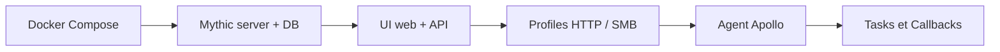
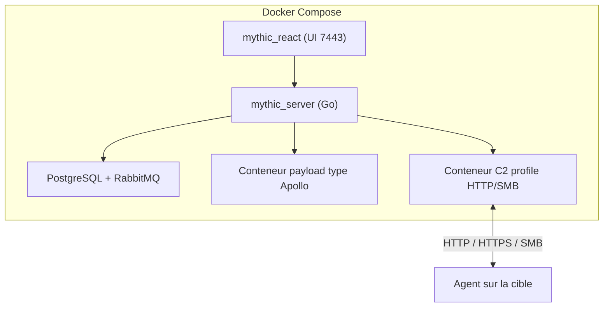

# Mythic — Framework C2 web, modulaire et cross-platform

> [!info] **En 1 phrase**
> Mythic est un framework C2 open-source cross-platform basé sur une UI web, qui exécute des agents (« payload types ») comme Apollo, avec des profiles de transport HTTP/SMB et une orchestration par tâches.

---

## Overview

| Champ | Valeur |
|---|---|
| Nom complet | Mythic |
| Description | Framework C2 collaboratif, web et modulaire : serveur Docker Compose, UI React, API REST, agents « payload types » installables |
| Catégorie | C2 & Post-Exploitation |
| Sous-catégorie | Command & Control (C2), post-exploitation |
| Fonction principale | Orchestrer des agents sur des cibles via des profiles C2 et des tâches |
| Type d'outil | Framework (serveur Docker + UI web + CLI + agents) |
| Licence | Autre (LICENSE personnalisée ; variantes BSD-3-Clause / MIT selon modules) |
| Open source / propriétaire | Open source |
| Langage(s) de programmation | Go (serveur), TypeScript/React (UI), Docker ; agents variés (Go/Python/C#) |
| Développeur / organisation | Andrew Robbins (its-a-feature) + contributeurs |
| Projet officiel | Mythic |
| Dépôt officiel | https://github.com/its-a-feature/Mythic |
| Documentation officielle | https://docs.mythic-c2.net/ |
| Date de création | 5 juillet 2018 |
| État du projet | actif (releases fréquentes) |
| Dernière version connue | v3.4.0.5 (2025-10-10) |
| Systèmes compatibles | Serveur : Linux (Docker) ; UI : navigateur ; agents : Windows, Linux, macOS |

> [!note] Pour vérifier / compléter
> Le dépôt Mythic n'héberge pas lui-même les agents ni les profiles C2 : ils s'installent via `./mythic-cli install github <repo>` (ex. agent Apollo, profile HTTP).

---

## Concept

Mythic se distingue par son architecture : un serveur central (Docker Compose) avec une base PostgreSQL, une UI web (React), une API REST et un gestionnaire de tâches asynchrones. Les agents sont de vrais programmes qui se connectent via des **profiles C2** (HTTP, HTTPS, SMB, etc.) et reçoivent des commandes (`tasks`) dont on suit l'exécution en temps réel. L'agent le plus utilisé, **Apollo**, est écrit en Go et cross-platform (Windows, Linux, macOS). C'est le C2 de référence pour les opérations qui demandent de la modularité : on ajoute des agents, des profiles et des modules sans réécrire le framework.

Conçu par Andrew Robbins (its-a-feature), Mythic est pensé pour les opérations longues : chaque **callback** garde un historique de tâches, et la BDD PostgreSQL conserve tout le contexte. Mythic gère plusieurs **opérations en parallèle**, chacune isolée (utilisateurs, callbacks, fichiers). Les **artifact instances** et le reporting intégré documentent automatiquement les actions menées, ce qui simplifie le rapport de red team.



---

## Concepts fondamentaux

| Concept | Explication |
|---|---|
| Mythic server | Conteneur Go centralisant opérations, callbacks, tâches, fichiers et credentials. |
| UI React | Interface web (port 7443) pour piloter toutes les opérations. |
| API REST | API interne (mythic_server) et API de conteneurs ; permet l'automatisation et le reporting. |
| Payload Type | « Type » d'agent (Apollo, etc.) installé comme conteneur ; c'est le programme exécuté sur la cible. |
| C2 Profile | Module de transport (HTTP, HTTPS, SMB, DNS…) qui définit comment l'agent communique. |
| Callback | Session d'un agent : identifiée par son nom, porte un historique de tâches. |
| Task | Commande envoyée à un callback ; statuts Submitted / Processing / Completed. |
| Opération | Contexte isolé (nom, dates, utilisateurs, callbacks) ; chaque action génère un artifact instance pour le reporting. |
| `mythic-cli` | Outil en ligne de commande pour démarrer/arrêter, installer agents/profiles, mettre à jour. |

---

## Installation

### Debian / Ubuntu / Kali Linux

```bash
git clone --recursive https://github.com/its-a-feature/Mythic.git && cd Mythic
# Dépendances : docker + docker compose
sudo apt install docker.io docker-compose
sudo systemctl enable --now docker
# Premier démarrage (build long)
sudo ./mythic-cli start
# Suivi
sudo ./mythic-cli status
```

### Premier accès

```bash
# Identifiants admin générés au premier démarrage : récupérer les logs
sudo docker logs mythic_mythic_1 | grep -i "username\|password"
# UI : https://localhost:7443
```

### Installation d'agents et de profiles

```bash
# Agent Apollo (payload type) et profile C2 HTTP
sudo ./mythic-cli install github https://github.com/MythicAgents/apollo
sudo ./mythic-cli install github https://github.com/MythicC2Profiles/http
sudo ./mythic-cli update
```

> [!warning] Prérequis & problèmes potentiels
> - Docker Compose lourd : plusieurs conteneurs (server, PostgreSQL, RabbitMQ, UI, agents) consomment 2-4 Go de RAM.
> - Les agents et profiles ne sont **pas** inclus par défaut : penser à les installer (`install github`).
> - Le premier build peut être long et le port 7443 doit être libre pour l'UI.

---

## Configuration

La configuration se fait via `./mythic-cli` (configuration, installation, démarrage) et dans la UI (opérations, profiles C2, agents). Le fichier `config.json` centralise les paramètres du serveur.

| Paramètre | Rôle | Valeur possible | Impact | Exemple |
|---|---|---|---|---|
| `mythic-cli start/stop` | Démarre/arrête toute la stack | commandes CLI | Cycle de vie du C2 | `./mythic-cli start` |
| `mythic-cli status` | État des conteneurs | sortie console | Vérification de santé | `./mythic-cli status` |
| `mythic-cli install github <repo>` | Installe agent/profile | URL GitHub | Ajoute un payload type ou C2 profile | `install github .../apollo` |
| `mythic-cli update` | Vérifie/installe les mises à jour | commande CLI | Maintient la version | `./mythic-cli update` |
| Opération (UI) | Contexte de l'engagement | nom, dates | Isole callbacks et fichiers | « Lab 2026 » |
| Profile C2 (UI) | Transport de l'agent | HTTP/HTTPS/SMB, host, port, UA | Définit le canal | HTTP 10.10.14.5:80 |
| Payload options | Config de l'agent | callback interval, jitter | Fréquence des callbacks | 5 s / 10 % |
| `mythic-cli -b <branche>` | Choix de branche pour l'install | nom de branche | Contrôle la version installée | `-b master` |

---

## Architecture interne

Mythic est déployé en Docker Compose : un conteneur **mythic_server** (Go) connecté à **PostgreSQL** et **RabbitMQ**, une UI **mythic_react** (React, port 7443), et un conteneur par **payload type** / **C2 profile** installé. Le `mythic-cli` orchestre les conteneurs et la configuration.

À l'exécution : un agent généré (ex. Apollo, binaire Go) se connecte à un listener du profile C2 choisi (HTTP/HTTPS/SMB). Le serveur enregistre le **callback**, affiche les **tâches** disponibles et exécute les commandes via des API de conteneur. Chaque action génère un **artifact instance** horodaté pour le reporting. Le multi-utilisateur est géré par comptes et opérations ; les fichiers et credentials sont stockés dans la BDD.



---

## Commandes

### Commandes principales

```bash
# CLI Mythic
sudo ./mythic-cli start
sudo ./mythic-cli stop
sudo ./mythic-cli status
sudo ./mythic-cli install github <repo>
sudo ./mythic-cli update
# API (exemple)
curl -k https://localhost:7443/... 
```

| Commande / Action | Objectif | Résultat attendu |
|---|---|---|
| `./mythic-cli start` | Démarre tous les conteneurs | Stack opérationnelle (server, DB, UI, agents) |
| `./mythic-cli status` | État des services | Conteneurs running/stopped |
| `./mythic-cli install github <repo>` | Ajoute un payload type ou profile | Nouvel agent/profile disponible dans la UI |
| `./mythic-cli update` | Vérifie les mises à jour | Version à jour si nécessaire |
| `Operations` (UI) | Créer/gérer une opération | Contexte isolé pour l'engagement |
| `Payload Types` (UI) | Lister les agents installés | Apollo et autres disponibles |
| `Profiles C2` (UI) | Créer un profile HTTP/SMB | Listener actif |
| `Generate Payload` (UI) | Compiler un agent | Binaire téléchargé |
| `Callbacks` (UI) | Sessions des agents | Ex. `apollo 123` |
| `Tasks` (UI) | Statut des commandes | Submitted/Processing/Completed |

---

## Options et flags

| Option | Description | Exemple | Niveau |
|---|---|---|---|
| `start` / `stop` | Démarre/arrête la stack | `./mythic-cli start` | Basic |
| `status` | État des conteneurs | `./mythic-cli status` | Basic |
| `install github <repo>` | Installe agent/profile | `install github https://github.com/MythicAgents/apollo` | Intermediate |
| `update` | Mise à jour | `./mythic-cli update` | Intermediate |
| `-b <branche>` | Branche pour l'install | `./mythic-cli install github <repo> -b master` | Advanced |
| Callback interval / jitter | Fréquence et aléa des callbacks | 5 s / 10 % | Advanced |
| Profile SMB | Transport interne sans flux sortant | C2 profile SMB | Expert |
| API REST / lib Python | Automatisation des opérations | scripts `mythic` | Expert |

> [!tip] Options les plus utiles au quotidien
> `./mythic-cli start` puis `status` ; l'installation des agents via `install github` ; la génération de payload dans la UI avec un profile HTTP correctement configuré.

---

## Exemples pratiques

### Beginner

```bash
# Objectif : déployer Mythic et obtenir un premier callback
sudo ./mythic-cli start
sudo ./mythic-cli status
# UI https://localhost:7443 → Operations → New Operation
# Profiles C2 → HTTP (10.10.14.5:80) ; Payload Types → Apollo → Generate → Windows x64
# Exécuter le binaire sur la cible → Callbacks
```

Résultat attendu : un callback Apollo visible et interactif.

### Intermediate

```bash
# Objectif : piloter la session
# Callbacks → cliquer sur le callback → console interactive
# Commandes exemples :
whoami
hostname
ls C:\Users\
cat /etc/passwd
```

### Advanced

```bash
# Objectif : double profile HTTP + SMB pour un pivot interne
# 1. Profile HTTP (host public) + Apollo → accès initial
# 2. Une fois sur la première machine, générer un agent en profile SMB
# 3. Relier le callback SMB au callback HTTP : trafic interne sans nouveau flux sortant
```

### Expert

```bash
# Objectif : automatiser via l'API Python
# python3 -m pip install mythic (librairie fournie par le projet)
# Utiliser mythic_cli / l'API REST pour générer des payloads et récupérer les tâches
```

> [!note] À vérifier
> La librairie Python `mythic` et les endpoints API varient selon la version : consulter docs.mythic-c2.net pour l'usage exact.

---

## Workflow complet (scénario pas à pas)

1. **Lancer Mythic** : `./mythic-cli start` puis attendre que tous les conteneurs soient `running` (`status`).
2. **Récupérer les identifiants** : `sudo docker logs mythic_mythic_1 | grep -i "user\|pass"` → se connecter sur `https://localhost:7443`.
3. **Créer une opération** : `Operations` → `New Operation` (ex. « Lab 2026 »).
4. **Créer un profile C2 HTTP** : `Profiles C2` → `New` → type `HTTP`, host `10.10.14.5`, port `80`.
5. **Générer l'agent** : `Payload Types` → `Apollo` → `Generate` → Windows x64, profile HTTP → télécharger le binaire.
6. **Exécuter l'agent** sur la cible ; il revient en `Callbacks`.
7. **Piloter** : ouvrir la session → console interactive :
   ```text
   whoami
   hostname
   ls C:\Users\
   ```
8. **Post-exploitation** : téléchargements/uploads, exécution de tâches, et API pour automatiser le reporting.

Pour une opération multi-machines, l'onglet **Graph** de l'UI affiche les relations entre callbacks, fichiers et tâches.

---

## Scénarios avancés

### Scénario 1 : Double profile C2 HTTP + SMB (pivot)

```text
1. Créer un profile HTTP (host public 10.10.14.5:443) et un profile SMB.
2. Générer Apollo avec le profile HTTP → payload initial.
3. Générer un second agent en profile SMB relié au callback HTTP :
   trafic interne sans nouveau flux sortant → évite la détection réseau.
```

### Scénario 2 : Automatisation d'opération via l'API Python

```python
# piloter les tâches via la librairie mythic (conceptuel)
# from mythic import mythic
# async = await mythic.get_callback_by_name("apollo 123")
# tasks = await mythic.get_tasks_for_callback(callback.id)
```

### Scénario 3 : Engagement multi-équipe avec opérations isolées

```text
Créer une opération par périmètre (AD, applicatif, réseau), y affecter
les opérateurs : chaque équipe ne voit que ses callbacks et fichiers.
```

---

## Cybersecurity use cases

| Phase | Utilisation |
|---|---|
| Enuméération | Depuis un callback : `whoami`, `hostname`, listing fichiers |
| Exploitation | Livraison d'Apollo après compromission initiale |
| Post-exploitation | Tâches (téléchargement, exécution, capture), pivoting SMB |
| Exfiltration | Upload/download de fichiers via le canal C2 |
| Reporting | Artifact instances et graph automatisés |
| Red team | Multi-équipe, multi-opérations, isolation |

---

## MITRE ATT&CK

| Tactique | Technique / Sub-technique | ID | Raison | Détection | Mitigation |
|---|---|---|---|---|---|
| Execution | Command and Scripting Interpreter: PowerShell | T1059.001 | Tâches PowerShell depuis les agents | Logging PowerShell, AMSI | Application Control |
| Command and Control | Application Layer Protocol: Web Protocols | T1071.001 | Profile C2 HTTP/HTTPS | Analyse des flux HTTP | Filtrage egress |
| Command and Control | Protocol Tunneling | T1572 | Profile SMB pour le trafic interne | Surveillance des pipes/IPC | Segmentation |
| Defense Evasion | Obfuscated Files or Information | T1027 | Obfuscation des payloads | Analyse statique, YARA | AV/EDR |
| Command and Control | Ingress Tool Transfer | T1105 | Livraison de payloads/outils | Contrôle des téléchargements | Egress filtering |
| Discovery | System Information Discovery | T1082 | Énumération des cibles | Logs d'exécution | Limiter les privilèges |

> [!note] Ne renseigner que si l'association est réellement pertinente.
> Mythic dispose d'un identifiant logiciel MITRE : **S0699** (Mythic).

---

## Defensive Security

### Signes observables

| Indicateur | Détail |
|---|---|
| Binaire Go (Apollo) compilé statiquement, sans signature Authenticode | EDR/YARA sur artefacts Go, intégrité mémoire |
| Callbacks HTTP(S) réguliers avec jitter | Analyse User-Agent, volume et régularité |
| Serveur Mythic en conteneurs | Ne jamais exposer la UI publiquement |
| PostgreSQL contenant l'historique des opérations | Isoler et sauvegarder la BDD |
| User-Agent et cadence des callbacks Apollo | Règles de détection dédiées |
| Processus Go et allocations mémoire inhabituels | Supervision des processus (Sysmon) |

### Règles de détection (Sigma / Suricata / Snort / YARA)

```yaml
# Exemple Sigma — callbacks réguliers d'un agent Go type Apollo (à adapter)
title: Potential Go C2 Callback (Apollo-like)
status: experimental
logsource:
  category: network_connection
  product: windows
detection:
  selection:
    Initiated: 'true'
    DestinationPort: 80
  condition: selection
level: high
```

```bash
# Exemple Suricata — beaconing HTTP régulier (à adapter)
alert http $HOME_NET any -> $EXTERNAL_NET any (msg:"Potential Mythic/Apollo beaconing"; flow:established,to_server; content:"GET"; http_method; threshold:type both, track by_src, seconds 3600, count 30; sid:1000003; rev:1;)
```

```yaml
# Exemple YARA — strings d'un agent Go type Apollo (à adapter)
rule Mythic_Apollo_example {
  strings:
    $a = "apollo" ascii
    $b = "mythic" ascii
  condition:
    uint16(0) == 0x5A4D and any of them
}
```

---

## Automatisation

Mythic est conçu pour l'automatisation : API REST, librairie Python, et reporting automatique via les artifact instances.

```bash
# Générer un payload sans la UI (conceptuel, via API)
curl -k -X POST https://localhost:7443/... -H "Content-Type: application/json" -d '{...}'
```

```python
# Exemple conceptuel d'automatisation via la librairie mythic
# from mythic import mythic
# op = await mythic.get_operation_by_name("Lab 2026")
# for cb in await mythic.get_callbacks_for_operation(op):
#     await mythic.create_task(cb, "whoami")
```

> [!note] À vérifier
> Les endpoints et la syntaxe exacte de la librairie `mythic` évoluent entre versions : consulter la documentation officielle.

---

## Output et parsing

Les sorties de Mythic sont centralisées : état des tâches, résultats de commandes, fichiers et artifacts, consultables dans la UI et récupérables via l'API.

```bash
# Logs des conteneurs
sudo ./mythic-cli status
sudo docker logs mythic_mythic_1
```

```python
# Exemple conceptuel : récupérer les résultats d'une tâche via l'API
# r = await mythic.get_task_results(task_id)
# print(r.stdout)
```

---

## Intégrations

```text
Compromission initiale → agent Apollo (Mythic) → tâches → exfil/report
Mythic ↔ Sliver/Covenant/Chisel : plusieurs C2 cohabitent, tunnels pour le réseau interne
```

- [[Tools| Outils]]
- [[Techniques/Pivoting et Tunneling| Pivoting et Tunneling]]
- [[Techniques/Reverse Shells| Reverse Shells]]
- [[Techniques/Privilege Escalation Windows| PrivEsc Windows]]
- [[Techniques/Kerberoasting| Kerberoasting]]
- [[Techniques/Pass-the-Hash| Pass-the-Hash]]
- [[Outil - Sliver| Sliver]]
- [[Outil - Covenant| Covenant]]
- [[Outil - Havoc| Havoc]]
- [[Outil - PowerShell Empire| PowerShell Empire]]
- [[Outil - Chisel| Chisel]]

---

## Alternatives

| Outil | Avantages | Inconvénients | Cas d'usage |
|---|---|---|---|
| Sliver | Open source, Go, léger, actif | CLI, moins de GUI | Engagement long |
| Covenant | GUI web, .NET, Grunts | Pas de release officielle | Post-exploitation Windows |
| Havoc | Implant C/C++ natif, GUI | Repo archivé | Alternative type Cobalt Strike |
| PowerShell Empire | Énorme bibliothèque de modules | Agent PowerShell détecté | Post-exploitation AD |
| Cobalt Strike | Mature, complet | Payant | Red team d'entreprise |

> **Quand utiliser Mythic plutôt qu'un autre ?** Quand on veut un C2 **web, collaboratif, multi-opérations** avec un reporting automatique et des agents installables par conteneurs (Apollo en Go) — au prix d'une infra Docker plus lourde.

---

## Performance

- Stack Docker lourde : server + PostgreSQL + RabbitMQ + UI + agents → 2-4 Go de RAM.
- Premier démarrage long (pull/build des images) ; un serveur gère de multiples opérations et callbacks.
- Agent Apollo léger (Go statique) ; charge réseau dépend de l'intervalle de callback configuré.

---

## Troubleshooting

### Common problems

#### Problème : la UI n'ouvre pas sur https://localhost:7443

- **Cause** : conteneurs pas démarrés, port occupé, ou certificat non accepté.
- **Solution** : `./mythic-cli start` + `status` ; libérer le port 7443 ; accepter le certificat auto-signé.
- **Vérification** : `./mythic-cli status` montre les conteneurs running.

#### Problème : aucun callback alors que l'agent est exécuté

- **Cause** : profile C2 mal configuré (host/port), firewall, ou agent non installé.
- **Solution** : vérifier le profile HTTP (host joignable), installer l'agent (`install github`), tester la connectivité.
- **Vérification** : le callback apparaît dans `Callbacks`.

#### Problème : `install github` échoue

- **Cause** : mauvais nom de repo, branche, ou réseau.
- **Solution** : vérifier l'URL du repo et la branche (`-b`), relancer après `update`.
- **Vérification** : le payload type apparaît dans `Payload Types`.

---

## Sécurité de l'outil

- **Ne pas exposer l'UI publiquement** : port 7443 derrière un VPN/tunnel, comptes par opérateur avec rôles.
- **Identifiants admin** : générés au premier démarrage et affichés en clair dans les logs : les changer et les garder secrets.
- **Certificats** : UI en HTTPS auto-signé par défaut ; en red team, distribuer un certificat valide et contrôler le profile.
- **Données sensibles** : credentials et fichiers stockés en clair dans PostgreSQL : chiffrer le stockage et restreindre l'accès.
- **Mise à jour** : suivre les releases sur GitHub et `mythic-cli update`.
- **Usage légal** : uniquement dans le cadre d'engagements autorisés.

---

## Limitations

- Infra Docker lourde (RAM/CPU) ; pas adapté aux petits VPS sans Docker.
- Agents et profiles non inclus par défaut : installation manuelle nécessaire.
- Agents tiers de qualité variable : valider Apollo et les modules en lab.
- Agent PowerShell (autre payload type) plus détecté que l'agent Go Apollo.

---

## Cheatsheet

```bash
# Démarrage
git clone --recursive https://github.com/its-a-feature/Mythic.git && cd Mythic
sudo apt install docker.io docker-compose
sudo systemctl enable --now docker
sudo ./mythic-cli start
sudo ./mythic-cli status
# Identifiants
sudo docker logs mythic_mythic_1 | grep -i "username\|password"
# UI https://localhost:7443
# Installer un agent et un profile
sudo ./mythic-cli install github https://github.com/MythicAgents/apollo
sudo ./mythic-cli install github https://github.com/MythicC2Profiles/http
sudo ./mythic-cli update
# UI : Operations > New ; Profiles C2 > HTTP ; Payload Types > Apollo > Generate
```

---

## Quick reference

| | |
|---|---|
| **À quoi sert-il ?** | Framework C2 web, collaboratif, modulaire (agents installables, profiles C2) |
| **Quand l'utiliser ?** | Opérations longues, multi-équipe, besoins de reporting automatisé |
| **Commande principale** | `sudo ./mythic-cli start` puis UI `https://localhost:7443` |
| **Alternative principale** | Sliver (léger, Go) ou Covenant (web, .NET) |
| **Concepts importants** | Payload types, C2 profiles, callbacks, tasks, opérations, mythic-cli |
| **Liens associés** | [[Outil - Sliver\| Sliver]] · [[Outil - Covenant\| Covenant]] · [[Outil - Havoc\| Havoc]] |

---

## Détection & Défense

| Signe | Défense |
|---|---|
| Binaire Go (Apollo) statique sans signature Authenticode | EDR/YARA sur artefacts Go, intégrité mémoire |
| Callbacks HTTP(S) réguliers avec jitter | Analyse User-Agent, volume, régularité |
| Serveur Mythic en conteneurs | Ne jamais exposer la UI publiquement |
| PostgreSQL avec l'historique des opérations | Isoler et sauvegarder la BDD |
| User-Agent et cadence des callbacks Apollo | Règles de détection dédiées |
| Processus enfants et allocations mémoire Go inhabituels | Supervision des processus (Sysmon) |

---

## Tips & Pièges

> [!tip] **Tips**
> - Explorez l'**API** de Mythic : automatiser la génération de payloads et le reporting des tâches fait gagner énormément de temps en opération longue.
> - **Profile SMB pour les accès internes** : quand un réseau externe est déjà compromis, un profile SMB évite les nouveaux flux sortants.
> - Utilisez les **artifact instances** et l'onglet **Graph** pour produire le rapport de red team quasi automatiquement.
> - Validez chaque payload en lab (VM Windows à jour) avant engagement.

> [!warning] **Pièges**
> - Mythic est **lourd** : 2-4 Go de RAM avec plusieurs conteneurs ; prévoir un hôte adapté et le port 7443 libre.
> - Ne partagez jamais les identifiants admin en dehors de l'équipe — ils donnent accès à toute l'opération.
> - Les agents ne sont pas inclus par défaut : oublier `install github` = aucun callback possible.
> - L'IP du profile C2 doit être celle vue par la cible (pas `localhost`).

---

## References

### Official

- Documentation officielle : https://docs.mythic-c2.net/
- GitHub officiel : https://github.com/its-a-feature/Mythic
- Overview des agents/profiles : https://mythicmeta.github.io/overview
- Releases : https://github.com/its-a-feature/Mythic/releases

### Security references

- MITRE ATT&CK — Logiciel S0699 : https://attack.mitre.org/software/S0699/
- MITRE ATT&CK — Command and Control : https://attack.mitre.org/tactics/TA0011/

### Community

- HackTricks — Command & Control : https://book.hacktricks.xyz/redteam/pentesting-methodology
- Articles « Mythic C2 » (installation, agents Apollo, reporting)

---

**Liens :** [[Tools| Outils]] · [[Techniques/Pivoting et Tunneling| Pivoting]] · [[Techniques/Reverse Shells| Reverse Shells]] · [[Techniques/Privilege Escalation Linux| PrivEsc Linux]]
