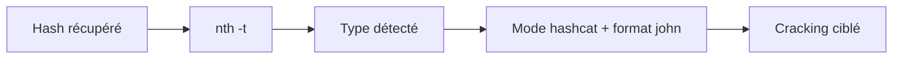
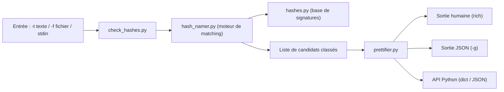

# 💥 Name-That-Hash — Identification du type de hash

> [!info] **En 1 phrase**
> Name-That-Hash identifie instantanément le type d'un hash inconnu et affiche directement les modes hashcat et John the Ripper correspondants, sur plus de 500 formats.

---

## 🧾 Overview

| Champ | Valeur |
|---|---|
| Nom complet | Name-That-Hash (binaire : `nth`) |
| Description | Identification du type d'un hash inconnu (MD5, NTLM, bcrypt, sha512crypt, JWT...) avec affichage direct des modes hashcat et des formats John the Ripper |
| Catégorie | 💥 Exploitation & Cracking |
| Sous-catégorie | Reconnaissance de hash / cracking de mots de passe |
| Fonction principale | Nommer l'algorithme d'un hash en analysant sa signature (longueur, caractères, structure) et trier les candidats par popularité |
| Type d'outil | CLI (`nth`) + bibliothèque Python + application web (https://nth.skerritt.blog) |
| Licence | GPL-3.0-or-later |
| Open source / propriétaire | Open source |
| Langage(s) de programmation | Python 3.7+ (bibliothèques `click` et `rich`) |
| Développeur / organisation | HashPals — Brandon Skerritt (`bee_sec_san`), créateur de RustScan et Ciphey |
| Projet officiel | HashPals / Name-That-Hash |
| Dépôt officiel | https://github.com/HashPals/name-that-hash |
| Documentation officielle | https://github.com/HashPals/name-that-hash/wiki |
| Date de création | 2021 (successeur moderne de HashID et Hash-Identifier) |
| État du projet | maintenu (versions publiées sur PyPI) |
| Dernière version connue | 1.11.0 (PyPI) |
| Systèmes compatibles | Linux / Windows / macOS / BSD (tout système avec Python 3.7+) |

> [!note] Pour vérifier / compléter
> Champs laissés vides si l'information n'est pas confirmée par une source officielle.

---

## 🎯 Concept

Face à un hash inconnu (dérobé dans `/etc/shadow`, une fuite de base de données, un token JWT encodé...), la première question est : *quel algorithme ?* Name-That-Hash répond en analysant la longueur, les caractères et la structure du hash, puis en confrontant ces signatures à sa base de plus de 500 types.

Son intérêt majeur par rapport à hashid : la sortie est **directement opérationnelle** — chaque type détecté est accompagné des modes `hashcat` et des formats `john` à utiliser. C'est la brique « reconnaissance » du workflow de cracking : on identifie le bon mode, on le vérifie, puis on lance le crack.

La base de signatures couvre des familles très larges : Unix (`/etc/shadow`), Windows (NTLM, DCC2, DPAPI), web (JWT, bcrypt, PBKDF2), réseaux (NetNTLMv1/v2, Kerberos), archives et formats spéciaux. Chaque résultat précise aussi la fréquence de rencontre (common / uncommon / rare), ce qui aide à départager les candidats ambigus.



---

## 🧠 Concepts fondamentaux

| Concept | Explication |
|---|---|
| **Fonction de hachage** | Transformation unidirectionnelle d'un mot de passe en empreinte de taille fixe (MD5 : 128 bits, SHA-256 : 256 bits...) ; on ne peut pas « déhacher », seulement redeviner et comparer |
| **Hash salé** | Ajout d'un sel aléatoire (`$6$sel$...`, `$2b$12$sel...`) pour empêcher les tables arc-en-ciel et les attaques par dictionnaire précalculées ; le sel est stocké dans l'empreinte elle-même |
| **Signature de hash** | Motif caractéristique : préfixe signé (`$1$`, `$5$`, `$6$`, `$2a$/`$2b$`, `$P$`...), longueur en hexadécimal (32 = MD5/NTLM, 40 = SHA-1, 64 = SHA-256), encodage (hex, Base64, Base64 URL pour JWT) |
| **Ambiguïté de type** | Deux algorithmes peuvent produire des empreintes de même longueur (MD5 et NTLM : 32 caractères hexadécimaux) ; l'outil liste les candidats, le contexte doit trancher |
| **Popularité** | Classement des candidats par fréquence réelle de rencontre (common > uncommon > rare) pour éviter de proposer d'abord un format obscur |
| **Modes hashcat / formats John** | Identifiants numériques (`-m 0` = MD5, `-m 1000` = NTLM, `-m 3200` = bcrypt, `-m 1800` = sha512crypt) et formats nommés (`raw-md5`, `nt`, `bcrypt`) que `nth` affiche pour chaque candidat |
| **Hachage de mots de passe vs empreinte de fichier** | Pour les mots de passe, on privilégie des KDF lents et saltés (argon2id, bcrypt, scrypt) ; MD5/SHA-1 rapides sont cassables quasi instantanément |

---

## 🛠️ Installation

### Debian / Ubuntu / Kali Linux

```bash
sudo apt update && sudo apt install -y name-that-hash

# Alternative : environnement Python isolé
pipx install name-that-hash
```

### Arch Linux

```bash
sudo pacman -S python-name-that-hash
```

### macOS

```bash
brew install name-that-hash
```

### REMnux

```bash
# Pré-installé dans la distribution REMnux
nth --help
```

### Windows / pip (toutes plateformes)

```powershell
python -m pip install --user name-that-hash
```

### Compilation depuis les sources

```bash
git clone https://github.com/HashPals/name-that-hash.git && cd name-that-hash
python -m pip install -e .
```

> [!warning] ⚠️ Prérequis & problèmes potentiels
> - Python 3.7+ obligatoire (le binaire affiche un message explicite sinon).
> - `pipx` est la méthode conseillée pour ne pas polluer l'environnement Python global.
> - L'application web https://nth.skerritt.blog fonctionne sans installation (les hashes sont envoyés au serveur : ne pas l'utiliser sur des données sensibles).

---

## ⚙️ Configuration

Name-That-Hash n'utilise **aucun fichier de configuration** ni variable d'environnement : tout se pilote par options de la ligne de commande. Les seuls éléments « configurables » sont les options d'affichage et la base de signatures :

| Paramètre | Rôle | Valeur possible | Impact | Exemple |
|---|---|---|---|---|
| `--no-banner` | Masque le bannière ASCII au démarrage | flag | Sortie plus propre pour les scripts | `nth -t '...' --no-banner` |
| `--no-hashcat` | Supprime les modes hashcat de la sortie | flag | Réduit le bruit quand on utilise John | `nth -t '...' --no-hashcat` |
| `--no-john` | Supprime les formats John de la sortie | flag | Réduit le bruit quand on utilise hashcat | `nth -t '...' --no-john` |
| `-a, --accessible` | Mode épuré (sans ASCII art ni longs blocs) | flag | Lisibilité / accessibilité | `nth -t '...' -a` |
| `-g, --greppable` | Sortie JSON structurée (scriptable) | flag | Parsing avec `jq` | `nth -t '...' -g \| jq .` |
| `-b64` | Décode le Base64 avant identification | flag | Hashes encodés | `nth -t 'NGFkMzQ4YmRjY2Zi...' -b64` |
| `-e, --extreme` | Cherche les hashes noyés dans une chaîne | flag | Logs, fichiers mixtes | `nth -e -t '####5d41402abc4b2a76b9719d911017c592###'` |
| `-v` | Verbosité (logs de debug, compteur) | 1-3 | Diagnostic | `nth -t '...' -vvv` |

---

## 🏗️ Architecture interne

Le paquet Python `name_that_hash` est organisé en modules à responsabilité unique :



| Module | Rôle |
|---|---|
| `runner.py` | Point d'entrée CLI (Click) : parsing des options, gestion du bannière, verbosité |
| `hashes.py` | Base de données de prototypes : regex de signature + nom, popularité, description, modes hashcat et formats John |
| `hash_namer.py` | Moteur de matching : confronte l'empreinte à chaque prototype et classe les résultats par popularité |
| `check_hashes.py` | Gestion des entrées (hash unique, fichier multi-hash, mode `extreme`) et décodage Base64 optionnel |
| `prettifier.py` | Rendu de la sortie (tableaux `rich`, version greppable JSON, mode accessible) et API `turn_hash_objs_into_dict` |

À l'exécution : `nth` construit un objet `Name_That_Hash(hashes.prototypes)`, chaque hash d'entrée est testé contre la base de regex, les candidats sont triés par popularité, puis la sortie est rendue en humain ou en JSON. L'outil peut aussi s'importer comme bibliothèque (`from name_that_hash import runner`) et expose les fonctions `api_return_hashes_as_json` et `api_return_hashes_as_dict` pour intégration programmatique.

---

## ⌨️ Commandes

### Commandes principales

```bash
nth --text '5f4dcc3b5aa765d61d8327deb882cf99'
nth -t '5f4dcc3b5aa765d61d8327deb882cf99'
```

| Commande | Objectif | Résultat attendu |
|---|---|---|
| `nth -t '5f4dcc3b5aa765d61d8327deb882cf99'` | Identifier un hash passé en argument (utiliser des guillemets simples, les doubles « cassent » sur Linux) | Liste des types possibles (MD5, NTLM...) avec modes hashcat/john et fréquences |
| `nth -f hashes.txt` | Identifier tous les hashes d'un fichier (un par ligne, UTF-8) | Une analyse complète par ligne |
| `echo '5f4dcc3b5aa765d61d8327deb882cf99' \| nth` | Lire depuis stdin | Analyse du hash reçu en pipe |
| `nth -t '5f4dcc3b5aa765d61d8327deb882cf99' -g` | Sortie JSON (greppable) | Objet JSON scriptable avec `jq` |
| `nth -t '5f4dcc3b5aa765d61d8327deb882cf99' -b64` | Décoder le Base64 avant identification | Identification de l'empreinte décodée |
| `nth -e -t '####5d41402abc4b2a76b9719d911017c592###'` | Mode « extreme » : trouver le hash noyé dans une chaîne | `5d41402abc4b2a76b9719d911017c592` (MD5) détecté |
| `nth --help` | Afficher l'aide complète | Liste des options |

### Commandes avancées

```bash
# Pipeline : identification puis extraction JSON du premier mode hashcat proposé
nth -t '5f4dcc3b5aa765d61d8327deb882cf99' -g | jq -r '.[0].hashcat // empty'

# Traitement d'un fichier de hashes hétérogènes + sélection des modes uniques
while read h; do echo "$h" | nth -g | jq -r '.[].hashcat // empty'; done < fuite.txt | sort -u

# Mode accessible sans bannière, sans couleurs, pour logs/CI
nth -t '$6$rounds=656000$0PNQURm7Dm5ULGYB$.....' -a --no-banner --no-hashcat
```

---

## 🎚️ Options et flags

| Option | Description | Exemple | Niveau |
|---|---|---|---|
| `-t, --text <hash>` | Identifier un hash unique (guillemets simples !) | `nth -t '900150983cd24fb0d6963f7d28e17f72'` | Basic |
| `-f, --file <fichier>` | Identifier tous les hashes d'un fichier (un par ligne) | `nth -f hashes.txt` | Basic |
| `-g, --greppable` | Sortie JSON structurée, idéale pour grep/jq | `nth -t '...' -g` | Intermediate |
| `-a, --accessible` | Mode épuré, sans ASCII art ni gros blocs | `nth -t '...' -a` | Intermediate |
| `--no-banner` | Supprime la bannière ASCII de démarrage | `nth -t '...' --no-banner` | Basic |
| `--no-hashcat` | Cache les modes hashcat | `nth -t '...' --no-hashcat` | Intermediate |
| `--no-john` | Cache les formats John the Ripper | `nth -t '...' --no-john` | Intermediate |
| `-b64, --base64` | Décode le Base64 avant identification (avec fallback) | `nth -t 'NWY0ZGNjM2I1...' -b64` | Advanced |
| `-e, --extreme` | Cherche les hashes à l'intérieur d'une chaîne plus longue | `nth -e -t 'prefix 5d41402abc4b2a76b9719d911017c592 suffix'` | Advanced |
| `-v, --verbose` | Logs de débogage (`-vvv` = maximum) | `nth -t '...' -vvv` | Expert |
| `--help` | Afficher l'aide | `nth --help` | Basic |

> [!tip] Options les plus utiles au quotidien
> - `-t` : identifier un hash isolé (l'usage 90 % du temps).
> - `-g` : sortie JSON pour parser et automatiser le choix du mode hashcat.
> - `-b64` : ne pas oublier quand le hash a été transporté en Base64 (JWT, exports de CTF).
> - `--no-banner` : sortie propre pour les scripts et la CI.

---

## 🧪 Exemples pratiques

### Beginner

```bash
# Objectif : identifier un hash de 32 caractères hexadécimaux
nth -t '5f4dcc3b5aa765d61d8327deb882cf99'
```

Résultat attendu : liste des candidats (MD5, NTLM, et autres formats 32-hex) avec pour chacun les modes hashcat (`-m 0`, `-m 1000`...) et les formats John (`raw-md5`, `nt`...), triés par popularité.

```bash
# Objectif : identifier tous les hashes d'un fichier de fuite
nth -f hashes.txt
```

Erreur possible : fichier non encodé en UTF-8 → message d'erreur de lecture ; convertir le fichier ou filtrer les lignes binaires au préalable.

### Intermediate

```bash
# Objectif : sortie JSON pour chaîner avec jq et hashcat
nth -t '5f4dcc3b5aa765d61d8327deb882cf99' -g | jq '.[0]'
```

```bash
# Objectif : hash encodé en Base64
nth -t 'JGIyJDEyJGVJbWlUWHVXdnFNMzdZNEpBTmpRPT0=' -b64
```

### Advanced

```bash
# Objectif : extraire automatiquement le premier mode hashcat proposé
MODE=$(nth -t '5f4dcc3b5aa765d61d8327deb882cf99' -g | jq -r '.[0].hashcat')
echo "hashcat -m $MODE -a 0 hash.txt rockyou.txt"
```

### Expert

```bash
# Objectif : intégrer nth dans un pipeline de tri + crack
mkdir -p par_mode
while read h; do
  mode=$(echo "$h" | nth -g | jq -r '.[0].hashcat // empty')
  [ -n "$mode" ] && echo "$h" >> "par_mode/mode_$mode.txt"
done < fuite.txt
ls par_mode/
```

```python
# Objectif : utiliser Name-That-Hash comme bibliothèque Python
from name_that_hash import runner

resultats = runner.api_return_hashes_as_json(["5f4dcc3b5aa765d61d8327deb882cf99"])
print(resultats[0]["name"], resultats[0]["hashcat"])
```

---

## 🧪 Workflow complet (scénario pas à pas)

1. **Récupérer le hash** — depuis un dump `/etc/shadow`, une fuite SQL, un cookie ou un endpoint : `$1$...`, `e99a18c4...`, `5e884898...`.
2. **Identifier le type** :
   ```bash
   nth -t 'e99a18c428cb38d5f260853678922e03'
   ```
3. **Lire les modes proposés** — la sortie liste les candidats (ex. MD5, NTLM...) avec les commandes exactes :
   ```bash
   hashcat -m 0 -a 0 hash.txt wordlist.txt
   john --format=raw-md5 hash.txt
   ```
4. **Vérifier le candidat** — tester le mode avec `--example-hashes` de hashcat pour confirmer le format sur un hash de référence :
   ```bash
   hashcat -m 0 --example-hashes | head
   ```
5. **Cracker** — lancer hashcat/john avec le bon mode et une wordlist adaptée :
   ```bash
   hashcat -m 0 -a 0 hash.txt /usr/share/wordlists/rockyou.txt
   ```
6. **Cas sans candidat net** — vérifier la présence d'un sel (`$6$...` pour sha512crypt), d'un préfixe (`{SHA256}`, `{CRYPT}`) ou d'un encodage (Base64 → `-b64`) avant de trancher.

Le choix du mode hashcat détermine toute la performance du crack : privilégie les modes GPU-friendly (mode 0 pour MD5, mode 1000 pour NTLM, mode 22000 pour WPA) et adapte l'attaque (`-a 0` wordlist, `-a 3` masque, `-a 6`/`-a 7` hybrides) au contexte identifié.

---

## 🎬 Scénarios avancés

### Scénario 1 : Identification en boucle sur plusieurs hashes

```bash
while read h; do echo "=== $h ==="; echo "$h" | nth -g; done < hashes.txt
```

Tri rapide d'un ensemble de hashes hétérogènes (fuite SQL multi-algorithmes).

```bash
# Sélection automatique du premier mode hashcat proposé par nth (JSON)
while read h; do echo "$h" | nth -g | jq -r '.[0].hashcat // empty'; done < hashes.txt | sort -u
```

### Scénario 2 : Ambiguïté MD5 / NTLM

Un hash de 32 caractères hexadécimaux est aussi bien un MD5 qu'un NTLM. `nth` affiche les deux : croiser avec le contexte (hash NT vs hash MD5 d'un mot de passe) et, si besoin, tester les deux modes sur un plaintext probable.

```bash
# Tester les deux candidats sur un même fichier
hashcat -m 0 hash.txt wordlist.txt          # MD5
hashcat -m 1000 hash.txt wordlist.txt       # NTLM
# Le mode qui produit des résultats cohérents est le bon
```

---

## 🛡️ Cybersecurity use cases

Name-That-Hash intervient dans la phase **post-exploitation / compromission de mots de passe** : une fois un hash récupéré sur la cible, il faut en déterminer le type pour choisir le bon outil de cracking.

| Phase | Utilisation |
|---|---|
| Reconnaissance | Peu pertinent (aucun signal réseau émis par l'outil) |
| Énumération | Identification de hashes exposés dans des fichiers ou réponses API |
| Exploitation | Chaînage avec hashcat/john pour casser les identifiants obtenus |
| Post-exploitation | Analyse des hashes de `/etc/shadow`, SAM, NTDS.dit, cookies de session |
| Cracking / Credential Access | Choix du mode hashcat (`-m`) et du format John exacts |
| Reporting | Documentation du type d'algorithme faible rencontré (ex. MD5 non salé) |

---

## 🎯 MITRE ATT&CK

| Tactique | Technique / Sub-technique | ID | Raison | Détection | Mitigation |
|---|---|---|---|---|---|
| Credential Access | Brute Force: Password Cracking | T1110.002 | Casse hors-ligne des hashes de mots de passe une fois leur type identifié | Surveillance des accès aux fichiers de hashes (`/etc/shadow`, SAM, NTDS.dit), alertes sur les lectures répétées | KDF lents (argon2id, bcrypt, scrypt), salage systématique, interdiction des hashes non salés |
| Credential Access | OS Credential Dumping: /etc/passwd and /etc/shadow | T1003.008 | Les hashes analysés proviennent typiquement des fichiers d'identifiants Unix | auditd / Sysmon sur lecture de `/etc/shadow`, EDR sur accès aux registres SAM | Durcir `/etc/shadow`, privilèges minimaux, lecture protégée par capabilities |
| Credential Access | Unsecured Credentials: Credentials In Files | T1552.001 | Hashes découverts dans des fichiers de config, exports ou caches | DLP / scans de contenu, détection d'exports de bases d'identifiants | Chiffrement des fichiers sensibles, rotation des secrets |

> [!note] Ne renseigner que si l'association est réellement pertinente.
> Name-That-Hash est une brique d'analyse *offline* : les techniques listées sont celles de la *chaîne* (récupération + crack) dans laquelle il s'insère, pas d'un signal réseau qu'il émettrait lui-même.

---

## 🛡️ Defensive Security

Name-That-Hash ne génère **aucun trafic réseau** : il est impossible de le détecter à distance. En revanche, son utilisation s'inscrit dans une chaîne (lecture de hashes, puis cracking) dont chaque maillon est observable côté défense.

### Signes observables

| Indicateur | Détail |
|---|---|
| Lecture anormale de `/etc/shadow` ou de la SAM | Souvent le préalable à l'analyse de hashes ; corréler avec les logs d'authentification |
| Exports de bases d'identifiants (fuites, dumps SQL) | Traitement massif de hashes sur la machine de l'attaquant, invisible mais documenté après incident |
| Présence de wordlists et d'outils de cracking sur un poste | hashcat, john, nth, wordlists (`rockyou.txt`) ; indicateur de préparation |
| Pics CPU/GPU localisés | Cracking en cours (hors-ligne) sur la machine de l'attaquant |
| Tentatives de connexion réussies avec des mots de passe réutilisés | Résultat final du workflow ; corréler avec le vol de hashes |

### Règles de détection (Sigma / Suricata / Snort / YARA)

```yaml
# Exemple Sigma : accès suspect au fichier /etc/shadow
title: Suspicious Access to /etc/shadow
id: 4f4c3c9a-8e2a-4c1a-b7e0-3f6a9b1d2c5e
status: experimental
logsource:
    product: linux
    service: auditd
detection:
    selection:
        type: SYSCALL
        comm|endswith:
            - cat
            - tail
            - strings
        arg2: /etc/shadow
    condition: selection
falsepositives:
    - Administration système légitime
level: high
```

La détection se fait surtout au niveau **système** (auditd, Sysmon, EDR sur fichiers de hashes) et **SIEM** (corrélation lecture de hashes → connexions avec identifiants). Le réseau apporte peu : Suricata/Snort ne sont pertinents que pour les dumps de hashes exposés sur HTTP.

---

## 🤖 Automatisation

```bash
# Identifier un lot de hashes et générer les commandes hashcat correspondantes
while read h; do
  mode=$(echo "$h" | nth -g | jq -r '.[0].hashcat // empty')
  if [ -n "$mode" ]; then
    echo "echo '$h' > hash_$mode.txt; hashcat -m $mode -a 0 hash_$mode.txt wordlist.txt"
  fi
done < fuite.txt
```

```python
# API Python : classification en masse
from name_that_hash import runner

hashes = [l.strip() for l in open("fuite.txt") if l.strip()]
resultats = runner.api_return_hashes_as_json(hashes)
for r, h in zip(resultats, hashes):
    print(h, "->", r[0]["name"], r[0]["hashcat"] if r else "inconnu")
```

```bash
# Dans un pipeline CI/CD de test de sécurité applicatif
nth -t "$(curl -s https://example.com/token)" -g --no-banner | jq -r '.[0].name'
```

---

## 📤 Output et parsing

La sortie par défaut est **humaine** (tableaux colorés `rich`, classés par popularité, avec modes hashcat et formats John). La sortie `-g` est du **JSON** structuré, scriptable avec `jq`.

```bash
nth -t '5f4dcc3b5aa765d61d8327deb882cf99' -g | jq '.[0]'
```

```bash
# Extraire le premier mode hashcat disponible
nth -t '5f4dcc3b5aa765d61d8327deb882cf99' -g | jq -r '.[0].hashcat'
```

```python
# Parsing en Python via la bibliothèque
from name_that_hash import runner

d = runner.api_return_hashes_as_dict(["5f4dcc3b5aa765d61d8327deb882cf99"])
print(d[0][0]["name"])
```

---

## 🔗 Intégrations

```text
Fuites / shadow / SAM → Name-That-Hash → hashcat (modes -m) → Valid Accounts
                     → John the Ripper (formats --format) → Valid Accounts
                     → hashid (recoupement des candidats ambigus)
```

- [[Tools|🧰 Outils]] — catalogue des outils du vault
- [[Outils/Outil - hashcat|hashcat]] — cracker GPU à alimenter avec le mode identifié
- [[Outils/Outil - John the Ripper|John the Ripper]] — cracker CPU à alimenter avec le format identifié
- [[Outil - hashid|hashid]] — outil équivalent plus ancien, utile pour recouper
- [[Techniques/Password Cracking|Password Cracking]] — workflow complet de cracking

L'application web https://nth.skerritt.blog offre la même fonctionnalité sans installation (pratique pour un hash isolé, à éviter sur données sensibles).

---

## 🔄 Alternatives

| Outil | Avantages | Inconvénients | Cas d'usage |
|---|---|---|---|
| [[Outil - hashid|hashid]] | Léger, très connu, base héritée de HashID | Plus maintenu (dernière mise à jour 2015), pas de modes hashcat/john intégrés | Recoupement rapide sur un hash ambigu |
| Hash-Identifier | Historique, simple | Daté (2011), base limitée | Postes très restreints |
| CyberChef (module « Magic » / « Identify Hash ») | GUI, aucune install, analyse multi-formats | Pas de commande en CLI, moins précis sur les formats rares | Analyse ponctuelle dans le navigateur |
| Application web nth | Sans installation, même moteur | Envoi des hashes en ligne | Hash isolé et non sensible |
| hashcat `--identify` | Directement intégré au cracker | Moins riche (pas de popularité/description) | Quand hashcat est déjà la cible |

> **Quand utiliser Name-That-Hash plutôt que hashid ?** Dès que tu veux une sortie **directement exploitable** (modes hashcat + formats John affichés) et une base **à jour** : hashid sert au recoupement, Name-That-Hash à la prise de décision opérationnelle.

---

## ⚡ Performance

- **Temps d'identification quasi nul** : le matching est une comparaison de regex en mémoire, de l'ordre de la milliseconde par hash.
- **Aucune consommation réseau** : l'outil est 100 % local et fonctionne hors-ligne.
- **Mémoire faible** : la base de signatures charge en quelques Mo ; un fichier de milliers de hashes (`-f`) est traité en secondes.
- **Aucun parallélisme exploité** : le goulot est l'I/O (lecture du fichier), pas le CPU — inutile de surdimensionner.
- **Limites pratiques** : ce n'est pas un moteur de cracking ; il ne consomme jamais de GPU. Les chiffres ci-dessus sont des ordres de grandeur observés, non une promesse de benchmark.

---

## 🛠️ Troubleshooting

### Common problems

#### Problème : « Name That Hash requires Python 3.7+ »

- **Cause** : Python trop ancien sur le système.
- **Solution** : mettre à niveau Python ou utiliser un environnement récent (`pipx`, venv, ou le binaire officiel des Releases). Vérifier avec `python --version`.

#### Problème : le hash n'est pas identifié / sortie vide

- **Cause** : format inconnu de la base, ou hash encodé (Base64) non décodé.
- **Solution** : essayer `-b64` ; vérifier le préfixe (`{SHA256}`, `$6$`...) ; si le type est légitime mais absent, l'ajouter dans `hashes.py`. Tester avec `-vvv` pour le déroulé.

#### Problème : erreur de lecture de fichier (encoding)

- **Cause** : fichier non UTF-8 (l'option `-f` attend de l'UTF-8).
- **Solution** : convertir le fichier (`iconv -f ISO-8859-1 -t UTF-8 fuite.txt > fuite_utf8.txt`) puis relancer `nth -f fuite_utf8.txt`.

#### Problème : les guillemets doubles « cassent » la commande

- **Cause** : `$` et `$6$...` sont interprétés par le shell entre guillemets doubles.
- **Solution** : utiliser **toujours des guillemets simples** : `nth -t '$6$rounds=656000$sel$hash'`.

#### Problème : candidats ambigus (MD5 vs NTLM, etc.)

- **Cause** : plusieurs algorithmes partagent la même signature.
- **Solution** : recouper avec le contexte (source du hash), `hashid`, et valider le mode avec `hashcat -m <mode> --example-hashes` ; le plaintext trouvé doit coller au contexte (ex. hash NT sur un domaine AD).

---

## 🔐 Sécurité de l'outil

- **Aucune exfiltration** : l'exécution locale de `nth` n'envoie **rien** sur le réseau — c'est le point clé pour des hashes de production. À l'inverse, l'application web https://nth.skerritt.blog transmet le hash au serveur : ne jamais l'utiliser sur des hashes réels sensibles.
- **Permission** : aucun besoin de root pour fonctionner.
- **Secrets** : un hash identifié reste un secret (il peut être cracké) ; ne pas le coller dans des tickets, logs partagés ou outils en ligne non fiables.
- **Supply chain** : installer de préférence via le paquet officiel de la distribution ou PyPI (`name-that-hash`) ; vérifier les intégrité via checksums PyPI si besoin.
- **Extensibilité** : si tu ajoutes des prototypes dans `hashes.py`, les faire relire (regex) pour éviter des faux positifs introduits par erreur.
- **Bonne pratique** : ne jamais « identifier » un hash sur un poste compromis avec un outil dont la provenance n'est pas vérifiée.

---

## ⚠️ Limitations

- **N'identifie pas tout** : les formats très récents ou exotiques peuvent être absents de la base (extensible via `hashes.py`).
- **Ne cracke pas** : c'est uniquement une brique d'identification ; il faut la chaîner avec [[Outils/Outil - hashcat|hashcat]] ou [[Outils/Outil - John the Ripper|John the Ripper]].
- **Ne lève pas les ambiguïtés** : MD5 vs NTLM, SHA-256 vs SHA3-256... — le contexte (source, sel, encodage) doit trancher.
- **Ne détecte pas la présence d'un sel** : un hash salé avec un mode non salé donnera des cracks interminables et faux.
- **Base64** : le décodage est optionnel (`-b64`) ; sans lui, un hash encodé est mal identifié.
- **Fichiers** : l'option `-f` attend de l'UTF-8, un seul hash par ligne.
- **Pas de support du cracking** ni d'analyse forensique poussée : outil spécialisé et volontairement minimal.

---

## 📋 Cheatsheet

```bash
# Identifier un hash (guillemets simples obligatoires)
nth -t '5f4dcc3b5aa765d61d8327deb882cf99'

# Identifier tous les hashes d'un fichier
nth -f hashes.txt

# Sortie JSON pour automatisation
nth -t '5f4dcc3b5aa765d61d8327deb882cf99' -g | jq -r '.[0].hashcat'

# Hash encodé en Base64
nth -t 'NWY0ZGNjM2I1YWE3NjVkNjFkODMyN2RlYjg4MmNmOTk=' -b64

# Hash noyé dans une chaîne (logs, tokens)
nth -e -t 'token=5d41402abc4b2a76b9719d911017c592'

# Sortie épurée sans bannière
nth -t '5f4dcc3b5aa765d61d8327deb882cf99' -a --no-banner

# Chaînage direct avec hashcat
nth -t '5f4dcc3b5aa765d61d8327deb882cf99' -g | jq -r '.[0].hashcat'
hashcat -m 0 -a 0 hash.txt wordlist.txt
```

---

## ⚡ Quick reference

| | |
|---|---|
| **À quoi sert-il ?** | Identifier le type d'un hash inconnu et afficher les modes hashcat / formats John correspondants |
| **Quand l'utiliser ?** | Dès qu'un hash est récupéré (shadow, SAM, fuite, API), avant tout cracking |
| **Commande principale** | `nth -t '5f4dcc3b5aa765d61d8327deb882cf99'` |
| **Alternative principale** | `hashid` (recoupement) ou l'application web nth (ponctuel) |
| **Concepts importants** | Signature de hash, sel, popularité, modes hashcat, formats John, JSON |
| **Liens associés** | [[Outils/Outil - hashcat|hashcat]], [[Outils/Outil - John the Ripper|John the Ripper]], [[Outil - hashid|hashid]], [[Techniques/Password Cracking|Password Cracking]] |

---

## 🔍 Détection & Défense

| Signe | Défense |
|---|---|
| Hash récupérable depuis la cible | Ne jamais stocker de hash non salé ; chiffrer les données sensibles |
| Mots de passe faibles crackables rapidement | Algorithme de hachage à haute résistance (argon2id, bcrypt, scrypt) + sel |
| Fuite d'identifiants réutilisés | MFA, monitoring des fuites, rotation des mots de passe |
| Hash non salé réutilisable sur plusieurs services | Saler + utiliser des KDF lents, abandonner MD5/SHA1 pour les mots de passe |
| Nombre de tentatives d'authentification en hausse | Rate limiting, alertes sur les pics de connexion |
| Lecture suspecte de fichiers de hashes (`/etc/shadow`, SAM, NTDS.dit) | auditd / Sysmon / EDR, alertes SIEM sur accès anormaux |

---

## ⚠️ Tips & Pièges

> [!tip] 💡 **Tips**
> - Utilise `-g` (JSON) dans tes scripts pour parser le résultat et choisir automatiquement le mode hashcat avec `jq -r '.[0].hashcat'`.
> - Toujours des **guillemets simples** pour les hashes : les `$` des formats saltés (`$6$`, `$2b$`) seraient interprétés par le shell.
> - Pense à `-b64` quand le hash provient d'un export, d'un cookie ou d'un JWT : il est souvent encodé en Base64.
> - Le mode `-e` (extreme) est parfait pour fouiller un dump de logs ou un fichier binaire à la recherche de hashes noyés.
> - Combine avec [[Outil - hashid|hashid]] pour recouper les candidats sur les formats ambigus.

> [!warning] ⚠️ **Pièges**
> - Une même empreinte peut correspondre à **plusieurs algorithmes** (MD5 vs NTLM par ex.) : l'outil ne lève pas l'ambiguïté, c'est à toi de trancher.
> - L'outil n'indique pas si un hash est **salé** ou non : un candidat non salé avec un vrai sel donnera des cracks sans fin et faux.
> - Il **ne cracke pas** : c'est uniquement une brique d'identification, il faut la chaîner avec hashcat/john.
> - L'application web envoie le hash en ligne : ne jamais l'utiliser sur des hashes réels sensibles.
> - Le décodage Base64 n'est **pas automatique** : sans `-b64`, un hash encodé est identifié à tort.

---

## 📚 References

### Official

- Dépôt officiel : https://github.com/HashPals/name-that-hash
- Documentation (wiki) : https://github.com/HashPals/name-that-hash/wiki
- Site / application web : https://nth.skerritt.blog
- Paquet PyPI : https://pypi.org/project/name-that-hash/

### Security references

- MITRE ATT&CK — Brute Force: Password Cracking (T1110.002) : https://attack.mitre.org/techniques/T1110/002/
- OWASP — Password Storage Cheat Sheet : https://cheatsheetseries.owasp.org/cheatsheets/Password_Storage_Cheat_Sheet.html
- NIST SP 800-63B — Mémorized Secrets (hachage des mots de passe) : https://pages.nist.gov/800-63-3/sp800-63b.html

### Community

- HashID (projet ayant inspiré Name-That-Hash) : https://github.com/psypanda/hashID
- Blog de l'auteur (Brandon Skerritt) : https://skerritt.blog
- Guides HashPals sur le cracking : https://github.com/HashPals

---

➡️ **Liens :** [[Tools|🧰 Outils]] · [[Techniques/Password Cracking|Password Cracking]] · [[Outils/Outil - hashcat|hashcat]] · [[Outils/Outil - John the Ripper|John the Ripper]] · [[Outil - hashid|hashid]] · [[Outil - BruteDum|BruteDum]]
