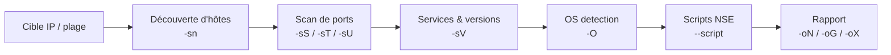

# Nmap — Reconnaissance & Scan

> [!info] **En 1 phrase**
> Nmap (« Network Mapper ») est le scanner de ports de référence pour cartographier un réseau, identifier services, versions, OS et déclencher des scripts d'énumération (NSE).

---

## Overview

| Champ | Valeur |
|---|---|
| Nom complet | Nmap (Network Mapper) |
| Description | Scanner de ports et d'hôtes : découverte d'hôtes, détection de services/versions, fingerprinting OS, scripts NSE |
| Catégorie | Reconnaissance & OSINT |
| Sous-catégorie | Scan & Énumération |
| Type d'outil | CLI (avec GUI Zenmap optionnelle) |
| Licence | Nmap Public Source License (NPSL v0.95), dérivée de la GPLv2 |
| Open source / propriétaire | Open source (licence libre, incompatible avec la GPL standard) |
| Langage(s) | C, C++, Python (Zenmap), Lua (scripts NSE) |
| Développeur / organisation | Gordon Lyon (« Fyodor ») / The Nmap Project |
| Dépôt officiel | https://github.com/nmap/nmap |
| Documentation officielle | https://nmap.org/book/man.html |
| Date de création | Septembre 1997 (première publication dans Phrack) |
| État du projet | actif |
| Dernière version connue | 7.991 (2026-08-05) |
| Systèmes compatibles | Linux, Windows 7+, macOS 10.9+, BSD, Solaris |

> [!note] Pour vérifier / compléter
> La suite Nmap inclut aussi Zenmap (GUI), Ncat, Ndiff et Nping. La licence NPSL est détaillée sur https://nmap.org/npsl/.

---

## Concept

Nmap est l'outil central de la phase de **scan & énumération** : il découvre les hôtes vivants, les ports ouverts, les versions de services et le système d'exploitation. Il s'utilise en scan **actif** (il envoie des paquets à la cible) — donc uniquement sur des cibles autorisées. Son moteur de scripts **NSE** (Nmap Scripting Engine) permet d'aller beaucoup plus loin : énumération SMB, brute-force, détection de vulnérabilités, etc. C'est le premier outil lancé sur toute machine de THM/HTB/Bug Bounty.

Ses sorties multi-formats (`-oN`, `-oX`, `-oG`) alimentent les rapports et les pipelines d'outils (xsltproc, NSE, front-ends). Il gère le scan TCP (SYN, connect), UDP, SCTP, et les techniques d'évasion (fragmentation, spoofing, timing). La phrase de scan classique : `-p-` d'abord pour tout voir, puis `-sC -sV` sur les ports ouverts. Né en 1997 (publication de Gordon Lyon dans Phrack), Nmap s'est imposé grâce au fingerprinting OS (1998), à la détection de versions (1999) et au moteur NSE en Lua (2007). Il s'interconnecte avec tout l'écosystème : `db_nmap` de Metasploit, vuln scanners, rapports automatiques.



---

## Concepts fondamentaux

| Concept | Explication |
|---|---|
| SYN scan (`-sS`) | Envoie un SYN, observe la réponse : SYN-ACK = ouvert, RST = fermé, rien = filtré. Semi-ouvert, nécessite root (sockets raw) |
| TCP Connect scan (`-sT`) | Complète le 3-way handshake (SYN → SYN-ACK → ACK). Utilisable sans root, mais laissera des traces dans les logs |
| UDP scan (`-sU`) | Datagramme UDP vide ; ICMP Port Unreachable = fermé, réponse UDP = ouvert. Lent : limiter aux top-ports |
| États de ports | `open`, `closed`, `filtered` (firewall), `unfiltered`, `open\|filtered`, `closed\|filtered` |
| Découverte d'hôtes | `-sn` (ping sweep), `-Pn` (aucune), sondes TCP `-PS/-PA`, UDP `-PU`, ICMP `-PE/-PP/-PM`, ARP `-PR` (défaut sur LAN) |
| Détection de versions (`-sV`) | Batterie de probes par service pour identifier l'application et sa version ; intensité `--version-intensity 0-9` |
| Fingerprinting OS (`-O`) | Analyse des réponses TCP/IP (fenêtre, TTL, options) pour identifier l'OS |
| NSE | Moteur de scripts en Lua, organisés en catégories (`default`, `safe`, `vuln`, `auth`, `intrusive`…) |
| Timing templates (`-T0` à `-T5`) | Niveaux de vitesse : Paranoid à Insane ; `-T4` courant en lab, `-T1/-T0` pour la furtivité |
| `nmap-services` | Base de fréquence des ports : top 1000 par défaut, `-F` = top 100, `--top-ports N` |
| Ports et protocoles | TCP, UDP, SCTP (`-sY/-sZ`), IP protocol scan (`-sO`) |

---

## Installation

```bash
# Debian/Ubuntu/Kali · Arch · Fedora/RHEL · macOS · Docker
sudo apt update && sudo apt install -y nmap
sudo pacman -S nmap
sudo dnf install nmap
brew install nmap
docker run --rm instrumentisto/nmap -sV scanme.nmap.org
# Windows : choco install nmap (avec Zenmap) — installeur officiel https://nmap.org/download.html
```

```bash
# Compilation depuis les sources
git clone https://github.com/nmap/nmap && cd nmap
./configure && make && sudo make install
```

> [!warning] Prérequis & problèmes potentiels
> - `-sS`, `-O`, `-sU` nécessitent **root** (sockets raw) ; sans root, Nmap bascule en `-sT`.
> - Dépendances de compilation : `libpcap-dev`, `libssl-dev` (optionnel), `lua5.4-dev`, `flex`, `bison`, `libdnet`.
> - Windows : driver **Npcap** requis pour les paquets bruts.

---

## Configuration

Nmap n'utilise **pas** de fichier de configuration utilisateur type `.nmaprc` (confirmé par les développeurs). La configuration passe par des **fichiers de données** et des **options CLI**.

| Paramètre | Rôle | Exemple |
|---|---|---|
| `--datadir <dir>` | Répertoire des fichiers de données | `nmap --datadir /opt/nmap-data` |
| `nmap-services` | Fréquence des ports (top 1000 par défaut) | `nmap --top-ports 200 <cible>` |
| `nmap-protocols` | Liste des protocoles IP (pour `-sO`) | `nmap -sO <cible>` |
| `-iL <fichier>` | Liste de cibles en entrée | `nmap -iL cibles.txt` |

> [!note] À vérifier
> Certaines distributions patchées peuvent lire des fichiers alternatifs. En cas de doute, isoler avec `--datadir`.

---

## Architecture interne

La suite Nmap est composée de plusieurs programmes distincts (dépôt `nmap/nmap`) :

- **Nmap (binaire principal)** : pipeline en phases — analyse des cibles, découverte d'hôtes, scan de ports en parallèle, détection de versions, détection OS, scripts NSE, génération des sorties.
- **NSE** : interpréteur Lua embarqué (`nsock` pour les I/O réseau asynchrones), scripts chargés par catégorie ou nom.
- **Zenmap** : frontend GUI Python · **Ncat** : transfert de données · **Ndiff** : comparaison de scans · **Nping** : génération de paquets.

Bibliothèques : **libpcap** (capture), **libdnet-stripped** (paquets bruts), **PCRE** (regex), **Lua** (NSE), **OpenSSL** (SSL version detection), **liblinear** (OS detection IPv6 par ML).

Flux d'exécution : probes via sockets raw (Unix, root) ou Npcap (Windows) ; réponses triées par état de port ; parallélisme piloté par `--min-parallelism`, `--min-rate`, templates `-T*` et RTT.

---

## Commandes

### Commandes principales

```bash
nmap [Scan Type(s)] [Options] {spécification de cible}
```

| Commande | Objectif | Résultat attendu |
|---|---|---|
| `nmap -sn 10.0.0.0/24` | Ping sweep : hôtes vivants (pas de scan de ports) | Liste d'IP « up » |
| `nmap -sS <cible>` | SYN scan (semi-ouvert, furtif, nécessite root) | Ports open/closed/filtered |
| `nmap -sU --top-ports 100 <cible>` | Scan UDP (lent mais révélateur : SNMP, DNS, TFTP) | Ports UDP ouverts |
| `nmap -sV <cible>` | Détection de la version des services | `OpenSSH 8.2p1` etc. |
| `nmap -O <cible>` | Détection du système d'exploitation | OS deviné + confiance |
| `nmap -A <cible>` | Équivalent `-sV -O --script default` + traceroute | Tout-en-un |
| `nmap -p- <cible>` | Scan des 65 535 ports TCP | Ports sur toute la plage |
| `nmap -sC <cible>` | Scripts NSE par défaut | Énumération étendue |
| `nmap --script vuln <cible>` | Détection de vulnérabilités connues | CVE détectées |
| `nmap -Pn <cible>` | Ignore la découverte d'hôte (ICMP bloqué) | Scan malgré le filtrage ICMP |
| `nmap -oA base` | Sauvegarde en 3 formats (nmap, gnmap, xml) | Fichiers `base.*` |

### Commandes avancées

```bash
# Scan complet "toujours" lancé en premier (THM/HTB)
sudo nmap -sC -sV -O -oA nmap/full 10.10.10.10
# Scan de tous les ports (65535) très rapide, puis re-scan précis
sudo nmap -p- --min-rate 4000 -oN nmap/allports 10.10.10.10
# Script NSE spécifique avec arguments
sudo nmap -p 80 --script http-enum --script-args http-enum.displayall 10.10.10.10
# Scan furtif avec décoys et fragmentation
sudo nmap -sS -T1 -f --data-length 200 -D 8.8.8.8,1.1.1.1 -Pn 10.10.10.10
```

### Scripts NSE utiles

```bash
sudo nmap -p 445 --script smb-enum-shares,smb-os-discovery 10.10.10.10
sudo nmap -p 80 --script http-enum,http-headers 10.10.10.10
sudo nmap -p 1433 --script ms-sql-info,ms-sql-empty-password 10.10.10.10
```

Scripts fréquents : `dns-zone-transfer`, `ftp-anon`, `smb-vuln-ms17-010`, `http-title`, `ssl-cert`, `ssh2-enum-algos`.

---

## Options et flags

| Option | Description | Exemple | Niveau |
|---|---|---|---|
| `-sS` / `-sT` | SYN / Connect scan | `nmap -sS 10.10.10.10` | Basic |
| `-sV` / `-O` | Versions / détection OS | `nmap -sV -O 10.10.10.10` | Basic |
| `-A` | Tout-en-un (`-sV -O --script default` + traceroute) | `nmap -A 10.10.10.10` | Basic |
| `-sC` | Scripts NSE par défaut | `nmap -sC 10.10.10.10` | Basic |
| `-p-` / `-p 22,80` | Tous les ports / ports spécifiques | `nmap -p- 10.10.10.10` | Basic |
| `-Pn` | Ignore la découverte d'hôte | `nmap -Pn 10.10.10.10` | Basic |
| `-sn` | Ping sweep | `nmap -sn 10.0.0.0/24` | Basic |
| `-oA base` | Sauvegarde 3 formats | `nmap -oA scan 10.10.10.10` | Basic |
| `-sU` | Scan UDP | `nmap -sU --top-ports 100 10.10.10.10` | Intermediate |
| `-F` / `--top-ports N` | Fast / top N ports | `nmap -F 10.10.10.10` | Intermediate |
| `-PE/-PS/-PA` | Sondes ICMP/TCP SYN/TCP ACK | `nmap -PS22,80 10.10.10.10` | Intermediate |
| `--script vuln` | Vulnérabilités connues | `nmap --script vuln 10.10.10.10` | Intermediate |
| `--open` / `--reason` | Ports ouverts / raison d'état | `nmap --open 10.10.10.10` | Intermediate |
| `-iL <f>` / `--exclude` | Liste de cibles / exclusion | `nmap -iL cibles.txt` | Intermediate |
| `-n` / `-R` | Sans / avec résolution DNS | `nmap -n 10.10.10.10` | Intermediate |
| `-sN/-sF/-sX` | Scans NULL/FIN/Xmas | `nmap -sN 10.10.10.10` | Advanced |
| `-f` / `--mtu 24` | Fragmentation | `nmap -f 10.10.10.10` | Advanced |
| `--script-args` | Arguments NSE | `nmap --script smb-brute --script-args userdb=users.txt` | Advanced |
| `-D <decoy1,decoy2>` | Décoys pour masquer l'origine | `nmap -D 8.8.8.8,1.1.1.1 10.10.10.10` | Expert |
| `-sI <zombie>` | Idle scan via un zombie | `nmap -sI 10.10.14.9 10.10.10.10` | Expert |
| `--spoof-mac` | Spoof MAC (Linux) | `nmap --spoof-mac 00:11:22:33:44:55 10.10.10.10` | Expert |
| `--resume <f>` | Reprend un scan interrompu | `nmap --resume allports.nmap` | Expert |

> [!tip] Options les plus utiles au quotidien
> `-sC -sV -p-` (énumération complète), `-oA <base>` (sauvegarde), `-Pn` (contourner ICMP), `--open` (aller à l'essentiel), `--min-rate 4000` (accélérer).

---

## Exemples pratiques

### Beginner

```bash
# Découvrir les hôtes vivants du sous-réseau
nmap -sn 10.10.10.0/24
# Scan rapide des 1000 ports les plus courants avec versions
sudo nmap -sV --top-ports 1000 10.10.10.10
```

### Intermediate

```bash
# Scan complet + scripts + versions, puis scripts ciblés
sudo nmap -sC -sV -oA full 10.10.10.10
sudo nmap -p 445 --script smb-enum-shares,smb-os-discovery 10.10.10.10
```

### Advanced

```bash
# Scan UDP ciblé sur les services d'administration (SNMP 161, NTP 123, DNS 53)
sudo nmap -sU --top-ports 25 -sV 10.10.10.10
# Détection de vulnérabilités connues sur un service exposé
sudo nmap -p 445 --script vuln --script-args vulns.showall 10.10.10.20
```

### Expert

```bash
# Scan de portée avec exclusion, sortie greppable pour pipeline
sudo nmap -sV -iL cibles.txt --exclude 10.10.10.10 -oG scan.gnmap
# Scan furtif en engagement réel (décoys + fragmentation + timing)
sudo nmap -sS -T1 -f --data-length 200 -D 8.8.8.8,1.1.1.1 -Pn 10.10.10.10
```

---

## Workflow complet (scénario pas à pas)

1. **Découverte** : `nmap -sn 10.10.10.0/24` → 3 hôtes vivants, on cible 10.10.10.10.
2. **Scan complet des ports** : `sudo nmap -p- --min-rate 4000 -oN allports 10.10.10.10` → 22, 80, 8080.
3. **Re-scan ciblé** : `sudo nmap -sC -sV -p 22,80,8080 -oA detail 10.10.10.10` → OpenSSH 8.2, Apache 2.4.41, Tomcat 9.
4. **Approfondissement** : `sudo nmap -p 8080 --script http-enum,http-title 10.10.10.10` → manager Tomcat détecté.
5. **Scan UDP complémentaire** : `sudo nmap -sU --top-ports 20 -oN udp 10.10.10.10` → port 161 (SNMP) ouvert si équipement d'admin.
6. **Rapport** : convertir la sortie XML (`xsltproc` ou `nmap-bootstrap-xsl`).

---

## Scénarios avancés

### Scénario 1 : Énumération HTTP + vérification MS17-010

```bash
sudo nmap -p 80,443,8080 --script http-title,http-enum,http-headers,http-methods 10.10.10.10
sudo nmap -p 445 --script smb-vuln-ms17-010 10.10.10.20
# Si "VULNERABLE" : exploitable via exploit/windows/smb/ms17_010_eternalblue
```

### Scénario 2 : Scan furtif en engagement réel

```bash
sudo nmap -sS -T1 -f --data-length 200 -D 8.8.8.8,1.1.1.1 -Pn 10.10.10.10
```

### Scénario 3 : Scan de portée avec exclusion et format greppable

```bash
sudo nmap -sV -iL cibles.txt --exclude 10.10.10.10 -oG scan.gnmap
```

---

## Cybersecurity use cases

| Phase | Utilisation |
|---|---|
| Reconnaissance | Cartographie du réseau, découverte d'hôtes (`-sn`) |
| Énumération | Scan de ports, détection de services et versions (`-sV`) |
| Énumération | Scripts NSE : partages SMB, répertoires web, certificats TLS |
| Vulnérabilité | Scripts `vuln` : CVE connues (MS17-010, Heartbleed…) |
| Rapport / audit | Sorties XML/greppable intégrées aux rapports (xsltproc, SIEM) |
| Post-exploitation | Alimenter `db_nmap` de Metasploit pour corréler hôtes/vulns |

---

## MITRE ATT&CK

| Tactique | Technique / Sub-technique | ID | Raison | Détection | Mitigation |
|---|---|---|---|---|---|
| Reconnaissance | Active Scanning : Scanning IP Blocks | T1595.001 | Nmap sonde des blocs d'IP pour repérer les hôtes actifs | DET0817 : monitoring des connexions répétées | Firewall, rate-limiting, blacklist |
| Reconnaissance | Active Scanning : Vulnerability Scanning | T1595.002 | `--script vuln` et `-sV` récoltent versions/bannières | DET0867 : probes et bannières anormales | Patching, masquer les bannières |
| Discovery | Network Service Discovery | T1046 | Scan de ports et services (usage le plus fréquent) | SYN rates anormaux, IDS/IPS | Firewall, segmentation, rate-limiting |
| Credential Access | Network Sniffing | T1040 | Certains scripts NSE capturent/écoutent le trafic | Processus réseau anormaux | Chiffrement TLS, segmentation |

> [!note] Ne renseigner que si l'association est réellement pertinente.
> Nmap est l'outil de référence des scans actifs (T1595.*) et de la découverte de services (T1046).

---

## Defensive Security

### Signes observables

| Indicateur | Détail |
|---|---|
| SYN rates élevés | Un SYN scan génère des milliers de SYN sans réponse sur un hôte |
| Fenêtres TCP atypiques | Nmap utilise des window sizes fixes (ex : 1024) dans ses probes SYN |
| Fragmentation | Paquets fragmentés (`-f`) avec des flags anormaux |
| Connexions incomplètes | Beaucoup de handshakes jamais terminés (SYN scan) |
| Requêtes ICMP timestamp/netmask | Sondes `-PP`/`-PM` rares en usage légitime |
| Exécution d'`nmap`/`zenmap`/`nping` sur un endpoint | Détection EDR/processus |

### Règles de détection (Sigma / Suricata / Snort / YARA)

```yaml
# Sigma — Linux : exécution d'outils de scan réseau
# Source : SigmaHQ — proc_creation_lnx_susp_network_utilities_execution (id 3e102cd9-a70d-4a7a-9508-403963092f31)
title: Linux Network Service Scanning Tools Execution
id: 3e102cd9-a70d-4a7a-9508-403963092f31
status: test
logsource:
    category: process_creation
    product: linux
detection:
    selection_network_scanning_tools:
        Image|endswith:
            - '/autorecon'
            - '/hping'
            - '/hping2'
            - '/hping3'
            - '/naabu'
            - '/nmap'
            - '/nping'
            - '/zenmap'
    condition: selection_network_scanning_tools
falsepositives:
    - Legitimate administrative usage
level: medium
```

> [!note] À vérifier
> Exemples pédagogiques : adapter les seuils (count/seconds) à votre réseau pour limiter les faux positifs. Règle Suricata inspirée des règles communautaires OPNsense (aleksibovellan/opnsense-suricata-nmaps).

---

## Automatisation

```bash
# Bash — scan de plusieurs cibles, un rapport par hôte
for ip in $(seq 1 254); do
    sudo nmap -sC -sV -Pn -oN "scan_10.10.14.$ip.txt" "10.10.14.$ip"
done
```

```python
# Python — scan et parsing via python-nmap
import nmap
nm = nmap.PortScanner()
nm.scan('10.10.10.10', '22,80,443', arguments='-sV -Pn')
for host in nm.all_hosts():
    print(host, nm[host].hostname())
    for proto in nm[host].all_protocols():
        print(' ', proto, nm[host][proto].keys())
```

---

## Output et parsing

Nmap produit 4 formats : normal (`-oN`), XML (`-oX`), greppable (`-oG`), « script kiddie » (`-oS`). `-oA` combine normal/XML/greppable.

```bash
# Sortie greppable : hôtes et ports ouverts
grep "Ports:" scan.gnmap | awk '{print $2, $3}' | head -20
# XML -> HTML pour le rapport
xsltproc /usr/share/nmap/nmap.xsl scan.xml -o rapport.html
```

```python
# Python — parsing XML (stdlib)
import xml.etree.ElementTree as ET
tree = ET.parse('scan.xml')
for host in tree.getroot().findall('host'):
    ip = host.find('address').get('addr')
    for port in host.findall('.//port'):
        if port.find('state').get('state') == 'open':
            print(ip, port.get('portid'), port.find('service').get('name'))
```

> [!note] À vérifier
> Nmap n'a pas de sortie JSON native : passer par la sortie XML (python-nmap) ou un convertisseur tiers.

---

## Intégrations

- [[Tools| Outils]] global
- [[Outil - Masscan]] — scan UDP/grandes portées ultra-rapide
- [[Outil - RustScan]] — 65 535 ports en quelques secondes, relais vers Nmap
- [[Outil - naabu]] — scanner Go avec sortie JSON
- [[Outil - Metasploit]] — `db_nmap` importe les scans dans la BDD
- [[Outil - tshark]] / [[Outil - tcpdump]] — validation des échanges réseau
- [[Outil - nikto]] / [[Outil - nuclei]] — complément de scan web
- [[Outil - Hydra]] — brute-force sur les services identifiés
- [[02 - Scan & Énumération| Scan & Énum]] · [[01 - Reconnaissance| Reconnaissance]]
- [[Techniques/Virtual Hosts| Virtual Hosts]]

---

## Alternatives

| Outil | Avantages | Inconvénients | Cas d'usage |
|---|---|---|---|
| Masscan | Scan de millions d'IP à très haute vitesse (TCP/UDP) | Pas de NSE, version detection limitée | Scan Internet, grands CIDR |
| RustScan | 65 535 ports en quelques secondes, pipe vers Nmap | Dépend de Nmap pour le détail | Phase initiale rapide |
| naabu | Rapide, sortie JSON, intégration ProjectDiscovery | Pas de scripts | Pipelines automatisés |
| hping3 | Scan fin, crafting de paquets, tests d'évasion | Pas d'énumération de services | Tests d'évasion |
| Zmap | Scan Internet en quelques minutes (SYN) | Un port à la fois | Research/Internet-wide |
| Zenmap | GUI intégrée, comparaison de scans | Pas de nouvelle fonctionnalité | Exploration visuelle |

> **Quand utiliser Masscan plutôt que Nmap ?** Pour scanner des plages de plusieurs millions d'IP : Masscan atteint des taux de centaines de milliers de paquets/s. Pour l'analyse détaillée d'une cible identifiée, revenir à Nmap `-sC -sV`.

---

## Performance

- Scan par défaut : **1000 ports les plus fréquents** (`nmap-services`), `-F` = 100, `--top-ports N` adapte.
- Parallélisation dynamique : `--min-parallelism`, `--min-rate`, `--max-retries` et templates `-T*` pilotent probes simultanées et timeouts RTT.
- `-T4` recommandé en lab : un scan 65 535 ports d'un hôte local prend de quelques secondes à ~1-2 minutes.
- `-T5` (« insane ») accélère mais provoque des **faux négatifs** (timeouts, perte de paquets).

> [!note] À vérifier
> Les chiffres dépendent du matériel, du réseau et de la cible. Ordres de grandeur issus du livre officiel Nmap Network Scanning.

---

## Troubleshooting

### Common problems

#### Problème : « You requested a scan type which requires root privileges »

- **Cause** : `-sS`, `-O`, `-sU` nécessitent les sockets raw.
- **Solution** : lancer avec `sudo` (ou `sudo setcap cap_net_raw+ep $(which nmap)`). **Vérif** : `sudo nmap -sS 127.0.0.1`.

#### Problème : l'hôte ne répond pas alors qu'il est en ligne

- **Cause** : filtrage ICMP (découverte d'hôte bloquée).
- **Solution** : ajouter `-Pn` pour ignorer la découverte. **Vérif** : `nmap -Pn -p 80 10.10.10.10`.

#### Problème : scan complet « lève » des ports mais rien en `-sV`

- **Cause** : timing trop agressif (`-T5`) ou ports filtrés.
- **Solution** : re-scanner en `-sC -sV` à `-T4` avec `--max-retries 3`.

#### Problème : script NSE introuvable

- **Cause** : script absent ou base non mise à jour.
- **Solution** : `sudo nmap --script-updatedb`, vérifier avec `nmap --script-help <script>`.

---

## Sécurité de l'outil

- **Permission** : le scan actif nécessite root ; à n'utiliser que sur des cibles autorisées (cadre légal des tests d'intrusion).
- **Faux négatifs** : une absence de réponse ne prouve pas que le port est fermé (firewall silencieux, IDS). Corréler avec Masscan/naabu.
- **Bruit** : `-sC`, `-A`, `--script vuln` génèrent un trafic très visible ; en engagement réel, réduire timing et scripts.
- **Spoofing** : `-S`, `-D`, `--spoof-mac` brouillent l'origine mais faussent aussi les réponses ; réserver aux tests d'évasion.

---

## Limitations

- Ne détecte pas les vulnérabilités de façon exhaustive : `--script vuln` ne couvre qu'une fraction des CVE.
- Scan UDP très lent : limiter aux top-ports sur les réseaux larges.
- OS detection (`-O`) approximative derrière un firewall ou un NAT.
- `-sC` peut être intrusif et déclencher les alertes SOC.
- Pas de sortie JSON native.
- Le scan actif est détectable : `-T1` ralentit mais ne rend pas invisible.

---

## Cheatsheet

```bash
# Découverte d'hôtes
nmap -sn 10.10.10.0/24

# Scan complet + scripts + versions (réflexe THM/HTB)
sudo nmap -sC -sV -p- -oA full 10.10.10.10

# Scan UDP top 100
sudo nmap -sU --top-ports 100 10.10.10.10

# Détection OS + traceroute
sudo nmap -O --traceroute 10.10.10.10

# Scripts NSE ciblés
sudo nmap -p 445 --script smb-enum-shares,smb-os-discovery 10.10.10.10
sudo nmap -p 80 --script http-enum,http-headers 10.10.10.10

# Détection de vulnérabilités
sudo nmap -p 445 --script vuln 10.10.10.10

# Accélération
sudo nmap -p- --min-rate 4000 --max-retries 1 10.10.10.10

# Sortie XML pour rapport
sudo nmap -sC -sV -oX rapport.xml 10.10.10.10
```

---

## Quick reference

| | |
|---|---|
| **À quoi sert-il ?** | Cartographier un réseau : hôtes, ports, services, OS, scripts d'énumération |
| **Quand l'utiliser ?** | Dès le début d'un engagement : phase scan & énumération |
| **Commande principale** | `sudo nmap -sC -sV -p- -oA full 10.10.10.10` |
| **Alternative principale** | Masscan / RustScan / naabu (vitesse), Zenmap (GUI) |
| **Concepts importants** | SYN scan, états de ports, NSE, timing templates, `-oA` |
| **Liens associés** | [[Outil - Masscan]] · [[Outil - RustScan]] · [[Outil - Metasploit]] · [[Outil - nikto]] |

---

## Détection & Défense

| Signe | Défense |
|---|---|
| Surveillance des SYN rates | Un SYN scan génère des milliers de SYN sans réponse sur un hôte |
| IDS/IPS (Snort, Suricata) | Règles de détection des patterns Nmap (signature `NMAP`) |
| Firewall | Filtrage par IP, rate-limiting, SYN cookies |
| Endpoint (EDR) | Détecter l'exécution de `nmap`/`zenmap`/`nping` (Sigma 3e102cd9) |
| Réseau | Corréler port scans entrants (DET0817), ICMP timestamp probes |

---

## Tips & Pièges

> [!tip] **Tips**
> - Toujours lancer `-p-` d'abord, puis `-sC -sV` seulement sur les ports ouverts : 10× plus rapide et plus fiable.
> - Ajouter `-Pn` systématiquement sur THM/HTB : beaucoup de machines filtrent ICMP.
> - Sauvegarder chaque scan avec `-oA base` : 3 formats pour le rapport et la reprise (`--resume`).

> [!warning] **Pièges**
> - UDP est oublié 9 fois sur 10 : un port UDP ouvert (SNMP 161, DNS 53) est souvent la porte d'entrée.
> - `-A` et `-sC` font du bruit : sur une cible réelle, adapter le timing (`-T1`, sans scripts).
> - Faux négatifs avec `-T5` : perte de paquets, timeouts ; re-vérifier les ports importants à un timing plus bas.
> - Ne jamais scanner sans autorisation écrite : Nmap est détectable et juridiquement sensible.

---

## References

### Official

- Documentation officielle (manuel de référence) : https://nmap.org/book/man.html
- GitHub officiel : https://github.com/nmap/nmap
- Changelog officiel : https://nmap.org/changelog
- Documentation NSE (scripts) : https://nmap.org/nsedoc/
- Licence NPSL : https://nmap.org/npsl/

### Security references

- MITRE ATT&CK T1595 — Active Scanning : https://attack.mitre.org/techniques/T1595/
- MITRE ATT&CK T1046 — Network Service Discovery : https://attack.mitre.org/techniques/T1046/
- SigmaHQ — proc_creation_lnx_susp_network_utilities_execution : https://github.com/SigmaHQ/sigma/blob/master/rules/linux/process_creation/proc_creation_lnx_susp_network_utilities_execution.yml
- Règles Suricata NMAP (OPNsense) : https://github.com/aleksibovellan/opnsense-suricata-nmaps

### Community

- Nmap Network Scanning (livre officiel, Gordon Lyon) : https://nmap.org/book/
- HackTricks — Cheatsheet Nmap : https://book.hacktricks.xyz/network-services-pentesting/pentesting-network

---

**Liens :** [[Tools| Outils]] · [[02 - Scan & Énumération| Scan & Énum]] · [[01 - Reconnaissance| Reconnaissance]] · [[Techniques/Virtual Hosts| Virtual Hosts]]
