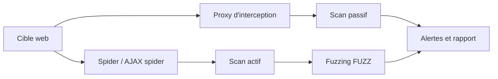

# 🔍 OWASP ZAP — Proxy d'interception et scanner web (Java)

> [!info] **En 1 phrase**
> OWASP ZAP (Zed Attack Proxy) est le scanner de sécurité web open source de référence : proxy d'interception, spider, scan passif/actif et fuzzing dans un seul outil, utilisable en GUI ou en headless/CI.

---

## 🧾 Overview

| Champ | Valeur |
|---|---|
| Nom complet | OWASP ZAP (Zed Attack Proxy, « ZAP by Checkmarx ») |
| Description | Proxy d'interception et scanner DAST complet : spider (classique + AJAX), scan passif/actif, fuzzing, support WebSockets, API REST et scripts pour la CI |
| Catégorie | 🔍 Scan Web & Fuzzing |
| Sous-catégorie | Proxy d'interception / scanner de vulnérabilités web (DAST) |
| Fonction principale | Intercepter le trafic web et détecter automatiquement les vulnérabilités des applications |
| Type d'outil | GUI (desktop) + CLI headless + API REST + Docker |
| Licence | Apache-2.0 |
| Open source / propriétaire | Open source |
| Langage(s) de programmation | Java (add-ons en Java/Python/JavaScript/Groovy) |
| Développeur / organisation | ZAP par Checkmarx, fondation OWASP, communauté (lead Simon Bennetts) |
| Projet officiel | https://www.zaproxy.org |
| Dépôt officiel | https://github.com/zaproxy/zaproxy |
| Documentation | https://www.zaproxy.org/docs/ |
| Version actuelle | 2.17.0 (stable) — versions hebdomadaires `wYYYY-MM-DD` |
| Prérequis | Java 17+ (installateur Windows/Linux), Java embarqué (macOS, Docker) |
| Pré-installé sur | Kali Linux, Parrot OS |

---

## 🎯 Concept

OWASP ZAP est un proxy d'interception et un scanner de vulnérabilités web développé par la fondation OWASP. Il s'intercale entre le navigateur et l'application cible : chaque requête passe par lui et peut être vue, modifiée, rejouée ou fuzzée. Il embarque un **spider** (classique et AJAX pour le contenu rendu par JavaScript), un **scan passif** (analyse les réponses sans les modifier, très silencieux) et un **scan actif** (injecte des payloads, plus bruyant), ainsi qu'un moteur de fuzzing et un support des WebSockets.

Son atout majeur est l'automatisation : il expose une **API REST** et des scripts CLI (`zap-baseline.py`, `zap-full-scan.py`, `zap-api-scan.py`) qui permettent de l'intégrer dans des pipelines CI/CD et des images Docker officielles. Il se place en **phase de test web complet** : proxy pendant l'exploration manuelle, scanner automatisé sur le périmètre défini, puis fuzzing ciblé sur les paramètres sensibles.



---

## 🧠 Concepts fondamentaux

- **Proxy d'interception** : ZAP se positionne entre le client et le serveur, décrypte le TLS via son **certificat CA** et permet de visualiser/modifier/rejouer les requêtes.
- **Contexte et portée (scope)** : délimitent le périmètre autorisé — tout ce qui est hors portée n'est pas scanné (évite les débordements légaux).
- **Spider classique et AJAX spider** : découverte des URLs par extraction de liens ; l'AJAX spider utilise un navigateur (Selenium) pour rendre le JavaScript.
- **Scan passif** : analyse les réponses sans envoyer de payloads — silencieux, adapté à la production.
- **Scan actif** : injecte des payloads (SQLi, XSS, command injection, path traversal...) — bruyant et potentiellement destructeur.
- **Alertes** : hiérarchisées (Info → Low → Medium → High → Critical) ; la 2.17 a ajouté la **dé-duplication** des alertes similaires.
- **Fuzzer** : insérer le mot-clé `FUZZ` dans n'importe quelle partie d'une requête et y injecter une wordlist.
- **Sessions et authentification** : gestion de l'état de session (formulaire, JSON, navigateur) pour scanner les zones authentifiées.
- **Add-ons** : marketplace de modules (reporting, GraphQL, OpenAPI, ptk, foxhound...) installables depuis l'UI.
- **Automation Framework** : plans YAML déclaratifs pour des scans reproductibles.

---

## 🛠️ Installation

```bash
# Kali / Debian
sudo apt install zaproxy

# Windows (Winget ou installeur officiel)
winget install --id=ZAP.ZAP -e

# macOS (Homebrew)
brew install --cask zap

# Linux Snap
sudo snap install zaproxy --classic

# Linux Flatpak
flatpak install flathub org.zaproxy.ZAP

# Docker (headless, recommandé pour la CI)
docker pull ghcr.io/zaproxy/zaproxy:stable
docker run -u zap -p 8080:8080 -i ghcr.io/zaproxy/zaproxy zap.sh \
  -daemon -host 0.0.0.0 -port 8080

# Java requis (installateurs Windows/Linux) : ZAP tourne sur Java 17+
java -version
```

> [!note] À vérifier
> Le prérequis Java 17+ concerne les installateurs et l'archive cross-platform ; l'installeur macOS embarque une JVM, et l'image Docker n'en a pas besoin.

---

## ⚙️ Configuration

### Configuration de base

| Paramètre | Rôle |
|---|---|
| Options → Network | Proxy local (host, port 8080), authentification upstream |
| Options → Network → Server Certificates | Générer/enregistrer le **CA racine** ZAP pour décrypter le HTTPS |
| Options → API | Clé API (obligatoire pour l'accès REST), addresses autorisées |
| Sessions → Contextes | Contexte, portée, authentification, règles de session |
| Options → Add-ons | Marketplace des add-ons (reporting, graphql, openapi...) |
| Automation Framework | Plans YAML pour scénarios de scan reproductibles |

### Lancement headless

```bash
# Démarrer ZAP en daemon avec clé API
zap.sh -daemon -host 127.0.0.1 -port 8090 -config api.key=monsupersecret
# (zap.bat sur Windows)

# Surcharger des options par -config
zap.sh -daemon -config api.addrs.addr.name=localhost \
  -config api.addrs.addr.regex=true
```

### Installer le certificat CA dans le navigateur

1. Lancer ZAP → Options → Network → Server Certificates → *Save*.
2. Importer le certificat `.cer` dans les autorités racines de confiance du navigateur.
3. Configurer le proxy du navigateur sur `127.0.0.1:8080`.

> [!warning] ⚠️ Clé API par défaut
> En daemon, l'API est protégée par une clé par défaut : la définir explicitement avec `-config api.key=...` dès le premier lancement.

---

## 🏗️ Architecture interne

```text
ZAP (Java, GUI Swing + moteur)
├── ParProxy / contrôleurs      # gestion du proxy, sessions, contextes
├── Extension loader            # add-ons (reporting, graphql, openapi...)
├── Scanner passif (core)       # analyse des réponses en arrière-plan
├── Scanner actif (core)        # injection de payloads par catégories
├── Spider + AJAX spider        # découverte des URLs (Selenium/navigateur)
├── Fuzzer                      # wordlists injectées au mot-clé FUZZ
├── Scripting (JSR 223)         # Java, Python, JavaScript, Groovy
├── API REST + automation       # endpoints pour CI/CD, plans YAML
└── Persistence (H2/session)    # sauvegarde des sessions et historiques
```

- **Noyau Java** : tout le scanner et le proxy tournent dans une JVM ; les add-ons s'ajoutent à chaud via le marketplace.
- **Scripting** : les scripts (Java, Python, JavaScript, Groovy) peuvent étendre les règles actives/passives et les templates de fuzzing.
- **API REST** : JSON, accessible par défaut sur `http://127.0.0.1:8080/` avec la clé API ; utilisée par les scripts Python fournis.
- **Moteur 2.17** : dé-duplication des alertes et optimisations de performance en mode headless/CI (moins de persistance inutile, meilleure gestion mémoire/disque).

---

## ⌨️ Commandes

### Commandes de base

```bash
# GUI
zaproxy

# Headless (daemon) avec gestion de session
zap.sh -daemon -port 8080 -session mysession

# Scripts d'audit intégrés (fournis avec ZAP)
zap-baseline.py -t https://cible.local
zap-full-scan.py -t https://cible.local
zap-api-scan.py -t https://cible.local/api -f openapi
```

### Commandes avancées

```bash
# Daemon avec clé API et host exposé (Docker)
zap.sh -daemon -host 0.0.0.0 -port 8080 -config api.key=monsupersecret

# Baseline scan en CI avec gate de sortie et rapport HTML
zap-baseline.py -t https://staging.cible.local -l FAIL -r rapport-ci.html

# Full scan actif avec spider AJAX
zap-full-scan.py -t https://cible.local -j -l MEDIUM -r rapport.html

# Scan d'API depuis une spécification OpenAPI
zap-api-scan.py -t https://api.cible.local/v3 -f openapi -l MEDIUM -r api.html

# Docker : baseline scan
docker run -t ghcr.io/zaproxy/zaproxy zap-baseline.py \
  -t https://cible.local -r rapport.html
```

---

## 🎚️ Options et flags

### Options CLI principales

| Option | Description | Niveau |
|---|---|---|
| `-daemon` | Lance ZAP sans interface (headless) | Basic |
| `-host <ip>` | Interface d'écoute (par défaut 127.0.0.1) | Basic |
| `-port <p>` | Port d'écoute du proxy (défaut 8080) | Basic |
| `-config <clé=valeur>` | Surcharger une option de configuration | Basic |
| `-session <nom>` | Enregistrer/recharger une session | Intermediate |
| `-l <niveau>` | Seuil minimal d'alerte pour le code de sortie (FAIL, PASS, OFF) | Intermediate |
| `-r <fichier>` | Générer un rapport (HTML par défaut) | Intermediate |
| `-t <url>` | Cible du scan (scripts zap-*.py) | Basic |
| `-f <format>` | Format de la spec API : openapi, soap, graphql (zap-api-scan) | Advanced |
| `-j` | Activer le spider AJAX | Advanced |
| `-T <sec>` | Timeout max (scripts zap-*.py) | Advanced |
| `-c <fichier>` | Fichier de configuration des règles (zap-*.py) | Expert |
| `-z <options>` | Options supplémentaires du daemon (zap-*.py) | Expert |

### Règles actives courantes (AJAX/active scan)

| Règle | Cible |
|---|---|
| SQL Injection | Paramètres injectables dans des requêtes SQL |
| Cross Site Scripting (XSS) | Réflexion de payloads dans les réponses |
| Command Injection | Injection de commandes OS |
| Path Traversal | Lecture de fichiers hors racine web |
| SSRF | Requêtes côté serveur vers des ressources arbitraires |
| XXE | External entities dans du XML |
| Directory Browsing | Listings de répertoires exposés |
| Header Injection | Injection dans les en-têtes HTTP |

### Codes de sortie des scripts (gate CI)

| Niveau `-l` | Comportement |
|---|---|
| `PASS` | Échec si une alerte >= Info |
| `FAIL` | Échec si une alerte >= seuil (par défaut Low) |
| `OFF` | Code de sortie toujours 0 |
| `WARN` / `LOW` / `MEDIUM` / `HIGH` / `CRITICAL` | Échec au-delà du seuil |

---

## 🧪 Exemples pratiques

### Beginner

```bash
# Objectif : lancer l'interface graphique
zaproxy

# Objectif : première exploration manuelle avec proxy
# Navigateur -> 127.0.0.1:8080, parcourir l'application, lire les alertes passives

# Objectif : scan passif rapide d'une cible
zap-baseline.py -t http://10.10.10.10
```

### Intermediate

```bash
# Objectif : scan passif avec gate CI et rapport
zap-baseline.py -t https://staging.cible.local -l FAIL -r rapport-ci.html

# Objectif : scan actif complet
zap-full-scan.py -t http://10.10.10.10 -j -l MEDIUM -r rapport.html

# Objectif : scan ciblé sur une seule page avec règles configurées
zap-full-scan.py -t http://10.10.10.10/api/login -c regles.txt
```

### Advanced

```bash
# Objectif : scan d'une API REST depuis une spec OpenAPI
zap-api-scan.py -t https://api.cible.local/v3 -f openapi -l MEDIUM -r api-rapport.html

# Objectif : daemon contrôlé par API (curl)
zap.sh -daemon -config api.key=monsupersecret
curl "http://127.0.0.1:8080/JSON/core/view/version?apikey=monsupersecret"

# Objectif : scan via Docker avec persistence du rapport
docker run -v $(pwd):/zap/wrk:rw -t ghcr.io/zaproxy/zaproxy \
  zap-full-scan.py -t http://10.10.10.10 -r rapport.html
```

### Expert

```bash
# Objectif : utiliser l'Automation Framework (plan YAML)
zap.sh -cmd -autorun plan.yaml

# Objectif : configurer un proxy upstream pour sortir par Burp
zap.sh -daemon -config connection.proxyHost=127.0.0.1 \
  -config connection.proxyPort=8081

# Objectif : lancer un script de règle personnalisé
zap.sh -daemon -config script.name=ma_regle.py -config script.type=active
```

---

## 🧪 Workflow complet (scénario pas à pas)

1. **Lancer ZAP et configurer le proxy** — démarrer ZAP (GUI ou daemon), pointer le navigateur sur `127.0.0.1:8080` :
   ```bash
   zap.sh -daemon -config api.key=monsupersecret
   ```
2. **Définir le contexte** — créer un contexte, y ajouter l'URL de l'application et définir la portée (scope) pour ne scanner que le périmètre autorisé.
3. **Spider** — parcourir l'application manuellement (le trafic est capté) et lancer le spider pour découvrir les liens non visités. Sur une SPA, activer le spider AJAX (`-j`).
4. **Scan passif** — lancer le scan passif sur le contexte : il analyse toutes les réponses déjà vues et remonte les alertes de faible niveau (en-têtes manquants, cookies sans flags...).
5. **Scan actif** — cibler les paramètres du contexte puis lancer le scan actif : ZAP injecte des payloads (SQLi, XSS, injection de commandes...) et détecte les vulnérabilités exploitées.
6. **Fuzzing ciblé** — dans l'onglet *Fuzzer*, sélectionner un paramètre et insérer le mot-clé `FUZZ` avec une wordlist pour découvrir des valeurs non prévues.
7. **Analyse et rapport** — trier les alertes par fiabilité, éliminer les faux positifs, puis exporter le rapport : `-r rapport.html`.

---

## 🎬 Scénarios avancés

### Scénario 1 : Audit authentifié (formulaire + session)

1. Ouvrir **Sessions → Contextes**, définir le contexte de l'application.
2. Configurer l'**authentification** (formulaire) avec les paramètres de login et la vérification de la page de connexion.
3. Configurer la **règle de session** (cookies) et tester la connexion via *Forced User Mode*.
4. Lancer le spider + scan actif : ZAP se reconnecte automatiquement quand la session expire.

### Scénario 2 : CI/CD avec Docker

```bash
docker run -t ghcr.io/zaproxy/zaproxy zap-baseline.py \
  -t https://staging.cible.local -l FAIL \
  -r rapport-ci.html
```
Le code de sortie est non nul si une alerte dépasse le seuil `-l` : le pipeline échoue, idéal pour une gate de sécurité sur staging.

### Scénario 3 : Scan d'API REST depuis une spécification OpenAPI

```bash
zap-api-scan.py -t https://api.cible.local/v3 -f openapi -l MEDIUM -r api-rapport.html
# -f openapi : ZAP génère les requêtes depuis le swagger ; -l MEDIUM : gate sur les alertes >= medium
```

### Scénario 4 : Authentification par navigateur (2.17)

Depuis 2.17, l'authentification par navigateur remplit automatiquement les formulaires de login (même non liés à une URL fixe) et gère les flux multi-écrans. Les diagnostics incluent les éléments web et le stockage local/session — utile pour déboguer les flux complexes avant le scan.

### Scénario 5 : Détection de références circulaires dans les schémas GraphQL

ZAP détecte les références circulaires de types dans les schémas GraphQL, ce qui évite des requêtes malformées lors du scan d'une API GraphQL (add-on GraphQL).

### Scénario 6 : Extension du scan avec des add-ons (OWASP PTK, Foxhound)

```text
Add-ons notables :
- OWASP PTK   : exécute DAST + IAST + SAST + SCA dans la même session navigateur
- Foxhound    : intégration initiale avec le projet SAP Foxhound
- OpenAPI     : import de specs et génération de requêtes
- GraphQL     : scan des endpoints GraphQL
- Reporting   : rapports HTML/JSON/Markdown
```

---

## 🛡️ Cybersecurity use cases

| Phase | Utilisation |
|---|---|
| Reconnaissance | Exploration de l'application via le proxy, cartographie des endpoints |
| Énumération | Spider/AJAX spider pour découvrir les URLs et API non liées |
| Vulnérabilité | Scan passif/actif : SQLi, XSS, command injection, path traversal, SSRF, XXE |
| Exploitation | Rejeu de requêtes, fuzzing de paramètres (FUZZ), manipulation de sessions |
| Post-exploitation | Analyse des WebSockets, extraction de tokens et cookies des flux |
| Rapport | Génération de rapports HTML/JSON/Markdown et intégration SIEM/CI |

---

## 🎯 MITRE ATT&CK

| Tactique | Technique / Sub-technique | ID | Raison | Détection | Mitigation |
|---|---|---|---|---|---|
| Reconnaissance | Active Scanning: Vulnerability Scanning | T1595.002 | ZAP scanne les applications pour identifier les vulnérabilités | Volumes HTTP, User-Agent ZAP, patterns de payloads | WAF, rate limiting, supervision |
| Discovery | Application Window Discovery | T1010 | spider et scan actif découvrent les interfaces applicatives | Navigation complète et rapide du site | Durcissement, anti-bot |
| Initial Access | Exploit Public-Facing Application | T1190 | le scan actif identifie les vulnérabilités exploitables | Alertes WAF XSS/SQLi | Correctifs, WAF CRS |
| Credential Access | Brute Force | T1110 | fuzzing et tests d'authentification (forcé) | Tentatives de connexion multiples | MFA, rate limiting |

> [!note] Ne renseigner que si l'association est réellement pertinente.
> L'association la plus spécifique est **T1595.002 (Vulnerability Scanning)** — la finalité de l'outil. Les autres lignes ne s'appliquent que selon l'usage effectif (fuzzing, test d'authentification).

---

## 🛡️ Defensive Security

### Signes observables

| Indicateur | Détail |
|---|---|
| User-Agent « ZAP » dans les logs | Signature classique d'un proxy ZAP |
| Rafales de requêtes avec payloads de scan | Marqueur du scan actif (SQLi/XSS) |
| Requêtes à volume élevé et navigation rapide | Signature du spider (classique ou AJAX) |
| Tentatives de connexion multiples | Test d'authentification/bruteforce via fuzzing |
| Requêtes vers de nombreux chemins d'API | Scan depuis une spec OpenAPI |

### Règles de détection (Sigma / Suricata / Snort / YARA)

```yaml
# Sigma : scan ZAP détecté par User-Agent
title: OWASP ZAP Scan
id: 3f1a4b2c-0003-4a5b-9c2d-000000000003
status: experimental
description: Détection d'un scan OWASP ZAP par le User-Agent
logsource:
    category: webserver
    product: apache
detection:
    selection:
        c-useragent|contains:
            - 'ZAP'
            - 'OWASP'
    condition: selection
falsepositives:
    - Outils d'audit légitimes
level: medium
```

```bash
# Suricata/Snort (pédagogique) : payloads de scan actif
alert http any any -> any any (msg:"OWASP ZAP active scan - XSS probe"; \
  flow:to_server,established; \
  http.uri; content:"<script>"; \
  http.uri; content:"alert("; \
  sid:66000019; rev:1;)
```

```yaml
# YARA : instance ZAP sur un poste (jar, scripts)
rule OWASP_ZAP_Install {
    meta:
        description = "Présence de fichiers OWASP ZAP"
        author = "Équipe SOC"
    strings:
        $a = "zaproxy" ascii wide
        $b = "zap-baseline.py" ascii wide
        $c = "Zed Attack Proxy" ascii wide
    condition:
        any of them
}
```

---

## 🤖 Automatisation

```bash
# Gate CI/CD avec Docker (baseline scan)
docker run -t ghcr.io/zaproxy/zaproxy zap-baseline.py \
  -t https://staging.cible.local -l FAIL -r rapport-ci.html

# Scan d'API en pipeline (OpenAPI)
docker run -t ghcr.io/zaproxy/zaproxy zap-api-scan.py \
  -t https://api.cible.local/v3 -f openapi -l MEDIUM -r api.html
```

```python
# Python : piloter ZAP via l'API REST
import time
from zapv2 import ZAPv2

zap = ZAPv2(apikey="monsupersecret", proxies={"http": "http://127.0.0.1:8090"})
target = "http://10.10.10.10"

print(zap.core.new_session())
zap.urlopen(target)
time.sleep(2)
print("Spider...")
scan_id = zap.spider.scan(target)
while int(zap.spider.status(scan_id)) < 100:
    time.sleep(1)
print("Active scan...")
scan_id = zap.ascan.scan(target)
while int(zap.ascan.status(scan_id)) < 100:
    time.sleep(1)

for alert in zap.core.alerts():
    print(alert["alert"], alert["risk"], alert["url"])
```

```yaml
# Automation Framework : plan YAML reproductible
env:
  contexts:
    - name: "cible"
      urls:
        - "http://10.10.10.10"
jobs:
  - type: spider
    parameters:
      url: "http://10.10.10.10"
  - type: passiveScan
  - type: activeScan
    parameters:
      context: "cible"
  - type: report
    parameters:
      template: "traditional-html"
      reportFile: "rapport.html"
```

---

## 📤 Output et parsing

ZAP génère des **rapports** dans plusieurs formats (HTML, JSON, XML, Markdown, PDF) via l'add-on Reporting, et expose toutes les données via son **API REST** (JSON).

```bash
# Générer un rapport en CLI (scripts zap-*.py)
zap-full-scan.py -t http://10.10.10.10 -r rapport.html

# Lire les alertes via l'API (curl + jq)
curl -s "http://127.0.0.1:8080/JSON/core/view/alerts/?apikey=monsupersecret" | \
  jq -r '.alerts[] | "\(.risk) \(.alert) \(.url)"'

# Résumé des risques
curl -s "http://127.0.0.1:8080/JSON/core/view/alerts/?apikey=monsupersecret" | \
  jq -r '.alerts[] | .risk' | sort | uniq -c
```

> [!note] À vérifier
> Les formats et champs du rapport dépendent des versions (2.17 a modifié la dé-duplication des alertes) : vérifier la structure avec la version installée.

---

## 🔗 Intégrations

```text
ZAP <- navigateur (proxy) <- application cible
ZAP -> API REST -> scripts (zapv2, curl) -> pipelines CI
ZAP -> Docker (ghcr.io/zaproxy/zaproxy) -> scan headless
ZAP -> add-ons (OpenAPI, GraphQL, OWASP PTK, Foxhound) -> extensions
ZAP -> rapports HTML/JSON -> SIEM / gestion de vulnérabilités
```

- [[Tools|🧰 Outils]] global
- [[Outil - Burp Suite]] — alternative GUI équivalente (extensions, Intruder)
- [[Outil - nuclei]] — complément pour la validation de CVEs à grande échelle
- [[Outil - nikto]] — balayage serveur avant le scan applicatif
- [[Outil - mitmproxy]] — proxy scriptable pour l'automatisation fine
- [[Techniques/Injection SQL|Injection SQL]] · [[Techniques/XSS (Cross-Site Scripting)|XSS]] · [[Techniques/SSRF|SSRF]] · [[Techniques/XXE|XXE]] · [[03 - Exploitation Web|Exploitation Web]]

---

## 🔄 Alternatives

| Outil | Avantages | Inconvénients | Cas d'usage |
|---|---|---|---|
| Burp Suite | Scanner puissant, extensions, Intruder | Community limitée, Pro payante | Pentest web manuel + auto |
| Nuclei | Templates communautaires, très rapide | Pas de crawling/DAST complet | Validation de CVEs en masse |
| Caido | GUI moderne, scriptable (HTTPQL) | Communauté plus récente | Alternative légère à Burp/ZAP |
| Acunetix | Scanner commercial très complet | Payant | Audit web professionnel |
| Nikto | Léger, installé par défaut | Signatures anciennes | Première passe serveur |

> **Quand utiliser ZAP plutôt que les autres ?** C'est le **couplage GUI + scanner + CI** open source : il remplace avantageusement Burp Community et s'intègre facilement en automatisation. Il ne remplace pas l'analyse fine d'un proxy payant pour les tests manuels très poussés.

---

## ⚡ Performance

- **Dé-duplication des alertes (2.17)** : les alertes similaires sont consolidées — moins de bruit, rapport plus lisible.
- **Optimisations headless/CI** : la 2.17 réduit la persistance inutile et améliore la gestion mémoire/disque.
- **Scan passif** : fonctionne en arrière-plan, presque gratuit en performance, idéal en production.
- **Scan actif** : plus lourd — cibler les paramètres et réduire la portée pour rester efficace.
- **Docker** : la version headless en conteneur est la voie recommandée pour l'automatisation (zéro overhead GUI).
- **Concurrence** : régler la vitesse du scanner actif (Options → Active Scan → Speed) pour éviter de saturer la cible.

> [!note] À vérifier
> Les performances varient selon la taille de l'application et la charge : valider sur un échantillon avant un scan complet.

---

## 🛠️ Troubleshooting

### Common problems

#### Problème : le HTTPS n'est pas décrypté (erreurs de certificat)

- **Cause** : CA racine ZAP non installé dans le navigateur.
- **Solution** : Options → Network → Server Certificates → Save, puis importer dans le magasin de confiance.
- **Vérification** : naviguer sur un site HTTPS après installation ; vérifier la chaîne du certificat.

#### Problème : l'API répond « Forbidden » ou refuse la connexion

- **Cause** : clé API incorrecte ou addresses autorisées non configurées.
- **Solution** : définir `api.key=...` au lancement et configurer `api.addrs.addr.name`.
- **Vérification** : `curl http://127.0.0.1:8080/JSON/core/view/version?apikey=...`.

#### Problème : le scan actif est trop lent ou fait tomber la cible

- **Cause** : concurrence élevée, scan sur une large portée, cible fragile.
- **Solution** : réduire la vitesse du scanner, restreindre la portée aux paramètres critiques.
- **Vérification** : lancer d'abord le scan passif, puis le scan actif sur une URL seulement.

#### Problème : beaucoup d'alertes de session (302/401) → faux positifs

- **Cause** : authentification non configurée — ZAP scanne des pages non autorisées.
- **Solution** : configurer l'authentification et la règle de session du contexte.
- **Vérification** : tester avec *Forced User Mode* que les pages authentifiées répondent 200.

#### Problème : le spider ne voit pas le contenu JavaScript (SPA)

- **Cause** : le spider classique n'exécute pas JS.
- **Solution** : utiliser l'**AJAX spider** (navigateur Selenium) ou un navigateur via le proxy.
- **Vérification** : lancer l'AJAX spider et comparer le nombre d'URLs découvertes.

---

## 🔐 Sécurité de l'outil

- **Clé API** : l'API REST est protégée par une clé — ne pas la laisser par défaut, surtout si le daemon est exposé (`-host 0.0.0.0`).
- **CA racine** : le certificat privé de ZAP permet de décrypter le trafic qui lui fait confiance — le protéger et ne l'installer que sur les postes autorisés.
- **Scan actif destructeur** : l'injection de payloads peut modifier des données ou faire tomber l'application — uniquement en environnement autorisé.
- **Hors périmètre** : sans portée (scope) correcte, ZAP peut scanner des hôtes hors contrat — toujours définir le contexte.
- **Données sensibles** : sessions et rapports contiennent tokens/cookies — les stocker et les purger proprement.
- **Mises à jour** : les versions hebdomadaires et stables corrigent régulièrement des bugs de sécurité — maintenir à jour (suivre les advisories GitHub).

---

## ⚠️ Limitations

- **Pas de logique métier** : ZAP ne comprend pas la business logic — le test manuel reste indispensable.
- **Faux positifs** : un scan actif sans bonne authentification génère beaucoup d'alertes non exploitables.
- **SPA complexes** : nécessite l'AJAX spider ou un navigateur pour les rendus JavaScript.
- **Ressources** : le scanner actif complet est gourmand et peut être lent sur de grosses applications.
- **DAST uniquement** : ne fait pas de SAST/SCA (les add-ons PTK le comblent partiellement).
- **Java requis** : installation native Windows/Linux nécessite Java 17+.

---

## 📋 Cheatsheet

```bash
# GUI
zaproxy

# Headless avec clé API
zap.sh -daemon -port 8080 -config api.key=monsupersecret

# Scan passif (CI-friendly)
zap-baseline.py -t https://cible.local -l FAIL -r rapport-ci.html

# Scan actif complet avec spider AJAX
zap-full-scan.py -t https://cible.local -j -l MEDIUM -r rapport.html

# Scan d'API OpenAPI
zap-api-scan.py -t https://api.cible.local/v3 -f openapi -l MEDIUM -r api.html

# Docker baseline
docker run -t ghcr.io/zaproxy/zaproxy zap-baseline.py \
  -t https://cible.local -r rapport.html

# Lire les alertes via API
curl "http://127.0.0.1:8080/JSON/core/view/alerts/?apikey=monsupersecret"

# Automation Framework
zap.sh -cmd -autorun plan.yaml
```

---

## ⚡ Quick reference

| | |
|---|---|
| **À quoi sert-il ?** | Proxy d'interception + scanner DAST complet pour applications web |
| **Quand l'utiliser ?** | Test web complet : exploration manuelle, scan passif/actif, fuzzing, CI |
| **Commande principale** | `zaproxy` (GUI) / `zap-baseline.py -t <url>` (CI) |
| **Alternative principale** | Burp Suite (GUI riche), Caido (moderne), Nuclei (massif) |
| **Concepts importants** | Contexte/portée, spider, scan passif/actif, alertes, fuzzing FUZZ, API REST |
| **Liens associés** | [[Outil - Burp Suite]] · [[Outil - Caido]] · [[Outil - nuclei]] · [[Techniques/Injection SQL]] · [[Techniques/XSS (Cross-Site Scripting)]] |

---

## 🔍 Détection & Défense

| Signe | Défense |
|---|---|
| User-Agent ZAP dans les logs | Règles SIEM/IDS sur le User-Agent |
| Rafales de requêtes identiques (patterns de fuzzing/scan) | WAF (ModSecurity + CRS), rate limiting, CAPTCHA |
| Payloads XSS/SQLi dans les URLs | Règles WAF XSS/SQLi, log + alerte sur les sources d'attaque |
| Volume HTTP anormal sur un seul chemin | Honeypots, monitoring des logs applicatifs |
| Navigation très rapide et complète du site | Mesures anti-bot, détection d'automatisation |
| Requêtes AJAX spider vers toutes les routes | Durcir l'API : authentification, validation stricte des entrées |

---

## ⚠️ Tips & Pièges

> [!tip] 💡 **Tips**
> - Définis toujours un **contexte + portée** pour éviter de scanner des hôtes hors périmètre (risque légal et faux positifs).
> - Utilise le **spider AJAX** ou un navigateur automatisé pour les applications SPA : le spider classique ne voit pas le contenu rendu en JS.
> - En CLI, utilise `-config api.key=...` et `-l FAIL` pour des gates CI fiables et reproductibles.
> - Sauvegarde régulièrement la session (`-session`) : un scan long peut reprendre après un crash.
> - Configure l'authentification avant le scan actif pour éviter les faux positifs massifs de session.
> - Utilise l'Automation Framework (plans YAML) pour des scans reproductibles entre engagements.

> [!warning] ⚠️ **Pièges**
> - Le **scan actif est très bruyant** et peut faire tomber l'application ou déclencher une réponse 429 : commence toujours par le scan passif.
> - Par défaut ZAP utilise l'API avec une clé par défaut, dangereux si le daemon est exposé sur le réseau : la changer au premier lancement.
> - ZAP ne détecte pas tout seul les vulnérabilités de logique métier : le fuzzing et les tests manuels restent indispensables.
> - Un scan actif sans authentification correcte génère beaucoup de faux positifs (toutes les réponses 302/401).
> - Les add-ons et les versions hebdomadaires changent vite : figer une version stable en CI pour la reproductibilité.

---

## 📚 References

### Official

- Site officiel : https://www.zaproxy.org
- Dépôt GitHub : https://github.com/zaproxy/zaproxy
- Documentation : https://www.zaproxy.org/docs/
- Documentation Docker : https://www.zaproxy.org/docs/docker/
- Marketplace d'add-ons : https://www.zaproxy.org/addons/

### Security references

- MITRE ATT&CK T1595 — Active Scanning : https://attack.mitre.org/techniques/T1595/
- MITRE ATT&CK T1010 — Application Window Discovery : https://attack.mitre.org/techniques/T1010/
- Advisories GitHub ZAP : https://github.com/zaproxy/zaproxy/security/advisories

### Community

- Blog ZAP : https://www.zaproxy.org/blog/
- Releases : https://github.com/zaproxy/zaproxy/releases
- Discord ZAP : https://www.zaproxy.org/discord/

---

➡️ **Liens :** [[Tools|🧰 Outils]] · [[Outil - Burp Suite|Burp Suite]] · [[Outil - Caido|Caido]] · [[Outil - nuclei|Nuclei]] · [[Techniques/Injection SQL|Injection SQL]] · [[Techniques/XSS (Cross-Site Scripting)|XSS]] · [[Techniques/SSRF|SSRF]]
