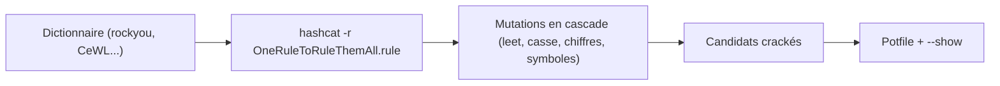

# 🏛️ OneRuleToRuleThemAll — La règle hashcat ultime

> [!info] **En 1 phrase**
> OneRuleToRuleThemAll est un fichier de règles hashcat (`.rule`) qui regroupe des milliers de mutations optimisées pour cracker un maximum de mots de passe avec un minimum d'essais.

---

## 🧾 Overview

| Champ | Valeur |
|---|---|
| Nom complet | OneRuleToRuleThemAll |
| Description | Super-ensemble de règles hashcat (51 998 règles) obtenu en sélectionnant les 25 % de règles les plus performantes de chaque jeu de règles connu, dédupliquées et concaténées |
| Catégorie | 🔑 Wordlists & Générateurs |
| Sous-catégorie | Règles de mutation (rule-based attack) |
| Fonction principale | Transformer un dictionnaire en millions de candidats réalistes via `hashcat -r` ou `john --rules` |
| Type d'outil | Fichier de règles (ressource), consommé par hashcat / John the Ripper |
| Licence | MIT (les règles empruntées restent sous leur licence d'origine) |
| Open source / propriétaire | Open source |
| Langage(s) de programmation | Syntaxe de règles hashcat (texte pur) |
| Développeur / organisation | Stealthsploit (@stealthsploit), hébergé par NotSoSecure ; crédits à Anant Shrivastava |
| Projet officiel | https://github.com/NotSoSecure/password_cracking_rules |
| Dépôt officiel | https://github.com/NotSoSecure/password_cracking_rules |
| Documentation officielle | README du dépôt + blog « One Rule to Rule Them All » |
| Date de création | 2017 (billet de blog publié le 01/06/2017) |
| État du projet | maintenu (repo officiel NotSoSecure) ; successeur « OneRuleToRuleThemStill » (2023) |
| Dernière version connue | 51 998 règles (build original) ; dérivés optimisés chez stealthsploit |
| Systèmes compatibles | Toute plateforme supportant hashcat / John the Ripper (Linux, Windows, macOS, GPU) |

> [!note] Pour vérifier / compléter
> Le dépôt ne publie pas de releases ni de numéro de version : la référence est le compteur de règles (51 998) documenté dans le billet officiel.

---

## 🎯 Concept

Le cracking par dictionnaire échoue dès que le mot de passe n'est pas présent tel quel dans la wordlist. L'attaque par règles (« rule-based attack ») comble ce manque : chaque mot du dictionnaire passe dans un moteur de réécriture qui applique des mutations élémentaires — capitalisation, ajout de préfixes/suffixes, remplacement de caractères (leet), répétitions, inversion... — et génère des dizaines de variantes par mot source. Un bon jeu de règles est le levier le plus rentable du cracking hors-ligne : il coûte une seule passe sur le GPU et multiplie considérablement les candidats.

Le problème est le choix des règles : un jeu trop riche (100 000+ règles) produit des centaines de milliards de candidats et sature le GPU pour un gain marginal ; un jeu trop pauvre rate les mots de passe humains typiques. NotSoSecure a donc mesuré : les 14 jeux de règles courants (best64, dive, rockyou-30000, d3ad0ne, generated2, d3adhob0, hob064, KoreLogicRulesPrependRockYou50000, _NSAKEY.v2.dive, T0XICv1, toggles5, InsidePro-HashManager, InsidePro-PasswordsPro, unix-ninja-leetspeak) ont été exécutés sur 4,3 millions de hashes MD5 uniques issus de la fuite Lifeboat (communauté Minecraft, janvier 2016, 7+ millions de comptes). En exploitant le mode debug de hashcat (chaque règle qui cracke un hash est journalisée), les 25 % de règles les plus prolifiques de chaque jeu ont été extraits, dédupliqués puis concaténés : le résultat est un fichier de **51 998 règles** qui a cracké **68,36 %** de l'échantillon — 117 626 hashes de plus que le `dive` officiel (65,64 %), avec une meilleure efficacité (251 902 candidats par crack contre 4 998 867 pour `dive`).



---

## 🧠 Concepts fondamentaux

| Concept | Explication |
|---|---|
| Règle (rule) | Une ligne de commandes de mutation hashcat, ex. `c sa4 $2 $0 $2 $5` (capitaliser, `a→4`, ajouter « 2025 ») |
| Rule-based attack | Mode `-a 0` de hashcat appliqué avec `-r` : chaque mot de la wordlist est transformé par chaque règle du fichier |
| Commande de règle | Primitive élémentaire : `c`/`u`/`l` (casse), `$X`/`^X` (append/prepend), `sXY` (substitution), `r` (inverse), `d` (dupliquer), `{`/`}` (déplacer)... |
| Séquence | Une règle est une séquence de commandes appliquées dans l'ordre ; l'ordre change le résultat (`c sa4` ≠ `sa4 c`) |
| Déduplication | Les règles dupliquées entre jeux sources sont retirées : la même mutation ne compte qu'une fois |
| Debug mode | `--debug-mode=3` journalise chaque règle gagnante — c'est la méthode utilisée pour classer les règles par succès |
| Candidate | Chaque mot d'entrée × chaque règle = un candidat soumis au hash |
| Efficacité | Ratio candidats nécessaires par hash cracké (guesses per crack) ; l'objectif est de maximiser les cracks en minimisant les candidats |

---

## 🛠️ Installation

Il n'y a pas de paquet à compiler : OneRuleToRuleThemAll est un fichier texte à placer dans le dossier de règles de hashcat.

### Debian / Ubuntu / Kali Linux

```bash
# Récupérer le fichier depuis le dépôt officiel NotSoSecure
git clone https://github.com/NotSoSecure/password_cracking_rules.git
cd password_cracking_rules

# Copier dans le dossier de règles de hashcat
sudo cp OneRuleToRuleThemAll.rule /usr/share/hashcat/rules/

# Vérifier la présence et le nombre de lignes (une règle par ligne)
ls -la /usr/share/hashcat/rules/OneRuleToRuleThemAll.rule
wc -l /usr/share/hashcat/rules/OneRuleToRuleThemAll.rule
```

### Arch Linux

```bash
git clone https://github.com/NotSoSecure/password_cracking_rules.git
sudo cp password_cracking_rules/OneRuleToRuleThemAll.rule /usr/share/hashcat/rules/
```

### Fedora / RHEL

```bash
git clone https://github.com/NotSoSecure/password_cracking_rules.git
sudo cp password_cracking_rules/OneRuleToRuleThemAll.rule /usr/share/hashcat/rules/
```

### macOS

```bash
git clone https://github.com/NotSoSecure/password_cracking_rules.git
cp password_cracking_rules/OneRuleToRuleThemAll.rule /opt/homebrew/share/hashcat/rules/
```

### Windows

```powershell
# hashcat Windows : le dossier rules\ est à côté de hashcat.exe
git clone https://github.com/NotSoSecure/password_cracking_rules.git
Copy-Item password_cracking_rules\OneRuleToRuleThemAll.rule rules\
```

### Docker

```bash
# Image hashcat non officielle avec le fichier monté en volume
docker run --rm -v "$PWD/OneRuleToRuleThemAll.rule:/rules/OneRuleToRuleThemAll.rule" \
  -v "$PWD/hashes.txt:/hashes.txt" -v "$PWD/wordlist.txt:/wordlist.txt" \
  dizcza/docker-hashcat:latest -m 1000 -a 0 hashes.txt wordlist.txt -r /rules/OneRuleToRuleThemAll.rule
```

### Compilation depuis les sources

Inutile : le fichier se télécharge tel quel. Pour rester à jour, suivre la branche `master` du dépôt ou utiliser le fork optimisé `stealthsploit/OneRuleToRuleThemStill` (réécrit en 2023).

> [!warning] ⚠️ Prérequis & problèmes potentiels
> hashcat doit être installé (l'emplacement par défaut des règles diffère selon la distribution : `/usr/share/hashcat/rules/` sur Kali/Debian, `rules\` à côté de l'exécutable sous Windows). Certaines distributions livrent une version embarquée du fichier dans le paquet `hashcat-utils` ou `hashcat-data` — vérifier `hashcat --help` pour lister les chemins de règles résolus.

---

## ⚙️ Configuration

Pas de configuration propre : le fichier s'utilise tel quel. On peut toutefois créer des variantes tronquées pour ajuster le volume de candidats.

| Paramètre | Rôle | Valeur possible | Impact | Exemple |
|---|---|---|---|---|
| Emplacement du fichier | Chemin passé à `-r` | Chemin absolu ou relatif | Définit les mutations appliquées | `-r /usr/share/hashcat/rules/OneRuleToRuleThemAll.rule` |
| `-r` / `--rules-file` | Activer la règle | Chemin du `.rule` | Multiplie les candidats (×51 998 au maximum) | `-r OneRuleToRuleThemAll.rule` |
| `--debug-mode=3` | Journaliser les règles gagnantes | 1-4 selon hashcat | Permet d'auditer quelles mutations crackent | `--debug-file=/tmp/debug.log --debug-mode=3` |
| Dictionnaire d'entrée | Matière première du `-a 0` | rockyou, SecLists, CeWL... | La règle ne crée rien : qualité = dictionnaire | `wordlists/rockyou.txt` |
| `--stdout` | Afficher les candidats sans cracker | Sortie standard | Estimation du volume et du réalisme | `hashcat --stdout base.txt -r OneRuleToRuleThemAll.rule` |

---

## 🏗️ Architecture interne

Le fichier est un **fichier texte brut, une règle par ligne**, chaque règle étant une séquence de commandes hashcat sans séparateur. Exemples extraits des jeux sources : `c` (capitaliser la première lettre, minuscules pour le reste), `sa4` (remplacer `a` par `4`), `$2 $0 $2 $5` (ajouter la chaîne « 2025 » en fin de mot), `^A` (préfixer un `A`), `r` (inverser), `T0` (toggle du premier caractère). Le moteur de hashcat applique la séquence commande par commande sur chaque mot de la wordlist : le nombre total de candidats d'une passe vaut donc `nb_mots × nb_règles` (moins les éventuelles rejets, ex. règles interdisant les mots trop courts via les fonctions de rejet `>N`/`<N`).

Le contenu reflète sa construction : on y retrouve la philosophie de chaque source (d3ad0ne favorise les insertions, KoreLogic les préfixes massifs issus de « PrependRockYou50000 », NSAKEY les cascades longues, hob064 un compromis efficace), mais filtré aux 25 % de règles qui crackent réellement, puis dédupliqué. Cette origine hétérogène rend le fichier **transparent et éditable** : on peut le tronquer, le découper, ou l'analyser avec `hashcat --stdout` pour voir les candidats produits. Côté moteur, l'ordre des commandes dans la séquence détermine l'ordre des opérations — c'est la seule « logique interne » à comprendre pour l'utiliser finement.

---

## ⌨️ Commandes

### Commandes principales

```bash
hashcat -m 1000 -a 0 hashes.txt wordlist.txt -r /usr/share/hashcat/rules/OneRuleToRuleThemAll.rule -O -w 3
```

| Commande | Objectif | Résultat attendu |
|---|---|---|
| `hashcat -m 1000 ntlm.txt rockyou.txt -r OneRuleToRuleThemAll.rule` | Cracker des hashes NTLM avec la règle | Hashes crackés, potfile mis à jour |
| `hashcat -m 13100 tgs.txt wordlist.txt -r OneRuleToRuleThemAll.rule -O -w 3` | Kerberoast (TGS-REP RC4) avec règles | Comptes de service crackés |
| `hashcat -m 5600 hash.txt wordlist.txt -r OneRuleToRuleThemAll.rule` | NetNTLMv2 avec règles | Mots de passe révélés |
| `hashcat -m 22000 wpa.hc22000 psk.txt -r OneRuleToRuleThemAll.rule` | PMKID / handshake WPA2 | PSK Wi-Fi trouvé |
| `hashcat --stdout wordlist.txt -r OneRuleToRuleThemAll.rule \| head -20` | Aperçu des candidats sans crack | Liste des mutations produites |
| `hashcat -m 1000 hashes.txt --show` | Relire les résultats depuis le potfile | Paires hash:plain résolues |

### Commandes avancées

```bash
# Auditer les règles gagnantes (méthode NotSoSecure)
hashcat -m 0 hashes_md5.txt rockyou.txt -r OneRuleToRuleThemAll.rule --debug-mode=3 --debug-file=/tmp/rules_stats.txt --potfile-disable
sort /tmp/rules_stats.txt | uniq -c | sort -rn | head -20

# Générer une wordlist de candidats à réutiliser en ligne (prudence)
hashcat --stdout /tmp/mots_site.txt -r OneRuleToRuleThemAll.rule > /tmp/prepared.txt
sort -u /tmp/prepared.txt -o /tmp/prepared_unique.txt
wc -l /tmp/prepared_unique.txt
```

---

## 🎚️ Options et flags

Les options concernent hashcat (le consommateur de la règle) :

| Option | Description | Exemple | Niveau |
|---|---|---|---|
| `-r, --rules-file` | Applique le fichier de règles au dictionnaire | `-r OneRuleToRuleThemAll.rule` | Basic |
| `-a 0` | Mode dictionnaire (obligatoire pour `-r`) | `-a 0 hashes.txt words.txt -r r.rule` | Basic |
| `-m` | Mode de hash (1000 NTLM, 13100 Kerberoast, 5600 NetNTLMv2, 22000 WPA) | `-m 1000` | Basic |
| `--stdout` | Affiche les candidats générés, ne cracke pas | `--stdout words.txt -r r.rule` | Basic |
| `-O` | Kernels GPU optimisés (nécessite de bons drivers) | `-O -w 3` | Intermediate |
| `-w 3` | Workload élevé (sature le GPU) | `-w 3` | Intermediate |
| `--potfile-path` | Potfile dédié à un projet | `--potfile-path /tmp/acme.pot` | Intermediate |
| `--debug-mode=3 --debug-file` | Journalise chaque règle gagnante | `--debug-file=/tmp/d.log --debug-mode=3` | Advanced |
| `--rules-file` alternatif | Chemin explicite vers un `.rule` | `--rules-file=/tmp/onrule.rule` | Advanced |
| `--increment` | Attaque par masque incrémentale (sans rapport direct, utile en 2e passe) | `-a 3 -i ?l?l?l?l?l?l` | Expert |

> [!tip] Options les plus utiles au quotidien
> `-a 0` + `-r OneRuleToRuleThemAll.rule` + `-O -w 3` est la combinaison de base pour NTLM/Kerberoast/WPA. Toujours lancer d'abord la passe **sans règle** (coût minimal), puis la passe avec règle. `--stdout` permet de valider la qualité des mutations avant de brûler des heures de GPU.

---

## 🧪 Exemples pratiques

### Beginner

```bash
# Objectif : cracker un dump NTLM (mode 1000) avec la règle
hashcat -m 1000 ntlm.txt /usr/share/wordlists/rockyou.txt \
  -r /usr/share/hashcat/rules/OneRuleToRuleThemAll.rule -O
# Expliquer : chaque mot de rockyou est muté par les 51 998 règles
hashcat -m 1000 ntlm.txt --show
```

### Intermediate

```bash
# Objectif : Kerberoast en conditions réelles (TGS-REP RC4)
hashcat -m 13100 tgs_rc4.txt /usr/share/wordlists/rockyou.txt \
  -r /usr/share/hashcat/rules/OneRuleToRuleThemAll.rule -O -w 3
# En cas de TGS AES (mode 19600) : plus lent, réduire la wordlist
hashcat -m 19600 tgs_aes.txt /tmp/mots_contextuels.txt \
  -r OneRuleToRuleThemAll.rule
```

### Advanced

```bash
# Objectif : auditer les mutations gagnantes sur le dump (méthode NotSoSecure)
hashcat -m 0 md5.txt rockyou.txt -r OneRuleToRuleThemAll.rule \
  --potfile-disable --debug-mode=3 --debug-file=/tmp/rules_stats.txt -O -w 3
sort /tmp/rules_stats.txt | uniq -c | sort -rn | head -30
# Les lignes gagnantes type "c sa4 se3 $1 $2 $3 $4" révèlent les patterns humains
```

### Expert

```bash
# Objectif : pipeline multi-étapes — dico brut → règle → masque → règle contextuelle
hashcat -m 5600 netntlmv2.txt rockyou.txt -O -w 3
hashcat -m 5600 netntlmv2.txt rockyou.txt -r OneRuleToRuleThemAll.rule -O -w 3
hashcat -m 5600 netntlmv2.txt rockyou.txt -r OneRuleToRuleThemAll.rule -a 6 ?d?d?d -O
hashcat -m 5600 netntlmv2.txt /tmp/mots_cewl.txt -r OneRuleToRuleThemAll.rule -O
# Vérifier l'impact de chaque étape via le potfile : hashcat -m 5600 netntlmv2.txt --show | wc -l
```

---

## 🧪 Workflow complet (scénario pas à pas)

1. **Compiler les hashes** — dump NTDS.dit, tickets Kerberoast, NetNTLMv2 capturés par Responder, handshakes WPA :
   ```bash
   # Convertir WPA2 : hcxpcapngtool handshake.pcapng -o wpa.hc22000
   # NTLM : secretsdump.py -ntds ntds.dit -system SYSTEM -outputfile ntlm.txt cible.local/...
   ```
2. **Identifier le mode `-m`** — `hashid` ou `hashcat --identify hashes.txt`.
3. **Passe 1 : sans règle** (mots exacts du dictionnaire, coût minimal) :
   ```bash
   hashcat -m 5600 hash.txt /usr/share/wordlists/rockyou.txt -O
   ```
4. **Passe 2 : avec la règle** :
   ```bash
   hashcat -m 5600 hash.txt /usr/share/wordlists/rockyou.txt \
     -r /usr/share/hashcat/rules/OneRuleToRuleThemAll.rule -O -w 3
   ```
5. **Relire les résultats** :
   ```bash
   hashcat -m 5600 hash.txt --show
   ```
6. **Boucler avec une wordlist contextuelle** (CeWL sur le site cible, CUPP sur un profil) + la même règle — souvent la passe qui débloque les comptes restants.
7. **Adapter le volume** — si le hashrate s'effondre (bcrypt `-m 3200`, sha512crypt `-m 1800`, scrypt `-m 22700`), tronquer la règle ou repasser sur des formats rapides.

---

## 🎬 Scénarios avancés

### Scénario 1 : Kerberoast à la chaîne

```bash
# TGS-REP RC4 (mode 13100) : rapide, la règle est très rentable
hashcat -m 13100 tgs.txt /usr/share/wordlists/rockyou.txt \
  -r OneRuleToRuleThemAll.rule -O -w 3
# Variante AES (mode 19600) : ralentir avec une wordlist contextuelle
hashcat -m 19600 tgs_aes.txt /tmp/mots_site.txt -r OneRuleToRuleThemAll.rule
# Affiner : un compte de service se contente souvent d'un "MotAnnee!" prévisible
```

### Scénario 2 : préparer une wordlist de spraying (hors-ligne d'abord)

```bash
# Générer les candidats hors-ligne avec --stdout
hashcat --stdout /tmp/mots_site.txt -r OneRuleToRuleThemAll.rule > /tmp/prepared.txt
wc -l /tmp/prepared.txt
sort -u /tmp/prepared.txt -o /tmp/prepared_unique.txt
# Utilisation en ligne en dernier recours (spraying lent, verrouillage, légalité)
```

### Scénario 3 : cibler une politique d'entreprise « Année + spécial »

```bash
# Vérifier que la règle produit bien les variantes "2025/2026 + symbole"
hashcat --stdout base_annee.txt -r OneRuleToRuleThemAll.rule | grep -E "20(2[4-6])" | head -50
# Puis cracker NetNTLMv2 avec ces candidats pré-filtrés
hashcat -m 5600 netntlmv2.txt /tmp/prepared_unique.txt -O
```

### Scénario 4 : analyse forensique d'un potfile

```bash
# Comprendre la politique réelle de l'organisation via les mots crackés
hashcat -m 1000 ntlm.txt --show | awk -F: '{print $NF}' | \
  awk 'length($0)<10' | sort -u | head -50
# Les patterns révélés (leet, années, symboles) nourrissent la règle suivante
```

---

## 🛡️ Cybersecurity use cases

| Phase | Utilisation |
|---|---|
| Préparation d'attaque | Transformation des dictionnaires (rockyou, SecLists, CeWL) en candidats mutés avant toute passe (T1110.002) |
| Cracking hors-ligne | Passe de référence sur NTLM, Kerberoast, NetNTLMv2, WPA2-PMKID |
| Accès initial | Production de candidats pour password guessing/spraying (T1110.001 / .003) |
| Post-exploitation | Découverte de réutilisations de mots de passe entre services après dump NTDS |
| Tests de politique | Audit de robustesse : confirme si « MotAnnee! » est réellement crackable |

---

## 🎯 MITRE ATT&CK

| Tactique | Technique / Sub-technique | ID | Raison | Détection | Mitigation |
|---|---|---|---|---|---|
| Credential Access | Brute Force: Password Cracking | T1110.002 | La règle maximise le cracking hors-ligne de hashes volés | Volume de hashes exfiltrés, logs de dump NTDS, réutilisation post-fuite | MFA, rotation, politique robuste (entropie), gMSA |
| Credential Access | Brute Force: Password Guessing | T1110.001 | Les candidats mutés alimentent les essais en ligne | Échecs 4625 répétés par source (Sigma) | Verrouillage progressif, MFA |
| Credential Access | Brute Force: Password Spraying | T1110.003 | Un candidat muté par compte sur plusieurs comptes | Échecs distribués sur comptes variés | MFA, UEBA, seuils d'échec |
| Credential Access | Brute Force: Credential Stuffing | T1110.004 | Réutilisation de mots crackés sur d'autres services | Logins réussis depuis IP/UA inhabituels | MFA, détection de creds recyclés |

> [!note] Ne renseigner que si l'association est réellement pertinente.

---

## 🛡️ Defensive Security

### Signes observables

| Indicateur | Détail |
|---|---|
| Cracking hors-ligne | Impossible à bloquer directement : seule la force des mots de passe protège |
| Processus GPU saturé | `hashcat` (et ses forks) consommant 100 % des GPUs pendant des heures |
| Potfiles / règles retrouvés | Fichiers `.rule`, `.potfile`, sorties `--show` sur un poste compromis |
| Vagues d'essais en ligne | Candidats issus des mutations (prénom + année + symbole) en login répétés |
| Bande passante / stockage | Génération de wordlists géantes (`--stdout` redirigé) dans /tmp |

### Règles de détection (Sigma / Suricata / Snort / YARA)

```yaml
# Exemple Sigma — échecs d'authentification massifs (guessing/spraying)
title: Password Spraying - Multiple Failed Logon Types
status: experimental
logsource:
  product: windows
  service: security
detection:
  selection:
    EventID: 4625
    LogonType:
      - 3
      - 10
  timeframe: 15m
  condition:
    selection | count() by SourceNetworkAddress > 20
    and TargetUserName | count() distinct > 5
falsepositives:
  - Scripts de test d'intégration
level: medium
```

```bash
# Exemple Suricata — rafale d'échecs HTTP 401 depuis une source
alert tcp $EXTERNAL_NET any -> $HOME_NET 80 (msg:"Potential password spray - HTTP 401 storm"; flow:to_server,established; content:"HTTP/1.1 401"; threshold:type both, track by_src, count 30, seconds 300; classtype:attempted-recon; sid:1000045; rev:1;)
```

---

## 🤖 Automatisation

```bash
# Bash — boucle multi-formats avec la règle, potfile par projet
for m in 1000 5600 13100 22000; do
  hashcat -m $m "$PROJET/hashes.txt" /usr/share/wordlists/rockyou.txt \
    -r /usr/share/hashcat/rules/OneRuleToRuleThemAll.rule -O -w 3 \
    --potfile-path "$PROJET/acme.pot"
done
hashcat --show --potfile-path "$PROJET/acme.pot" "$PROJET/hashes.txt"
```

```python
# Python — estimer le volume de candidats d'une passe à règles
# avant de lancer sur un format lent (ex. bcrypt)
nb_mots = sum(1 for _ in open("/usr/share/wordlists/rockyou.txt", encoding="latin-1"))
nb_regles = sum(1 for _ in open("/usr/share/hashcat/rules/OneRuleToRuleThemAll.rule"))
print(f"candidats attendus : {nb_mots * nb_regles:,}")
# bcrypt ≈ 40 kH/s GPU : estimer le temps (heures/jours) avant de lancer
```

---

## 📤 Output et parsing

La « sortie » de la règle n'existe que via hashcat : soit les hashes crackés (potfile + `--show`), soit les candidats générés (`--stdout`).

```bash
# Candidats générés : parsing et contrôle qualité
hashcat --stdout /tmp/mots_site.txt -r OneRuleToRuleThemAll.rule | \
  awk 'length($0)>=8 && length($0)<=14' | sort -u > /tmp/clean.txt
wc -l /tmp/clean.txt
grep -cE "202[4-6]|@" /tmp/clean.txt          # patterns humains présents ?

# Statistiques de crack depuis le potfile
hashcat -m 1000 ntlm.txt --show | wc -l
hashcat -m 1000 ntlm.txt --left | wc -l       # hashes restants
```

```python
# Python — analyser le potfile (hash:plain) pour en déduire les patterns
import collections
mots = []
with open("acme.pot") as f:
    for line in f:
        _, plain = line.rstrip("\n").split(":", 1)
        mots.append(plain)
longueurs = collections.Counter(len(m) for m in mots)
fin_annee = sum(1 for m in mots if m[-4:].isdigit())
print("longueurs :", dict(longueurs))
print("fins par 4 chiffres :", fin_annee, "/", len(mots))
```

---

## 🔗 Intégrations

```text
Wordlist (rockyou / SecLists / CeWL / CUPP) → hashcat -r OneRuleToRuleThemAll.rule → potfile
hashcat --stdout + règle → wordlist de candidats → hydra / Burp (en ligne, prudence)
John the Ripper --rules=OneRule → mêmes mutations pour les formats hashcat-non-supportés
Dérivé : OneRuleToRuleThemStill (stealthsploit, 2023) → remplacement moderne
```

- [[Tools|🧰 Outils]]
- [[Outil - hashcat|hashcat]] — moteur principal de consommation de la règle
- [[Outil - John the Ripper|John the Ripper]] — consommation via `--rules=OneRule`
- [[Outil - CeWL|CeWL]] et [[Outil - CUPP|CUPP]] — production des wordlists contextuelles
- [[Outil - Mentalist|Mentalist]] — exporte aussi des règles hashcat/John, complément graphique
- [[Outil - kwprocessor|kwprocessor]] et [[Outil - Crunch|Crunch]] — autres vecteurs de candidats (clavier, masques)
- [[Techniques/Password Cracking|🔐 Password Cracking]] · [[Techniques/Password Spraying|Password Spraying]]

---

## 🔄 Alternatives

| Outil | Avantages | Inconvénients | Cas d'usage |
|---|---|---|---|
| `dive` (hashcat officiel) | Présent par défaut, très bon généraliste | 65,64 % vs 68,36 % sur Lifeboat, moins efficace | Passe par défaut sans téléchargement |
| OneRuleToRuleThemStill | Réécrit et optimisé (2023), moins de règles | Fork non officiel de stealthsploit | Remplaçant moderne |
| `best64` | Ultra-rapide (64 règles) | Couverture faible | Formats lents (bcrypt) |
| `rockyou-30000` | Orienté mots de passe humains | Volume important | Passes dédiées |
| `_NSAKEY.v2.dive` | Cascades longues, très couvrant | 1,7 trillion de candidats (coûteux) | Dernier recours sur formats rapides |
| Règles maison (CUPP/Mentalist) | Ciblées profil/entreprise | Nécessitent du travail | Cibles identifiées |

> **Quand utiliser OneRuleToRuleThemAll plutôt qu'une règle maison ?** Quand on veut un rapport efficacité/couverture éprouvé sur des données réelles, sans investir du temps dans l'écriture de règles. Une règle maison (Mentalist, profils CUPP) garde l'avantage sur les cibles très spécifiques où le volume doit rester maîtrisé (formats lents).

---

## ⚡ Performance

Le coût est celui du moteur de règles de hashcat : chaque règle est une suite d'opérations sur des chaînes courtes, exécutée massivement en parallèle sur GPU. Avec rockyou (14 344 391 mots) et la règle complète (51 998), une passe génère ~745 milliards de candidats : sur NTLM à ~200 GH/s, cela représente environ une heure — le ratio candidats par crack mesuré (251 902) justifie le coût. Les formats lents changent la donne : bcrypt (~40 kH/s sur GPU), sha512crypt, scrypt ou NetNTLMv2 salé font exploser le temps réel — il faut alors **tronquer la règle** (premières lignes du fichier, triées par efficacité décroissante à la construction), réduire le dictionnaire ou utiliser `best64`. L'option `-O` (kernels optimisés) et `-w 3` (workload maximal) sont les leviers de vitesse GPU standard ; `-D 1` force le CPU quand les drivers OpenCL font défaut.

---

## 🛠️ Troubleshooting

### Common problems

#### Problème : « No rules found » / le fichier est introuvable

- **Cause** : chemin de règle erroné ou dossier `rules/` non standard selon la distribution.
- **Solution** : `hashcat --help | grep -A2 rules` pour lister les chemins résolus ; copier le fichier dans `/usr/share/hashcat/rules/` (Kali/Debian) ou `rules\` (Windows).
- **Vérification** : `ls -la <chemin>/OneRuleToRuleThemAll.rule && wc -l <chemin>`.

#### Problème : passe trop lente sur un format lent (bcrypt, sha512crypt)

- **Cause** : 51 998 règles × un gros dictionnaire = temps irréaliste sur un algorithme coûteux.
- **Solution** : tronquer la règle (`head -5000`), réduire le dictionnaire, ou passer à `best64`.
- **Vérification** : `hashcat -b -m 3200` pour mesurer le hashrate réel avant de lancer.

#### Problème : « Out of memory » / candidates limit (protégé)

- **Cause** : le GPU manque de mémoire pour les buffers de candidats ou hashcat refuse les candidats > 256 octets.
- **Solution** : réduire la taille du dictionnaire d'entrée, passer `-O`, alléger la règle.
- **Vérification** : `--stdout` sur un échantillon pour estimer la charge mémoire.

#### Problème : règles John incompatibles

- **Cause** : la syntaxe est hashcat ; John the Ripper (jumbo) gère l'essentiel mais pas toutes les commandes.
- **Solution** : tester `john --rules=OneRuleToRuleThemAll hash.txt` sur un échantillon ; sinon convertir ou rester sur hashcat.
- **Vérification** : `john --list=rules | grep -i onerule`.

#### Problème : potfile pollué par des tests

- **Cause** : les passes de test sans `--potfile-disable` enregistrent des résultats parasites.
- **Solution** : `--potfile-disable` sur les tests, `--potfile-path` dédié par projet.
- **Vérification** : `hashcat --show` ne renvoie que les crack du projet.

---

## 🔐 Sécurité de l'outil

OneRuleToRuleThemAll est un **fichier texte passif** : aucune exécution, aucun réseau, aucune télémétrie. Les risques se situent dans son usage : le cracking de hashes sans autorisation est illégal — la règle s'utilise exclusivement sur des périmètres autorisés (audit mandaté, lab, CTF). Elle révèle des mots de passe en clair ; les potfiles, wordlists et sorties `--stdout` doivent être traités comme des données sensibles (chiffrement au repos, purge après engagement). Attention aussi aux canaux de distribution : récupérer le fichier depuis le dépôt officiel ou une copie vérifiée, jamais depuis un lien non fiable (compromission de supply chain). Enfin, la licence MIT s'applique aux règles ajoutées par NotSoSecure ; les règles héritées de d3ad0ne, KoreLogic, NSAKEY et Hob0Rules conservent leurs licences d'origine — à conserver lors d'une redistribution.

---

## ⚠️ Limitations

- **Ne crée rien à partir de rien** : sans wordlist de départ correcte, la règle ne cracke rien (pas de génération de candidats depuis le vide).
- **Volume colossal** : 51 998 règles ≈ 745 milliards de candidats sur rockyou — inutilisable tel quel sur les formats lents (bcrypt, sha512crypt, scrypt, NetNTLMv2 salé).
- **Syntaxe hashcat** : la compatibilité John the Ripper n'est pas totale (fonctions de rejet, certaines commandes avancées).
- **Daté (2017)** : construit sur des fuites de 2010-2016 ; les tendances récentes (passphrases longues, leet plus complexe) sont moins couvertes — d'où le fork OneRuleToRuleThemStill.
- **Anglophone/occidental** : les patterns sont issus de dumps anglophones ; les mots de passe francophones ou multi-langues sont moins couverts.
- **Pas un outil autonome** : nécessite hashcat/John, un dictionnaire et des hashes.

---

## 📋 Cheatsheet

```bash
# Installation
git clone https://github.com/NotSoSecure/password_cracking_rules.git
sudo cp password_cracking_rules/OneRuleToRuleThemAll.rule /usr/share/hashcat/rules/

# Passe avec règles — NTLM / Kerberoast / NetNTLMv2 / WPA
hashcat -m 1000 ntlm.txt rockyou.txt -r OneRuleToRuleThemAll.rule -O -w 3
hashcat -m 13100 tgs.txt rockyou.txt -r OneRuleToRuleThemAll.rule -O -w 3
hashcat -m 5600 netntlmv2.txt rockyou.txt -r OneRuleToRuleThemAll.rule -O
hashcat -m 22000 wpa.hc22000 psk.txt -r OneRuleToRuleThemAll.rule -O

# Aperçu des candidats sans crack
hashcat --stdout rockyou.txt -r OneRuleToRuleThemAll.rule | head -20

# Relire / rester
hashcat -m 1000 ntlm.txt --show
hashcat -m 1000 ntlm.txt --left

# Auditer les règles gagnantes
hashcat -m 0 md5.txt rockyou.txt -r OneRuleToRuleThemAll.rule --potfile-disable \
  --debug-mode=3 --debug-file=/tmp/stats.txt -O
sort /tmp/stats.txt | uniq -c | sort -rn | head -20

# Formats lents : alléger la règle
head -5000 OneRuleToRuleThemAll.rule > /tmp/onrule_light.rule
hashcat -m 3200 hashes.txt rockyou.txt -r /tmp/onrule_light.rule
```

---

## ⚡ Quick reference

| | |
|---|---|
| **À quoi sert-il ?** | Transformer un dictionnaire en millions de candidats réalistes via 51 998 règles de mutation éprouvées |
| **Quand l'utiliser ?** | Seconde passe de cracking hors-ligne (après la passe brute), sur NTLM/Kerberoast/NetNTLMv2/WPA |
| **Commande principale** | `hashcat -m <mode> hashes.txt wordlist.txt -r OneRuleToRuleThemAll.rule -O -w 3` |
| **Alternative principale** | `dive` / `best64` (hashcat), OneRuleToRuleThemStill (fork optimisé) |
| **Concepts importants** | Règle = séquence de commandes, candidates = mots × règles, debug-mode pour auditer, efficacité = guesses/crack |
| **Liens associés** | [[Techniques/Password Cracking|🔐 Password Cracking]] · [[Outil - hashcat|hashcat]] · [[Outil - John the Ripper|John the Ripper]] |

---

## 🔍 Détection & Défense

| Signe | Défense |
|---|---|
| Cracking hors-ligne massif | Mots de passe aléatoires 15+ caractères, gestionnaires de mots de passe |
| Hashes volés crackés en masse | Rotation forcée après incident, surveillance des logins post-fuite |
| Comptes de service crackés (Kerberoast) | gMSA, rotation automatique, mots de passe > 25 caractères |
| Patterns humains (prénom + année) confirmés | Politique d'interdiction des dérivés, contrôle d'entropie |
| Vagues d'essais en ligne avec candidats mutés | Verrouillage progressif, MFA, alertes UEBA/Sigma |

---

## ⚠️ Tips & Pièges

> [!tip] 💡 **Tips**
> Lance toujours la passe **sans règle** d'abord (coût minimal), puis la passe avec règle. Combine la règle avec une **wordlist contextuelle** (CeWL, CUPP) plutôt que rockyou pur : les mots du contexte multiplient fortement le taux de crack. Utilise `--stdout` pour auditer la qualité des mutations avant de lancer des heures de GPU. Sur les formats rapides (NTLM, WPA, Kerberoast RC4), la règle complète est rentable ; sur les formats lents, tronque-la (`head -5000`). Utilise `--potfile-path` par projet pour ne pas mélanger les résultats.

> [!warning] ⚠️ **Pièges**
> La règle **ne crée rien à partir de rien** : un petit dictionnaire médiocre donne un petit résultat — l'ordre des passes (brut → règle → masque) compte. Sur les formats lents, l'explosion du nombre de candidats peut rendre la passe irréaliste : mesure le hashrate (`hashcat -b`) avant de lancer. Le fichier est daté de 2017 : les tendances 2020+ sont mieux couvertes par OneRuleToRuleThemStill. Vérifie le chemin de la règle selon ta distribution (`/usr/share/hashcat/rules/` vs `rules\` sous Windows). Enfin, la sortie `--stdout` d'une règle complète génère des **gigaoctets** : attention au disque.

---

## 📚 References

### Official

- Dépôt officiel NotSoSecure : https://github.com/NotSoSecure/password_cracking_rules
- Billet de blog « One Rule to Rule Them All » (méthodologie et résultats) : https://www.notsosecure.com/one-rule-to-rule-them-all/
- Dépôt d'origine (stealthsploit) : https://github.com/stealthsploit/Optimised-hashcat-Rule
- Successeur OneRuleToRuleThemStill : https://github.com/stealthsploit/OneRuleToRuleThemStill

### Security references

- MITRE ATT&CK — Brute Force (T1110) : https://attack.mitre.org/techniques/T1110/
- MITRE ATT&CK — Password Cracking (T1110.002) : https://attack.mitre.org/techniques/T1110/002/
- OWASP Authentication Cheat Sheet : https://cheatsheetseries.owasp.org/cheatsheets/Authentication_Cheat_Sheet.html
- NIST SP 800-63B (politiques de mots de passe) : https://pages.nist.gov/800-63-3/sp800-63b.html

### Community

- Sources de règles créditées : Hob0Rules (praetorian-inc), KoreLogic contest rules, NSAKEY/nsa-rules, oclHashcat v1.20 `generated2`
- in.security — « OneRuleToRuleThemStill : new and improved » (janvier 2023) : https://in.security/2023/01/10/oneruletorulethemstill-new-and-improved/
- Kali bugtracker (demande de packaging) : https://bugs.kali.org/view.php?id=7969
- hashcat Wiki — Rule-Based Attack (syntaxe) : https://hashcat.net/wiki/doku.php?id=rule_based_attack

---

➡️ **Liens :** [[Tools|🧰 Outils]] · [[Outil - hashcat|hashcat]] · [[Techniques/Kerberoasting|🧀 Kerberoasting]] · [[Techniques/Dump NTDS.dit|Dump NTDS.dit]] · [[Outil - John the Ripper|John the Ripper]] · [[Techniques/Password Cracking|🔐 Password Cracking]] · [[Outil - Mentalist|Mentalist]]
