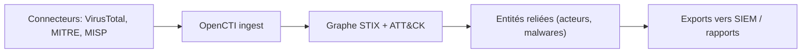

# 🔎 OpenCTI — Forensics, Threat Intel & Honeypots

> [!info] **En 1 phrase**
> OpenCTI (Open Cyber Threat Intelligence) est une plateforme open source de CTI qui modélise la connaissance menaçante en graphe de connaissances STIX 2.1, connectée à des dizaines de sources et basée sur MITRE ATT&CK.

---

## 🧾 Overview

| Champ | Valeur |
|---|---|
| Nom complet | OpenCTI — Open Cyber Threat Intelligence |
| Description | Plateforme de CTI en graphe de connaissances STIX 2.1 : entités, relations, connecteurs d'ingestion/export, intégration MITRE ATT&CK |
| Catégorie | 🔎 Forensics, Threat Intel & Honeypots |
| Sous-catégorie | Cyber Threat Intelligence (CTI) |
| Fonction principale | Ingérer, enrichir, interconnecter et visualiser la menace (acteurs, malwares, infrastructures, indicateurs) |
| Type d'outil | Plateforme web (React) + API (Python) + connecteurs |
| Licence | Apache-2.0 |
| Open source / propriétaire | Open source (édition community) + offre commerciale Filigran |
| Langage(s) de programmation | TypeScript (frontend), Python (backend, connecteurs) |
| Développeur / organisation | OpenCTI-Platform / Filigran |
| Projet officiel | OpenCTI |
| Dépôt officiel | https://github.com/OpenCTI-Platform/opencti |
| Documentation officielle | https://docs.opencti.io/latest/ |
| Date de création | 2019 (sous l'égide de la DGSE / ANSSI, publié par Filigran) |
| État du projet | actif (7.260803.0 courante, releases fréquentes) |
| Dernière version connue | 7.260803.0 |
| Systèmes compatibles | Linux (Docker Compose recommandé), Kubernetes (Helm) |

> [!note] Pour vérifier / compléter
> OpenCTI passe en versionnage daté (ex. 7.260803.0) : vérifier le changelog officiel et la matrice de compatibilité des connecteurs (version `connectors` alignée sur le serveur).

---

## 🎯 Concept

OpenCTI structure la threat intelligence comme un **graphe de connaissances** : entités (acteurs, malwares, outils, infrastructures) reliées par des relations (utilise, communique, cible), le tout au format standard **STIX 2.1**. C'est une « base de données vivante » où chaque objet est enrichi, noté et interconnecté, plutôt qu'une simple liste d'IoC. On l'utilise en SOC/CTI pour ingérer des rapports, cartographier des campagnes et relier des indicateurs à des techniques MITRE ATT&CK.

La plateforme repose sur des **connecteurs** : une soixantaine de collecteurs vers VirusTotal, MITRE, MISP, Abuse.ch, CIRCL, et des **connectors** d'export (vers MISP, SIEM). Les **analystes** travaillent dans l'interface : création d'entités, de rapports, de contenus « knowledge » reliés au graphe. OpenCTI et MISP se complètent : MISP pour le partage opérationnel d'IoC, OpenCTI pour la connaissance et les relations.



---

## 🧠 Concepts fondamentaux

| Concept | Explication |
|---|---|
| STIX 2.1 | Standard de modélisation de la menace (entités, indicateurs, rapports, bundles) |
| Entité | Objet du graphe : Threat-Actor, Malware, Intrusion-Set, Tool, Infrastructure, Campaign |
| Relation | Lien entre entités : uses, targets, related-to, attributed-to, communicates-with |
| Indicateur | IoC avec type (ipv4, domain, hash), score et confiance |
| Observable | Artefact technique (fichier, clé de registre, email) lié aux indicateurs |
| Rapport | Document source analysé, décomposé en entités et relations |
| Connecteur | Service Python d'ingestion (VirusTotal, MITRE, MISP...) ou d'export (SIEM, STIX) |
| Kill chain | Phases de l'attaque (Lockheed Martin, ATT&CK) attribuées aux techniques |
| Technique | Technique MITRE ATT&CK reliée aux entités et indicateurs |
| GraphQL | API principale d'interrogation et de mutation du graphe |
| Bundle | Paquet STIX 2.1 (JSON) importé via l'API |
| Confidence / Score | Niveau de fiabilité et de gravité d'un indicateur ou d'une entité |

---

## 🛠️ Installation

Déploiement officiel via Docker Compose (recommandé) ; l'installation classique (Redis, Elasticsearch, PostgreSQL, MinIO) est lourde à gérer manuellement :

```bash
git clone https://github.com/OpenCTI-Platform/opencti.git
cd opencti/opencti-platform && docker compose up -d
# Configuration minimale : éditer le fichier docker-compose.yml (token admin, plateform name)
```

```bash
# Kubernetes (Helm) pour les grands déploiements
helm repo add opencti https://filigran-helm-charts.github.io/charts
helm install opencti opencti/opencti
```

Première connexion : `http://localhost:8080` avec les identifiants par défaut (configurés dans le compose) ; activer l'authentification et changer le token admin immédiatement.

> [!warning] ⚠️ Prérequis & problèmes potentiels
> - OpenCTI dépend de PostgreSQL, Elasticsearch/OpenSearch, Redis, RabbitMQ et MinIO (S3) : tous fournis par le compose, mais gourmands en ressources pour un lab.
> - Le token admin par défaut doit être changé immédiatement.
> - Les connecteurs doivent être déployés avec une version alignée sur le serveur (matrice de compatibilité).

---

## ⚙️ Configuration

| Paramètre | Rôle | Valeur possible | Impact | Exemple |
|---|---|---|---|---|
| `APP__ADMIN_TOKEN` | Token admin initial | chaîne aléatoire | Authentification | Token à rotation immédiate |
| `APP__APP_URL` | URL publique | URL | Liens et connecteurs | `http://opencti.example.com` |
| `APP__BASE_URL` | Base des URLs API | URL | Connecteurs | `http://opencti-api.example.com` |
| `APP__S3__BUCKET` | Stockage MinIO | nom de bucket | Stockage des rapports/fichiers | `opencti-bucket` |
| `APP__ELASTICSEARCH__URL` | Index de recherche | URL | Recherche plein texte | `http://elasticsearch:9200` |
| `APP__REDIS__HOST` | Cache | hôte | File de jobs | `redis` |
| `CONNECTOR__*` | Paramètres d'un connecteur | token, fréquence, sources | Ingestion automatique | `CONNECTOR__VULN__PERIOD: "1d"` |
| `APP__APP__LANG` | Langue de l'interface | `en`, `fr` | Confort d'usage | `fr` |

> [!note] À vérifier
> La configuration se fait via variables d'environnement (compose) et l'interface d'administration ; les options évoluent entre versions majeures — se référer à la doc officielle.

---

## 🏗️ Architecture interne

Composants et flux à l'exécution :

- **Frontend React** : interface web (navigation, graphe interactif, dashboards, investigations).
- **Backend API (Python/FastAPI)** : expose GraphQL (requêtes/mutations) et endpoints REST (`.rest`) ; gère l'authentification et la logique métier.
- **Workers** : traitement asynchrone des jobs (imports, exports, indexation).
- **Message queue (RabbitMQ)** : transport des tâches entre API, workers et connecteurs.
- **Base de données** : PostgreSQL (données du graphe), Elasticsearch/OpenSearch (index de recherche), Redis (cache), MinIO/S3 (fichiers joints).
- **Connecteurs** : services Python dédiés — ingestion (VirusTotal, MITRE, MISP, Abuse.ch, Shodan, OTX...), enrichissement, export (CSV, STIX, TheHive, MISP, Splunk) — connectés à l'API via token.
- **Modèle STIX 2.1** : entités (Threat-Actor, Malware, Intrusion-Set...), indicateurs, observables, rapports, relations.

Flux type : connecteur de pull (ex. MITRE ATT&CK) → ingestion dans le graphe → enrichissement par d'autres connecteurs (réputation, WHOIS) → les analystes relient les entités (knowledge) → export des indicateurs vers le SIEM via API ou connecteur.

---

## ⌨️ Commandes

### Commandes principales

```bash
# API REST : interroger les indicateurs via curl
curl -H "Authorization: Bearer <token>" \
     "http://localhost:8080/api/v1/indicators?search=emotet"
# Exemple d'ingestion STIX via l'API (upload d'un bundle)
curl -X POST -H "Authorization: Bearer <token>" \
     "http://localhost:8080/api/v1/import/bundle" \
     -F file=@bundle.json
```

| Action | Effet |
|---|---|
| `Connectors → Connectors Manager` | Liste les connecteurs actifs (ingest et export) |
| `Data → Connections` | Configure un connecteur : clé API de la source, fréquence de pull |
| `Analyses → Reports` | Ingère des rapports de menace et en extrait les entités |
| `Knowledge` | Crée des entités (acteur, malware, outil) reliées par relations |
| `Indicators` | Consulte les IoC et leur score de confiance |
| `Techniques` (menu) | Navigue dans MITRE ATT&CK et relie chaque technique aux entités |
| API `GET /api/v1/indicators` | Export JSON des indicateurs pour alimenter SIEM/scripts |
| API `POST /api/v1/import/bundle` | Importe un bundle STIX 2.1 (rapports, entités) |

### Commandes avancées

```bash
# API GraphQL : rechercher des entités malware par nom
curl -X POST -H "Authorization: Bearer <token>" -H "Content-Type: application/json" \
     http://localhost:8080/graphql \
     -d '{"query":"{ malwares(search:\"emotet\") { edges { node { name } } } }"}'

# Exporter les indicateurs du jour (REST)
curl -H "Authorization: Bearer <token>" \
     "http://localhost:8080/api/v1/indicators?first=100&filters=[{\"key\":\"pattern\",\"values\":[\"domain-name\"]}]"
```

---

## 🎚️ Options et flags

| Paramètre | Description | Exemple | Niveau |
|---|---|---|---|
| `Authorization: Bearer <token>` | Authentification API | `curl -H "Authorization: Bearer ..."` | Basic |
| `?search=` | Recherche plein texte | `?search=emotet` | Basic |
| `?first=` | Pagination | `?first=100` | Basic |
| `?filters=[...]` | Filtres JSON (types, scores) | `filters=[{"key":"pattern","values":["domain-name"]}]` | Intermediate |
| `?orderBy` / `?orderMode` | Tri | `?orderBy=created&orderMode=desc` | Intermediate |
| `POST /api/v1/import/bundle` | Import d'un bundle STIX | `-F file=@bundle.json` | Intermediate |
| `POST /graphql` | Requête GraphQL | `{"query":"{ malwares { edges { node { name } } } }"}` | Advanced |
| `--connector` (worker) | Démarrer un connecteur précis | `python connector.py` | Expert |
| `CONNECTOR__PERIOD` | Fréquence de pull d'un connecteur | `"1d"` | Advanced |

> [!tip] Options les plus utiles au quotidien
> `Bearer token` pour toute requête, `?search=` pour trouver une entité, `/import/bundle` pour ingérer du STIX, et les filtres JSON sur `/indicators` pour extraire des listes propres vers le SIEM.

---

## 🧪 Exemples pratiques

### Beginner

```bash
# Objectif : récupérer les 50 derniers indicateurs en JSON
curl -H "Authorization: Bearer <token>" \
     "http://localhost:8080/api/v1/indicators?first=50" | jq '.data[].name'
```

### Intermediate

```bash
# Objectif : importer un rapport STIX 2.1
curl -X POST -H "Authorization: Bearer <token>" \
     "http://localhost:8080/api/v1/import/bundle" -F file=@report_bundle.json
```

### Advanced

```bash
# Objectif : lister les malwares reliés à une infrastructure
curl -H "Authorization: Bearer <token>" \
     "http://localhost:8080/api/v1/entities?types=Malware" | jq '.data[] | .name'
# Puis explorer les relations via GraphQL pour suivre le graphe
```

### Expert

```python
# Python — utiliser l'API GraphQL d'OpenCTI pour la chasse en graphe
import requests

token = "TOKEN"
gql = """
{
  malwares(search: "emotet") {
    edges { node { id name } }
  }
}
"""
r = requests.post("http://localhost:8080/graphql",
                  headers={"Authorization": f"Bearer {token}"},
                  json={"query": gql})
print(r.json())
```

---

## 🧪 Workflow complet (scénario pas à pas)

1. **Activer un connecteur** : `Connectors` → activer le connecteur MITRE ATT&CK pour importer la matrice et la galaxie de techniques.
2. **Ajouter une source** : configurer le connecteur VirusTotal avec une clé API → pull régulier des rapports liés à vos indicateurs.
3. **Créer le rapport d'incident** : `Analyses → Reports` → coller le rapport INC-2026-042 ; laisser l'analyse automatique extraire entités et indicateurs.
4. **Relier dans le graphe** : ouvrir l'entité `Emotet` → la relier à la technique `T1059.001` (PowerShell) et à l'acteur identifié.
5. **Ajouter un indicateur** : `Indicators` → IP du C2 (issue du honeypot Cowrie ou de netscan) → relation `related-to` avec le malware.
6. **Exporter vers le SIEM** : via le connecteur d'export MISP ou une requête API sur les indicateurs récents.
7. **Chasser dans le graphe** : rechercher toutes les infrastructures liées à un même acteur pour étendre la liste de blocage.

---

## 🎬 Scénarios avancés

### Scénario 1 : Chasse en graphe pour étendre une liste de blocage

```bash
# Exporter tous les indicateurs liés à un acteur donné
curl -H "Authorization: Bearer <token>" \
  "http://localhost:8080/api/v1/entities?types=Threat-Actor" | jq '.data[] | .name'
# puis requête de relations : toutes les infrastructures de cet acteur
```

Le graphe révèle des relations non évidentes (même infrastructure, même infrastructure technique partagée).

### Scénario 2 : Ingestion automatisée de rapports STIX 2.1

```bash
# Récupérer un bundle STIX (ex : sortie MISP) et l'importer
misp2stix -i events.json -o bundle.json
curl -X POST -H "Authorization: Bearer <token>" \
  "http://localhost:8080/api/v1/import/bundle" -F file=@bundle.json
```

### Scénario 3 : Corrélation d'une campagne multi-acteurs via le graphe

```bash
# 1. Importer les rapports des campagnes liées (connecteurs ou bundles)
# 2. Relier chaque malware à ses techniques ATT&CK et à ses infrastructures
# 3. Recherche GraphQL : toutes les entités partageant une même infrastructure
curl -X POST -H "Authorization: Bearer <token>" -H "Content-Type: application/json" \
     http://localhost:8080/graphql \
     -d '{"query":"{ infrastructures { edges { node { id name } } } }"}'
```

### Scénario 4 : Automatisation de l'export SIEM des nouveaux indicateurs

```bash
# Script cron : exporter les indicateurs des dernières 24 h
curl -H "Authorization: Bearer <token>" \
  "http://localhost:8080/api/v1/indicators?first=500&orderBy=created&orderMode=desc" \
  | jq -r '.data[] | select(.created > "<date_hier>") | .pattern' > /tmp/new_iocs.txt
# Ingest dans la liste de blocage SIEM / firewall
```

---

## 🛡️ Cybersecurity use cases

| Phase | Utilisation |
|---|---|
| CTI / veille | Ingestion de rapports et de flux (VirusTotal, MITRE, MISP, Abuse.ch) |
| Cartographie de la menace | Graphe : acteurs, malwares, infrastructures, campagnes reliés |
| Chasse | Extension de listes de blocage par relations (infrastructures communes) |
| Détection | Export des indicateurs (score/confiance) vers SIEM/IDS |
| Analyse d'incident | Relier les IoC d'un incident aux techniques ATT&CK et aux acteurs |
| Opération | Connecteurs d'enrichissement (réputation, WHOIS) et d'export (STIX, TheHive) |

---

## 🎯 MITRE ATT&CK

| Tactique | Technique / Sub-technique | ID | Raison | Détection | Mitigation |
|---|---|---|---|---|---|
| Command and Control | Application Layer Protocol: Web Protocols | T1071.001 | Les indicateurs C2 (IP/domaines) sont modélisés et reliés | Export d'IoC vers SIEM/IDS | Egress filtering |
| Resource Development | Acquire Infrastructure | T1583 | Les infrastructures des acteurs sont des entités du graphe | Chasse par relations | Partage CTI |
| Resource Development | Obtain Capabilities: Malware | T1588.001 | Malwares et outils modélisés comme entités | Corrélation avec les rapports | Sandbox, analyse |
| Initial Access | Phishing | T1566 | Campagnes de phishing documentées en rapports | Attributs email/url + ATT&CK | Filtrage mail |
| Reconnaissance | Gather Victim Org Information | T1591 | Profilage des cibles relié aux campagnes | Graphe d'acteurs | Partage restreint |
| Persistence | Valid Accounts | T1078 | Compromission de comptes corrélée dans le graphe | Indicateurs + rapports | MFA, monitoring |

> [!note] Ne renseigner que si l'association est réellement pertinente.
> OpenCTI est une **plateforme de connaissance** : les mappings décrivent les techniques dont elle modélise les indicateurs et les relations, pas des capacités offensives.

---

## 🛡️ Defensive Security

### Signes observables

| Indicateur | Détail |
|---|---|
| Requêtes API ouvertes (token par défaut, pas d'authentification) | Rotation du token admin, rôles/groupes, MFA sur l'accès web |
| Connecteur avec une clé API tierce compromise | Restreindre les permissions des connecteurs, journaliser les pulls |
| Accès à des données sensibles (IoC, infrastructures) | Segmentation réseau, pare-feu applicatif, chiffrement au repos |
| Graphe corrompu par des imports non vérifiés | Valider les sources (confiance/score), sandbox les bundles STIX entrants |

### Règles de détection (Sigma / Suricata / Snort / YARA)

```yaml
# Sigma — détection d'un indicateur exporté d'OpenCTI vers le SIEM
title: OpenCTI Flagged IoC Detected
id: e5f6a7b8-c9d0-4e1f-8a2b-3c4d5e6f7a8b
status: experimental
logsource:
    category: network_connection
    product: windows
detection:
    selection:
        DestinationIp|in:
            # IoC extraits d'OpenCTI (score élevé, confiance forte)
            - '203.0.113.66'
    condition: selection
falsepositives:
    - Indicateurs périmés encore en liste
level: medium
```

```text
# Règle Suricata — blocage d'un domaine relié à un acteur dans OpenCTI
alert dns any any -> any any (msg:"OpenCTI - Infrastructure acteur";
  dns.query; content:"c2.example.com"; nocase; sid:3000002; rev:1;)
```

---

## 🤖 Automatisation

```bash
# Bash — exporter les nouveaux indicateurs (cron quotidien)
curl -H "Authorization: Bearer <token>" \
  "http://localhost:8080/api/v1/indicators?first=1000&orderBy=created&orderMode=desc" \
  | jq -r '.data[] | select(.created >= "'"$(date -d yesterday +%Y-%m-%d)"'") | .pattern' \
  > /tmp/opencti_iocs.txt

# Bash — vérifier l'état d'un connecteur
curl -H "Authorization: Bearer <token>" \
  "http://localhost:8080/api/v1/connectors" | jq -r '.data[] | .name + " " + .state'
```

```python
# Python — importer des indicateurs depuis une liste locale
import requests

token = "TOKEN"
for ip in ["203.0.113.66", "198.51.100.9"]:
    bundle = {
        "objects": [{
            "type": "indicator", "name": f"IP {ip}",
            "pattern": f"[ipv4-addr:value = '{ip}']",
            "valid_from": "2026-08-01T00:00:00Z",
        }]
    }
    r = requests.post("http://localhost:8080/api/v1/import/bundle",
                      headers={"Authorization": f"Bearer {token}"},
                      json=bundle)
    print(ip, r.status_code)
```

---

## 📤 Output et parsing

L'API REST/GraphQL renvoie du **JSON** : les objets STIX (indicator, malware, threat-actor) avec `id`, `name`, `pattern`, `created`, `score`, `confidence`. Les connecteurs d'export produisent CSV, STIX 2.1, OpenIOC, ou poussent vers MISP/TheHive/Splunk.

```bash
# Compter les indicateurs par type
curl -H "Authorization: Bearer <token>" \
  "http://localhost:8080/api/v1/indicators?first=5000" \
  | jq -r '.data[].pattern' | grep -oE '^\[[a-z-]+' | sort | uniq -c | sort -rn | head

# Extraire les domaines de confiance forte
curl -H "Authorization: Bearer <token>" \
  "http://localhost:8080/api/v1/indicators?first=5000" \
  | jq -r '.data[] | select(.confidence >= 80) | .pattern' | grep 'domain-name'
```

```python
# Python — parser les indicateurs pour une liste de blocage
import json, urllib.request

req = urllib.request.Request("http://localhost:8080/api/v1/indicators?first=500",
                             headers={"Authorization": "Bearer TOKEN"})
data = json.load(urllib.request.urlopen(req))
for ind in data.get("data", []):
    if "ipv4-addr" in ind.get("pattern", ""):
        print(ind["name"])
```

---

## 🔗 Intégrations

```text
OpenCTI ← connecteurs : VirusTotal, MITRE ATT&CK, MISP, Abuse.ch, CIRCL, Shodan, OTX
OpenCTI → exports : STIX 2.1, CSV, OpenIOC, TheHive, MISP, Splunk
OpenCTI ↔ MISP (synchronisation de threat intel)
OpenCTI ← analyse YARA / sandbox / honeypots (artefacts et indicateurs)
OpenCTI → SIEM (Elastic/Splunk) via API ou connecteurs
```

- [[Tools|🧰 Outils]]
- [[Outils/Outil - MISP|🔎 MISP]] — partage opérationnel d'IoC, OpenCTI pour le graphe de connaissance
- [[Outils/Outil - Sigma|🔎 Sigma]] — règles de détection corrélées aux techniques ATT&CK
- [[Outil - Cowrie]] — honeypot alimentant les indicateurs d'OpenCTI
- [[Outil - Canarytokens]] — triggers d'incident reliés aux campagnes
- [[Outil - YARA]] — signatures issues de l'analyse, modélisées en indicateurs
- [[Outil - MISP]] — source d'indicateurs et cible d'export

---

## 🔄 Alternatives

| Outil | Avantages | Inconvénients | Cas d'usage |
|---|---|---|---|
| OpenCTI | Graphe STIX 2.1, connecteurs, open source | Lourd (multi-composants), courbe d'apprentissage | SOC/CTI structuré |
| MISP | Partage inter-orga simple, IoC opérationnels | Moins de modélisation relationnelle | Partage d'IoC |
| ThreatConnect / Anomali | Commercial, intégrations | Coût, fermé | Entreprise |
| MITRE ATT&CK navigator | Cartographie des techniques | Pas de graphe CTI complet | Matrice de couverture |
| Abuse.ch | Gratuit, ciblé (URLhaus, Feodo) | Pas de plateforme | Feeds spécialisés |

> **Quand utiliser OpenCTI plutôt qu'un autre ?** Pour la **connaissance relationnelle** (qui attaque qui, avec quoi, par où) et la **veille automatisée** multi-sources. Pour le partage d'IoC simple et opérationnel, MISP reste plus léger.

---

## ⚡ Performance

- **Multi-composants** : OpenCTI exige PostgreSQL, Elasticsearch, Redis, RabbitMQ, MinIO : dimensionner selon le volume de données.
- **Recherche** : l'index Elasticsearch/OpenSearch porte les recherches plein texte et les requêtes du graphe ; surveiller sa charge.
- **Connecteurs** : chaque connecteur actif consomme des ressources et du réseau : n'en activer que les utiles, réduire la fréquence (`CONNECTOR__PERIOD`).
- **Graphe** : les requêtes lourdes sur des millions de relations ralentissent l'API : préférer les exports vers le SIEM pour le temps réel.
- **Workers** : le nombre de workers pilote le traitement des imports/exports en parallèle.

> [!note] À vérifier
> Les besoins exacts (RAM/CPU/stockage) dépendent du volume d'entités et de connecteurs : utiliser le compose et les recommandations officielles, benchmarker avant montée en charge.

---

## 🛠️ Troubleshooting

### Common problems

#### Problème : impossible de se connecter avec le token admin

- **Cause** : token par défaut modifié, variable d'environnement non prise en compte, redémarrage manquant.
- **Solution** : vérifier `APP__ADMIN_TOKEN` dans le compose, redémarrer l'API.
- **Vérification** : `curl -H "Authorization: Bearer <token>" http://localhost:8080/api/v1/connectors`.

#### Problème : un connecteur ne s'initialise pas

- **Cause** : version du connecteur incompatible, token invalide, dépendance manquante.
- **Solution** : aligner la version du connecteur sur le serveur, vérifier le token, consulter les logs du connecteur.
- **Vérification** : `Connectors → Connectors Manager` (état `REGISTERED`/`ERROR`).

#### Problème : la recherche ne renvoie rien

- **Cause** : index Elasticsearch non peuplé, mapping obsolète, données non indexées.
- **Solution** : relancer le reindexing (admin), vérifier l'état d'Elasticsearch.
- **Vérification** : tester une recherche simple dans l'UI puis par API.

#### Problème : l'import de bundle échoue

- **Cause** : bundle STIX invalide, doublons, champs obligatoires manquants.
- **Solution** : valider le bundle (outil STIX), supprimer les doublons, réessayer.
- **Vérification** : réponse API (`error` avec détails).

#### Problème : l'interface est lente

- **Cause** : Elasticsearch saturé, workers insuffisants, gros graphe.
- **Solution** : optimiser l'index, ajouter des workers, exporter l'analyse vers le SIEM.
- **Vérification** : monitoring des composants (docker stats).

---

## 🔐 Sécurité de l'outil

- **Authentification** : changer le token admin, activer les rôles/groupes d'analystes, MFA si possible.
- **Accès API** : les tokens sont sensibles : coffre, rotation, permissions minimales par service.
- **Réseau** : ne pas exposer l'API/le frontend directement sur Internet ; passer par un reverse proxy TLS et un VPN.
- **Données** : la CTI contient des informations sensibles (infrastructures, victimes) : chiffrement au repos, contrôles d'accès.
- **Connecteurs** : les clés API tierces sont stockées dans la config : restreindre l'accès au fichier de config.
- **Imports** : valider la confiance/score des bundles entrants ; un import malveillant peut polluer le graphe.

---

## ⚠️ Limitations

- **Lourdeur opérationnelle** : cinq composants à maintenir (PostgreSQL, Elasticsearch, Redis, RabbitMQ, MinIO).
- **Pas un SIEM** : OpenCTI ne fait pas de corrélation temps réel sur les logs — exporter vers le SIEM.
- **Courbe d'apprentissage** : modèle STIX, GraphQL, connecteurs.
- **Performance du graphe** : les très gros volumes de relations ralentissent l'interrogation directe.
- **Qualité des données** : dépend de la rigueur des analystes et des sources (confiance/score).
- **Versionnage rapide** : mises à jour fréquentes, compatibilité des connecteurs à surveiller.

---

## 📋 Cheatsheet

```bash
# Liste des indicateurs
curl -H "Authorization: Bearer <token>" \
     "http://localhost:8080/api/v1/indicators?first=100"

# Import d'un bundle STIX 2.1
curl -X POST -H "Authorization: Bearer <token>" \
     "http://localhost:8080/api/v1/import/bundle" -F file=@bundle.json

# Recherche d'entités (REST)
curl -H "Authorization: Bearer <token>" \
     "http://localhost:8080/api/v1/entities?search=emotet"

# Recherche GraphQL
curl -X POST -H "Authorization: Bearer <token>" -H "Content-Type: application/json" \
     http://localhost:8080/graphql \
     -d '{"query":"{ malwares(search:\"emotet\") { edges { node { name } } } }"}'

# Liste des connecteurs
curl -H "Authorization: Bearer <token>" \
     "http://localhost:8080/api/v1/connectors" | jq '.data[].name'
```

---

## ⚡ Quick reference

| | |
|---|---|
| **À quoi sert-il ?** | Plateforme CTI en graphe de connaissances STIX 2.1 : ingérer, relier et exporter la menace |
| **Quand l'utiliser ?** | SOC/CTI : veille multi-sources, cartographie d'acteurs, chasse par relations |
| **Commande principale** | API `GET /api/v1/indicators` / `POST /api/v1/import/bundle` |
| **Alternative principale** | MISP (partage), ThreatConnect (commercial) |
| **Concepts importants** | STIX 2.1, graphe, entités/relations, connecteurs, kill chain, GraphQL |
| **Liens associés** | [[Outils/Outil - MISP|🔎 MISP]] · [[Outils/Outil - Sigma|🔎 Sigma]] |

---

## 🔍 Détection & Défense

| Signe | Défense |
|---|---|
| Indicateur OpenCTI apparaissant dans les logs SIEM | Corrélation automatique, escalade d'incident |
| Nouvelle infrastructure reliée à un acteur connu | Extension de la liste de blocage |
| Rapport importé révélant une nouvelle technique | Mise à jour des règles de détection |
| Instance exposée / token par défaut | Rotation, VPN/SSO, MFA |
| Connecteur avec clé tierce compromise | Rotation de clé, journalisation des pulls |

---

## ⚠️ Tips & Pièges

> [!tip] 💡 Utilisez l'onglet `Analyses` avec l'extraction automatique : copiez un rapport texte et OpenCTI propose les entités à créer, un gain de temps énorme en veille quotidienne.

> [!warning] ⚠️ Ouvrir OpenCTI sans configurer les connecteurs en limite sérieusement l'intérêt : c'est un système d'ingestion, pas une base vide à remplir à la main.

> [!tip] 💡 Reliez toujours un indicateur à son contexte (malware + technique ATT&CK) : un indicateur orphelin dans le graphe ne sert ni à la chasse ni à la prise de décision.

> [!warning] ⚠️ Ne faites pas d'OpenCTI un SIEM : les requêtes lourdes sur le graphe (millions de relations) ralentissent la plateforme ; prévoyez l'export des indicateurs vers le SIEM et gardez l'analyse CTI dans OpenCTI.

> [!warning] ⚠️ **Piège** : le token admin est réutilisé par tous les connecteurs par défaut.
> Créez des tokens par connecteur (rôles restreints) et gardez-les dans un coffre : un connecteur compromis ne doit pas exposer l'administration.

---

## 📚 References

### Official

- OpenCTI — site officiel : https://www.opencti.io/
- Dépôt GitHub OpenCTI-Platform : https://github.com/OpenCTI-Platform/opencti
- Documentation OpenCTI : https://docs.opencti.io/latest/
- Catalogue des connecteurs : https://github.com/OpenCTI-Platform/connectors

### Security references

- MITRE ATT&CK T1071.001 — Web Protocols : https://attack.mitre.org/techniques/T1071/001/
- MITRE ATT&CK T1583 — Acquire Infrastructure : https://attack.mitre.org/techniques/T1583/
- MITRE ATT&CK T1588.001 — Malware : https://attack.mitre.org/techniques/T1588/001/
- OASIS STIX 2.1 : https://oasis-open.github.io/cti-documentation/

### Community

- Filigran (éditeur) : https://filigran.io
- Blog OpenCTI : https://www.opencti.io/blog/
- Communauté (Discord/GitHub) : https://github.com/OpenCTI-Platform/opencti/discussions

---

➡️ **Liens :** [[Tools|🧰 Outils]] · [[Outils/Outil - MISP|🔎 MISP]] · [[Outils/Outil - Sigma|🔎 Sigma]] · [[Techniques/11 - Glossaire|📖 Glossaire]]
