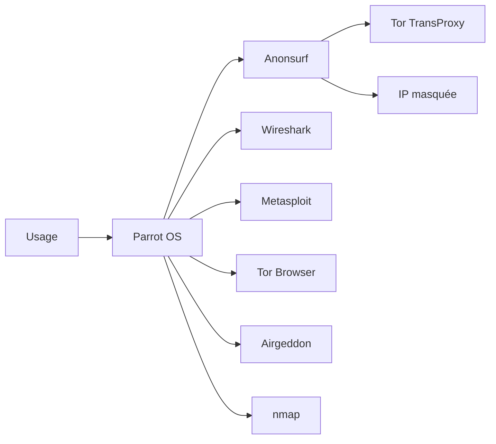

# Parrot OS — Sécurité ET vie privée au quotidien

> [!info] **En 1 phrase**
> Parrot OS est une distribution basée sur Debian qui combine outils de pentest (600+) et fonctionnalités d'anonymat (Anonsurf, Tor) pour servir à la fois de plateforme offensive et de système de travail quotidien respectueux de la vie privée.

---

## Overview

| Champ | Valeur |
|---|---|
| Nom complet | Parrot OS (anciennement Parrot Security OS) |
| Description | Distribution Debian combinant pentest (800+ outils dans l'édition Security), forensics, vie privée et anonymat |
| Catégorie | Distributions & Lab |
| Sous-catégorie | Distribution offensive + vie privée |
| Fonction principale | Plateforme de pentest, OSINT anonyme, système de travail quotidien durci |
| Type d'outil | Distribution Linux complète (CLI + GUI MATE) |
| Licence | Open source (GPLv3 et licences libres) |
| Open source / propriétaire | Open source |
| Langage(s) | Python, C, C++, Bash ; PowerShell/.NET 7.5+ disponibles via les dépôts Parrot |
| Développeur / organisation | Parrot Security CIC (Frozenbox) |
| Projet officiel | Parrot Project |
| Dépôt officiel | https://github.com/ParrotSec |
| Documentation officielle | https://docs.parrot.sh/ |
| Date de création | 10 avril 2013 |
| État du projet | actif |
| Dernière version connue | Parrot 7.3 (29 juin 2026) |
| Systèmes compatibles | x86_64, ARM (Raspberry Pi), cloud, conteneurs (Docker) |

> [!note] Pour vérifier / compléter
> Les éditions sont **Security** (outils complets, méta-paquet `parrot-tools-full`), **Home** (bureautique durcie sans outils offensifs), **HTB** (optimisée Hack The Box), **Raspberry Pi** et **Cloud/Container**. Le noyau annoncé pour 7.3 est la série 7.x Linux.

---

## Concept

Parrot OS est développée par **Parrot Security CIC** (Frozenbox) sur une base **Debian** et se distingue de Kali par une **double philosophie** : le pentest ET la protection de la vie privée. L'édition **Security** embarque plus de 800 outils (méta-paquet `parrot-tools-full`), tandis que l'édition **Home** fournit un bureau durci pour le travail quotidien, sans arsenal offensif. Le système utilise par défaut l'environnement **MATE**, réputé léger (2 Go de RAM suffisent), et un modèle de mise à jour semi-rolling.

Le point le plus original est **Anonsurf** : un script qui force **tout le trafic réseau dans Tor** via un proxy transparent (TransProxy), protégeant l'IP source pour les recherches OSINT, le journalisme et les opérations discrètes. Le **Tor Browser** est préinstallé, ainsi que des outils de chiffrement et d'analyse. Côté arsenal, Parrot reprend l'essentiel de ce que propose Kali : **Metasploit**, **Nmap**, **Wireshark**, **Airgeddon** (suite Wi-Fi), **sqlmap**, **hydra**, **Bettercap**… mais dans un ensemble généralement plus léger à installer.

En lab, Parrot joue exactement le rôle d'une machine d'attaque Kali, avec en bonus un mode « vie privée » pour les engagements OSINT où l'on veut cacher son IP. C'est aussi un choix apprécié des journalistes et chercheurs qui veulent un système quotidien durci avec une sortie Tor optionnelle.



---

## Concepts fondamentaux

| Concept | Explication |
|---|---|
| Base Debian | Parrot dérive de Debian : gestionnaire `apt`/`dpkg`, format `.deb`, compatibilité avec les outils Debian |
| Édition Security | Distro complète de pentest : méta-paquet `parrot-tools-full` (800+ outils) |
| Édition Home | Bureau durci sans outils offensifs, pensé pour le travail quotidien et la vie privée |
| Anonsurf | Script qui route tout le trafic TCP/UDP via Tor (proxy transparent) ; `anonsurf start/stop/restart/status` |
| TransProxy | Redirection transparente du trafic vers un proxy local (Tor) via les règles iptables |
| Tor Browser | Navigateur préconfiguré Tor avec isolation des sites et anti-empreinte |
| Environnement MATE | Bureau léger et stable, dérivé de GNOME 2, par défaut sur Parrot |
| Méta-paquets | Groupes d'outils : `parrot-tools-full`, `parrot-tools-*` par famille |
| Semi-rolling | Modèle de mises à jour plus fréquent que Debian stable mais moins agressif que Kali rolling |
| Firejail | Bac à sable applicatif inclus pour durcir les applications du bureau |

---

## Installation

### Téléchargement et vérification

```bash
# 1. Télécharger l'ISO (éditions Security, Home, HTB, Raspberry Pi, Cloud)
#    https://www.parrotsec.org/download/
# 2. Vérifier la checksum
#    sha256sum parrotsec-7.3-security_amd64.iso
```

### Graver sur USB

```bash
sudo dd if=parrotsec-7.3-security_amd64.iso of=/dev/sdX bs=4M status=progress
sync
# Windows : Rufus (mode DD recommandé)
```

### Machine virtuelle

```bash
# Importer les images OVA officielles dans VirtualBox/VMware
# Ressources conseillées : 2 Go de RAM minimum, 4 Go confortables, 40 Go de disque
```

### Docker et cloud

```bash
docker run -it parrotsec/parrot
# Images cloud officielles disponibles pour AWS/Azure/GCP
```

### Mise à jour après installation

```bash
sudo apt update && sudo apt full-upgrade -y
sudo parrot-upgrade
```

> [!warning] Prérequis & problèmes potentiels
> - L'édition **Security** nécessite plus de ressources que Home (outils nombreux).
> - Anonsurf nécessite une connexion Tor fonctionnelle ; vérifier `anonsurf status` après démarrage.
> - Sur une VM, installer les **guest additions** pour un bureau confortable.

---

## Configuration

| Paramètre | Rôle | Valeur possible | Impact | Exemple |
|---|---|---|---|---|
| `/etc/anonsurf` | Configuration du tunnel Tor | `start/stop/restart/status` | Routage du trafic via Tor | `sudo anonsurf start` |
| `parrot-upgrade` | Mise à jour complète de la distro | `sudo parrot-upgrade` | Système à jour (y compris outils) | `sudo parrot-upgrade` |
| `/etc/apt/sources.list` | Dépôts Parrot | `deb https://deb.parrotsec.org/parrot parrot main contrib non-free` | Accès aux paquets | `cat /etc/apt/sources.list` |
| Comptes par défaut | Session de départ | `user` / `user` (live) ou `root`/`toor` | Accès système | `sudo passwd root` |
| Firejail | Bac à sable des applications | `firejail firefox` | Confinement des programmes | `firejail --list` |
| Tor | Circuit de navigation | Tor Browser ou `tor` CLI | Anonymat | `torify curl https://ifconfig.me` |

---

## Architecture interne

Parrot est un dérivé Debian : **`apt`/`dpkg`**, `systemd`, structure `/usr`, `/etc`, `/var`, et un noyau Linux compilé avec des options de durcissement. L'architecture des outils suit le modèle des **méta-paquets** : `parrot-tools-full` installe l'arsenal Security complet ; des paquets plus ciblés permettent une installation minimale.

Le cœur du système de vie privée est **Anonsurf**, qui fonctionne comme suit :

- Il installe et configure **Tor** en tant que proxy SOCKS/HTTP local.
- Il injecte des **règles iptables** de redirection transparente (TransProxy) pour forcer les paquets TCP sortants vers Tor.
- Il bloque les connexions **DNS non-Tor** pour éviter les fuites DNS.
- `anonsurf status` vérifie l'état du tunnel ; `restart` renouvelle le circuit (nouvelle identité).

L'édition Security organise les outils par **menus** (parrot-menu) : « Information Gathering », « Web Applications », « Wireless Attacks », « Exploitation Tools », « Forensics », « Password Attacks »… Chaque entrée pointe vers les binaires classiques de l'écosystème pentest.

---

## Commandes

### Commandes principales

```bash
sudo anonsurf start            # route tout le trafic via Tor
sudo anonsurf stop             # arrête le tunnel
sudo anonsurf restart          # nouveau circuit Tor
sudo anonsurf status           # état du tunnel
sudo parrot-upgrade            # mise à jour complète
```

| Commande | Objectif | Résultat attendu |
|---|---|---|
| `sudo anonsurf start` | Activer l'anonymat global | Tout le trafic passe par Tor |
| `sudo anonsurf status` | Vérifier l'état du tunnel | État Tor + IP de sortie |
| `sudo anonsurf restart` | Renouveler le circuit | Nouvelle IP de sortie |
| `sudo parrot-upgrade` | Mise à jour complète | Système et outils à jour |
| `torify curl https://ifconfig.me` | Curl via Tor | IP du nœud de sortie Tor |
| `wireshark` | Capture/analyse de paquets | Interface graphique Wireshark |
| `sudo airgeddon` | Suite Wi-Fi offensive | Menu interactif d'attaques Wi-Fi |
| `openvas-start` | Scanner de vulnérabilités (Greenbone) | Web UI OpenVAS |
| `msfconsole` | Console Metasploit | Prompt `msf6 >` |

### Commandes avancées

```bash
# Vérifier son IP réelle avant/après Anonsurf
curl -s https://ifconfig.me ; echo
sudo anonsurf start
curl -s https://check.torproject.org/api/ip ; echo
# Scanner avec un outil via Tor
torify theHarvester -d exemple.com -b all
```

---

## Options et flags

| Option | Description | Exemple | Niveau |
|---|---|---|---|
| `anonsurf start` | Démarre le tunnel Tor global | `sudo anonsurf start` | Basic |
| `anonsurf stop` | Arrête le tunnel | `sudo anonsurf stop` | Basic |
| `anonsurf restart` | Nouveau circuit | `sudo anonsurf restart` | Basic |
| `anonsurf status` | État du tunnel | `sudo anonsurf status` | Basic |
| `parrot-upgrade` | Mise à jour complète | `sudo parrot-upgrade` | Basic |
| `torify <cmd>` | Exécute une commande via Tor | `torify curl -s https://api.github.com` | Intermediate |
| `torsocks <cmd>` | Alternative SOCKS à torify | `torsocks ssh user@host` | Intermediate |
| `firejail <app>` | Lance une app dans un bac à sable | `firejail firefox` | Intermediate |
| `apt install parrot-tools-*` | Installe une famille d'outils | `sudo apt install parrot-tools-web` | Intermediate |
| `parrot-menu` | Menu graphique des catégories d'outils | `parrot-menu` | Basic |
| `anonsurf --status` | Variante CLI du statut | `sudo anonsurf --status` | Advanced |

> [!tip] Options les plus utiles au quotidien
> `sudo anonsurf status` (vérifier l'anonymat avant toute action sensible), `sudo parrot-upgrade` (maintenance), `torify`/`torsocks` (commande unique via Tor), `parrot-menu` (lancer un outil rapidement).

---

## Exemples pratiques

### Beginner

```bash
# Mettre à jour
sudo parrot-upgrade
# Scanner un hôte de lab
sudo nmap -sS -sV 10.10.20.15
# Vérifier l'anonymat
sudo anonsurf start
curl -s https://check.torproject.org/api/ip
```

### Intermediate

```bash
# Énumération web
sqlmap -u "http://10.10.20.15/index.php?id=1" --dbs --batch
gobuster dir -u http://10.10.20.15 -w /usr/share/wordlists/dirb/common.txt
```

### Advanced

```bash
# Attaque Wi-Fi via Airgeddon (menu interactif)
sudo airgeddon
# Crack du handshake capturé
sudo aircrack-ng -w /usr/share/wordlists/rockyou.txt handshake.cap
```

### Expert

```bash
# OSINT anonyme complet : changer de circuit avant chaque collecte
sudo anonsurf restart
torify theHarvester -d exemple.com -b all
torify sherlock username
```

---

## Workflow complet (scénario pas à pas)

1. **Durcir le système** — changer les mots de passe par défaut et mettre à jour.
   ```bash
   passwd
   sudo passwd root
   sudo parrot-upgrade
   ```
2. **Vérifier l'anonymat** — activer Anonsurf et confirmer l'IP de sortie.
   ```bash
   curl -s https://ifconfig.me ; echo
   sudo anonsurf start
   curl -s https://check.torproject.org ; echo
   ```
3. **Reconnaissance** — scanner une cible de lab.
   ```bash
   sudo nmap -sS -sV -O -p- 10.10.20.15
   ```
4. **Exploitation web** — tester une injection SQL.
   ```bash
   sqlmap -u "http://10.10.20.15/index.php?id=1" --dbs --batch
   ```
5. **Post-exploitation** — prendre pied via Metasploit.
   ```bash
   msfconsole -q
   msf6 > use exploit/multi/handler
   msf6 > set payload linux/x64/meterpreter/reverse_tcp
   msf6 > set LHOST 10.10.20.15
   msf6 > run
   ```
6. **Rapport** — documenter les résultats.
   ```bash
   nmap -oA audit 10.10.20.15
   searchsploit -x 50446
   ```

---

## Scénarios avancés

### Scénario 1 : OSINT anonyme depuis Parrot Home

```bash
sudo anonsurf start
torify theHarvester -d exemple.com -b all
torify sherlock username
torify curl -s "https://api.github.com/search/users?q=username" | jq '.items[].login'
```

### Scénario 2 : Evil Twin avec Airgeddon

```bash
sudo airgeddon
# Menu : sélectionner l'interface, scanner, choisir le BSSID cible
# Option : Evil Twin Attack -> Mode handshake -> capturer puis cracker
sudo aircrack-ng -w /usr/share/wordlists/rockyou.txt handshake.cap
```

### Scénario 3 : Double écran — Home pour la prod, Security pour le lab

Utiliser Parrot **Home** comme système de travail quotidien durci et lancer Parrot **Security** dans une VM isolée pour les engagements offensifs : séparation totale entre vie privée et activités d'audit.

---

## Cybersecurity use cases

| Phase | Utilisation |
|---|---|
| Reconnaissance | Nmap, theHarvester, Maltego, spiderfoot, Recon-ng |
| OSINT anonyme | Anonsurf + Tor, sherlock, theHarvester |
| Énumération | gobuster, dirsearch, enum4linux, dnsrecon |
| Vulnérabilité | OpenVAS (Greenbone), nuclei, nikto, sqlmap |
| Exploitation | Metasploit, sqlmap, SET, BeEF, msfvenom |
| Post-exploitation | Mimikatz, Impacket, BloodHound, PowerShell Empire |
| Cracking | hashcat, John the Ripper, hydra, ncrack |
| Wi-Fi | Airgeddon, aircrack-ng, wifite, Reaver, Bettercap |
| Forensics | Autopsy, Volatility, binwalk, strings |
| Vie privée / journalisme | Tor Browser, Anonsurf, OnionShare, KeePassXC |

---

## MITRE ATT&CK

| Tactique | Technique / Sub-technique | ID | Raison | Détection | Mitigation |
|---|---|---|---|---|---|
| Command & Control | Proxy : Multi-hop Proxy | T1090.003 | Anonsurf route le trafic via un circuit Tor multi-sauts | Surveillance des connexions vers les nœuds Tor (lists de sortie) | Contrôle des flux sortants, listes Tor |
| Discovery | Network Service Discovery | T1046 | Nmap préinstallé pour l'énumération de services | SYN rates anormaux, IDS/IPS | Rate-limiting, segmentation |
| Execution | Command and Scripting Interpreter : PowerShell | T1059.001 | PowerShell 7.5+ officiellement supporté via les dépôts Parrot | Événements 4104/4688, AMSI | Constrained Language Mode |
| Credential Access | Brute Force | T1110 | hydra/ncrack préinstallés pour l'attaque des mots de passe | Logs d'échecs répétés (4625, SSH) | fail2ban, MFA, verrouillage |
| Collection | Screen Capture | T1113 | Outils de capture et de documentation intégrés | Processus de capture suspects | EDR, politique applicative |

> [!note] Ne renseigner que si l'association est réellement pertinente.
> Comme toute distro offensive, Parrot « active » des techniques via ses outils ; Anonsurf est spécifiquement mappé sur T1090.003 (multi-hop proxy).

---

## Defensive Security

### Signes observables

| Indicateur | Détail |
|---|---|
| Trafic sortant vers les nœuds de sortie Tor | Changements d'IP brutaux, connexions à des IP des listes Tor Project |
| Scans nmap/sqlmap massifs | SYN rates élevés, User-Agent `sqlmap/`, window sizes Nmap |
| Bruteforce hydra sur SSH/web | Tentatives répétées, burst de connexions |
| Utilisation d'Anonsurf détectée | Trafic HTTP vers des relais Tor, timings spécifiques |
| Session Metasploit sortante | Connexions vers ports élevés (4444, 8443) |

### Règles de détection (Sigma / Suricata / Snort / YARA)

```yaml
# Sigma — Linux : connexions vers des nœuds Tor (sorties connues)
title: Outbound Connection to Tor Exit Node
id: 7f3c4a9e-2b11-4c77-9d2e-4a5f6b7c8d9e
status: test
logsource:
    category: network_connection
    product: linux
detection:
    selection:
        DestinationIp:
            - '185.220.101.0/24'
            - '185.220.102.0/24'
            - '107.189.0.0/16'
    condition: selection
falsepositives:
    - Tor users with legitimate privacy needs
level: medium
```

```bash
# Suricata — détection de scan Nmap SYN avec fenêtre fixe
alert tcp any any -> any any (msg:"ET SCAN NMAP SYN window"; flags:S; window:1024; threshold: type limit, track by_src, seconds 60, count 10; sid:2001001; rev:1;)
```

---

## Automatisation

```bash
# Bash — cycle Anonsurf pour renouveler l'identité Tor en OSINT
for i in 1 2 3; do
    sudo anonsurf restart
    sleep 10
    curl -s https://ifconfig.me
    echo
done
```

```python
# Python — vérification de l'IP de sortie via l'API Tor
import json
import urllib.request
with urllib.request.urlopen("https://check.torproject.org/api/ip") as r:
    data = json.load(r)
    print("IP:", data.get("IP"), "| Tor:", data.get("IsTor"))
```

---

## Output et parsing

Les outils de Parrot produisent des sorties standard : la gestion se fait comme sous Debian.

```bash
# Nmap XML -> HTML pour le rapport
sudo nmap -sC -sV -oX scan.xml 10.10.20.15
xsltproc /usr/share/nmap/nmap.xsl scan.xml -o rapport.html
# JSON de l'API Tor pour vérifier l'anonymat
curl -s https://check.torproject.org/api/ip | jq .
```

```python
# Python — parsing XML Nmap
import xml.etree.ElementTree as ET
tree = ET.parse('scan.xml')
for host in tree.getroot().findall('host'):
    ip = host.find('address').get('addr')
    for port in host.findall('.//port'):
        if port.find('state').get('state') == 'open':
            print(ip, port.get('portid'))
```

> [!note] À vérifier
> Anonsurf ne fournit pas de sortie JSON native : le statut se lit dans le retour console de `anonsurf status`.

---

## Intégrations

- [[Tools| Outils]] global
- [[Outil - Kali Linux]] — la distribution offensive de référence (base similaire)
- [[Outil - Tails OS]] — l'anonymat amnésique (Tor natif, sans outils offensifs)
- [[Outil - Wireshark]] — capture et analyse réseau
- [[Outil - Metasploit]] — exploitation (`msfconsole` préinstallé)
- [[Outil - Nmap]] — scan et énumération
- [[Outil - aircrack-ng]] / [[Outil - Wifite]] — Wi-Fi (Airgeddon les pilote)
- [[Outil - theHarvester]] / [[Outil - Recon-ng]] — OSINT via Tor
- [[Outil - sqlmap]] / [[Outil - hydra]] — web et brute-force
- [[Outil - bettercap]] — MITM et tests réseau

```text
Anonsurf → Tor → theHarvester → rapport OSINT
Nmap → Metasploit → post-exploitation → rapport
```

---

## Alternatives

| Outil | Avantages | Inconvénients | Cas d'usage |
|---|---|---|---|
| [[Outil - Kali Linux]] | 600+ outils, méta-paquets clairs, support OffSec/OSCP | Pas de focus vie privée | Examens et engagements offensifs |
| [[Outil - Tails OS]] | Anonymat maximal, amnésique, Tor natif | Aucun outil offensif | Recherches sensibles, whistleblowing |
| [[Outil - BlackArch]] | 2865+ outils, rolling Arch | Niveau Arch requis, pas de GUI clé en main | Pentesters avancés |
| Qubes OS | Isolation par VMs (Qubes) très solide | Lourd, complexe | Vie privée / analyste exigeant |
| Whonix | Route Tor via une VM passerelle | Lent, peu d'outils | Anonymat strict |

> **Quand utiliser Parrot plutôt que Kali ?** Pour un usage hybride : travail quotidien durci (édition Home) + engagements ponctuels (édition Security) + besoin d'anonymat intégré (Anonsurf). Pour une préparation OSCP/HTB, Kali reste le choix documenté par OffSec.

---

## Performance

- **RAM** : 2 Go suffisent en bureau léger, 4 Go confortables, 8 Go pour Metasploit + navigation.
- **Disque** : ~8 Go pour Home, ~20 Go pour Security complète.
- **Bureau MATE** : significativement plus léger que GNOME, conçu pour les machines modestes.
- **Anonsurf** : le routage Tor ajoute de la latence (chaque requête traverse plusieurs relais) ; à réserver aux tâches nécessitant l'anonymat.
- **Docker/Cloud** : versions minimales très rapides à déployer.

> [!note] À vérifier
> Ordres de grandeur issus de la documentation officielle et des retours communautaires ; dépendent du matériel.

---

## Troubleshooting

### Common problems

#### Problème : Anonsurf ne démarre pas

- **Cause** : Tor non démarré ou règles iptables conflictuelles.
- **Solution** : `sudo systemctl restart tor`, vérifier les règles avec `sudo iptables -L -n`.
- **Vérification** : `sudo anonsurf status` affiche le tunnel actif.

#### Problème : le site cible détecte une IP Tor

- **Cause** : beaucoup de sites bloquent les nœuds de sortie Tor.
- **Solution** : tenter `anonsurf restart` (nouveau circuit), ou utiliser un service d'interception (clearnet) avec précaution.
- **Vérification** : `curl -s https://check.torproject.org/api/ip | jq .IsTor`.

#### Problème : paquet introuvable après `apt update`

- **Cause** : dépôt Parrot manquant ou mal configuré.
- **Solution** : vérifier `/etc/apt/sources.list` avec l'URI officiel `deb.parrotsec.org/parrot`.
- **Vérification** : `sudo apt update` se termine sans erreur.

#### Problème : l'outil `parrot-upgrade` échoue

- **Cause** : droits insuffisants ou paquets à demi installés.
- **Solution** : `sudo dpkg --configure -a` puis relancer `sudo parrot-upgrade`.
- **Vérification** : `cat /etc/os-release` montre la dernière version.

---

## Sécurité de l'outil

- **Anonymat ≠ impunité** : Anonsurf masque l'IP mais pas l'empreinte comportementale ; à utiliser pour des tâches légitimes (OSINT, journalisme).
- **Identifiants par défaut** : l'image live utilise des comptes connus (`user`/`user` ou `root`/`toor`) ; les changer immédiatement sur toute machine exposée.
- **Tor en défense** : l'utilisation d'Anonsurf est visible au niveau du réseau local (les relais Tor sont listés publiquement).
- **Mise à jour** : `parrot-upgrade` régulier pour bénéficier des correctifs de sécurité Debian/Parrot.
- **Usage légal** : les outils offensifs de Parrot doivent être réservés aux engagements autorisés et aux labs.

---

## Limitations

- **Pas un système de production** : semi-rolling, outils offensifs détectables.
- **Anonsurf n'est pas un VPN commercial** : la sortie Tor peut être bloquée par certains services (captcha, géo-blocage).
- **Écosystème plus petit** que Kali pour certains outils très récents.
- **Performance Tor** : latence élevée pour les transferts volumineux.
- **Documentation** moins exhaustive que celle de Kali pour les engagements offensifs.

---

## Cheatsheet

```bash
# Anonymat
sudo anonsurf start
sudo anonsurf restart
sudo anonsurf status
sudo anonsurf stop

# Maintenance
sudo parrot-upgrade

# Commandes via Tor
torify curl -s https://ifconfig.me
torsocks ssh user@host

# Outils courants
sudo nmap -sS -sV 10.10.20.15
msfconsole -q
sudo airgeddon
wireshark &
```

---

## Quick reference

| | |
|---|---|
| **À quoi sert-il ?** | Distro Debian pentest + vie privée : 800+ outils (Security), anonymat Anonsurf/Tor |
| **Quand l'utiliser ?** | Machine offensive en lab, OSINT anonyme, travail quotidien durci (Home) |
| **Commande principale** | `sudo parrot-upgrade` puis `sudo anonsurf start` (si anonymat requis) |
| **Alternative principale** | [[Outil - Kali Linux]] · [[Outil - Tails OS]] |
| **Concepts importants** | Anonsurf, Tor TransProxy, édition Security/Home, méta-paquet `parrot-tools-full`, MATE |
| **Liens associés** | [[Outil - Wireshark]] · [[Outil - Metasploit]] · [[Outil - Nmap]] · [[Outil - Tails OS]] |

---

## Détection & Défense

| Signe | Défense |
|---|---|
| User-Agent Tor / sortie d'un nœud relais | Bloquer/surveiller les IP de sortie Tor (lists officielles), corréler par timing |
| Changement brutal d'IP source (Anonsurf) | Suivre les connexions (auth.log, SIEM), alerter sur les rotations d'IP |
| Scans nmap/sqlmap massifs | WAF (ModSecurity), rate-limiting, IDS/IPS |
| Bruteforce hydra sur SSH | `fail2ban`, `MaxAuthTries 3`, clés SSH uniquement |
| Session C2 sortante | Egress filtering, détection de ports inhabituels |

---

## Tips & Pièges

> [!tip] **Tips**
> - Vérifie `sudo anonsurf status` avant toute action sensible : ne te fie jamais à l'interface seule.
> - Utilise l'édition **Home** pour le travail quotidien et la **Security** dans une VM pour les engagements : isolation totale.
> - Parrot tourne bien en **live USB avec persistance chiffrée** : aucun trace sur la machine hôte.
> - Installe les outils par **méta-paquets** (`parrot-tools-*`) pour un système léger et maintenable.

> [!warning] **Pièges**
> - **Anonsurf ne protège pas contre les fuites DNS/IPv6** si mal configuré : teste avec `torsocks` et vérifie `check.torproject.org`.
> - Les outils offensifs de Parrot sont les mêmes que ceux de Kali : les utiliser sans autorisation est **illégal**.
> - Ne confonds pas « anonymat » et « impunité » : Tor ne protège pas du profilage comportemental (empreinte navigateur, timing).

---

## References

### Official

- Site officiel : https://www.parrotsec.org
- Documentation : https://docs.parrot.sh/
- Téléchargements : https://www.parrotsec.org/download/
- Blog des releases : https://parrotsec.org/blog/
- GitHub : https://github.com/ParrotSec

### Security references

- MITRE ATT&CK T1090.003 — Multi-hop Proxy : https://attack.mitre.org/techniques/T1090/003/
- MITRE ATT&CK T1046 — Network Service Discovery : https://attack.mitre.org/techniques/T1046/
- Tor Project — listes des nœuds de sortie : https://check.torproject.org/torbulkexitlist
- OWASP Top 10 : https://owasp.org/www-project-top-ten/

### Community

- Forum Parrot : https://community.parrotsec.org/
- Chaîne Telegram / Matrix officielle : https://www.parrotsec.org/community/

---

> [!info] **Sources**
> - https://www.parrotsec.org/
> - https://docs.parrotsec.org/

**Liens :** [[Tools| Outils]] · [[Outil - Tails OS| Tails OS]] · [[Outil - Wireshark| Wireshark]] · [[Outil - Kali Linux| Kali Linux]] · [[Outil - Metasploit| Metasploit]] · [[Outil - Nmap| Nmap]] · [[Outil - bettercap| bettercap]]
