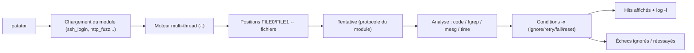

# 💥 Patator — Multi-thread brute force & fuzzing

> [!info] **En 1 phrase**
> Patator = brute-force/fuzzing multi-thread **hautement customisable** : mêmes objectifs que hydra/medusa mais avec un contrôle fin des conditions de réussite et un scripting sans prompt interactif.

---

## 🧾 Overview

| Champ | Valeur |
|---|---|
| Nom complet | Patator — multi-thread brute-force & fuzzing tool |
| Description | Brute-force et fuzzing multi-thread écrit en Python, piloté par des « positions » injectables (`FILE0`, `FILE1`...) et des conditions de filtrage (`-x`) sur le contenu des réponses |
| Catégorie | 💥 Exploitation & Cracking |
| Sous-catégorie | Brute-force d'authentification / fuzzing applicatif (HTTP, SSH, SMB, DNS...) |
| Fonction principale | Tester des valeurs injectées dans des arguments nommés et filtrer les réponses selon des critères de succès fins (code, contenu, message) |
| Type d'outil | CLI (Python, multi-thread) |
| Licence | GPL-2.0 |
| Open source / propriétaire | Open source |
| Langage(s) de programmation | Python 3 (dépendances : impacket, paramiko, dnspython, pysnmp, pycrypto) |
| Développeur / organisation | lanjelot (auteur unique, projet personnel) |
| Projet officiel | lanjelot/patator |
| Dépôt officiel | https://github.com/lanjelot/patator |
| Documentation officielle | https://github.com/lanjelot/patator/wiki |
| Date de création | ~2012 (premières versions, hébergé initialement sur Google Code) |
| État du projet | maintenu (paquet Kali actif, dépôt GitHub) |
| Dernière version connue | 1.1.0 |
| Systèmes compatibles | Linux / Windows / macOS (Python 3) |

> [!note] Pour vérifier / compléter
> Champs laissés vides si l'information n'est pas confirmée par une source officielle.

---

## 🎯 Concept

Outil multi-thread pensé pour le **fuzzing personnalisé** : au lieu de configurer des "messages d'échec", on utilise des **positions injectées** (`FILE0`, `FILE1`...) remplies par des fichiers, et des **conditions** (`-x ignore:fgrep=...`) qui filtrent les réponses. Très apprécié pour les modules HTTP (`http_fuzz`) et les logins (`ssh_login`, `ftp_login`, `smb_login`). Syntaxe différente d'hydra : `patator <module> <arguments nommés> <options>`.

Dans un pentest, Patator se place dans les phases d'authentification et de fuzzing applicatif : il remplace hydra/medusa quand il faut des critères de succès fins (contenu de page, code HTTP, message d'erreur) plutôt qu'un simple code de retour, et il excelle pour rejouer une session depuis un log JSON (`--resume`).


---

## 🧠 Concepts fondamentaux

| Concept | Explication |
|---|---|
| **Positions injectables (FILE0, FILE1...)** | Des emplacements de la commande (`user=FILE0`, `password=FILE1`) remplis ligne par ligne par des fichiers (`0=users.txt`, `1=pass.txt`) ; on croise les positions comme un produit cartésien |
| **Arguments nommés** | Contrairement à hydra (flags), chaque module de Patator reçoit ses paramètres par paires `clé=valeur` (`host=...`, `user=...`, `url=...`) |
| **Conditions -x** | `-x <action>:<champ>=<valeur>` filtre chaque tentative : `ignore:code=404`, `ignore:fgrep='texte'`, `ignore:mesg='Login incorrect.'` ; les actions se combinent (`ignore,retry:code=500`) |
| **Actions** | `ignore` (ne pas afficher), `fail` (marquer en échec), `retry` (réessayer), `reset` (relancer le module), `quit` (arrêter) — appliquées selon les champs `code`, `fgrep`, `mesg`, `time` |
| **Hits / Done / Skip / Fail** | Compteurs de fin d'exécution : hits (succès affichés), done (tentatives terminées), skip (ignorées), fail (échecs) |
| **Log JSON (-l) et --resume** | `-l fichier.json` enregistre chaque hit avec sa réponse complète ; `--resume` relance la session là où elle s'est arrêtée (fichier ou liste d'index) |
| **Threads (-t)** | Nombre de tentatives concurrentes ; Patator affiche le débit (`Avg: X r/s`) et le temps restant en fin de run |
| **`-i` (interactif)** | Intercepte une réponse avant qu'elle soit traitée pour l'inspecter et affiner les conditions |

---

## 🛠️ Installation

### Debian / Ubuntu / Kali Linux

```bash
sudo apt update && sudo apt install -y patator
```

### Arch Linux

```bash
sudo pacman -S patator
```

### macOS

```bash
brew install patator
```

### Compilation depuis les sources (recommandé pour la dernière version)

```bash
git clone https://github.com/lanjelot/patator.git && cd patator
# Installer les dépendances puis lancer
python3 patator.py -h
```

### Windows

```powershell
# Via pip (les dépendances native type impacket/paramiko sont portées)
python -m pip install paramiko impacket dnspython pysnmp pycryptodome
git clone https://github.com/lanjelot/patator.git
python patator\patator.py -h
```

### Docker

```bash
git clone https://github.com/lanjelot/patator.git && cd patator
docker build -t patator patator/
docker run -it --rm -v "$PWD/SecLists/Passwords:/mnt" patator dummy_test data=FILE0 0=/mnt/rockyou.txt
```

> [!warning] ⚠️ Prérequis & problèmes potentiels
> - Dépendances par module : `paramiko` (ssh_login), `impacket` (smb_login), `dnspython` (DNS), `pysnmp` (snmp_login), `pycrypto` (cryptage ZIP, SQLCipher).
> - Patator **n'est pas « script-kiddie friendly »** : la syntaxe diffère de hydra — lire `patator -h` et le wiki avant usage.
> - Sur Kali, préférer `sudo apt install patator` pour avoir un paquet cohérent.

---

## ⚙️ Configuration

Patator n'a **pas de fichier de configuration** : chaque exécution est une ligne de commande `patator <module> <clé=valeur>... <options>`. La « configuration » réside dans le choix des positions et des conditions.

| Paramètre | Rôle | Valeur possible | Impact | Exemple |
|---|---|---|---|---|
| `FILE0` / `0=fichier` | Position injectable remplie par un fichier (ligne par ligne) | chemin de fichier | Alimente la tentative courante | `user=FILE0 0=users.txt` |
| `FILE1` / `1=fichier` | Deuxième position (produit cartésien avec FILE0) | chemin de fichier | Croise deux listes | `user=FILE0 password=FILE1 0=users.txt 1=pass.txt` |
| `-x <cond>` | Condition de filtrage, répétable | `action:champ=valeur` | Détermine ce qui est affiché / réessayé | `-x ignore:code=404 -x ignore:fgrep='not found'` |
| `-t N` | Nombre de threads | entier | Concurrence des tentatives | `-t 20` |
| `-l <fichier>` | Log JSON des hits (avec réponses) | chemin | Rejouable via `--resume` | `-l hits.json` |
| `--max-retries N` | Nouvelles avant d'abandonner un test | entier (0 = aucune) | Fiabilité sur réseaux instables | `--max-retries 3` |
| `--resume <fichier\|indices>` | Reprend une session interrompue | fichier de log ou liste d'index | Évite de rejouer ce qui est terminé | `patator --resume hits.json` |
| `--timeout <s>` | Timeout par tentative | secondes | Évite les blocages sur services lents | `--timeout 10` |
| `-i` | Mode interactif : inspecter une réponse avant traitement | flag | Affiner les conditions | `patator http_fuzz ... -i` |

---

## 🏗️ Architecture interne

Patator est un script Python (`patator.py`) qui charge un **module** par type de test. Chaque module expose un ensemble d'arguments nommés et la logique du protocole ; le moteur central gère le threading, les conditions et les logs.



| Composant | Rôle |
|---|---|
| `patator.py` | Point d'entrée : parsing de `patator <module> clé=valeur ...` et orchestration |
| Modules | `ftp_login`, `ssh_login`, `telnet_login`, `smtp_login`, `smtp_vrfy`, `smtp_rcpt`, `finger_lookup`, `http_fuzz`, `rdp_gateway`, `ajp_fuzz`, `pop_login`, `pop_passd`, `imap_login`, `ldap_login`, `dcom_login`, `smb_login`, `smb_lookupsid`, `rlogin_login`, `vmauthd_login`, `mssql_login`, `oracle_login`, `mysql_login`, `mysql_query`, `rdp_login`, `pgsql_login`, `vnc_login`, `dns_forward`, `dns_reverse`, `ike_enum`, `snmp_login`, `unzip_pass`, `keystore_pass`, `sqlcipher_pass`, `umbraco_crack` |
| Moteur de conditions | Applique les actions `ignore`/`fail`/`retry`/`reset`/`quit` selon `code`, `fgrep` (grep fixe sur le corps), `mesg` (colonne message) ou `time` |
| Loggueur | Enregistre les hits avec leurs réponses (fichiers numérotés) et l'état pour `--resume` |

À l'exécution : chaque thread prend une combinaison des positions, construit la requête (HTTP, SSH, SMB...), reçoit la réponse, et le moteur applique les conditions `-x`. Tout ce qui n'est pas ignoré est affiché en colonnes (`code size time | candidate | num | mesg`) puis loggé.

---

## ⌨️ Commandes

### Commandes principales

```bash
patator ssh_login host=10.10.20.15 user=admin password=FILE0 0=/usr/share/wordlists/rockyou.txt -x ignore:fgrep='Permission denied'
```

| Commande | Objectif | Résultat attendu |
|---|---|---|
| `patator ssh_login host=... user=admin password=FILE0 0=rockyou.txt -x ignore:fgrep='Permission denied'` | Brute-force SSH (user fixe, mot de passe = FILE0) | Affiche les candidats dont la réponse ne contient pas « Permission denied » |
| `patator http_fuzz url="http://.../page.php?file=FILE0" 0=paths.txt -x ignore:fgrep='not found'` | Fuzzing HTTP d'un paramètre | Sort les chemins/valeurs qui ne renvoient pas « not found » |
| `patator ftp_login host=... user=admin password=FILE0 0=pass.txt -x ignore:mesg='Login incorrect.'` | Brute-force FTP | Affiche les mots de passe valides |
| `patator smb_login host=... user=admin password=FILE0 0=pass.txt` | Brute-force SMB | Identifiants SMB valides |
| `patator dns_forward name=FILE0.acme.local 0=subdomains.txt -x ignore:code=3` | Énumération DNS (forward) | Sous-domaines résolus (code 3 = NXDOMAIN ignoré) |
| `patator unzip_pass zipfile=archive.zip password=FILE0 0=rockyou.txt -x ignore:code!=0` | Crack d'archive ZIP protégée | Mot de passe qui décompresse sans erreur |
| `patator --resume session.json` | Reprendre une session loggée | Suite de l'exécution sans refaire les tentatives terminées |

### Commandes avancées

```bash
# Deux positions croisées (users × passwords) avec 20 threads et log JSON
patator http_fuzz url="http://10.10.20.15/login.php" method=POST body="user=FILE0&pass=FILE1" 0=users.txt 1=pass.txt -x ignore:fgrep='Login failed' -t 20 -l hits.json

# Combinaison de conditions : ignorer + réessayer sur code 500
patator http_fuzz url="http://10.10.20.15/upload?f=FILE0" 0=files.txt -x ignore,retry:code=500 -x ignore:code=404

# Énumération DNS reverse d'un bloc
patator dns_reverse host=NET0 0=10.10.20.0-10.10.20.255 -x ignore:code=3

# Mode interactif pour inspecter une réponse et affiner les filtres
patator http_fuzz url="http://10.10.20.15/?file=FILE0" 0=paths.txt -i
```

---

## 🎚️ Options et flags

| Option | Description | Exemple | Niveau |
|---|---|---|---|
| `<module>` | Module à exécuter (ssh_login, http_fuzz...) | `patator ssh_login ...` | Basic |
| `clé=valeur` | Arguments nommés du module | `host=10.10.20.15 user=admin` | Basic |
| `0=fichier` / `1=fichier` | Remplir FILE0 / FILE1 avec un fichier | `0=users.txt 1=pass.txt` | Basic |
| `-x ignore:code=N` | Ignorer les réponses avec ce code | `-x ignore:code=404` | Basic |
| `-x ignore:fgrep='texte'` | Ignorer les réponses contenant ce texte | `-x ignore:fgrep='not found'` | Intermediate |
| `-x ignore:mesg='texte'` | Ignorer selon la colonne message | `-x ignore:mesg='Login incorrect.'` | Intermediate |
| `-x ignore,retry:code=N` | Ignorer ET réessayer sur ce code | `-x ignore,retry:code=500` | Advanced |
| `-x ignore:time=min-max` | Ignorer selon le temps de réponse | `-x ignore:time=0-3` | Expert |
| `-t N` | Nombre de threads | `-t 20` | Intermediate |
| `-l <fichier>` | Log JSON des hits | `-l hits.json` | Intermediate |
| `--max-retries N` | Nouvelles avant d'abandonner | `--max-retries 3` | Intermediate |
| `--resume <fichier\|indices>` | Reprendre une session | `patator --resume hits.json` | Advanced |
| `--timeout <s>` | Timeout par tentative | `--timeout 10` | Advanced |
| `-i` | Mode interactif (inspecter une réponse) | `patator ... -i` | Advanced |
| `-h` | Aide du moteur + liste des modules | `patator -h` | Basic |

> [!tip] Options les plus utiles au quotidien
> - `-x ignore:fgrep='texte'` : LA brique du fuzzing — trouve le message « normal », ignore-le, tout le reste est intéressant.
> - `0=fichier` / `1=fichier` : les positions FILE0/FILE1 pour tout test de liste.
> - `-t N` : augmente le débit (attention à la tolérance de la cible).
> - `-l` + `--resume` : journaliser pour pouvoir reprendre proprement un long run.

---

## 🧪 Exemples pratiques

### Beginner

```bash
# Objectif : brute-force SSH avec un mot de passe par tentative
patator ssh_login host=10.10.20.15 user=admin password=FILE0 0=rockyou.txt -x ignore:fgrep='Permission denied'
```

Résultat attendu : une colonne de résultats ; tout mot de passe dont la réponse ne contient pas « Permission denied » est affiché comme hit. Erreur possible : « Permission denied » apparaît quand même (cas client SSH différent) — affiner avec `-x ignore:mesg=`.

```bash
# Objectif : fuzzing HTTP d'un paramètre fichier (LFI)
patator http_fuzz url="http://10.10.20.15/index.php?file=FILE0" 0=paths.txt -x ignore:fgrep='not found'
```

### Intermediate

```bash
# Objectif : croiser deux listes sur un portail web
patator http_fuzz url="http://10.10.20.15/login.php" method=POST body="user=FILE0&pass=FILE1" 0=users.txt 1=pass.txt -x ignore:fgrep='Login failed' -t 20 -l hits.json
```

```bash
# Objectif : énumération FTP d'utilisateurs avec mot de passe factice
patator ftp_login host=10.10.20.15 user=FILE0 password=asdf 0=logins.txt -x ignore:mesg='Login incorrect.'
```

### Advanced

```bash
# Objectif : énumération de sous-domaines via DNS avec multi-conditions
patator dns_forward name=FILE0.acme.local 0=subdomains-top1million-5000.txt -x ignore:code=3 -x ignore:code=5
```

```bash
# Objectif : fuzzing HTTP avec retries sur les erreurs serveur
patator http_fuzz url="http://10.10.20.15/?file=FILE0" 0=lfi.txt -x ignore,retry:code=500 -x ignore:code=302 -t 16 -l lfi.json
```

### Expert

```bash
# Objectif : recherche d'un mot de passe avec temps de réponse comme signal
patator ssh_login host=10.10.20.15 user=FILE0 password=$(perl -e "print 'A'x50000") --max-retries 0 --timeout 10 -x ignore:time=0-3
```

```bash
# Objectif : reprendre exactement là où un run s'est arrêté
patator http_fuzz url="http://10.10.20.15/?file=FILE0" 0=paths.txt -x ignore:fgrep='not found' -l session.json
patator --resume session.json
```

---

## 🧪 Workflow complet (scénario pas à pas)

1. **Étape 1 — Comprendre la réponse « normale »** : envoyer une requête manuelle pour identifier le message qui signale un échec.
   ```bash
   curl -s "http://10.10.20.15/index.php?file=missing.txt" | grep -i "not found"
   ```
2. **Étape 2 — Lancer le fuzzing avec le bon filtre**.
   ```bash
   patator http_fuzz url="http://10.10.20.15/index.php?file=FILE0" 0=/usr/share/seclists/Discovery/Web-Content/common.txt -x ignore:fgrep='not found' -t 8
   ```
   Les hits (LFI potentiels) sortent du lot car tout ce qui ne contient pas « not found » est affiché.
3. **Étape 3 — Affiner les conditions** pour éliminer le bruit.
   ```bash
   patator http_fuzz url="http://10.10.20.15/index.php?file=FILE0" 0=paths.txt -x ignore:code=403 -x ignore:code=404
   ```
4. **Étape 4 — Bruteforce d'un service avec critère de succès fin**.
   ```bash
   patator ssh_login host=10.10.20.15 user=admin password=FILE0 0=rockyou.txt -x ignore:fgrep='Permission denied'
   ```
5. **Étape 5 — Logger et rejouer** la session.
   ```bash
   patator ssh_login host=10.10.20.15 user=admin password=FILE0 0=rockyou.txt -l session.json --max-retries 3
   patator --resume session.json
   ```
6. **Étape 6 — Inspecter une réponse manuellement** pour affiner les conditions.
   ```bash
   patator http_fuzz url="http://10.10.20.15/?file=FILE0" 0=paths.txt -i
   ```

---

## 🎬 Scénarios avancés

### Scénario 1 : Fuzzing de paramètres HTTP pour détecter une injection

Tester les valeurs possibles d'un paramètre `file` et garder uniquement les réponses contenant « root: » (signe de LFI exploitable).

```bash
patator http_fuzz url="http://10.10.20.15/view.php?file=FILE0" 0=lfi.txt -x ignore:fgrep='Warning' -x ignore:code=302
# Puis vérifier chaque hit à la main pour confirmer la lecture de fichiers
```

### Scénario 2 : Brute force en mode « deux listes » (users + mots de passe)

Utiliser deux positions injectables pour épuiser toutes les combinaisons d'un portail web.

```bash
patator http_fuzz url="http://10.10.20.15/login.php" method=POST body="user=FILE0&pass=FILE1" 0=users.txt 1=pass.txt -x ignore:fgrep='Login failed' -t 20 -l hits.json
```

### Scénario 3 : Énumération de sous-domaines par bruteforce DNS

Utiliser le module `dns_forward` pour découvrir des hôtes internes ou des sous-domaines non référencés.

```bash
patator dns_forward host=10.10.20.15 name=FILE0.corp.local 0=/usr/share/seclists/Discovery/DNS/subdomains-top1million-5000.txt -x ignore:code=3 -x ignore:code=5
# code 3 = NXDOMAIN, code 5 = refusé : tout le reste est un sous-domaine résolu
```

### Scénario 4 : Crack d'une archive ZIP protégée

```bash
patator unzip_pass zipfile=archive.zip password=FILE0 0=rockyou.txt -x ignore:code!=0
# code 0 = extraction sans erreur : le mot de passe est le bon
```

---

## 🛡️ Cybersecurity use cases

Patator s'insère dans les phases **exploitation** (brute-force d'authentification) et **fuzzing applicatif** (détection de LFI, de paramètres, de chemins).

| Phase | Utilisation |
|---|---|
| Reconnaissance | Énumération DNS (`dns_forward`, `dns_reverse`), finger, SMTP VRFY/RCPT |
| Énumération | `http_fuzz` sur chemins/paramètres, `smtp_vrfy`/`smtp_rcpt` pour les utilisateurs |
| Exploitation | Brute-force des logins (`ssh_login`, `ftp_login`, `smb_login`, `mysql_login`...) |
| Post-exploitation | Crack d'archives chiffrées (`unzip_pass`, `sqlcipher_pass`, `keystore_pass`) |
| Cracking / Credential Access | Identification d'identifiants valides sur les services exposés |
| Reporting | Preuve des politiques faibles et des filtres de succès appliqués |

```text
Énumération (DNS/SMTP/HTTP) → Patator (http_fuzz / *_login) → Identifiants valides → Exploitation
```

---

## 🎯 MITRE ATT&CK

| Tactique | Technique / Sub-technique | ID | Raison | Détection | Mitigation |
|---|---|---|---|---|---|
| Credential Access | Brute Force: Password Guessing | T1110.001 | Modules `*_login` testent des couples user/pass sur des services exposés | Logs d'authentification (4625, auth.log), corrélation SIEM des échecs, fail2ban | MFA, verrouillage de comptes, rate limiting |
| Credential Access | Brute Force: Password Cracking | T1110.002 | Modules hors-ligne (`unzip_pass`, `sqlcipher_pass`, `keystore_pass`, `umbraco_crack`) cassent des secrets chiffrés | Surveillance des outils de cracking locaux, des fichiers secrets déchiffrés | Chiffrement fort, KDF lents, gestion des clés |
| Credential Access | Brute Force: Password Spraying | T1110.003 | Un mot de passe courant testé sur de nombreux comptes (position unique) | Alertes sur les échecs répartis dans le temps/par compte | MFA, monitoring des pics d'échecs |
| Discovery | Brute Force DNS / Enumération | T1589 (Gather Victim Identity Info) | `dns_forward`, `dns_reverse`, `smtp_vrfy` énumèrent des noms/identités | Logs DNS du résolveur, pics de requêtes | Limitation des transferts, restriction des requêtes VRFY |

> [!note] Ne renseigner que si l'association est réellement pertinente.

---

## 🛡️ Defensive Security

Patator émet des requêtes **réelles et identifiables** : fuzzing HTTP, tentatives d'authentification, requêtes DNS — autant de signaux pour les défenses.

### Signes observables

| Indicateur | Détail |
|---|---|
| Volume anormal de requêtes HTTP depuis une même IP | Logs Web (accès) : rafales vers le même endpoint avec des paramètres variables |
| 4xx répétées en rafale vers le même chemin | Fuzzing de chemins/paramètres ; corréler avec les règles WAF |
| Patterns de fuzzing dans les URL (noms de fichiers, valeurs de paramètres) | WAF : bloquer les motifs connus (`etc/passwd`, chemin traversal...) |
| Attaques par mots de passe sur les comptes | Échecs d'authentification répétés sur SSH/FTP/SMB |
| Rafales de requêtes DNS pour des noms inexistants | Brute-force DNS : NXDOMAIN en masse dans les logs du résolveur |
| Réponses identiques sur toutes les tentatives | Honeypot ou WAF qui répond uniformément : faux positifs à vérifier |

### Règles de détection (Sigma / Suricata / Snort / YARA)

```yaml
# Exemple Sigma : fuzzing HTTP (rafale de 4xx sur un même chemin)
title: Web Fuzzing - Burst of 4xx Responses
id: 6b2c3d4e-5f6a-4b7c-8d9e-0f1a2b3c4d5e
status: experimental
logsource:
    category: webserver
detection:
    selection:
        sc_status: [403, 404]
    condition: selection | count() by src_ip within 1m > 50
falsepositives:
    - Crawlers légitimes
    - Tests de disponibilité
level: high
```

```bash
# Exemple Suricata/Snort : tentatives répétées de login HTTP POST
alert http any any -> any any (msg:"Potential HTTP login brute force"; content:"POST"; http_method; content:"password="; http_client_body; threshold:type both, track by_src, count 30, seconds 60; sid:2026003; rev:1;)
```

---

## 🤖 Automatisation

```bash
# Lancer plusieurs modules séquentiellement et ne garder que les hits
for mod in "ssh_login host=10.10.20.15 user=admin password=FILE0 0=rockyou.txt" \
           "ftp_login host=10.10.20.15 user=admin password=FILE0 0=rockyou.txt"; do
  patator $mod -x ignore:fgrep='Permission denied' -x ignore:mesg='Login incorrect.' -t 8
done
```

```bash
# Post-traitement : extraire les hits du log JSON (chaque hit = un fichier de réponse)
ls hits.json/ | head
grep -l "root:" hits.json/*.txt 2>/dev/null
```

```python
# Orchestration Python : lancer, attendre, puis analyser le log
import subprocess, json, glob

subprocess.run(["patator", "http_fuzz",
                "url=http://10.10.20.15/?file=FILE0", "0=lfi.txt",
                "-x", "ignore:fgrep=not found", "-l", "lfi"], check=True)
for f in glob.glob("lfi/*.txt"):
    with open(f, encoding="utf-8", errors="ignore") as fh:
        if "root:" in fh.read():
            print("LFI probable :", f)
```

---

## 📤 Output et parsing

La sortie par défaut est **humaine**, en colonnes : `code size time | candidate | num | mesg`. La fin de run affiche le bilan `Hits/Done/Skip/Fail/Size, Avg: X r/s, Time: ...` et la ligne de reprise `--resume <indices>`.

```bash
# Relancer une session à partir des indices affichés en fin de run
patator --resume 15,15,15,16,15,36,15,16,15,40
```

```bash
# Le log -l est un dossier contenant un fichier par hit (réponse complète)
patator http_fuzz url="http://10.10.20.15/?file=FILE0" 0=paths.txt -l hits -x ignore:fgrep='not found'
ls hits/                                  # fichiers nommés par candidat
cat hits/42_200_5120_0.150.txt            # réponse brute du hit n°42
```

```python
# Lecture programmée du log JSON produit par -l
import json, glob

for f in glob.glob("hits/*.json"):
    data = json.load(open(f))
    print(data.get("candidate"), data.get("code"), len(data.get("output", "")))
```

> [!note] Formats disponibles
> Sortie console colonnes, log `-l` (dossier de réponses + métadonnées JSON), `--resume` (fichier ou indices). Pas de sortie XML/HTML native : à intégrer via le post-traitement.

---

## 🔗 Intégrations

```text
Wordlists (rockyou, SecLists) → Patator (http_fuzz / *_login) → Identifiants/hits → Exploitation (SSH/RDP/SMB)
```

- [[Tools|🧰 Outils]] — catalogue des outils du vault
- [[Outils/Outil - hydra|hydra]] — brute-force multi-protocoles plus simple d'entrée
- [[Outil - Medusa|Medusa]] — alternative parallelisée par modules
- [[Outil - ncrack|ncrack]] — brute-force réseau haute vitesse de la suite Nmap
- [[Outil - Burp Suite|Burp Suite]] — complément GUI pour le fuzzing HTTP manuel
- [[Outil - Caido|Caido]] — alternative GUI de proxy applicatif
- [[Outil - SecLists|SecLists]] — wordlists pour alimenter les positions
- [[Techniques/Injection de commandes|🐚 Injection de commandes]] — technique à confirmer après fuzzing
- [[Techniques/Password Spraying|🧂 Password Spraying]] — approche complémentaire à faible volume

---

## 🔄 Alternatives

| Outil | Avantages | Inconvénients | Cas d'usage |
|---|---|---|---|
| [[Outils/Outil - hydra|hydra]] | Énorme choix de protocoles, syntaxe simple, très documenté | Critères de succès limités (pas de filtre sur le contenu) | Brute-force classique multi-protocoles |
| [[Outil - Medusa|Medusa]] | Parallélisme massif par threads, modules | Filtrage des réponses plus pauvre | Haut débit sur services connus |
| [[Outil - ncrack|ncrack]] | Timing templates Nmap, `--pair`, connexions parallèles | Moins de protocoles, pas de fuzzing HTTP fin | RDP/SSH/SMB sur de nombreux hôtes |
| wfuzz / ffuf | Fuzzing HTTP/API très complet (mots-clés, filtres) | Pas de modules de login réseaux | Fuzzing web pur |
| [[Outil - Burp Suite|Burp Suite]] | Intrusions GUI avec filtres visuels, intégration proxy | Pas de multi-hôte massif en CLI | Fuzzing manuel et rejouage de requêtes |

> **Quand utiliser Patator plutôt que hydra ?** Dès qu'il faut filtrer les réponses sur leur **contenu** (fgrep/mesg/code) ou fuzzer des paramètres HTTP, et quand on veut un run scriptable et reprisable (`--resume`). Hydra reste plus simple pour un brute-force « standard ».

---

## ⚡ Performance

- **Multi-threading** : `-t N` lance N tentatives concurrentes ; Patator affiche le débit réel (`Avg: X r/s`) et l'ETC.
- **Coût par tentative** : dépend du protocole — HTTP est très rapide (des centaines de r/s), SSH/FTP sont bornés par la latence réseau et la tolérance du serveur.
- **Mémoire/CPU** : Python, consommation modérée ; les gros facteurs (produit cartésien users × passes) peuvent générer des milliards de combinaisons → prévoir des wordlists ciblées et `--max-retries` bas.
- **Logs** : `-l` écrit un fichier par hit (réponses complètes) : sur un run riche en hits, surveiller l'espace disque.
- **Limites** : pas de moteur GPU, pas de cracking hors-ligne ; les modules cryptographiques (`unzip_pass`, `umbraco_crack`) restent CPU-bound.

---

## 🛠️ Troubleshooting

### Common problems

#### Problème : le module affiche toutes les tentatives (log énorme)

- **Cause** : pas de condition `-x` pour filtrer.
- **Solution** : identifier le message de réponse « normal » et l'ignorer (`-x ignore:fgrep='...'` ou `-x ignore:code=N`).
- **Vérification** : lancer une tentative unique avec `-i` pour voir la réponse brute.

#### Problème : des hits faux positifs (réponses identiques partout)

- **Cause** : WAF, honeypot ou page d'erreur générique qui répond pareil à toutes les requêtes.
- **Solution** : combiner `-x ignore:fgrep=` sur le message générique, ajouter `-x ignore:code=`, et vérifier le contenu réel du hit.
- **Vérification** : `cat hits/<num>_<code>_*.txt`.

#### Problème : timeouts en masse sur un run

- **Cause** : trop de threads (`-t` élevé) pour la tolérance du service, ou réseau lent.
- **Solution** : réduire `-t`, ajouter `--max-retries`, augmenter `--timeout`.
- **Vérification** : surveiller les colonnes `FAIL` et le débit `Avg`.

#### Problème : `--resume` ne reprend pas correctement

- **Cause** : passer un fichier au lieu des indices, ou le log est incomplet.
- **Solution** : utiliser `patator --resume <indices>` (la liste affichée en fin de run) ou un log produit par `-l`.
- **Vérification** : `patator -h | grep -A2 resume`.

#### Problème : un module manque (ex. `http_enum`)

- **Cause** : le nom du module a changé ou n'existe pas dans la version installée.
- **Solution** : consulter la liste réelle (`patator -h`) et utiliser le module équivalent (`http_fuzz` pour l'énumération HTTP).
- **Vérification** : `patator -h | grep -i http`.

---

## 🔐 Sécurité de l'outil

- **Outil bruyant et détectable** : chaque tentative est une vraie requête (HTTP, SSH, DNS...) — logs, WAF, IDS enregistrent tout. Réserver aux engagements autorisés.
- **Fuzzing = risque de dommages** : fuzzer des paramètres peut déclencher des effets de bord (écritures, injections) ; commencer en `-i` et avec des listes contrôlées.
- **Secrets** : les wordlists et les réponses loggées (`-l`) peuvent contenir des données sensibles — ne pas committer les dossiers de logs.
- **Chiffrement hors-ligne** : les modules `unzip_pass`/`sqlcipher_pass` sont des crackers de secrets : valider le périmètre légal avant usage.
- **Pas de télémétrie** : Patator n'émet aucune donnée vers l'auteur ; la « télémétrie » est à l'opposé — tout part vers la cible.
- **Bonnes pratiques** : filtre toujours avec `-x` (sinon logs énormes), utilise `--max-retries` raisonnable, et vérifie les conditions avec `-i` avant un gros run.

---

## ⚠️ Limitations

- **Syntaxe non standard** : `patator <module> <arguments nommés>` — pas de passage direct de hydra vers Patator sans lire l'aide.
- **Sans `-x`, tout est affiché** : des logs gigantesques ; il faut toujours filtrer.
- **Modules cryptographiques limités** : `unzip_pass`, `sqlcipher_pass`, `umbraco_crack` sont des cas particuliers, pas un cracker généraliste.
- **Pas de support de tous les protocoles** : la liste est fixe (voir `patator -h`) ; certains services récents manquent.
- **Pas d'interface GUI ni d'API** : 100 % CLI et scripting.
- **Python** : dépendances natives (impacket, pysnmp) parfois capricieuses à installer sur des systèmes minimaux.
- **Documentation dispersée** : README + wiki + DeepWiki — le wiki est la référence pour les options avancées.

---

## 📋 Cheatsheet

```bash
# Brute-force SSH (user fixe)
patator ssh_login host=10.10.20.15 user=admin password=FILE0 0=rockyou.txt -x ignore:fgrep='Permission denied'

# Fuzzing HTTP de paramètre
patator http_fuzz url="http://10.10.20.15/?file=FILE0" 0=paths.txt -x ignore:fgrep='not found'

# Croiser users × mots de passe
patator http_fuzz url="http://10.10.20.15/login.php" method=POST body="user=FILE0&pass=FILE1" 0=users.txt 1=pass.txt -x ignore:fgrep='Login failed' -t 20

# Énumération DNS forward
patator dns_forward name=FILE0.acme.local 0=subdomains.txt -x ignore:code=3

# Crack de ZIP
patator unzip_pass zipfile=archive.zip password=FILE0 0=rockyou.txt -x ignore:code!=0

# Logger et reprendre
patator ssh_login host=10.10.20.15 user=admin password=FILE0 0=rockyou.txt -l session.json
patator --resume session.json

# Inspecter une réponse avant filtrage
patator http_fuzz url="http://10.10.20.15/?file=FILE0" 0=paths.txt -i
```

---

## ⚡ Quick reference

| | |
|---|---|
| **À quoi sert-il ?** | Brute-force et fuzzing multi-thread avec filtrage fin des réponses (contenu, code, message) |
| **Quand l'utiliser ?** | Authentification (SSH/FTP/SMB) et fuzzing HTTP quand les critères de succès sont dans la réponse, ou pour reprendre un run long |
| **Commande principale** | `patator http_fuzz url="http://.../?file=FILE0" 0=paths.txt -x ignore:fgrep='not found'` |
| **Alternative principale** | [[Outils/Outil - hydra|hydra]] (protocoles, simplicité) ou [[Outil - ncrack|ncrack]] (vitesse réseau) |
| **Concepts importants** | Positions FILE0/FILE1, conditions `-x`, actions (ignore/retry/fail), log `-l` + `--resume`, arguments nommés |
| **Liens associés** | [[Outils/Outil - hydra|hydra]], [[Outil - Medusa|Medusa]], [[Outil - ncrack|ncrack]], [[Outil - Burp Suite|Burp Suite]], [[Outil - SecLists|SecLists]] |

---

## 🔍 Détection & Défense

| Signe | Défense |
|---|---|
| Volume anormal de requêtes HTTP depuis une même IP | Rate limiting par IP + compteur par session |
| 4xx répétées en rafale vers le même chemin | `fail2ban` / lockout sur échecs répétés |
| Patterns de fuzzing dans les URL (variables, chemins) | WAF : bloquer les motifs de fuzzing connus |
| Attaques par mots de passe sur les comptes | MFA systématique pour neutraliser les logins |
| Réponses identiques sur toutes les tentatives (honeypot) | Faux positifs du fuzzing : vérifier la valeur des réponses |
| Rafales de requêtes DNS vers des noms inexistants | Supervision du résolveur, restriction des énumérations |

---

## ⚠️ Tips & Pièges

> [!tip] 💡 **Tips**
> - `-x ignore:fgrep='texte'` est LA brique du fuzzing : trouve le message de la réponse "normale", ignore-le, tout ce qui reste est intéressant. Combine `-x ignore:fgrep=` et `-x ignore:code=` pour des filtres précis.
> - Utilise `-i` (interactif) sur une première tentative pour voir la réponse brute et calibrer tes conditions avant un gros run.
> - Journalise systématiquement avec `-l` : le run peut être repris avec `--resume` et les hits relus hors-ligne.
> - Utilise `-x ignore,retry:code=500` pour fiabiliser un run face aux erreurs serveur transitoires.
> - Pense aux modules d'énumération (`smtp_vrfy`, `dns_forward`, `finger_lookup`) pour récolter des utilisateurs avant le brute-force.

> [!warning] ⚠️ **Pièges**
> - Syntaxe non standard (positions `FILE0` + arguments nommés) : on ne passe pas de hydra à patator sans lire l'aide (`patator -h`).
> - Sans `-x`, patator affiche **toutes** les tentatives → logs énormes ; filtre toujours.
> - Un filtre trop large (`ignore:code=200`) peut masquer les vrais succès : vérifier avec `-i` ce que contient réellement une réponse.
> - Les réponses identiques (WAF/honeypot) créent des hits faux positifs : toujours confirmer le contenu.
> - Fuzzing et brute-force génèrent un trafic massif : tester la tolérance de la cible avant de monter `-t`.

---

## 📚 References

### Official

- Dépôt officiel : https://github.com/lanjelot/patator
- Wiki officiel : https://github.com/lanjelot/patator/wiki
- DeepWiki (documentation technique) : https://deepwiki.com/lanjelot/patator

### Security references

- MITRE ATT&CK — Brute Force (T1110) : https://attack.mitre.org/techniques/T1110/
- MITRE ATT&CK — Credential Stuffing (T1110.004) : https://attack.mitre.org/techniques/T1110/004/
- OWASP — WSTG: Testing for Weak Lock Out Mechanism : https://owasp.org/www-project-web-security-testing-guide/latest/4-Web_Application_Security_Testing/04-Authentication_Testing/03-Testing_for_Weak_Lock_Out_Mechanism.html
- OWASP — Fuzzing (cheatsheet) : https://cheatsheetseries.owasp.org/cheatsheets/Fuzzing_Cheat_Sheet.html

### Community

- Exemples d'usage du README officiel (phpMyAdmin, SNMPv3, DNS reverse)
- Guides kali.tools sur Patator : https://www.kali.org/tools/patator/

---

➡️ **Liens :** [[Tools|🧰 Outils]] · [[Techniques/Password Spraying|🧂 Password Spraying]] · [[Techniques/Injection de commandes|🐚 Injection de commandes]] · [[Outils/Outil - hydra|hydra]] · [[Outil - Medusa|Medusa]] · [[Outil - ncrack|ncrack]] · [[Outil - Burp Suite|Burp Suite]]
