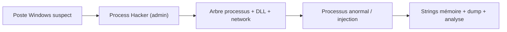
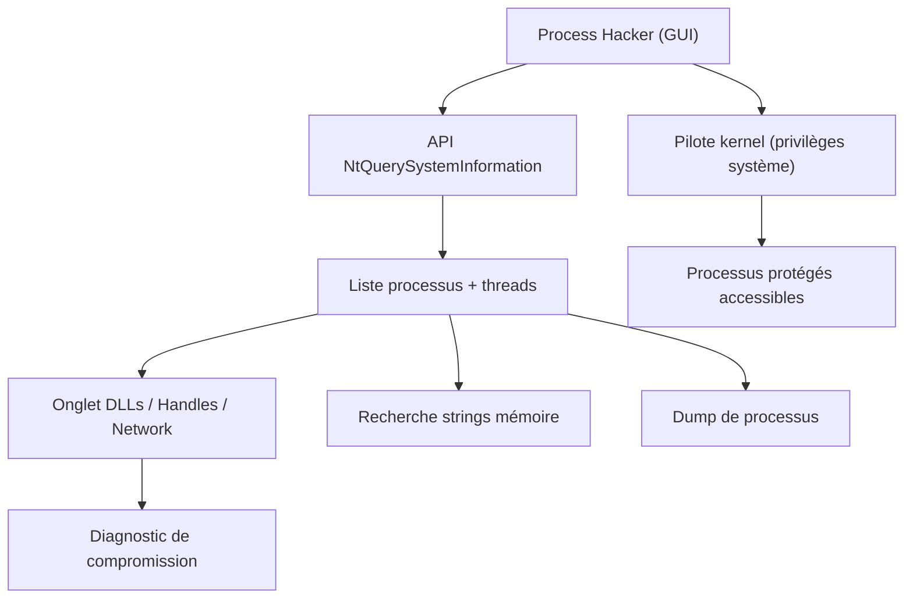

# 🧬 Process Hacker — Supervision avancée des processus Windows

> [!info] **En 1 phrase**
> Process Hacker est un gestionnaire de tâches open-source détaillé qui révèle processus, threads, handles, DLL chargées, connexions réseau et chaînes mémoire — l'outil de triage parfait sur un poste suspect.

---

## 🧾 Overview

| Champ | Valeur |
|---|---|
| Nom complet | Process Hacker |
| Description | Gestionnaire de processus avancé pour Windows : arbre des processus, services, threads, handles, DLL chargées, connexions réseau, recherche de chaînes en mémoire, dump de processus |
| Catégorie | 🧬 Malware & Sandbox |
| Sous-catégorie | Analyse dynamique — supervision de processus Windows |
| Fonction principale | Observer, inspecter et contrôler les processus d'un poste Windows (diagnostic de compromission) |
| Type d'outil | Application desktop Windows (portable) |
| Licence | GPL-3.0 (à vérifier sur le dépôt) |
| Open source / propriétaire | Open source |
| Langage(s) de programmation | C (outil), pilote kernel pour les privilèges système |
| Développeur / organisation | wen Jia (winj32), contributions de la communauté |
| Projet officiel | processhacker2/processhacker2 |
| Dépôt officiel | https://github.com/processhacker2/processhacker2 |
| Documentation officielle | https://processhacker.sourceforge.io/docs/ |
| Date de création | 2008 (première version) |
| État du projet | **peu actif** (dernière release 2.39 en 2018) — toujours fonctionnel |
| Dernière version connue | 2.39 (10 février 2018) |
| Systèmes compatibles | Windows (XP à Windows 11) ; préinstallé sur Flare VM |

> [!note] À vérifier
> Le projet n'a pas de release officielle récente (dernière : 2.39, février 2018) mais reste distribué via SourceForge et Chocolatey. La licence exacte se confirme sur le dépôt GitHub.

---

## 🎯 Concept

Process Hacker est un remplaçant avancé du gestionnaire de tâches de Windows : il affiche l'arbre complet des processus avec leurs services, threads, handles, DLL chargées et connexions réseau en temps réel. Son intérêt pour l'analyste malware : vérifier le chemin réel d'un processus, détecter des DLL injectées depuis des répertoires temporaires, voir les sockets sortantes (C2), chercher des chaînes ASCII/Unicode directement dans la mémoire d'un processus, suspendre/terminer un processus, ou inspecter les threads et leur stack.

Il se place dans l'analyse dynamique sur la VM d'analyse ou en incident response sur un poste compromis : il permet un premier diagnostic rapide avant d'utiliser des outils plus lourds (Procmon, Volatility, x64dbg). Il complète Sysinternals : là où Process Explorer observe, Process Hacker donne aussi des capacités de contrôle (terminer, suspender, éditer la mémoire) et une recherche de strings en mémoire intégrée. Sa pertinence dans un lab : visualiser en un coup d'œil l'arbre des processus, les DLL de chaque process et les connexions réseau, ce qui accélère le triage d'un échantillon malveillant.



---

## 🧠 Concepts fondamentaux

| Concept | Explication |
|---|---|
| Processus / Thread | Unité d'exécution ; Process Hacker montre les threads de chaque processus et leur stack |
| Handle | Référence à une ressource (fichier, clé de registre, socket) ; inspecter les handles révèle fichiers ouverts et ressources épinglées |
| DLL chargées | Modules dans l'espace d'un processus ; une DLL inhabituelle (AppData, Temp) est un signe d'injection |
| Injection de DLL | Chargement d'un module dans un processus distant ; visible dans l'onglet DLLs |
| Connexions réseau | Onglet Network : IP/port distant, état (established), protocole — le C2 s'y trouve souvent |
| Strings en mémoire | Recherche ASCII/Unicode dans la RAM du processus : URLs, domaines, commandes PowerShell que le binaire ne contient pas en clair |
| Dump de processus | Extraction de l'image mémoire du processus vivant pour analyse (Volatility, strings) |
| Privilèges système (`-s`) | Accès à tous les processus, y compris protégés, via le pilote kernel |
| Service Windows | Exécutables lancés par le SCM ; l'onglet Services permet de repérer la persistance |
| Processus protégé | Processus PPL/rootkités invisibles sans privilèges système ; d'où le besoin d'outils kernel en complément |

---

## 🛠️ Installation

Installation portable (archive zip) ou via l'installeur officiel :

```powershell
# Télécharger processhacker-2.39-bin.zip et décompresser
.\ProcessHacker.exe -s   # lancement avec privilèges système
```

Sur une VM d'analyse (Flare VM), il est souvent pré-installé.

> [!warning] ⚠️ Prérequis & problèmes potentiels
> - **Administrateur** : les privilèges système (`-s`) exigent un lancement en administrateur, sinon les processus protégés restent invisibles.
> - **Antivirus** : certains EDR signalent Process Hacker (capacités d'édition mémoire) — autoriser sur le poste d'analyse.
> - **Drivers** : le chargement du pilote kernel peut être bloqué par la protection de mémoire (HVCI) sur les systèmes récents.

---

## ⚙️ Configuration

Process Hacker est configurable via le menu `Options` et les colonnes du tableau des processus :

| Paramètre | Rôle | Valeur conseillée |
|---|---|---|
| `Options → Columns` | Colonnes affichées (CPU, RAM, I/O, path, user) | Ajouter `Path` et `Network` |
| `Options → Colors` | Colorisation des processus (system, suspended, new) | Couleurs par défaut |
| `Options → Trees` | Vue en arbre / liste | Vue arbre pour la généalogie |
| `Options → Verification` | Vérification de signature des exécutables | Activée (repérer les exécutables non signés) |
| `Options → Symbols` | Chargement des symboles PDB | Activé si symboles disponibles |
| Colonne `Path` | Chemin complet de l'exécutable | Toujours visible |

> [!note] À vérifier
> La localisation exacte des options varie selon la version (2.39) ; le menu contextuel des colonnes permet d'ajouter/retirer des colonnes en un clic.

---

## 🏗️ Architecture interne

- **UI** : interface native Windows (Win32), liste des processus rafraîchie en temps réel.
- **Pilote kernel** : fournit l'accès aux processus protégés et aux informations privilégiées (chargé avec `-s`).
- **API système** : lit les processus via l'API `NtQuerySystemInformation` et les outils natifs Windows (WMI pour les services).
- **Onglets par processus** : Threads, Modules (DLL), Handles, Network, Memory, Services, Logon — un panneau par aspect.
- **Fonctions d'action** : suspendre, terminer, ouvrir un dump, éditer la mémoire, copier les chemins.
- **Recherche de strings** : scan de la mémoire du processus en ASCII/Unicode, exportable en texte.



---

## ⌨️ Commandes

### Commandes principales

```powershell
ProcessHacker.exe -s                # démarre avec les privilèges système (kernel)
ProcessHacker.exe -silent           # démarre sans interface (tray)
ProcessHacker.exe -connect <hôte>   # connexion à une instance distante
```

| Option | Effet |
|---|---|
| `-s` | Démarre avec les privilèges système (accès à tous les processus) |
| `-silent` | Démarre sans fenêtre (tray) |
| `-connect <hôte>` | Connexion à une instance Process Hacker distante |
| Clic droit → Properties | Détail : DLL, threads, handles, network, mémoire |
| Properties → Memory → Strings | Recherche de chaînes ASCII/Unicode dans la mémoire du processus |
| Clic droit → Create dump file | Dump de l'image mémoire du processus vivant |

### Actions GUI fréquentes

| Action | Effet |
|---|---|
| Clic droit → Properties | Détail complet du processus |
| Onglet Network | Connexions TCP/UDP du processus (C2) |
| Onglet DLLs | Modules chargés et leurs chemins |
| Clic droit → Suspend | Mettre le processus en pause (analyse propre) |
| Clic droit → Terminate | Terminer le processus |
| Clic droit → Create dump file | Générer un dump pour Volatility |

---

## 🎚️ Options et flags

| Option | Description | Exemple | Niveau |
|---|---|---|---|
| `-s` | Privilèges système | `ProcessHacker.exe -s` | Basic |
| `-silent` | Démarrage sans UI (tray) | `ProcessHacker.exe -silent` | Intermediate |
| `-connect <hôte>` | Connexion distante | `ProcessHacker.exe -connect 10.10.20.15` | Advanced |
| `-e` | Éditeur (mode édition) | `ProcessHacker.exe -e` | Expert |
| Colonne `Path` | Chemin de l'exécutable | Clic droit sur l'en-tête | Basic |
| `Properties → Memory → Strings` | Recherche de strings en RAM | Onglet Memory | Intermediate |
| Onglet `Network` | Connexions du processus | Clic sur l'onglet | Basic |
| Onglet `Services` | Services du poste | Clic sur l'onglet | Intermediate |

> [!tip] Options les plus utiles au quotidien
> `-s` (accès complet), colonne `Path` (chemin réel), onglet `Network` (C2), `Strings` mémoire (indicateurs chargés à l'exécution), `Create dump file` (artefact mémoire).

---

## 🧪 Exemples pratiques

### Beginner

```powershell
# 1. Lancer avec privilèges système
.\ProcessHacker.exe -s
# 2. Repérer un processus suspect : forte charge CPU, chemin étrange
# 3. Vérifier le chemin réel : colonne Path (AppData, Temp)
```

### Intermediate

```powershell
# Inspecter les DLL chargées d'un processus
# Double-clic sur le processus -> onglet DLLs
# Chercher des modules dans C:\Users\*\AppData\*\*.dll
# Vérifier les connexions réseau
# Onglet Network : noter IP:port du C2 présumé
```

### Advanced

```powershell
# Dump d'un processus vivant pour analyse mémoire
# Clic droit -> Create dump file
python3 vol.py -f process.dmp windows.pslist
# Recherche de strings en mémoire
# Properties -> Memory -> Strings -> rechercher "http"
```

### Expert

```powershell
# Persistance : service pointant vers AppData
# Process Hacker -> onglet Services -> Path to executable
reg query "HKLM\SOFTWARE\Microsoft\Windows\CurrentVersion\Run"
reg query "HKCU\Software\Microsoft\Windows\CurrentVersion\Run"
```

---

## 🧪 Workflow complet (scénario pas à pas)

1. **Lancer en admin** — démarrer avec les privilèges système pour voir tous les processus.

   ```powershell
   .\ProcessHacker.exe -s
   ```

2. **Repérer les processus suspects** — forte charge CPU, chemin étrange (`C:\Users\...\AppData\Roaming\...`), nom de processus légitime mais chemin anormal.

3. **Inspecter les DLL chargées** — ouvrir Properties → DLLs et chercher des modules dans des répertoires temporaires (signe d'injection).

4. **Vérifier les connexions réseau** — onglet Network : IP/port distant, état, correspondance avec le C2 présumé.

   ```powershell
   # repérer l'IP:port du C2 dans l'onglet Network du processus
   ```

5. **Chercher des strings en mémoire** — Properties → Memory → Strings pour repérer URLs, domaines ou commandes PowerShell.

6. **Suspendre/terminer et dumper** — mettre le processus en pause, le terminer ou en prendre un dump avec procdump pour l'analyse mémoire.

---

## 🎬 Scénarios avancés

### Scénario 1 : Détection d'une injection de DLL

Comparer les DLL chargées d'un processus légitime (ex. `svchost.exe`) avec celles d'un processus suspect :

```powershell
# Process Hacker : double-clic sur le processus -> onglet DLLs
# chercher des chemins du type C:\Users\*\AppData\*\*.dll
```

### Scénario 2 : Identification du C2 par l'onglet réseau

Filtrer par port/IP et croiser avec l'historique réseau du poste :

```powershell
# onglet Network du processus : noter IP:port, puis le bloquer au firewall
New-NetFirewallRule -DisplayName "Block C2" -Direction Outbound -RemoteAddress 203.0.113.5 -Action Block
```

### Scénario 3 : Dump de processus vivant pour analyse mémoire

Suspension du processus puis extraction du dump vers Volatility :

```powershell
# Process Hacker : Clic droit -> Create dump file (dump complet du process)
# Puis analyser le dump obtenu avec volatility3
python3 vol.py -f process.dmp windows.pslist
```

### Scénario 4 : Chasse à la persistance (Run keys, services, scheduled tasks)

Repérer les points de persistance du malware via l'onglet Services et la comparaison d'images de référence :

```powershell
# Process Hacker -> onglet Services : chercher un service binaire depuis AppData
# Clic droit sur le service -> Properties -> Path to executable
# Croiser avec les Run keys du poste
reg query "HKLM\SOFTWARE\Microsoft\Windows\CurrentVersion\Run"
reg query "HKCU\Software\Microsoft\Windows\CurrentVersion\Run"
# Un service pointant vers C:\Users\*\AppData\Roaming\*.exe est un indicateur fort
```

### Scénario 5 : Comparaison avec une image de référence

```powershell
# Sur un poste sain identique : exporter la liste des processus
# Process Hacker -> View -> Customize columns -> exporter
# Comparer avec le poste suspect pour isoler les anomalies
```

---

## 🛡️ Cybersecurity use cases

| Phase | Utilisation |
|---|---|
| Analyse de malware (dynamique) | Triage des processus lors d'une détonation en VM |
| Incident Response | Diagnostic rapide sur un poste compromis |
| DFIR | Dump de processus et collecte d'artefacts mémoire |
| Chasse à la persistance | Services, Run keys, scheduled tasks suspects |
| CTI | Corrélation des connexions C2 observées |
| Enseignement | Visualisation de l'arbre des processus pour former les analystes |

---

## 🎯 MITRE ATT&CK

| Tactique | Technique / Sub-technique | ID | Raison | Détection | Mitigation |
|---|---|---|---|---|---|
| Discovery | Process Discovery | T1057 | Process Hacker énumère les processus du poste (usage légitime en IR) | EDR (process_creation), logs | Restreindre les outils d'admin, WDAC |
| Discovery | System Owner / User Discovery | T1033 | Identification des utilisateurs de sessions | Logs de connexion | Surveillance des sessions |
| Persistence | Create or Modify System Process : Windows Service | T1543.003 | Repérage des services créés par le malware | Sysmon EventID 1/7045 | Contrôles des services, GPO |
| Persistence | Boot or Logon Autostart Execution : Registry Run Keys | T1547.001 | Chasse aux Run keys | Sysmon EventID 12/13 | Surveillance du registre |
| Defense Evasion | Process Injection | T1055 | DLL injectées détectées dans l'onglet Modules | Sysmon EventID 8/10 | Restriction des APIs d'injection |
| Command & Control | Application Layer Protocol | T1071 | Connexions sortantes identifiées dans l'onglet Network | NDR/IPS | Filtrage sortant |

> [!note] Ne renseigner que si l'association est réellement pertinente.
> Process Hacker est un **outil d'observation/IR** : les techniques listées sont celles que l'analyste cherche à détecter, pas des techniques mises en œuvre par l'outil.

---

## 🛡️ Defensive Security

### Signes observables

| Indicateur | Détail |
|---|---|
| Processus enfant anormal (`wscript` → `powershell -enc`) | Bloquer via EDR et logs Sysmon (création de processus) |
| DLL non signée dans un processus système | Restreindre les DLL via AppLocker/WDAC |
| Connexion sortante vers une IP inconnue | Quarantaine du poste, blocage firewall, corrélation avec le threat intel |
| Processus protégé/rootkité invisible | Poursuivre avec des outils kernel (x64dbg, WinDbg, Volatility) |
| Chemin exécutable anormal (AppData, Temp) | Collecter le binaire, hasher, interroger VirusTotal/YARA |

### Règles de détection (Sigma / Suricata / Snort / YARA)

```yaml
# Sigma — Windows : création de processus PowerShell encodé depuis Office (exemple)
title: Suspicious PowerShell From Office
logsource:
    category: process_creation
    product: windows
detection:
    selection:
        ParentImage|endswith:
            - 'WINWORD.EXE'
            - 'EXCEL.EXE'
        CommandLine|contains:
            - '-enc'
            - 'EncodedCommand'
    condition: selection
level: high
```

```powershell
# PowerShell — détection d'une nouvelle connexion sortante vers IP inconnue (exemple)
Get-NetTCPConnection -State Established |
    Where-Object { $_.RemoteAddress -notin @("10.10.20.0/24") } |
    Select-Object LocalPort, RemoteAddress, RemotePort, OwningProcess
```

---

## 🤖 Automatisation

```powershell
# PowerShell — lister les processus dont le chemin pointe vers AppData
Get-Process | Where-Object {
    $_.Path -match "AppData|Temp"
} | Select-Object Id, ProcessName, Path | Format-Table -AutoSize
```

```powershell
# PowerShell — lister les services dont le binaire est dans un répertoire utilisateur
Get-CimInstance Win32_Service |
    Where-Object { $_.PathName -match "AppData|Temp" } |
    Select-Object Name, State, PathName | Format-Table -AutoSize
```

> [!note] À vérifier
> Process Hacker est un outil GUI ; les exemples PowerShell reproduisent ses fonctionnalités clés pour l'automatisation (la détection repose sur les API Windows, pas sur Process Hacker).

---

## 📤 Output et parsing

- **Copie des colonnes** : la liste des processus peut être copiée en texte (Ctrl+C) pour l'export vers un rapport.
- **Dump de processus** : fichier `.dmp` analysable par Volatility, strings, procdump.
- **Recherche de strings** : export du résultat en fichier texte.
- **Propriétés** : copier les chemins, commandes, handles pour enrichir le rapport d'incident.

```powershell
# Exporter la liste des processus en texte (après sélection)
# Process Hacker -> Édition -> Copy (ou Ctrl+C)
# Sauvegarder dans un fichier pour comparaison
Get-Process | Select-Object Id, ProcessName, Path | Export-Csv -Path processes.csv -NoTypeInformation
```

```python
# Python — lecture du dump de processus et recherche de strings
import re

with open("process.dmp", "rb") as f:
    data = f.read()

for m in re.finditer(rb"https?://[^\x00\x20]+", data):
    print("URL", m.group().decode("utf-8", "ignore"))
```

---

## 🔗 Intégrations

- [[Tools|🧰 Outils]] global
- [[Outil - Sysinternals Suite]] — complément : Process Explorer observe, Process Hacker contrôle
- [[Outil - Volatility]] — analyse des dumps de processus
- [[Outil - x64dbg]] — poursuite en débogage du processus suspendu
- [[Outil - dnSpy]] — analyse des processus/assemblys .NET observés
- [[Outil - Flare VM]] — distribution où Process Hacker est préinstallé
- [[Outil - YARA]] — signatures sur les binaires collectés
- [[09 - Reverse Engineering & Malware|🔬 Reverse Engineering & Malware]]

```text
Poste suspect → Process Hacker (triage) → dump + C2 + DLL → Volatility + YARA + MISP → IR
```

---

## 🔄 Alternatives

| Outil | Avantages | Inconvénients | Cas d'usage |
|---|---|---|---|
| Process Explorer (Sysinternals) | Signature vérifiée, arbre clair | Observation seule (pas de contrôle mémoire) | Tri standard |
| Process Monitor (Procmon) | Filtrage avancé fichiers/registre/réseau | Lourd, log volumineux | Analyse fine des opérations |
| Task Manager | Intégré Windows | Très limité | Diagnostic basique |
| System Informer | Fork actif de Process Hacker | Nom/maintenance communautaire | Alternative maintenue |
| Handle.exe / tcpview | Légers, ligne de commande | Ciblés (handles/réseau) | Extraction ciblée |

> **Quand utiliser Process Hacker plutôt que Process Explorer ?** Dès qu'il faut *contrôler* (suspendre, terminer, éditer la mémoire) ou chercher des strings en RAM : Process Explorer observe, Process Hacker agit.

---

## ⚡ Performance

- Interface légère : la liste des processus se rafraîchit sans charge notable.
- La recherche de strings dans la mémoire d'un gros processus peut prendre quelques secondes à minutes selon la RAM.
- Le dump d'un processus génère un fichier de la taille de l'empreinte mémoire du process.
- En VM d'analyse, coupler Process Hacker à un hyperviseur avec peu de RAM pour les invités ne pose pas de problème (outil léger).
- Les colonnes supplémentaires (I/O) augmentent légèrement le coût de rafraîchissement.

---

## 🛠️ Troubleshooting

### Common problems

#### Problème : certains processus invisibles

- **Cause** : lancé sans privilèges système ou processus protégés (PPL/rootkit).
- **Solution** : relancer avec `-s` en administrateur ; sinon passer à l'analyse mémoire (Volatility).
- **Vérification** : le pilote kernel se charge (`Options → About` indique les privilèges).

#### Problème : l'onglet Network est vide

- **Cause** : pas de privilèges système ou version de Windows restreignant l'accès.
- **Solution** : relancer avec `-s` ; vérifier que le pilote réseau est chargé.
- **Vérification** : `netstat -ano` en comparaison pour confirmer les connexions.

#### Problème : « Access denied » sur un processus

- **Cause** : droits insuffisants sur le processus cible (processus d'un autre utilisateur).
- **Solution** : lancer en administrateur avec `-s`.
- **Vérification** : l'onglet Modules/Handles s'ouvre correctement.

#### Problème : l'EDR bloque Process Hacker

- **Cause** : heuristiques sur les capacités d'édition mémoire/driver.
- **Solution** : autoriser l'outil sur le poste d'analyse isolé (VM).
- **Vérification** : relancer et vérifier que le pilote se charge.

#### Problème : le dump de processus échoue

- **Cause** : manque d'espace disque ou processus protégé.
- **Solution** : libérer de l'espace, utiliser `-s`, ou procdump en alternative.
- **Vérification** : la taille du fichier `.dmp` correspond à l'empreinte mémoire.

---

## 🔐 Sécurité de l'outil

- **Privilèges** : lancer avec `-s` uniquement sur le poste d'analyse ou de réponse à incident.
- **Artefacts** : les dumps de processus contiennent la mémoire complète (secrets, données) — les protéger.
- **Drivers** : le pilote kernel est signé ; le télécharger depuis les sources officielles et vérifier les hashes.
- **Origine** : SourceForge/Chocolatey officiels ; éviter les binaires tiers.
- **Échantillons** : ne jamais dumper/analyser un processus hors d'un environnement contrôlé sans précaution (détonation réelle).
- **Données collectées** : les strings mémoire peuvent contenir des credentials — les anonymiser dans les rapports.

---

## ⚠️ Limitations

- Projet peu actif (dernière release 2.39 en 2018) ; le fork **System Informer** prend le relais.
- Process Hacker reste un outil d'observation : il ne remplace pas un EDR pour la détection.
- Les rootkits peuvent cacher leurs processus même avec les privilèges système.
- Pas de journalisation historique : il faut l'outil en place au moment de la compromission.
- La recherche de strings en mémoire est manuelle (pas d'analyse automatisée).
- Sur les systèmes HVCI récents, le pilote kernel peut être bloqué.

---

## 📋 Cheatsheet

```powershell
# Lancer avec privilèges système
.\ProcessHacker.exe -s

# Lancer en arrière-plan (tray)
.\ProcessHacker.exe -silent

# Connexion à une instance distante
.\ProcessHacker.exe -connect 10.10.20.15

# Voir les DLL chargées
# Double-clic sur le processus -> onglet DLLs

# Voir les connexions réseau (C2)
# Onglet Network

# Rechercher des strings en mémoire
# Properties -> Memory -> Strings

# Suspendre un processus
# Clic droit -> Suspend

# Dump d'un processus vivant
# Clic droit -> Create dump file

# Analyser le dump avec Volatility
python3 vol.py -f process.dmp windows.pslist

# Vérifier les Run keys de persistance
reg query "HKLM\SOFTWARE\Microsoft\Windows\CurrentVersion\Run"
reg query "HKCU\Software\Microsoft\Windows\CurrentVersion\Run"
```

---

## ⚡ Quick reference

| | |
|---|---|
| **À quoi sert-il ?** | Supervision complète des processus Windows : arbre, DLL, handles, réseau, strings mémoire, dump |
| **Quand l'utiliser ?** | Triage sur poste suspect (IR) ou pendant une détonation en VM |
| **Commande principale** | `.\ProcessHacker.exe -s` |
| **Alternative principale** | Process Explorer (observation) · System Informer (fork actif) |
| **Concepts importants** | Privilèges système, injection de DLL, C2 réseau, strings mémoire, dump |
| **Liens associés** | [[Outil - Sysinternals Suite]] · [[Outil - Volatility]] · [[Outil - x64dbg]] |

---

## 🔍 Détection & Défense

| Signe | Défense |
|---|---|
| Processus enfant anormal (`wscript` → `powershell -enc`) | Bloquer via EDR et logs Sysmon (création de processus) |
| DLL non signée dans un processus système | Restreindre les DLL via AppLocker/WDAC |
| Connexion sortante vers une IP inconnue | Quarantaine du poste, blocage firewall, corrélation avec le threat intel |
| Processus protégé/rootkité invisible | Poursuivre avec des outils kernel (x64dbg, WinDbg, Volatility) |
| Chemin exécutable anormal (AppData, Temp) | Collecter le binaire, hasher, interroger VirusTotal/YARA |

---

## ⚠️ Tips & Pièges

> [!tip] 💡 **Tips**
> - Lancez toujours Process Hacker avec `-s` sur une machine d'analyse : sans privilèges système, les processus protégés restent invisibles.
> - L'onglet Network est votre accès direct au C2 : notez IP/port et User-Agent avant de terminer le processus.
> - La recherche de strings en mémoire remplace souvent `strings` sur le binaire : beaucoup de malwares ne chargent leurs chaînes qu'à l'exécution.
> - Gardez la colonne `Path` visible : un nom légitime avec un chemin AppData est un indicateur fort.

> [!warning] ⚠️ **Pièges**
> - Process Hacker reste un outil d'observation : il ne remplace pas un antivirus/EDR pour la détection.
> - Certains rootkits protègent leurs processus : s'ils n'apparaissent pas dans la liste, passez à une analyse mémoire (Volatility) ou kernel.
> - Ne terminez pas un processus avant d'avoir noté ses artefacts (chemin, C2, DLL) : c'est la preuve de l'intrusion.
> - Le projet est peu actif : préférez le fork System Informer pour un support continu.

---

## 📚 References

### Official

- Site officiel : https://processhacker.sourceforge.io/
- Documentation : https://processhacker.sourceforge.io/docs/
- Dépôt GitHub : https://github.com/processhacker2/processhacker2
- Téléchargement (SourceForge) : https://sourceforge.net/projects/processhacker/

### Security references

- MITRE ATT&CK T1057 — Process Discovery : https://attack.mitre.org/techniques/T1057/
- MITRE ATT&CK T1547.001 — Registry Run Keys : https://attack.mitre.org/techniques/T1547/001/
- MITRE ATT&CK T1055 — Process Injection : https://attack.mitre.org/techniques/T1055/

### Community

- System Informer (fork actif) : https://github.com/winsiderss/systeminformer
- Flare VM (outils préinstallés) : https://github.com/mandiant/flare-vm

---

➡️ **Liens :** [[Tools|🧰 Outils]] · [[Outils/Outil - Sysinternals Suite|🧬 Sysinternals Suite]] · [[Outils/Outil - Volatility|🔎 Volatility]] · [[Outils/Outil - x64dbg|🧬 x64dbg]] · [[Outils/Outil - dnSpy|🧬 dnSpy]] · [[Techniques/09 - Reverse Engineering & Malware|🔬 Reverse Engineering & Malware]]
