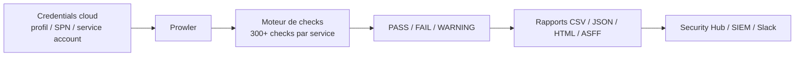
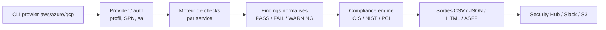

# 🦅 Prowler — Le scanner de conformité cloud (CIS)

> [!info] **En 1 phrase**
> Outil de sécurité cloud qui audite AWS, Azure et GCP contre les benchmarks CIS, NIST, PCI-DSS et plus de 300 checks de sécurité.

---

## 🧾 Overview

| Champ | Valeur |
|---|---|
| Nom complet | Prowler |
| Description | Scanner de conformité et de posture de sécurité multi-cloud (AWS, Azure, GCP) : applique des centaines de checks basés sur les benchmarks CIS, NIST 800-53, PCI-DSS, ISO 27001, HIPAA, ENS et produit des rapports exploitables |
| Catégorie | ☁️ Cloud & Containers |
| Sous-catégorie | Audit de configuration / Conformité / Security Posture Management |
| Type d'outil | CLI (scanner de configuration passif) |
| Licence | Apache License 2.0 |
| Open source / propriétaire | Open source |
| Langage(s) de programmation | Python 3 (boto3, azure-* SDK, google-cloud SDK, rich) |
| Développeur / organisation | Prowler Cloud (à l'origine Toni de la Fuente, 2019) |
| Projet officiel | https://github.com/prowler-cloud/prowler |
| Dépôt officiel | https://github.com/prowler-cloud/prowler |
| Documentation officielle | https://docs.prowler.com |
| Date de création | 2019 |
| État du projet | actif |
| Dernière version connue | v5.17.0 (janvier 2026) |
| Systèmes compatibles | Linux, macOS, Windows, Docker |

> [!note] Pour vérifier / compléter
> Version vérifiée sur https://github.com/prowler-cloud/prowler/releases (v5.17.0, janvier 2026). Le projet est très actif : vérifier la dernière release avant un engagement. La syntaxe v5 (checks, options `--checks`, `--services`, sorties `-M`) diffère nettement de la v4.

---

## 🎯 Concept

Prowler est un outil de ligne de commande Python qui vérifie la posture de sécurité d'un cloud public en appliquant des centaines de checks : **CIS Benchmarks, NIST 800-53, PCI-DSS, ISO 27001, HIPAA, ENS, SOC 2** et des checks personnalisés. Chaque check interroge les API du fournisseur (boto3 pour AWS, SDK Azure et GCP) et rend un verdict **PASS / FAIL / WARNING** avec des preuves (ressource concernée, région, message). Prowler produit des rapports exploitables : **CSV, JSON, HTML, XLSX, SARIF et ASFF** (pour AWS Security Hub), avec des intégrations Slack, MS Teams, email ou stockage S3.

En pentest ou en audit, c'est l'outil de référence pour répondre à « est-ce que la configuration respecte le benchmark CIS ? ». Il se distingue de ScoutSuite par son **ancrage benchmarks officiels** (compliance mapping détaillé check → exigence) et sa capacité d'**intégration pipeline** (CI/CD, Security Hub, SIEM). Il se positionne en **début de phase cloud** : scanner passif en lecture seule, contrairement à Pacu (post-exploitation actif) — il cartographie la conformité avant de chercher les chemins d'escalade.

Sa force : la **maintenance active** (mises à jour fréquentes, nouvelle architecture v5 modulaire), la **couverture multi-cloud** et la **traçabilité de conformité** (chaque FAIL est associé à une exigence de benchmark). Sa limite : comme tout scanner de configuration, il **constate** mais ne **prouve pas l'exploitabilité**.



---

## 🧠 Concepts fondamentaux

| Concept | Explication |
|---|---|
| Check | Règle de sécurité élémentaire (ex : `s3_bucket_public_access_block`). Chaque check cible un service, une région et rend un verdict PASS/FAIL/WARNING avec preuves |
| Compliance framework | Ensemble d'exigences normatives (CIS 2.0, NIST 800-53, PCI-DSS 4.0, ISO 27001, HIPAA, ENS) mappées sur les checks via l'option `--compliance <framework>` |
| Service / Group | Les checks sont organisés par service cloud (iam, s3, ec2, cloudtrail, kms…) ; `--services s3,iam` restreint le périmètre |
| Verdict | PASS (conforme), FAIL (écart), WARNING (check non applicable ou données insuffisantes) ; `-z` ne garde que les FAIL |
| Gravité | Niveau de risque (critical/high/medium/low/informational) associé à chaque check, filtrable avec `--severity` |
| Rapport ASFF | Format AWS Security Findings Format pour l'ingestion dans **AWS Security Hub** (`-M asff --security-hub`) |
| Profil / credentials | AWS via profil ou variables d'environnement, Azure via SPN (`--sp-env-auth`), GCP via service account (`--project-id`) |

---

## 🛠️ Installation

Prowler s'installe via `pip`, un package distribuable, ou Docker. Python 3.9+ est requis pour la v5.

### Debian / Ubuntu / Kali Linux

```bash
sudo apt update && sudo apt install -y python3 python3-pip python3-venv git
python3 -m venv ~/prowler-venv && source ~/prowler-venv/bin/activate
pip install -U pip
pip install prowler
prowler --version
```

### macOS

```bash
brew install python git
python3 -m venv ~/prowler-venv && source ~/prowler-venv/bin/activate
pip install -U prowler
```

### Windows

```powershell
# PowerShell — Python 3.9+ depuis python.org
py -3.9 -m venv $env:USERPROFILE\prowler-venv
$env:USERPROFILE\prowler-venv\Scripts\Activate.ps1
pip install -U prowler
```

### Docker

```bash
docker pull ghcr.io/prowler-cloud/prowler:latest
# Scan AWS en montant les credentials (attention à la fuite)
docker run --rm -t -v ~/.aws:/root/.aws:ro \
  ghcr.io/prowler-cloud/prowler:latest aws --profile audit -M html
```

> [!warning] ⚠️ Prérequis & problèmes potentiels
> - Python 3.9+ requis pour la v5 ; sous Kali/Debian ancien, installer une version récente de Python avant le venv.
> - L'authentification Azure passe par un **Service Principal** (`--sp-env-auth` avec `AZURE_CLIENT_ID`, `AZURE_TENANT_ID`, `AZURE_CLIENT_SECRET`) ou `--az-cli-auth`.
> - Pour GCP, fournir la clé de service account via la variable `GOOGLE_APPLICATION_CREDENTIALS` ou le fichier JSON et `--project-id`.
> - `pip install prowler` installe de nombreuses dépendances (azure, google-cloud) : prévoir un venv dédié.

---

## ⚙️ Configuration

Prowler se configure par **ligne de commande** (options), par **variables d'environnement** pour les credentials, et par **fichier de config YAML** (`--config`) pour les réglages récurrents.

| Paramètre | Rôle | Valeur possible | Impact | Exemple |
|---|---|---|---|---|
| `--profile <nom>` | Profil AWS à utiliser | nom de profil | Authentifie le scan AWS | `--profile audit` |
| `AWS_ACCESS_KEY_ID` / `AWS_SECRET_ACCESS_KEY` | Clés AWS en variables d'env | AKIA… | Alternative au profil | `AWS_ACCESS_KEY_ID=AKIA1111222233334444` |
| `--sp-env-auth` | Auth Azure via Service Principal (env) | drapeau | Authentifie le scan Azure | `--sp-env-auth` |
| `GOOGLE_APPLICATION_CREDENTIALS` | Clé de service account GCP | chemin JSON | Authentifie le scan GCP | `GOOGLE_APPLICATION_CREDENTIALS=./sa.json` |
| `--project-id <id>` | Projet GCP cible | id projet | Périmètre GCP | `--project-id example-project` |
| `--services s3,iam` | Services audités | liste de services | Restreint le périmètre | `--services s3,iam,cloudtrail` |
| `--checks <id>` | Checks précis (virgule ou wildcard) | liste d'IDs | Exécute uniquement certains checks | `--checks s3_bucket_public_access_block` |
| `--region <r>` | Régions AWS ciblées | liste de régions | Limite la portée géographique | `--region eu-west-3 us-east-1` |
| `--compliance <fw>` | Framework de conformité | `cis_2.0_aws`, `nist_800_53`… | Filtre les checks du référentiel | `--compliance cis_2.0_aws` |
| `--severity <niv>` | Filtre par gravité | critical,high,medium,low | Réduit le bruit | `--severity high,critical` |
| `-M <modes>` | Formats de rapport | csv,json,html,asff,xlsx,sarif | Génère les sorties | `-M csv json html` |
| `--config <fichier>` | Fichier de config YAML | chemin | Réutilise des réglages | `--config prowler.yml` |
| `--output-file <nom>` | Nom de base des rapports | chemin sans extension | Centralise les sorties | `--output-file ./rapports/audit-2026` |

---

## 🏗️ Architecture interne

Le dépôt `prowler-cloud/prowler` est un package Python modulaire structuré ainsi :

- **`prowler/providers/`** : sous-packages par fournisseur (`aws`, `azure`, `gcp`). Chacun définit le modèle de données du provider (compte, région, ressources), l'authentification (profils, STS, SPN, service accounts) et les sessions SDK (boto3, Azure SDK, google-cloud).
- **Bibliothèque de checks** : chaque check est une classe Python héritant d'un modèle commun, dans `prowler/providers/<provider>/services/<service>/checks/<service>_<nom>/`. Une classe check définit les arguments (régions, ressources), exécute l'appel API et émet des **findings** typés (PASS/FAIL/WARNING, gravité, ressource, message, métadonnées de conformité).
- **Moteur d'exécution** : orchestre les checks (parallélisation, pagination, gestion des régions), collecte les résultats en mémoire sous forme de findings normalisés.
- **Compliance engine** : mappe chaque check vers les exigences des frameworks (`--compliance`) : un finding porte alors la référence de la règle CIS/NIST/PCI correspondante.
- **Modules de sortie** : sérialisent les findings en CSV, JSON, HTML (dashboard riche avec filtres et graphes), XLSX, SARIF et ASFF (`--security-hub`), et gèrent les notifications (Slack, Teams, email).



---

## ⌨️ Commandes

### Commandes principales

La syntaxe générale est `prowler <provider> [options]` où `<provider>` vaut `aws`, `azure` ou `gcp`.

| Commande | Objectif | Résultat attendu |
|---|---|---|
| `prowler aws --profile audit` | Scan AWS complet (toutes régions) | Rapport CSV par défaut dans le dossier de sortie |
| `prowler aws --profile audit --services s3` | Scan limité à un service | Checks S3 uniquement |
| `prowler aws --profile audit --checks s3_bucket_public_access_block` | Exécute un check précis | Verdict du check seul |
| `prowler azure --sp-env-auth` | Scan Azure via Service Principal | Rapport Azure |
| `prowler gcp --project-id example-project` | Scan GCP d'un projet | Rapport GCP |
| `prowler --list-checks` | Liste tous les checks disponibles | Inventaire des checks |

### Commandes avancées

```bash
# Scan conforme CIS avec sorties multiples
prowler aws --profile audit --compliance cis_2.0_aws -M csv json html \
  --output-file ./rapports/audit-cis

# Ne garder que les échecs critiques/high en CSV
prowler aws --profile audit --severity critical,high -z \
  -M csv --output-file ./rapports/fails-critiques

# Envoyer les findings vers AWS Security Hub au format ASFF
prowler aws --profile audit -M asff --security-hub \
  --output-file ./rapports/asff.json
```

---

## 🎚️ Options et flags

| Option | Description | Exemple | Niveau |
|---|---|---|---|
| `--profile <nom>` | Profil AWS à utiliser | `prowler aws --profile audit` | Basic |
| `--services s3,iam` | Restreint l'audit à des services | `--services s3,iam` | Basic |
| `-M csv,json,html` | Formats de rapport | `-M csv json html` | Basic |
| `-z` | Affiche uniquement les FAIL (code de sortie ≠ 0 si FAIL) | `-z` | Basic |
| `--output-file <nom>` | Nom de base des rapports | `--output-file ./rapports/audit` | Basic |
| `--checks <id>` | Checks précis | `--checks s3_bucket_public_access_block` | Intermediate |
| `--region <r>` | Régions AWS ciblées | `--region eu-west-3 us-east-1` | Intermediate |
| `--severity <niv>` | Filtre par gravité | `--severity high,critical` | Intermediate |
| `--excluded-checks <id>` | Exclut des checks | `--excluded-checks s3_*` | Intermediate |
| `--compliance <fw>` | Framework de conformité | `--compliance nist_800_53` | Advanced |
| `--security-hub` | Pousse les findings vers Security Hub (ASFF) | `-M asff --security-hub` | Advanced |
| `--config <fichier>` | Fichier de config YAML | `--config prowler.yml` | Advanced |
| `--category <cat>` | Checks d'une catégorie | `--category forensics-ready` | Advanced |
| `--list-checks` | Liste les checks disponibles | `--list-checks \| grep s3` | Expert |

> [!tip] Options les plus utiles au quotidien
> `--services` (réduire le temps), `--checks` (cibler un check), `-z` (ne garder que les FAIL, pratique en CI/CD), `--compliance` (s'aligner sur un benchmark), `-M csv json html` (rapports multi-formats en une passe).

---

## 🧪 Exemples pratiques

### Beginner

```bash
# 1. Installer dans un venv
python3 -m venv ~/prowler-venv && source ~/prowler-venv/bin/activate
pip install -U prowler

# 2. Créer un profil AWS en lecture seule
aws configure --profile audit
#    AWS Access Key ID : AKIA1111222233334444
#    AWS Secret Access Key : wJalrXUtnFEMIK7mdENG+bKxLAFbfG4xj2E4dqe4Q

# 3. Lancer un premier audit sur S3 uniquement
prowler aws --profile audit --services s3 -M html --output-file ./s3-audit
```

Résultat attendu : dossier de sortie avec `s3-audit.html` ; ouvrir le rapport dans le navigateur. Erreur fréquente : `botocore.exceptions.NoCredentialsError` si le profil est absent ou les clés invalides.

### Intermediate

```bash
# Audit complet en ne gardant que les FAIL, sorties CSV + HTML
prowler aws --profile audit -z -M csv html --output-file ./rapports/full

# Cibler un check précis
prowler aws --profile audit --checks s3_bucket_public_access_block \
  -M csv --output-file ./rapports/s3-block

# Audit d'une région uniquement pour accélérer
prowler aws --profile audit --region eu-west-3 -M csv --output-file ./rapports/eu
```

### Advanced

```bash
# Scan conforme CIS 2.0 AWS avec sorties multiples
prowler aws --profile audit --compliance cis_2.0_aws \
  -M csv json html --output-file ./rapports/cis

# Findings critiques uniquement, en JSON pour le SIEM
prowler aws --profile audit --severity critical,high \
  -M json --output-file ./rapports/critiques
```

### Expert

```bash
# Ingestion Security Hub (ASFF) + notification Slack
prowler aws --profile audit -M asff --security-hub \
  --output-file ./rapports/asff

# Multi-cloud en pipeline (exemple GCP)
GOOGLE_APPLICATION_CREDENTIALS=./sa.json \
  prowler gcp --project-id example-project \
  -M csv html --output-file ./rapports/gcp
```

---

## 🧪 Workflow complet (scénario pas à pas)

1. **Configurer un accès de lecture** — rôle `SecurityAudit`/`ReadOnlyAccess` assumable, ou profil AWS dédié.
   ```bash
   aws configure --profile audit
   ```
2. **Lancer l'audit conforme** — choisir le benchmark (CIS par défaut) et générer les sorties utiles.
   ```bash
   prowler aws --profile audit -M csv html json \
     --output-file ./rapports/audit-2026
   ```
3. **Analyser les FAIL par gravité** — le rapport HTML filtre par service, gravité et catégorie ; en CLI, `-z` ne garde que les échecs.
   ```bash
   prowler aws --profile audit -z --severity high,critical \
     -M csv --output-file ./rapports/fails
   ```
4. **Corréler puis remédier** — pour chaque FAIL exploitable (bucket public, policy trop large, MFA absent), valider l'impact réel avec l'AWS CLI ou Pacu ; après correction, relancer Prowler pour comparer les scores PASS/FAIL avant/après (preuves de remédiation).

---

## 🎬 Scénarios avancés

### Scénario 1 : Audit centralisé via AWS Security Hub

```bash
# Envoyer les résultats au format ASFF vers Security Hub
prowler aws --profile audit -M asff --security-hub \
  --output-file ./rapports/asff.json

# Archiver le rapport sur un bucket dédié (bucket fictif)
aws s3 cp ./rapports/ s3://example-bucket/rapports/ --recursive
```

Utile pour centraliser les résultats avec les autres sources de détection de l'équipe défense (GuardDuty, Config) et générer des tickets depuis les findings Security Hub.

### Scénario 2 : Scan multi-cloud depuis un même poste

```bash
# AWS + Azure + GCP dans un pipeline
prowler aws --profile audit -M csv --output-file ./rapports/aws
prowler azure --sp-env-auth -M csv --output-file ./rapports/azure
prowler gcp --project-id example-project -M csv --output-file ./rapports/gcp
```

Prowler agrège les rapports d'un même dossier en un dashboard multi-cloud — utile pour la synthèse client et les audits combinés AWS/Azure/GCP.

---

## 🛡️ Cybersecurity use cases

| Phase | Utilisation |
|---|---|
| Reconnaissance | Cartographie de la posture cloud (services, régions, conformité) en lecture seule |
| Énumération | Détection des configurations risquées via les checks (IAM, S3, EC2, CloudTrail) |
| Vulnérabilité | Identification des écarts de benchmark (MFA absent, buckets publics, encryption désactivée) |
| Exploitation | Non concerné (scanner passif) ; les findings guident les modules de Pacu |
| Reporting | Rapports HTML/CSV/JSON livrables, intégration Security Hub/SIEM |
| Audit de conformité | Mapping CIS/NIST/PCI/ISO par check avec référence d'exigence |

---

## 🎯 MITRE ATT&CK

| Tactique | Technique / Sub-technique | ID | Raison | Détection | Mitigation |
|---|---|---|---|---|---|
| Initial Access / Persistence | Valid Accounts : Cloud Accounts | T1078.004 | Prowler s'exécute avec des credentials cloud valides en lecture | CloudTrail, Azure Activity Log, GCP Cloud Audit Logs, alertes IP source | MFA, SCP restrictifs, moindre privilège |
| Discovery | Cloud Service Discovery | T1526 | Les checks énumèrent les services et ressources via les API | Rafales d'événements `List*`/`Describe*` | Restreindre les lectures, seuils d'alerting |
| Discovery | Permission Groups Discovery : Cloud Groups | T1069.003 | Checks IAM/RBAC qui collectent rôles, groupes et policies | Événements `ListRoles`/`GetPolicy`, lectures RBAC | Moindre privilège, revue des policies |
| Discovery | Account Discovery : Cloud Account | T1087.004 | Énumération des comptes, utilisateurs et projets | `ListUsers`/`GetGroup*` répétés | Limiter l'énumération, SCP |
| Discovery | Cloud Storage Object Discovery | T1619 | Checks S3 qui listent buckets et objets | CloudTrail S3 data events | Verrouiller ACL/policies, chiffrement |
| Discovery | System Information Discovery | T1082 | Collecte de la configuration des instances/VMs (AMI, security groups) | `DescribeInstances`/`DescribeSecurityGroups` | Limiter les lectures, alerting |

> [!note] Ne renseigner que si l'association est réellement pertinente.
> Prowler est un outil passif de lecture : les techniques correspondent aux opérations de découverte qu'un attaquant reproduit avec un accès légitime, et que Prowler rend méthodiques.

---

## 🛡️ Defensive Security

### Signes observables

| Indicateur | Détail |
|---|---|
| Rafales d'événements de lecture (`List*`, `Describe*`, `Get*`) sur tout le compte | Signature d'un scan Prowler/ScoutSuite dans CloudTrail, Azure Activity Log, GCP Cloud Audit Logs |
| Exécutions récurrentes (jobs nightly) depuis une même IP | Les audits planifiés créent un profil d'appels prévisible ; un pic hors planning signale une main non autorisée |
| Lectures sur services sensibles (KMS, SecretsManager) | Checks de chiffrement : à réserver aux rôles d'audit dédiés |
| Accès élargi via `ReadOnlyAccess`/`SecurityAudit` | Surveiller les principaux qui assument ces rôles hors maintenance |
| Rapports de conformité (FAIL) exfiltrés | Le rapport contient l'état complet de la posture : le traiter comme confidentiel |

### Règles de détection (Sigma / Suricata / Snort / YARA)

```yaml
# Sigma — AWS : pic de lectures API multi-services typique d'un scan Prowler
title: AWS Posture Scan - High Volume Read API Calls
id: 0b0b2f90-0000-4a9a-8c5f-000000000021
status: experimental
logsource:
    product: aws
    service: cloudtrail
detection:
    selection:
        eventSource:
            - 'iam.amazonaws.com'
            - 's3.amazonaws.com'
            - 'ec2.amazonaws.com'
            - 'cloudtrail.amazonaws.com'
            - 'kms.amazonaws.com'
        eventName:
            - 'Get*'
            - 'List*'
            - 'Describe*'
    timeframe: 30m
    condition: selection | count() by userIdentity.arn > 500
falsepositives:
    - Audits de conformité planifiés (Prowler autorisé)
level: medium
```

> [!note] À vérifier
> Exemple pédagogique : adapter les seuils et plages de temps à votre environnement ; l'identifiant Sigma est fictif et à régénérer si publié. Calibrer avec le volume d'un audit légitime (calendrier) pour limiter les faux positifs.

---

## 🤖 Automatisation

```bash
# Bash — audit planifié et archivage des rapports (bucket fictif)
LOGDIR="./rapports/$(date +%Y-%m-%d)"
mkdir -p "$LOGDIR"
prowler aws --profile audit -M csv json html --output-file "$LOGDIR/audit" -z
aws s3 cp "$LOGDIR/" s3://example-bucket/rapports/ --recursive
# Code de sortie ≠ 0 si des FAIL existent : exploitable en CI/CD
echo "Exit code: $?"
```

---

## 📤 Output et parsing

Prowler produit les rapports dans le dossier courant ou `--output-dir` : `csv`, `json`, `html`, `xlsx`, `sarif`, `asff`. Le JSON est la forme la plus exploitable pour du traitement automatisé.

```bash
# Nombre de FAIL par gravité
jq '[.[] | select(.status == "FAIL")] | group_by(.severity) |
    map({severity: .[0].severity, count: length})' ./rapports/audit.json

# Ressources impactées par des buckets publics
jq '.[] | select(.check_id == "s3_bucket_public_access" or
                 .check_id == "s3_bucket_public_write_acl") |
    {check_id, resource_id, status}' ./rapports/audit.json
```

> [!note] À vérifier
> La structure exacte du JSON dépend de la version v5 ; inspecter avec `jq '.[0]' ./rapports/audit.json` avant d'écrire un parseur définitif.

---

## 🔗 Intégrations

- [[Tools|🧰 Outils]] global
- [[Outil - ScoutSuite|ScoutSuite]] — audit multi-cloud complémentaire (moins précis côté conformité)
- [[Outil - Pacu|Pacu]] — exploitation des failles détectées par Prowler
- [[Outil - cloudfox|cloudfox]] — cartographie des chemins de confiance IAM après le constat de posture
- AWS Security Hub — ingestion ASFF (`-M asff --security-hub`)
- Slack / MS Teams / email — notifications de résultats (`-M slacks`, config YAML)
- AWS CLI / `az` / `gcloud` — validation et correction des findings
- CI/CD — intégration pipeline (GitHub Actions, GitLab CI) avec `-z`

```text
Credentials lecture → Prowler (checks CIS) → CSV/JSON/ASFF → Security Hub / SIEM / Pacu
```

---

## 🔄 Alternatives

| Outil | Avantages | Inconvénients | Cas d'usage |
|---|---|---|---|
| ScoutSuite | Multi-cloud, rapport HTML simple | Non maintenu depuis 2022 | Audit visuel rapide |
| AWS Security Hub / Config | Natif AWS, règles automatiques | AWS uniquement, coût | Supervision continue AWS |
| Azure Policy / Defender | Natif Azure, intégré au portail | Azure uniquement, coût | Supervision continue Azure |
| GCP Security Command Center | Natif GCP, intégré | GCP uniquement, coût | Supervision continue GCP |
| Pacu | Modules offensifs AWS | Pas de benchmark conformité | Exploitation post-audit |

> **Quand utiliser ScoutSuite plutôt que Prowler ?** Quand le livrable attendu est un rapport HTML visuel simple et multi-cloud sans exigence de mapping benchmark : ScoutSuite est plus rapide à mettre en œuvre, mais ses règles datent de 2022. Dès qu'un référentiel CIS/NIST/PCI doit être cité, Prowler s'impose.

---

## ⚡ Performance

- **Latence API** : chaque check émet des appels de lecture ; le temps total dépend du nombre de services, de régions et de ressources (un scan AWS multi-région complet prend de quelques minutes à plusieurs dizaines).
- **Parallélisme** : le moteur v5 parallélise les checks par région ; les grosses ressources (multiples comptes, organizations) allongent le scan.
- **Périmètre réduit** : `--services` et `--region` sont les leviers principaux ; `--checks` isole un test unique en quelques secondes.
- **Sorties** : générer plusieurs formats avec `-M` est plus efficace que relancer le scan ; le HTML est lourd sur de gros comptes (milliers de findings).
- **CI/CD** : `-z` permet d'arrêter le pipeline à la première présence de FAIL — idéal en gate de sécurité, coût quasi nul pour un scan ciblé.

---

## 🛠️ Troubleshooting

### Common problems

#### Problème : « NoCredentialsError » / aucune donnée sur AWS

- **Cause** : profil AWS inexistant, clés invalides ou expirées, ou pas de variables d'environnement définies.
- **Solution** : valider avec `aws sts get-caller-identity --profile audit`, corriger le profil ou définir `AWS_ACCESS_KEY_ID`/`AWS_SECRET_ACCESS_KEY`.
- **Vérification** : `prowler aws --profile audit --services iam --checks iam_root_mfa_enabled` retourne un verdict.

#### Problème : erreurs Azure « Subscription not found » ou « Authentication failed »

- **Cause** : Service Principal sans rôle lecteur sur les abonnements, ou variables `AZURE_CLIENT_ID`/`AZURE_TENANT_ID`/`AZURE_CLIENT_SECRET` mal renseignées.
- **Solution** : accorder le rôle `Reader` sur les abonnements, vérifier les variables ; utiliser `--az-cli-auth` si `az login` est déjà effectué.
- **Vérification** : `az account list --output table` liste les abonnements accessibles, puis relancer `prowler azure --sp-env-auth`.

#### Problème : les rapports sont absents ou dans le mauvais dossier

- **Cause** : `--output-dir` ou `--output-file` mal interprété, ou sortie non demandée (`-M`).
- **Solution** : préciser `-M csv` (au minimum) et un `--output-file` unique ; consulter le dossier avec `tree`/`dir`.
- **Vérification** : le fichier `audit.csv` apparaît dans le dossier attendu.

#### Problème : v5 vs v4 — options inconnues

- **Cause** : la syntaxe v4 (`-c`, `-s`, `-r` avec valeurs différentes) n'est plus valide en v5.
- **Solution** : consulter `prowler --help` ; utiliser `--checks`, `--services`, `--region` pour la v5.
- **Vérification** : `prowler --version` affiche 5.x et `prowler --help` liste les options modernes.

---

## 🔐 Sécurité de l'outil

- **Accès en lecture seule** : Prowler n'exécute aucune action d'écriture ; utiliser des credentials **en lecture** dédiés à l'audit (jamais un compte humain à privilèges larges).
- **Rapports sensibles** : CSV/JSON/HTML contiennent la posture complète (ressources, policies, régions, findings) → traiter comme confidentiel, stockage chiffré, jamais committé.
- **Security Hub** : `--security-hub` envoie les findings vers le compte AWS : vérifier le quota et le périmètre avant l'envoi en production.
- **Credentials en pipeline** : monter `~/.aws` en lecture seule dans Docker (`-v ~/.aws:/root/.aws:ro`), préférer des sessions STS de courte durée ou des secrets CI/CD.
- **Fichiers de config** : `prowler.yml` ne doit pas contenir de secrets ; y conserver uniquement les options de scan.
- **Mise à jour** : le projet évolue vite (correctifs, nouveaux checks) ; `pip install -U prowler` avant chaque engagement pour bénéficier des checks récents.

---

## ⚠️ Limitations

- **Pas de test d'exploitabilité** : un FAIL indique un écart de configuration, pas une preuve de compromission.
- **Permissions limitées = résultats trompeurs** : sans les droits de lecture sur un service, les checks sortent en WARNING ou FAIL à tort — vérifier le rôle utilisé.
- **Multi-régions lent** : un scan AWS complet multi-régions est long ; cibler les régions pertinentes.
- **Multi-cloud moins profond sur Azure/GCP** : la bibliothèque de checks y est moins fournie que sur AWS.
- **Version v5 jeune** : la migration v4→v5 a modifié la syntaxe et certains IDs de checks ; les anciennes documentations peuvent induire en erreur.

---

## 📋 Cheatsheet

```bash
# Installation
python3 -m venv ~/prowler-venv && source ~/prowler-venv/bin/activate
pip install -U prowler

# Scan AWS de base (CSV)
prowler aws --profile audit

# Scan ciblé S3, HTML
prowler aws --profile audit --services s3 -M html --output-file ./rapports/s3

# Ne garder que les FAIL critiques, CSV + JSON
prowler aws --profile audit -z --severity high,critical \
  -M csv json --output-file ./rapports/fails

# Scan conforme CIS 2.0 AWS
prowler aws --profile audit --compliance cis_2.0_aws -M html

# Azure via Service Principal
prowler azure --sp-env-auth -M html

# GCP via service account
GOOGLE_APPLICATION_CREDENTIALS=./sa.json \
  prowler gcp --project-id example-project -M html

# Envoi Security Hub
prowler aws --profile audit -M asff --security-hub
```

---

## ⚡ Quick reference

| | |
|---|---|
| **À quoi sert-il ?** | Audit de conformité et de posture multi-cloud (AWS/Azure/GCP) basé sur les benchmarks CIS, NIST, PCI-DSS |
| **Quand l'utiliser ?** | En début d'engagement cloud pour cartographier la conformité ; en reporting client ; en CI/CD comme gate de sécurité |
| **Commande principale** | `prowler aws --profile audit -M csv html json --output-file ./audit` |
| **Alternative principale** | ScoutSuite (multi-cloud, visuel) ; Security Hub (natif AWS) |
| **Concepts importants** | Checks, compliance framework, PASS/FAIL/WARNING, ASFF, `-z`, gravité |
| **Liens associés** | [[Outil - ScoutSuite]] · [[Outil - Pacu]] · [[Outil - cloudfox]] |

---

## 🔍 Détection & Défense

| Signe | Défense |
|---|---|
| Pic de lectures API (`Get*`/`List*`/`Describe*`) multi-services depuis une même IP | CloudTrail + CloudWatch, Azure Activity Log, GCP Cloud Audit Logs avec seuils d'alerting |
| Exécutions hors planning (jobs nocturnes non répertoriés) | Profiler les IP autorisées, restreindre par SCP les rôles `ReadOnlyAccess` |
| Lectures sur KMS/SecretsManager inattendues | Séparer les rôles d'audit et d'exploitation, alerter sur les lectures de secrets |
| Rapports de conformité exfiltrés | Classification du rapport comme confidentiel, DLP, restriction des buckets |

---

## ⚠️ Tips & Pièges

> [!tip] 💡 **Tips**
> - Utilise `-z` dans tes pipelines CI/CD pour faire échouer le build uniquement sur les vrais FAIL.
> - `-M csv json html` en une seule passe est plus efficace que de relancer le scan pour chaque format.
> - `--compliance cis_2.0_aws` aligne l'audit sur un référentiel : idéal pour justifier chaque FAIL devant le client.
> - `--checks` permet d'isoler un check unique pour valider une correction en quelques secondes.
> - Garde un rôle d'audit dédié (`SecurityAudit`/`ReadOnlyAccess`) et des credentials de courte durée.

> [!warning] ⚠️ **Pièges**
> - Un « PASS » ne prouve pas l'absence de vulnérabilité : Prowler vérifie la configuration, pas l'exploitabilité.
> - Sur AWS, l'absence de droits sur un service produit des FAIL ou WARNING trompeurs : vérifie le rôle utilisé.
> - Les scans multi-régions sont lents : cible les régions pertinentes pour ton périmètre.
> - La syntaxe v5 diffère de la v4 : toute doc ancienne (`-c`, `-s`) doit être convertie.
> - Les rapports contiennent la posture complète : ne pas les committer ni les archiver en clair.

---

## 📚 References

### Official

- Dépôt officiel : https://github.com/prowler-cloud/prowler
- Documentation officielle : https://docs.prowler.com
- Releases : https://github.com/prowler-cloud/prowler/releases
- PyPI : https://pypi.org/project/prowler/
- Site Prowler Cloud : https://www.prowler.com/

### Security references

- MITRE ATT&CK T1078 — Valid Accounts : https://attack.mitre.org/techniques/T1078/
- MITRE ATT&CK T1526 — Cloud Service Discovery : https://attack.mitre.org/techniques/T1526/
- MITRE ATT&CK T1069.003 — Permission Groups Discovery (Cloud) : https://attack.mitre.org/techniques/T1069/003/
- MITRE ATT&CK T1619 — Cloud Storage Object Discovery : https://attack.mitre.org/techniques/T1619/
- CIS Benchmarks (CIS) : https://www.cisecurity.org/cis-benchmarks
- NIST SP 800-53 : https://csrc.nist.gov/publications/detail/sp/800-53/rev-5/final

### Community

- Article de lancement (Toni de la Fuente) : https://toniblyx.com/
- HackTricks — AWS pentesting : https://book.hacktricks.xyz/cloud-security/aws
- GitHub Actions Prowler (community) : https://github.com/marketplace/actions/prowler

---

➡️ **Liens :** [[Tools|🧰 Outils]] · [[Outil - ScoutSuite|ScoutSuite]] · [[Outil - cloudfox|cloudfox]]
