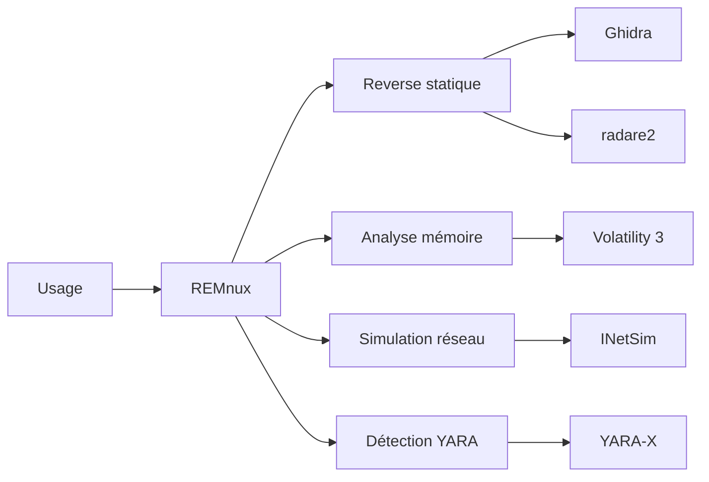

# 🧫 REMnux — Le laboratoire d'analyse de malwares

> [!info] **En 1 phrase**
> REMnux est une distribution Ubuntu dédiée à l'analyse de malwares (static et dynamique) : elle regroupe plus de 200 outils de reverse engineering, de désassemblage et de détection d'analyse de programmes malveillants.

---

## 🧾 Overview

| Champ | Valeur |
|---|---|
| Nom complet | REMnux (Reverse Engineering Malware Ubuntu) |
| Description | Toolkit Linux d'analyse de malwares : RE statique/dynamique, analyse mémoire, documents malveillants, simulation réseau |
| Catégorie | 🐧 Distributions & Lab |
| Sous-catégorie | Distribution défensive / forensique |
| Fonction principale | Analyser des échantillons malveillants (PE, ELF, Office, PDF, URLs) en environnement isolé |
| Type d'outil | Distribution Linux (CLI + GNOME) + scripts + images Docker |
| Licence | Open source (outils GPL/BSD/MIT, base Ubuntu 24.04 LTS) |
| Open source / propriétaire | Open source |
| Langage(s) | Python, C, C++, Go, Rust, Perl, Bash |
| Développeur / organisation | Lenny Zeltser (créateur) + communauté REMnux |
| Projet officiel | REMnux project |
| Dépôt officiel | https://github.com/REMnux |
| Documentation officielle | https://docs.remnux.org/ |
| Date de création | 2010 (première version), 15 ans en 2026 |
| État du projet | actif |
| Dernière version connue | REMnux v8 (11 février 2026) — base Ubuntu 24.04 |
| Systèmes compatibles | x86/amd64 uniquement (pas d'ARM ; M-series Apple non supportées) |

> [!note] Pour vérifier / compléter
> REMnux v8 est un bond majeur : base Ubuntu 24.04 (Noble) au lieu de 20.04, nouvel installateur **Cast**, serveur **MCP** (Model Context Protocol) pour les agents IA, intégration de **YARA-X**. Comptes VM : `remnux` / `malware`.

---

## 🎯 Concept

REMnux (Reverse Engineering Malware Ubuntu), créée par **Lenny Zeltser**, est une distribution Ubuntu LTS pensée **exclusivement pour l'analyse de malwares**. Contrairement aux distros offensives (Kali, Parrot), elle est orientée **défensive/forensique** : l'analyste examine des échantillons (PE, ELF, documents Office/PDF malveillants, URLs, QR codes, firmwares) sans risque pour sa machine de travail.

Son approche est **modulaire** : les outils s'installent individuellement (`apt install` ou le nouvel installateur `remnux install`), et l'analyse dynamique se fait dans une **machine virtuelle isolée** avec un réseau simulé (INetSim) pour empêcher le malware de rejoindre un vrai C2. La collection couvre l'analyse **statique** (chaînes, métadonnées, désassemblage), le **reverse engineering** (Ghidra, radare2/Cutter), l'analyse **mémoire** (Volatility 3), les **documents** (oletools, pdf-parser), la **détection** (YARA/YARA-X) et la **simulation réseau** (INetSim, Thug, tcpdump).

REMnux v8 ajoute une capacité inédite : un **serveur MCP** qui connecte des agents IA (OpenCode, Claude, ChatGPT…) aux outils de la distribution — l'agent sait quel outil utiliser selon le type de fichier et comment interpréter la sortie. Dans un SOC ou un lab malware, REMnux est la VM « analyste » qui complète **Flare VM** (analyse Windows) et **SIFT Workstation** (forensics).



---

## 🧠 Concepts fondamentaux

| Concept | Explication |
|---|---|
| Analyse statique | Examen du fichier sans l'exécuter : type, chaînes, en-têtes, imports, désassemblage |
| Analyse dynamique | Exécution contrôlée dans une sandbox pour observer le comportement réel |
| INetSim | Simulateur de services (HTTP, SMTP, DNS, IRC…) qui répond au malware à la place des vrais serveurs C2 |
| Thug | Honeypot web : visite une URL dans un environnement instrumenté pour analyser les exploits |
| Volatility 3 | Analyse de mémoire (processus, injections, extraction de binaires) sans profil système manuel |
| YARA / YARA-X | Langage de règles de détection de fichiers ; YARA-X est le successeur Rust |
| oletools | Suite d'analyse des documents OLE/Office (oleid, olevba, oledump…) |
| MCP server | Serveur Model Context Protocol de REMnux v8 : connecte les agents IA aux outils d'analyse |
| Sandbox | Environnement isolé (réseau Host-Only) où l'exécution ne peut pas atteindre Internet |

---

## 🛠️ Installation

### Télécharger la VM officielle

```bash
# 1. Télécharger l'OVA (~9 Go) : https://remnux.org/ (section "Get REMnux")
#    REMnux est basée sur Ubuntu 24.04 (Noble)
# 2. Importer dans VirtualBox/VMware/Proxmox (QCOW2 disponible)
# 3. Comptes par défaut : remnux / malware (à changer)
```

### Configurer en réseau isolé

```bash
# Réseau : Host-Only (jamais NAT vers Internet pour l'analyse dynamique)
# Ressources conseillées : 4 Go de RAM, 100 Go de disque
```

### Mise à jour et installation d'outils

```bash
# Mise à jour de la distribution (commandes officielles REMnux v8)
remnux install
# Installation d'outils complémentaires
sudo apt update && sudo apt install -y gh ida
```

### Docker

```bash
docker pull remnux/remnux-distro:noble
docker run --rm -it -u remnux remnux/remnux-distro:noble bash
```

### Installation sur un Ubuntu existant

```bash
# Via le nouvel installateur Cast (recommandé)
curl -sSf https://raw.githubusercontent.com/ekristen/cast/main/install.sh | bash
sudo cast install remnux/remnux
```

> [!warning] ⚠️ Prérequis & problèmes potentiels
> - REMnux est en **x86/amd64 uniquement** : pas d'ARM ni de M-series Apple.
> - L'analyse dynamique exige un **réseau isolé** : toute fuite vers Internet peut exposer la VM et ses données.
> - `remnux install` remplace l'ancien `remnux-cli` : suivre la documentation v8 pour les commandes exactes.

---

## ⚙️ Configuration

| Paramètre | Rôle | Valeur possible | Impact | Exemple |
|---|---|---|---|---|
| `remnux install` | Installer/mettre à jour REMnux | Exécuté en utilisateur normal | Obtention de la dernière version | `remnux install` |
| `remnux-scripts` | Scripts de commodité | Mis à jour avec la distro | Assistance aux tâches courantes | `ls /usr/local/bin/remnux-*` |
| Réseau VM | Isolation de l'analyse | Host-Only (pas de NAT) | Empêche l'exfiltration | adapter en Hyperviseur |
| Volatility 3 | Analyse mémoire | Modules `windows.*`, `linux.*` | Détection automatique de l'OS | `vol3 -f dump windows.pslist` |
| INetSim | Simulation de services | `/etc/inetsim/inetsim.conf` | Réponses HTTP/SMTP/DNS simulées | `sudo inetsim` |
| Serveur MCP | Agents IA | Config dans le répertoire REMnux | Analyse assistée par IA | suivre la doc v8 |
| YARA-X | Moteur de règles | Binaire `yarax` (Rust) | Détection plus rapide | `yarax -r regles.yar cible` |

---

## 🏗️ Architecture interne

REMnux v8 repose sur **Ubuntu 24.04 LTS** avec le bureau **GNOME** par défaut. Deux changements architecturaux majeurs :

- **Installateur Cast** : le nouvel outil (de Erik Kristensen) gère l'installation initiale, les mises à jour et l'ajout d'outils sur un système existant, en remplaçant l'ancien `remnux-cli`. La commande unifiée est `remnux install`.
- **Serveur MCP** : un serveur *Model Context Protocol* expose les outils de la distribution aux agents IA. Il connaît le type de fichier approprié pour chaque outil et le format de sortie, permettant à un assistant d'automatiser une partie du tri initial.

Les outils restent des paquets/scripts standard Ubuntu : `apt` pour la plupart, dépôts dédiés pour certains, et une collection de scripts `remnux-*` dans `/usr/local/bin`. La distribution est pensée « nomade » : on copie un échantillon dans la VM (dossier partagé en lecture seule de préférence) et on le traite sans jamais l'exécuter sur la machine hôte.

---

## ⌨️ Commandes

### Commandes principales

```bash
# Analyse statique de base
file sample.exe
strings -n 6 sample.exe
# Reverse engineering
radare2 -A sample.exe
ghidra &
# Extraction de données embarquées
binwalk -e firmware.bin
# Analyse mémoire
vol3 -f mem.dmp windows.pslist
# Simulation réseau
sudo inetsim
```

| Commande | Objectif | Résultat attendu |
|---|---|---|
| `file sample.exe` | Identifier le type de fichier | PE32, ELF, PDF, archive… |
| `strings -n 6 fichier` | Extraire les chaînes ASCII/Unicode | Chaînes significatives (URLs, chemins) |
| `radare2 -A binaire` | Désassemblage interactif avec analyse | Fonctions, imports, flux |
| `ghidra` | Reverse engineering graphique (GUI) | Projet d'analyse complet |
| `binwalk -e fichier` | Identifier/extraire les fichiers embarqués | Firmwares, archives, données cachées |
| `pdf-parser -a doc.pdf` | Analyser la structure PDF | Objets, JavaScript, actions |
| `oleid / olevba doc.docm` | Détecter/extraire les macros VBA | État macro, payloads |
| `vol3 -f dump windows.pslist` | Lister les processus d'un dump mémoire | Processus actifs au moment du dump |
| `sudo inetsim` | Simuler des services réseau | Réponses HTTP/SMTP/DNS factices |
| `thug -u <url>` | Honeypot web sur une URL | Analyse des redirections et exploits |

### Commandes avancées

```bash
# Volatility 3 : recherche d'injections et extraction
vol3 -f memory.dmp windows.malfind
vol3 -f memory.dmp windows.dumpfiles --pid <PID>
# YARA-X : scan de répertoire
yarax -r regles.yar /chemin/echantillons
# Thug avec sortie dédiée
thug -u http://evil.example/payload.html -o /tmp/rapport-thug
```

---

## 🎚️ Options et flags

| Option | Description | Exemple | Niveau |
|---|---|---|---|
| `-n 6` (strings) | Longueur minimale des chaînes | `strings -n 6 sample.exe` | Basic |
| `-e` (binwalk) | Extraction automatique | `binwalk -e firmware.bin` | Basic |
| `-A` (radare2) | Analyse automatique au chargement | `radare2 -A sample.exe` | Basic |
| `-a` (pdf-parser) | Analyse complète du PDF | `pdf-parser -a doc.pdf` | Intermediate |
| `-r` (yarax/yara) | Scan récursif | `yarax -r regles.yar dossier` | Intermediate |
| `--pid` (vol3) | Cibler un processus | `vol3 -f dump windows.dumpfiles --pid 1234` | Advanced |
| `-o` (thug) | Dossier de sortie | `thug -u url -o /tmp/out` | Advanced |
| `--extract` (olevba) | Extraire les macros | `olevba --extract doc.docm > macros.vba` | Intermediate |

> [!tip] Options les plus utiles au quotidien
> `strings -n 6` (tri rapide), `file` (premier réflexe), `binwalk -e` (firmwares/archives), `olevba --extract` (docs Office), `vol3 windows.malfind` (injection de code).

---

## 🧪 Exemples pratiques

### Beginner

```bash
file sample.exe
strings -n 6 sample.exe | grep -iE "http|dll|\.exe|\.sys"
sha256sum sample.exe
```

### Intermediate

```bash
# Analyser un document Office malveillant
oleid document.docm
olevba -a document.docm
# Analyser un PDF suspect
pdf-parser -a malware.pdf
```

### Advanced

```bash
# Analyse mémoire d'un dump
vol3 -f memory.dmp windows.info
vol3 -f memory.dmp windows.pstree
vol3 -f memory.dmp windows.malfind
```

### Expert

```bash
# Analyse dynamique isolée : INetSim + capture réseau
sudo inetsim
sudo tcpdump -i eth0 -w capture.pcap
# (lancer l'échantillon dans une VM guest pointant vers REMnux)
# Puis extraire les domaines/IP des flux
```

---

## 🧪 Workflow complet (scénario pas à pas)

1. **Environnement sécurisé** — lancer REMnux en VM isolée (Host-Only).
   ```bash
   ip addr show
   remnux install
   ```
2. **Analyse statique initiale** — identifier le type et extraire les chaînes.
   ```bash
   file sample.exe
   strings -n 6 sample.exe | grep -iE "http|dll|\.sys|\.exe"
   ```
3. **Analyse approfondie** — désassembler et examiner les imports.
   ```bash
   radare2 -A sample.exe
   # Examiner la liste des imports et les fonctions clés
   ```
4. **Analyse mémoire** (si un dump est disponible).
   ```bash
   vol3 -f memory.dmp windows.pslist
   vol3 -f memory.dmp windows.malfind
   ```
5. **Analyse dynamique isolée** — simuler le réseau et capturer le trafic.
   ```bash
   sudo inetsim
   sudo tcpdump -i eth0 -w capture.pcap
   ```
6. **Documenter** — hashes, IOC, règles YARA.
   ```bash
   sha256sum sample.exe
   yarax -r regles.yar sample.exe
   ```

---

## 🎬 Scénarios avancés

### Scénario 1 : Analyse d'un document Office malveillant

```bash
oleid document.docm
olevba -a document.docm
olevba --extract document.docm > macros.vba
# Identifier l'URL du payload dans les macros puis :
curl -s http://evil.example/payload.bin -o payload.bin
file payload.bin
```

### Scénario 2 : Analyse de mémoire avec Volatility 3

```bash
vol3 -f memory.dmp windows.pslist
vol3 -f memory.dmp windows.malfind
vol3 -f memory.dmp windows.dumpfiles --pid <PID>
# Analyser les binaires extraits
strings ./pid.dmp | grep -i "c2\|http"
```

### Scénario 3 : Analyse dynamique d'une URL avec Thug

```bash
thug -u http://evil.example/payload.html -o /tmp/rapport-thug
thug -u http://evil.example --connect-timeout 10
# Analyser le rapport généré (redirections, exploits, malwares détectés)
```

---

## 🛡️ Cybersecurity use cases

| Phase | Utilisation |
|---|---|
| Tri initial | `file`, `strings`, `sha256sum`, identification du type d'échantillon |
| Analyse statique | radare2, Ghidra, binwalk, oletools, pdf-parser |
| Reverse engineering | Ghidra, Cutter, radare2, x64dbg (via Flare VM) |
| Analyse mémoire | Volatility 3 (processus, injections, extractions) |
| Détection | YARA / YARA-X, signatures sur les échantillons |
| Simulation réseau | INetSim, Thug, tcpdump, FakeNet-NG |
| Extraction d'IOC | hashes, domaines, IP, chemins de persistance |

---

## 🎯 MITRE ATT&CK

| Tactique | Technique / Sub-technique | ID | Raison | Détection | Mitigation |
|---|---|---|---|---|---|
| Execution | User Execution : Malicious File | T1204.002 | Les échantillons analysés sont des fichiers malveillants (doc/PDF/PE) | Logs d'ouverture de fichiers, sandbox | Blocage des macros, filtrage pièces jointes |
| Defense Evasion | Obfuscated Files or Information | T1027 | Les malwares analysés sont souvent packés/obfusqués | Détection par radare2/YARA, unpacking | Analyse statique approfondie |
| Defense Evasion | Process Injection | T1055 | Volatility `malfind` détecte les injections de code | Analyse mémoire, EDR | Credential Guard, hardening |
| Credential Access | OS Credential Dumping | T1003 | Certains échantillons dumpent lsass/minidump | Accès anormaux à lsass | LSA Protection, EDR |

> [!note] Ne renseigner que si l'association est réellement pertinente.
> REMnux est un outil *défensif* : le tableau décrit les techniques **détectées/analysées** grâce aux outils de la distribution, pas des techniques que REMnux exécute.

---

## 🛡️ Defensive Security

### Signes observables

| Indicateur | Détail |
|---|---|
| Paquets sortants vers C2 pendant l'analyse | Le malware tente de joindre son vrai C2 si le réseau n'est pas isolé |
| Macros VBA dans un email | `olevba`/`oleid` confirment le caractère malveillant |
| Processus injecté dans la mémoire | `vol3 windows.malfind` révèle l'injection |
| Règles YARA qui déclenchent | Signature positive sur l'échantillon |
| Fichiers suspects dans les pièces jointes | PDF/Office avec JavaScript ou macros |

### Règles de détection (Sigma / Suricata / Snort / YARA)

```yaml
# YARA — échantillon Office avec macro (exemple pédagogique)
rule Suspicious_Office_Macro {
    meta:
        description = "Document Office contenant une macro VBA (à valider)"
        author = "Analyste"
        date = "2026-08-01"
    strings:
        $macro = "VBAProject"
        $auto  = "AutoOpen" nocase
        $shell = "Shell(" nocase
    condition:
        uint16(0) == 0xD0CF and $macro and ($auto or $shell)
}
```

---

## 🤖 Automatisation

```bash
# Bash — tri automatisé d'un dossier d'échantillons
for f in /tmp/echantillons/*; do
    file "$f"
    sha256sum "$f"
    strings -n 8 "$f" | grep -iE "http|https" | head -5
done
```

```python
# Python — calcul de hashes et extraction d'IOC
import hashlib, re
def iocs(path):
    with open(path, "rb") as fh:
        data = fh.read()
    sha = hashlib.sha256(data).hexdigest()
    urls = set(re.findall(rb"(?:https?://|hxxp://)[^\s\"']+", data))
    return sha, [u.decode(errors="ignore") for u in urls]
print(iocs("sample.exe"))
```

---

## 📤 Output et parsing

Les outils REMnux produisent des sorties texte/JSON qu'il est utile de parser pour automatiser l'extraction d'IOC.

```bash
# Volatility 3 : sortie JSON pour pipeline
vol3 -f memory.dmp windows.pslist -j > pslist.json
jq '.pslist[] | {PID: .PID, ImageFileName: .ImageFileName}' pslist.json
# YARA-X : sortie machine
yarax -r regles.yar echantillons -p json
```

```python
# Python — parsing du JSON Volatility 3
import json
with open("pslist.json") as fh:
    data = json.load(fh)
for row in data.get("pslist", []):
    print(row["PID"], row["ImageFileName"])
```

> [!note] À vérifier
> Les schémas JSON de Volatility 3 peuvent varier selon les versions : vérifier la clé racine (`pslist`/`rows`) sur votre version.

---

## 🔗 Intégrations

- [[Tools|🧰 Outils]] global
- [[Outil - Flare VM]] — analyse Windows (complément naturel en réseau Host-Only)
- [[Outil - SIFT Workstation]] — forensics disque/mémoire côté Linux
- [[Outil - Ghidra]] — reverse engineering GUI
- [[Outil - Volatility]] — analyse mémoire (Volatility 3)
- [[Outil - YARA]] — règles de détection (YARA-X)
- [[Outil - oletools]] — analyse des documents Office
- [[Outil - binwalk]] — extraction de firmwares
- [[Outil - radare2]] / [[Outil - Cutter]] — désassemblage
- [[Outil - tcpdump]] / [[Outil - Wireshark]] — captures réseau
- [[Outil - FakeNet-NG]] — simulation réseau alternative

```text
Échantillon → file/strings → Ghidra/radare2 → Volatility → INetSim → IOC → rapport
```

---

## 🔄 Alternatives

| Outil | Avantages | Inconvénients | Cas d'usage |
|---|---|---|---|
| [[Outil - Flare VM]] | Outils Windows natifs (x64dbg, dnSpy) | Windows requis | Analyse PE/Windows |
| [[Outil - SIFT Workstation]] | Forensics disque/mémoire complets | Moins orienté malware | Investigations DFIR |
| Cuckoo / CAPE | Sandbox automatisée | Lourd à maintenir | Analyse dynamique massive |
| MalwareBox / Any.Run | Cloud, rapide | Données envoyées à un tiers | Tri rapide |
| Ubuntu + outils manuels | Libre choix | Configuration longue | Utilisateurs avancés |

> **Quand utiliser REMnux plutôt que Flare VM ?** Pour l'analyse statique et la simulation réseau côté Linux (surtout sur des échantillons ELF, PDF, documents et firmwares), REMnux est imbattable. Pour déboguer un binaire PE Windows pas à pas, Flare VM est plus naturel — les deux se complètent en réseau Host-Only.

---

## ⚡ Performance

- **Ressources VM** : 4 Go de RAM et ~100 Go de disque recommandés ; l'OVA fait ~9 Go.
- **Le plus gourmand** : Ghidra (analyse Java/JVM) et les sandboxes dynamiques ; limiter les projets Ghidra ouverts simultanément.
- **YARA-X** : significativement plus rapide que YARA (implémentation Rust), utile sur de gros corpus.
- **INetSim + tcpdump** : très léger ; la capture pcap en continu peut grossir vite sur de longues analyses.
- **MCP/agents IA** : la latence dépend du fournisseur d'IA ; les appels réseau sortants doivent être maîtrisés.

> [!note] À vérifier
> Chiffres issus de la documentation officielle et de l'expérience pratique ; adaptez selon le matériel.

---

## 🛠️ Troubleshooting

### Common problems

#### Problème : `remnux install` échoue au milieu

- **Cause** : réseau instable ou paquets en conflit.
- **Solution** : relancer `remnux install` (l'installateur Cast reprend où il en était) ; vérifier `sudo apt --fix-broken install`.
- **Vérification** : `remnux install` se termine sans erreur.

#### Problème : le malware accède à Internet pendant l'analyse

- **Cause** : réseau VM mal configuré (NAT au lieu de Host-Only).
- **Solution** : passer en Host-Only et couper le NAT ; reconfigurer avant toute analyse dynamique.
- **Vérification** : `curl https://ifconfig.me` échoue dans la VM.

#### Problème : Volatility 3 ne trouve aucun processus

- **Cause** : dump corrompu ou image non supportée.
- **Solution** : vérifier avec `vol3 -f dump windows.info` ; utiliser `-v` pour le débogage.
- **Vérification** : `windows.info` affiche le profil OS détecté.

#### Problème : INetSim ne répond pas aux requêtes

- **Cause** : service non démarré ou adresse mal configurée.
- **Solution** : `sudo inetsim` (premier plan) ou vérifier `/etc/inetsim/inetsim.conf`.
- **Vérification** : `sudo systemctl status inetsim` (selon version) ou logs du service.

---

## 🔐 Sécurité de l'outil

- **Isolation obligatoire** : ne jamais exécuter un échantillon avec accès Internet réel (exfiltration, C2 réel, propagation).
- **Comptes par défaut** : VM livrée avec `remnux`/`malware` — changer le mot de passe.
- **Snapshots** : faire un snapshot propre avant chaque analyse dynamique (rollback après infection de la sandbox).
- **Serveur MCP** : les agents IA peuvent recevoir des sorties d'analyse sensibles ; configurer le fournisseur et la politique de partage.
- **Pas de télémétrie** : la distribution est locale ; seule l'analyse dynamique (volontairement isolée) génère du trafic.

---

## ⚠️ Limitations

- **x86/amd64 uniquement** : pas d'ARM (M-series Apple, Raspberry Pi).
- **Pas un système de production** : dédié à l'analyse, pas au travail quotidien.
- **Analyse dynamique incomplète** sans une VM d'exécution Windows séparée (Flare VM).
- **YARA-X** coexiste avec YARA : certaines règles anciennes peuvent nécessiter une migration de syntaxe.
- **Besoins en ressources** : Ghidra et les gros corpus exigent RAM et disque.
- **Faux positifs** : les détections YARA/AV doivent être validées par l'analyse comportementale.

---

## 📋 Cheatsheet

```bash
# Analyse statique
file sample.exe
strings -n 6 sample.exe | grep -iE "http|dll|\.exe"
sha256sum sample.exe

# Reverse engineering
radare2 -A sample.exe
ghidra &

# Fichiers embarqués / documents
binwalk -e firmware.bin
oleid doc.docm && olevba --extract doc.docm
pdf-parser -a malware.pdf

# Mémoire
vol3 -f mem.dmp windows.pslist
vol3 -f mem.dmp windows.malfind
vol3 -f mem.dmp windows.dumpfiles --pid <PID>

# Réseau simulé
sudo inetsim
sudo tcpdump -i eth0 -w capture.pcap

# Détection
yarax -r regles.yar /chemin/scan
```

---

## ⚡ Quick reference

| | |
|---|---|
| **À quoi sert-il ?** | Labo d'analyse de malwares : RE statique/dynamique, mémoire, documents, réseau simulé |
| **Quand l'utiliser ?** | Analyse d'un échantillon dans un SOC, un lab malware ou une investigation DFIR |
| **Commande principale** | `remnux install` (mise à jour) puis `file`/`strings`/`ghidra`/`vol3` sur l'échantillon |
| **Alternative principale** | [[Outil - Flare VM]] · [[Outil - SIFT Workstation]] |
| **Concepts importants** | Analyse statique vs dynamique, INetSim, Volatility 3, YARA-X, isolement réseau, IOC |
| **Liens associés** | [[Outil - Ghidra]] · [[Outil - Volatility]] · [[Outil - YARA]] · [[Outil - oletools]] |

---

## 🔍 Détection & Défense

| Signe | Défense |
|---|---|
| Paquets sortants vers C2 pendant l'analyse | Contenir en VM isolée, journaliser le pcap pour y chercher des IOC |
| Macro VBA détectée par olevba/oleid | Filtrage des pièces jointes Office, blocage des macros par défaut |
| Processus injecté détecté par Volatility | EDR, surveillance des injections, GPO hardening |
| Règle YARA qui déclenche | Mettre à jour les règles et intégrer les IOC aux SIEM/AV |
| Tentative de connexion aux services simulés | Preuve d'intention malveillante (INetSim/Thug) |

---

## ⚠️ Tips & Pièges

> [!tip] 💡 **Tips**
> - Garde toujours un **réseau Host-Only** : le malware ne doit jamais accéder à Internet directement.
> - Utilise `inetsim` pour faire croire au malware qu'il a accès à des services (HTTP, SMTP, DNS) : il se révèlera davantage.
> - Documente tes analyses : conserve le hash (MD5/SHA256), les IOC et les commandes utilisées.
> - Couple REMnux avec **Flare VM** en Host-Only : REMnux pour le réseau simulé et la capture, Flare pour le débogage Windows.

> [!warning] ⚠️ **Pièges**
> - Ne **jamais exécuter** un échantillon directement sur la machine hôte ni sur un réseau de production : une VM isolée est obligatoire (et un snapshot avant lancement).
> - `strings` ne suffit pas : les malwares sont souvent packés/obfusqués ; croise toujours avec `file`, `radare2`, `binwalk` et l'analyse mémoire.
> - Ne te fie pas aux signatures seules : beaucoup de détections YARA/AV donnent des faux positifs ; valide le comportement.
> - Sur un M-series Apple, REMnux ne tourne pas en natif (x86/amd64 uniquement).

---

## 📚 References

### Official

- Site officiel : https://remnux.org
- Documentation : https://docs.remnux.org/
- Annonce REMnux v8 : https://zeltser.com/remnux-v8-release
- GitHub : https://github.com/REMnux
- Docker Hub : https://hub.docker.com/r/remnux/remnux-distro

### Security references

- MITRE ATT&CK T1055 — Process Injection : https://attack.mitre.org/techniques/T1055/
- MITRE ATT&CK T1027 — Obfuscated Files : https://attack.mitre.org/techniques/T1027/
- YARA-X (documentation) : https://yara.readthedocs.io/

### Community

- Blog de Lenny Zeltser : https://zeltser.com
- Articles Malware Traffic Analysis : https://www.malware-traffic-analysis.net/

---

> [!info] 📚 **Sources**
> - https://remnux.org/
> - https://docs.remnux.org/

➡️ **Liens :** [[Tools|🧰 Outils]] · [[Outil - Flare VM|🔥 Flare VM]] · [[Outil - SIFT Workstation|🧬 SIFT Workstation]] · [[Outil - Ghidra|🔧 Ghidra]] · [[Outil - Volatility|🧠 Volatility]] · [[Outil - YARA|🛡️ YARA]] · [[Outil - oletools|📄 oletools]]
