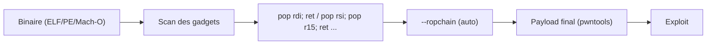

# 🧩 ROPgadget — Le générateur de gadgets et de ROP chains

> [!info] **En 1 phrase**
> Cherchez dans un binaire tous les « gadgets » (morceaux de code réutilisables) et générez automatiquement des ROP chains pour détourner le contrôle d'exécution malgré NX.

---

## 🧾 Overview

| Champ | Valeur |
|---|---|
| Nom complet | ROPgadget |
| Description | Outil Python de recherche de gadgets ROP dans un binaire et génération automatique de ROP chains |
| Catégorie | CTF & Développement |
| Sous-catégorie | Exploitation (pwn) / Reverse Engineering |
| Fonction principale | Énumérer les gadgets `ret` et construire des chaînes d'exécution arbitraire |
| Type d'outil | CLI Python |
| Licence | BSD (3 clauses) |
| Open source / propriétaire | Open source |
| Langage(s) de programmation | Python |
| Développeur / organisation | Jonathan Salwan (ShellStorm) |
| Projet officiel | JonathanSalwan/ROPgadget |
| Dépôt officiel | https://github.com/JonathanSalwan/ROPgadget |
| Documentation officielle | https://github.com/JonathanSalwan/ROPgadget |
| État du projet | actif (maintenu) |
| Dernière version connue | 7.7 (15 octobre 2025) |
| Systèmes compatibles | Linux, macOS, Windows ; ELF, PE, Mach-O ; x86, x64, ARM, MIPS, PowerPC... |

> [!note] À vérifier
> ROPgadget dépend de `capstone` (>= 5.0.1) et `pyelftools`/`filebytes`. Installer via `pip` ; la version CLI `ROPgadget` est distincte de `ropper` (outil alternatif).

---

## 🎯 Concept

ROPgadget analyse un fichier binaire (ELF, PE, Mach-O) et liste les **gadgets ROP** : de petites séquences d'instructions se terminant par un `ret` (ex. `pop rdi ; ret`). Ces gadgets, enchaînés en **ROP chain**, permettent de construire des appels arbitraires (ex. `execve("/bin/sh", NULL, NULL)`) sans exécuter de code dans la stack, contournant ainsi la protection NX. ROPgadget offre aussi `--ropchain` qui génère automatiquement la chaîne complète à partir de gadgets trouvés dans le binaire. Indispensable en pwn moderne : avec seulement quelques gadgets et la bonne adresse, on dévie l'exécution vers la fonction gagnante ou un shell.

ROPgadget se place dans la **phase de construction de l'exploit** : après avoir trouvé l'offset (cyclic) et vérifié les protections (checksec), on énumère les gadgets disponibles pour préparer la chaîne, souvent en binôme avec [[Outil - pwntools]] qui assemble le payload final. C'est aussi un outil de **reverse** : `--rebase`, `--offset` et le multi-format aident à comprendre la disposition mémoire d'un binaire avant exploitation.



---

## 🧠 Concepts fondamentaux

| Concept | Explication |
|---|---|
| Gadget | Suite d'instructions se terminant par un `ret` (ou `jmp`/`call` contrôlé), réutilisable comme brique |
| ROP chain | Séquence de gadgets empilés pour enchaîner des appels arbitraires |
| `pop rdi ; ret` | Gadget type x64 : charge la valeur suivante de la stack dans RDI puis retourne |
| NX | Protection rendant la stack non exécutable — contournée par ROP |
| `--ropchain` | Mode de génération automatique d'une chaîne `execve` complète |
| `--rebase` | Ajuster les adresses pour un binaire PIE (ajout de l'offset) |
| `--depth` | Profondeur maximale des gadgets recherchés |
| `--only` / `--range` | Filtrer par registres / plage d'adresses |
| Bad bytes | Octets non désirés dans l'adresse (newline, null) — filtrés avec `--filter` |
| Capstone | Moteur de désassemblage multi-arch utilisé par ROPgadget |

---

## 🛠️ Installation

### Debian / Ubuntu / Kali Linux

```bash
sudo apt install python3-pip
python3 -m pip install --user ROPGadget
```

### Arch Linux

```bash
sudo pacman -S python-ropgadget
```

### macOS / Homebrew

```bash
pip install --user ROPGadget
```

### Depuis les sources

```bash
git clone https://github.com/JonathanSalwan/ROPgadget.git
cd ROPgadget
python3 setup.py install
```

### Vérification

```bash
ROPgadget --version
```

> [!warning] ⚠️ Prérequis & problèmes potentiels
> - Dépend de `capstone>=5.0.1`, `pyelftools`, `filebytes` — installées automatiquement par pip.
> - Le mode `--ropchain` exige les gadgets 64 bits appropriés ; sur 32 bits, l'API diffère.
> - L'exécution du script via `ROPgadget` nécessite le chemin dans `PATH` (ou `python3 -m ROPgadget`).

---

## ⚙️ Configuration

| Paramètre | Rôle | Valeur possible | Impact | Exemple |
|---|---|---|---|---|
| `--depth` | Profondeur max des gadgets | entier (défaut 10) | Volume de résultats | `--depth 15` |
| `--only` | Garder les gadgets utilisant ces registres | liste de registres | Filtrage fin | `--only "pop|ret"` |
| `--range` | Restreindre à une plage d'adresses | start-end | Cibler une section | `--range 0x401000-0x401500` |
| `--filter` | Exclure les gadgets contenant des bytes | ex. `"\x0a"` | Bad bytes | `--filter "\x0a\x00"` |
| `--rebase` | Rebaser les adresses (PIE) | offset | Adresses runtime | `--rebase 0x555555554000` |
| `--offset` | Soustraire un offset aux adresses | entier | Relogement | `--offset 0x400000` |
| `--ropchain` | Générer une chaîne automatique | flag | Chaîne complète | `--ropchain` |
| `--all` | Toutes les instructions possibles (multi-arch) | flag | Élargit la recherche | `--all` |
| `--thumb` / `--arm` | Mode ARM Thumb/ARM | flag | Architecture ARM | `--thumb` |
| `--nojop` | Désactiver les gadgets JOP | flag | Pur ROP | `--nojop` |

> [!note] À vérifier
> Les options peuvent varier légèrement selon la version ; consulter `ROPgadget --help` pour la liste exacte.

---

## 🏗️ Architecture interne

- **Scan multi-arch** : ROPgadget désassemble le binaire (capstone) et balaye chaque adresse à la recherche de séquences se terminant par un `ret` (ou `jmp`/`call` en mode `--all`).
- **Détection de format** : il détecte ELF (pyelftools), PE (filebytes) et Mach-O pour parcourir sections `.text`, `.plt`, `.init`...
- **Filtres** : `--depth` limite la longueur ; `--only` filtre par registres ; `--range`/`--rebase`/`--offset` ajustent les adresses (essentiel pour PIE et libc relogées).
- **Moteur de chain** : `--ropchain` génère une chaîne `execve("/bin/sh")` en sélectionnant les gadgets adaptés (x64 : `pop rdi`, `pop rsi`, `pop rdx`, `mov`... ; x86 : style `push`/`ret`).
- **Sortie** : texte (défaut), `--binary` (octets bruts), et format compatible pour l'import dans d'autres outils.
- **CLI unique** : un seul module Python exécutable, `ROPgadget.py`.

---

## ⌨️ Commandes

### Commandes principales

```bash
# Lister tous les gadgets du binaire
ROPgadget --binary ./challenge

# Rechercher un gadget précis
ROPgadget --binary ./challenge --only "pop|ret"

# Générer une chaîne ROP automatique
ROPgadget --binary ./challenge --ropchain

# Compter les gadgets
ROPgadget --binary ./challenge | wc -l
```

| Commande | Objectif | Résultat attendu |
|---|---|---|
| `ROPgadget --binary <fichier>` | Tous les gadgets | Liste `adresse : gadget` |
| `ROPgadget --only "pop|ret"` | Gadgets pop/ret | `pop rdi ; ret` etc. |
| `ROPgadget --ropchain` | Chaîne complète | Code Python prêt à copier |
| `ROPgadget --depth 15` | Gadgets plus longs | Plus de candidats |
| `ROPgadget --range <deb>-<fin>` | Gadgets d'une plage | Gadgets de la section cible |
| `ROPgadget --rebase <offset>` | Adresses rebasées | Adresses runtime (PIE) |
| `ROPgadget --filter "\x0a"` | Exclure des bad bytes | Gadgets exploitables |
| `ROPgadget --help` | Aide complète | Liste des options |

### Commandes avancées

```bash
# Gadgets d'une libc avec rebase
ROPgadget --binary /lib/x86_64-linux-gnu/libc.so.6 --only "pop rdi|ret"

# Scan JOP (jmp reg)
ROPgadget --binary ./challenge --all

# Sortie en octets bruts (binaire)
ROPgadget --binary ./challenge --binary --depth 6 > gadgets.bin
```

---

## 🎚️ Options et flags

| Option | Description | Exemple | Niveau |
|---|---|---|---|
| `--binary <file>` | Fichier cible | `--binary ./challenge` | Basic |
| `--depth <n>` | Profondeur des gadgets | `--depth 12` | Intermediate |
| `--only <regs>` | Filtrer par registres | `--only "pop|ret"` | Intermediate |
| `--range <deb>-<fin>` | Plage d'adresses | `--range 0x401000-0x401500` | Advanced |
| `--filter <hex>` | Bad bytes exclus | `--filter "\x0a"` | Advanced |
| `--rebase <off>` | Rebaser (PIE) | `--rebase 0x555555554000` | Advanced |
| `--offset <off>` | Décaler les adresses | `--offset 0x400000` | Expert |
| `--ropchain` | Chaîne automatique | `--ropchain` | Advanced |
| `--all` | Inclure JOP/instructions variées | `--all` | Advanced |
| `--thumb` / `--arm` | Architecture ARM | `--thumb` | Expert |
| `--nojop` | Exclure les gadgets JOP | `--nojop` | Intermediate |
| `--binary` (sortie) | Sortie en octets | `--binary` | Advanced |
| `--silent` | Mode silencieux | `--silent` | Basic |

> [!tip] Options les plus utiles au quotidien
> `--only "pop|ret"` (le standard), `--depth` (plus de gadgets), `--rebase` (PIE), `--filter` (bad bytes), `--ropchain` (génération auto).

---

## 🧪 Exemples pratiques

### Beginner

```bash
# Objectif : lister les gadgets utiles
ROPgadget --binary ./challenge --only "pop|ret"
# 0x000000000040100a : pop rdi ; ret
```

```bash
# Objectif : chaîne ROP automatique
ROPgadget --binary ./challenge --ropchain
```

### Intermediate

```bash
# Objectif : gadgets sans bad bytes
ROPgadget --binary ./challenge --only "pop|ret" --filter "\x0a\x00"
```

```bash
# Objectif : gadgets d'une plage précise
ROPgadget --binary ./challenge --range 0x401000-0x401500
```

### Advanced

```bash
# Objectif : rebaser pour un binaire PIE
ROPgadget --binary ./challenge --only "pop rdi|ret" --rebase 0x555555554000
```

### Expert

```bash
# Objectif : gadgets de la libc (ret2libc)
ROPgadget --binary /lib/x86_64-linux-gnu/libc.so.6 --only "pop rdi|pop rsi|ret" --depth 8
```

---

## 🧪 Workflow complet (scénario pas à pas)

1. **Étape 1 — Vérifier les protections** (avec pwntools/GDB) :
   ```bash
   pwn checksec ./challenge
   ```
2. **Étape 2 — Énumérer les gadgets utiles** :
   ```bash
   ROPgadget --binary ./challenge --only "pop rdi|pop rsi|pop rdx|ret"
   ```
3. **Étape 3 — Trouver l'offset du buffer** (cyclique + crash) :
   ```python
   from pwn import *
   offset = cyclic_find(core.fault_addr)
   ```
4. **Étape 4 — Construire la chaîne** (manuelle avec les adresses ou `--ropchain`) :
   ```python
   payload = b"A"*offset + p64(pop_rdi) + p64(binsh) + p64(system)
   ```
5. **Étape 5 — Tester en local puis envoyer sur la cible distante**, en déboguant si échec (gdb.attach).
6. **Étape 6 — Valider** le shell/flag et documenter la chaîne utilisée.

---

## 🎬 Scénarios avancés

### Scénario 1 : ret2libc avec ROPgadget + pwntools

```bash
ROPgadget --binary /lib/x86_64-linux-gnu/libc.so.6 --only "pop rdi|pop rsi|ret" --depth 8
# note : pop_rdi, pop_rsi, pop_rdx, system, binsh
```

```python
from pwn import *
e = ELF("./challenge"); libc = ELF("/lib/x86_64-linux-gnu/libc.so.6")
# leak puts puis calcul libc.address
pop_rdi = 0x40100a; system = libc.symbols["system"]
binsh = next(libc.search(b"/bin/sh"))
payload = b"A"*offset + p64(pop_rdi) + p64(binsh) + p64(system)
```

### Scénario 2 : bypass NX avec `--ropchain` (génération automatique)

```bash
ROPgadget --binary ./challenge --ropchain
# sortie : code Python avec ROPchain() pour execve /bin/sh
```

### Scénario 3 : binaire PIE — rebase des gadgets

```bash
ROPgadget --binary ./challenge --only "pop rdi|ret" --rebase 0x555555554000
# adresses utilisables après leak de la base
```

### Scénario 4 : pivot de stack (leave; ret) pour exploiter une stack limitée

```bash
ROPgadget --binary ./challenge --only "leave|ret"
# 0x00000000004010f8 : leave ; ret
```

---

## 🛡️ Cybersecurity use cases

| Phase | Utilisation |
|---|---|
| Analyse | Désassemblage ciblé, compréhension des gadgets disponibles |
| Construction d'exploit | Sélection des gadgets, génération de ROP chain |
| Contournement NX | Chaînes ROP sans shellcode dans la stack |
| Ret2libc | Gadgets de la libc pour appeler system/execve |
| Évaluation | POC d'exploitation sur des binaires embarqués/legacy |
| CTF / pwn | Challenges ROP, ret2libc, stack pivot |

---

## 🎯 MITRE ATT&CK

| Tactique | Technique / Sub-technique | ID | Raison | Détection | Mitigation |
|---|---|---|---|---|---|
| Execution | Native API | T1106 | Appels système construits via gadgets ROP | EDR, supervision syscalls | CFI, moindre privilège |
| Defense Evasion | Obfuscated Files or Information | T1027 | Construction de chaînes pour contourner NX | Analyse mémoire, sandbox | NX/PIE/CFI actifs |
| Impact | Exploitation for Privilege Escalation | T1068 | Exploitation de vulnérabilités mémoire via ROP | EDR, monitoring crash | Patching, durcissement |
| Defense Evasion | Process Hollowing (analogie conceptuelle) | T1055 | Détournement du flux d'exécution d'un processus | Supervision mémoire/API | CFI, Intel CET |

> [!note] Ne renseigner que si l'association est réellement pertinente.
> ROPgadget est un **générateur de gadgets/chaines** : la technique finale exploite la vulnérabilité (T1068) ; les gadgets permettent le contournement (T1027) et l'exécution d'API natives (T1106). La ligne T1055 reste une analogie conceptuelle à n'utiliser que si réellement applicable.

---

## 🛡️ Defensive Security

### Signes observables

| Indicateur | Détail |
|---|---|
| Utilisation de ROPgadget sur un endpoint | Préparation d'exploitation |
| Binaires en production sans NX/CFI | Facilite les ROP chains |
| Gadgets `ret` présents en masse | Normal (compilation) — la chaîne est le danger |
| Exploits ROP en mémoire | Détection par analyse dynamique/EDR |

### Règles de détection (Sigma / Suricata / Snort / YARA)

```yaml
# Sigma — invocation de ROPgadget sur un hôte sensible
title: ROPgadget Usage
id: a1b2c3d4-e5f6-4a7b-8c9d-0e1f2a3b4c5d
status: experimental
logsource:
    category: process_creation
    product: linux
detection:
    selection:
        Image|endswith: '/ROPgadget'
        CommandLine|contains: '--binary'
    condition: selection
falsepositives:
    - Legitimate exploitation research
level: medium
```

```yaml
# YARA — présence d'une chaîne ROP longue caractéristique dans un script
rule rop_chain_detection
{
    strings:
        $a = "ROPgadget" 
        $b = "ropchain"
    condition:
        $a or $b
}
```

> [!note] À vérifier
> Règles pédagogiques à adapter ; détecter un ROP réel passe par l'analyse mémoire (contrôle de pile), pas seulement les outils.

---

## 🤖 Automatisation

```bash
# Script : extraire les gadgets pop/ret d'un lot de binaires
for f in ./bin/*; do
    echo "== $f =="
    ROPgadget --binary "$f" --only "pop rdi|ret" --depth 6
done
```

```python
# Python : intégrer ROPgadget dans un script d'exploit (subprocess)
import subprocess
out = subprocess.run(
    ["ROPgadget", "--binary", "./challenge", "--only", "pop rdi|ret"],
    capture_output=True, text=True).stdout
for line in out.splitlines():
    if "pop rdi ; ret" in line:
        pop_rdi = int(line.split(":")[0], 16)
        print(hex(pop_rdi))
```

```python
# Python : chaîne auto --ropchain parsée puis injectée
import subprocess
chain = subprocess.check_output(
    ["ROPgadget", "--binary", "./challenge", "--ropchain"],
    text=True)
# le bloc Python généré peut être exécuté tel quel (capstone requis)
```

---

## 📤 Output et parsing

```bash
# Format texte : adresse : gadget
ROPgadget --binary ./challenge --only "pop rdi|ret" | grep "pop rdi"
# 0x000000000040100a : pop rdi ; ret
```

```python
# Python : extraire toutes les adresses des gadgets
import subprocess, re
out = subprocess.check_output(
    ["ROPgadget", "--binary", "./challenge", "--only", "ret"], text=True)
gadgets = [int(m, 16) for m in re.findall(r"0x([0-9a-f]+) :", out)]
print(len(gadgets), "gadgets")
```

```bash
# Comparer deux binaires (nouvelle vs ancienne version)
ROPgadget --binary v1.bin --only "pop rdi|ret" > a.txt
ROPgadget --binary v2.bin --only "pop rdi|ret" > b.txt
diff a.txt b.txt
```

---

## 🔗 Intégrations

```text
checksec (pwntools) → ROPgadget (gadgets) → ROP() pwntools (chaîne) → gdb-peda (debug)
```

- [[Tools|🧰 Outils]]
- [[Outil - pwntools]] — construction du payload final et envoi
- [[Outil - gdb-peda]] — debug et validation de la chaîne
- [[Outil - Ghidra]] — analyse statique complémentaire
- [[Outil - radare2]] — désassemblage interactif alternatif
- [[10 - Cheatsheets|📋 Cheatsheets]]

---

## 🔄 Alternatives

| Outil | Avantages | Inconvénients | Cas d'usage |
|---|---|---|---|
| ropper | Multi-arch, rapide, API Python | Python 3 requis | Gadgets + ROP |
| ROPgadget | Simple, `--ropchain`, multi-format | Chain limité à execve | Génération rapide |
| pwntools `ROP()` | Intégré au script, regadgets auto | Nécessite pwntools | Exploit complet |
| angr | Résolution symbolique des chaînes | Lourd | Analyse avancée |
| Ropper / ROPgadget en parallèle | Recoupement des gadgets | Doublon de commandes | Vérification croisée |

> **Quand utiliser pwntools ROP() plutôt que ROPgadget ?** Pour une intégration native au script d'exploit (chaîne calculée à la volée) ; ROPgadget CLI reste imbattable pour l'exploration rapide et la vérification indépendante.

---

## ⚡ Performance

- **Scan** : le désassemblage complet d'un binaire/une libc prend de quelques secondes à quelques dizaines de secondes (profondeur et `--all` inclus).
- **--depth** : augmenter la profondeur augmente fortement le nombre de gadgets et le temps.
- **--ropchain** : génération quasi instantanée une fois les gadgets indexés.
- **Multi-fichiers** : scriptable ; éviter `--all` sur de grosses libc sans filtre.
- **Capstone** : la version C (compilée) est rapide ; pip installe la version optimisée par défaut.

> [!note] À vérifier
> Les temps varient selon la taille du binaire et la profondeur demandée ; pas de benchmark officiel.

---

## 🛠️ Troubleshooting

### Common problems

#### Problème : aucun gadget trouvé

- **Cause** : binaire strippé, section `.text` absente, ou filtre trop restrictif.
- **Solution** : augmenter `--depth`, enlever `--only`, vérifier avec `file`. **Vérif** : `ROPgadget --binary <f> --only "ret"`.

#### Problème : adresses fausses sur binaire PIE

- **Cause** : pas de rebase.
- **Solution** : `--rebase` avec la base leakée (runtime). **Vérif** : comparer avec une adresse connue à l'exécution.

#### Problème : `--ropchain` échoue (pas de gadget suffisant)

- **Cause** : gadgets requis absents (mov reg/reg, pop rdx, syscall).
- **Solution** : utiliser la libc comme source de gadgets ou une chaîne manuelle. **Vérif** : chercher `syscall ; ret` et `mov rdi, rax`.

#### Problème : erreur capstone manquant

- **Cause** : dépendance absente.
- **Solution** : `pip install capstone`. **Vérif** : `python3 -c "import capstone"`.

---

## 🔐 Sécurité de l'outil

- **Exécution locale** : ROPgadget désassemble sans exécuter de code ; sûr pour l'analyse de binaires malveillants.
- **Sortie** : `--binary` produit des octets bruts à ne pas exécuter par accident.
- **Mises à jour** : capstone et pyelftools doivent rester à jour (parsers).
- **Usage** : outil de développement d'exploit — à utiliser uniquement dans des environnements autorisés (CTF, lab, engagement).

---

## ⚠️ Limitations

- **Chaîne auto limitée** : `--ropchain` génère surtout `execve("/bin/sh")` ; les chaînes complexes (multi-appels) se font à la main.
- **Bad bytes** : le filtre `--filter` est simple (pas de détection d'alignement complet).
- **Architectures** : le scan multi-arch dépend de capstone ; les gadgets les plus complexes peuvent manquer.
- **Pas de résolution de symboles avancée** : pour les adresses de fonctions/libc, utiliser pwntools `ELF()`/`ROP()`.
- **Performance sur grosses libc** : `--all` peut être très lent.

---

## 📋 Cheatsheet

```bash
# Tous les gadgets
ROPgadget --binary ./challenge
# Gadgets pop/ret
ROPgadget --binary ./challenge --only "pop|ret"
# Pop spécifiques x64
ROPgadget --binary ./challenge --only "pop rdi|pop rsi|pop rdx|ret"
# Chaîne automatique
ROPgadget --binary ./challenge --ropchain
# Gadgets sans bad bytes
ROPgadget --binary ./challenge --filter "\x0a\x00"
# PIE rebase
ROPgadget --binary ./challenge --rebase 0x555555554000
# Libc (ret2libc)
ROPgadget --binary /lib/x86_64-linux-gnu/libc.so.6 --only "pop rdi|ret"
# Pivot stack
ROPgadget --binary ./challenge --only "leave|ret"
# syscall
ROPgadget --binary ./challenge --only "syscall|ret"
```

---

## ⚡ Quick reference

| | |
|---|---|
| **À quoi sert-il ?** | Trouver les gadgets ROP d'un binaire et générer des chaînes |
| **Quand l'utiliser ?** | Après checksec, avant de construire le payload ROP |
| **Commande principale** | `ROPgadget --binary <f> --only "pop rdi|ret"` |
| **Alternative principale** | ropper, pwntools `ROP()`, angr |
| **Concepts importants** | Gadget, ROP chain, `--ropchain`, rebase, bad bytes |
| **Liens associés** | [[Outil - pwntools]] · [[Outil - gdb-peda]] · [[Outil - Ghidra]] |

---

## 🔍 Détection & Défense

| Signe | Défense |
|---|---|
| ROPgadget/ropper sur un endpoint | Supervision des outils de dev |
| Chaînes de gadgets en mémoire | EDR/analyse de pile, CFI |
| Binaires sans NX/PIE/CFI | Recompiler avec protections |
| Exploitation ROP répétée | Durcir, patcher, réduire les privilèges |

---

## ⚠️ Tips & Pièges

> [!tip] 💡 **Tips**
> - `--only "pop|ret"` est le filtre le plus courant : on y trouve `pop rdi ; ret`.
> - Vérifiez les gadgets **de la libc** pour les ret2libc (plus de choix que le binaire).
> - Utilisez `--rebase` dès que le binaire est PIE (adresses runtime après leak).
> - `--depth` plus grand révèle des gadgets utiles (`mov rdi, rax ; ret`).
> - Recoupez ROPgadget avec `ROP()` de pwntools pour confirmer les adresses.

> [!warning] ⚠️ **Pièges**
> - Sans `--rebase`, les adresses d'un binaire PIE sont fausses à l'exécution.
> - Les bad bytes (`0x0a`, `0x00`) invalident les adresses dans les chaînes : filtrez-les.
> - `--only "pop|ret"` peut rater les gadgets `mov`/`syscall` nécessaires aux chaînes complexes.
> - Sur x86 (32 bits), les gadgets diffèrent du x64 : adaptez `--only` et l'endianness.
> - Ne pas confondre l'option de sortie `--binary` et l'option de fichier `--binary <file>`.

---

## 📚 References

### Official

- Dépôt officiel : https://github.com/JonathanSalwan/ROPgadget
- Releases : https://github.com/JonathanSalwan/ROPgadget/releases
- Capstone engine : https://www.capstone-engine.org/
- ShellStorm (auteur) : https://www.shell-storm.org/

### Security references

- MITRE ATT&CK T1106 — Native API : https://attack.mitre.org/techniques/T1106/
- MITRE ATT&CK T1027 — Obfuscated Files or Information : https://attack.mitre.org/techniques/T1027/
- MITRE ATT&CK T1068 — Exploitation for Privilege Escalation : https://attack.mitre.org/techniques/T1068/

### Community

- HackTricks — ROP : https://book.hacktricks.xyz/reversing-and-exploiting
- CTF 101 — ROP : https://ctf101.org/binary-exploitation/return-oriented-programming/
- pwntools ROP : https://docs.pwntools.com/en/stable/rop/rop.html

---

➡️ **Liens :** [[Tools|🧰 Outils]] · [[Outil - pwntools|🎯 pwntools]] · [[Outil - gdb-peda|🛠️ gdb-peda]] · [[Outil - Ghidra|🔬 Ghidra]] · [[Outil - radare2|🕵️ radare2]] · [[Outil - CyberChef|🧪 CyberChef]] · [[Outil - hashcat|⚡ hashcat]] · [[Outil - John the Ripper|🔓 John the Ripper]]
