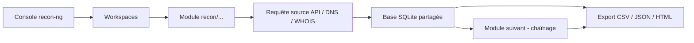
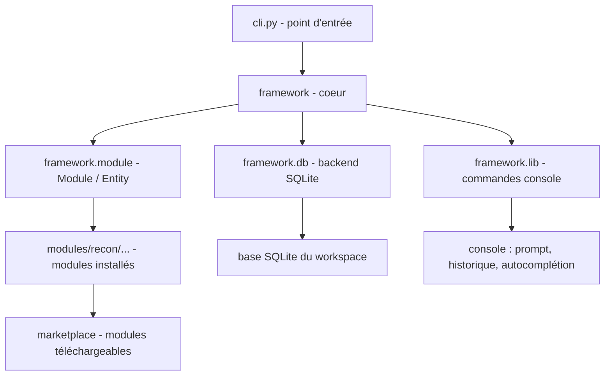

# Recon-ng — Framework de reconnaissance façon « Metasploit »

> [!info] **En 1 phrase**
> Recon-ng est un framework de reconnaissance modulaire en ligne de commande (Tim Tomes / Black Hills InfoSec) qui centralise des centaines de modules OSINT sous une interface façon « Metasploit ».

---

## Overview

| Champ | Valeur |
|---|---|
| Nom complet | Recon-ng |
| Description | Framework de reconnaissance (recon) modulaire en Python : console interactive, workspaces, marketplace de modules OSINT et stockage SQLite partagé |
| Catégorie | Reconnaissance & OSINT |
| Sous-catégorie | Reconnaissance passive / active, OSINT, enumeration |
| Fonction principale | Centraliser et chaîner des dizaines de modules de collecte d'OSINT sur des domaines, hôtes, contacts et profils |
| Type d'outil | CLI interactive (console REPL) + modules Python |
| Licence | GPL-3.0 |
| Open source / propriétaire | Open source |
| Langage(s) de programmation | Python 3 (majorité des modules), quelques modules externes optionnels |
| Développeur / organisation | lanmaster53 (Tim Tomes), sponsorisé Black Hills Information Security |
| Projet officiel | https://github.com/lanmaster53/recon-ng |
| Dépôt officiel | https://github.com/lanmaster53/recon-ng |
| Documentation officielle | https://github.com/lanmaster53/recon-ng/wiki |
| Date de création | 2013 (développement continu depuis) |
| État du projet | actif (développement par à-coups, basé sur les contributions) |
| Dernière version connue | 5.1.2 (disponible via apt/pip ; pas de releases GitHub officielles, la source GitHub sert de référence) |
| Systèmes compatibles | Linux (dont Kali), macOS, Windows (via WSL recommandé) |

> [!note] Pour vérifier / compléter
> Recon-ng ne publie pas de releases officielles sur GitHub : la version « dernière » correspond au `master` de la branche + la 5.1.2 empaquetée dans Kali/apt. Les modules du `marketplace` sont hébergés dans un dépôt séparé (`recon-ng-marketplace`).

---

## Concept

Recon-ng reprend le modèle de Metasploit appliqué à la **reconnaissance** : une console interactive avec un prompt de commandes, des *modules* spécialisés organisés en arborescence (`recon/domains-hosts/...`, `recon/hosts-ports/...`), des *workspaces* pour isoler chaque engagement, et des *marketplaces* pour installer de nouveaux modules. Chaque module interroge une source de données (crtsh, HackerTarget, Shodan, VirusTotal, Google, WHOIS...) et stocke ses résultats dans une **base de données SQLite locale**. La valeur ajoutée majeure par rapport à des scripts isolés est la **réutilisabilité** : les résultats d'un module alimentent automatiquement les suivants (résolution des hôtes découverts, reverse DNS, recherche de ports sur les hôtes stockés) sans ressaisie ni fichier intermédiaire.

Dans un engagement, Recon-ng se place en **phase de reconnaissance** : on crée un workspace, on installe les modules utiles, on configure les clés API (`keys add`), on énumère les sous-domaines d'un domaine, puis on chaîne les modules d'enrichissement et on exporte vers CSV/JSON ou un rapport HTML avant de passer à l'analyse (nmap, fuzzing, exploitation).



---

## Concepts fondamentaux

| Concept | Explication |
|---|---|
| Console interactive | Prompt `[recon-ng][default] >` : chaque commande opère sur le workspace courant ; `help` liste les commandes disponibles |
| Workspaces | Conteneurs isolés de données (SQLite séparé) : un workspace = un engagement ou une cible. `workspaces create/load/remove/list` |
| Modules | Unités Python autonomes sous `recon/`, `discovery/`, `exploitation/`, `import/`, `export/`, `reporting/`. Chargeables via `module load`, paramétrés via `options set` |
| Marketplace | Dépôt central de modules installables : `marketplace refresh`, `marketplace search`, `marketplace install <module>` ou `<all>` |
| Base SQLite | Toutes les données collectées (domains, hosts, contacts, ports, credentials, vulns) sont persistées dans une base unique ; les modules lisent/écrivent dedans |
| `keys add <service> <clé>` | Enregistre les clés API (Shodan, VirusTotal, Censys, BinaryEdge...) stockées dans `~/.recon-ng/keys.db` ; les modules les utilisent automatiquement |
| Chaînage | Les données d'un module alimentent les autres : `show hosts` après une énumération permet de lancer un reverse DNS sur tous les hôtes d'un coup |
| Modules « community » | Les modules communautaires non officiels ne sont plus installés par défaut depuis v5 ; il faut les installer explicitement ou lancer avec `-c` |
| Contextes de modules | Certains modules tournent dans un « contexte » (ex : `recon/domains-hosts/brute_hosts`) et affichent un prompt dédié à la fin de l'exécution |
| Interact | Module intégré (`modules/recon/...` ou script) qui ouvre un shell interactif (ex : `Interact.py`) sur les cibles trouvées |

---

## Installation

### Kali Linux / Debian / Ubuntu

```bash
sudo apt update
sudo apt install recon-ng
recon-ng
```

### Depuis les sources (recommandé pour la dernière version)

```bash
git clone https://github.com/lanmaster53/recon-ng.git
cd recon-ng
pip install -r REQUIREMENTS
python3 recon-ng
```

### Via pip (paquet tiers non officiel)

```bash
# Recon-ng n'est pas sur PyPI officiellement : utiliser la source GitHub.
# Certaines distributions empaquetent recon-ng dans leurs repos (Kali, BlackArch).
```

### Windows

```bash
# Pas de support natif fiable : utiliser WSL (Linux) puis suivre l'installation Debian/Ubuntu.
# Sous WSL, la base SQLite et le dossier ~/.recon-ng sont créés automatiquement.
```

> [!note] Dépendances clés
> La liste `REQUIREMENTS` inclut `requests`, `dns` (dnspython), `netaddr`, `flask` (console web optionnelle), `xmpp`, `jinja2`. En cas d'erreur d'import, exécuter `pip install -r REQUIREMENTS` dans un environnement propre (venv recommandé).

---

## Configuration

### Fichiers et répertoires

| Chemin | Rôle |
|---|---|
| `~/.recon-ng/` | Dossier de données de l'utilisateur |
| `~/.recon-ng/keys.db` | Base SQLite des clés API enregistrées (`keys add`) |
| `~/.recon-ng/workspaces/` | Sous-dossiers contenant la base SQLite de chaque workspace |
| `~/.recon-ng/resource/` | Fichiers de ressources (scripts de commandes rejouables via `resource`) |
| `~/.recon-ng/marketplace/` | Dépôt marketplace cloné (après `marketplace refresh`) |

### Clés API (recommandées pour débloquer les bons modules)

```bash
recon-ng
keys add shodan <API_KEY>
keys add virustotal <API_KEY>
keys add censys_id <ID>            # pour censys.io
keys add censys_secret <SECRET>
keys add binaryedge <API_KEY>
keys list                          # vérifier les clés enregistrées
keys remove <service>              # supprimer une clé
```

### Options globales

| Option | Effet |
|---|---|
| `set useragent <UA>` | User-Agent utilisé par les requêtes HTTP des modules |
| `set workspace <nom>` | Workspace courant (équivalent à `workspaces load`) |
| `set debug True` | Affiche les erreurs détaillées Python pendant `run` |
| `set verbose True` | Sortie verbeuse des modules |
| `set limit` / `set source` | Options propres à chaque module |

### Options de lancement CLI

| Option CLI | Effet |
|---|---|
| `-w <workspace>` | Ouvrir dans un workspace précis (le crée si absent) |
| `-r <resource>` | Rejouer un fichier de ressources (script de commandes) |
| `-c` / `--community` | Restreindre la recherche aux modules communautaires |
| `-h` / `--help` | Aide complète |
| `-v` / `--version` | Version du framework |

---

## Architecture interne

Recon-ng est structuré en couches Python :



- **`framework.lib`** : fournit le moteur de commandes (`workspaces`, `marketplace`, `keys`, `module`, `run`, `show`, `options`, `db`) et l'interface REPL avec historique et complétion TAB.
- **`framework.module`** : chaque module est une classe Python héritant d'une classe de base ; elle expose `METADATA`, `options` et les méthodes `module_pre`, `module_run` / `module_footer`. Les modules récupèrent les entités depuis la base via des helpers comme `self.query()` et `self.add_*()`.
- **`framework.db`** : couche d'accès SQLite (la base est stockée dans le workspace, typiquement `~/.recon-ng/workspaces/<nom>/spider.db`). Les tables principales : `domains`, `hosts`, `contacts`, `ports`, `credentials`, `leaks`, `vulns`, `repositories`.
- **Modules** : répartis en familles `recon/`, `discovery/`, `exploitation/`, `import/`, `export/`, `reporting/`. Chaque module interroge une source externe (HTTP, DNS, API) et insère les résultats dans la base via les helpers fournis.

---

## Commandes

### Commandes principales

| Commande | Effet |
|---|---|
| `workspaces create <nom>` | Nouveau workspace (séparation des engagements) |
| `workspaces load <nom>` | Charger un workspace existant |
| `workspaces remove <nom>` | Supprimer un workspace (et sa base) |
| `workspaces list` | Lister les workspaces |
| `marketplace refresh` | Synchroniser la liste des modules du dépôt |
| `marketplace search <motif>` | Chercher des modules (ex : `marketplace search hosts`) |
| `marketplace info <module>` | Détails d'un module (options, clés requises) |
| `marketplace install <module>` | Installer un module précis |
| `marketplace install all` | Installer tous les modules (peut être long) |
| `module load <module>` | Charger un module (ex : `recon/domains-hosts/crtsh`) |
| `options set SOURCE example.com` | Configurer l'option SOURCE du module chargé |
| `options unset <opt>` / `options list` | Effacer / lister les options |
| `run` | Exécuter le module chargé |
| `show options` / `show info` | Options / description du module |
| `show hosts` / `show domains` / `show contacts` / `show ports` | Afficher les données collectées en base |
| `keys add <service> <clé>` | Enregistrer une clé API |
| `keys list` / `keys remove <service>` | Gérer les clés |
| `db insert hosts` | Insérer manuellement une entité dans une table |
| `db schema` | Voir le schéma des tables de la base |
| `resource <fichier>` | Rejouer un fichier de ressources |
| `search <module>` | Chercher dans les modules installés |
| `back` | Revenir au prompt principal |
| `exit` | Quitter la console |

### Naviguer dans la console

```bash
recon-ng
[recon-ng][default] > help                      # toutes les commandes
[recon-ng][default] > search hosts              # modules installés contenant "hosts"
[recon-ng][default] > module load recon/domains-hosts/crtsh
[recon-ng][crtsh] > options set SOURCE example.com
[recon-ng][crtsh] > run
[recon-ng][crtsh] > show hosts
```

---

## Options et flags

### Options communes aux modules

| Option | Rôle |
|---|---|
| `SOURCE` | Entrée du module : domaine, hôte, fichier, ou `default` (utilise la base) |
| `LIMIT` | Nombre maximum de résultats traités (0 = illimité) |
| `STATUS` | Filtre sur le statut des entités (ex : `new`) |
| `DELETE` | Supprimer les entrées existantes avant d'insérer (True/False) |
| `USERAGENT` | User-Agent HTTP utilisé par le module |
| `PROXY` | Proxy HTTP(S) optionnel |

### Exemple de paramétrage

```bash
module load recon/domains-hosts/brute_hosts
options set SOURCE example.com
options set WORDLIST /usr/share/seclists/Discovery/DNS/subdomains-top1million-5000.txt
options set LIMIT 1000
run
```

---

## Exemples pratiques

### Énumération de sous-domaines via crtsh (certificats)

```bash
recon-ng -w example_engagement
marketplace install recon/domains-hosts/crtsh
module load recon/domains-hosts/crtsh
options set SOURCE example.com
run
show domains
show hosts
```

### Énumération via HackerTarget

```bash
module load recon/domains-hosts/hackertarget
options set SOURCE example.com
run
```

### Reverse DNS sur tous les hôtes de la base

```bash
module load recon/hosts-hosts/resolve
options set SOURCE default
run
show hosts
```

### Résolution simple des hôtes

```bash
module load recon/hosts-hosts/ipaddr
options set SOURCE default
run
show hosts
```

### Export CSV des résultats

```bash
module load export/csv
options set FILENAME exports/example_engagement.csv
run
```

---

## Workflow complet (scénario pas à pas)

Objectif : cartographier la surface d'attaque publique d'un domaine.

1. **Lancer et créer un workspace**
   ```bash
   recon-ng
   workspaces create example_engagement
   ```
2. **Installer les modules utiles**
   ```bash
   marketplace refresh
   marketplace install recon/domains-hosts/crtsh
   marketplace install recon/domains-hosts/hackertarget
   marketplace install recon/hosts-hosts/resolve
   marketplace install recon/hosts-hosts/ipaddr
   marketplace install export/csv
   ```
3. **Énumérer les sous-domaines**
   ```bash
   module load recon/domains-hosts/crtsh
   options set SOURCE example.com
   run
   ```
4. **Exploiter la base** : les hôtes trouvés sont stockés.
   ```bash
   show hosts
   ```
5. **Reverse DNS et résolution IP**
   ```bash
   module load recon/hosts-hosts/resolve
   options set SOURCE default
   run
   module load recon/hosts-hosts/ipaddr
   options set SOURCE default
   run
   ```
6. **Export**
   ```bash
   module load export/csv
   options set FILENAME exports/example_engagement.csv
   run
   ```
7. **Vérifier** : `show hosts` puis `exit`, la base du workspace persiste pour les prochaines sessions.

---

## Scénarios avancés

### Scénario 1 : Chasse aux emails et contacts sur un domaine

```bash
module load recon/domains-contacts/whois_pocs
options set SOURCE example.com
run
module load recon/domains-contacts/gmail
options set SOURCE default
run
show contacts
```

### Scénario 2 : Reconnaissance mixte avec API Shodan

```bash
keys add shodan <API_KEY>
module load recon/hosts-ports/shodan
options set SOURCE example.com
run
show ports
show hosts
```

### Scénario 3 : Pivot d'un domaine vers les sous-domaines actifs

```bash
module load recon/domains-hosts/hackertarget
options set SOURCE example.com
run
module load recon/hosts-hosts/resolve
options set SOURCE default
run
show hosts
# export rapide des hôtes vers un fichier pour la suite (nmap, httpx)
module load export/csv
options set FILENAME hosts.csv
run
```

### Scénario 4 : Recherche de vulnérabilités connues sur les hôtes

```bash
module load recon/hosts-vulns/exploitdb
options set SOURCE default
run
show vulns
```

---

## Cybersecurity use cases

| Cas d'usage | Exemple concret |
|---|---|
| Bug bounty | Énumération complète des sous-domaines d'une cible pour élargir la surface testée |
| Pentest / Red Team | Recon passive initiale : cartographier sans toucher à la cible |
| OSINT / footprinting | Collecte de contacts, emails, profils sociaux d'une organisation |
| Test d'intrusion interne | Résolution DNS / reverse DNS sur un bloc d'adresses pour identifier des machines |
| Recon avant social engineering | Collecte d'emails et de contacts pour des campagnes de phishing ciblées |
| Due diligence | Vérification des actifs exposés d'une entreprise avant acquisition |

---

## MITRE ATT&CK

| Technique | ID | Rapport avec Recon-ng |
|---|---|---|
| Active Scanning | T1595 | Scan et énumération active possible via certains modules (bruteforce DNS, requêtes directes) |
| Search Open Technical Databases | T1596 | Modules interrogeant crtsh, Shodan, Censys, VirusTotal, HackerTarget |
| Search Open Website Domains | T1596.002 | Énumération de sous-domaines via certificats et sources publiques |
| Search Engines | T1593 | Modules d'interrogation de Google/Bing (dont exemples de requêtes) |
| Gather Victim Identity Information | T1589 | Modules de collecte de contacts / emails |
| Gather Victim Org Information | T1591 | WHOIS, metadata de sites |
| DNS Passive DNS | T1596.001 | Modules d'interrogation de bases de données DNS publiques |
| Phishing / Initial Access | T1566 | L'enrichissement de contacts alimente le ciblage social engineering (pas directement l'outil) |

---

## Defensive Security

Recon-ng est un outil **dual-use** : il permet au défenseur de connaître sa propre exposition.

| Usage défensif | Description |
|---|---|
| Audit d'exposition | Mesurer régulièrement les sous-domaines et hôtes publics qui fuient (certificats, DNS) |
| Chasse aux actifs fantômes | Détecter des sous-domaines/technos oubliés avant un attaquant |
| Validation des API keys | Vérifier quelles clés (Shodan, VT...) ont un accès effectif aux données de l'entreprise |
| Monitoring de surface | Automatiser une collecte OSINT périodique et comparer les exports (diff de hosts) |

> [!warning] Contexte
> Toute activité de reconnaissance sur des systèmes dont on n'est pas propriétaire ou sans autorisation écrite peut être illégale. Recon-ng interroge des sources publiques mais le chaînage et certains modules actifs (bruteforce, requêtes directes) génèrent des traces.

---

## Automatisation

### Resource file (script de commandes rejouable)

```bash
# exemple.rrc
workspaces create example_engagement
marketplace install recon/domains-hosts/crtsh
module load recon/domains-hosts/crtsh
options set SOURCE example.com
run
show hosts
exit
```

```bash
recon-ng -r exemple.rrc -w example_engagement
```

### Enchaînement shell

```bash
# Énumération silencieuse puis passage aux outils suivants
recon-ng -r recon_crtsh.rrc -w example_engagement > /dev/null 2>&1
python3 - <<'EOF'
import sqlite3, glob
db = glob.glob('~/.recon-ng/workspaces/example_engagement/*.db')[0]
con = sqlite3.connect(db)
for row in con.execute("SELECT DISTINCT host FROM hosts"): print(row[0])
EOF
```

### Tâche cron / CI

```bash
0 2 * * 1 cd ~/recon && recon-ng -r weekly.rrc -w example_engagement >> /var/log/reconng.log 2>&1
```

---

## Output et parsing

### Tables principales de la base SQLite

| Table | Contenu | Commande d'affichage |
|---|---|---|
| `domains` | Domaines collectés | `show domains` |
| `hosts` | Hôtes / sous-domaines avec IP et port | `show hosts` |
| `contacts` | Emails et profils | `show contacts` |
| `ports` | Ports trouvés (via Shodan, Censys...) | `show ports` |
| `credentials` | Credentials trouvés | `show credentials` |
| `vulns` | Vulnérabilités associées | `show vulns` |
| `leaks` | Leaks / dumps | `show leaks` |

### Exports natifs

```bash
module load export/csv
options set FILENAME out.csv
run
module load reporting/html
options set CUSTOMER "Client X"
options set CREATOR "Pentester"
options set FILENAME report.html
run
```

### Requêtage direct de la base (hors console)

```bash
sqlite3 ~/.recon-ng/workspaces/example_engagement/spider.db \
  "SELECT ip_address, host FROM hosts WHERE host LIKE '%example%';"
```

---

## Intégrations

| Outil | Intégration |
|---|---|
| [[Outil - Shodan CLI\|Shodan]] | Clé API `keys add shodan` pour les modules `recon/hosts-ports/shodan`, `recon/hosts-contacts/shodan` |
| [[Outil - Censys\|Censys]] | Clé API `keys add censys_id` + `censys_secret` pour l'énumération de services |
| [[Outil - theHarvester\|theHarvester]] | Alternative en un seul binaire ; mêmes sources (crtsh, Google, Bing) en mode ponctuel |
| [[Outil - Amass\|Amass]] | Complémentaire : Amass pour l'énumération DNS profonde + bruteforce, Recon-ng pour le chaînage OSINT en base |
| [[Outil - Nmap\|Nmap]] / [[Outil - RustScan\|RustScan]] | Les hôtes/ports exportés alimentent les scans de ports et de services |
| [[Outil - Maltego\|Maltego]] | Alternative graphique pour les mêmes relations (entités + transforms) |
| [[Outil - httpx\|httpx]] | Probing HTTP des hôtes découverts après export CSV |

---

## Alternatives

| Outil | Différence clé |
|---|---|
| [[Outil - theHarvester\|theHarvester]] | Monolithe CLI sans console ni base partagée ; rapide pour un domaine unique |
| [[Outil - Amass\|Amass]] | Énumération DNS agressive (bruteforce, wordlists, API), sortie JSON riche |
| [[Outil - subfinder\|subfinder]] | Énumération passive ultra-rapide de sous-domaines, format pipelinable |
| [[Outil - Maltego\|Maltego]] | Analyse graphique des relations, transforms, UI graphique |
| SpiderFoot ([[Outil - spiderfoot\|SpiderFoot]]) | Recon automatisée à grande échelle avec corrélation et alertes |
| OSINT frameworks (lists) | Fiches manuelles d'outils par source (peu automatisés) |

---

## Performance

| Facteur | Impact |
|---|---|
| Sources externes | La vitesse dépend des API (crtsh, HackerTarget) : quota et temps de réponse limitent le run |
| Mode `default` (SOURCE) | Utilise les entités déjà en base : évite de re-questionner les sources |
| `LIMIT` | Réduit le nombre de résultats traités et donc le temps des modules lourds |
| Parallelisme | Absent par défaut : les modules sont séquentiels (réduire les attentes en augmentant les clés/quotas) |
| Index SQLite | Les requêtes `show` sur de grosses bases restent rapides (index sur `host`, `domain`) |

---

## Troubleshooting

| Problème | Cause probable | Solution |
|---|---|---|
| `marketplace search` ne renvoie rien | Marketplace pas synchronisé | `marketplace refresh` |
| Module inconnu au `module load` | Module pas installé | `marketplace install <module>` (ex : `recon/domains-hosts/crtsh`) |
| Module « non disponible » car communautaire | Depuis v5, les modules community ne sont plus par défaut | Installer explicitement ou lancer avec `-c` |
| `No results` à chaque `run` | Source périmée ou clé API manquante | Vérifier `keys list`, `show options`, réessayer avec une autre source |
| Erreur d'import Python au lancement | Dépendances manquantes | `pip install -r REQUIREMENTS` (ou dans un venv) |
| La console ne se lance pas sur Windows | Problèmes de TTY / path | Passer par WSL |
| `sqlite3.OperationalError` | Base corrompue / verrou | Sauvegarder la base du workspace, la supprimer, recréer le workspace |
| Module nécessitant `USERAGENT` | Sources bloquant les UA par défaut | `set useragent <UA réel>` |
| `run` lent / bloqué | Source externe lente ou API rate-limit | Réduire `LIMIT`, ajouter des clés, réessayer plus tard |

---

## Sécurité de l'outil

| Point | Détail |
|---|---|
| Données locales | La base SQLite contient des données potentiellement sensibles (emails, IP internes) : protéger `~/.recon-ng` (chmod 700, disque chiffré) |
| Clés API | Stockées en clair dans `~/.recon-ng/keys.db` : ne jamais partager le dossier, préférer un vault ou des variables d'environnement dans les scripts |
| Modules tiers | Le marketplace est communautaire : auditer un module avant de l'installer (code Python exécuté) |
| Mise à jour | `git pull` régulier + `pip install -r REQUIREMENTS` pour les dépendances |
| Usage | Recon-ng interroge des services tiers avec votre adresse IP et vos clés : l'activité est traçable par ces services |
| Réseau | En cas de proxy/captive portal, configurer `PROXY` pour ne pas fuiter de requêtes non chiffrées |

---

## Limitations

| Limitation | Détail |
|---|---|
| Pas de releases officielles | Version à jour = `master` ; l'installeur apt peut être en retard |
| Modules obsolètes | Beaucoup de modules historiques cassent quand les sources changent (API, captchas) : un run vide n'est pas toujours une erreur |
| Clés API indispensables | Les modules les plus utiles (Shodan, VirusTotal, Censys) exigent des clés |
| Communautaire par défaut retiré | Depuis v5, modules community à installer manuellement |
| Pas de parallélisation | Runs séquentiels, dépendants des quotas des sources |
| Sortie « pipeline » faible | Contrairement à subfinder/httpx, pas de sortie directe host:port pour les pipes Unix ; il faut exporter |
| UI limitée | Pas de dashboard natif (interfaces web tierces existantes) |
| Windows non supporté nativement | Passer par WSL |

---

## Cheatsheet

```bash
# Démarrer avec un workspace
recon-ng -w example_engagement

# Dans la console
marketplace refresh
marketplace search hosts
marketplace install recon/domains-hosts/crtsh
module load recon/domains-hosts/crtsh
options set SOURCE example.com
run
show hosts

# Chaînage
module load recon/hosts-hosts/resolve
options set SOURCE default
run

# Clés API
keys add shodan <API_KEY>
keys list

# Export
module load export/csv
options set FILENAME out.csv
run
```

---

## Quick reference

| Action | Commande |
|---|---|
| Créer/charger un workspace | `workspaces create/load <nom>` |
| Installer un module | `marketplace install <module>` |
| Charger un module | `module load <module>` |
| Définir l'entrée | `options set SOURCE <cible>` |
| Exécuter | `run` |
| Voir les options | `show options` |
| Voir les données | `show hosts / domains / contacts / ports` |
| Ajouter une clé API | `keys add <service> <clé>` |
| Exporter | `export/csv` ou `reporting/html` |
| Quitter | `exit` |

---

## Détection & Défense

| Signe | Défense |
|---|---|
| Interrogation massive de sources publiques (crtsh, WHOIS, DNS brute) | Limiter l'info publique exposée : moins de sous-domaines/emails publics = moins de matière |
| Requêtes DNS répétées (résolution) depuis une même IP | Surveiller les logs DNS ; rate-limiter les requêtes de sous-domaines |
| Modules actifs possibles (bruteforce DNS, requêtes directes) | Visibles dans les logs applicatifs et DNS : surveiller les patterns d'énumération |
| Requêtes vers vos API avec des clés tierces (Shodan...) | Contrôler la présence d'informations critiques dans les bases de données publiques |
| Contacts/emails collectés pour phishing | Mettre en place la surveillance des mentions de votre domaine et des fuites |

---

## Tips & Pièges

> [!tip] **Penser « base de données »**
> Le vrai pouvoir de Recon-ng est la **réutilisabilité** : les résultats d'un module alimentent les suivants sans ressaisie (`show hosts`, `show contacts`). Toujours recharger avec `SOURCE default` pour traiter ce qui est déjà en base.

> [!tip] **Configurer `keys add` pour chaque service**
> Shodan, VirusTotal, Censys, BinaryEdge débloquent les modules les plus intéressants et augmentent les quotas.

> [!tip] **Tester le chaînage sur un petit workspace d'abord**
> Un engagement réel peut générer des milliers d'entités : valider les modules sur un domaine de test (`example.com`) avant de lancer sur la cible réelle.

> [!warning] `marketplace install all` peut être long**
> Il installe des modules dépendants d'API : installer par familles selon le besoin.

> [!warning] **Beaucoup de modules sont périmés**
> Les sources changent (API, captchas) : un module qui ne renvoie rien n'est pas forcément une erreur — vérifier `show hosts` après chaque `run` et tenter une source alternative.

> [!warning] **Clés API sensibles**
> `keys.db` stocke les clés en clair : ne pas la versionner, ne pas l'exporter.

> [!danger] **Pas de module = pas d'autorisation**
> La recon sur une cible dont on n'est pas propriétaire reste encadrée par la loi. Obtenir une autorisation écrite avant tout scan.

---

## References

### Official
- [Dépôt officiel — Recon-ng](https://github.com/lanmaster53/recon-ng)
- [Wiki / Documentation](https://github.com/lanmaster53/recon-ng/wiki)
- [Marketplace de modules](https://github.com/lanmaster53/recon-ng-marketplace)

### Security
- [Black Hills Information Security — présentations de Recon-ng](https://www.blackhillsinfosec.com/)
- [Kali Tools — Recon-ng](https://www.kali.org/tools/recon-ng/)
- [MITRE ATT&CK — Active Scanning T1595](https://attack.mitre.org/techniques/T1595/)

### Community
- [Cheatsheet Recon-ng (GitHub Gist, exemples)](https://gist.github.com/)

---

**Liens :** [[Tools| Outils]] · [[01 - Reconnaissance| Reconnaissance]] · [[Outil - Amass| Amass]] · [[Outil - spiderfoot| SpiderFoot]] · [[Outil - Shodan| Shodan]] · [[Outil - theHarvester| theHarvester]]
