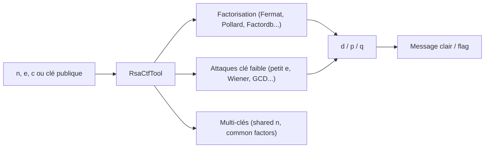

# RsaCtfTool — L'arsenal d'attaque RSA pour CTF

> [!info] **En 1 phrase**
> Attaque automatique des cryptosystèmes RSA fragiles : si `n`, `e`, `c` (ou `p`, `q`) traînent, RsaCtfTool trouve la clé et déchiffre le flag.

---

## Overview

| Champ | Valeur |
|---|---|
| Nom complet | RsaCtfTool |
| Description | Outil Python testant automatiquement des dizaines d'attaques RSA connues à partir de paramètres partiels |
| Catégorie | CTF & Développement |
| Sous-catégorie | Cryptographie / Crypto (CTF) |
| Fonction principale | Factoriser `n` ou exploiter une mauvaise génération de clés pour retrouver le clair |
| Type d'outil | CLI Python |
| Licence | GPL-3.0 (MIT pour certains modules) |
| Open source / propriétaire | Open source |
| Langage(s) de programmation | Python |
| Développeur / organisation | RsaCtfTool (projet communautaire, mainteneurs multiples) |
| Projet officiel | RsaCtfTool/RsaCtfTool |
| Dépôt officiel | https://github.com/RsaCtfTool/RsaCtfTool |
| Documentation officielle | https://github.com/RsaCtfTool/RsaCtfTool |
| État du projet | actif (branche master, pas de releases taguées) |
| Dernière version connue | master (au 15 mars 2026) |
| Systèmes compatibles | Linux, macOS, Windows (WSL) ; Python 3 |

> [!note] À vérifier
> RsaCtfTool n'a **pas de releases GitHub taguées** : on installe la branche `master`. Les attaques sont chargées dynamiquement depuis `attacks/single_key` et `attacks/multi_key`. Les dépendances (gmpy2, pycryptodome, sympy...) sont installées via `requirements.txt`.

---

## Concept

RsaCtfTool teste automatiquement une **trentaine d'attaques RSA connues** à partir de paramètres partiels : petit `e` (low exponent, cube root attack), `n` factorisable (FactorDB, Fermat, Pollard p-1, Williams p+1), `p`/`q` proches, `d` partiel, oracle, attaques sur `n` réutilisés (multi_key)... On lui fournit `n`, `e`, `c` (ou un fichier de clé publique `-p`, ou `--dumpkey`), et il tente chaque attaque jusqu'à retrouver le message clair. C'est l'outil incontournable des challenges crypto RSA où un seul paramètre est mal généré.

Il se place dans la **phase d'analyse crypto** d'un engagement/CTF : après avoir identifié un texte chiffré RSA (`c`, `n`, `e`), on lance RsaCtfTool pour tester les faiblesses classiques avant d'écrire une attaque manuelle. Complémentaire de [[Outil - CyberChef]] (qui déchiffre avec des clés connues) et des outils de cracking ([[Outil - hashcat]], [[Outil - John the Ripper]]) pour les clés dérivées de mots de passe.



---

## Concepts fondamentaux

| Concept | Explication |
|---|---|
| RSA | Chiffrement asymétrique : chiffré `c = m^e mod n`, déchiffré avec `d` |
| `n` | Modulus `n = p × q` (produit de deux nombres premiers) |
| `e` | Exposant public (souvent 65537) |
| `c` | Message chiffré (`c = m^e mod n`) |
| `d` | Exposant privé (`d = e^-1 mod φ(n)`) |
| Attaque | Faiblesse de génération de clés exploitable pour retrouver `p`/`q`/`d`/`m` |
| Single key vs Multi key | Attaques sur une clé seule vs plusieurs clés partageant des facteurs |
| FactorDB | Base de données en ligne de factorisations (`--is-valid` / Factordb) |
| Petit `e` | Si `e` est petit et `m` petit, `c` peut être une racine e-ième exacte |
| Wiener | Attaque quand `d` est petit (fraction continue) |
| GCD | Si deux clés partagent un facteur premier, `gcd(n1, n2)` les casse |
| `--dumpkey` | Affiche les paramètres détaillés d'une clé |

---

## Installation

### Debian / Ubuntu / Kali Linux

```bash
git clone https://github.com/RsaCtfTool/RsaCtfTool.git
cd RsaCtfTool
python3 -m pip install -r requirements.txt
```

### Arch Linux

```bash
git clone https://github.com/RsaCtfTool/RsaCtfTool.git
cd RsaCtfTool
python3 -m pip install -r requirements.txt
```

### macOS / Homebrew

```bash
git clone https://github.com/RsaCtfTool/RsaCtfTool.git
cd RsaCtfTool
python3 -m pip install -r requirements.txt
```

### Dépendances optionnelles

```bash
# Factorisation avancée (msieve, yafu)
sudo apt install msieve yafu
# SageMath (attaques symboliques)
sudo apt install sagemath
```

### Vérification

```bash
python3 RsaCtfTool.py --help
```

> [!warning] Prérequis & problèmes potentiels
> - `gmpy2` nécessite une lib GMP compilée (fournie par pip sur la plupart des systèmes).
> - L'outil cible les **clés semi-premières « textbook »** : les clés générées correctement (≥1024 bits bien formées) ne sont pas cassées — l'attaque vient d'une mauvaise génération de paramètres.
> - L'usage est destiné à l'éducation et aux engagements autorisés (voir la notice « educational purposes only » du dépôt).

---

## Configuration

| Paramètre | Rôle | Valeur possible | Impact | Exemple |
|---|---|---|---|---|
| `--publickey <file>` | Clé publique PEM | chemin | Base de l'attaque | `--publickey pub.pem` |
| `--private <file>` | Clé privée à utiliser | chemin | Déchiffrement direct | `--private priv.pem` |
| `--uncipherfile <file>` | Fichier contenant `c` | chemin | Texte chiffré à casser | `--uncipherfile c.bin` |
| `--uncipher <hex>` | `c` en hexadécimal | hex | Texte chiffré direct | `--uncipher 6c6f7665` |
| `--n <n>` / `--e <e>` | Paramètres directs | entiers | Attaque sans fichier | `--n 33 --e 7` |
| `--verbose` | Journalisation détaillée | flag | Comprendre les attaques | `--verbose` |
| `--attack <nom>` | Cibler une attaque | `wiener`, `fermat`... | Tester une attaque précise | `--attack wiener` |
| `--dumpkey` | Afficher les détails d'une clé | flag | Inspecter avant attaque | `--dumpkey --publickey pub.pem` |
| `--is-valid` | Vérifier la validité d'une clé | flag | Contrôle qualité | `--is-valid --publickey pub.pem` |
| `--factor` | Factoriser avec des outils externes | chemin msieve/yafu | Factorisation lourde | `--factor /usr/bin/msieve` |
| `--attack multi` | Activer les attaques multi-clés | flag | Plusieurs clés fournies | `--attack multi` |

> [!note] À vérifier
> La liste exacte des attaques et options évolue avec la branche master ; consulter `python3 RsaCtfTool.py --help` et le dossier `attacks/`.

---

## Architecture interne

- **Chargement dynamique des attaques** : le dossier `attacks/single_key` contient un fichier par attaque (fermat.py, wiener.py, smallfraction.py, factordb.py, gcd.py...) ; RsaCtfTool les charge et les exécute en séquence.
- **Multi_key** : `attacks/multi_key` regroupe les attaques nécessitant plusieurs clés (shared factor via GCD, common modulus).
- **Bibliothèque `lib`** : code commun (crypto math, parsing PEM, conversion, FactorDB, appel à Sage/msieve).
- **`RsaCtfTool.py`** : simple CLI qui orchestre le tout (parsing args, chargement, exécution, décryptage final).
- **Décryptage** : une fois `p`/`q`/`d` retrouvés, le clair est calculé (`pow(c, d, n)` avec gestion du padding éventuel).
- **Dépendances** : `gmpy2` (arithmétique rapide), `pycryptodome` (RSA/parsing), `sympy`, `requests` (FactorDB), `libnum`.

---

## Commandes

### Commandes principales

```bash
# Attaque automatique avec n, e, c en ligne de commande
python3 RsaCtfTool.py --n 90581 --e 123 --uncipher 67843

# Déchiffrer depuis un fichier de clé publique
python3 RsaCtfTool.py --publickey pub.pem --uncipherfile c.txt

# Inspecter une clé publique
python3 RsaCtfTool.py --dumpkey --publickey pub.pem
```

| Commande | Objectif | Résultat attendu |
|---|---|---|
| `--n <n> --e <e> --uncipher <c>` | Attaque directe | Message clair / flag |
| `--publickey <file>` | Attaque via clé PEM | Clair déchiffré |
| `--uncipherfile <file>` | Texte chiffré depuis fichier | Clair déchiffré |
| `--dumpkey` | Détails de la clé | n, e, d, p, q (si privé) |
| `--attack <nom>` | Tester une attaque précise | Succès/échec de l'attaque |
| `--verbose` | Logs détaillés | Progression des attaques |
| `--is-valid` | Vérifier la clé | Validité booléenne |
| `--private <file>` | Déchiffrer avec clé privée | Clair |

### Commandes avancées

```bash
# Cibler une attaque précise (Wiener)
python3 RsaCtfTool.py --n ... --e ... --uncipher ... --attack wiener

# Factorisation via msieve pour un grand n
python3 RsaCtfTool.py --n ... --e ... --uncipher ... --factor /usr/bin/msieve

# Multi-clés : rechercher des facteurs partagés
python3 RsaCtfTool.py --publickey pub1.pem --publickey pub2.pem --attack multi
```

---

## Options et flags

| Option | Description | Exemple | Niveau |
|---|---|---|---|
| `--n <n>` | Modulus | `--n 90581` | Basic |
| `--e <e>` | Exposant public | `--e 123` | Basic |
| `--uncipher <hex>` | Message chiffré | `--uncipher 68656c6c6f` | Basic |
| `--publickey <file>` | Clé publique PEM | `--publickey pub.pem` | Intermediate |
| `--private <file>` | Clé privée | `--private priv.pem` | Intermediate |
| `--uncipherfile <file>` | Fichier du clair chiffré | `--uncipherfile msg.bin` | Intermediate |
| `--attack <nom>` | Attaque ciblée | `--attack fermat` | Advanced |
| `--dumpkey` | Détails de la clé | `--dumpkey --publickey pub.pem` | Intermediate |
| `--verbose` | Logs détaillés | `--verbose` | Intermediate |
| `--is-valid` | Validité de la clé | `--is-valid --publickey pub.pem` | Intermediate |
| `--factor <path>` | Outil externe de factorisation | `--factor /usr/bin/yafu` | Advanced |
| `--attack multi` | Attaques multi-clés | `--attack multi` | Advanced |
| `--timeout <sec>` | Timeout global | `--timeout 60` | Expert |

> [!tip] Options les plus utiles au quotidien
> `--dumpkey` (inspecter), `--verbose` (comprendre les essais), `--attack <nom>` (cibler), `--factor` (factorisation lourde), `--attack multi` (clés partagées).

---

## Exemples pratiques

### Beginner

```bash
# Objectif : casser un petit RSA
python3 RsaCtfTool.py --n 90581 --e 123 --uncipher 67843
# Hacked! : flag{simple}
```

```bash
# Objectif : attaque automatique sur clé publique
python3 RsaCtfTool.py --publickey pub.pem --uncipherfile c.txt --verbose
```

### Intermediate

```bash
# Objectif : inspecter la clé avant attaque
python3 RsaCtfTool.py --dumpkey --publickey pub.pem
# n = ..., e = 65537, d = ... (si clé privée)
```

### Advanced

```bash
# Objectif : cibler une attaque précise (Fermat : p/q proches)
python3 RsaCtfTool.py --n ... --e ... --uncipher ... --attack fermat
```

### Expert

```bash
# Objectif : factoriser un gros n via msieve/yafu
python3 RsaCtfTool.py --n ... --e ... --uncipher ... --factor /usr/bin/msieve --verbose
```

---

## Workflow complet (scénario pas à pas)

1. **Étape 1 — Récupérer les paramètres** : dans l'énoncé CTF ou via `openssl rsa -in pub.pem -pubin -text -noout`.
2. **Étape 2 — Inspecter la clé** :
   ```bash
   python3 RsaCtfTool.py --dumpkey --publickey pub.pem
   ```
3. **Étape 3 — Lancer l'attaque automatique** :
   ```bash
   python3 RsaCtfTool.py --publickey pub.pem --uncipherfile c.txt --verbose
   ```
4. **Étape 4 — Si échec, tester des attaques ciblées** (`fermat`, `wiener`, `factordb`...) et des factorisations externes (`--factor`).
5. **Étape 5 — Vérifier le clair** : décoder (ASCII/hex) via [[Outil - CyberChef]] et chercher le flag.
6. **Étape 6 — Documenter** la technique utilisée (facteur trouvé, attaque) dans le rapport du challenge.

---

## Scénarios avancés

### Scénario 1 : n factorisable — p et q proches (Fermat)

```bash
python3 RsaCtfTool.py --n 90581 --e 123 --uncipher 67843 --attack fermat
# Trouve p = 269, q = 337
```

### Scénario 2 : deux clés partageant un facteur (GCD / multi)

```bash
python3 RsaCtfTool.py --publickey pub1.pem --publickey pub2.pem --attack multi
# gcd(n1, n2) = p partagé → les deux clés cassées
```

### Scénario 3 : petit e (cube root) — message court

```bash
python3 RsaCtfTool.py --n ... --e 3 --uncipher <petit_c>
# c = m^3 mod n : si m^3 < n, racine cubique directe
```

### Scénario 4 : attaque de Wiener (d petit)

```bash
python3 RsaCtfTool.py --n ... --e ... --uncipher ... --attack wiener
# Fraction continue : retrouve d
```

### Scénario 5 : déchiffrement direct avec clé privée fournie

```bash
python3 RsaCtfTool.py --private priv.pem --uncipherfile flag.enc
```

---

## Cybersecurity use cases

| Phase | Utilisation |
|---|---|
| Analyse crypto | Tester les faiblesses de clés RSA interceptées |
| CTF / crypto | Résoudre les challenges RSA mal générés |
| Évaluation | Audit de la génération de clés d'un système |
| Recherche | Factorisation et attaques sur paramètres faibles |
| Documentation | Fournir la preuve d'exploitation d'une clé faible |

---

## MITRE ATT&CK

| Tactique | Technique / Sub-technique | ID | Raison | Détection | Mitigation |
|---|---|---|---|---|---|
| Credential Access | Unauthorized Credentials / Cryptographic exploitation (analogie) | T1555 | Attaque sur des clés/chiffrements faibles pour récupérer des secrets | Supervision des opérations crypto | Génération de clés robuste |
| Collection | Data from Local System | T1005 | Lecture de fichiers chiffrés/clés sur un système | Monitoring des accès fichiers | Moindre privilège |
| Defense Evasion | Obfuscated Files or Information | T1027 | Déchiffrement de données obfusquées/chiffrées | Analyse statique | Chiffrement robuste |
| Execution | Command and Scripting Interpreter : Python | T1059.006 | Scripts d'attaque crypto Python | Détection d'exécutions Python anormales | Restriction interpréteurs |

> [!note] Ne renseigner que si l'association est réellement pertinente.
> RsaCtfTool exploite des **clés mal générées** : la technique la plus proche est le compromis de matériel cryptographique (analogie T1555/collecte) ; les mitigations sont avant tout la génération robuste des clés (≥2048 bits, bons paramètres).

---

## Defensive Security

### Signes observables

| Indicateur | Détail |
|---|---|
| Utilisation de RsaCtfTool sur un système | Recherche de clés faibles / collecte |
| Clés RSA courtes (512, 768 bits) | Génération de clés à remplacer |
| `n` partagés entre services | Mauvaise gestion de clés |
| Scripts Python de factorisation | Tentative de compromission crypto |

### Règles de détection (Sigma / Suricata / Snort / YARA)

```yaml
# Sigma — exécution de RsaCtfTool
title: RsaCtfTool Execution
id: a1b2c3d4-e5f6-4a7b-8c9d-0e1f2a3b4c5d
status: experimental
logsource:
    category: process_creation
    product: linux
detection:
    selection:
        Image|endswith: '/python3'
        CommandLine|contains: 'RsaCtfTool'
    condition: selection
falsepositives:
    - CTF and authorized crypto research
level: low
```

```yaml
# YARA — clé publique RSA courte (512 bits = n ~ 256 octets)
rule rsa_short_key
{
    strings:
        $pem = "-----BEGIN PUBLIC KEY-----"
    condition:
        $pem
}
```

> [!note] À vérifier
> Règles pédagogiques à adapter ; la défense réelle est la génération robuste des clés et l'audit des paramètres.

---

## Automatisation

```bash
# Boucle : tester plusieurs fichiers chiffrés contre une clé
for c in c1.bin c2.bin c3.bin; do
    python3 RsaCtfTool.py --publickey pub.pem --uncipherfile "$c" --verbose
done
```

```python
# Python : intégrer RsaCtfTool dans un script
import subprocess
out = subprocess.check_output(
    ["python3", "RsaCtfTool.py", "--publickey", "pub.pem",
     "--uncipherfile", "c.txt"], text=True, stderr=subprocess.STDOUT)
print("Hacked!" in out, out)
```

```python
# Python : parser le clair et chercher le flag
import subprocess, re
out = subprocess.check_output(
    ["python3", "RsaCtfTool.py", "--n", "90581", "--e", "123",
     "--uncipher", "67843"], text=True)
m = re.search(rb"[Ff]lag\{[^}]+\}", out.encode())
print(m.group().decode() if m else "no flag")
```

---

## Output et parsing

```bash
# Sortie type (verbose)
python3 RsaCtfTool.py --n ... --e ... --uncipher ... --verbose
# [*] Performing fermat attack...
# [+] Got p = 269 q = 337
# [+] Hacked! : flag{...}
```

```python
# Python : vérifier une clé puis lancer l'attaque
import subprocess
valid = subprocess.check_output(
    ["python3", "RsaCtfTool.py", "--is-valid", "--publickey", "pub.pem"],
    text=True)
if "True" in valid:
    out = subprocess.check_output(
        ["python3", "RsaCtfTool.py", "--publickey", "pub.pem",
         "--uncipherfile", "c.txt"], text=True)
    print(out)
```

```bash
# Extraire n et e d'une clé pour une attaque directe
openssl rsa -in pub.pem -pubin -text -noout
```

---

## Intégrations

```text
Clé/énoncé → dumpkey (RsaCtfTool) → attaque auto → clair → CyberChef (décodage) → flag
```

- [[Tools| Outils]]
- [[Outil - CyberChef]] — décodage du clair (ASCII/hex/base64) après déchiffrement
- [[Outil - pwntools]] — automatisation réseau si le déchiffrement est interactif
- [[Outil - binwalk]] — extraction de blobs contenant des clés/chiffrés
- [[Outil - hashcat]] / [[Outil - John the Ripper]] — cracking de clés dérivées de mots de passe
- [[10 - Cheatsheets| Cheatsheets]]

---

## Alternatives

| Outil | Avantages | Inconvénients | Cas d'usage |
|---|---|---|---|
| Python (gmpy2/libnum) | Contrôle total | Code à écrire | Attaques custom |
| SageMath | Symbolique, algèbre riche | Lourd | Attaques avancées |
| `openssl` | Déchiffrement standard | Pas d'attaques | Clé privée connue |
| factordb (site) | Factorisation en ligne | Pas de déchiffrement | Factoriser `n` |
| msieve/yafu | Factorisation très efficace | Config | Gros `n` |
| CyberChef RSA Decrypt | Interface graphique | Clés connues seulement | Déchiffrement simple |

> **Quand utiliser Sage/Python plutôt que RsaCtfTool ?** Pour les attaques non couvertes (bad padding, oracle custom, coppersmith avancé) ; RsaCtfTool couvre l'essentiel des challenges classiques en un appel.

---

## Performance

- **Attaques rapides** : Fermat, GCD, petit e, FactorDB s'exécutent en quelques secondes sur les clés courtes.
- **Factorisation lourde** : les grands `n` (≥1024 bits) nécessitent msieve/yafu — potentiellement des heures selon la taille.
- **FactorDB** : une requête HTTP ; la disponibilité de la base impacte le temps.
- **Timeout** : `--timeout` limite les attaques longues (utile en automatisation).
- **Multi-clés** : l'attaque multi est linéaire en nombre de clés (paires de GCD).

> [!note] À vérifier
> Les temps varient fortement selon la taille des clés et les outils externes ; pas de benchmark officiel.

---

## Troubleshooting

### Common problems

#### Problème : « No attack success » / Hacked absent

- **Cause** : clé bien générée (aucune faiblesse) ou paramètres incomplets.
- **Solution** : vérifier `--dumpkey`, tester des attaques ciblées, factoriser via msieve/yafu. **Vérif** : `--is-valid`.

#### Problème : erreur gmpy2 / pycryptodome manquant

- **Cause** : dépendances non installées.
- **Solution** : `python3 -m pip install -r requirements.txt`. **Vérif** : `python3 -c "import gmpy2"`.

#### Problème : clé PEM non reconnue

- **Cause** : format (DER vs PEM) ou mot de passe sur la clé.
- **Solution** : convertir avec `openssl rsa -inform DER -in key.der -outform PEM -out key.pem`. **Vérif** : `openssl rsa -in key.pem -pubin -text`.

#### Problème : `--uncipher` trop grand

- **Cause** : c > n (format invalide).
- **Solution** : vérifier la valeur de `c` ; récupérer `c` depuis le fichier (`--uncipherfile`). **Vérif** : comparer tailles hex.

---

## Sécurité de l'outil

- **Usage autorisé** : le dépôt précise un but **éducatif** — utiliser uniquement en CTF/lab/engagement autorisé.
- **FactorDB** : les requêtes partagent `n` avec un service tiers ; éviter avec des clés sensibles.
- **Outils externes** : msieve/yafu sont exécutés tels quels ; les installer de sources fiables.
- **Ne casse pas les clés robustes** : il n'existe pas de « magie » pour un RSA bien généré (≥2048 bits).

---

## Limitations

- **Clés textbook uniquement** : RsaCtfTool ne brise pas les clés correctement générées ; il exploite des **erreurs de génération**.
- **Pas d'oracle custom** : les attaques par oracle (padding) nécessitent des scripts dédiés.
- **Multi-clés** : limité aux attaques par facteurs partagés/paramètres communs.
- **Factorisation** : dépend d'outils externes pour les grands `n` (pas de factorisation magique).
- **Format PEM** : nécessite des conversions (DER, PKCS#8) pour certains énoncés.

---

## Cheatsheet

```bash
# Attaque directe n, e, c
python3 RsaCtfTool.py --n 90581 --e 123 --uncipher 67843
# Via clé publique
python3 RsaCtfTool.py --publickey pub.pem --uncipherfile c.txt
# Inspecter une clé
python3 RsaCtfTool.py --dumpkey --publickey pub.pem
# Vérifier une clé
python3 RsaCtfTool.py --is-valid --publickey pub.pem
# Attaques ciblées
python3 RsaCtfTool.py ... --attack fermat
python3 RsaCtfTool.py ... --attack wiener
python3 RsaCtfTool.py ... --attack factordb
# Multi-clés
python3 RsaCtfTool.py --publickey a.pem --publickey b.pem --attack multi
# Factorisation externe
python3 RsaCtfTool.py ... --factor /usr/bin/msieve
# Déchiffrer avec clé privée
python3 RsaCtfTool.py --private priv.pem --uncipherfile flag.enc
```

---

## Quick reference

| | |
|---|---|
| **À quoi sert-il ?** | Casser les clés RSA mal générées et déchiffrer les messages |
| **Quand l'utiliser ?** | Dès qu'un RSA avec paramètres faibles est identifié |
| **Commande principale** | `python3 RsaCtfTool.py --n <n> --e <e> --uncipher <c>` |
| **Alternative principale** | Python/Sage, msieve/yafu, factordb |
| **Concepts importants** | p/q, FactorDB, Fermat, Wiener, petit e, GCD multi |
| **Liens associés** | [[Outil - CyberChef]] · [[Outil - hashcat]] · [[Outil - binwalk]] |

---

## Détection & Défense

| Signe | Défense |
|---|---|
| Clés RSA 512/768 bits en service | Générer des clés ≥2048 bits |
| `n` partagés entre services | Clés uniques par service |
| RsaCtfTool sur un endpoint | Restriction d'outils, supervision |
| Échec de factorisation des gros `n` | Auditer les générateurs de clés |

---

## Tips & Pièges

> [!tip] **Tips**
> - Lancez d'abord l'attaque automatique avec `--verbose` : elle affiche chaque essai.
> - `--dumpkey` avant d'attaquer permet de voir `e` (petit `e` → attaque racine).
> - Pensez à **FactorDB** : si `n` a déjà été factorisé, l'attaque est instantanée.
> - Pour les challenges, la clé privée est parfois fournie : `--private` déchiffre directement.
> - Recoupez le clair avec [[Outil - CyberChef]] (ASCII, hex, base64) avant de conclure.

> [!warning] **Pièges**
> - Ne confondez pas `n` et `c` : inverser les valeurs ne donne rien.
> - `e = 3` avec `m^3 > n` : la racine cubique directe échoue (il faut `m^3 = c + k*n`).
> - Le `--uncipher` attend de l'hexadécimal ; un fichier chiffré brut → `--uncipherfile`.
> - Les clés robustes (≥2048 bits bien formées) ne se cassent pas : ne perdez pas de temps.
> - L'outil ne fonctionne pas si `n` est bien généré (clés à 1024 bits bien formées) : l'attaque vient d'une mauvaise génération de paramètres.

---

## References

### Official

- Dépôt officiel : https://github.com/RsaCtfTool/RsaCtfTool
- Dossiers d'attaques : https://github.com/RsaCtfTool/RsaCtfTool/tree/master/attacks
- Exigences (requirements) : https://github.com/RsaCtfTool/RsaCtfTool/blob/master/requirements.txt

### Security references

- MITRE ATT&CK T1555 — Credentials from Password Stores (analogie) : https://attack.mitre.org/techniques/T1555/
- MITRE ATT&CK T1005 — Data from Local System : https://attack.mitre.org/techniques/T1005/
- MITRE ATT&CK T1027 — Obfuscated Files or Information : https://attack.mitre.org/techniques/T1027/
- MITRE ATT&CK T1059.006 — Python : https://attack.mitre.org/techniques/T1059/006/

### Community

- Factordb : http://factordb.com/
- HackTricks — RSA : https://book.hacktricks.xyz/crypto-and-stego/rsa-algorithms
- CTF 101 — RSA : https://ctf101.org/cryptography/what-is-rsa/

---

**Liens :** [[Tools| Outils]] · [[Outil - CyberChef| CyberChef]] · [[Outil - pwntools| pwntools]] · [[Outil - hashcat| hashcat]] · [[Outil - John the Ripper| John the Ripper]] · [[Outil - binwalk| binwalk]] · [[Outil - gdb-peda| gdb-peda]] · [[Outil - ROPgadget| ROPgadget]]
