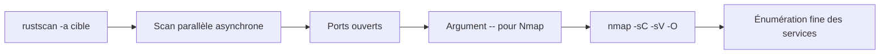
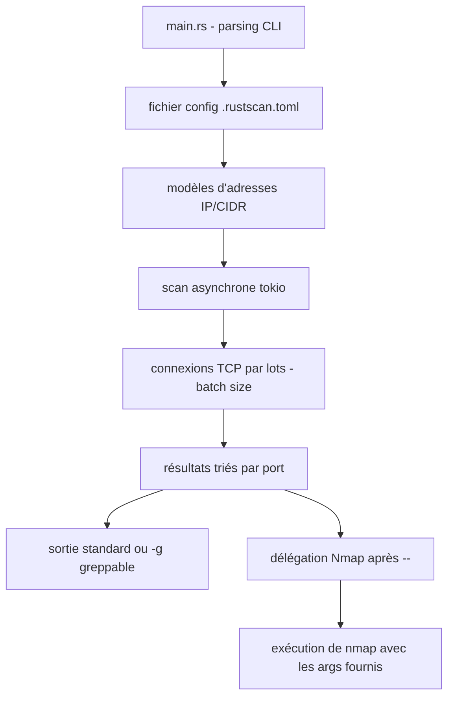

# RustScan — Scan de ports ultra-rapide, relais vers Nmap

> [!info] **En 1 phrase**
> RustScan est un scanner de ports ultra-rapide écrit en Rust qui découvre tous les ports ouverts en quelques secondes puis délègue automatiquement l'analyse fine à Nmap.

---

## Overview

| Champ | Valeur |
|---|---|
| Nom complet | RustScan |
| Description | Scanner de ports massivement parallèle en Rust (TCP connect) qui trouve les ports ouverts en secondes et délègue l'énumération à Nmap via l'argument `--` |
| Catégorie | Reconnaissance & OSINT |
| Sous-catégorie | Scan & Énumération |
| Fonction principale | Découverte rapide de tous les ports ouverts (1-65535) puis analyse fine par Nmap |
| Type d'outil | CLI (binaire unique Rust, `cargo install` / releases / paquets apt) |
| Licence | GPL-3.0 |
| Open source / propriétaire | Open source |
| Langage(s) de programmation | Rust (async via tokio) |
| Développeur / organisation | bee-san (scyphose) |
| Projet officiel | https://github.com/RustScan/RustScan |
| Dépôt officiel | https://github.com/RustScan/RustScan |
| Documentation officielle | https://github.com/RustScan/RustScan/wiki |
| Date de création | 2020 (premières versions publiques) |
| État du projet | actif |
| Dernière version connue | 2.4.1 (2025-02-23) |
| Systèmes compatibles | Linux, macOS (Homebrew), Windows (binaire .zip), Docker ; binaire deb pour Debian/Ubuntu/Kali |

> [!note] Pour vérifier / compléter
> RustScan fonctionne **sans privilèges root** grâce à un TCP connect scan asynchrone : pas de sockets bruts. Le paquet `rustscan.deb` officiel est disponible sur les releases GitHub, et `apt install rustscan` est fourni sur Kali.

---

## Concept

RustScan est le « disrupteur » de la phase de scan : il effectue un scan massivement parallèle et trouve les ports ouverts d'une machine en **moins de 2 secondes**, là où `nmap -p-` prend plusieurs minutes. Il utilise un **TCP connect scan** parallélisé en lots (batch size) avec des sockets asynchrones (tokio), ce qui lui permet de fonctionner sans privilèges root.

Sa particularité : il **passe automatiquement le relais à Nmap** sur les ports découverts via l'argument `--` (`rustscan -a cible -- -sC -sV -O`). Le motif d'utilisation type : RustScan pour la découverte (rapide, sans version), Nmap pour la profondeur (versions, scripts NSE, OS). Très populaire sur THM/HTB, il s'insère au début de la chaîne de reconnaissance : découverte de ports rapide → énumération fine par Nmap → attaque ciblée des services ouverts.



---

## Concepts fondamentaux

| Concept | Explication |
|---|---|
| TCP connect scan | Complète le 3-way handshake par socket async : pas de root, mais connexions complètes visibles côté cible |
| Batch size (`-b`) | Nombre de ports traités en parallèle (défaut 4500) : un lot trop gros peut saturer et faire rater des ports |
| Timeout (`-t`) | Délai en ms avant de déclarer un port fermé (défaut 1500). Un timeout trop court provoque des faux négatifs sur les services lents |
| Délégation Nmap (`--`) | Tout ce qui suit `--` est passé tel quel à Nmap : `rustscan -a <ip> -- -sC -sV -O` |
| Greppable (`-g`) | Sortie condensée `host:port` exploitable par grep/awk dans des pipelines |
| Ulimit (`-u`) | Augmente la limite système de fichiers ouverts pour éviter « too many open files » |
| Fichier de config | `~/.rustscan.toml` pré-définit toutes les options CLI ; la ligne de commande reste prioritaire, `-n` l'ignore |
| `-n` (no-config) | Désactive le fichier de config `.rustscan.toml` — ce n'est PAS un mode « no DNS » |

---

## Installation

### Binaire officiel (Debian/Ubuntu/Kali)

```bash
wget https://github.com/RustScan/RustScan/releases/latest/download/rustscan.deb
sudo dpkg -i rustscan.deb

# Kali / Debian : paquet dans les dépôts
sudo apt update && sudo apt install -y rustscan
```

### Via Cargo (source)

```bash
cargo install rustscan
```

### macOS / Homebrew

```bash
brew install rustscan
```

### Windows

```bash
# Télécharger le binaire .zip depuis les releases GitHub (rustscan.exe)
# Le placer dans un dossier du PATH, puis lancer depuis PowerShell.
```

### Vérification

```bash
rustscan --version
rustscan --help
```

---

## Configuration

### Fichier de configuration `~/.rustscan.toml`

Toutes les options CLI peuvent y être pré-définies. La ligne de commande reste prioritaire ; `-n` ignore ce fichier.

```toml
batch-size = 2000
timeout = 2000
greppable = true
ports = [22, 80, 443, 445, 3389]
exclude = ["10.0.0.1", "10.0.0.0/31"]
# exemples d'options supplémentaires
# range = "1-65535"
# ulimit = 4096
# quiet = true
```

| Option de config | Équivalent CLI | Rôle |
|---|---|---|
| `batch-size` | `-b` | Taille des lots parallèles |
| `timeout` | `-t` | Timeout en millisecondes |
| `greppable` | `-g` | Sortie condensée par défaut |
| `ports` | `-p` | Liste de ports |
| `exclude` | `-e` | Adresses / plages exclues |
| `range` | `-r` | Plage de ports |
| `ulimit` | `-u` | Limite de fichiers ouverts |
| `quiet` | `-q` | Masque la bannière |

---

## Architecture interne



- **Parsing** : les adresses acceptent IP simple, CIDR (`10.10.10.0/24`), plages et listes séparées par virgules (`-a`).
- **Scan asynchrone** : basé sur `tokio` ; chaque lot (`batch-size`) ouvre `batch-size` connexions TCP concurrentes. Le timeout `-t` par port détermine la durée totale du scan.
- **Tri et sortie** : les ports ouverts sont triés numériquement. En mode normal, RustScan affiche sa bannière puis la liste ; en `-g` il n'affiche que `host:port` sur une ligne.
- **Délégation Nmap** : tout ce qui suit `--` est ajouté à la commande `nmap <cible> -p <ports trouvés> <args>` exécutée en sous-processus.

---

## Commandes

### Commandes essentielles

```bash
# Scan rapide + délégation automatique à Nmap (toujours après le --)
rustscan -a 10.10.10.10 -- -sC -sV -O

# Scan d'un réseau entier avec batch size et timeout ajustés
rustscan -a 10.10.10.0/24 -b 1500 -t 2000 -n -- -sV

# Plage de ports personnalisée + exclusion d'adresses
rustscan -a 10.10.10.10 -r 1-10000 -e 22,25 -- -sC

# Sortie « greppable » pour automatiser le traitement
rustscan -a 10.10.10.10 -g

# Scan sans config et sans délégation
rustscan -a 10.10.10.10 -n -q
```

### Options principales

| Option | Effet |
|---|---|
| `-a, --addresses <IP>` | Liste d'adresses : IP, CIDR ou plages (séparées par des virgules) |
| `-b, --batch-size <N>` | Taille des lots de ports traités en parallèle (défaut 4500) |
| `-t, --timeout <ms>` | Délai en millisecondes avant de considérer un port fermé (défaut 1500) |
| `-r, --range <N-N>` | Plage de ports à scanner (défaut 1-65535) |
| `-p, --ports <N>` | Liste de ports précis à scanner |
| `-e, --exclude <IP>` | Adresses ou plages à exclure du scan |
| `-g, --greppable` | Sortie condensée, exploitable par grep et les scripts |
| `-n, --no-config` | Ignore le fichier de config `.rustscan.toml` |
| `-u, --ulimit <N>` | Augmente la limite de fichiers ouverts (évite « too many open files ») |
| `-q, --quiet` | Supprime la bannière et l'info de démarrage |

---

## Options et flags (détail)

| Flag | Défaut | Description |
|---|---|---|
| `-a` | requis | Cible(s) : `10.10.10.10`, `10.10.10.0/24`, `10.10.10.1-50` ou liste |
| `-b` | 4500 | Taille des lots parallèles ; réduire si faux négatifs |
| `-t` | 1500 | Timeout par port (ms) ; augmenter pour les réseaux lents |
| `-r` | 1-65535 | Plage de ports |
| `-p` | — | Liste de ports précis (ex : `22,80,443`) |
| `-e` | — | Exclusions (IP ou CIDR) |
| `-g` | false | Sortie greppable `host:port` |
| `-n` | false | Ignore `.rustscan.toml` |
| `-u` | système | Raised limit sur le nombre de fichiers ouverts |
| `-q` | false | Mode silencieux |
| `--` | — | Tout ce qui suit est transmis à Nmap |

---

## Exemples pratiques

### Scan simple d'une machine

```bash
rustscan -a 10.10.10.10 -n
```

### Scan avec énumération Nmap complète

```bash
rustscan -a 10.10.10.10 -- -sC -sV -O
```

### Scan d'une plage de ports réduite

```bash
rustscan -a 10.10.10.10 -r 1-10000
```

### Sortie greppable pour pipeline

```bash
rustscan -a 10.10.10.10 -g
```

### Scan multi-cibles

```bash
rustscan -a 10.10.10.10,10.10.10.11,10.10.10.12 -g
```

### Scan d'un réseau entier

```bash
rustscan -a 10.10.10.0/24 -b 1500 -t 2500 -n
```

---

## Workflow complet (scénario pas à pas)

1. **Étape 1 — Scan de découverte** : identifier les ports ouverts de la cible en quelques secondes.
   ```bash
   rustscan -a 10.10.10.10 -n
   ```
2. **Étape 2 — Délégation Nmap** : laisser Nmap énumérer finement les ports trouvés.
   ```bash
   rustscan -a 10.10.10.10 -- -sC -sV -O
   ```
3. **Étape 3 — Ajustement** : si des ports sont manqués, réduire le batch et monter le timeout.
   ```bash
   rustscan -a 10.10.10.10 -b 500 -t 3000 -- -sC -sV
   ```
4. **Étape 4 — Exploitation des services** : sur les versions récupérées, lancer searchsploit / scripts NSE.
   ```bash
   searchsploit "Apache 2.4" ; nmap -p 80 --script=http-title 10.10.10.10
   ```
5. **Étape 5 — Sauvegarde propre** : exporter les résultats pour le rapport d'audit.
   ```bash
   rustscan -a 10.10.10.10 -n -- -sV -oA nmap/resultat
   ```

---

## Scénarios avancés

### Scénario 1 : Scan massif d'un réseau /24 et export structuré

Cartographier tout un segment en limitant l'impact réseau.

```bash
# Batch réduit + timeout élevé pour éviter les faux négatifs sur un gros réseau
rustscan -a 192.168.1.0/24 -b 1000 -t 2500 -e 192.168.1.1 -- -sV -oG network_scan.gnmap

# Analyser la sortie greppable avec grep
rustscan -a 192.168.1.0/24 -g | tr ',' '\n' | sort -n | uniq -c
```

### Scénario 2 : Pipeline automatisé scan → fuzzing web

Enchaîner la découverte de ports avec l'énumération web des services HTTP détectés.

```bash
# 1. Découvrir les ports ouverts en sortie greppable
rustscan -a 10.10.10.10 -g

# 2. Générer un script Nmap prêt à l'emploi sur les ports trouvés
rustscan -a 10.10.10.10 -g | tr ',' '\n' | while read p; do
  rustscan -a 10.10.10.10 -p "$p" -- -sC -sV -oN scan_port"$p".txt
done

# 3. Sur un port 80/8080 détecté, lancer ffuf sur les répertoires
ffuf -u http://10.10.10.10/FUZZ -w /usr/share/wordlists/dirb/common.txt -mc 200,301
```

### Scénario 3 : Intégration dans un script de box (HTB/THM)

```bash
#!/bin/bash
IP="$1"
mkdir -p nmap
rustscan -a "$IP" -g -n | tee nmap/ports.txt
PORTS=$(tr '\n' ' ' < nmap/ports.txt | tr ',' ' ')
nmap -sC -sV -p "$PORTS" -oA nmap/full "$IP"
```

---

## Cybersecurity use cases

| Cas d'usage | Exemple concret |
|---|---|
| Pentest (recon initiale) | Trouver tous les ports ouverts d'une machine en < 5 s avant d'attaquer les services |
| CTF (HTB/THM) | Scan complet 1-65535 d'une box en quelques secondes, puis délégation `-sC -sV` |
| Cartographie réseau | Scan d'un /24 complet en une commande, sortie greppable pour la reprise |
| Red Team | Découverte rapide des services exposés sur un segment avant exploitation |
| Bug bounty | Scan ciblé des ports d'un scope précis avec exclusion des adresses hors scope |

---

## MITRE ATT&CK

| Technique | ID | Rapport avec RustScan |
|---|---|---|
| Active Scanning: Port Scan | T1595.001 | Découverte des ports ouverts via TCP connect parallèle |
| Network Service Discovery | T1046 | Identification des services exposés (relay Nmap `-sV`) |
| Valid Accounts / Exploitation | T1078 / T1210 | Les résultats alimentent l'attaque des services découverts |
| Gather Victim Host Information | T1590 | Cartographie réseau (CIDR, plages) |

---

## Defensive Security

| Usage défensif | Description |
|---|---|
| Audit de périmètre | Vérifier rapidement quels ports sont réellement exposés sur les machines publiques |
| Validation de règles firewall | Comparer les ports ouverts détectés avec la matrice de règles attendue |
| Sweep de ports | Détection d'ouverture inattendue de ports sur des serveurs sensibles |
| Test de détection | Vérifier que les IDS détectent bien un TCP connect scan massif |

> [!warning] Contexte
> Le TCP connect scan de RustScan complète de vraies connexions TCP : l'activité est visible dans les logs de connexion de la cible, contrairement à un SYN scan silencieux. À utiliser uniquement avec autorisation.

---

## Automatisation

### Sortie greppable dans un pipeline

```bash
rustscan -a 10.10.10.0/24 -g | while read line; do
  host=$(echo "$line" | cut -d: -f1)
  ports=$(echo "$line" | cut -d: -f2 | tr ',' ' ')
  echo "$host : $ports"
done
```

### Script de scan complet automatique

```bash
#!/bin/bash
set -e
IP=${1:?Usage: $0 <ip>}
OUT="nmap_$(echo "$IP" | tr '/' '_')"
rustscan -a "$IP" -n -u 4096 -g | tee ports_$OUT.txt
nmap -sC -sV -p "$(rustscan -a "$IP" -g -n | cut -d: -f2 | tr ',' ',')" \
  -oA "$OUT" "$IP"
```

### Cron / CI

```bash
# Audit hebdomadaire d'un hôte critique
0 3 * * 1 rustscan -a 10.10.10.10 -g -n >> /var/log/rustscan-audit.log 2>&1
```

---

## Output et parsing

### Format normal

```
PORT STATE SERVICE REASON
22/tcp open ssh syn-ack
80/tcp open http syn-ack
443/tcp open https syn-ack
Nmap done: 1 IP address (1 host up) scanned in 0.03 seconds
```

### Format greppable (`-g`)

```bash
10.10.10.10:22,80,443
```

### Parsing courant

```bash
# Extraire la liste des ports
rustscan -a 10.10.10.10 -g | cut -d: -f2 | tr ',' ' '

# Compter les ports par hôte
rustscan -a 10.10.10.0/24 -g | awk -F: '{print NF-1}'
```

---

## Intégrations

| Outil | Intégration |
|---|---|
| [[Outil - Nmap\|Nmap]] | Délégation automatique via `--` : `rustscan -a <ip> -- -sC -sV -O` |
| [[Outil - httpx\|httpx]] | Les ports HTTP trouvés (`80,443,8080`) alimentent le probing des hôtes |
| [[Outil - ffuf\|ffuf]] / [[Outil - gobuster\|gobuster]] | Fuzzing des services web découverts |
| [[Outil - naabu\|naabu]] | Alternative ProjectDiscovery : SYN scan + sortie host:port pour httpx/nuclei |
| [[Outil - Masscan\|Masscan]] | Alternative SYN scan ultra-rapide, nécessite root |
| [[Outil - Metasploit\|Metasploit]] | Les ports/services découverts orientent le choix des modules d'exploitation |
| [[Outil - searchsploit\|SearchSploit]] | Recherche d'exploits pour les versions de services identifiées |

---

## Alternatives

| Outil | Différence clé |
|---|---|
| [[Outil - Nmap\|Nmap]] | Plus complet (SYN, NSE, OS, UDP) mais plus lent sur `-p-` |
| [[Outil - Masscan\|Masscan]] | SYN scan très rapide, nécessite root et une config précise |
| [[Outil - naabu\|naabu]] | SYN scan + sortie pipelinable + délégation Nmap, suite ProjectDiscovery |
| Unicornscan / Zmap | Alternative rapide en réseau mais moins orientée port scan + service |
| `nc -zv` | Simple et lent, sans délégation ni parallélisation |

---

## Performance

| Facteur | Impact |
|---|---|
| Batch size | `-b 4500` par défaut ; des lots trop grands saturent et causent des faux négatifs |
| Timeout | `-t 1500` ms par défaut ; monter à 2000-3000 sur réseaux lents / services lents |
| Ulimit | Sans `-u`, « too many open files » sur les gros scans |
| Réseau | La bande passante et la latence bornent la vitesse réelle |
| Fichier de config | Permet des valeurs stables en production (`batch-size`, `timeout`) |

---

## Troubleshooting

| Problème | Cause probable | Solution |
|---|---|---|
| `Too many open files` | Limite système dépassée | `-u 4096` ou augmenter le ulimit système |
| Ports manqués sur les services lents | Timeout trop court | `-t 3000` (ou plus) |
| Ports manqués en masse | Batch size trop gros | Réduire `-b` (500-1000) |
| Nmap ne reçoit rien | `--` oublié | Écrire `rustscan -a <ip> -- -sC -sV` |
| Scan très lent sur gros réseau | Timeout par défaut cumulé | Réduire le timeout raisonnablement + gros batch |
| Le fichier `.rustscan.toml` est ignoré | `-n` utilisé ou mauvaise syntaxe | Retirer `-n` ; vérifier le format TOML |
| Bannière polluante dans les scripts | Mode verbeux | Utiliser `-q` et/ou `-g` |
| Erreur de format d'adresse | Plage invalide | Vérifier `10.10.10.1-50`, `10.10.10.0/24`, listes séparées par virgules |

---

## Sécurité de l'outil

| Point | Détail |
|---|---|
| Pas de root requis | TCP connect scan : aucun socket brut, plus simple à opérer |
| Visibilité | Les connexions complètes apparaissent dans les logs de connexion / IDS |
| Config locale | `.rustscan.toml` peut contenir des cibles : ne pas la versionner si sensible |
| Binaire signé | Les releases GitHub sont hashées ; vérifier l'intégrité (SHA256) |
| Mise à jour | Suivre les releases (actives) ; `cargo install --force rustscan` |
| Usage | Le scan d'une cible sans autorisation reste illégal dans la plupart des juridictions |

---

## Limitations

| Limitation | Détail |
|---|---|
| Pas de détection de version | RustScan ne fait que la découverte de ports ; `-sV` via Nmap nécessaire |
| Pas de SYN scan | TCP connect uniquement (bruyant, pas de root requis) |
| Pas de scan UDP | Les ports UDP ne sont pas couverts |
| Pas de scripts NSE | Fonctionnalité exclusivement déléguée à Nmap |
| Faux négatifs possibles | Réseaux lents / filtrage / rate-limit causent des ports manqués sans ajustement |
| Sortie limitée | Normal / greppable ; pas de JSON natif complet |

---

## Cheatsheet

```bash
# Scan de découverte
rustscan -a 10.10.10.10 -n

# Scan + Nmap complet
rustscan -a 10.10.10.10 -- -sC -sV -O

# Réseau entier, réglé pour éviter les faux négatifs
rustscan -a 10.10.10.0/24 -b 1000 -t 3000 -n

# Sortie greppable
rustscan -a 10.10.10.10 -g

# Ports précis + exclusions
rustscan -a 10.10.10.10 -p 22,80,443 -e 10.10.10.1

# Config ignorée + silencieux
rustscan -a 10.10.10.10 -n -q
```

---

## Quick reference

| Action | Commande |
|---|---|
| Scan complet d'un hôte | `rustscan -a <ip>` |
| Scan + Nmap | `rustscan -a <ip> -- -sC -sV` |
| Sortie scriptable | `rustscan -a <ip> -g` |
| Ajuster la fiabilité | `-b 500 -t 3000` |
| Éviter « too many open files » | `-u 4096` |
| Ignorer la config | `-n` |
| Scan multi-cibles | `-a ip1,ip2` / `-a 10.10.10.0/24` |

---

## Détection & Défense

| Signe | Défense |
|---|---|
| Rafale de connexions TCP complètes vers des ports variés (TCP connect scan) | IDS/IPS : règles de rate-limit et alertes de type sweep de ports |
| Connexions courtes puis fermetures immédiates sur des ports successifs | Surveiller les pics de connexions entrantes non établies (NetFlow, Zeek) |
| Scan trop rapide pour les IDS à signature lente | Activer le préprocesseur de scan de ports (ex. `sfportscan` de Snort) |
| Faux négatifs sur les services lents (timeout trop court) | Côté défenseur : réduire la surface exposée, fermer les ports non nécessaires |
| Trafic identifié comme masscan/nmap/rustscan | SYN cookies côté pare-feu + filtrage egress/ingress |

---

## Tips & Pièges

> [!tip] **Toujours écrire `--` avant les options Nmap**
> Sans `--`, RustScan ne transmet rien et se contente du scan de ports : `rustscan -a <ip> -- -sC -sV`.

> [!tip] `-u` évite « too many open files »**
> Sur Linux, ajouter `-u` (ou `--ulimit`) lors des gros scans pour lever la limite système de descripteurs.

> [!tip] **La sortie `-g` est faite pour les scripts**
> Pipe-la vers grep/awk/while pour automatiser tes workflows.

> [!warning] **Batch + timeout = équilibre**
> Un batch size énorme avec un timeout court peut faire rater des ports : en cas de doute, `-b 500 -t 3000`.

> [!warning] **Pas de version sans Nmap**
> RustScan ne fait pas de détection de version : sans délégation Nmap (`-- -sV`), tu n'obtiens que des ports, pas les services.

> [!warning] `-n` ≠ « no DNS »**
> `-n` signifie « no config file » (pas de `.rustscan.toml`), pas « no DNS » : ne te trompe pas sur sa sémantique.

> [!danger] **TCP connect = bruyant**
> Les connexions TCP complètes sont visibles côté cible : réserver le scan aux périmètres autorisés.

---

## References

### Official
- [Dépôt officiel — RustScan](https://github.com/RustScan/RustScan)
- [Wiki / Documentation](https://github.com/RustScan/RustScan/wiki)
- [Releases (binaries .deb / .zip)](https://github.com/RustScan/RustScan/releases)

### Security
- [Kali Tools — RustScan](https://www.kali.org/tools/rustscan/)
- [MITRE ATT&CK — Network Service Discovery T1046](https://attack.mitre.org/techniques/T1046/)
- [MITRE ATT&CK — Port Scan T1595.001](https://attack.mitre.org/techniques/T1595/001/)

### Community
- [Articles et cheatsheets RustScan (community)](https://gist.github.com/)

---

**Liens :** [[Tools| Outils]] · [[02 - Scan & Énumération| Scan & Énum]] · [[Outil - Nmap| Nmap]] · [[Outil - naabu| naabu]] · [[Outil - Masscan| Masscan]]
