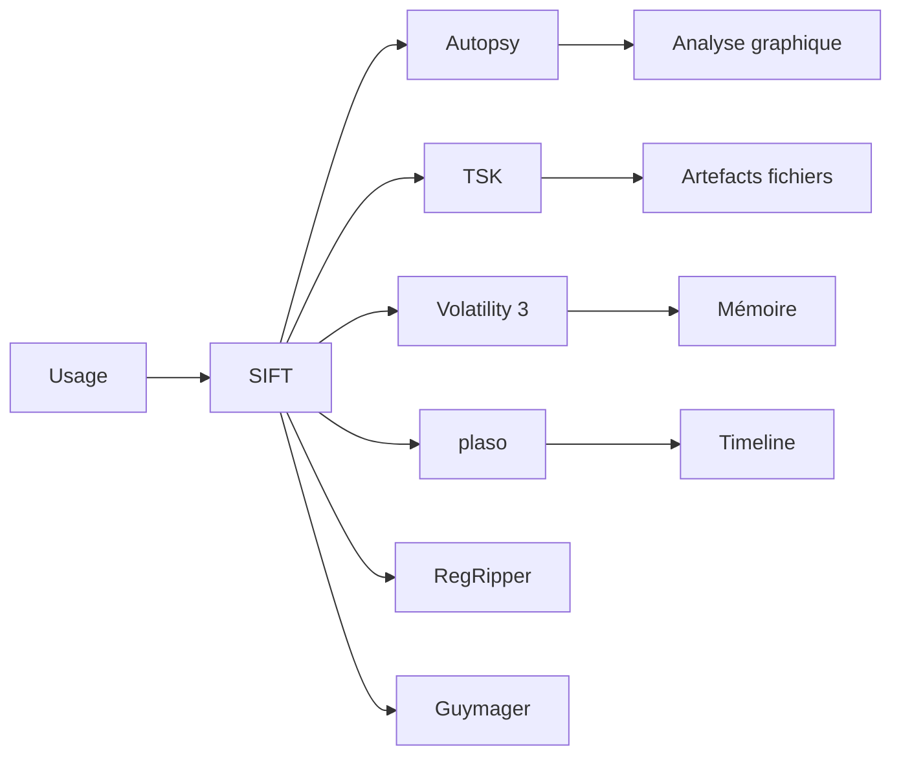

# 🔬 SIFT Workstation — L'investigation numérique avec les outils SANS (DFIR)

> [!info] **En 1 phrase**
> SIFT Workstation est une distribution Linux (Ubuntu, SANS) spécialisée dans l'investigation numérique (forensics disque, mémoire et fichiers supprimés), préinstallée avec Autopsy, The Sleuth Kit, Volatility et log2timeline/plaso.

---

## 🧾 Overview

| Champ | Valeur |
|---|---|
| Nom complet | SIFT Workstation (SANS Investigative Forensic Toolkit) |
| Description | Distribution Linux d'investigation numérique : forensics disque, mémoire, registre, timeline |
| Catégorie | 🐧 Distributions & Lab |
| Sous-catégorie | Distribution DFIR / incident response |
| Fonction principale | Analyser des artefacts forensics (images disque, RAM, registre) après un incident |
| Type d'outil | Machine virtuelle/ISO préinstallée + installateur Cast |
| Licence | GPL-3.0 et licences variées (outils individuels) |
| Open source / propriétaire | Open source (créée par SANS, initiée par Rob Lee) |
| Langage(s) | Shell, Python |
| Développeur / organisation | SANS Institute / teamdfir (Rob Lee) |
| Projet officiel | teamdfir/sift |
| Dépôt officiel | https://github.com/teamdfir/sift |
| Documentation officielle | https://github.com/teamdfir/sift/blob/main/README.md |
| Date de création | 2009 (première version) |
| État du projet | actif (v2.0.x, base Ubuntu 24.04) |
| Dernière version connue | 2.0.3 (2025-02-25) |
| Systèmes compatibles | Ubuntu 24.04 LTS (x86_64) |

> [!note] Pour vérifier / compléter
> L'ISO/OVA officielle est mise à jour régulièrement (OVA ~8,81 Go, image mise à jour le 2026-04-24). Compte par défaut : `sansforensics` (mot de passe `forensics`). Les clés SSH sont réinitialisées à chaque snapshot officiel.

---

## 🎯 Concept

SIFT Workstation est la **boîte à outils DFIR de référence du SANS** : une distribution Ubuntu préinstallée avec les outils majeurs de l'investigation numérique — **Autopsy** (interface graphique), **The Sleuth Kit** (analyse du système de fichiers), **Volatility 3** (mémoire), **plaso/log2timeline** (timeline), **RegRipper** (registre Windows), **bulk_extractor**, **ewfacquire** (acquisition EWF), **Guymager** (imagerie disque). Créée par **Rob Lee** en 2009, elle est maintenue par l'équipe **teamdfir** et s'installe aujourd'hui via **Cast** sur Ubuntu 24.04 LTS.

L'investigateur commence par **acquérir** l'image (Guymager/ewfacquire) ou la **mémoire** (lime), puis monte l'image en lecture seule, extrait les artefacts avec TSK/Autopsy, reconstruit la **timeline** avec plaso (log2timeline + psort), et corrèle avec les **IOC** (YARA, bulk_extractor). SIFT sert d'environnement de travail pour l'ensemble du processus DFIR : tri, analyse, documentation.



---

## 🧠 Concepts fondamentaux

| Concept | Explication |
|---|---|
| DFIR | Digital Forensics & Incident Response : investigation et réponse aux incidents |
| Acquisition | Copie légale d'un disque/mémoire (bitstream) via Guymager, ewfacquire, dc3dd |
| Image forensics | Copie exacte (dd/EWF/AFF) : on n'analyse jamais le disque d'origine en écriture |
| The Sleuth Kit (TSK) | Suite CLI d'analyse du système de fichiers (NTFS, EXT4, FAT) |
| Autopsy | Interface graphique sur TSK : navigation, mots-clés, carnet d'investigation |
| Volatility 3 | Analyse de la mémoire volatile (processus, connexions, artefacts) |
| plaso / log2timeline | Création de timelines unifiées à partir d'artefacts (SuperTimeline) |
| RegRipper | Extraction d'artefacts du registre Windows (SAM, SYSTEM, SOFTWARE…) |
| bulk_extractor | Extraction de features (URLs, emails, hashes) sans montage du système de fichiers |
| Timeline/SuperTimeline | Chronologie des événements d'un système pour reconstituer l'incident |

---

## 🛠️ Installation

### Options d'installation

```bash
# Option A : télécharger l'OVA officielle (SANS)
# https://www.sans.org/tools/sift-workstation/
# -> importer dans VMware/VirtualBox (compte : sansforensics / forensics)

# Option B : installer SIFT sur Ubuntu 24.04 via Cast
wget https://artifacts.sans.org/forensics/ubuntu/24.04/cast-latest.deb
sudo dpkg -i cast-latest.deb
sudo apt-get install -f -y

# Lancer l'installation de SIFT
sudo cast install teamdfir/sift
```

### Vérification

```bash
sansforensics@sift:~$ which autopsy vol3 psort  # etc.
sansforensics@sift:~$ sudo cast show teamdfir/sift
```

> [!warning] ⚠️ Prérequis & problèmes potentiels
> - L'installation Cast nécessite Ubuntu 24.04 et ~30 Go d'espace libre.
> - L'OVA est mise à jour périodiquement (image du 2026-04-24) : préférer la réinstallation à une mise à jour manuelle complète.
> - Toujours **monter les images en lecture seule** (`ro`) pour ne pas corrompre l'evidence.

---

## ⚙️ Configuration

| Paramètre | Rôle | Valeur possible | Impact | Exemple |
|---|---|---|---|---|
| Réseau | Isolation du lab | Host-Only | Pas d'accès Internet | config hyperviseur |
| Snapshot | État propre | Après installation | Rollback facile | VMware/VirtualBox |
| Chemin d'analyse | Dossier des images | `~/cases/case001` | Organisation | `mkdir -p ~/cases/case001` |
| Montage image | Lecture seule | `mount -o ro,loop` | Intégrité de l'evidence | `sudo mount -o ro,loop img.dd /mnt` |
| `sansforensics` | Compte par défaut | mot de passe `forensics` | Accès GUI/CLI | login |

---

## 🏗️ Architecture interne

SIFT est un **Ubuntu 24.04 LTS préconfiguré** : les outils sont installés dans le système (via Cast) avec des raccourcis dans le menu « SIFT Workstation ». Autopsy est lancé graphiquement, TSK expose des binaires CLI (`fls`, `istat`, `icat`, `mmls`…), Volatility 3 s'appelle `vol3`, plaso fournit `log2timeline`/`psort`, et RegRipper s'utilise en Perl ou via `rip.pl`.

Au runtime, l'investigateur orchestre ces binaires depuis un terminal : montage de l'image en lecture seule, parcours des fichiers supprimés avec TSK, timeline avec plaso, puis croisement des résultats (hashes, mots-clés, IOC) dans Autopsy ou en CLI.

---

## ⌨️ Commandes

### Commandes principales

```bash
# Acquisition (image d'un disque)
sudo guymager
# ou CLI
sudo ewfacquire /dev/sdb1 -t case001
# ou copie bitstream
sudo dc3dd if=/dev/sdb1 of=case001.dd hash=sha256

# Analyse du système de fichiers (TSK)
sudo mmls case001.dd
sudo fls -r -o 2048 case001.dd
sudo icat case001.dd 128 > fichier_sortie.bin

# Timeline (plaso)
log2timeline.py case001.plaso case001.dd
psort.py case001.plaso "date > '2026-08-10' and file_name like '%malware%'"

# Mémoire (Volatility 3)
vol3 -f mem.dmp windows.pslist
vol3 -f mem.dmp windows.pscan

# Registre (RegRipper)
rip.pl -r SYSTEM -p win7_system
```

| Commande | Objectif | Résultat attendu |
|---|---|---|
| `mmls` | Lire la table de partitions | Découpage de l'image |
| `fls -r` | Lister les fichiers (dont supprimés) | Arborescence complète |
| `istat` | Infos sur un inode/fichier | Métadonnées détaillées |
| `icat` | Extraire le contenu d'un fichier | Fichier exporté |
| `log2timeline` | Construire une timeline plaso | Fichier `.plaso` |
| `psort` | Filtrer/trier la timeline | Timeline exploitable |
| `vol3 windows.pslist` | Processus de la mémoire | Liste des processus |
| `rip.pl -p win7_system` | Décoder un hive registre | Artefacts Windows |
| `bulk_extractor` | Extraire features brutes | URLs, emails, hashes |

### Commandes avancées

```bash
# Recherche de mots-clés dans l'image
sudo fls -r case001.dd | grep -i "secret"
# Extraction de fichiers supprimés par nom
sudo find_deleted.sh case001.dd
# Timeline filtrée par activité réseau
psort.py case001.plaso "winreg and description contains 'Network'"
# Analyse mémoire : commandes et connexions
vol3 -f mem.dmp windows.cmdline
vol3 -f mem.dmp windows.netstat
```

---

## 🎚️ Options et flags

| Option | Description | Exemple | Niveau |
|---|---|---|---|
| `-o` (TSK) | Offset de la partition | `fls -o 2048 img.dd` | Intermediate |
| `-r` (fls) | Récursif | `fls -r img.dd` | Basic |
| `-p` (rip) | Plugin de registre | `rip.pl -p win7_system` | Intermediate |
| `-f` (vol3) | Fichier mémoire | `vol3 -f mem.dmp windows.pslist` | Basic |
| `-a` (bulk_extractor) | Toutes les features | `bulk_extractor -a img.dd -o out/` | Basic |
| `-s` (dc3dd) | Log de statut | `dc3dd ... -s on` | Intermediate |
| `hash=sha256` (dc3dd) | Hachage pendant l'acquisition | `dc3dd ... hash=sha256` | Advanced |
| `ro` (mount) | Montage lecture seule | `mount -o ro,loop img.dd /mnt` | Intermediate |

> [!tip] Options les plus utiles au quotidien
> `fls -o <offset>` (trouver la bonne partition), `log2timeline` + `psort` (timeline), `vol3 windows.pslist` (processus), `mount -o ro,loop` (intégrité).

---

## 🧪 Exemples pratiques

### Beginner

```bash
# Lire la table de partitions puis lister les fichiers
sudo mmls case001.dd
sudo fls -o 2048 -r case001.dd | less
```

### Intermediate

```bash
# Construire et filtrer une timeline
log2timeline.py case001.plaso case001.dd
psort.py case001.plaso "date > '2026-08-15'" -o l2tcsv > timeline.csv
```

### Advanced

```bash
# Analyse mémoire complète
vol3 -f mem.dmp windows.pslist
vol3 -f mem.dmp windows.cmdline
vol3 -f mem.dmp windows.malfind
```

### Expert

```bash
# Extraction brute de features + croisement avec la timeline
bulk_extractor -a case001.dd -o bulk_out/
grep -rh "exemple.com" bulk_out/ | sort -u
psort.py case001.plaso "file_name contains 'exemple'"
```

---

## 🧪 Workflow complet (scénario pas à pas)

1. **Préparer le lab** — SIFT isolé, dossier de cas.
   ```bash
   mkdir -p ~/cases/case001 && cd ~/cases/case001
   sudo ewfacquire /dev/sdb1 -t case001
   ```
2. **Identifier les partitions**.
   ```bash
   sudo mmls case001.E01
   ```
3. **Lister et extraire les fichiers** (dont supprimés).
   ```bash
   sudo fls -r -o 2048 case001.E01 | grep -i "malware"
   sudo icat case001.E01 128 > extrait.bin
   ```
4. **Construire la timeline**.
   ```bash
   log2timeline.py case001.plaso case001.E01
   psort.py case001.plaso "date > '2026-08-10'" -o l2tcsv > timeline.csv
   ```
5. **Analyse mémoire** (si une capture est disponible).
   ```bash
   vol3 -f mem.dmp windows.pslist
   vol3 -f mem.dmp windows.cmdline
   ```
6. **Documenter** — noter les IOC et les preuves dans le carnet d'investigation.

---

## 🎬 Scénarios avancés

### Scénario 1 : Reconstituer une infection (timeline + artefacts)

```bash
log2timeline.py infection.plaso case001.E01
psort.py infection.plaso "date > '2026-08-12' and (file_name like '%.exe' or winreg or syslog)" -o l2tcsv > timeline.csv
# Croiser avec les hashes de l'échantillon
hashdeep -r -k hashes.txt case001.E01
```

### Scénario 2 : Investigation du registre Windows avec RegRipper

```bash
mkdir reg && cd reg
for hive in SAM SYSTEM SOFTWARE NTUSER.DAT; do
    rip.pl -r /mnt/Windows/System32/config/$hive > $hive.txt
done
grep -i "autorun" *.txt
```

### Scénario 3 : Recherche de données exfiltrées dans la mémoire

```bash
vol3 -f mem.dmp windows.cmdline
vol3 -f mem.dmp windows.netscan
vol3 -f mem.dmp windows.malfind
strings mem.dmp | grep -i "exemple.com" | sort -u
```

---

## 🛡️ Cybersecurity use cases

| Phase | Utilisation |
|---|---|
| Acquisition | Guymager, ewfacquire, dc3dd (image disque/mémoire) |
| Analyse du système de fichiers | Autopsy, The Sleuth Kit (fls, icat, istat) |
| Analyse mémoire | Volatility 3 (pslist, netscan, malfind) |
| Timeline | plaso/log2timeline, psort (SuperTimeline) |
| Registre Windows | RegRipper (SAM, SYSTEM, SOFTWARE) |
| Recherche de mots-clés | bulk_extractor, strings, Autopsy |
| Hachage et IOC | hashdeep, YARA |
| Documents malveillants | oletools, pdf-parser (complément Flare/REMnux) |

---

## 🎯 MITRE ATT&CK

| Tactique | Technique / Sub-technique | ID | Raison | Détection | Mitigation |
|---|---|---|---|---|---|
| Defense Evasion | Obfuscated Files or Information | T1027 | Artefacts packés/obfusqués retrouvés via les outils SIFT | Analyse forensics, YARA | Sandboxing, AV |
| Persistence | Boot or Logon Autostart Execution : Registry Run Keys | T1547.001 | RunKeys détectés via RegRipper dans les hives | Supervision registre, EDR | GPO RunKeys |
| Discovery | Process Discovery | T1057 | Processus malveillants visibles dans pslist/netscan | EDR, logging 4688 | Credential Guard, hardening |
| Collection | Data from Local System | T1005 | Exfiltration de fichiers locaux reconstituée par la timeline | EDR, DLP | Contrôle des accès |
| Command & Control | Application Layer Protocol : Web Protocols | T1071.001 | C2 HTTP visibles dans la mémoire (netscan, strings) | Détection C2, logs proxy | Egress filtering |

> [!note] Ne renseigner que si l'association est réellement pertinente.
> SIFT est défensif : le tableau décrit les techniques **retrouvées/analysées** par l'investigateur à partir des artefacts.

---

## 🛡️ Defensive Security

### Signes observables

| Indicateur | Détail |
|---|---|
| Processus inconnus dans pslist/netscan | Le malware était actif en mémoire |
| RunKeys/Startup modifiés (RegRipper) | Persistance de l'attaquant |
| Timeline montrant des .exe téléchargés | Infection/compromission |
| Connexions sortantes vers un C2 (netscan) | Exfiltration ou C2 actif |
| Fichiers supprimés/réécrits (fls) | Tentative de dissimulation |

### Règles de détection (Sigma / Suricata / Snort / YARA)

```yaml
# Sigma — Windows : RunKeys modifiés
title: Suspicious Registry Run Key Modification
id: a3b4c5d6-1e2f-4a5b-8c9d-0e1f2a3b4c5d
status: test
logsource:
    category: registry_set
    product: windows
detection:
    selection:
        TargetObject|contains: 'CurrentVersion\Run'
    condition: selection
falsepositives:
    - Legitimate software
level: medium
```

```yaml
# YARA — règle sur la timeline/l'image (exemple)
rule Suspicious_PE_RunKey {
    meta:
        description = "Binaire dans une RunKey (à adapter)"
    strings:
        $run = "SOFTWARE\\Microsoft\\Windows\\CurrentVersion\\Run" ascii
        $pe = "MZ" ascii
    condition:
        $run at 0 and $pe
}
```

---

## 🤖 Automatisation

```bash
# Script — analyse statique en lot d'un dossier d'images
for img in ~/cases/*.E01; do
    echo "=== $img ==="
    sudo mmls "$img"
    sudo fls -r "$img" | grep -iE "\.(exe|dll|ps1)$"
done
```

```python
# Python — parsing d'une timeline plaso (CSV)
import csv
with open("timeline.csv") as fh:
    for row in csv.DictReader(fh):
        if "malware" in (row.get("file_name") or ""):
            print(row.get("datetime"), row.get("file_name"))
```

---

## 📤 Output et parsing

Les outils de SIFT produisent des sorties texte, CSV et fichiers binaires à analyser.

```bash
# Timeline CSV pour analyse
psort.py case001.plaso -o l2tcsv > timeline.csv
# Hashes des fichiers d'une image
sudo hashdeep -r -o 2048 case001.E01 > hashes.txt
```

```python
# Python — parsing des hashes hashdeep
import hashlib, re
for line in open("hashes.txt"):
    m = re.match(r"^(\w{64})", line)
    if m:
        print(m.group(1))
```

> [!note] À vérifier
> Le format l2tcsv et le calcul des offsets (2048 par défaut sur NTFS) dépendent de la configuration de l'image : adapter selon la table de partitions (mmls).

---

## 🔗 Intégrations

- [[Tools|🧰 Outils]] global
- [[Outil - Autopsy]] — interface graphique sur TSK
- [[Outil - Volatility]] — analyse de la mémoire
- [[Outil - Flare VM]] — analyse approfondie des échantillons Windows
- [[Outil - REMnux]] — analyse des malwares/PDF côté Linux
- [[Outil - Ghidra]] — reverse engineering complémentaire
- [[Outil - Wireshark]] — analyse des captures réseau
- [[Outil - Sysinternals Suite]] — artefacts Windows (Autoruns, Process Explorer)
- [[Outil - FTK Imager]] — acquisition et aperçu des images
- [[Outil - binwalk]] — analyse de firmwares/fichiers
- [[Outil - oletools]] / [[Outil - exiftool]] — documents et métadonnées

```text
Image → mmls/fls → timeline (plaso) → mémoire (vol3) → registre (rip) → rapport DFIR
```

---

## 🔄 Alternatives

| Outil | Avantages | Inconvénients | Cas d'usage |
|---|---|---|---|
| [[Outil - Flare VM]] | RE Windows, débogage | Pas de forensics disque | Analyse d'échantillons |
| [[Outil - REMnux]] | Simulation réseau, PDF | Pas de forensics complet | Sandbox malware |
| Cellebrite / EnCase | Forensics commercial | Payant, moins accessible | Investigations professionnelles |
| Investigation manuelle | Contrôle total | Longue, sujette aux erreurs | Utilisateurs avancés |

> **Quand utiliser SIFT plutôt que Flare VM ?** SIFT est orientée **investigation** (disque, mémoire, registre, timeline) ; Flare VM est orientée **analyse de malwares**. On utilise les deux en complément : SIFT pour l'enquête globale, Flare VM pour l'analyse fine d'un binaire.

---

## ⚡ Performance

- **Ressources** : 4 Go de RAM minimum (8 Go conseillés avec Autopsy + Volatility), 60+ Go de disque (les images forensics sont volumineuses).
- **Autopsy** est l'outil le plus lourd : indexation longue sur les grosses images.
- **plaso** construit une timeline en plusieurs minutes/heures selon la taille de l'image : lancer la nuit ou en tâche de fond.
- **Volatility 3** sur une grosse capture : plusieurs minutes ; réduire avec des profils/plugins ciblés.
- **bulk_extractor** traite les images rapidement mais génère des sorties volumineuses.

> [!note] À vérifier
> Chiffres issus de la documentation SANS et de l'expérience de la communauté ; adaptez selon le matériel.

---

## 🛠️ Troubleshooting

### Common problems

#### Problème : `fls` ne trouve pas la partition

- **Cause** : offset incorrect (mauvais `-o`).
- **Solution** : lire la table avec `mmls`, utiliser l'offset affiché (souvent 2048 sur NTFS).
- **Vérification** : `fls -o <offset> img.dd` liste des fichiers.

#### Problème : Autopsy est très lent

- **Cause** : indexation de la totalité de l'image.
- **Solution** : limiter l'ingestion aux artefacts utiles (TSK + mots-clés) et aux partitions pertinentes.
- **Vérification** : le carnet d'investigation répond normalement.

#### Problème : montage en écriture par accident

- **Cause** : `mount` sans `ro`.
- **Solution** : re-monter en `ro` et re-hacher l'image (comparaison avec l'original).
- **Vérification** : `hashdeep` sur l'image montée.

#### Problème : vol3 sort « No suitable module »

- **Cause** : profil/mémoire non reconnue (dans un dump hybride).
- **Solution** : vérifier le type de capture et utiliser `windows.info` ; convertir si besoin.
- **Vérification** : `vol3 -f mem.dmp windows.info` affiche les métadonnées.

---

## 🔐 Sécurité de l'outil

- **Isolation** : lab isolé (Host-Only) ; les images peuvent contenir du code malveillant actif.
- **Lecture seule** : ne jamais analyser un disque d'origine en écriture ; toujours une image ou un montage `ro`.
- **Snapshots** : snapshot propre avant toute analyse ; rollback possible.
- **Chaîne de possession** : consigner les hashes (hashdeep/dc3dd) et les dates d'acquisition pour la validité légale.
- **Pas de télémétrie** : outils locaux ; couper l'adaptateur NAT si possible.
- **Usage légal** : n'acquérir que des systèmes pour lesquels vous avez l'autorisation.

---

## ⚠️ Limitations

- **Analyse des systèmes Windows limitée aux artefacts** : pas de débogage/RE complet (Flare VM est requise).
- **Images très volumineuses** : espace disque et temps d'indexation importants.
- **Linux only** : pas d'outils natifs Windows (Autoruns, Process Explorer restent des compléments).
- **Plaso/Autopsy peuvent être lents** sur les gros cas.
- **Format propriétaire d'évidence** : certains outils commerciaux ne lisent pas les mêmes formats.
- **Faux positifs** : les mots-clés et YARA doivent être validés par l'analyse de la timeline.

---

## 📋 Cheatsheet

```bash
# Acquisition
sudo ewfacquire /dev/sdb1 -t case001
sudo dc3dd if=/dev/sdb1 of=case001.dd hash=sha256

# Partition et fichiers
sudo mmls case001.E01
sudo fls -r -o 2048 case001.E01 | less
sudo icat case001.E01 128 > extrait.bin

# Timeline
log2timeline.py case001.plaso case001.E01
psort.py case001.plaso "date > '2026-08-10'" -o l2tcsv > timeline.csv

# Mémoire
vol3 -f mem.dmp windows.pslist
vol3 -f mem.dmp windows.cmdline

# Registre
rip.pl -r SYSTEM -p win7_system

# Mots-clés
bulk_extractor -a case001.E01 -o bulk_out/
```

---

## ⚡ Quick reference

| | |
|---|---|
| **À quoi sert-il ?** | Distribution DFIR : forensics disque, mémoire, registre et timeline |
| **Quand l'utiliser ?** | Après un incident, pour investiguer une image disque ou une capture mémoire |
| **Commande principale** | `sudo mmls img` + `fls -r` + `log2timeline` + `vol3` |
| **Alternative principale** | [[Outil - Autopsy]] · [[Outil - Volatility]] |
| **Concepts importants** | Acquisition, TSK, Volatility 3, plaso, RegRipper, timeline |
| **Liens associés** | [[Outil - Autopsy]] · [[Outil - Volatility]] · [[Outil - Flare VM]] · [[Outil - REMnux]] |

---

## 🔍 Détection & Défense

| Signe | Défense |
|---|---|
| Processus inconnus en mémoire (pslist) | EDR, logging 4688, corrélation SIEM |
| RunKeys modifiés (RegRipper) | GPO RunKeys, alertes registre |
| .exe téléchargés dans la timeline | Filtrage proxy, blocage des téléchargements |
| Connexions C2 dans netscan | Egress filtering, blocage des domaines |
| Fichiers supprimés dissimulés | Surveillance des accès, backups immuables |

---

## ⚠️ Tips & Pièges

> [!tip] 💡 **Tips**
> - Utilise `mmls` pour trouver le bon offset AVANT `fls` : le plus courant est 2048, mais il varie.
> - Construis la timeline avec **plaso** pour corréler fichiers, registre et événements : c'est la force de SIFT.
> - Couple SIFT avec **Flare VM** : SIFT pour l'investigation globale, Flare pour l'analyse fine du binaire.
> - Prends un **snapshot propre** avant chaque acquisition : l'analyse peut modifier l'environnement.

> [!warning] ⚠️ **Pièges**
> - Ne jamais **monter l'image en écriture** : utilise `mount -o ro,loop` ou travaille sur une copie.
> - Ne pas analyser sur le **disque d'origine** : l'acquisition doit toujours être une copie légale.
> - Volatility 3 est **lent** sur les grosses captures : ne lance pas tous les plugins inutilement.
> - La timeline plaso prend du temps : lance-la en arrière-plan et corrèle les résultats progressivement.

---

## 📚 References

### Official

- Dépôt officiel : https://github.com/teamdfir/sift
- Page SANS : https://www.sans.org/tools/sift-workstation/
- Documentation d'installation (Cast) : https://github.com/teamdfir/sift/blob/main/README.md
- The Sleuth Kit : https://www.sleuthkit.org/
- Autopsy : https://www.sleuthkit.org/autopsy/

### Security references

- MITRE ATT&CK T1547.001 — Registry Run Keys : https://attack.mitre.org/techniques/T1547/001/
- MITRE ATT&CK T1057 — Process Discovery : https://attack.mitre.org/techniques/T1057/
- MITRE ATT&CK T1005 — Data from Local System : https://attack.mitre.org/techniques/T1005/

### Community

- TeamDFIR (articles) : https://blog.teamdfir.com/
- SANS Digital Forensics : https://www.sans.org/cyber-security-courses/digital-forensics/
- Forensic Focus : https://www.forensicfocus.com/

---

> [!info] 📚 **Sources**
> - https://github.com/teamdfir/sift
> - https://www.sans.org/tools/sift-workstation/

➡️ **Liens :** [[Tools|🧰 Outils]] · [[Outil - Autopsy|🔍 Autopsy]] · [[Outil - Volatility|🧠 Volatility]] · [[Outil - Flare VM|🔥 Flare VM]] · [[Outil - REMnux|🧫 REMnux]] · [[Outil - Ghidra|🔧 Ghidra]] · [[Outil - Wireshark|📡 Wireshark]] · [[Outil - FTK Imager|🛠️ FTK Imager]]
