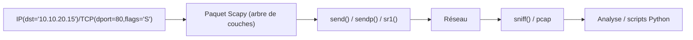
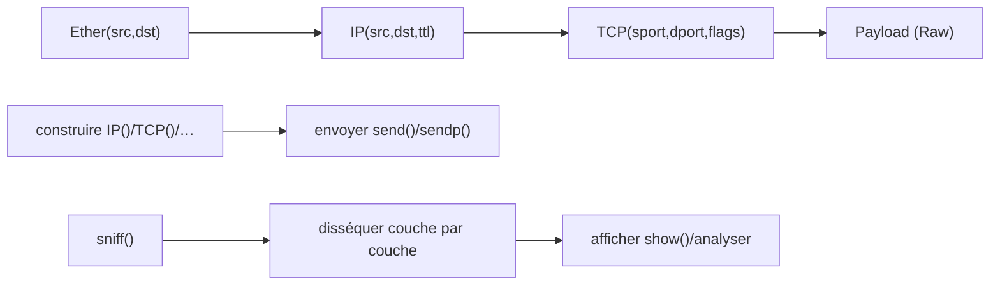

# Scapy — La forgerie de paquets en Python

> [!info] **En 1 phrase**
> Scapy est une bibliothèque Python capable de créer, envoyer, intercepter, disséquer et manipuler des paquets réseau de n'importe quel protocole, en interactif ou en scripts.

---

## Overview

| Champ | Valeur |
|---|---|
| Nom complet | Scapy |
| Description | Bibliothèque Python de forgerie/analyse de paquets : construction par couches, envoi, capture, dissection, lecture/écriture de pcap |
| Catégorie | Réseau & Capture |
| Sous-catégorie | Forgerie de paquets / analyse programmée |
| Fonction principale | Construire des paquets arbitraires (TCP/IP/UDP/ICMP/ARP/DNS/HTTP/TLS…) et les envoyer/intercepter |
| Type d'outil | Bibliothèque Python + CLI interactive (`scapy`) |
| Licence | GPL-2.0 |
| Open source / propriétaire | Open source |
| Langage(s) de programmation | Python (Python 3.7+) |
| Développeur / organisation | Philippe Biondi (créateur) ; SecDev (maintenance) |
| Projet officiel | Scapy |
| Dépôt officiel | https://github.com/secdev/scapy |
| Documentation officielle | https://scapy.readthedocs.io/ |
| Date de création | 2003 |
| État du projet | actif |
| Dernière version connue | 2.7.0 (PyPI, 2026) |
| Systèmes compatibles | Linux, Windows (Npcap), macOS, BSD |

> [!note] Pour vérifier / compléter
> Scapy s'installe via `pip install scapy`. Sur Kali, il est préinstallé (`scapy` en interactif). L'envoi de paquets (`sendp`, `srp`) exige libpcap/Npcap et root ; la capture (`sniff`) aussi. Matplotlib est optionnel pour les graphiques de sessions.

---

## Concept

Scapy repose sur un modèle **par couches** : un paquet est un objet où chaque couche (`Ether`, `IP`, `TCP`…) est un nœud d'un arbre, composé avec l'opérateur `/`. `IP(dst="10.10.20.15")/TCP(dport=80, flags="S")` construit un paquet SYN complet, `DNS(rd=1)/DNSQR(qname="example.com")` une requête DNS. On envoie avec `send()`/`sendp()`, on reçoit avec `sr()/sr1()` (send+receive) ou `sniff()`, on dissèque tout protocole supporté, et on lit/écrit des fichiers pcap avec `rdpcap()`/`wrpcap()`.

C'est l'outil **scriptable par excellence** : là où hping3 forge en CLI, Scapy forge en Python — donc en boucles, conditions, classes et automatisation. Sa force est sa **bibliothèque de couches** (plus d'une centaine de protocoles : IP, TCP, UDP, ICMP, ARP, DNS, DHCP, HTTP, TLS, SMB…), sa flexibilité totale des champs, et la possibilité de **fusionner forgerie + capture** dans le même script.

En cybersécurité offensive, Scapy sert à : scans sur mesure, **ARP spoofing**, requêtes DNS forgées, **tests d'IDS** avec du trafic anormal, **exfiltration via des protocoles custom**, et prototypage rapide d'attaques réseau. En défense, il permet de générer des datasets pour entraîner les modèles, simuler des attaques et valider des règles.



---

## Concepts fondamentaux

| Concept | Explication |
|---|---|
| Couches (layers) | Chaque protocole est une classe (IP, TCP, ARP…) ; l'opérateur `/` les empile |
| send() / sendp() | `send()` envoie au niveau IP (routeur local) ; `sendp()` envoie au niveau L2 (Ethernet) |
| sr() / sr1() / srp() | Send + Receive : renvoient réponses (pair de listes) ; `sr1()` ne renvoie que la première réponse |
| sniff() | Capture des paquets (filtre BPF, count, timeout) en direct |
| rdpcap() / wrpcap() | Lecture/écriture de fichiers pcap/pcapng |
| ls() | Liste les champs d'une couche : `ls(IP)` affiche src, dst, ttl… |
| show() / summary() | Affichage détaillé (`pkt.show()`) ou résumé (`pkt.summary()`) |
| conf | Objet global de configuration : `conf.verb`, `conf.iface`, `conf.L3socket` |
| Forgerie de champs | Chaque champ est modifiable : flags, TTL, checksum, identifiants… |
| Interactive | La console `scapy` permet de construire/tester en mode REPL |

---

## Installation

### Debian / Ubuntu / Kali Linux

```bash
sudo apt update && sudo apt install -y python3-scapy
# ou via pip (plus récent)
pip install scapy
```

### Windows

```powershell
pip install scapy
# Npcap est requis pour l'envoi et la capture : https://npcap.com/
```

### macOS

```bash
brew install scapy
# ou pip install scapy
```

### Compilation depuis les sources

```bash
git clone https://github.com/secdev/scapy.git && cd scapy
pip install -e .
```

> [!warning] Prérequis & problèmes potentiels
> - Root requis pour `sendp`/`sniff` (sockets brutes) ; sur Windows, Npcap obligatoire.
> - Python 3.7+ nécessaire ; Scapy 2.x ne supporte pas Python 2.
> - `sniff()` sans interface précise peut nécessiter `conf.iface`.
> - Certaines couches (TLS, etc.) dépendent des modules optionnels (`cryptography`).

---

## Configuration

Scapy se configure via l'objet global `conf` et via les arguments des fonctions d'envoi/capture.

| Paramètre | Rôle | Valeur possible | Impact | Exemple |
|---|---|---|---|---|
| `conf.verb` | Niveau de verbosité | 0-3 | Réduit/augmente les logs | `conf.verb = 0` |
| `conf.iface` | Interface par défaut | `eth0`, `en0`… | Cible de `sendp`/`sniff` | `conf.iface = "eth0"` |
| `conf.L3socket` | Socket niveau L3 | par défaut | Alternative (raw) pour envoi | `conf.L3socket = L3RawSocket` |
| `conf.route` | Table de routage interne | — | Routage des paquets L3 | `conf.route.route("10.10.20.15")` |
| `sniff(filter=…)` | Filtre BPF de capture | `tcp port 80` | Limite les paquets capturés | `sniff(filter="tcp")` |
| `sniff(prn=…)` | Fonction par paquet | callable | Traitement en direct | `sniff(prn=lambda p: p.summary())` |
| `wrpcap(file, pkts)` | Écrire un pcap | chemin | Sauvegarde des captures | `wrpcap("out.pcap", pkts)` |

---

## Architecture interne

Scapy fonctionne en **arbres de couches** : chaque paquet est un objet où la couche la plus haute est la racine (`Ether`, `IP`, ou autre), et où chaque couche pointe vers la suivante via `payload`.

- **Construction** : `IP()/TCP()` instancie les classes de couches et remplit les champs par défaut (checksums, longueurs) lors de l'envoi.
- **Dissection** : à la réception, Scapy parcourt les octets et infère les couches selon les numéros de protocole/ports.
- **Envoi** : `send()` choisit la route via `conf.route` ; `sendp()` encapsule dans un tram Ethernet via libpcap/Npcap.
- **Capture** : `sniff()` s'appuie sur pcap (ou AF_PACKET/raw socket) et dispatch chaque paquet vers `prn`/`store`.
- **Sessions** : `sniff(…session=TCPSession)` regroupe les paquets en flux TCP pour une analyse applicative.



---

## Commandes

### Commandes principales

```bash
# Lancer la console interactive
scapy
```

| Commande | Objectif | Résultat attendu |
|---|---|---|
| `ls(IP)` | Lister les champs d'une couche | Champs + valeurs par défaut |
| `pkt = IP(dst="10.10.20.15")/TCP(dport=80, flags="S")` | Construire un SYN | Paquet en mémoire |
| `sr1(pkt, timeout=2)` | Envoyer et attendre la réponse | SYN-ACK ou None |
| `sendp(Ether()/IP(dst="10.10.20.15")/ICMP(), count=3)` | Ping L2 (3 paquets) | ICMP echo émis |
| `sniff(iface="eth0", count=10)` | Capturer 10 paquets | Liste de paquets |
| `rdpcap("cap.pcap")` | Lire un pcap | Liste de paquets |
| `wrpcap("out.pcap", pkts)` | Écrire un pcap | Fichier créé |
| `arping("10.10.20.0/24")` | ARP scan d'un réseau | Hôtes répondants |
| `pkt.show()` | Afficher le paquet en détail | Arbre de couches |

### Commandes avancées

```bash
# SYN scan d'une plage de ports en une ligne
```

```python
# Dans le shell scapy ou un script :
ans, unans = sr(IP(dst="10.10.20.15")/TCP(dport=[22, 80, 443, 4444], flags="S"), timeout=2)
for s, r in ans:
    print(r.sprintf("%TCP.dport% est ouvert"))

# Requête DNS forgée
sr1(IP(dst="8.8.8.8")/UDP(dport=53)/DNS(rd=1, qd=DNSQR(qname="example.com")), timeout=2)
```

---

## Options et flags

| Élément | Description | Exemple | Niveau |
|---|---|---|---|
| `send(pkt)` | Envoyer au niveau L3 | `send(IP(dst="…")/ICMP())` | Basic |
| `sendp(pkt)` | Envoyer au niveau L2 | `sendp(Ether()/IP()/ICMP())` | Basic |
| `sr(pkt, timeout=)` | Envoyer + recevoir | `sr(…, timeout=2)` | Intermediate |
| `sr1(pkt, timeout=)` | Envoyer + première réponse | `sr1(…, timeout=2)` | Intermediate |
| `srp(pkt, timeout=)` | Send+Receive au niveau L2 | `srp(Ether()/ARP(), timeout=2)` | Intermediate |
| `sniff(iface=, count=, timeout=, filter=, prn=, store=)` | Capture | `sniff(count=10, prn=lambda p: p.summary())` | Intermediate |
| `rdpcap(file)` / `wrpcap(file, pkts)` | Fichiers pcap | `wrpcap("out.pcap", pkts)` | Basic |
| `ls(X)` | Champs d'une couche | `ls(TCP)` | Basic |
| `pkt.show()` / `pkt.summary()` | Affichage | `pkt.show()` | Basic |
| `fuzz()` | Remplir aléatoirement les champs | `IP(fuzz())` | Advanced |
| `conf.verb = 0` | Silence | `conf.verb = 0` | Intermediate |
| `sniff(session=TCPSession)` | Session TCP | `sniff(prn=lambda p: p.layers())` | Expert |

> [!tip] Éléments les plus utiles au quotidien
> `IP()/TCP()`, `sr1(…, timeout=)`, `sniff(prn=…)`, `rdpcap`/`wrpcap`, `pkt.show()`, `conf.verb=0`. Le mode interactif `scapy` est parfait pour prototyper avant de scriptiser.

---

## Exemples pratiques

### Beginner

```python
from scapy.all import *
# Construire un paquet ICMP
pkt = IP(dst="10.10.20.15")/ICMP()
pkt.show()
# Envoyer et recevoir
sr1(pkt, timeout=2)
```

### Intermediate

```python
# SYN scan de quelques ports
ans, _ = sr(IP(dst="10.10.20.15")/TCP(dport=[22, 80, 443, 4444], flags="S"), timeout=2)
for s, r in ans:
    print(s[TCP].dport, "→", r.sprintf("%TCP.flags%"))

# Capturer puis sauvegarder
pkts = sniff(iface="eth0", count=50)
wrpcap("capture.pcap", pkts)
```

### Advanced

```python
# ARP spoofing / ARP scan
ans, _ = arping("10.10.20.0/24", timeout=2)
for s, r in ans:
    print(r[ARP].psrc, r[Ether].src)

# Requête DNS forgée et lecture de la réponse
q = IP(dst="8.8.8.8")/UDP(dport=53)/DNS(rd=1, qd=DNSQR(qname="example.com"))
r = sr1(q, timeout=2)
print(r[DNS].an.rdata if r and r.haslayer(DNS) else "pas de réponse")
```

### Expert

```python
# Test de robustesse : paquets aléatoires vers un service
sendp(IP(dst="10.10.20.15")/UDP(dport=4444)/Raw(load=fuzz()), count=100)

# Réassembler une session TCP et extraire le payload applicatif
pkts = sniff(offline="capture.pcap", session=TCPSession, filter="tcp")
for p in pkts:
    if TCP in p and Raw in p:
        print(p[Raw].load)
```

---

## Workflow complet (scénario pas à pas)

1. **Étape 1 — Prototyper en interactif** — explorer les couches :
   ```bash
   scapy
   ls(IP); ls(TCP)
   ```
2. **Étape 2 — Construire et envoyer** — SYN vers un service :
   ```python
   pkt = IP(dst="10.10.20.15")/TCP(dport=80, flags="S")
   r = sr1(pkt, timeout=2)
   print(r.summary() if r else "filtré")
   ```
3. **Étape 3 — Capturer et analyser** — sauvegarder puis relire :
   ```python
   pkts = sniff(iface="eth0", count=100)
   wrpcap("workflow.pcap", pkts)
   # relecture : rdpcap("workflow.pcap") → p.show()
   ```
4. **Étape 4 — Scriptiser** — transformer le prototypage en script réutilisable (voir Automatisation).

---

## Scénarios avancés

### Scénario 1 : ARP spoofing (lab)

```python
from scapy.all import *
def spoof(victim, gateway):
    pkt = ARP(op=2, pdst=victim, psrc=gateway, hwdst=getmacbyip(victim))
    send(pkt, verbose=0)
# En lab : alterner ARP vers la victime et la passerelle
```

### Scénario 2 : génération d'un dataset d'attaques pour la défense

```python
from scapy.all import *
# SYN flood simulé (volume faible, lab)
for _ in range(500):
    sendp(IP(src="10.10.20.%d" % random.randint(1, 254))/TCP(flags="S", dport=80), verbose=0)
# Puis capturer avec sniff() pour entraîner la détection
```

### Scénario 3 : détection de scans (défense)

```python
from scapy.all import *
def detect(p):
    if TCP in p and p[TCP].flags == 0x02 and p[TCP].dport not in (80, 443):
        print(f"SYN suspect vers {p[TCP].dport} depuis {p[IP].src}")
sniff(iface="eth0", filter="tcp", prn=detect, store=0)
```

---

## Cybersecurity use cases

| Phase | Utilisation |
|---|---|
| Reconnaissance | ARP ping, SYN scans sur mesure, fingerprinting |
| Exploitation | Forger des payloads, tester des injections réseau |
| Post-exploitation | ARP spoofing, exfiltration par champs custom |
| C2 | Signaux via paquets forgés (T1205) |
| Défense | Simulation d'attaques, génération de datasets, tests IDS |
| Automatisation | Pipelines Python d'analyse de captures |

---

## MITRE ATT&CK

| Tactique | Technique / Sub-technique | ID | Raison | Détection | Mitigation |
|---|---|---|---|---|---|
| Discovery | Network Service Discovery | T1046 | Scans SYN/ARP sur mesure en Python | Netflow, corrélation | Segmentation, filtrage |
| Discovery | Network Sniffing | T1040 | `sniff()` capture le trafic (credentials, flux) | Process Python, EDR | Chiffrement, 802.1X |
| Execution | Command and Scripting Interpreter: Python | T1059.006 | Scapy est un script Python exécutant du code réseau | Process_creation Python | Whitelisting, politiques |
| Command and Control | Traffic Signaling | T1205 | Canaux cachés dans des champs forgés | Analyse statistique des paquets | Inspection réseau |
| Exfiltration | Exfiltration Over Alternative Protocol | T1048 | Exfiltration par protocoles custom/TOS | Volumes sortants, DLP | Proxy, politique egress |

> [!note] Ne renseigner que si l'association est réellement pertinente.
> Scapy est une lib générique : les ID dépendent de l'usage. T1059.006 est le plus « systémique » (tout passe par du Python). L'usage légitime (dev réseau, blue team) est massif.

---

## Defensive Security

### Signes observables

| Indicateur | Détail |
|---|---|
| Process `python`/`scapy` avec des sockets bruts | EDR, Sigma, supervision process |
| ARP anormaux (spoofing) | Détection ARP, `arpwatch`, DHCP snooping |
| Paquets malformés / champs bizarres | Suricata/Snort (fuzzing), analyse de champs |
| Scans SYN rapides multi-ports | Netflow, seuils de connexions |
| Scripts Python réseau inattendus sur les endpoints | Whitelisting, intégrité des fichiers |

### Règles de détection (Sigma / Suricata / Snort / YARA)

```yaml
# Sigma — Linux : exécution de scapy (script Python réseau)
title: Scapy Usage (Packet Crafting/Sniffing)
id: 5d3e8f2a-9c1b-4d7e-8a2f-6b4c5d6e7f8a
status: experimental
logsource:
    category: process_creation
    product: linux
detection:
    selection:
        CommandLine|contains: 'scapy'
    condition: selection
falsepositives:
    - Legitimate network development or testing
level: low
```

```bash
# Suricata/Snort — exemple pédagogique : burst de SYN vers un service
alert tcp any any -> any 80 (msg:"Possible Scapy SYN burst"; flags:S; flow:to_server; threshold:type both, track by_dst, count 500, seconds 10; sid:1000008; rev:1;)
```

> [!note] À vérifier
> Scapy ne génère pas de signature propre (les paquets sont « normaux ») : la détection repose sur le comportement (bursts, ARP, malformation) et sur la supervision des processus.

---

## Automatisation

```python
# Script — scan SYN réutilisable
from scapy.all import *
conf.verb = 0
def scan(host, ports):
    ans, _ = sr(IP(dst=host)/TCP(dport=ports, flags="S"), timeout=2)
    return [s[TCP].dport for s, r in ans if r and r.haslayer(TCP) and r[TCP].flags & 0x12]

print("ports ouverts :", scan("10.10.20.15", [22, 80, 443, 4444]))
```

```python
# Script — capture automatique filtrée + sauvegarde horodatée
from scapy.all import *
import time
pkts = sniff(iface="eth0", filter="tcp port 4444", count=100, timeout=30)
wrpcap(f"capture_{int(time.time())}.pcap", pkts)
print(f"{len(pkts)} paquets capturés")
```

---

## Output et parsing

Scapy produit des objets `Packet` manipulables par programmation : `p.show()` (arbre), `p.summary()` (une ligne), `p.sprintf(...)` (formatage), `p[TCP].dport` (accès direct aux champs).

```python
from scapy.all import *
pkts = rdpcap("capture.pcap")
# Résumés
for p in pkts[:5]:
    print(p.summary())
# Accès aux champs
print(pkts[0][IP].src, "→", pkts[0][IP].dst, pkts[0][TCP].dport)
# Comptage par destination
from collections import Counter
c = Counter(p[IP].dst for p in pkts if IP in p)
print(c.most_common(5))
```

```text
# Exemple de sortie summary()
Ether / IP 10.10.20.15 > 10.10.20.1 TCP 10.10.20.15:55555 > 8.8.8.8:53 DNS ...
```

---

## Intégrations

- [[Tools| Outils]] global
- [[Outil - tcpdump]] / [[Outil - tshark]] — complément de capture ; Scapy lit leurs pcaps (`rdpcap`)
- [[Outil - Wireshark]] — visualiser les pcaps générés par Scapy
- [[Outil - Hping3]] — l'équivalent CLI ; Scapy en est l'évolution Python
- [[Outil - Nmap]] — Scapy peut piloter des scans complémentaires
- [[Outil - Suricata]] / [[Outil - Snort]] — tester les règles avec du trafic Scapy
- [[Outil - tcpreplay]] — rejouer les captures Scapy générées

```text
Scapy (forge/capture) → wrpcap → tshark/Wireshark (analyse)
Scapy → sendp → Suricata/Snort (test de règles)
tcpdump -w → rdpcap → Scapy (analyse programmée)
```

---

## Alternatives

| Outil | Avantages | Inconvénients | Cas d'usage |
|---|---|---|---|
| hping3 | Rapide en CLI, débit élevé | Moins flexible, C figé | Forgerie ponctuelle |
| Nmap | Scans complets et scripts | Pas de forgerie libre | Scan classique |
| nping | Paquets custom simples | Moins de protocoles | Tests ponctuels |
| Scapy | Scriptable, tous protocoles | Python requis, plus lent | Analyse/forgerie programmée |
| tcpreplay | Rejeu haute performance | Pas de forgerie ad hoc | Reproduction de captures |

> **Quand utiliser Scapy plutôt que hping3/Nmap ?** Dès qu'il faut automatiser, itérer ou fusionner forgerie + analyse dans un script Python. Pour un scan ponctuel, Nmap/hping3 suffisent et sont plus rapides.

---

## Performance

- **Vitesse** : la forgerie en Python est plus lente que les outils C ; utiliser des listes et éviter les `sr()` sur de gros volumes.
- **sniff()** : `store=0` + `prn=` réduit l'usage mémoire sur les longues captures.
- **Session TCP** : l'assemblage de sessions est coûteux — réservé aux flux ciblés.
- **sendp en boucle** : optimiser avec `inter=` pour espacer, ou préconstruire les paquets.
- **Limites** : le débit d'envoi est borné par Python et la stack pcap ; pour du haut débit, tcpreplay/npcap restent supérieurs.

> [!note] À vérifier
> Les débits dépendent de la machine, de la NIC et de la couche (L2 vs L3) ; mesurer sur son propre environnement.

---

## Troubleshooting

### Common problems

#### Problème : « Permission denied » au moment de sendp/sniff

- **Cause** : droits insuffisants sur les sockets brutes.
- **Solution** : `sudo` ou capability `CAP_NET_RAW` ; sur Windows, installer Npcap.
- **Vérification** : `sudo python3 -c "from scapy.all import *; send(IP(dst='127.0.0.1')/ICMP())"`.

#### Problème : `send()` n'atteint pas la cible (mais sendp oui)

- **Cause** : la table `conf.route` choisit la mauvaise interface/gateway.
- **Solution** : `conf.route.route("10.10.20.15")` pour diagnostiquer ; forcer l'interface.
- **Vérification** : vérifier la route par défaut (`ip route`).

#### Problème : sniff() ne capture rien

- **Cause** : mauvaise interface ou filtre BPF trop restrictif.
- **Solution** : préciser `iface=`, retirer le filtre, vérifier avec `conf.iface`.
- **Vérification** : `sudo tcpdump -i eth0 -c 5` en parallèle.

#### Problème : paquets non disséqués (Raw uniquement)

- **Cause** : couche non supportée ou ports non reconnus.
- **Solution** : forcer la dissection manuellement, ou vérifier `ls()` des couches disponibles.
- **Vérification** : `p.show()` pour inspecter le payload brut.

#### Problème : import « scapy.all » échoue

- **Cause** : installation incomplète ou environnement Python brisé.
- **Solution** : `pip install --upgrade scapy` ; vérifier `python3 -c "import scapy"`.
- **Vérification** : `scapy` doit ouvrir la console.

---

## Sécurité de l'outil

- **Privilèges** : sockets brutes = root (ou CAP_NET_RAW) ; vérifier qui peut exécuter Python en root.
- **Données** : les captures contiennent du trafic sensible — chiffrer les pcaps et restreindre l'accès.
- **ARP spoofing** : dangereux en production (casse les flux) — lab uniquement.
- **Télémétrie** : aucune ; mais le trafic forgé est observable et les processus Python traçables.
- **Code** : exécuter des scripts Scapy non vérifiés = exécution arbitraire (sockets + os).
- **Autorisations** : forger des paquets sur un réseau sans accord est illégal.

---

## Limitations

- Plus lent que les outils C pour la forgerie de masse.
- Nécessite Python 3 et libpcap/Npcap pour l'envoi/capture.
- La dissection de protocoles exotiques peut nécessiter des modules optionnels.
- `sr()`/`srp()` sont synchrones : le pacing des envois n'est pas trivial sur de gros volumes.
- Le support Windows (Npcap) est fonctionnel mais plus limité que Linux.
- Pas de « rendu » graphique intégré (matplotlib optionnel pour les graphiques).

---

## Cheatsheet

```python
from scapy.all import *
# Construire
p = IP(dst="10.10.20.15")/TCP(dport=80, flags="S")
# Envoyer / recevoir
sr1(p, timeout=2)
# Scan rapide
sr(IP(dst="10.10.20.15")/TCP(dport=[22, 80, 443], flags="S"), timeout=2)
# Capturer
sniff(iface="eth0", count=10, prn=lambda x: x.summary())
# Fichiers
rdpcap("cap.pcap"); wrpcap("out.pcap", pkts)
# Afficher
p.show(); p.summary(); ls(IP)
# ARP ping
arping("10.10.20.0/24")
```

---

## Quick reference

| | |
|---|---|
| **À quoi sert-il ?** | Forger, envoyer, capturer et analyser des paquets en Python |
| **Quand l'utiliser ?** | Analyse/forgerie programmée, prototypage, automatisation réseau |
| **Commande principale** | `sr1(IP(dst="10.10.20.15")/TCP(dport=80, flags="S"), timeout=2)` |
| **Alternative principale** | [[Outil - Hping3\|Hping3]] (CLI), [[Outil - Nmap\|Nmap]], [[Outil - tcpreplay\|tcpreplay]] |
| **Concepts importants** | couches `/`, `send`/`sendp`, `sr`/`sr1`, `sniff`, `rdpcap`/`wrpcap`, `conf` |
| **Liens associés** | [[Outil - tshark]] · [[Outil - Hping3]] · [[Outil - Nmap]] · [[Outil - Suricata]] |

---

## Détection & Défense

| Signe | Défense |
|---|---|
| Process Python avec sockets bruts | EDR + Sigma, whitelisting |
| ARP anormaux | arpwatch, DHCP snooping, 802.1X |
| Bursts de SYN / paquets malformés | Seuils Suricata/Snort, netflow |
| Canaux cachés dans les champs | Analyse statistique des paquets |
| Scripts Python réseau inattendus | Intégrité des fichiers, politiques |

---

## Tips & Pièges

> [!tip] **Tips**
> - Prototyper dans la console `scapy` avant de scriptiser.
> - `conf.verb = 0` pour des scripts propres.
> - Toujours un `timeout=` sur `sr()`/`sr1()` pour éviter les blocages.
> - `store=0` + `prn=` pour les captures longues (mémoire).
> - Relire les pcaps de tshark avec `rdpcap()` pour une analyse programmée.

> [!warning] **Pièges**
> - `send()` route via la table locale : pour du L2, utiliser `sendp()`.
> - Oublier `timeout=` gèle le script indéfiniment.
> - L'ARP spoofing en production casse la connectivité des victimes.
> - Les paquets forgés peuvent déclencher des alertes et des blocages (firewall).
> - Exécuter du code Scapy non fiable = risque d'exécution arbitraire.

---

## References

### Official

- Site officiel : https://scapy.net/
- Documentation : https://scapy.readthedocs.io/
- Dépôt officiel : https://github.com/secdev/scapy
- Référence des couches : https://scapy.readthedocs.io/en/latest/api/scapy.layers.html

### Security references

- MITRE ATT&CK T1046 — Network Service Discovery : https://attack.mitre.org/techniques/T1046/
- MITRE ATT&CK T1040 — Network Sniffing : https://attack.mitre.org/techniques/T1040/
- MITRE ATT&CK T1059.006 — Python : https://attack.mitre.org/techniques/T1059/006/
- MITRE ATT&CK T1205 — Traffic Signaling : https://attack.mitre.org/techniques/T1205/

### Community

- Scapy usage — exemples : https://scapy.readthedocs.io/en/latest/usage.html
- HackTricks — network tools : https://book.hacktricks.xyz/network-services-pentesting
- SecTools (Scapy) : https://sectools.org/tool/scapy/

---

**Liens :** [[Tools| Outils]] · [[Outil - Hping3|Hping3]] · [[Outil - tshark|tshark]] · [[Outil - tcpdump|tcpdump]] · [[Outil - Nmap|Nmap]]
