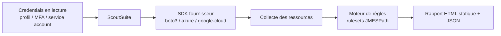
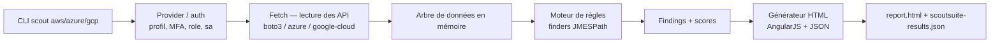

# 🔍 ScoutSuite — L'audit de sécurité multi-cloud

> [!info] **En 1 phrase**
> Suite d'audit open source (successeur de Scout2) qui génère un rapport HTML navigable des failles de configuration AWS, Azure et GCP.

---

## 🧾 Overview

| Champ | Valeur |
|---|---|
| Nom complet | ScoutSuite |
| Description | Suite d'audit de configuration cloud open source qui interroge les API AWS, Azure et GCP, applique des règles de durcissement (rulesets) et génère un rapport HTML statique navigable avec score de sécurité par service |
| Catégorie | ☁️ Cloud & Containers |
| Sous-catégorie | Audit de configuration / Security Posture Management |
| Type d'outil | CLI (scanner de configuration passif) |
| Licence | Apache License 2.0 |
| Open source / propriétaire | Open source |
| Langage(s) de programmation | Python 3 (boto3, azure-* SDK, google-cloud SDK, AngularJS pour le rapport) |
| Développeur / organisation | NCC Group |
| Projet officiel | https://github.com/nccgroup/ScoutSuite |
| Dépôt officiel | https://github.com/nccgroup/ScoutSuite |
| Documentation officielle | https://github.com/nccgroup/ScoutSuite/wiki |
| Date de création | 2018 (Scout2 date de 2014) |
| État du projet | obsolète (non maintenu — dernier release v2.13.0, avril 2022) |
| Dernière version connue | v2.13.0 (26 avril 2022) |
| Systèmes compatibles | Linux, macOS, Windows (via Python) |

> [!note] Pour vérifier / compléter
> Version vérifiée sur https://github.com/nccgroup/ScoutSuite/releases (v2.13.0, avril 2022). Le dépôt n'est pas archivé mais le projet est en sommeil depuis 2022 : aucune évolution n'est attendue côté règles de sécurité ni compatibilité avec les SDK cloud récents.

---

## 🎯 Concept

ScoutSuite a été développé par NCC Group comme **successeur de Scout2** (qui ne couvrait que AWS) pour offrir un audit de configuration homogène sur les trois grands clouds publics : **AWS, Azure et GCP**. L'outil est un scanner **passif** : il s'authentifie avec des credentials en lecture, interroge les API des fournisseurs pour collecter l'état réel des ressources (IAM, stockage, compute, réseau, journalisation, KMS…), puis applique des **rulesets** (jeux de règles de durcissement) pour détecter les failles de configuration connues. Le livrable est un **rapport HTML statique et autonome**, navigable par service, avec un score de sécurité calculé par service et par gravité, et filtrable par type de faille.

Dans un engagement, ScoutSuite se place en phase de **reconnaissance / évaluation de posture** : avec un simple accès en lecture (typiquement le rôle AWS `ReadOnlyAccess`), un pentester ou un auditeur peut cartographier les faiblesses d'un compte sans aucune action destructive. C'est l'équivalent « Nessus » du cloud : il **constate** des configurations risquées (bucket public, politique IAM trop permissive, MFA absent, CloudTrail désactivé) mais ne les **exploite** pas — contrairement à Pacu qui prend le relais en post-exploitation.

Sa force principale : la **couverture multi-cloud dans un seul outil** avec un rendu client exploitable directement (rapport HTML livrable au client, données JSON réutilisables). Sa faiblesse majeure : le projet n'est **plus maintenu depuis 2022**, ses règles deviennent obsolètes et son support des versions récentes des SDK cloud est fragile.



---

## 🧠 Concepts fondamentaux

| Concept | Explication |
|---|---|
| Ruleset | Jeu de règles de sécurité (finders) appliqué aux données collectées. ScoutSuite embarque des rulesets par défaut par fournisseur (AWS, Azure, GCP) ; il est possible d'en fournir de personnalisés avec `--ruleset` |
| Finder | Une règle individuelle d'un ruleset : une expression **JMESPath** (langage de requête JSON, ex : `buckets[?public_access_blockable]`) appliquée aux ressources collectées ; si elle matche, un « finding » de gravité donnée (high/medium/low/info) est généré |
| Score de sécurité | Pourcentage calculé par service = règles passées / règles testées ; affiché sur le dashboard du rapport HTML statique (application AngularJS embarquée, autonome et transmissible au client) |
| Collecte / fetch | Phase où ScoutSuite interroge les API (listes et descriptions de ressources) pour chaque service activé ; seules des opérations de lecture sont émises |
| Credentials en lecture | L'audit repose sur des permissions de lecture : le rôle `ReadOnlyAccess` (AWS), un Service Principal (Azure) ou un service account (GCP) est idéal |
| Multi-cloud | Même commande, même modèle de règles, même format de rapport pour AWS, Azure et GCP |
| Scout2 vs ScoutSuite | Scout2 (2014) était AWS uniquement et fonctionnait avec des scripts shell/awk ; ScoutSuite (2018) généralise à Azure/GCP et réécrit le moteur en Python pur |

---

## 🛠️ Installation

ScoutSuite s'installe via `pip`. Python 3.8 est recommandé : les versions plus récentes (3.9 à 3.12 selon l'OS) peuvent provoquer des erreurs de dépendances non résolues par le projet (non maintenu).

### Debian / Ubuntu / Kali Linux

```bash
sudo apt update && sudo apt install -y python3 python3-pip python3-venv git
python3 -m venv ~/scout-venv && source ~/scout-venv/bin/activate
pip install -U pip
pip install scoutsuite
```

### macOS

```bash
brew install python@3.8
python3.8 -m venv ~/scout-venv && source ~/scout-venv/bin/activate
pip install -U scoutsuite
```

### Windows

```powershell
# PowerShell — Python 3.8 depuis python.org, puis venv
py -3.8 -m venv $env:USERPROFILE\scout-venv
$env:USERPROFILE\scout-venv\Scripts\Activate.ps1
pip install -U scoutsuite
```

### Docker

```bash
docker pull nccgroup/scoutsuite
# Scanner AWS avec un profil monté en lecture (attention à la fuite de credentials)
docker run -it -v ~/.aws:/root/.aws:ro -v "$PWD"/out:/report \
  nccgroup/scoutsuite scout aws --profile audit --report-dir /report
```

> [!warning] ⚠️ Prérequis & problèmes potentiels
> - **Python 3.8 conseillé** : le projet n'étant plus maintenu, les Python récents cassent des dépendances (notamment `jmespath`, `azure-cli-core`, `google-cloud-*`). Utiliser un venv dédié pour éviter de polluer le système.
> - Pour **Azure**, `scout azure --cli` nécessite que `az` soit installé et authentifié (`az login`).
> - Pour **GCP**, il faut créer une clé de service account JSON dans la console GCP et l'activer sur le projet à auditer.
> - Sous **Windows natif**, certaines dépendances Azure/GCP posent problème : privilégier WSL2 ou Docker.

---

## ⚙️ Configuration

ScoutSuite se configure presque exclusivement par **ligne de commande** ; l'authentification se fait via les mécanismes standard des SDK cloud (profils AWS, variables d'environnement, CLI Azure, clés GCP).

| Paramètre | Rôle | Valeur possible | Impact | Exemple |
|---|---|---|---|---|
| `--profile <nom>` | Profil AWS à utiliser (`~/.aws/credentials`) | nom de profil | Authentifie le scan AWS | `--profile audit` |
| `AWS_ACCESS_KEY_ID` / `AWS_SECRET_ACCESS_KEY` | Clés AWS via variables d'environnement | AKIA… | Alternative au profil | `AWS_ACCESS_KEY_ID=AKIA1111222233334444` |
| `--mfa-serial` / `--mfa-code` | Authentification MFA AWS (sessions STS) | ARN de périphérique MFA + code | Évite les clés longues durée | `--mfa-serial arn:aws:iam::111122223333:mfa/jdoe --mfa-code 123456` |
| `--role-arn` | Assume un rôle AWS avant scan | ARN de rôle | Scan avec des permissions ciblées | `--role-arn arn:aws:iam::111122223333:role/SecurityAudit` |
| `--services` / `--excluded-services` | Liste des services audités | `ec2,iam,s3` | Réduit la portée et le temps de scan | `--services s3,iam,cloudtrail` |
| `--regions` | Régions AWS scannées | liste de régions | Limite la collecte aux régions pertinentes | `--regions us-east-1,eu-west-3` |
| `--ruleset` | Ruleset personnalisé (JSON) | chemin de fichier | Applique des règles maison | `--ruleset ./my-rules.json` |
| `--report-dir <dir>` | Dossier de sortie du rapport | chemin | Emplacement du HTML + JSON générés | `--report-dir ./out` |
| `--resume` | Réutilise les données déjà collectées | drapeau | Re-génère le rapport sans re-scanner (offline) | `--resume` |
| `--service-account <json>` | Clé de service account GCP | chemin JSON | Authentifie le scan GCP | `--service-account ./gcp-key.json` |
| `--cli` | Utilise l'identité de la CLI Azure | drapeau | Authentifie le scan Azure | `--cli` |
| `--no-browser` | N'ouvre pas le navigateur après le scan | drapeau | Usage headless/CI | `--no-browser` |

---

## 🏗️ Architecture interne

Le dépôt `nccgroup/ScoutSuite` est un package Python structuré autour de la commande `scout <provider> <options>` :

- **`ScoutSuite/__main__.py`** : point d'entrée CLI ; parse les arguments, sélectionne le provider (`aws`, `azure`, `gcp`) et orchestre le pipeline.
- **`ScoutSuite/providers/`** : un sous-package par fournisseur (`aws`, `azure`, `gcp`), chacun contenant `__init__.py` (définition du provider), `services/` (classes `ServiceConfig` et `resources` par service), `rules/` (rulesets JSON), `utils/` (authentification : profils, MFA, assume-role, service accounts).
- **Phase de fetch** : ScoutSuite crée le client SDK du fournisseur (boto3 pour AWS, SDK Azure pour Azure, google-cloud pour GCP) puis appelle les méthodes de lecture (`list_*`, `describe_*`, `get_*`) service par service. Les ressources sont stockées en mémoire dans des dictionnaires Python typés puis sérialisées en **JSON** (données brutes).
- **Moteur de règles** : chaque ruleset contient des finders. Un finder est un objet JSON décrivant le service cible, une expression **JMESPath** sur l'arbre de données et une gravité. Le moteur applique les expressions ; les correspondances deviennent des findings avec description et recommandation.
- **Module de sortie** : les findings sont agrégés en un JSON (`scoutsuite-results.json`) qui alimente une application **AngularJS** embarquée ; le générateur assemble le dossier de rapport (`report.html` + assets) entièrement statique.



---

## ⌨️ Commandes

### Commandes principales

La syntaxe générale est `scout <provider> [options]` où `<provider>` vaut `aws`, `azure` ou `gcp`.

| Commande | Objectif | Résultat attendu |
|---|---|---|
| `scout aws --profile audit` | Audit AWS complet avec un profil | Dossier de rapport avec HTML + JSON |
| `scout aws --profile audit --services ec2,iam,s3` | Audit limité à certains services | Scan plus rapide, rapport ciblé |
| `scout azure --cli` | Audit Azure avec l'identité `az login` | Rapport Azure complet |
| `scout gcp --service-account sa.json --project-id my-proj` | Audit GCP d'un projet | Rapport GCP du projet |
| `scout aws --resume` | Re-génère le rapport depuis les données déjà collectées | Aucun nouvel appel API |

### Commandes avancées

```bash
# Scan AWS avec MFA (session STS temporaire, pas de clé longue durée exposée)
scout aws --profile audit \
  --mfa-serial arn:aws:iam::111122223333:mfa/jdoe --mfa-code 123456

# Scan en assumant un rôle de lecture dédié
scout aws --role-arn arn:aws:iam::111122223333:role/SecurityAudit --profile auditeur

# Audit ciblé avec ruleset personnalisé et sortie headless
scout aws --profile audit --services iam,cloudtrail,s3 \
  --ruleset ./ruleset-perso.json --no-browser --report-dir ./out
```

---

## 🎚️ Options et flags

| Option | Description | Exemple | Niveau |
|---|---|---|---|
| `--profile <nom>` | Profil AWS à utiliser | `scout aws --profile audit` | Basic |
| `--report-dir <dir>` | Dossier de sortie du rapport | `--report-dir ./out` | Basic |
| `--no-browser` | Pas d'ouverture auto du navigateur | `--no-browser` | Basic |
| `--services a,b` | Services audités uniquement | `--services s3,iam` | Intermediate |
| `--regions r1,r2` | Régions AWS ciblées | `--regions us-east-1,eu-west-3` | Intermediate |
| `--resume` | Re-générer le rapport offline | `--resume` | Intermediate |
| `--mfa-serial` / `--mfa-code` | MFA AWS | `--mfa-serial arn:aws:iam::111122223333:mfa/jdoe --mfa-code 123456` | Advanced |
| `--role-arn <arn>` | Assume un rôle AWS | `--role-arn arn:aws:iam::111122223333:role/SecurityAudit` | Advanced |
| `--ruleset <fichier>` | Ruleset personnalisé | `--ruleset ./rules.json` | Advanced |
| `--service-account <json>` | Clé GCP | `--service-account ./gcp-key.json` | Advanced |
| `--project-id <id>` | Projet GCP cible | `--project-id my-proj` | Advanced |
| `--cli` | Auth Azure via CLI | `--cli` | Advanced |
| `--thread-config <n>` | Nombre de threads de collecte | `--thread-config 10` | Expert |

> [!tip] Options les plus utiles au quotidien
> `--services` (réduire le temps de scan), `--report-dir` (sortie maîtrisée), `--no-browser` (usage headless), `--resume` (re-générer sans re-scan), `--mfa-serial/--mfa-code` (audit sans clés longue durée).

---

## 🧪 Exemples pratiques

### Beginner

```bash
# 1. Installer dans un venv
python3 -m venv ~/scout-venv && source ~/scout-venv/bin/activate
pip install -U scoutsuite

# 2. Créer un profil AWS en lecture seule
aws configure --profile audit
#    AWS Access Key ID : AKIA1111222233334444
#    AWS Secret Access Key : wJalrXUtnFEMIK7mdENG+bKxLAFbfG4xj2E4dqe4Q

# 3. Lancer l'audit complet et ouvrir le rapport
scout aws --profile audit --report-dir ./scout-report
# Le navigateur s'ouvre automatiquement sur report.html
```

Résultat attendu : dossier `scout-report/` contenant `report.html` et `scoutsuite-results.json`. Erreur fréquente : `botocore.exceptions.NoCredentialsError` si le profil n'existe pas ou si les clés sont invalides.

### Intermediate

```bash
# Audit ciblé S3 + IAM + CloudTrail, sans navigateur
scout aws --profile audit --services s3,iam,cloudtrail \
  --no-browser --report-dir ./out
```

### Advanced

```bash
# Audit AWS en assumant un rôle dédié, avec MFA et régions ciblées
scout aws --role-arn arn:aws:iam::111122223333:role/SecurityAudit \
  --profile auditeur \
  --mfa-serial arn:aws:iam::111122223333:mfa/jdoe --mfa-code 123456 \
  --regions us-east-1,eu-west-3 \
  --services ec2,iam,s3,cloudtrail,kms \
  --no-browser --report-dir ./engagement-2026
```

### Expert

```bash
# Audit GCP d'un projet précis avec une clé de service account dédiée
scout gcp --service-account ./gcp-key.json --project-id example-project \
  --no-browser --report-dir ./out-gcp

# Audit Azure à partir de l'identité de la CLI (az login préalable)
az login
scout azure --cli --no-browser --report-dir ./out-azure

# Audit AWS avec un ruleset maison (JSON) et multi-thread
scout aws --profile audit --ruleset ./ruleset-hardening.json \
  --thread-config 8 --report-dir ./out-rules
```

---

## 🧪 Workflow complet (scénario pas à pas)

1. **Préparer un accès en lecture seule** — créer un rôle `SecurityAudit` (ou utiliser `ReadOnlyAccess`) assumable par le compte auditeur. Éviter les clés d'un utilisateur humain à privilèges larges.
   ```bash
   aws iam create-role --role-name SecurityAudit \
     --assume-role-policy-document file://trust-policy.json
   aws iam attach-role-policy --role-name SecurityAudit \
     --policy-arn arn:aws:iam::aws:policy/SecurityAudit
   ```
2. **Lancer l'audit ciblé** — réduire la portée aux services pertinents de l'engagement pour gagner du temps.
   ```bash
   scout aws --role-arn arn:aws:iam::111122223333:role/SecurityAudit \
     --profile auditeur --services iam,s3,ec2,cloudtrail \
     --no-browser --report-dir ./audit-2026
   ```
3. **Exploiter le rapport** — ouvrir `report.html`, lire le score global, filtrer par gravité, exporter les findings.
   ```bash
   Start-Process .\audit-2026\report.html
   ```
4. **Corréler les findings** — pour chaque faille (bucket public, policy trop large, CloudTrail désactivé), confirmer l'exploitabilité via la console, l'AWS CLI ou Pacu, puis documenter dans le rapport de pentest. Après correction des configurations, relancer `--resume` pour montrer l'évolution du score.

---

## 🎬 Scénarios avancés

### Scénario 1 : Audit d'un bucket S3 potentiellement public

```bash
# 1. Scanner uniquement S3
scout aws --profile audit --services s3 --report-dir ./out
# 2. Dans le rapport : onglet S3 → filtrer "World-readable" / "ACL: Everyone"
# 3. Confirmer l'accès public hors ScoutSuite (bucket fictif)
aws s3 ls s3://example-bucket --no-sign-request
```

ScoutSuite détecte les ACL et policies de bucket autorisant `Everyone` (`AllUsers`) en lecture ou écriture, ainsi que l'absence de `Block Public Access`. La confirmation finale avec `--no-sign-request` valide l'exploitabilité réelle.

### Scénario 2 : Re-audit hors ligne pour démontrer l'évolution du score

```bash
# Premier scan : collecte les données
scout aws --profile audit --services ec2,iam --report-dir ./out
# Application des correctifs côté client...
# Re-génération du rapport SANS nouveau trafic API
scout aws --resume --services ec2,iam --report-dir ./out
```

Pratique en environnement sensible où chaque appel API est tracé : le rapport reflète l'état des données collectées au premier fetch, et le score peut être comparé après correction des configurations.

---

## 🛡️ Cybersecurity use cases

| Phase | Utilisation |
|---|---|
| Reconnaissance | Cartographie passive de la posture cloud (services, ressources, régions) avant attaque |
| Énumération | Collecte de la configuration IAM, stockage, réseau, journalisation via API de lecture |
| Vulnérabilité | Détection de failles de configuration (buckets publics, policies permissives, MFA absent) |
| Reporting | Livraison directe du rapport HTML au client comme preuve de posture |

---

## 🎯 MITRE ATT&CK

| Tactique | Technique / Sub-technique | ID | Raison | Détection | Mitigation |
|---|---|---|---|---|---|
| Initial Access / Persistence | Valid Accounts : Cloud Accounts | T1078.004 | Un acteur avec des credentials cloud valides (même en lecture) peut auditer l'ensemble du compte | CloudTrail, Azure Activity Log, GCP Cloud Audit Logs, alertes IP source | MFA, SCP restrictifs, rotation des clés, moindre privilège |
| Discovery | Cloud Service Discovery | T1526 | ScoutSuite énumère les services et ressources du cloud cible via les API | Rafales d'événements `List*`/`Describe*` dans CloudTrail/Azure Activity Log | Restreindre les permissions de lecture, seuils d'alerting |
| Discovery | Permission Groups Discovery : Cloud Groups | T1069.003 | Collecte des rôles, groupes et politiques (IAM, RBAC Azure, IAM GCP) | Événements `ListRoles`/`GetRolePolicy`, lectures RBAC | Moindre privilège, revue des politiques |
| Discovery | Account Discovery : Cloud Account | T1087.004 | Énumération des utilisateurs, groupes et projets du compte | Événements `ListUsers`/`GetGroup*` répétés | Limiter l'énumération, SCP |
| Discovery | Cloud Storage Object Discovery | T1619 | ScoutSuite liste les buckets et objets de stockage | CloudTrail S3 data events, Azure Activity Log Blob | Verrouiller ACL/policies, chiffrement |

> [!note] Ne renseigner que si l'association est réellement pertinente.
> ScoutSuite est un outil de lecture : les techniques ci-dessus correspondent aux opérations de découverte qu'un attaquant reproduit avec un accès légitime obtenu (clés volées, instance compromise, service account exposé).

---

## 🛡️ Defensive Security

### Signes observables

| Indicateur | Détail |
|---|---|
| Rafales d'événements de lecture API (`List*`, `Describe*`, `Get*`, `GetBuckets`) | Signature typique d'un audit/scan de posture, observable dans CloudTrail (AWS), Azure Activity Log, GCP Cloud Audit Logs |
| Volume constant et récurrent | Les auditeurs réguliers génèrent un profil d'appels prévisible ; un pic anormal signale une main non autorisée |
| MFA/assume-role en rafale | Sessions STS créées à la volée via `sts:AssumeRole` (cas AWS) |
| Accès en lecture élargi | L'utilisation du rôle `SecurityAudit`/`ReadOnlyAccess` par des principaux non prévus |

### Règles de détection (Sigma / Suricata / Snort / YARA)

```yaml
# Sigma — AWS : énumération massive de la configuration S3 (pattern ScoutSuite)
title: AWS Cloud Configuration Audit - Mass S3 List Operations
id: 0b0b2f90-0000-4a9a-8c5f-000000000011
status: experimental
logsource:
    product: aws
    service: cloudtrail
detection:
    selection:
        eventSource: 's3.amazonaws.com'
        eventName:
            - 'ListBuckets'
            - 'GetBucketAcl'
            - 'GetBucketPolicy'
            - 'GetBucketEncryption'
    timeframe: 15m
    condition: selection | count() by userIdentity.arn > 50
falsepositives:
    - Outils de conformité légitimes (Prowler, ScoutSuite autorisé)
level: medium
```

> [!note] À vérifier
> Exemples pédagogiques : adapter les seuils et plages de temps à votre environnement ; les identifiants Sigma sont fictifs et à régénérer si publiés. Intégrer les volumes d'un « audit autorisé » (calendrier d'audit) pour limiter les faux positifs.

---

## 🤖 Automatisation

```bash
# Bash — lancer un audit multi-profils puis archiver les rapports
for PROFILE in audit-audit-prod audit-lab; do
  scout aws --profile "$PROFILE" --services iam,s3,cloudtrail \
    --no-browser --report-dir "./reports/$PROFILE"
done
# Compacter les rapports pour livraison
tar czf audit-2026.tar.gz reports/
```

```python
# Python — résumer le score d'un rapport ScoutSuite depuis le JSON
import json
from pathlib import Path

results = Path("./out/scoutsuite-results.json")
if results.exists():
    data = json.loads(results.read_text())
    services = data.get("services", {})
    for name, svc in services.items():
        score = svc.get("findings", {}).get("total", 0)
        flagged = svc.get("findings", {}).get("high", 0)
        print(f"{name:<20} high={flagged:>4}  total={score:>4}")
```

---

## 📤 Output et parsing

ScoutSuite produit dans le dossier `--report-dir` :
- `report.html` : le rapport visuel autonome (AngularJS + données embarquées), filtrable par service, gravité, recherche textuelle.
- `scoutsuite-results.json` : les données brutes collectées + findings, parsables pour du reporting automatisé.

```bash
# Lister les buckets détectés comme world-readable (bucket fictif inclus)
jq '.services.s3.buckets | to_entries[] | select(.value.world_readable == true) | .key' \
  ./out/scoutsuite-results.json
# Compter les findings par gravité
jq '{high: .services | .. | .findings.high? // 0}' ./out/scoutsuite-results.json
# Extraire les utilisateurs IAM énumérés
jq '.services.iam.users | to_entries[] | .key' ./out/scoutsuite-results.json
```

---

## 🔗 Intégrations

- [[Tools|🧰 Outils]] global
- [[Outil - Prowler|Prowler]] — complément de conformité AWS actif (CIS/NIST), maintenu
- [[Outil - Pacu|Pacu]] — exploitation des failles de configuration détectées par ScoutSuite
- [[Outil - cloudfox|cloudfox]] — cartographie des chemins de confiance IAM une fois les findings connus
- AWS CLI / `az` / `gcloud` — validation et correction des findings
- jq — parsing du JSON `scoutsuite-results.json` pour le reporting

```text
Credentials lecture → ScoutSuite → report.html (preuve) → jq/JSON → Pacu/cloudfox (exploitation)
```

---

## 🔄 Alternatives

| Outil | Avantages | Inconvénients | Cas d'usage |
|---|---|---|---|
| Prowler | Maintenu activement, conformité CIS/NIST/PCI, rapports riches | AWS prioritairement (GCP/Azure en développement) | Audit de conformité moderne |
| Scout2 | Léger, précurseur du concept | AWS uniquement, obsolète | Historique |
| Azure Security Center / Defender | Natif Azure, intégré au portail | Azure uniquement, coût | Supervision continue Azure |
| GCP Security Command Center | Natif GCP, intégré | GCP uniquement, coût | Supervision continue GCP |
| Pacu | Modules offensifs AWS | Pas d'audit de configuration complet, AWS only | Exploitation post-audit |

> **Quand utiliser Prowler plutôt que ScoutSuite ?** Dès que le périmètre est AWS : Prowler est activement maintenu, ses règles suivent les référentiels CIS/NIST à jour et ses résultats sont exploitables dans des pipelines modernes. ScoutSuite garde un intérêt pour un **audit multi-cloud rapide** (AWS + Azure + GCP) avec un rapport HTML livrable tel quel.

---

## ⚡ Performance

- **Latence API** : chaque service est collecté via des appels de lecture ; le temps de scan dépend du nombre de services et de ressources (comptes AWS avec de nombreuses régions = scan long).
- **Mémoire** : l'arbre de données complet est conservé en mémoire avant sérialisation JSON ; les très grands comptes (dizaines de milliers de ressources) peuvent consommer plusieurs Go de RAM.
- **Parallélisme** : `--thread-config <n>` parallélise la collecte (par défaut 10 threads) ; augmenter sur les machines multi-cœurs, réduire en environnement API throttlé.
- **`--resume`** : re-calcul du rapport quasi instantané sans nouvel appel API, idéal pour les démos avant/après.
- **`--services` / `--regions`** : réduire la portée est le levier le plus efficace (un audit S3 seul prend quelques secondes sur un petit compte).

---

## 🛠️ Troubleshooting

### Common problems

#### Problème : erreurs de dépendances à l'installation sur Python récent

- **Cause** : le projet n'est plus maintenu ; les SDK Azure/GCP et `jmespath` ont évolué depuis la dernière release (2022).
- **Solution** : installer dans un venv Python 3.8 dédié ; si besoin, `pip install "jmespath<1.0.0"` avant `pip install scoutsuite`.
- **Vérification** : `scout --help` s'exécute sans traceback.

#### Problème : rapport vide ou services manquants

- **Cause** : les permissions de lecture du principal sont insuffisantes (le rôle ne couvre pas tous les services audités).
- **Solution** : vérifier les permissions (rôle `ReadOnlyAccess`/`SecurityAudit` pour AWS), restreindre avec `--services` aux services réellement accessibles, ou assumer un rôle plus large.
- **Vérification** : le JSON contient des entrées pour les services attendus (`jq '.services | keys' scoutsuite-results.json`).

#### Problème : erreur MFA « Invalid Client Token » ou « Token expired »

- **Cause** : le code MFA a expiré (validité ~1 minute) ou l'ARN du périphérique MFA est incorrect.
- **Solution** : relancer avec un code frais, vérifier l'ARN (`aws iam list-mfa-devices --profile auditeur`).
- **Vérification** : le scan démarre et produit un rapport.

#### Problème : Azure — « Please run az login » alors qu'Azure CLI est authentifié

- **Cause** : le venv ScoutSuite n'a pas accès à l'identité de la CLI (tenant/session), ou l'extension est incompatible avec la version de `azure-cli-core`.
- **Solution** : `az login` dans le même shell, puis `pip install -U azure-cli-core` dans le venv ; en dernier recours utiliser un SPN via variables d'environnement (`AZURE_CLIENT_ID`, `AZURE_TENANT_ID`, `AZURE_CLIENT_SECRET`).
- **Vérification** : `az account show` fonctionne puis `scout azure --cli` démarre.

---

## 🔐 Sécurité de l'outil

- **Accès en lecture seule** : ScoutSuite n'exécute aucune action d'écriture ; il faut néanmoins n'utiliser que des credentials **en lecture** dédiés à l'audit, jamais un compte humain à privilèges larges.
- **Données sensibles dans le rapport** : le JSON et le HTML contiennent la configuration complète (noms de ressources, politiques IAM, IP, ARN) → traiter le rapport comme confidentiel, le stocker chiffré et ne jamais le committer dans un repo.
- **Credentials dans le pipeline** : éviter de monter `~/.aws` en clair dans Docker ; préférer des variables d'environnement éphémères ou des clés de courte durée (MFA/STS).
- **Projet non maintenu** : plus aucun correctif de sécurité depuis 2022 → ne pas exécuter sur des postes où les credentials d'infrastructure sont présents, et vérifier les dépendances du venv.
- **Rulesets** : les règles embarquées datent de 2022 ; les confronter à l'état réel du fournisseur pour éviter les faux positifs/négatifs avant livraison client.

---

## ⚠️ Limitations

- **Non maintenu** : dernier release v2.13.0 (avril 2022), pas de correctif ni de nouvelles règles depuis — obsolescence croissante face aux évolutions AWS/Azure/GCP.
- **Pas de test d'exploitabilité** : ScoutSuite constate la configuration ; une faille signalée (bucket public) doit être confirmée manuellement.
- **Permissions limitées = audit incomplet** : sans les droits de lecture sur un service, le score est faussé (faux négatifs silencieux).
- **Azure et GCP moins matures** : la couverture des services et la stabilité des dépendances y sont inférieures à AWS.
- **Compatibilité Python fragile** : Python récent casse l'installation ; l'outil est verrouillé sur les SDK de 2022.
- **Pas de correction automatique** : aucune action de remédiation ; uniquement du constat et du reporting.

---

## 📋 Cheatsheet

```bash
# Installation
python3 -m venv ~/scout-venv && source ~/scout-venv/bin/activate
pip install scoutsuite

# Audit AWS ciblé, headless, MFA
scout aws --profile audit --services s3,iam,cloudtrail \
  --mfa-serial arn:aws:iam::111122223333:mfa/jdoe --mfa-code 123456 \
  --no-browser --report-dir ./out

# Audit Azure
az login
scout azure --cli --no-browser --report-dir ./out-azure

# Audit GCP
scout gcp --service-account ./gcp-key.json --project-id example-project \
  --no-browser --report-dir ./out-gcp

# Re-générer le rapport sans re-scan
scout aws --resume --services s3,iam --report-dir ./out

# Parsing rapide
jq '.services | keys' ./out/scoutsuite-results.json
jq '.services.s3.buckets | to_entries[] | select(.value.world_readable == true) | .key' ./out/scoutsuite-results.json
```

---

## ⚡ Quick reference

| | |
|---|---|
| **À quoi sert-il ?** | Audit passif multi-cloud (AWS/Azure/GCP) : détecte les failles de configuration et produit un rapport HTML navigable |
| **Quand l'utiliser ?** | En reconnaissance/évaluation d'un compte cloud avec des credentials en lecture ; pour livrer une preuve de posture au client |
| **Commande principale** | `scout aws --profile audit --report-dir ./out` |
| **Alternative principale** | Prowler (AWS, maintenu) |
| **Concepts importants** | Rulesets, finders JMESPath, fetch en lecture, score de sécurité, rapport HTML statique |
| **Liens associés** | [[Outil - Prowler]] · [[Outil - Pacu]] · [[Outil - cloudfox]] |

---

## 🔍 Détection & Défense

| Signe | Défense |
|---|---|
| Volumes massifs de lectures API (`List*`/`Describe*`/`Get*`) | CloudTrail + CloudWatch, Azure Activity Log, GCP Cloud Audit Logs avec seuils d'alerting |
| Énumération des buckets et policies S3 (data events) | Activer les S3 data events, alertes sur les lectures anormales |
| Sessions STS / assume-role en rafale | MFA obligatoire, SCP restreignant l'assume-role aux rôles d'audit |
| Appels depuis des IP hors plages connues | Conditions `aws:SourceIp`, alertes IP source (SIEM) |
| Accès en lecture élargi inattendu | Revue des rôles `ReadOnlyAccess`/`SecurityAudit`, détection de nouveaux principaux |

---

## ⚠️ Tips & Pièges

> [!tip] 💡 **Tips**
> - Le rapport est statique et autonome : tu peux le transmettre au client tel quel, aucun serveur n'est nécessaire.
> - Utilise `--services` pour gagner du temps : inutile de scanner tous les services si tu ne traites que S3 + IAM.
> - `--resume` re-génère le rapport sans nouveau trafic API : idéal pour montrer l'avant/après des corrections en environnement sensible.
> - Le JSON `scoutsuite-results.json` se parse avec `jq`/Python pour automatiser le reporting.
> - Préfère des sessions STS avec MFA (`--mfa-serial`/`--mfa-code`) à des clés longue durée.

> [!warning] ⚠️ **Pièges**
> - ScoutSuite requiert des droits en lecture sur tous les services audités : `ReadOnlyAccess` ne couvre pas toujours tout, ce qui fausse le score (faux négatifs).
> - Ne confonds pas « pas d'alerte » avec « sécurisé » : il ne teste pas l'exploitabilité, seulement la configuration.
> - Sur GCP/Azure, les permissions de service account/SPN doivent être vérifiées avant le scan, sinon l'audit est incomplet.
> - Le projet n'est plus maintenu (2022) : les règles et SDK sont obsolètes — confronte les résultats à la réalité du fournisseur.
> - Le rapport contient des données sensibles : ne le committe pas dans le vault ou un repo public.

---

## 📚 References

### Official

- Dépôt officiel : https://github.com/nccgroup/ScoutSuite
- Wiki officiel : https://github.com/nccgroup/ScoutSuite/wiki
- Releases : https://github.com/nccgroup/ScoutSuite/releases
- PyPI : https://pypi.org/project/scoutsuite/
- Site NCC Group : https://www.nccgroup.com/

### Security references

- MITRE ATT&CK T1078 — Valid Accounts : https://attack.mitre.org/techniques/T1078/
- MITRE ATT&CK T1526 — Cloud Service Discovery : https://attack.mitre.org/techniques/T1526/
- MITRE ATT&CK T1069.003 — Permission Groups Discovery (Cloud) : https://attack.mitre.org/techniques/T1069/003/
- MITRE ATT&CK T1619 — Cloud Storage Object Discovery : https://attack.mitre.org/techniques/T1619/
- MITRE ATT&CK T1082 — System Information Discovery : https://attack.mitre.org/techniques/T1082/

### Community

- Scout2 (prédécesseur) : https://github.com/nccgroup/Scout2
- AWS ReadOnlyAccess / SecurityAudit policies : https://docs.aws.amazon.com/IAM/latest/UserGuide/access_policies_job-functions.html
- HackTricks — AWS pentesting : https://book.hacktricks.xyz/cloud-security/aws
- Prowler (alternative maintenue) : https://github.com/prowler-cloud/prowler

---

➡️ **Liens :** [[Tools|🧰 Outils]] · [[Outil - Prowler|Prowler]] · [[Outil - Pacu|Pacu]]
