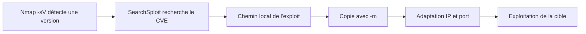
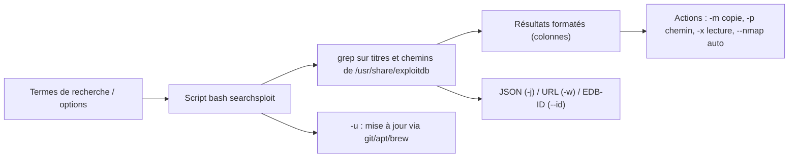

# SearchSploit — Exploit-DB en ligne de commande

> [!info] **En 1 phrase**
> SearchSploit = la base **Exploit-DB en local** : chercher, copier et exploiter des exploits en CLI, sans connexion, avec des opérateurs de recherche type Google.

> [!note] À vérifier
> - Version exacte du script : pas de release numérotée officielle (dépôt maintenu en continu, manuel « v4 »).
> - Licence : le script lui-même est GPLv2+, mais les exploits de la base relèvent de licences variées selon les auteurs.

---

## Overview

| Champ | Valeur |
|---|---|
| Nom complet | SearchSploit — Exploit Database Search (CLI officielle d'Exploit-DB) |
| Description | Recherche locale et hors-ligne dans l'archive Exploit-DB : titres, chemins, CVE, avec copie et lecture des exploits |
| Catégorie | Exploitation & Cracking |
| Sous-catégorie | Recherche d'exploits / bibliothèque de PoC |
| Fonction principale | Fouiller la base Exploit-DB en local pour retrouver l'exploit correspondant à une version de logiciel détectée |
| Type d'outil | CLI (script bash) |
| Licence | GPLv2+ (script) — exploits sous licences variées |
| Open source / propriétaire | Open source |
| Langage(s) de programmation | bash (grep, awk, sed ; dépend `git` pour la mise à jour, `xmllint` pour `--nmap`) |
| Développeur / organisation | Offensive Security (projet Exploit Database / Exploit-DB) |
| Projet officiel | Exploit Database (exploitdb) |
| Dépôt officiel | https://gitlab.com/exploit-database/exploitdb (miroir GitHub : https://github.com/offensive-security/exploitdb) |
| Documentation officielle | https://www.exploit-db.com/searchsploit |
| Date de création | 2004 (lancée avec la base Exploit-DB ; SearchSploit maintenu depuis par OffSec) |
| État du projet | actif (base mise à jour en continu, paquets Kali/brew) |
| Dernière version connue | — (dépôt continu) |
| Systèmes compatibles | Linux / Windows (WSL) / macOS (brew) — nécessite bash/Unix |

> [!note] Pour vérifier / compléter
> Champs laissés vides si l'information n'est pas confirmée par une source officielle.

---

## Concept

SearchSploit est l'outil de recherche officiel de la base **Exploit-DB**, fourni par le paquet `exploitdb` qui embarque tous les exploits dans `/usr/share/exploitdb/exploits/`. Il permet de fouiller cette base **entièrement en local, sans connexion**, grâce à des opérateurs de recherche type Google (`intitle:`, exclusions, recherche sur le titre ou les chemins).

Dans un pentest, il se place entre la **reconnaissance** (version exacte d'un logiciel détectée par Nmap) et l'**exploitation** : on retrouve le PoC correspondant, on le copie dans le dossier de travail avec `-m` et on l'adapte. C'est la passerelle qui transforme une version vulnérable détectée en exploit exécutable, le tout sans dépendre d'un accès Internet.



---

## Concepts fondamentaux

| Concept | Explication |
|---|---|
| **Exploit-DB** | Archive publique d'exploits, shellcodes et papiers, maintenue par Offensive Security depuis 2004 ; chaque entrée porte un **EDB-ID** (identifiant numérique) |
| **EDB-ID** | Identifiant unique d'un exploit (ex. 50383 pour le PoC Apache 2.4.49) ; utilisé avec `-m`, `-p`, `-x`, `-w` |
| **Arborescence locale** | Les exploits sont classés par famille : `exploits/linux/http/...`, `exploits/windows/remote/...`, etc. — la recherche porte sur ces chemins |
| **Opérateurs de recherche** | Plusieurs termes = ET logique ; guillemets = phrase exacte ; `--exclude="a\|b"` retire des valeurs ; `-t` limite au titre ; `-c` sensible à la casse ; `-e` correspondance exacte ; `-s` version stricte |
| **Recherche floue de versions** | Par défaut, SearchSploit accepte les plages de versions (« 2.4.49 » matche « 2.4.49 < 2.4.50 ») ; `-s` désactive ce flou |
| **Mirror (-m)** | Copie l'exploit dans le dossier courant pour l'adapter (IP, port, chemins) sans toucher à la base |
| **Nmap XML (--nmap)** | À partir d'un scan `nmap -sV -oX scan.xml`, SearchSploit extrait les versions de services et cherche les exploits correspondants (nécessite `xmllint`) |
| **Paquets complémentaires** | `exploitdb-bin-sploits` (exploits binaires) et `exploitdb-papers` (papiers de recherche) |

---

## Installation

### Debian / Ubuntu / Kali Linux

```bash
sudo apt update && sudo apt install -y exploitdb
sudo searchsploit -u                      # synchronise la base (git pull)
```

### Paquets optionnels

```bash
# Exploits binaires pré-compilés + papiers de recherche
sudo apt install -y exploitdb-bin-sploits exploitdb-papers
```

### Arch Linux

```bash
sudo pacman -S exploitdb
```

### macOS

```bash
brew install exploitdb
```

### Windows (via WSL2)

```bash
# Dépôts exploitdb + searchsploit (l'outil est dans le dépôt exploitdb)
git clone https://github.com/exploit-db/exploitdb.git
# puis exécuter le script : ./exploitdb/searchsploit ...
```

### Docker (test rapide sans installation)

```bash
docker run -it --rm kalilinux/kali-rolling bash -c "apt update && apt install -y exploitdb && searchsploit apache"
```

> [!warning] Prérequis & problèmes potentiels
> - Dépendances : `bash`, `grep`, `awk`, `sed` (coreutils) ; `git` pour `-u` ; `xmllint` (paquet `libxml2-utils`) pour `--nmap`.
> - La base est volumineuse : le premier `apt install` télécharge des milliers d'exploits dans `/usr/share/exploitdb/`.
> - Ne pas oublier `sudo searchsploit -u` après installation pour avoir les CVE récentes.

---

## Configuration

SearchSploit n'a pas de fichier de configuration : tout passe par des options. Le paramètre essentiel est la **localisation de la base**, gérée par le paquet (path par défaut `/usr/share/exploitdb/exploits/`).

| Paramètre | Rôle | Valeur possible | Impact | Exemple |
|---|---|---|---|---|
| `-t, --title` | Chercher uniquement dans le titre | flag | Réduit les faux positifs (défaut : titre + chemin) | `searchsploit -t phpMyAdmin` |
| `-c, --case` | Recherche sensible à la casse | flag | Filtre les résultats par casse | `searchsploit -c Windows` |
| `-e, --exact` | Correspondance exacte ET ordre sur le titre | flag (implique `-t`) | Évite les variations « WordPress Core 4.1 » vs « WordPress 4.1 » | `searchsploit -e "Apache 2.4.49"` |
| `-s, --strict` | Désactive la recherche floue de versions | flag | Exige la version exacte | `searchsploit -s Apache Struts 2.0.0` |
| `--exclude="a\|b"` | Retire des valeurs des résultats | chaîne `\|`-séparée | Élimine PoC/DoS/bruits | `searchsploit linux kernel --exclude="(PoC)|/dos/"` |
| `--cve <CVE>` | Recherche par identifiant CVE | CVE-AAAA-NNNNN | Vise une vulnérabilité précise | `searchsploit --cve 2021-44228` |
| `--nmap <fichier.xml>` | Recherche depuis un scan Nmap `-sV -oX` | fichier XML | Automatise le lien Nmap → exploit | `searchsploit --nmap scan.xml` |
| `-j, --json` | Sortie JSON (scriptable) | flag | Parsing avec `jq` | `searchsploit -j 55555 \| jq` |
| `--colour` | Désactive la coloration (active par défaut) | flag | Sortie brute pour les scripts | `searchsploit apache --colour` |
| `-u, --update` | Met à jour la base (deb/brew/git) | flag | Garde les CVE récentes | `sudo searchsploit -u` |

---

## Architecture interne

SearchSploit est un **script bash unique** qui enveloppe des commandes Unix (`grep`, `awk`, `sed`, `xmllint`) sur les fichiers du dépôt `exploitdb`. La base n'est pas une base SQL : c'est une **arborescence de fichiers** dont les titres figurent dans les noms et chemins des fichiers.



| Composant | Rôle |
|---|---|
| `searchsploit` (script bash) | Parsing des options, appel à grep/awk/sed, formatage des résultats |
| Dépôt `exploitdb` | Arborescence `exploits/<plateforme>/<type>/<EDB-ID>.<ext>` ; les titres des exploits sont dérivés des noms de fichiers + fichiers de métadonnées |
| `/usr/share/exploitdb/exploits/` | Emplacement de la base après installation du paquet |
| `git` / `xmllint` | `git` pour `-u` (pull du dépôt), `xmllint` pour parser le XML Nmap avec `--nmap` |

À l'exécution : le script construit une expression de recherche, la lance via `grep` sur les titres/chemins, trie et affiche en colonnes (`Exploit Title | Path`), puis applique les actions demandées (`-m`, `-p`, `-x`, `-w`, `--nmap`).

---

## Commandes

### Commandes principales

```bash
searchsploit apache
searchsploit -t phpMyAdmin
```

| Commande | Objectif | Résultat attendu |
|---|---|---|
| `searchsploit apache` | Recherche plein texte dans les titres et chemins | Liste des exploits contenant « apache » |
| `searchsploit -t phpMyAdmin` | Recherche limitée au titre | Résultats plus précis |
| `searchsploit "intitle:phpMyAdmin" --exclude="dos,poc"` | Recherche + exclusions | Titres phpMyAdmin sans les DoS/PoC |
| `searchsploit --cve 2021-41773` | Recherche par CVE | Exploits liés au CVE |
| `searchsploit -p 50383` | Affiche le chemin local complet | Path + copie dans le presse-papiers |
| `searchsploit -x 50383` | Ouvre l'exploit dans le pager (`$PAGER`) | Lecture du code source |
| `searchsploit -w 50383` | Affiche l'URL web Exploit-DB | Lien vers les commentaires/variantes |
| `searchsploit -m 50383` | Copie l'exploit dans le dossier courant | Fichier local prêt à adapter |
| `searchsploit -j "linux kernel 3.2" \| jq` | Sortie JSON | Résultats parsables |
| `searchsploit --nmap scan.xml` | Recherche depuis un scan Nmap `-oX` | Exploits matchés sur les versions détectées |

### Commandes avancées

```bash
# Recherche multi-termes + exclusions chaînées
searchsploit "remote code execution" apache --exclude="(PoC)|/dos/"

# Exact + strict sur une version précise
searchsploit -e -s "Apache Struts 2.0.0"

# Afficher les EDB-ID plutôt que les chemins
searchsploit --id apache

# Verbosité : plus de combinaisons avec --nmap
searchsploit --nmap scan.xml -v
```

---

## Options et flags

| Option | Description | Exemple | Niveau |
|---|---|---|---|
| `<mot-clé>` | Recherche plein texte (titre + chemin) | `searchsploit apache` | Basic |
| `-t, --title <mot>` | Ne cherche que dans le **titre** | `searchsploit -t phpMyAdmin` | Basic |
| `-m, --mirror <id>` | Copie l'exploit dans le dossier courant | `searchsploit -m 50383` | Basic |
| `-p, --path <id>` | Affiche le chemin local complet | `searchsploit -p 50383` | Basic |
| `-w, --www <id>` | Affiche l'URL web sur Exploit-DB | `searchsploit -w 50383` | Intermediate |
| `-x, --examine <id>` | Ouvre l'exploit dans le pager | `searchsploit -x 50383` | Intermediate |
| `--exclude="a\|b"` | Exclut des valeurs (chaînables avec `\|`) | `searchsploit linux --exclude="(PoC)|/dos/"` | Intermediate |
| `--cve <CVE>` | Recherche par identifiant CVE | `searchsploit --cve 2021-44228` | Intermediate |
| `-c, --case` | Recherche sensible à la casse | `searchsploit -c Windows` | Advanced |
| `-e, --exact` | Correspondance exacte & ordre sur le titre | `searchsploit -e "Apache 2.4.49"` | Advanced |
| `-s, --strict` | Désactive le flou de version | `searchsploit -s Apache Struts 2.0.0` | Advanced |
| `-j, --json` | Sortie JSON | `searchsploit -j 55555 \| jq` | Advanced |
| `--nmap <fichier.xml>` | Recherche depuis un scan Nmap `-sV -oX` | `searchsploit --nmap scan.xml` | Advanced |
| `--id` | Affiche l'EDB-ID au lieu du chemin | `searchsploit --id apache` | Expert |
| `--colour` | Désactive la coloration (active par défaut) | `searchsploit apache --colour` | Expert |
| `-v, --verbose` | Plus de combinaisons avec `--nmap` | `searchsploit --nmap scan.xml -v` | Expert |
| `-u, --update` | Met à jour la base | `sudo searchsploit -u` | Basic |
| `-h, --help` | Affiche l'aide complète | `searchsploit -h` | Basic |

> [!tip] Options les plus utiles au quotidien
> - `-t` : recherche dans le titre uniquement, pour limiter le bruit.
> - `--exclude="(PoC)|/dos/"` : filtre les PoC et les DoS dès la recherche.
> - `--cve` : la façon la plus directe de relier une CVE connue à un exploit.
> - `-m` : copier l'exploit avant de l'adapter (jamais l'exécuter depuis la base).
> - `--nmap` : automatise le lien découverte Nmap → exploits.

---

## Exemples pratiques

### Beginner

```bash
# Objectif : recherche simple
searchsploit apache
```

Résultat attendu : tableau `Exploit Title | Path` avec tous les exploits contenant « apache » dans le titre ou le chemin.

```bash
# Objectif : recherche par titre + exclusions
searchsploit -t phpMyAdmin --exclude="(PoC)|/dos/"
```

Erreur possible : base non synchronisée → résultats incomplets pour les CVE récentes ; lancer `sudo searchsploit -u`.

### Intermediate

```bash
# Objectif : viser une CVE précise
searchsploit --cve 2021-41773
```

```bash
# Objectif : localiser, lire puis copier un exploit
searchsploit -p 50383
searchsploit -x 50383
searchsploit -m 50383
```

### Advanced

```bash
# Objectif : recherche exacte d'une version, sans flou
searchsploit -e -s "Apache 2.4.49"
```

```bash
# Objectif : sortie JSON pour pipeline
searchsploit -j "linux kernel 3.2" | jq -r '.[] | .EDBID'
```

### Expert

```bash
# Objectif : exploitation depuis un scan Nmap complet d'un parc
nmap -sV -oX scan.xml 10.10.20.30/24
searchsploit --nmap scan.xml --exclude="(PoC)|/dos/" -v

# Objectif : copier automatiquement les exploits matchés
for id in $(searchsploit --nmap scan.xml --id | awk '{print $1}'); do
  searchsploit -m "$id"
done
```

---

## Workflow complet (scénario pas à pas)

1. **Étape 1 — Synchroniser la base** : garantir que les CVE récentes sont présentes.
   ```bash
   sudo searchsploit -u
   ```
2. **Étape 2 — Identifier la version exacte** du service avec Nmap.
   ```bash
   nmap -sV -p 80,443,8080 10.10.20.15
   ```
3. **Étape 3 — Rechercher l'exploit** correspondant (version + famille de produit).
   ```bash
   searchsploit "apache 2.4.49"
   searchsploit -t "Apache 2.4.49" --exclude="(PoC)|/dos/"
   ```
4. **Étape 4 — Localiser et copier** l'exploit choisi.
   ```bash
   searchsploit -p 50383
   searchsploit -m 50383
   ```
5. **Étape 5 — Adapter et exécuter** : remplacer l'IP, le port, les chemins, puis lancer dans un environnement isolé.
   ```bash
   python3 50383.py 10.10.20.15:80 /bin/bash -c "id"
   ```
6. **Étape 6 — Documenter** le CVE, le chemin local et le résultat dans le rapport d'audit.

---

## Scénarios avancés

### Scénario 1 : Exploitation d'une CVE récente (Apache 2.4.49 — Path Traversal → RCE)

Le PoC `50383` combine un path traversal (`/cgi-bin/.%2e/%2e%2e/...`) et l'exécution de commandes à distance.

```bash
searchsploit "Apache 2.4.49"
searchsploit -m 50383
python3 50383.py 10.10.20.15:8080 /bin/bash -c "cat /etc/passwd"
# puis remplacer la commande par un reverse shell
```

### Scénario 2 : Recherche automatisée depuis un scan Nmap complet

Scanner tout un parc puis laisser SearchSploit filtrer les services intéressants.

```bash
nmap -sV -oX scan.xml 10.10.20.30/24
searchsploit --nmap scan.xml
searchsploit --nmap scan.xml --exclude="(PoC)|/dos/" --id
```

### Scénario 3 : Recoupement CVE ↔ Exploit pour un rapport

```bash
# Lier une CVE à son EDB-ID et générer la référence web
searchsploit --cve 2021-41773
searchsploit -w 50383
```

---

## Cybersecurity use cases

SearchSploit se place entre la **reconnaissance technique** (version détectée) et l'**exploitation** (sélection du PoC) — un outil de soutien, pas un outil d'exploitation en soi.

| Phase | Utilisation |
|---|---|
| Reconnaissance | Croiser les versions détectées (Nmap, [[Outil - nuclei|nuclei]]) avec les exploits disponibles |
| Énumération | Recherche par produit/version, par CVE, par catégorie (webapps, remote, local) |
| Vulnérabilité | Confirmation de l'existence d'un PoC public pour une CVE donnée |
| Exploitation | Copie (`-m`), lecture (`-x`), adaptation du PoC, intégration à Metasploit (`msfconsole`) |
| Post-exploitation | Exploits `local/` pour la privilege escalation |
| Reporting | Documentation CVE ↔ EDB-ID ↔ URL Exploit-DB |

```text
Nmap -sV → searchsploit (CVE/version) → PoC adapté (-m) → Exploitation → Rapport
```

---

## MITRE ATT&CK

| Tactique | Technique / Sub-technique | ID | Raison | Détection | Mitigation |
|---|---|---|---|---|---|
| Reconnaissance | Gather Victim Host Information: Software | T1592.002 | Le workflow (Nmap -sV → searchsploit) collecte les versions logicielles pour sélectionner un exploit | Détection des scans de services (`-sV`), alertes sur fingerprinting intensif | Limiter l'exposition, masquer les bannières de version |
| Initial Access | Exploit Public-Facing Application | T1190 | La sélection d'un PoC via SearchSploit aboutit à l'exploitation d'une application exposée | WAF/IDS avec signatures des PoC publics, corrélation SIEM | Patch management rigoureux, WAF, segmentation |
| Lateral Movement / Impact | Exploitation of Remote Services | T1210 | Les exploits `remote/` trouvés servent à prendre le contrôle de services distants | Surveillance des connexions sortantes anormales, logs d'exploitation | Mise à jour des services, EDR, segmentation réseau |

> [!note] Ne renseigner que si l'association est réellement pertinente.
> SearchSploit ne génère **aucun trafic** (usage 100 % local) : les techniques listées concernent la chaîne qu'il alimente.

---

## Defensive Security

SearchSploit est **invisible sur le réseau** (aucune connexion). La défense doit se concentrer sur les **conséquences** : les requêtes d'exploitation issues des PoC copiés, et le patch management qui les rend inutiles.

### Signes observables

| Indicateur | Détail |
|---|---|
| Requêtes malformées typiques des PoC publics (ex : `%2e%2e/` pour le path traversal Apache) | WAF avec règles sur les patterns de traversal, patch immédiat des CVE |
| Versions logicielles obsolètes exposées sur Internet | Patch management rigoureux (WSUS, agents, fenêtres de maintenance) |
| Trafic de scan massif (Nmap) suivi de requêtes ciblées d'exploitation | IDS/IPS avec signatures des PoC Exploit-DB, corrélation SIEM |
| Téléchargements de scripts d'exploitation depuis GitHub/Exploit-DB | Proxy avec catégorisation, détection des téléchargements de PoC |
| Présence d'une base Exploit-DB locale sur un poste | Indicateur de préparation offensive sur une machine compromise |

### Règles de détection (Sigma / Suricata / Snort / YARA)

```yaml
# Exemple Sigma : requêtes de path traversal (pattern de PoC type Apache 2.4.49)
title: HTTP Path Traversal - Encoded Dot Dot
id: 7c3d4e5f-6a7b-4c8d-9e0f-1a2b3c4d5e6f
status: experimental
logsource:
    category: webserver
detection:
    selection:
        cs-uri-query|contains:
            - "%2e%2e/"
            - ".%2e/"
            - "%2e%2e%5c"
            - "..%2f"
    condition: selection
falsepositives:
    - Normalisation légitime par certains frameworks
level: high
```

```bash
# Exemple Suricata/Snort : traversal encodé dans l'URI
alert http any any -> any any (msg:"HTTP Directory Traversal - encoded"; flow:to_server,established; content:"%2e%2e"; http_uri; content:"/"; http_uri; distance:1; sid:2026004; rev:1;)
```

---

## Automatisation

```bash
# Pipeline Nmap → searchsploit → copie automatique
nmap -sV -oX scan.xml 10.10.20.30/24
searchsploit --nmap scan.xml --id | while read id path; do
  echo "CVE potentielle pour $path -> EDBID $id"
  searchsploit -m "$id" 2>/dev/null
done
```

```bash
# Vérifier que la base est à jour avant un engagement
if [ "$(id -u)" -eq 0 ]; then searchsploit -u; else sudo searchsploit -u; fi
```

```python
# Orchestration Python : recherche JSON + génération d'un rapport
import json, subprocess

out = subprocess.run(["searchsploit", "-j", "--cve", "2021-41773"],
                     capture_output=True, text=True).stdout
for row in json.loads(out):
    print(row["Title"], "->", row["Path"])
```

---

## Output et parsing

La sortie par défaut est **humaine** : tableau `Exploit Title | Path` en colonnes, coloré par défaut (`--colour` désactive la couleur). Les formats exploitables : **JSON** (`-j`), **URLs** (`-w`), **EDB-ID** (`--id`), **chemins** (`-p`).

```bash
# Sortie JSON parsable avec jq
searchsploit -j "linux kernel 3.2" | jq -r '.[] | "\(.EDBID) - \(.Title)"'
```

```bash
# N'extraire que les chemins locaux pour un script
searchsploit apache --id | awk '{print $NF}'
```

```python
# Parsing Python de la sortie JSON
import json, subprocess

out = subprocess.run(["searchsploit", "-j", "phpMyAdmin"],
                     capture_output=True, text=True).stdout
for row in json.loads(out):
    print(f"{row['EDBID']}: {row['Title']} @ {row['Path']}")
```

> [!note] Formats disponibles
> Colonnes (humain), JSON (`-j`), URL (`-w`), EDB-ID (`--id`), chemin (`-p`). Pas de sortie XML native.

---

## Intégrations

```text
Nmap -sV (-oX) → searchsploit --nmap → PoC (-m) → Metasploit / script adapté → Exploitation
```

- [[Tools| Outils]] — catalogue des outils du vault
- [[Outil - Nmap|Nmap]] — découvreur de services dont la sortie `-oX` alimente `--nmap`
- [[Outil - Metasploit|Metasploit]] — exploitation avec les modules issus d'Exploit-DB (`msfconsole`)
- [[Outil - nuclei|nuclei]] — templates de vulnérabilités à croiser avec les résultats
- [[Outil - SearchSploit|SearchSploit]] — recherche locale d'exploits (complément : [[Outil - RustScan|RustScan]])
- [[Techniques/Path Traversal|Path Traversal]] — classe de vulnérabilité de nombreux PoC webapps
- [[Techniques/LFI et RFI|LFI / RFI]] — exploitation liée aux PoC `webapps/`
- [[Techniques/Reverse Shells| Reverse Shells]] — payload à injecter après adaptation du PoC
- [[Techniques/Privilege Escalation Linux| PrivEsc Linux]] — exploits `linux/local/` pour l'escalade

---

## Alternatives

| Outil | Avantages | Inconvénients | Cas d'usage |
|---|---|---|---|
| Exploit-DB web (https://www.exploit-db.com) | Moteur de recherche en ligne, filtres, commentaires, métadonnées | Nécessite Internet, pas scriptable en local | Recherche exploratoire riche |
| [[Outil - Metasploit|Metasploit]] | Base d'exploits intégrée (`search`, `exploit/multi/...`) + payloads | Base plus petite côté PoC one-shot | Exploitation intégrée avec payloads |
| [[Outil - nuclei|nuclei]] | Templates de détection/exploitation YAML, rapide, extensible | Pas de PoC « exploit » autonomes | Détection automatisée de vulnérabilités |
| Vulners API / NVD | Recherche par CVE avec avis de sécurité | Pas d'exploits directement exploitables | Veille et mapping CVE |
| GitHub dorks | PoC récents parfois avant Exploit-DB | Qualité variable, pas d'indexation locale | PoC de dernière minute (0-day) |

> **Quand utiliser SearchSploit plutôt que Metasploit ?** Quand on veut le **PoC source** à adapter hors de tout framework (test de lab, portage, audit de code), surtout **hors-ligne** ; Metasploit prend le relais pour l'exécution intégrée avec payloads.

---

## Performance

- **Recherche locale instantanée** : grep sur des fichiers texte, sans index — réponse en une fraction de seconde même sur des milliers d'exploits.
- **Aucune consommation réseau** : usage 100 % local, idéal en air-gap.
- **Mémoire/CPU** : négligeables (bash + grep) ; les seuls pics sont le `git pull` de `-u` (mise à jour de la base) et `--nmap` (parsing XML).
- **Base volumineuse** : `/usr/share/exploitdb/` représente plusieurs centaines de Mo (dont `exploitdb-bin-sploits`) ; à prévoir sur les systèmes légers.
- **Limites** : pas de moteur d'indexation avancé (regex grep uniquement), pas de recherche en langage naturel, pas de classement par fiabilité.

---

## Troubleshooting

### Common problems

#### Problème : les CVE récentes ne sont pas trouvées

- **Cause** : base non synchronisée.
- **Solution** : `sudo searchsploit -u` (mise à jour via apt/brew/git).
- **Vérification** : rejouer `searchsploit --cve <CVE-récent>`.

#### Problème : trop de résultats / faux positifs

- **Cause** : recherche plein texte (titre + chemin) trop large.
- **Solution** : `-t` (titre), `-e` (exact), `-s` (strict), `--exclude="(PoC)|/dos/"`.
- **Vérification** : `searchsploit -e -s "Apache 2.4.49"`.

#### Problème : `--nmap` ne retourne rien ou erreur xmllint

- **Cause** : `xmllint` absent, ou scan Nmap sans `-sV`.
- **Solution** : `sudo apt install -y libxml2-utils` ; rescanner avec `nmap -sV -oX`.
- **Vérification** : `xmllint --noout scan.xml`.

#### Problème : `-m` copie un exploit qui ne marche pas

- **Cause** : PoC mal adapté (IP/port/chemins) ou cible différente (build, patch partiel).
- **Solution** : lire `-x`, adapter IP/port, tester en lab ; croiser avec `nmap --script vulners`.
- **Vérification** : exécuter dans un environnement isolé sur la version exacte.

#### Problème : un exploit trouvé n'est pas exploitable sur la cible

- **Cause** : version proche mais pas identique, ou la configuration diffère.
- **Solution** : vérifier la version réelle (`-sV`), lire les commentaires via `-w`, chercher des variantes.
- **Vérification** : comparer la version détectée à la plage supportée par le PoC.

---

## Sécurité de l'outil

- **Aucun trafic émis** : SearchSploit est 100 % local — il ne télécharge que lors de `-u`.
- **Exploits non fiables par défaut** : un PoC d'Exploit-DB n'est pas un logiciel audité ; il peut être buggé, malveillant ou destructeur. Toujours **lire le code** (`-x`) et tester en lab avant usage.
- **Secrets** : les exploits copiés peuvent contenir des backdoors ou exfiltrer des données — vérifier le code, ne pas l'exécuter avec des privilèges élevés sans analyse.
- **Autorisation** : rechercher et exécuter un exploit sans mandat est illégal ; l'outil documente les exploits à usage autorisé.
- **Provenance** : privilégier les paquets officiels (`exploitdb`) et le dépôt GitLab officiel pour limiter la supply chain.
- **Bonnes pratiques** : `-m` dans un dossier de travail dédié, sandbox, et relecture systématique du code avant exécution.

---

## Limitations

- **Pas de mise à jour automatique** : il faut lancer `-u` (ou l'apt) régulièrement pour avoir les CVE récentes.
- **Recherche textuelle uniquement** : grep sur titres/chemins — pas de recherche sémantique, ni par CWE, ni par métadonnées d'auteur.
- **Faux négatifs possibles** : PoC hébergés ailleurs (GitHub) ou plus récents que la base ne sont pas indexés.
- **Fiabilité des exploits variable** : votes/commentaires utiles uniquement en ligne (`-w`).
- **Pas d'exécution intégrée** : SearchSploit copie/ouvre mais n'exécute pas les exploits (contrairement à Metasploit).
- **Dépendances Unix** : bash/grep/sed/xmllint — fonctionne sous Linux/macOS/WSL, pas nativement PowerShell.
- **Pas d'API** : sortie console/JSON seulement, pas de service REST.

---

## Cheatsheet

```bash
# Recherche simple et par titre
searchsploit apache
searchsploit -t phpMyAdmin

# Opérateurs type Google + exclusion des PoC/DoS
searchsploit "intitle:phpMyAdmin" --exclude="(PoC)|/dos/"
searchsploit --cve 2021-41773 --exclude="(PoC)"

# Localiser (chemin), ouvrir en lecture, URL web
searchsploit -p 50383
searchsploit -x 50383
searchsploit -w 50383

# Copier l'exploit dans le dossier courant
searchsploit -m 50383

# Recherche depuis un scan Nmap
nmap -sV -oX scan.xml 10.10.20.15
searchsploit --nmap scan.xml

# Sortie JSON pour automatisation
searchsploit -j 55555 | jq

# Mettre à jour la base
sudo searchsploit -u
```

---

## Quick reference

| | |
|---|---|
| **À quoi sert-il ?** | Recherche hors-ligne dans la base Exploit-DB pour retrouver l'exploit d'une version logicielle ou d'une CVE |
| **Quand l'utiliser ?** | Après avoir détecté la version d'un service (Nmap `-sV`), avant de choisir/porter un exploit |
| **Commande principale** | `searchsploit -t "Apache 2.4.49" --exclude="(PoC)|/dos/"` |
| **Alternative principale** | Exploit-DB en ligne, [[Outil - Metasploit|Metasploit]] (exécution intégrée), [[Outil - nuclei|nuclei]] |
| **Concepts importants** | EDB-ID, arborescence `exploits/<famille>/`, `-m` (mirror), `--nmap`, `--cve`, `-j` (JSON) |
| **Liens associés** | [[Outil - Nmap|Nmap]], [[Outil - Metasploit|Metasploit]], [[Outil - nuclei|nuclei]], [[Techniques/Reverse Shells|Reverse Shells]], [[Techniques/Privilege Escalation Linux|PrivEsc Linux]] |

---

## Détection & Défense

| Signe | Défense |
|---|---|
| Requêtes malformées typiques des PoC publics (ex : `%2e%2e/` pour le path traversal Apache) | WAF avec règles sur les patterns de traversal, patch immédiat des CVE |
| Versions logicielles obsolètes exposées sur Internet | Patch management rigoureux (WSUS, agents, fenêtres de maintenance) |
| Trafic de scan massif (Nmap) suivi de requêtes ciblées d'exploitation | IDS/IPS avec signatures des PoC Exploit-DB, corrélation SIEM |
| Téléchargements de scripts d'exploitation depuis GitHub/Exploit-DB | Proxy avec catégorisation, détection des téléchargements de PoC |
| Présence d'une base Exploit-DB locale sur un poste | Indicateur de préparation offensive à investiguer |

---

## Tips & Pièges

> [!tip] **Tips**
> - Croise avec `nmap --script vulners` ou un scanner de vulnérabilités pour confirmer qu'une version est affectée avant d'utiliser l'exploit.
> - `-w` donne l'URL web : utile pour lire les commentaires et les variantes récentes de l'exploit.
> - Les exploits `webapps/` sont souvent des PoC à adapter ; vérifie la fiabilité (votes, commentaires) avant de lancer.
> - `-j` (JSON) permet d'automatiser la sélection du bon EDB-ID dans un pipeline.
> - Pense à `sudo searchsploit -u` en début d'engagement : une base à jour change tout sur les CVE récentes.

> [!warning] **Pièges**
> - `searchsploit -m` copie l'exploit **tel quel** : adapte toujours IP/port et vérifie qu'il ne détruit pas la cible.
> - Une base **non synchronisée** (`-u`) donne des faux négatifs : les CVE récentes manquent.
> - Un exploit trouvé ne correspond pas toujours à la configuration exacte de la cible : vérifie la version avant de lancer.
> - `--colour` **désactive** la couleur (active par défaut) : surprenant pour ceux qui connaissent l'ancienne syntaxe.
> - Ne jamais exécuter un PoC sans l'avoir relu (`-x`) : les exploits publics peuvent être modifiés ou malveillants.

---

## References

### Official

- Exploit-DB : https://www.exploit-db.com/
- Manuel SearchSploit : https://www.exploit-db.com/searchsploit
- Dépôt GitLab officiel : https://gitlab.com/exploit-database/exploitdb
- Miroir GitHub : https://github.com/offensive-security/exploitdb
- Page Kali (paquet exploitdb) : https://www.kali.org/tools/exploitdb/

### Security references

- MITRE ATT&CK — Exploit Public-Facing Application (T1190) : https://attack.mitre.org/techniques/T1190/
- MITRE ATT&CK — Exploitation of Remote Services (T1210) : https://attack.mitre.org/techniques/T1210/
- NVD (National Vulnerability Database) : https://nvd.nist.gov/
- CVE.org : https://www.cve.org/

### Community

- Write-ups et walkthroughs publiés sur Exploit-DB (section papers)
- Blogs de recherche Offensive Security / Kali : https://www.kali.org/blog/

---

**Liens :** [[Tools| Outils]] · [[Techniques/Privilege Escalation Linux| PrivEsc Linux]] · [[Techniques/Reverse Shells| Reverse Shells]] · [[Outil - Nmap|Nmap]] · [[Outil - Metasploit|Metasploit]] · [[Outil - nuclei|nuclei]] · [[Techniques/Path Traversal|Path Traversal]] · [[Techniques/LFI et RFI|LFI / RFI]]
