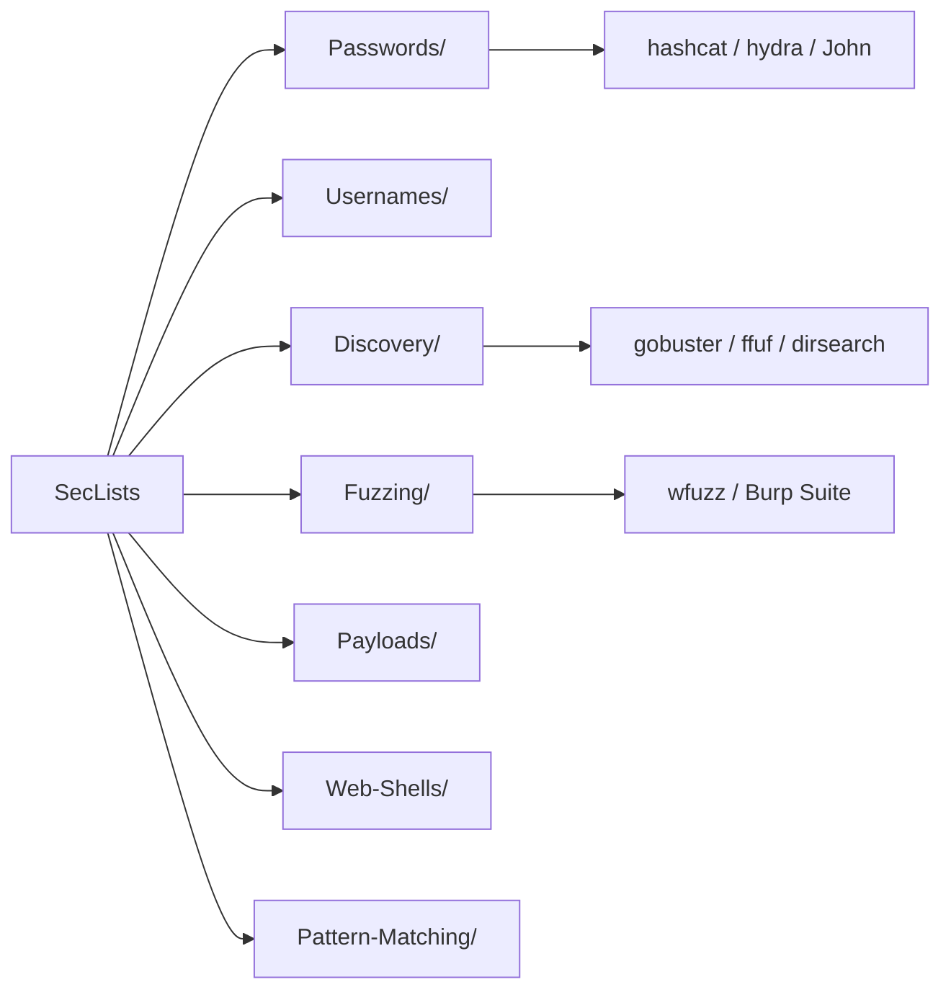

# SecLists — La collection de wordlists et payloads du testeur

> [!info] **En 1 phrase**
> SecLists est la boîte à listes de référence du testeur d'intrusion : usernames, mots de passe, chemins web, DNS, payloads, webshells et patterns de données sensibles — à cloner une fois et à brancher sur gobuster, ffuf, hydra ou hashcat.

---

## Overview

| Champ | Valeur |
|---|---|
| Nom complet | SecLists |
| Description | Collection de listes pour assessments sécurité : usernames, mots de passe, URLs, patterns de données sensibles, payloads de fuzzing, webshells, etc. |
| Catégorie | Wordlists & Générateurs |
| Sous-catégorie | Dictionnaires & listes de référence (collection) |
| Fonction principale | Fournir les listes prêtes à l'emploi pour l'énumération, le fuzzing, la découverte de contenu et le cracking de mots de passe |
| Type d'outil | Collection de fichiers texte + utilitaires (`/.bin`) |
| Licence | MIT |
| Open source / propriétaire | Open source |
| Langage(s) de programmation | Texte/plateforme ; utilitaires en Python, Perl, Bash, PHP |
| Développeur / organisation | Daniel Miessler (fondateur) ; mainteneurs : Jason Haddix, Ignacio Portal (depuis 2021), g0tmi1k |
| Projet officiel | https://github.com/danielmiessler/SecLists |
| Dépôt officiel | https://github.com/danielmiessler/SecLists |
| Documentation officielle | README du dépôt + site seclists.dev |
| Date de création | 19/02/2012 |
| État du projet | Actif (29 releases, ~6 700 commits, ~67-73 k étoiles, ~25 k forks) |
| Dernière version connue | 2025.3 (19/09/2025) |
| Systèmes compatibles | Linux (paquet Kali, BlackArch), macOS, Windows |

> [!note] Pour vérifier / compléter
> Faits confirmés sur le README officiel : MIT, mainteneurs cités, install par `apt -y install seclists` (Kali) et `pacman -S seclists` (BlackArch), dernière release taguée `2025.3`.

---

## Concept

SecLists est la concrétisation d'une idée simple : un testeur doit pouvoir **cloner un seul dépôt sur une machine de test neuve et y trouver toutes les listes dont il a besoin** — usernames, mots de passe, chemins web, sous-domaines, payloads, webshells, patterns. Historiquement chaque outil livrait ses propres listes éparpillées ; SecLists centralise, normalise et documente.

Le dépôt ne contient **aucun binaire à lancer** : ce sont des fichiers texte (une entrée par ligne) branchés en entrée d'autres outils. Son utilité ne vient pas d'un moteur de génération mais de la **qualité et de la diversité de ses listes** : certaines sont classées par popularité (le top 1 000 / 10 000 / 100 000 des mots de passe), d'autres par provenance (bases leakées : RockYou, LinkedIn, Ashley-Madison...), d'autres par usage (chemins web, DNS, payloads XSS/SQLi). Le dossier `Ai/LLM_Testing/` couvre depuis peu les tests d'IA générative (prompt injection). Le sous-dossier `.bin/` contient des petits générateurs et mutateurs de listes.



---

## Concepts fondamentaux

| Concept | Explication |
|---|---|
| Wordlist | Fichier texte, une entrée par ligne, utilisé comme dictionnaire d'attaque |
| Dictionary attack | Test de chaque mot d'une liste contre une cible (login, hash, chemin) |
| Liste classée (ranked) | Liste triée par probabilité d'occurrence : on attaque d'abord les entrées du haut |
| Liste leakée | Mots de passe issus de fuites réelles (RockYou, LinkedIn, Ashley-Madison...) |
| Fuzzing | Envoi de payloads variés pour provoquer des erreurs ou des comportements révélateurs |
| Discovery | Recherche de contenu non référencé : chemins web, fichiers, sous-domaines, DNS |
| Payload | Donnée malveillante ou de test injectée (XSS, SQLi, command injection) |
| Web shell | Script (PHP, ASP, JSP) déposé sur un serveur pour exécuter des commandes |
| Pattern-Matching | Expressions et patterns pour détecter des données sensibles (CC, SSN, emails) |
| `.bin/` | Utilitaires du dépôt : générateurs et mutateurs de wordlists |

---

## Installation

### Kali Linux

```bash
# Paquet officiel (installe les listes sous /usr/share/seclists)
sudo apt update && sudo apt install -y seclists
ls /usr/share/seclists
```

### BlackArch

```bash
sudo pacman -S seclists
```

### Git — clone complet (recommandé)

```bash
git clone https://github.com/danielmiessler/SecLists.git
cd SecLists
```

### Git — clone sans historique (plus rapide, ~50 Mo/s)

```bash
git clone --depth 1 https://github.com/danielmiessler/SecLists.git
```

### Archive ZIP

```bash
wget -c https://github.com/danielmiessler/SecLists/archive/master.zip -O SecList.zip
unzip SecList.zip && rm -f SecList.zip
```

### macOS / Windows

```bash
# Identique aux méthodes Git/ZIP ci-dessus ; aucun binaire requis
git clone --depth 1 https://github.com/danielmiessler/SecLists.git
```

> [!warning] Prérequis & problèmes potentiels
> Le dépôt fait plusieurs centaines de Mo (clone complet ~7-8 min à 50 Mo/s). L'antivirus peut **faussement signaler** des fichiers (webshells, payloads) : ajouter le dossier aux exclusions. Il n'est pas recommandé de stocker ces fichiers sur un serveur de production (risque de local file include).

---

## Configuration

Pas de fichier de configuration : SecLists se « configure » par le **choix des listes**. La règle d'or : cibler la bonne liste pour l'étape (top 1 000 pour un spray, liste complète pour un crack hors-ligne).

| Paramètre | Rôle | Valeur possible | Impact | Exemple |
|---|---|---|---|---|
| Choix de la liste | Adapter le volume et la pertinence | Chemin vers un fichier `.txt` | Détermine durée et précision | `Passwords/Common-Credentials/10-million-password-list-top-1000.txt` |
| `sort -u` | Dédupliquer avant usage | Pipe | Réduit le volume, fiabilise | `sort -u top1000.txt` |
| `grep` | Filtrer par motif (longueur, pattern) | Regex | Affine la liste à la demande | `grep -E '^.{8,14}$'` |
| Sparse checkout | N'installer qu'un sous-dossier | Git | Économise disque | `git sparse-checkout set Discovery` |
| Mise à jour | Récupérer les dernières listes | `git pull` | Liste fraîche, nouveaux patterns | `git -C SecLists pull` |

---

## Architecture interne

SecLists est organisé en **dossiers thématiques**, chacun dédié à une étape du test. `Usernames/` contient les listes d'utilisateurs (top-usernames-shortlist, xato-net-10-million-usernames...). `Passwords/` est le plus utilisé : sous-dossiers `Common-Credentials/` (10-million-password-list-top-1000/10000/100000, 100k-most-used-passwords-NCSC), `Leaked-Databases/` (rockyou.txt.tar.gz, LinkedIn, Ashley-Madison, Antipublic, RockYou2021/2024...), `Permutations/`, `Wifi-WPA/`, `Software/`. `Discovery/` rassemble `DNS/`, `Web-Content/` (directory-list-2.3-medium.txt, raft-*, Common-PHP-Filenames...) et `Infrastructure/`. `Fuzzing/` et `Payloads/` fournissent les payloads XSS, SQLi, command injection, XXE. `Web-Shells/` (PHP, ASP, JSP), `Pattern-Matching/` (regex CC/SSN/emails), `Miscellaneous/` et `Ai/LLM_Testing/` complètent l'ensemble. Enfin `.bin/` porte des petits scripts (générateurs, mutateurs) et `.github/` l'outillage de contribution.

Le format de fichier est **uniforme : texte brut, une entrée par ligne** — ce qui rend chaque liste directement compatible avec tous les outils (hydra, hashcat, gobuster, ffuf, wfuzz). Les conventions de nommage sont descriptives (`directory-list-2.3-medium.txt` = version 2.3, taille medium ; `10-million-password-list-top-1000` = extrait des 1 000 premiers d'une base de 10 millions). Le projet est maintenu via PR : CONTRIBUTING.md encadre les ajouts, CONTRIBUTORS.md crédite les 317+ contributeurs.

---

## Commandes

SecLists n'a pas de CLI propre : les « commandes » sont celles des outils consommateurs, avec le chemin de liste en argument.

### Commandes principales

| Commande | Objectif | Résultat attendu |
|---|---|---|
| `gobuster dir -u https://example.com -w /SecLists/Discovery/Web-Content/directory-list-2.3-medium.txt` | Découverte de répertoires | Chemins valides signalés |
| `ffuf -u https://example.com/FUZZ -w /SecLists/Discovery/Web-Content/raft-large-files.txt` | Fuzzing de fichiers | Fichiers existants détectés |
| `hydra -L users.txt -P pass.txt ssh://cible-example.com` | Test d'authentification | Credentials valides trouvés |
| `hashcat -m 1000 ntlm.txt /SecLists/Passwords/Leaked-Databases/rockyou.txt` | Cracking hors-ligne | Hashes cassés |
| `john --wordlist=/SecLists/Passwords/Common-Credentials/10-million-password-list-top-10000.txt hash.txt` | Cracking John | Hashes cassés |
| `aircrack-ng -w /SecLists/Passwords/Wifi-WPA/… .cap` | Attaque WPA | Clé PSK retrouvée |

### Commandes avancées

```bash
# Extraire rockyou (archivé tar.gz) puis compter
tar xzf /SecLists/Passwords/Leaked-Databases/rockyou.txt.tar.gz
wc -l /SecLists/Passwords/Leaked-Databases/rockyou.txt

# Pipeline : filtrer par longueur puis dédupliquer avant usage
grep -E '^.{8,14}$' 10-million-password-list-top-100000.txt | sort -u > top_8_14.txt

# Combiner deux listes (usernames + common credentials) pour hydra
cat top-usernames-shortlist.txt /tmp/emails.txt | sort -u > /tmp/users.txt
```

---

## Options et flags

Pas de flags propres : le « réglage » se fait en sélectionnant la bonne liste. Le tableau ci-dessous aide à choisir.

| Choix | Description | Liste type | Niveau |
|---|---|---|---|
| Top users | Petite liste d'usernames courants | `Usernames/top-usernames-shortlist.txt` | Basic |
| Top passwords | Quelques centaines de mots de passe probables | `Passwords/Common-Credentials/10-million-password-list-top-1000.txt` | Basic |
| Passwords volumineux | Dictionnaire exhaustif (10 M) | `…top-100000.txt` / rockyou | Intermediate |
| Chemins web | Directory bruteforce | `Discovery/Web-Content/directory-list-2.3-medium.txt` | Intermediate |
| Sous-domaines | DNS bruteforce | `Discovery/DNS/subdomains-top1million-110000.txt` | Intermediate |
| Payloads XSS/SQLi | Fuzzing d'injection | `Fuzzing/XSS/*.txt`, `Fuzzing/SQLi/*.txt` | Advanced |
| Webshells | Dépôt de shell | `Web-Shells/PHP/…` | Advanced |
| Patterns données | Détection de données sensibles | `Pattern-Matching/*.txt` | Intermediate |

> [!tip] Choix les plus utiles au quotidien
> Pour un spray : `top-usernames-shortlist.txt` + `10-million-password-list-top-1000.txt`. Pour un crack hors-ligne : rockyou ou le top-100000. Pour du web : `directory-list-2.3-medium.txt`. Toujours `sort -u` avant utilisation pour éviter les doublons.

---

## Exemples pratiques

### Beginner

```bash
# Objectif : compter et inspecter la liste top 1000
wc -l /SecLists/Passwords/Common-Credentials/10-million-password-list-top-1000.txt
head -10 /SecLists/Passwords/Common-Credentials/10-million-password-list-top-1000.txt

# Objectif : filtrer les entrées de 8 à 14 caractères
grep -E '^.{8,14}$' /SecLists/Passwords/Common-Credentials/10-million-password-list-top-10000.txt \
  | sort -u > /tmp/top_8_14.txt
```

### Intermediate

```bash
# Objectif : énumérer les usernames valides sur un login HTTP
ffuf -u https://example.com/login -X POST -d "user=FUZZ&pass=x" \
  -w /SecLists/Usernames/top-usernames-shortlist.txt -fw 25

# Objectif : bruteforce web avec hydra (test autorisé)
hydra -L /SecLists/Usernames/top-usernames-shortlist.txt \
  -P /SecLists/Passwords/Common-Credentials/10-million-password-list-top-1000.txt \
  https-get://example.com/login
```

### Advanced

```bash
# Objectif : cracking NTLM avec rockyou
hashcat -m 1000 ntlm.txt /SecLists/Passwords/Leaked-Databases/rockyou.txt -r OneRuleToRuleThemAll.rule -O

# Objectif : fuzzing SQLi avec Burp à partir des listes Fuzzing
# Importer /SecLists/Fuzzing/SQLi/ dans l'Intruder de Burp Suite
```

### Expert

```bash
# Objectif : wordlist d'entreprise hybride (contextes + mutations)
cat /tmp/prenoms.txt /tmp/produits.txt > /tmp/mots.txt
rsmangler -f /tmp/mots.txt -m 8 -x 14 -o /tmp/candidats.txt
hashcat -m 5600 netntlmv2.txt /tmp/candidats.txt
# Compléter avec une liste SecLists de passphrases si besoin
```

---

## Workflow complet (scénario pas à pas)

1. **Installer** le paquet Kali (`sudo apt install -y seclists`) ou cloner le dépôt.
2. **Choisir les listes** pour l'objectif : discovery web → `Discovery/Web-Content/directory-list-2.3-medium.txt` ; cracking → rockyou ou top-100000.
3. **Dédupliquer et filtrer** les listes avant usage :
   ```bash
   sort -u /SecLists/Discovery/Web-Content/directory-list-2.3-medium.txt > /tmp/web.txt
   ```
4. **Brancher sur l'outil cible** (gobuster, ffuf, hydra, hashcat) :
   ```bash
   gobuster dir -u https://example.com -w /tmp/web.txt -t 50
   ```
5. **Analyser les résultats** (codes HTTP, tailles, réponses différentes de la baseline).
6. **Itérer** : croiser les découvertes avec d'autres listes (usernames → password spray, puis cracking hors-ligne).

---

## Scénarios avancés

### Scénario 1 : découverte complète d'un périmètre web

```bash
# 1. Sous-domaines : DNS bruteforce
ffuf -u https://example.com -w /SecLists/Discovery/DNS/subdomains-top1million-110000.txt -H "Host: FUZZ.example.com"
# 2. Répertoires sur chaque hôte découvert
gobuster dir -u https://api.example.com -w /SecLists/Discovery/Web-Content/directory-list-2.3-medium.txt
# 3. Fichiers sensibles (backups, configs)
ffuf -u https://api.example.com/FUZZ -w /SecLists/Discovery/Web-Content/Common-PHP-Filenames.txt
```

### Scénario 2 : compromission de credentials (spray puis crack)

```bash
# 1. Spray : 1 mot de passe du top-1000 sur beaucoup de comptes (autorisé)
hydra -L /tmp/users.txt -P /SecLists/Passwords/Common-Credentials/10-million-password-list-top-1000.txt smtp://cible-example.com -o /tmp/valides.txt
# 2. Cracking hors-ligne des hashes récupérés avec la même base élargie
hashcat -m 1000 ntlm.txt /SecLists/Passwords/Leaked-Databases/rockyou.txt -O
# 3. Réutilisation des secrets trouvés sur d'autres services (T1110.004)
```

### Scénario 3 : fuzzing applicatif (web shells et payloads)

```bash
# 1. Découvrir un chemin upload exécutable
ffuf -u https://app.example.com/FUZZ -w /SecLists/Discovery/Web-Content/raft-large-directories.txt
# 2. Tester des webshells PHP via l'upload (framework de test uniquement)
# 3. Vérifier les protections : payloads XSS/SQLi via Burp Intruder + /SecLists/Fuzzing/
```

### Scénario 4 : détection de données sensibles dans une fuite

```bash
# Pattern-Matching : rechercher numéros de cartes, SSN, emails dans un dump
grep -E '[0-9]{4}-[0-9]{4}-[0-9]{4}-[0-9]{4}' /tmp/dump.txt
grep -E '^[A-Za-z0-9._%+-]+@[A-Za-z0-9.-]+\.[A-Za-z]{2,}$' /tmp/dump.txt > /tmp/emails.txt
```

---

## Cybersecurity use cases

| Phase | Utilisation |
|---|---|
| Reconnaissance | Discovery DNS/web pour cartographier la surface (T1595) |
| Accès initial | Password guessing / spraying avec top-1000 (T1110.001/.003) |
| Crédential Access | Cracking hors-ligne (rockyou, top-100000) (T1110.002) |
| Attaques Wi-Fi | Wordlists WPA/WPA2 pour aircrack-ng (T1112) |
| Fuzzing / exploitation | Payloads XSS, SQLi, command injection (T1190, T1210) |
| Post-exploitation | Webshells et patterns de données sensibles |

---

## MITRE ATT&CK

| Tactique | Technique / Sub-technique | ID | Raison | Détection | Mitigation |
|---|---|---|---|---|---|
| Credential Access | Brute Force: Password Guessing | T1110.001 | Listes usernames/passwords en ligne | Échecs 4625 répétés par source | Verrouillage progressif, MFA |
| Credential Access | Brute Force: Password Cracking | T1110.002 | Wordlists crackées hors-ligne | Volume de logins anormal post-fuite | MFA, rotation, politique robuste |
| Credential Access | Brute Force: Password Spraying | T1110.003 | Top-1000 distribué sur comptes | Échecs distribués sur comptes variés | MFA, alertes UEBA, seuils |
| Discovery | Active Scanning: Wordlist Scanning | T1595.003 | Découverte DNS/web ciblée | Requêtes volumétriques inhabituelles | Rate limiting, WAF, journaux |

> [!note] Ne renseigner que si l'association est réellement pertinente.

---

## Defensive Security

### Signes observables

| Indicateur | Détail |
|---|---|
| Présence du dépôt | Clone SecLists ou `/usr/share/seclists` sur un poste |
| Requêtes web en rafale | Vagues de GET/HEAD sur chemins inventés (directory brute force) |
| Échecs de logon distribués | Tentatives avec le top-1000 sur de nombreux comptes |
| Payloads dans les logs | Caractères d'injection (XSS, SQLi) issus des listes Fuzzing |
| Faux positifs AV | Webshells et payloads signalés par l'antivirus local |

### Règles de détection (Sigma / Suricata / Snort / YARA)

```yaml
# Exemple Sigma — directory brute force web
title: Web Directory Bruteforce - Many 404/403 from one source
status: experimental
logsource:
  category: webserver
detection:
  selection:
    cs-method: GET
  timeframe: 5m
  condition:
    selection | count() by c-ip > 500
    and sc-status: [404, 403]
falsepositives:
  - Crawlers légitimes
level: medium
```

```bash
# Exemple Suricata — vagues de requêtes HTTP vers chemins inexistants
alert http $EXTERNAL_NET any -> $HOME_NET any (msg:"Potential directory brute force"; flow:to_server,established; http.method:"GET"; threshold:type both, track by_src, count 300, seconds 60; classtype:attempted-recon; sid:1000048; rev:1;)
```

---

## Automatisation

```bash
# Bash — mise à jour régulière des listes
git -C /opt/SecLists pull --depth 1 2>/dev/null || git clone --depth 1 https://github.com/danielmiessler/SecLists.git /opt/SecLists

# Bash — build d'un jeu de listes « politique 8-14 » pour tout un engagement
mkdir -p /tmp/policy
for l in 1000 10000 100000; do
  grep -E '^.{8,14}$' "/SecLists/Passwords/Common-Credentials/10-million-password-list-top-$l.txt" \
    >> /tmp/policy/pass.txt
done
sort -u /tmp/policy/pass.txt -o /tmp/policy/pass.txt
```

```python
# Python — sélection automatique de la liste selon le contexte
import os, subprocess

ROOT = "/SecLists"

def pick_list(usage: str):
    choices = {
        "spray": "Passwords/Common-Credentials/10-million-password-list-top-1000.txt",
        "crack": "Passwords/Leaked-Databases/rockyou.txt",
        "web": "Discovery/Web-Content/directory-list-2.3-medium.txt",
        "dns": "Discovery/DNS/subdomains-top1million-110000.txt",
        "users": "Usernames/top-usernames-shortlist.txt",
    }
    p = os.path.join(ROOT, choices[usage])
    n = int(subprocess.check_output(["wc", "-l", p]).split()[0])
    return p, n

print(pick_list("spray"))
```

---

## Output et parsing

SecLists produit des **fichiers texte, une entrée par ligne**. La sortie est donc consommée par les outils et manipulée avec les outils Unix classiques.

```bash
# Compter, prévisualiser, filtrer
wc -l top-usernames-shortlist.txt
head -5 top-usernames-shortlist.txt
grep -cE '^.{8,14}$' 10-million-password-list-top-100000.txt

# Extraire rockyou (archivé) et le dédupliquer
tar xzf rockyou.txt.tar.gz
sort -u rockyou.txt -o rockyou_clean.txt
```

```python
# Python — parser une liste et analyser les motifs
import collections
with open("/SecLists/Passwords/Common-Credentials/10-million-password-list-top-10000.txt") as f:
    mdp = [l.strip() for l in f if l.strip()]
longueurs = collections.Counter(len(m) for m in mdp)
leet = sum(1 for m in mdp if any(c in m for c in "@35$"))
annee = sum(1 for m in mdp if m[-4:].isdigit())
print("total :", len(mdp))
print("longueurs :", dict(longueurs.most_common(5)))
print("leet :", leet, "| fin par année :", annee)
```

---

## Intégrations

```text
SecLists ──> gobuster / ffuf / dirsearch / wfuzz  (discovery web & DNS)
SecLists ──> hydra / medusa / ncrack / patator     (auth en ligne)
SecLists ──> hashcat / John the Ripper             (cracking hors-ligne)
SecLists ──> aircrack-ng / Reaver                  (Wi-Fi)
SecLists ──> Burp Suite Intruder                   (fuzzing applicatif)
```

- [[Tools| Outils]]
- [[Outil - CeWL|CeWL]], [[Outil - CUPP|CUPP]], [[Outil - rsmangler|rsmangler]], [[Outil - pydictor|pydictor]] — génération/mutation de listes sur mesure
- [[Outil - hashcat|hashcat]] et [[Outil - John the Ripper|John the Ripper]] — consommation des listes Passwords
- [[Outil - gobuster|gobuster]], [[Outil - ffuf|ffuf]], [[Outil - dirsearch|dirsearch]], [[Outil - wfuzz|wfuzz]] — consommation de Discovery
- [[Outil - hydra|hydra]], [[Outil - Medusa|Medusa]], [[Outil - ncrack|ncrack]], [[Outil - Patator|Patator]] — auth en ligne
- [[Outil - Burp Suite|Burp Suite]] — Intruder sur les listes Fuzzing/Payloads
- [[Outil - aircrack-ng|aircrack-ng]] — listes Wifi-WPA
- [[Outil - OneRuleToRuleThemAll|OneRuleToRuleThemAll]] — règles de mutation complémentaires
- [[Techniques/Password Cracking| Password Cracking]] · [[Techniques/Password Spraying|Password Spraying]] · [[Techniques/Brute Force Rate Limit|Brute Force Rate Limit]]

---

## Alternatives

| Outil | Avantages | Inconvénients | Cas d'usage |
|---|---|---|---|
| FuzzDB | Payloads de fault injection structurés | Moins de mots de passe | Fuzzing applicatif |
| PayloadsAllTheThings | Payloads détaillés + bypass | Moins de discovery web | Exploitation web |
| Assetnote Wordlists | Discovery de haute qualité, mise à jour mensuelle | Inscription requise | Content/subdomain discovery |
| rockyou.txt seul | Base historique de 14 M de mots de passe | Vieillissante, non dédupliquée | Cracking massif |
| 100k-most-used-passwords-NCSC | Données NCSC récentes | En anglais/UK | Politiques de mots de passe |
| fuzz.txt | Listes « fichiers dangereux » | Moins complet | Détection de fichiers exposés |

> **Quand utiliser SecLists plutôt qu'un générateur ?** Quand on veut des **données réelles éprouvées** (fuites, top classés) plutôt que des combinaisons générées. Pour du sur-mesure, combiner : [[Outil - CUPP|CUPP]] (profil), [[Outil - CeWL|CeWL]] (site), [[Outil - rsmangler|rsmangler]] (mutations) en amont des listes SecLists.

---

## Performance

Le point clé est la **taille des fichiers** : clone complet ~400-500 Mo (~7-8 min à 50 Mo/s), `--depth 1` nettement plus rapide. `rockyou.txt` fait ~14 M de lignes (~130 Mo) ; `directory-list-2.3-medium.txt` ~220 000 entrées ; `10-million-password-list-top-100000.txt` 100 000 lignes. Les outils consommateurs streament ces fichiers ligne par ligne : la limite est la RAM pour les gros fichiers dans des outils qui bufferisent, pas pour gobuster/ffuf/hashcat (streaming). Utiliser `sort -u`, `grep` et `awk` pour pré-filtrer évite de tester des doublons ou des entrées hors politique. Un clone complet est plus lent à synchroniser : `git pull` sur `--depth 1` est rapide mais ne récupère pas l'historique.

---

## Troubleshooting

### Common problems

#### Problème : l'antivirus supprime ou bloque des fichiers

- **Cause** : webshells et payloads déclenchés en faux positif.
- **Solution** : exclure le dossier du scan AV ; ces fichiers ne sont pas exécutables par eux-mêmes.
- **Vérification** : comparer l'empreinte avec le dépôt GitHub.

#### Problème : rockyou ne se lit pas (erreur d'archivage)

- **Cause** : fichier stocké en `tar.gz` dans Leaked-Databases.
- **Solution** : `tar xzf rockyou.txt.tar.gz` avant usage.
- **Vérification** : `file rockyou.txt` puis `wc -l`.

#### Problème : outil « out of memory » sur une grosse liste

- **Cause** : liste volumineuse bufferisée en mémoire (outils non streamés).
- **Solution** : filtrer avant (`grep -E`, `sort -u`, `head`), ou passer à un outil streamé.
- **Vérification** : `wc -l` et `du -h` sur la liste.

#### Problème : gobuster ne trouve rien / trop de faux positifs

- **Cause** : liste inadaptée (raft vs directory-list) ou site protégé (rate limit, WAF).
- **Solution** : tester une autre liste, ajouter `--exclude-length`, cadrer les codes HTTP.
- **Vérification** : essayer `ffuf -fc 404` et comparer.

#### Problème : chemins relatifs trop longs à taper

- **Cause** : nommage verbeux des listes.
- **Solution** : définir une variable d'environnement `SL=/opt/SecLists` ou créer des liens symboliques.
- **Vérification** : `echo $SL`.

---

## Sécurité de l'outil

SecLists est un **dépôt passif de fichiers texte** : aucun code exécuté à l'installation, pas de télémétrie ni de collecte. Les risques sont d'abord de **faux positifs antivirus** (webshells, payloads) — d'où la recommandation officielle d'exclure le dossier du scan et de ne pas le déployer sur des serveurs de production (risque de local file include si une liste est servie telle quelle). Côté usage, la licence **MIT** autorise l'usage commercial et personnel ; les listes de mots de passe leakées restent des **données potentiellement sensibles** : les manipuler dans le cadre légal d'un engagement autorisé, les stocker de façon protégée et les purger après la mission. Vérifier l'intégrité du dépôt (clone officiel, hashes) pour éviter un dépôt tiers modifié. Le projet se prête aussi à la **mesure de la robustesse** des politiques : comparer une politique interne au top-1000/100000 et au RockYou2024.

---

## Limitations

- **Pas un générateur** : liste fixe ; le sur-mesure nécessite des mutateurs (rsmangler, pydictor, Crunch).
- **Taille** : dépôt volumineux (clone complet ~400-500 Mo), mises à jour git lentes.
- **Contenu vieillissant** : certaines listes proviennent de fuites anciennes (RockYou 2009).
- **Anglo-centré** : listes orientées anglais ; à compléter pour d'autres langues.
- **Pas de scoring** : pas de fréquence/pertinence intégrée au format (certaines listes sont classées).
- **Faux positifs AV** : webshells et payloads peuvent déclencher l'antivirus.

---

## Cheatsheet

```bash
# Installation
sudo apt install -y seclists            # Kali
sudo pacman -S seclists                 # BlackArch
git clone --depth 1 https://github.com/danielmiessler/SecLists.git /opt/SecLists

# Usernames + passwords pour spray
hydra -L /SecLists/Usernames/top-usernames-shortlist.txt \
  -P /SecLists/Passwords/Common-Credentials/10-million-password-list-top-1000.txt \
  ssh://cible-example.com

# Discovery web
gobuster dir -u https://example.com -w /SecLists/Discovery/Web-Content/directory-list-2.3-medium.txt
ffuf -u https://example.com/FUZZ -w /SecLists/Discovery/Web-Content/raft-large-files.txt -fc 404

# Cracking
tar xzf /SecLists/Passwords/Leaked-Databases/rockyou.txt.tar.gz
hashcat -m 1000 ntlm.txt rockyou.txt -r OneRuleToRuleThemAll.rule -O

# Préparation de liste
grep -E '^.{8,14}$' 10-million-password-list-top-10000.txt | sort -u > /tmp/pass_policy.txt
```

---

## Quick reference

| | |
|---|---|
| **À quoi sert-il ?** | Collection de wordlists et payloads (usernames, passwords, discovery, fuzzing, webshells, patterns) |
| **Quand l'utiliser ?** | En amont de tout outil de bruteforce/fuzzing/discovery : la source de listes de référence |
| **Commande principale** | Pas de CLI ; usage via `gobuster -w`, `hydra -P`, `hashcat <liste>`, `ffuf -w`... |
| **Alternative principale** | Assetnote Wordlists (discovery), PayloadsAllTheThings (fuzzing), rockyou.txt seul |
| **Concepts importants** | Wordlist, liste classée, leakée, fuzzing, discovery, `.bin/`, MIT |
| **Liens associés** | [[Outil - hashcat|hashcat]] · [[Outil - hydra|hydra]] · [[Outil - gobuster|gobuster]] · [[Techniques/Password Cracking| Password Cracking]] |

---

## Détection & Défense

| Signe | Défense |
|---|---|
| Vagues de GET/HEAD sur chemins inventés | Rate limiting, WAF, journaux d'accès corrélés |
| Échecs de logon avec top-1000 | Verrouillage progressif, MFA, règles Sigma |
| Payloads d'injection dans les logs | WAF, validation d'entrées, CSP (XSS) |
| Présence du dépôt sur poste | EDR, whitelist d'exécution, gestion des binaires autorisés |
| Wordlists leakées retrouvées | Politique MFA + rotation, gestionnaire de mots de passe |

---

## Tips & Pièges

> [!tip] **Tips**
> Installe via le paquet Kali (`apt install seclists`) pour avoir les listes à jour sous `/usr/share/seclists`. Toujours `sort -u` avant usage. Croise SecLists avec [[Outil - rsmangler|rsmangler]] et [[Outil - CUPP|CUPP]] pour du sur-mesure. `--depth 1` pour un clone rapide, puis `git pull` pour la fraîcheur. Utilise `top-usernames-shortlist` + top-1000 pour un spray initial rapide, rockyou pour le gros cracking.

> [!warning] **Pièges**
> L'antivirus peut bloquer des fichiers (faux positifs) : exclure le dossier. `rockyou.txt` est archivé en `tar.gz` : l'extraire avant usage. Le clone complet est volumineux : préférer `--depth 1`. Ne pas stocker les webshells sur un serveur de production (risque d'inclusion locale). Les listes leakées sont des données sensibles : usage légal uniquement, purge après engagement.

---

## References

### Official

- Dépôt GitHub officiel : https://github.com/danielmiessler/SecLists
- Documentation communautaire : https://seclists.dev/
- Page Kali Tools (paquet `seclists`) : https://www.kali.org/tools/seclists/
- Site de Daniel Miessler : https://danielmiessler.com/

### Security references

- MITRE ATT&CK — Brute Force (T1110) : https://attack.mitre.org/techniques/T1110/
- MITRE ATT&CK — Active Scanning: Wordlist Scanning (T1595.003) : https://attack.mitre.org/techniques/T1595/003/
- OWASP Authentication Cheat Sheet : https://cheatsheetseries.owasp.org/cheatsheets/Authentication_Cheat_Sheet.html
- NIST SP 800-63B (politiques de mots de passe) : https://pages.nist.gov/800-63-3/sp800-63b.html

### Community

- Licence MIT : https://opensource.org/licenses/MIT
- CONTRIBUTORS.md : https://github.com/danielmiessler/SecLists/blob/master/CONTRIBUTORS.md
- Projets similaires : FuzzDB, PayloadsAllTheThings, Assetnote Wordlists, fuzz.txt
- Guides d'usage SecLists (Kali Tools, blogs de wordlist management)

---

**Liens :** [[Tools| Outils]] · [[Outil - hashcat|hashcat]] · [[Outil - hydra|hydra]] · [[Outil - gobuster|gobuster]] · [[Outil - ffuf|ffuf]] · [[Outil - rsmangler|rsmangler]] · [[Outil - OneRuleToRuleThemAll|OneRuleToRuleThemAll]] · [[Techniques/Password Cracking| Password Cracking]]
