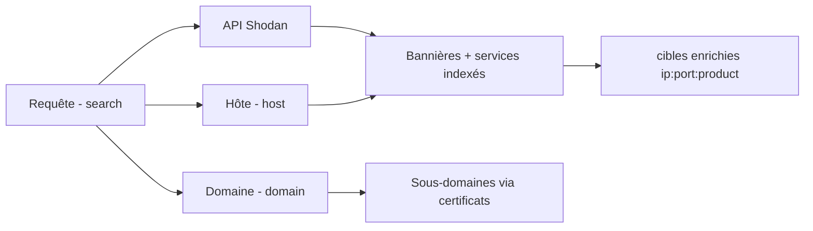
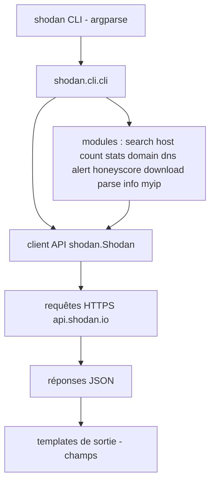

# 🌍 Shodan CLI — Moteur de recherche des services exposés en ligne de commande

> [!info] **En 1 phrase**
> Shodan indexe les bannières de millions de services (RDP, SSH, caméras, bases de données) : sa CLI permet de fouiller cette base depuis le terminal.

---

## 🧾 Overview

| Champ | Valeur |
|---|---|
| Nom complet | Shodan CLI (paquet Python `shodan`) |
| Description | Client en ligne de commande (et bibliothèque Python) du moteur de recherche Shodan : recherche par filtres, détails d'hôte, statistiques, domaines, alertes, honeyscore, datasets |
| Catégorie | Reconnaissance & OSINT |
| Sous-catégorie | OSINT / Moteurs de recherche (Internet-wide scanning) |
| Fonction principale | Interroger l'index de bannières de Shodan pour trouver des services exposés |
| Type d'outil | CLI Python + SDK (`import shodan`) |
| Licence | MIT |
| Open source / propriétaire | CLI open source ; le service Shodan est propriétaire |
| Langage(s) de programmation | Python 3 |
| Développeur / organisation | John Matherly (achillean) ; Shodan fondé en 2009 |
| Projet officiel | https://www.shodan.io |
| Dépôt officiel | https://github.com/achillean/shodan-python |
| Documentation officielle | https://cli.shodan.io |
| Date de création | CLI initiale ~2011 (ancien nom `shodan-py`), service 2009 |
| État du projet | actif |
| Dernière version connue | 1.31.0 (2023-12-17) |
| Systèmes compatibles | Linux, macOS, Windows (Python 3) |

> [!note] Pour vérifier / compléter
> La version pip (`shodan`) correspond à shodan-python. Le plan gratuit est limité : 100 requêtes/mois pour `search`, `count` gratuit. Les datasets (`download`) nécessitent un abonnement.

---

## 🎯 Concept

Shodan est le moteur de recherche des services exposés sur Internet : il collecte les bannières de tous les protocoles (pas seulement HTTP) — SSH, RDP, telnet, MongoDB, MySQL, HTTP, protocoles industriels (modbus, BACnet, s7) — ainsi que les métadonnées géographiques, organisationnelles et les vulnérabilités associées. La CLI Python (`shodan`) expose toute la puissance : recherche par filtres (`port`, `country`, `product`, `net`, `org`, `vuln`, `ssl.cert.subject.CN`...), détails hôte, statistiques, découverte de sous-domaines via les certificats (`shodan domain`), alertes, score honeypot (`honeyscore`) et téléchargement de datasets.

Position : phase de recon « moteurs de recherche », en complément de [[Outil - Censys|Censys]] et des outils ProjectDiscovery. Elle permet de cartographier passivement l'exposition d'une organisation (adresses IP, ports, produits, versions) avant tout scan actif.



---

## 🧠 Concepts fondamentaux

| Concept | Explication |
|---|---|
| Bannière | Texte renvoyé par un service à la connexion (motd SSH, Server HTTP, version MongoDB...) : la donnée brute indexée par Shodan |
| Filtres de recherche | `port:`, `country:`, `product:`, `version:`, `net:`, `org:`, `hostname:`, `vuln:`, `ssl.cert.subject.CN:`... |
| Facets | Agrégations statistiques d'un champ : `stats --facets product,port,country "requête"` |
| API key | Clé nécessaire pour toute requête ; initialisée via `shodan init <clé>` et stockée en local |
| Quota | Nombre de requêtes autorisées selon le plan (gratuit ~100/mois) |
| Honeyscore | Score 0-1 estimant la probabilité qu'un hôte soit un honeypot |
| Alertes | Surveillance de nouveaux services sur un net/périphériques ciblés (`shodan alert`) |
| Datasets | Téléchargement de gros volumes de données (`shodan download`) pour analyse offline |
| DNS / Domain | `shodan domain` interroge la base des certificats (CT) pour lister les sous-domaines |
| MyIP | `shodan myip` renvoie l'IP publique de l'utilisateur (réseau sortant) |

---

## 🛠️ Installation

### pip (Linux, macOS, Windows)

```bash
pip install shodan
# ou dans un venv
python3 -m venv venv && source venv/bin/activate
pip install shodan
```

### Depuis les sources

```bash
git clone https://github.com/achillean/shodan-python.git
cd shodan-python
pip install .
```

### Vérification

```bash
shodan --version
shodan init <VOTRE_CLE_API>
shodan info        # quota et plan du compte
```

---

## ⚙️ Configuration

### Initialisation de la clé API

```bash
shodan init TA_CLE_API
# La clé est stockée en clair dans ~/.shodan_api_key
shodan info
```

> [!warning] Sécurité de la clé
> La clé est stockée en clair dans `~/.shodan_api_key` : restreindre les droits (`chmod 600`), ne pas la versionner, utiliser une variable d'env `SHODAN_API_KEY` dans les scripts.

### Variables d'environnement

```bash
export SHODAN_API_KEY="<VOTRE_CLE_API>"
```

### Options globales

| Option | Effet |
|---|---|
| `--fields <champs>` | Sélection des champs affichés (ip_str, port, org, hostnames, product, version, os, location...) |
| `--limit <N>` | Nombre maximal de résultats (search) |
| `--separator <c>` | Séparateur de champs en sortie (défaut `\t`) |
| `--quiet` | Sortie silencieuse |

---

## 🏗️ Architecture interne



- **CLI** : `shodan/cli/__main__.py` parse les sous-commandes ; chaque sous-commande correspond à un fichier (ex : `search.py`, `host.py`).
- **SDK** : `shodan/client.py` expose `Shodan(api_key)` avec les méthodes `search`, `count`, `host`, `dns`, `domain`, `exploits`, `alerts`, `download`...
- **Transport** : requêtes HTTP(S) vers `api.shodan.io` ; les réponses JSON sont converties en objets Python (`shodan/models.py`).
- **API limit** : le client gère les erreurs de quota (`shodan.exception.APIError`) et les codes HTTP 429/401.

---

## ⌨️ Commandes

### Commandes essentielles

```bash
shodan search "port:3389 country:FR"
shodan search --fields ip_str,port,org,hostnames "ssl.cert.subject.CN:example.com"
shodan host 8.8.8.8
shodan count "product:nginx"
shodan stats --facets product,port "country:FR"
shodan domain example.com
shodan myip
shodan info
```

### Tableau des commandes

| Commande | Effet |
|---|---|
| `search` | Recherche avec filtres (port, country, product, net, org...) |
| `--fields` | Champs à afficher (ip_str, port, org, hostnames, product...) |
| `--limit` | Nombre maximal de résultats |
| `host <ip>` | Détails complets d'un hôte (services, vulnérabilités) |
| `count` | Nombre de résultats pour une requête (gratuit) |
| `stats --facets` | Statistiques par facettes (product, port, country) |
| `domain <domaine>` | Sous-domaines via les certificats (CT) |
| `dns <domaine>` | Résolution DNS (résultats et sous-domaines) |
| `honeyscore <ip>` | Score de probabilité honeypot (0-1) |
| `alert create/list/...` | Création et gestion d'alertes |
| `download <dataset>` | Téléchargement d'un dataset (payant) |
| `parse <fichier>` | Conversion d'un dataset téléchargé en CSV/JSON |
| `info` | Quota et plan du compte |
| `myip` | Votre IP publique |
| `exploits` | Recherche d'exploits (module séparé) |

---

## 🚩 Options et flags

| Option | Commande(s) | Effet |
|---|---|---|
| `--fields` | search | Champs de sortie (ip_str, port, org, product, hostnames...) |
| `--limit` | search | Nombre max de résultats |
| `--facets` | stats | Facettes à agréger (product, port, country, org...) |
| `--host` | search | Afficher les résultats comme des hôtes |
| `--separator` | search | Séparateur de sortie |
| `--quiet` | toutes | Réduire la sortie |
| `--help` | toutes | Aide |

### Exemples de filtres de recherche

| Filtre | Exemple |
|---|---|
| Port | `port:3389` |
| Pays | `country:FR` |
| Réseau | `net:203.0.113.0/24` |
| Organisation | `org:"Google"` |
| Produit / version | `product:"nginx"` / `product:"nginx" version:"1.18.0"` |
| Vulnérabilité | `vuln:CVE-2021-44228` |
| Certificat | `ssl.cert.subject.CN:example.com` |
| Hostname | `hostname:example.com` |
| OS | `os:"Windows"` |

---

## 🧪 Exemples pratiques

### Recherche basique

```bash
shodan search "port:3389 country:FR"
```

### Recherche avec champs exploitables

```bash
shodan search --fields ip_str,port,org,hostnames "ssl.cert.subject.CN:example.com"
```

### Détails d'un hôte

```bash
shodan host 8.8.8.8
```

### Comptage (gratuit, sans consommer le quota search)

```bash
shodan count "product:nginx"
```

### Statistiques

```bash
shodan stats --facets product,port "country:FR"
```

### Sous-domaines via certificats

```bash
shodan domain example.com
```

### Vérifier son IP publique et son quota

```bash
shodan myip
shodan info
```

---

## 🔄 Workflow complet (scénario pas à pas)

1. **Initialiser la CLI.**
   ```bash
   shodan init TA_CLE_API
   shodan info
   ```
2. **Rechercher les services exposés de la cible.**
   ```bash
   shodan search --limit 100 --fields ip_str,port,org,hostnames "org:EXEMPLE"
   ```
3. **Enrichir les hôtes intéressants.**
   ```bash
   shodan host 203.0.113.10
   ```
4. **Découvrir des sous-domaines via les certificats.**
   ```bash
   shodan domain example.com
   ```
5. **Évaluer la fiabilité des résultats** (honeypots).
   ```bash
   shodan honeyscore 203.0.113.10
   ```
6. **Surveiller le périmètre.**
   ```bash
   shodan alert create "surveillance-exemple" 203.0.113.0/24 "vuln:CVE-2021-44228"
   shodan alert list
   ```

---

## 🎬 Scénarios avancés

### Scénario 1 : Inventaire des services exposés d'un périmètre

```bash
shodan search --limit 500 --fields ip_str,port,product,version,org "net:203.0.113.0/24"
```

### Scénario 2 : Chasse à un produit vulnérable

```bash
shodan search --fields ip_str,port,version "product:MongoDB"
shodan stats --facets port,country "product:MongoDB"
shodan search --fields ip_str,port "vuln:CVE-2021-44228"
```

### Scénario 3 : Alerte sur de nouveaux services exposés

```bash
shodan alert create "surveillance-exemple" 203.0.113.0/24 "vuln:CVE-2021-44228"
shodan alert list
shodan alert info "surveillance-exemple"
```

### Scénario 4 : Corrélation domaine → IP via certificats

```bash
# Lister les sous-domaines (CT) puis les résoudre
shodan domain example.com
shodan dns example.com
# Puis chercher tous les hôtes portant ce CN dans leur certificat
shodan search --fields ip_str,port,hostnames "ssl.cert.subject.CN:example.com"
```

---

## 🛡️ Cybersecurity use cases

| Cas d'usage | Exemple concret |
|---|---|
| Reconnaissance passive | Cartographier l'exposition d'une organisation sans toucher à ses serveurs |
| Bug bounty | Chercher des produits/versions vulnérables dans le scope avant le scan actif |
| Surveillance | Alertes automatiques sur l'apparition de nouveaux services vulnérables |
| Réponse à incident | Identifier tous les hôtes publics d'une entreprise touchée par une CVE |
| Threat intelligence | Statistiques macro sur l'exposition d'un pays/secteur |
| Pentest | Valider la résonance entre les bannières publiques et la réalité du réseau |

---

## ⚔️ MITRE ATT&CK

| Technique | ID | Rapport avec Shodan CLI |
|---|---|---|
| Search Open Technical Databases | T1596 | Interrogation de l'index de bannières de Shodan |
| Search Victim-Owned Websites | T1594 | Sous-domaines via certificats (CT) |
| Gather Victim Host Information | T1590 | Détails hôtes, IP, services, OS |
| Gather Victim Identity Information | T1589 | Contacts/organisations via les données Shodan |
| Search Open Websites/Domains | T1593 | Cartographie passive des actifs exposés |
| Exploit Public-Facing Application | T1190 | Recherche de produits vulnérables avant exploitation |

---

## 🛡️ Defensive Security

| Usage défensif | Description |
|---|---|
| Audit d'exposition | Vérifier régulièrement `shodan search net:<votre_CIDR>` pour lister les services publics |
| Détection de fuite d'infos | Repérer les bannières verbeuses (versions, chemins) exposées |
| Monitoring | `shodan alert` sur ses propres plages pour détecter de nouvelles expositions |
| Honeypot detection | `honeyscore` pour filtrer les faux positifs d'un inventaire externe |
| Patch management | Croiser les versions visibles avec les CVE connues |

> [!warning] Contexte
> Shodan est un service tiers : l'utilisation de ses données pour attaquer des cibles non autorisées reste illégale. L'usage défensif légitime consiste à contrôler sa propre exposition.

---

## 🤖 Automatisation

### Script de revue d'exposition

```bash
#!/bin/bash
# Revue hebdomadaire de la surface publique
shodan search --limit 500 --fields ip_str,port,product,version,org "net:203.0.113.0/24" \
  > shodan_$(date +%F).tsv
shodan alert list > alertes_$(date +%F).txt
```

### Utilisation du SDK Python

```python
import shodan

api = shodan.Shodan("TA_CLE_API")
for banner in api.search("product:nginx", limit=50)["matches"]:
    print(banner["ip_str"], banner["port"], banner.get("product"))
```

### Cron

```bash
0 4 * * 1 shodan search --limit 200 --fields ip_str,port "net:203.0.113.0/24" \
  >> /var/log/shodan-audit.log 2>&1
```

---

## 📦 Output et parsing

### Sortie search avec champs

```
203.0.113.10	80	Acme Corp	web01.example.com
203.0.113.11	443	Acme Corp	mail.example.com
```

### Parsing standard

```bash
# Liste des IP exposées
shodan search --fields ip_str "org:EXEMPLE" | cut -f1

# Top ports d'un réseau
shodan stats --facets port "net:203.0.113.0/24"
```

### Datasets (offline)

```bash
shodan download example_dataset "product:nginx"
shodan parse --fields ip_str,port example_dataset.json.gz
```

---

## 🔗 Intégrations

| Outil | Intégration |
|---|---|
| [[Outil - Censys\|Censys]] | Moteur alternatif / complémentaire (index, certificats, services) |
| [[Outil - theHarvester\|theHarvester]] | Peut interroger Shodan pour la recon passive des hôtes |
| [[Outil - Maltego\|Maltego]] | Transform Shodan pour visualiser les relations IP/ports/org |
| [[Outil - Recon-ng\|Recon-ng]] | Modules `recon/hosts-ports/shodan` via `keys add shodan` |
| [[Outil - Nmap\|Nmap]] | Confirmer et approfondir les services trouvés passivement |
| [[Outil - naabu\|naabu]] / [[Outil - httpx\|httpx]] | Vérification active (ports réellement ouverts, probing HTTP) |
| [[Outil - spiderfoot\|SpiderFoot]] | Corrélations automatisées alimentées par Shodan |

---

## 🔄 Alternatives

| Outil | Différence clé |
|---|---|
| [[Outil - Censys\|Censys]] | Index alternatif, interface web riche, certificats très complets |
| ZMap / Masscan ([[Outil - Masscan\|Masscan]]) | Scanner votre propre index Internet (coûteux, complexe) |
| FOFA / ZoomEye | Moteurs équivalents orientés Asie |
| InternetDB (Shodan) | API gratuite `internetdb.shodan.io` sans clé : ports/CVEs d'une IP |
| ProjectDiscovery ([[Outil - httpx\|httpx]], [[Outil - nuclei\|nuclei]]) | Vérification active et scanning de vulnérabilités |

---

## ⚡ Performance

| Facteur | Impact |
|---|---|
| Plan gratuit | ~100 requêtes search/mois ; `count` gratuit, privilégier `stats` pour les vues macro |
| Limites | `--limit` borne le nombre de résultats et donc le temps |
| Facets | `stats` agrège côté API : sortie compacte, rapide |
| Datasets | Téléchargement puis `parse` offline : rapide une fois le dataset local |
| Cache | Aucun cache local : chaque requête consomme le quota |

---

## 🔧 Troubleshooting

| Problème | Cause probable | Solution |
|---|---|---|
| `Invalid API key` | Mauvaise clé / non initialisée | `shodan init <clé>` ; vérifier `shodan info` |
| `APIError: no results` | Requête sans résultat | Simplifier les filtres ; tester `shodan count` |
| Quota dépassé | Plan gratuit limité | Attendre la fenêtre mensuelle ou passer en paid |
| `host: no information` | IP jamais scannée par Shodan | Vérifier l'orthographe ; essayer une autre IP |
| Résultats datés | Bannières non récentes | Confirmer l'état réel avec un scan actif (naabu/nmap) |
| Erreur Python | Version pip obsolète | `pip install --upgrade shodan` |
| `domain` vide | Domaine sans certificats CT | Utiliser `shodan dns <domaine>` et d'autres sources |

---

## 🔒 Sécurité de l'outil

| Point | Détail |
|---|---|
| Clé API | En clair dans `~/.shodan_api_key` : chmod 600, ne pas versionner |
| Données exposées | Les requêtes partent vers api.shodan.io : votre IP/activité est vue par Shodan |
| Datasets | Contiennent des bannières potentiellement sensibles : stockage protégé |
| SDK | MIT et bien maintenu ; vérifier les dépendances (requests) |
| Usage | Les données publiques ne sont pas « gratuites à attaquer » : respecter l'autorisation |

---

## ⚠️ Limitations

| Limitation | Détail |
|---|---|
| Données passées | L'index reflète la dernière collecte de Shodan, pas l'état en temps réel |
| Pas de scan en temps réel | Shodan ne scanne pas à la demande (sauf `On-Demand Scanning` payant) |
| Couverture partielle | Tous les services ne sont pas indexés (bannières, quotas, filtrage) |
| Quota gratuit faible | ~100 requêtes/mois pour search |
| Honeypots | Les résultats peuvent pointer vers des honeypots (utiliser `honeyscore`) |
| CLI limitée pour datasets | L'analyse avancée nécessite le SDK ou des outils tiers |

---

## 📋 Cheatsheet

```bash
# Init et quota
shodan init TA_CLE_API
shodan info

# Recherche
shodan search "port:3389 country:FR"
shodan search --fields ip_str,port,org,hostnames "ssl.cert.subject.CN:example.com"
shodan count "product:nginx"
shodan stats --facets product,port "country:FR"

# Hôte et domaine
shodan host 8.8.8.8
shodan domain example.com
shodan dns example.com

# Fiabilité
shodan honeyscore 203.0.113.10

# Alertes
shodan alert create "surveillance-exemple" 203.0.113.0/24 "vuln:CVE-2021-44228"
shodan alert list
```

---

## ⚡ Quick reference

| Action | Commande |
|---|---|
| Rechercher des services | `shodan search "filtres"` |
| Détails d'un hôte | `shodan host <ip>` |
| Compter les résultats | `shodan count "filtres"` |
| Statistiques | `shodan stats --facets product,port "filtres"` |
| Sous-domaines (CT) | `shodan domain <domaine>` |
| Honeypot ? | `shodan honeyscore <ip>` |
| Créer une alerte | `shodan alert create <nom> <net> "<filtres>"` |
| Quota restant | `shodan info` |
| Mon IP publique | `shodan myip` |

---

## 🔍 Détection & Défense

| Signe | Défense |
|---|---|
| Ton infra apparaît dans Shodan : services et versions publics | Réduire l'exposition, placer les services critiques derrière VPN |
| Les bannières trahissent versions et produits | Désactiver les bannières verbeuses, appliquer les patchs |
| Les données restent en ligne après correction | Vérifier régulièrement sa propre présence (`shodan search net:`) |
| Nouveaux services apparaissent soudainement | Mettre en place des alertes sur ses propres plages |
| CVEs visibles via `vuln:` | Prioriser le patch des produits exposés publics |

---

## 💡 Tips & Pièges

> [!tip] 💡 **Utilise `--fields` pour des sorties exploitables**
> `--fields ip_str,port,org,hostnames` donne un TSV directement parsable.

> [!tip] 💡 **`shodan domain` est une source de sous-domaines rapide et passive**
> Via les certificats (CT), sans contacter la cible.

> [!tip] 💡 **`stats --facets` donne une vue macro**
> Pays, ports, produits : très utile en recon large et peu coûteux en quota.

> [!warning] ⚠️ **Le plan gratuit est limité**
> ~100 requêtes/mois : privilégie `count` (gratuit) avant `search`.

> [!warning] ⚠️ **Les honeypots polluent les résultats**
> Vérifie avec `honeyscore` avant d'exploiter une cible.

> [!warning] ⚠️ **Les données peuvent dater**
> Confirme l'état réel avec naabu/httpx avant exploitation.

> [!danger] 🚫 **Ne pas scanner/attaquer des cibles non autorisées**
> Shodan donne de l'information publique, pas le droit d'agir dessus.

---

## 📚 References

### Official
- [Shodan](https://www.shodan.io)
- [Documentation CLI Shodan](https://cli.shodan.io)
- [shodan-python (GitHub)](https://github.com/achillean/shodan-python)
- [API Documentation Shodan](https://developer.shodan.io)

### Security
- [InternetDB (API gratuite Shodan)](https://internetdb.shodan.io)
- [MITRE ATT&CK — Search Open Technical Databases T1596](https://attack.mitre.org/techniques/T1596/)

### Community
- [Articles de recherche et guides Shodan (community)](https://gist.github.com/)

---

➡️ **Liens :** [[Tools|🧰 Outils]] · [[01 - Reconnaissance|🕵️ Reconnaissance]] · [[Outil - Shodan|🌍 Shodan]] · [[Outil - Censys|🔎 Censys]] · [[Outil - theHarvester|🍯 theHarvester]] · [[Outil - Maltego|🕸️ Maltego]]
