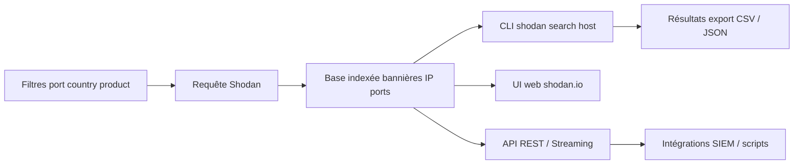
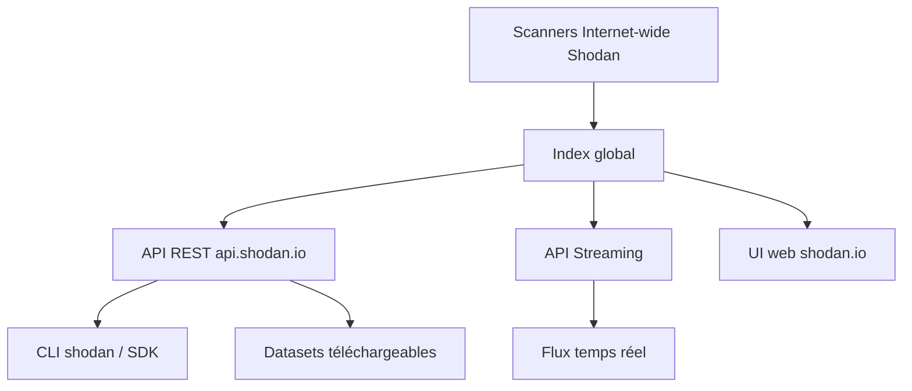

# 🕵️ Shodan — Moteur de recherche des services exposés sur Internet

> [!info] **En 1 phrase**
> Shodan est un moteur de recherche qui indexe les bannières de tous les appareils connectés à Internet : idéal pour trouver des services exposés, des équipements IoT et des vulnérabilités sans envoyer un seul paquet.

---

## 🧾 Overview

| Champ | Valeur |
|---|---|
| Nom complet | Shodan |
| Description | Moteur de recherche Internet-wide : indexe les bannières de services (SSH, HTTP, RDP, RTSP, protocoles industriels...) et les métadonnées des hôtes connectés |
| Catégorie | Reconnaissance & OSINT |
| Sous-catégorie | OSINT / Moteurs de recherche / Internet-wide scanning |
| Fonction principale | Trouver passivement des services exposés, produits, versions, vulnérabilités et équipements IoT |
| Type d'outil | Service web + API + CLI Python (`shodan`) |
| Licence | CLI : MIT ; service : propriétaire (plans gratuits et payants) |
| Open source / propriétaire | Hybride (SDK open source, plateforme propriétaire) |
| Langage(s) de programmation | SDK Python ; index propriétaire |
| Développeur / organisation | John Matherly (fondateur) ; Shodan fondé en 2009 |
| Projet officiel | https://www.shodan.io |
| Dépôt officiel | https://github.com/achillean/shodan-python |
| Documentation officielle | https://developer.shodan.io |
| Date de création | 2009 |
| État du projet | actif |
| Dernière version connue (SDK) | shodan-python 1.31.0 (2023-12-17) |
| Systèmes compatibles | Navigateur web + CLI Linux/macOS/Windows (Python 3) |

> [!note] Pour vérifier / compléter
> Shodan maintient aussi `shodan-python` (SDK/CLI) et une API (REST/Streaming). Les plans payants débloquent plus de requêtes, les export/CSV, les datasets et le scan on-demand.

---

## 🎯 Concept

Shodan scanne en permanence Internet (un « Google du réseau ») et stocke les **bannières**, ports ouverts, produits et métadonnées de chaque hôte. Contrairement à un moteur web, il n'indexe pas les pages mais les **réponses des services** (SSH, HTTP, MySQL, RTSP...). C'est une mine d'or pour la **reconnaissance passive** : on y cherche les services exposés d'une entreprise, des équipements vulnérables ou la présence d'une technologie précise, sans émettre le moindre paquet vers la cible.

L'outil **CLI `shodan`** (Python) et le site web permettent d'interroger cette base avec des filtres puissants (`port:`, `country:`, `product:`, `os:`, `vuln:`, `ssl.cert.subject.cn:`...) et de produire des statistiques via les **facets**. En pentest, Shodan est utilisé en amont de Nmap pour cartographier la surface exposée, puis pour confirmer par un scan actif une fois la cible autorisée.



---

## 🧠 Concepts fondamentaux

| Concept | Explication |
|---|---|
| Bannière | Réponse texte renvoyée par un service (motd SSH, en-tête Server HTTP, bannière MySQL...) : la brique de base de l'index |
| Internet-wide scan | Collecte permanente de Shodan sur tout l'espace IPv4 (et partie d'IPv6) |
| Filtres | Conditions de recherche : `port`, `country`, `city`, `hostname`, `product`, `version`, `os`, `net`, `org`, `vuln`, `http.title`, `ssl.cert.subject.cn` |
| Facets | Agrégation statistique par champ : `port`, `country`, `product`, `org`... pour des vues macro |
| `vuln:` | Filtre les hôtes associés à un CVE connu dans l'index Shodan |
| Quota | Nombre de requêtes mensuelles selon le plan (gratuit ~100, pagination limitée) |
| Alertes | Notifications à l'apparition de nouveaux services sur une plage/cible |
| Honeyscore | Score 0-1 estimant la probabilité qu'un hôte soit un honeypot |
| Streaming API | Flux temps réel des nouveaux résultats correspondant à des critères |
| Scan on-demand | Lancement de scans à la demande (limité par plan, réservé aux plages autorisées) |

---

## 🛠️ Installation

### CLI (Python 3)

```bash
pip install shodan
shodan init API_KEY
shodan info
```

### SDK Python (bibliothèque)

```bash
pip install shodan
python3 -c "import shodan; print(shodan.Shodan.__doc__)"
```

### Compte et clé

1. Créer un compte sur https://www.shodan.io
2. Récupérer la clé API dans `Account > API Key`
3. Initialiser : `shodan init <clé>`

### Vérification

```bash
shodan info        # plan et quota
shodan myip        # IP publique
```

---

## ⚙️ Configuration

### Fichier de clé

| Chemin | Rôle |
|---|---|
| `~/.shodan/api_key` | Clé API en clair (écrite par `shodan init`) |
| Variable `SHODAN_API_KEY` | Alternative pour les scripts / CI |

### Options de sortie globales

| Option | Effet |
|---|---|
| `--fields` | Champs à afficher (ip_str, port, product, hostnames, org, os...) |
| `--separator` | Séparateur (`,` pour CSV, `\t` par défaut) |
| `--limit` | Nombre maximal de résultats |
| `--quiet` | Sortie silencieuse |

### Gestion des alertes

```bash
shodan alert create <nom> <net> "<filtres>"
shodan alert list
shodan alert info <nom>
shodan alert remove <id>
```

---

## 🏗️ Architecture interne



- **Collecte** : des scanners Shodan parcourent l'espace IPv4 sur de nombreux ports/protocoles et enregistrent les bannières, timestamps, données géo/ASN/org.
- **Index** : moteur de recherche propriétaire avec facettes, filtres full-text et données de vulnérabilités (CVE).
- **API REST** : `search`, `count`, `host`, `dns`, `domain`, `alert`, `exploit`... derrière `api.shodan.io`.
- **API Streaming** : flux continu des nouvelles données (`shodan stream`) pour les SOC/Threat Intel.
- **Datasets** : fichiers compressés (`.json.gz`) téléchargeables pour analyse offline.

---

## ⌨️ Commandes

### Commandes essentielles

```bash
# Recherche avec champs sélectionnés et export CSV
shodan search "port:3389 country:FR" --fields ip_str,port,product --separator ,

# Détails complets d'une IP
shodan host 8.8.8.8

# Statistiques agrégées (facets)
shodan stats --facets port,country "product:apache"

# Télécharger les résultats au format JSONL pour traitement hors-ligne
shodan download resultats "http.title:admin country:FR"
shodan parse --fields ip_str,port,product resultats.json.gz
```

### Tableau des commandes

| Commande | Effet |
|---|---|
| `shodan init <API_KEY>` | Enregistre la clé API dans `~/.shodan/api_key` |
| `shodan search "<filtres>"` | Recherche dans la base, résultats paginés |
| `shodan host <IP>` | Détails d'une IP : ports, bannières, vulns |
| `shodan org "<org>"` | Tous les hôtes rattachés à une organisation |
| `shodan domain <domaine>` | Sous-domaines et IP associés au domaine |
| `shodan stats --facets port,country <query>` | Statistiques agrégées par port, pays, produit |
| `shodan count <query>` | Nombre de résultats sans les lister (économise le quota) |
| `shodan download <fichier> <query>` | Sauvegarde les résultats en JSONL compressé |
| `shodan scan submit <plage>` | Lance un scan on-demand de sa propre plage (payant/quota) |
| `shodan myip` | Affiche l'IP publique du poste |
| `shodan stream` | Consomme l'API streaming (recherche, alertes) |

---

## 🚩 Options et flags

### Filtres principaux

```
port:22                              # par port
country:FR                           # par pays
city:"Paris"                         # par ville
hostname:example.com                 # par nom d'hôte
product:apache                       # par produit
version:"2.4.49"                     # par version
os:"Windows Server 2022"             # par système d'exploitation
http.title:"Admin"                   # par titre de page web
ssl.cert.subject.cn:example.com      # par certificat TLS
vuln:CVE-2024-3400                   # appareils vulnérables à un CVE
net:203.0.113.0/24                   # par plage IP
org:"Example Corp"                   # par organisation
before:/after:                       # fenêtres temporelles
```

### Opérateurs de requête

| Opérateur | Exemple | Rôle |
|---|---|---|
| `:` | `port:22` | Filtre sur une valeur |
| `-` | `-country:US` | Négation |
| `"..."` | `http.title:"Admin Login"` | Chaîne exacte |
| `&&` / `\|\|` | `country:FR && port:22` | ET / OU logique |

---

## 🧪 Exemples pratiques

### Recherche de services RDP en France

```bash
shodan search "port:3389 country:FR" --fields ip_str,port,org
```

### Recherche d'un produit précis

```bash
shodan search "product:nginx" --fields ip_str,port,version --limit 50
```

### Recherche par organisation

```bash
shodan search "org:Example Corp" --fields ip_str,port,hostnames,product
```

### Hôte vulnérable à un CVE

```bash
shodan search "vuln:CVE-2024-3400" --fields ip_str,port,product,org
```

### Vérification d'un équipement IoT exposé

```bash
shodan search "port:554 product:Hikvision" --fields ip_str,port
```

---

## 🔄 Workflow complet (scénario pas à pas)

1. **Étape 1 — Reconnaissance de l'entreprise** : lister les services exposés liés au domaine.
   ```bash
   shodan search "ssl.cert.subject.cn:example.com" --fields ip_str,port,product
   ```
2. **Étape 2 — Cartographier la géographie** : visualiser les ports et pays de l'organisation.
   ```bash
   shodan stats --facets port,country "org:Example Corp"
   ```
3. **Étape 3 — Analyser une IP précise** : récupérer versions, bannières et CVE référencés.
   ```bash
   shodan host 1.2.3.4
   ```
4. **Étape 4 — Chercher des vulnérabilités connues** : croiser un CVE avec une zone géographique.
   ```bash
   shodan search "vuln:CVE-2024-3400 country:FR" --fields ip_str,port,product
   ```
5. **Étape 5 — Exporter et confirmer** : sauvegarder en CSV puis confirmer par scan actif autorisé.
   ```bash
   shodan search "org:Example Corp" --fields ip_str,port,product,hostnames --separator , > export.csv
   nmap -sV -p- -iL ip_list.txt
   ```

---

## 🎬 Scénarios avancés

### Scénario 1 : Chasse à une CVE récente avec sortie exploitable

Trouver des cibles exposées à une faille publiée, sans scan actif au préalable.

```bash
# 1. Identifier les appareils vulnérables (ex. CVEs de pare-feu/VPN)
shodan search "vuln:CVE-2024-3400" --fields ip_str,port,product,org

# 2. Restreindre par pays et produit pour prioriser le périmètre client
shodan search "vuln:CVE-2024-3400 country:FR product:Palo Alto"

# 3. Télécharger le lot pour analyse hors-ligne (JSONL)
shodan download cve_3400 "vuln:CVE-2024-3400 country:FR"
shodan parse --fields ip_str,port,product cve_3400.json.gz

# 4. Vérifier ensuite par un scan actif autorisé (nmap) avant tout test
```

### Scénario 2 : Surveillance défensive de son propre périmètre

Utiliser les alertes Shodan pour être prévenu de l'apparition de nouveaux services exposés.

```bash
# 1. Créer une alerte sur la plage de l'entreprise
shodan alert create perimeter-internet 203.0.113.0/24

# 2. Lister et gérer les alertes
shodan alert list
shodan alert info perimeter-internet

# 3. Suivre régulièrement sa surface avec les facets
shodan stats --facets product "org:Example Corp"

# 4. Diffuser le flux de nouvelles expositions vers le SIEM via le streaming API
#    shodan stream --alerts  # consomme le flux des alertes définies
```

### Scénario 3 : Cartographie d'un secteur d'activité (Threat Intelligence)

```bash
# Identifier l'exposition d'un secteur (ex : santé) sur un territoire
shodan stats --facets product,port "org:health country:FR"
# Croiser avec les CVE de références
shodan search "vuln:CVE-2023-23397 country:FR" --fields ip_str,port,product,org
```

### Scénario 4 : Investigation / attribution d'une IP

```bash
# Contexte géographique, ASN, hostname et ports d'une IP observée en incident
shodan host 203.0.113.10
# Certificats rattachés (autres hostnames éventuels)
shodan search "ssl.cert.subject.cn:<domaine>"
```

---

## 🛡️ Cybersecurity use cases

| Cas d'usage | Exemple concret |
|---|---|
| Reconnaissance passive | Cartographier l'exposition d'une organisation avant tout contact réseau |
| Bug bounty | Prioriser les produits/versions vulnérables du scope |
| Threat Intelligence | Suivre l'exposition d'un secteur, pays, fournisseur |
| Réponse à incident | Identifier les hôtes publics d'une entreprise affectés par une CVE |
| Audit d'exposition | Revue régulière de sa propre surface (`shodan search net:`) |
| Social engineering | Confirmer l'infrastructure (VPN, webmail) utilisée par l'organisation |

---

## ⚔️ MITRE ATT&CK

| Technique | ID | Rapport avec Shodan |
|---|---|---|
| Search Open Technical Databases | T1596 | Interrogation de l'index de bannières / équipements |
| Search Open Websites/Domains | T1593 | Cartographie passive des actifs |
| Gather Victim Host Information | T1590 | IP, ports, services, OS, organisation |
| Gather Victim Identity Information | T1589 | Données organisationnelles via l'index |
| Active Scanning | T1595 | Scan on-demand (optionnel, réservé aux plages autorisées) |
| Exploit Public-Facing Application | T1190 | Recherche de produits vulnérables via `vuln:` |

---

## 🛡️ Defensive Security

| Usage défensif | Description |
|---|---|
| Audit d'exposition | `shodan search net:<CIDR>` régulier pour connaître sa surface vue de l'extérieur |
| Alertes | `shodan alert` sur ses plages pour détecter de nouvelles expositions |
| Patch management | Croiser versions visibles et CVE référencées |
| Honeypot | Utiliser `honeyscore` pour évaluer si ses propres résultats sont pollués |
| Monitoring | Consommer le streaming API vers un SIEM pour un flux d'alertes |

> [!warning] Contexte
> Shodan ne génère aucune requête vers les cibles lors d'une recherche : la recon est passive et donc indétectable côté cible. La légitimité repose sur l'autorisation d'agir sur les cibles identifiées.

---

## 🤖 Automatisation

### Script de revue mensuelle de surface

```bash
#!/bin/bash
# Revue mensuelle de la surface publique de l'organisation
shodan search "org:Example Corp" --fields ip_str,port,product,hostnames \
  --separator , > surface_$(date +%F).csv
shodan stats --facets port,country "org:Example Corp" > stats_$(date +%F).txt
```

### SDK Python : intégration SIEM / scripts

```python
import shodan

api = shodan.Shodan("SHODAN_API_KEY")
results = api.search("net:203.0.113.0/24")
for banner in results["matches"]:
    print(f'{banner["ip_str"]}:{banner["port"]} {banner.get("product","")} {banner.get("version","")}')
```

### Streaming API

```bash
shodan stream --alerts >> /var/log/shodan_alerts.log 2>&1
```

### Cron

```bash
0 3 1 * * /opt/scripts/shodan_review.sh >> /var/log/shodan_review.log 2>&1
```

---

## 📦 Output et parsing

### Sortie CSV (avec `--separator ,`)

```
203.0.113.10,80,nginx,web01.example.com
203.0.113.11,443,Apache httpd,mail.example.com
```

### JSONL (download)

```bash
shodan download data "country:FR port:22"
shodan parse --fields ip_str,port,product data.json.gz
```

### Extraction d'une liste d'IP

```bash
shodan search --fields ip_str "org:Example Corp" | cut -f1 | sort -u > ips.txt
```

### Analyse via SDK

```python
import shodan, json
api = shodan.Shodan("KEY")
for match in api.search("product:mongodb")["matches"]:
    print(match["ip_str"], match.get("product"))
```

---

## 🔗 Intégrations

| Outil | Intégration |
|---|---|
| [[Outil - Shodan CLI\|Shodan CLI]] | La CLI est le client officiel de ce service (search, host, domain, stats, alerts) |
| [[Outil - Censys\|Censys]] | Moteur alternatif/complémentaire (certificats, services) |
| [[Outil - theHarvester\|theHarvester]] | Interroge Shodan (hôtes, ports) lors de la recon |
| [[Outil - Recon-ng\|Recon-ng]] | Modules `recon/hosts-ports/shodan` avec `keys add shodan` |
| [[Outil - Maltego\|Maltego]] | Transforms Shodan pour l'analyse graphique |
| [[Outil - Nmap\|Nmap]] | Confirmation active des services trouvés passivement |
| [[Outil - spiderfoot\|SpiderFoot]] | Corrélations automatiques alimentées par Shodan |
| [[Outil - nuclei\|nuclei]] / [[Outil - httpx\|httpx]] | Vérification active et scanning de vulnérabilités sur les hôtes identifiés |

---

## 🔄 Alternatives

| Outil | Différence clé |
|---|---|
| [[Outil - Censys\|Censys]] | Index complet de l'IPv4 + certificats ; interface et API différentes |
| FOFA / ZoomEye | Moteurs équivalents (forte couverture Asie) |
| InternetDB (Shodan) | API gratuite sans clé : ports + CVEs d'une IP |
| ZMap / Masscan ([[Outil - Masscan\|Masscan]]) | Construire son propre index Internet (coûteux, complexe) |
| Shodan Honeyscore | Outil complémentaire (évaluation honeypot) plutôt qu'alternative |

---

## ⚡ Performance

| Facteur | Impact |
|---|---|
| Quota gratuit | ~100 requêtes search/mois ; privilégier `count` et `stats` |
| Pagination | Résultats limités sur plan gratuit ; `download` pour les gros volumes |
| Latence API | Réponse en quelques centaines de ms en moyenne |
| Facets | Vues macro rapides sans énumérer les résultats |
| Streaming | Flux temps réel : coûteux en bande passante, à réserver au SOC |

---

## 🔧 Troubleshooting

| Problème | Cause probable | Solution |
|---|---|---|
| `Invalid API key` | Clé erronée / expirée | Régénérer la clé sur le compte ; `shodan init` |
| Quota dépassé | Plan gratuit / limite mensuelle | Passer en paid ou utiliser `count`/`stats` |
| `No information available` | IP jamais indexée par Shodan | Réessayer plus tard ou utiliser Censys |
| Résultats vides | Filtre trop strict / syntaxe | Simplifier, vérifier les guillemets, `-` négation |
| Bannières anciennes | Index non re-scanné récemment | Confirmer avec un scan actif (nmap) |
| Erreur de parsing dataset | Mauvais format/chemin | `shodan parse --help`, vérifier le `.json.gz` |
| `scan submit` refuse | Plan ne permet pas on-demand | Plan payant requis pour le scan on-demand |

---

## 🔒 Sécurité de l'outil

| Point | Détail |
|---|---|
| Clé API | En clair dans `~/.shodan/api_key` : chmod 600, variable d'env dans les scripts |
| Traçabilité | Vos requêtes vers api.shodan.io sont visibles de Shodan |
| Données exportées | Bannières/JSON peuvent contenir des infos sensibles : stockage protégé |
| Honeypots | Certains hôtes sont des honeypots : `honeyscore` avant exploitation |
| Usage | L'information publique ne donne pas le droit d'attaquer : autorisation requise |

---

## ⚠️ Limitations

| Limitation | Détail |
|---|---|
| Données non temps réel | L'index reflète la dernière collecte, pas l'état actuel |
| Couverture | Pas tous les ports/protocoles ; fenêtres de scan variables |
| Quota gratuit faible | ~100 requêtes/mois, résultats limités |
| Pas de scan en temps réel | Scan on-demand payant et limité aux plages autorisées |
| Honeypots | Pollution des résultats sans vérification (`honeyscore`) |
| Datasets payants | Téléchargement de gros volumes réservé aux plans supérieurs |

---

## 📋 Cheatsheet

```bash
# Recherche avec champs et séparateur CSV
shodan search "port:3389 country:FR" --fields ip_str,port,product --separator ,

# Détails d'un hôte
shodan host 8.8.8.8

# Statistiques
shodan stats --facets port,country "product:apache"

# Compter sans lister (économie de quota)
shodan count "product:nginx"

# Sous-domaines via certificats
shodan domain example.com

# Télécharger + parser
shodan download data "http.title:admin country:FR"
shodan parse --fields ip_str,port,product data.json.gz

# Alertes
shodan alert create perimeter 203.0.113.0/24
shodan alert list

# Vérifications
shodan myip
shodan info
```

---

## ⚡ Quick reference

| Action | Commande |
|---|---|
| Rechercher | `shodan search "<filtres>"` |
| Détails d'une IP | `shodan host <ip>` |
| Statistiques | `shodan stats --facets port,country "<filtres>"` |
| Compter | `shodan count "<filtres>"` |
| Sous-domaines | `shodan domain <domaine>` |
| Vulnérables | `shodan search "vuln:CVE-XXXX"` |
| Alerte | `shodan alert create <nom> <net> "<filtres>"` |
| Export | `shodan download <fichier> "<filtres>"` |
| Quota | `shodan info` |

---

## 🔍 Détection & Défense

| Signe | Défense |
|---|---|
| Aucune requête vers la cible : la recon est indétectable | Impossible de bloquer la lecture de Shodan : réduire la surface exposée |
| Anciennes bannières conservées même après correctif | Masquer versions/produits dans les bannières des services |
| Équipements IoT exposés répertoriés par produit | Segmenter le réseau, désactiver les services inutiles (UPnP, telnet) |
| Certificats TLS émis pour le domaine = énumération des hôtes | Utiliser des certificats wildcard, éviter les métadonnées identifiantes dans le CN |
| Nouvelles expositions détectées par les alertes | Déployer les alertes `shodan alert` et corriger les services avant exploitation |

---

## 💡 Tips & Pièges

> [!tip] 💡 **Utilise `--fields` et `--separator ,`**
> Pour des exports CSV directement exploitables (`ip_str,port,product,hostnames`).

> [!tip] 💡 **Le filtre `vuln:` est une mine**
> CVE connue + filtre géographique = liste de cibles potentielles immédiate pour un scan confirmatoire.

> [!tip] 💡 **Privilégie `shodan count`**
> Compter les résultats sans les lister économise le quota de recherche.

> [!warning] ⚠️ **Le compte gratuit est bridé**
> ~100 requêtes/mois, résultats limités : réserve les requêtes importantes ou prévois un plan payant pour un pentest sérieux.

> [!warning] ⚠️ **Les résultats datent**
> Shodan ne rescanne pas tout en temps réel, une bannière peut avoir plusieurs mois. Toujours confirmer par `nmap` avant d'exploiter.

> [!warning] ⚠️ **L'utilisation de Shodan pour du scan de plages tierces**
> Doit rester dans le cadre autorisé (signatures, périmètre client).

> [!danger] 🚫 **Info ≠ droit d'agir**
> Voir une cible dans Shodan n'autorise pas à l'attaquer : autorisation écrite obligatoire.

---

## 📚 References

### Official
- [Site officiel Shodan](https://www.shodan.io)
- [Documentation du CLI Shodan](https://cli.shodan.io)
- [API Shodan (developer)](https://developer.shodan.io)
- [shodan-python (GitHub)](https://github.com/achillean/shodan-python)

### Security
- [InternetDB (API gratuite)](https://internetdb.shodan.io)
- [MITRE ATT&CK — Search Open Technical Databases T1596](https://attack.mitre.org/techniques/T1596/)

### Community
- [Explorations Shodan et articles (community)](https://gist.github.com/)

---

➡️ **Liens :** [[Tools|🧰 Outils]] · [[01 - Reconnaissance|🕵️ Reconnaissance]] · [[Outil - Shodan CLI|🌍 Shodan CLI]] · [[Outil - Amass|🌐 Amass]] · [[Outil - spiderfoot|🕸️ SpiderFoot]] · [[Outil - Censys|🔎 Censys]]
