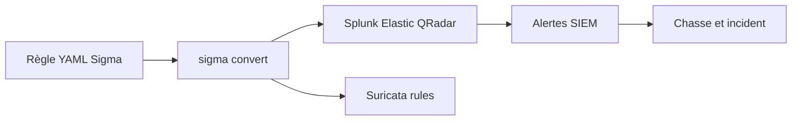

# 🔎 Sigma — Forensics, Threat Intel & Honeypots

> [!info] **En 1 phrase**
> Sigma est un format ouvert et générique de règles de détection orientées logs, comparable à YARA mais pour les journaux, convertible automatiquement vers Splunk, Elastic, Suricata, QRadar et plus d'une vingtaine de SIEM/EDR.

---

## 🧾 Overview

| Champ | Valeur |
|---|---|
| Nom complet | Sigma |
| Description | Format ouvert de règles de détection orientées logs : YAML neutre convertible vers les SIEM/EDR |
| Catégorie | 🔎 Forensics, Threat Intel & Honeypots |
| Sous-catégorie | Detection as Code / Règles de détection |
| Fonction principale | Écrire une règle de détection une fois, la convertir pour Splunk, Elastic, QRadar, Sentinel, Suricata... |
| Type d'outil | CLI Python (sigma convert/validate/list) + dépôt de règles YAML |
| Licence | DRL-1.1 (règles) ; Apache-2.0/MIT (outils) |
| Open source / propriétaire | Open source |
| Langage(s) de programmation | Python (CLI), YAML (format des règles) |
| Développeur / organisation | SigmaHQ (communauté, ex-Florian Roth / Thomas Patzke) |
| Projet officiel | Sigma |
| Dépôt officiel | https://github.com/SigmaHQ/sigma |
| Documentation officielle | https://sigmahq.io/docs |
| Date de création | 2017 |
| État du projet | actif (CLI v3.0.x ; dépôt de règles maintenu en continu) |
| Dernière version connue | CLI v3.0.3 (sigmalogic) |
| Systèmes compatibles | Linux, macOS, Windows (Python 3.9+) |

> [!note] Pour vérifier / compléter
> La CLI a été réécrite en v3 par le projet **sigmalogic** (commande `sigma`) : les options exactes diffèrent de l'ancienne `sigma-cli`. Vérifier la doc officielle pour la version installée.

---

## 🎯 Concept

Là où YARA matche des octets, Sigma matche des **logs** : chaque règle décrit une condition sur les champs d'un événement (ex. `CommandLine` contient `powershell -enc`) dans un **YAML neutre**, indépendant du SIEM. Un convertisseur (`sigma convert`) traduit ensuite la règle vers la syntaxe cible : Splunk SPL, Elasticsearch, Microsoft Sentinel (KQL), QRadar, Suricata, Sysmon, etc. C'est l'approche « écrire une fois, déployer partout ». Une règle Sigma est structurée : `title`, `id`, `status` (experimental → test → stable), `tags` (MITRE ATT&CK, ex. `attack.t1059.001`), `logsource` (product, category, service), `detection` (sélections + `condition`), `falsepositives`, `level`. On l'utilise pour détecter des TTPs via les **règles officielles SigmaHQ** maintenues par la communauté, complétées par des **règles maison** pour des comportements observés en interne. L'intérêt défensif : partager et maintenir une bibliothèque de détection cohérente entre équipes et outils, sans dupliquer la logique dans chaque SIEM.



---

## 🧠 Concepts fondamentaux

| Concept | Explication |
|---|---|
| Règle Sigma | Fichier YAML décrivant une détection sur des logs (champs + condition) |
| logsource | Provenance des logs : `product` (windows/linux/network), `category`, `service` |
| category | Type d'événement : `process_creation`, `network_connection`, `file_event`, `dns_query`... |
| selection | Bloc de conditions sur les champs (avec modificateurs) |
| condition | Combinaison logique des sélections : `selection`, `selection and not filter`, `1 of selection*` |
| Modificateur | Affine la comparaison : `contains`, `endswith`, `startswith`, `all`, `re`, `cidr`, `base64offset` |
| status | Maturité : `experimental` → `test` → `stable` |
| level | Gravité : `informational`, `low`, `medium`, `high`, `critical` |
| tags | Références MITRE ATT&CK (`attack.t1059.001`) et classifications |
| Backend | Convertisseur vers un SIEM/EDR cible (splunk, elasticsearch, kql, suricata...) |
| Pipeline | Adaptation des champs aux conventions du SIEM (`ecs_windows`, `crowdstrike`...) |
| SigmaHQ | Organisation maintenant le dépôt officiel de règles |

---

## 🛠️ Installation

La CLI officielle est fournie par le projet **Sigmalogic** (nouveau dépôt de la CLI) :

```bash
pip install sigmalogic
sigma --help

# Ancienne CLI (toujours maintenue) : sigma-cli
pip install sigma-cli

# Cloner les règles officielles
git clone https://github.com/SigmaHQ/sigma.git /opt/sigma
```

Le dossier `/opt/sigma/rules` contient les règles officielles triées par plateforme (windows, linux, macos, network, cloud, web).

> [!warning] ⚠️ Prérequis & problèmes potentiels
> - Python 3.9+ requis ; utiliser un environnement virtuel (`venv`) pour éviter les conflits de dépendances.
> - Ne pas confondre les deux CLI (`sigma-cli` vs `sigmalogic`) : les options `-t`/`-p` sont similaires mais l'output peut différer.
> - Les règles du dépôt SigmaHQ évoluent vite : mettre à jour régulièrement (`git pull`).

---

## ⚙️ Configuration

| Paramètre (règle) | Rôle | Valeur possible | Impact | Exemple |
|---|---|---|---|---|
| `title` | Nom de la règle | chaîne | Identification | `Suspicious Schtasks` |
| `id` | UUID de la règle | UUID | Traçabilité | `7a8b9c0d-...` |
| `status` | Maturité | experimental/test/stable | Confiance de déploiement | `test` |
| `logsource.product` | Plateforme source | windows/linux/network/cloud | Cible de la conversion | `windows` |
| `logsource.category` | Type d'événement | process_creation, network_connection | Champs attendus | `process_creation` |
| `detection.selection` | Conditions sur les champs | clé/valeur + modificateurs | Précision de la règle | `Image\|endswith: '\schtasks.exe'` |
| `detection.condition` | Combinaison des sélections | logique booléenne | Logique de détection | `selection and not filter` |
| `tags` | ATT&CK et classifications | liste | Cartographie | `attack.t1053.005` |
| `level` | Gravité | informational→critical | Priorité d'alerte | `medium` |
| `falsepositives` | Cas connus de bruit | liste | Documentation | `- Administrateurs` |

> [!note] À vérifier
> Le schéma exact des champs (`logsource`, modificateurs) est défini par la spécification Sigma (v2 en 2026) : consulter la doc officielle pour les nouvelles règles.

---

## 🏗️ Architecture interne

Composants et flux à l'exécution :

- **Spécification Sigma** : le format YAML (schéma JSON) définit les champs, logsource, modificateurs et la logique de condition.
- **CLI (sigmalogic)** : charge la règle, la valide contre le schéma, puis la convertit via un **backend** avec des **pipelines** optionnels.
- **Backends** : convertisseurs par cible — `splunk` (SPL), `elasticsearch` (Lucene/DSL), `kql` (Sentinel), `qradar` (AQL), `suricata` (règles réseau), `logpoint`, `sumologic`, `microsoft365defender`...
- **Pipelines** : transforment les noms de champs Sigma vers les conventions du SIEM (ex. `ecs_windows` pour Elastic ECS).
- **Dépôt de règles** : SigmaHQ `rules/` (par plateforme) et les bibliothèques tierces (Sigmac-pipelines, règles communautaires).

Flux type : règle YAML → `sigma validate` → `sigma convert -t <backend> [-p <pipeline>]` → recherche/requête pour le SIEM → planification en alerte → détection sur les logs réels.

---

## ⌨️ Commandes

### Commandes principales

```bash
# Valider une règle (syntaxe YAML + conformité au schéma)
sigma validate rule.yaml

# Convertir pour Splunk (SPL)
sigma convert -t splunk rule.yaml

# Convertir pour Elasticsearch avec le pipeline ECS
sigma convert -t elasticsearch -p ecs_windows rule.yaml

# Convertir pour Microsoft Sentinel / Defender (KQL)
sigma convert -t kql rule.yaml

# Convertir en règle réseau pour Suricata
sigma convert -t suricata rule.yaml

# Convertir pour d'autres SIEM (QRadar, SumoLogic, Logpoint)
sigma convert -t qradar rule.yaml
sigma convert -t sumologic rule.yaml

# Lister les convertisseurs et pipelines disponibles
sigma list
```

| Commande | Effet |
|---|---|
| `sigma validate <règle>` | Vérifie la syntaxe YAML et la conformité au schéma Sigma |
| `sigma convert -t splunk <règle>` | Produit une recherche SPL exploitable dans Splunk |
| `sigma convert -t elasticsearch <règle>` | Génère une requête Elasticsearch (avec pipeline si précisé) |
| `sigma convert -t suricata <règle>` | Convertit en règle Suricata (champs réseau uniquement) |
| `sigma convert -t kql <règle>` | Cible Microsoft Sentinel / Defender (KQL) |
| `sigma convert -t microsoft365defender <règle>` | Cible Microsoft 365 Defender |
| `sigma convert -t qradar <règle>` | Cible IBM QRadar (AQL) |
| `-p <pipeline>` | Adapte la conversion aux conventions du SIEM (ex. `-p ecs_windows`) |
| `sigma list` | Liste les backends et pipelines disponibles |

### Commandes avancées

```bash
# Convertir tout le dépôt officiel pour Splunk
sigma convert -t splunk /opt/sigma/rules/windows/process_creation/

# Valider toutes les règles d'un dossier
sigma validate /opt/sigma/rules/windows/process_creation/

# Appliquer plusieurs pipelines
sigma convert -t elasticsearch -p ecs_windows -p ecs_cloud rule.yaml
```

---

## 🎚️ Options et flags

| Option | Description | Exemple | Niveau |
|---|---|---|---|
| `-t <backend>` | Backend cible | `-t splunk` | Basic |
| `-p <pipeline>` | Pipeline d'adaptation des champs | `-p ecs_windows` | Intermediate |
| `-c <config>` | Fichier de config supplémentaire | `-c backend_config.yml` | Advanced |
| `-o <file>` | Sortie vers un fichier | `-o splunk_query.spl` | Basic |
| `--format <f>` | Format de sortie (plain, csv...) | `--format csv` | Advanced |
| `-v` / `--verbose` | Sortie détaillée | `sigma convert -v -t splunk r.yaml` | Intermediate |
| `--defer_abort` | Ne pas s'arrêter à la première erreur | `sigma convert --defer_abort ...` | Advanced |
| `--fail-on-unsupported` | Échouer si la conversion est incomplète | `--fail-on-unsupported` | Expert |

> [!tip] Options les plus utiles au quotidien
> `-t` pour choisir le SIEM, `-p ecs_windows` (ou l'équivalent de ton environnement) pour aligner les champs, `-o` pour écrire la recherche, et `sigma validate` systématiquement avant conversion.

---

## 🧪 Exemples pratiques

### Advanced

```bash
# Objectif : convertir toutes les règles de détection réseau pour Suricata
sigma convert -t suricata /opt/sigma/rules/network/ >> /etc/suricata/rules/local.rules
sudo suricata -T -c /etc/suricata/suricata.yaml -S /etc/suricata/rules/local.rules
```

### Expert

```yaml
# Objectif : règle maison avec plusieurs sélections et un filtre
title: Suspicious MSBuild Inline Task
id: 9a8b7c6d-5e4f-4a3b-8c7d-6e5f4a3b2c1d
status: test
description: MSBuild invoqué avec une tâche inline (technique fréquente d'évasion)
tags:
    - attack.defense_evasion
    - attack.t1127
logsource:
    category: process_creation
    product: windows
detection:
    selection_img:
        Image|endswith: '\msbuild.exe'
    selection_args:
        CommandLine|contains: 'InlineTask'
    condition: selection_img and selection_args
falsepositives:
    - Builds légitimes utilisant des tâches inline
level: high
```

---

## 🧪 Workflow complet (scénario pas à pas)

1. **Étape 1 — Écrire une règle maison** : détecter un `schtasks.exe` lancé avec un argument encodé en base64, technique de persistance courante (voir exemple en scénario).
2. **Étape 2 — Valider** : `sigma validate schtasks.yaml` → corriger les éventuelles erreurs de champ.
3. **Étape 3 — Convertir pour le SIEM interne** : `sigma convert -t splunk schtasks.yaml` → copier la recherche SPL dans le serveur Splunk.
4. **Étape 4 — Déployer** : planifier la recherche en alerte (ex. toutes les 10 minutes, sur 24 h de logs).
5. **Étape 5 — Tester** : rejouer un vrai log d'attaque (capture Sysmon EventID 1) et vérifier que l'alerte se déclenche sans faux positif.
6. **Étape 6 — Partager** : une fois stable, relever le statut `stable` et pousser la règle dans la bibliothèque interne (voire en contribution SigmaHQ).

---

## 🎬 Scénarios avancés

### Scénario 1 : Détection de persistance par schtasks encodé en base64

```yaml
title: Suspicious Schtasks CommandLine
status: experimental
description: Détection d'un schtasks avec encodage suspect
tags:
    - attack.persistence
    - attack.t1053.005
logsource:
    category: process_creation
    product: windows
detection:
    selection:
        Image|endswith: '\schtasks.exe'
        CommandLine|contains|all:
            - 'schtasks'
            - 'base64'
    condition: selection
level: medium
```

```bash
# Valider puis convertir pour Splunk
sigma validate schtasks.yaml
sigma convert -t splunk schtasks.yaml
# Pour Elasticsearch avec le pipeline ECS (champs adaptés au cluster)
sigma convert -t elasticsearch -p ecs_windows schtasks.yaml
# Tester sur un corpus de logs réels (Sysmon) et mesurer le bruit
```

### Scénario 2 : Chasse réseau avec conversion Suricata

Transformer une règle Sigma réseau en règle Suricata pour un capteur IDS.

```bash
# 1. Convertir une règle réseau officielle pour Suricata
sigma convert -t suricata /opt/sigma/rules/network/

# 2. Rediriger la sortie vers le fichier de règles Suricata
sigma convert -t suricata rule_net.yaml >> /etc/suricata/rules/local.rules

# 3. Valider la syntaxe Suricata
sudo suricata -T -c /etc/suricata/suricata.yaml -S /etc/suricata/rules/local.rules

# 4. Relancer le capteur et surveiller les alertes (eve.json)
sudo systemctl restart suricata
jq -c 'select(.alert != null)' /var/log/suricata/eve.json | tail -5
```

### Scénario 3 : Chasse de la compromission de comptes avec base64offset

```yaml
title: Suspicious Base64 Encoded PowerShell (any offset)
status: test
tags:
    - attack.execution
    - attack.t1059.001
logsource:
    category: process_creation
    product: windows
detection:
    selection:
        Image|endswith: '\powershell.exe'
        CommandLine|contains|base64offset:
            - 'powershell.exe'
            - '-enc'
    condition: selection
falsepositives:
    - Scripts d'administration encodés volontairement
level: high
```

```bash
# Le modificateur base64offset matche aussi l'argument décalé de 1-3 octets
sigma convert -t splunk ps_base64.yaml
```

---

## 🛡️ Cybersecurity use cases

| Phase | Utilisation |
|---|---|
| Détection | Règles sur processus, connexions, fichiers, DNS (Sysmon, audit logs) |
| Chasse | Conversion de règles en requêtes SIEM pour des recherches ciblées |
| Déploiement multi-SIEM | Même règle vers Splunk, Elastic, Sentinel, QRadar sans duplication |
| Detection as code | Validation + tests + déploiement automatisés des règles |
| Partage | Contribution SigmaHQ, bibliothèque interne commune |
| Complément réseau | Conversion de règles réseau vers Suricata/Snort |

---

## 🎯 MITRE ATT&CK

| Tactique | Technique / Sub-technique | ID | Raison | Détection | Mitigation |
|---|---|---|---|---|---|
| Execution | Command and Scripting Interpreter: PowerShell | T1059.001 | `powershell -enc` / base64 détectés par règles process_creation | Rules Sysmon EventID 1 | ScriptBlock Logging |
| Persistence | Scheduled Task/Job | T1053.005 | schtasks/schtasks.exe suspects dans les règles | Rules process_creation | Auditer les tâches planifiées |
| Credential Access | OS Credential Dumping | T1003.001 | dump LSASS/mimikatz couvert par les règles | Rules process_creation/file | Credential Guard |
| Defense Evasion | Indicator Removal on Host | T1070 | suppression de logs/artefacts détectée | Rules file_event/process | Audits Windows |
| Discovery | System Information Discovery | T1082 | collecte d'informations système par les règles | Rules process_creation | Least privilege |
| Lateral Movement | Remote Services | T1021.001 | connexions RDP/PsExec dans les règles | Rules network_connection | Network segmentation |

> [!note] Ne renseigner que si l'association est réellement pertinente.
> Sigma n'est pas un outil d'attaque : les mappings listent les techniques que les règles officielles couvrent en priorité.

---

## 🛡️ Defensive Security

### Signes observables

| Indicateur | Détail |
|---|---|
| `powershell -enc`, `-e`, base64 dans les lignes de commande | Collecter les logs de processus (Sysmon EventID 1, audit policies) |
| Persistance via schtasks, services, Run keys | Activer les catégories d'audit Windows et l'EventLog complet |
| Règle convertie mais « muette » faute de champ collecté | Vérifier la couverture des champs (`CommandLine`, `Image`) dans le SIEM |
| Faux positifs des règles `experimental` | Passer les règles par `experimental → test → stable` et mesurer le bruit |
| Attaquant qui teste ses outils contre les règles publiques | Adapter les règles maison, varier les télémetries (ETW, EDR) |

### Règles de détection (Sigma / Suricata / Snort / YARA)

```yaml
# Sigma — connexion sortante vers un port de reverse shell
title: Outbound Connection to Reverse Shell Port
id: f0a1b2c3-4d5e-4f6a-7b8c-9d0e1f2a3b4c
status: experimental
logsource:
    category: network_connection
    product: windows
detection:
    selection:
        DestinationPort|in:
            - 4444
            - 5555
            - 8081
            - 31337
    condition: selection
falsepositives:
    - Services légitimes sur ces ports
level: medium
```

```text
# Règle YARA — complément sur un binaire suspect extrait
rule Suspicious_PowerShell_Downloader {
    strings:
        $mz = { 4D 5A }
        $dl = "DownloadString" ascii nocase
        $iex = "IEX" ascii
    condition:
        $mz at 0 and ($dl or $iex)
}
```

---

## 🤖 Automatisation

```bash
# Bash — convertir tout le dépôt windows/process_creation pour Splunk
sigma convert -t splunk /opt/sigma/rules/windows/process_creation/ -o splunk_all.txt
wc -l splunk_all.txt

# Bash — valider toutes les règles et journaliser les erreurs
sigma validate /opt/sigma/rules/windows/ > validate.log 2>&1
grep -i error validate.log | head
```

```python
# Python — déploiement automatisé d'une règle convertie vers Splunk (API)
import subprocess, requests

r = subprocess.run(["sigma", "convert", "-t", "splunk", "rule.yaml"],
                   capture_output=True, text=True, check=True)
spl_query = r.stdout.strip()
requests.post("https://splunk.example.com/services/search/jobs",
              data={"search": f"| search {spl_query}"},
              auth=("admin", "TOKEN"), verify=False)
print("Recherche créée dans Splunk")
```

---

## 📤 Output et parsing

La sortie de `sigma convert` est une **recherche/requête au format du SIEM cible** (SPL, Lucene, KQL, AQL, règle Suricata). Le mode par défaut affiche le texte de la recherche ; `-o` écrit dans un fichier.

```bash
# Sortie Splunk (exemple de conversion)
sigma convert -t splunk schtasks.yaml
# → Image="*\\schtasks.exe" CommandLine="*schtasks*" CommandLine="*base64*"

# Sortie Suricata (exemple de conversion réseau)
sigma convert -t suricata rule_net.yaml
# → alert dns any any -> any any (msg:"..."; dns.query; content:"..."; sid:...)
```

---

## 🔗 Intégrations

```text
Sigma → Splunk (SPL), Elasticsearch (Lucene/DSL), Sentinel (KQL), QRadar (AQL)
Sigma → Suricata/Snort (règles réseau), Greylog, Logpoint, SumoLogic
Sigma ↔ MITRE ATT&CK (tags attack.txxxx) → couverture des techniques
SigmaHQ règles → pipeline ECS → Elastic (modules ECS)
Sigma + YARA → détection complémentaire (logs + fichiers/binaires)
```

- [[Tools|🧰 Outils]]
- [[Outils/Outil - YARA|🔎 YARA]] — pendant de Sigma pour les fichiers/binaires
- [[Outils/Outil - OpenCTI|🔎 OpenCTI]] — cartographie des techniques reliées aux règles
- [[Outil - Splunk]] — backend SPL cible des conversions
- [[Outil - Elastic]] — backend Elasticsearch avec pipeline ECS
- [[Outil - Suricata]] — cible des conversions réseau (règles)
- [[Outil - Snort]] — cible réseau alternative
- [[Outil - Graylog]] — backend greylog de conversion

---

## 🔄 Alternatives

| Outil | Avantages | Inconvénients | Cas d'usage |
|---|---|---|---|
| Sigma | Neutre, multi-backends, open source | Dépend de la couverture des logs | Règles portables |
| Splunk ES | Règles intégrées au SIEM | Propriétaire, lié à Splunk | Environnement Splunk pur |
| YARA | Match d'octets, très précis | Logs uniquement ? Non — fichiers | Binaires/mémoire |
| Suricata/Snort | Signatures réseau temps réel | Pas orienté logs hôtes | IDS/IPS |
| Atomic Red Team | Tests de détection exécutables | Pas un format de règles | Validation des détections |
| Sigma Quadrant / Sigma CLI anciens | Historique, écosystème | Vieux outils | Compatibilité |

> **Quand utiliser Sigma plutôt qu'un autre ?** Dès qu'on veut des **règles de détection portables** entre plusieurs SIEM/EDR et maintenues en commun (detection as code). Pour matcher des fichiers binaires, préférer YARA.

---

## ⚡ Performance

- **Conversion** : rapide (processus local) même sur des milliers de règles ; le goulot est la validation sur les gros dossiers.
- **Règles déployées** : le coût est celui de la recherche SIEM — les règles complexes (regex, multiples sélections) sont plus chères à exécuter.
- **Volume de règles** : convertir l'intégralité de SigmaHQ génère des centaines de recherches : prioriser par `level`, `status` et tags ATT&CK.
- **Champs** : plus les logs collectés sont riches (Sysmon, ETW), plus les règles sont efficaces sans surcoût majeur.
- **Maintenance** : le dépôt évolue en continu : planifier des mises à jour et des revalidations.

> [!note] À vérifier
> L'impact exact dépend du SIEM cible et du volume de logs : mesurer le bruit et le coût de chaque règle en production, désactiver celles qui ne matchent rien.

---

## 🛠️ Troubleshooting

### Common problems

#### Problème : `sigma validate` renvoie des erreurs de schéma

- **Cause** : champ inconnu, modificateur invalide, YAML mal formé.
- **Solution** : vérifier l'indentation YAML, la casse des modificateurs (`contains`), la structure `detection`.
- **Vérification** : `sigma validate rule.yaml` après correction.

#### Problème : la conversion échoue pour le backend cible

- **Cause** : champs/opérateurs non supportés par le backend, ou pipeline absent.
- **Solution** : simplifier la règle (éviter regex avancées), choisir le bon pipeline.
- **Vérification** : tester avec une règle officielle simple du même backend.

#### Problème : la règle convertie ne matche rien dans le SIEM

- **Cause** : champs absents des logs collectés, noms de champs différents.
- **Solution** : vérifier la télémetrie (`CommandLine`, `Image` présents ?), appliquer le pipeline adapté (ECS).
- **Vérification** : rechercher un log réel correspondant dans le SIEM.

#### Problème : trop de faux positifs

- **Cause** : règle `experimental`, sélection trop large, environnement bruyant.
- **Solution** : affiner les sélections, ajouter `not filter`, passer en `test` puis mesurer.
- **Vérification** : suivre le taux d'alertes sur une période.

#### Problème : deux CLI Sigma différentes installées

- **Cause** : `sigma-cli` et `sigmalogic` cohabitent.
- **Solution** : n'en garder qu'une (sigmalogic recommandée), désinstaller l'autre.
- **Vérification** : `sigma --version` et `which sigma`.

---

## 🔐 Sécurité de l'outil

- **Règles** : n'importer que des règles de sources fiables (SigmaHQ, règles maison auditées) : une règle malveillante peut créer des recherches coûteuses ou des alertes bidon.
- **Dépôt** : protéger le dépôt Git (signatures, revues) en environnement de production.
- **Clés SIEM** : les scripts de déploiement automatique utilisent des API : stocker les identifiants dans un coffre.
- **Données** : les règles décrivent des techniques internes : restreindre l'accès au dépôt si sensible.
- **Posture** : Sigma est défensif, mais un attaquant peut l'utiliser pour éviter les détections connues : varier les télémetries et garder des règles maison.

---

## ⚠️ Limitations

- **Dépend de la télémetrie** : une règle est muette si les logs ne collectent pas les champs.
- **Pas d'exécution** : Sigma est un format de règles, pas un moteur de détection.
- **Backends inégaux** : certaines fonctionnalités (regex, modificateurs avancés) ne sont pas supportées partout.
- **Bruit** : les règles `experimental` communautaires génèrent des faux positifs à filtrer.
- **Couverture hôte** : très bon sur Windows, moins fourni sur certains SIEM/EDR Linux.
- **Maintenance** : mise à jour continue du dépôt et revalidation nécessaires.

---

## 📋 Cheatsheet

```bash
# Valider une règle
sigma validate rule.yaml

# Convertir pour Splunk
sigma convert -t splunk rule.yaml

# Convertir pour Elasticsearch (ECS Windows)
sigma convert -t elasticsearch -p ecs_windows rule.yaml

# Convertir pour Sentinel (KQL)
sigma convert -t kql rule.yaml

# Convertir en règle Suricata
sigma convert -t suricata rule_net.yaml

# Lister backends et pipelines
sigma list

# Convertir un dossier complet vers un fichier
sigma convert -t splunk /opt/sigma/rules/windows/process_creation/ -o splunk_all.txt
```

---

## ⚡ Quick reference

| | |
|---|---|
| **À quoi sert-il ?** | Format de règles de détection orientées logs, convertibles vers les SIEM/EDR |
| **Quand l'utiliser ?** | Détection as code, multi-SIEM, partage de règles, complément réseau (Suricata) |
| **Commande principale** | `sigma convert -t <backend> rule.yaml` |
| **Alternative principale** | Règles natives du SIEM, YARA (fichiers) |
| **Concepts importants** | logsource, detection/condition, modificateurs, backend, pipeline, status/level |
| **Liens associés** | [[Outils/Outil - YARA|🔎 YARA]] · [[Outils/Outil - OpenCTI|🔎 OpenCTI]] |

---

## 🔍 Détection & Défense

| Signe | Défense |
|---|---|
| Commandes PowerShell encodées | Règles process_creation (Sysmon EventID 1) |
| Tâches planifiées persistantes | Règles schtasks, audit des tâches |
| Dump de credentials | Règles T1003.001 (lsass, mimikatz) |
| Connexions sortantes suspectes | Règles network_connection, corrélation SIEM |
| Règle muette / trop bruitée | Vérifier la télémetrie et le statut (experimental→stable) |

---

## ⚠️ Tips & Pièges

> [!tip] 💡 **Tips**
> - Regarde d'abord les règles officielles SigmaHQ avant d'en écrire une : la TTP est très probablement déjà couverte, il suffit de l'adapter à son environnement.
> - Utilise `-p` (pipeline) avec le bon corpus : `sigma convert -t elasticsearch -p ecs_windows` traduit les noms de champs Sigma vers ceux de ton cluster.
> - Renseigne `logsource` (product, category, service) : c'est ce qui cible le bon flux de logs à la conversion.

> [!warning] ⚠️ **Pièges**
> - Une règle Sigma ne s'exécute pas toute seule : la conversion dépend des champs réellement présents dans tes logs. Un SIEM qui ne collecte pas `CommandLine` rend la règle muette.
> - Les règles `experimental` des dépôts communautaires produisent souvent des faux positifs : relève le seuil de confiance avant production et mesure le bruit dans ton environnement.
> - Ne confonds pas le format de règle (Sigma) avec le SIEM de destination : chaque backend a sa propre syntaxe de champs.

> [!warning] ⚠️ **Piège** : les modificateurs ont une syntaxe précise.
> `Field|contains|all` s'écrit `CommandLine|contains|all` et non `CommandLine contains all` : une erreur de modificateur invalide silencieusement la règle.

---

## 📚 References

### Official

- SigmaHQ / sigma — dépôt des règles officielles : https://github.com/SigmaHQ/sigma
- Sigmalogic — CLI de conversion : https://github.com/SigmaHQ/sigmalogic
- Documentation Sigma : https://sigmahq.io/
- Spécification du format : https://sigmahq.io/docs/specification/

### Security references

- MITRE ATT&CK T1059.001 — PowerShell : https://attack.mitre.org/techniques/T1059/001/
- MITRE ATT&CK T1053.005 — Scheduled Task : https://attack.mitre.org/techniques/T1053/005/
- MITRE ATT&CK T1003.001 — LSASS Memory : https://attack.mitre.org/techniques/T1003/001/

### Community

- Atomic Red Team (tests de détection) : https://github.com/redcanaryco/atomic-red-team
- Uncoder.io (conversion en ligne) : https://uncoder.io
- Blog Sigma / SigmaHQ : https://sigmahq.io/

---

➡️ **Liens :** [[Tools|🧰 Outils]] · [[Outils/Outil - YARA|🔎 YARA]] · [[Outils/Outil - OpenCTI|🔎 OpenCTI]] · [[Techniques/10 - Cheatsheets|📜 Cheatsheets]]
