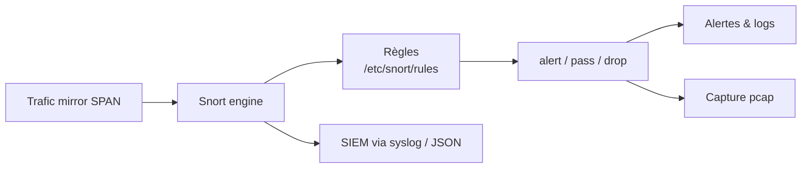

# 🛡️ Snort — Défense & SIEM

> [!info] **En 1 phrase**
> Snort est l'IDS/IPS **à base de règles** le plus connu : il analyse le trafic en temps réel et
> émet des alertes (ou bloque) selon des signatures dans `/etc/snort/rules`.

---

## 🧾 Overview

| Champ | Valeur |
|---|---|
| Nom complet | Snort |
| Description | IDS/IPS réseau à base de signatures : analyse du trafic temps réel, alertes ou blocage selon des règles |
| Catégorie | 🛡️ IDS / SIEM / EDR |
| Sous-catégorie | NIDS / NIPS / Signature-based detection |
| Fonction principale | Détecter (alert) et/ou bloquer (drop) le trafic malveillant via des règles + préprocesseurs |
| Type d'outil | Daemon réseau (CLI + config), bibliothèque libdaq pour l'interface |
| Licence | GPLv2+ (Snort 2), GPLv2 (Snort 3) ; règles Talos commerciales, communauté GPL |
| Open source / propriétaire | Open source (moteur), règles officielles Talos à abonnement |
| Langage(s) de programmation | C (Snort 2), C++ (Snort 3) |
| Développeur / organisation | Cisco Talos (créé par Martin Roesch, 1998) |
| Projet officiel | Snort / Snort 3 |
| Dépôt officiel | https://github.com/snort3/snort3 |
| Documentation officielle | https://docs.snort.org |
| Date de création | 1998 (Snort 1.0) ; Snort 3 en développement actif depuis 2014 |
| État du projet | actif (Snort 3 : 3.12.2.0 publiée le 2026-04-23) |
| Dernière version connue | 3.12.2.0 (3.12.1.0, 3.11.1.0 précédentes) |
| Systèmes compatibles | Linux (x86_64, aarch64), Windows, macOS, BSD |

> [!note] Pour vérifier / compléter
> Snort 2 est en fin de vie : les règles Snort 3 s'écrivent avec le même format `alert ...` mais la config passe par `snort.lua` (variables Lua, `ips = { rules = [...] }`). Les deux générations ne partagent pas la même syntaxe de config.

---

## 🎯 Concept

Snort est un **IDS (Intrusion Detection System)** qui écoute le réseau en 3 modes : **sniffer** (affiche le trafic), **packet logger** (enregistre les paquets) et **IDS/IPS** (détecte via des règles puis journalise ou bloque). Il se déploie en **mirror SPAN** sur un switch pour voir tout le trafic sans être dans le chemin de données. En mode **inline (IPS)**, il se place réellement dans le flux (via **DAQ**, Data AcQuisition : NFQueue/iptables, AF_PACKET, netmap...) et peut appliquer les actions `drop`/`reject`.

Simple et stable, c'est la référence historique des règles de détection : règles commerciales Talos (abonnement) et règles communautaires gratuites (mises à jour via pulledpork/pullpork ou Snort 3 `snort --update-rules`). Deux générations coexistent : **Snort 2** (config `snort.conf`, mono-thread, `-l` logs, Barnyard2 pour le spooling) et **Snort 3** (config `snort.lua`, multi-thread, moteur Hyperscan, traitement du trafic 5-10× plus rapide).

Il se place en **détection réseau** dans un SOC : capteur sur une zone critique (DMZ, LAN, accès internet), alimentant un SIEM via syslog/JSON/`alert_fast`. Il est souvent comparé à [[Outil - Suricata]] (même langage de règles, multi-thread, règles ET) et complété par [[Outil - Zeek]] (métadonnées, pas de blocage) pour une couverture réseau complète.



---

## 🧠 Concepts fondamentaux

| Concept | Explication |
|---|---|
| Rule / signature | Règle décrivant un trafic malveillant : `action proto source -> dest (options)`, avec `sid`, `rev`, `msg` |
| sid / rev | Identifiant unique de règle (`sid:1000001`) et révision (`rev:1`) — les `sid > 1000000` sont réservés aux règles locales |
| Preprocessor | Module d'analyse avant les règles (fragmentation IP, flux TCP, ports scan `sfportscan`, decodeur HTTP...) |
| DAQ | Data AcQuisition : couche d'accès aux paquets (AF_PACKET, NFQueue, netmap, pcap) ; `-Q` pour l'inline |
| Modes | Sniffer (`-v`), packet logger (`-l dir`), IDS (`-A console/fast`), IPS (`-Q` inline) |
| Alert output | Format des alertes : `fast`, `full`, `console`, `json`, `unified2` (Snort 2) / `alert_fast`, `alert_json` (Snort 3) |
| HOME_NET / EXTERNAL_NET | Variables réseau : réseau à protéger et le reste (Snort 2 `ipvar`, Snort 3 variables Lua) |
| Content match | Recherche de bytes/payload dans le paquet : `content:"|ff 53 4d 42|"`, `depth`, `offset`, `within` |
| flow | Gestion de l'état de flux : `flow:established,to_server` pour ne matcher que les flux établis |
| Threshold / suppress | Réduction du bruit : `threshold:type limit,count 5,seconds 60` ou `suppress gen_id 1, sid 1000001` |
| Barnyard2 | Spooler Snort 2 : lit les logs unified2 et les pousse vers MySQL/PostgreSQL |
| Snort 3 (snort3) | Réécriture multi-thread : config `snort.lua`, moteur Hyperscan, `-z` threads, plugins Lua |

---

## 🛠️ Installation

### Debian / Ubuntu / Kali Linux (Snort 2, dépôts)

```bash
sudo apt update && sudo apt install -y snort
# Oinkmaster pour les règles communautaires (optionnel)
sudo apt install -y oinkmaster
# Vérifier la validité de la config et des règles (sans écouter)
sudo snort -c /etc/snort/snort.conf -T
```

### Snort 3 (recommandé) — dépôt officiel snort.org

```bash
curl -fsSL https://packages.snort.org/snort/snort-repo.deb -o /tmp/snort-repo.deb
sudo dpkg -i /tmp/snort-repo.deb
sudo apt update && sudo apt install -y snort3
# Config par défaut : /usr/local/etc/snort/snort.lua
snort -V
```

### RHEL / CentOS / Fedora (Snort 3)

```bash
sudo dnf install -y snort3     # via le dépôt snort.org RPM
# ou compilation source : https://github.com/snort3/snort3/blob/master/INSTALL.md
```

### Windows / macOS

```powershell
# Windows : binaire snort.org (WinPcap/Npcap requis pour l'écoute)
# macOS : brew install snort  (Snort 2) ou compilation Snort 3
```

### Docker

```bash
docker run --rm --net=host -it -v /etc/snort:/etc/snort --name snort snort:latest
```

> [!warning] ⚠️ Prérequis & problèmes potentiels
> - La validation `snort -T` doit retourner `1` (config saine) ; une erreur de règle bloque le démarrage.
> - En Snort 3, les variables se déclarent en Lua (`HOME_NET = '10.10.20.0/24'`) : ne pas mélanger la syntaxe `ipvar` de Snort 2.
> - Le mode IPS nécessite **iptables/NFQUEUE** (Snort 2) ou le DAQ `af_packet` en inline (Snort 3) avec des privilèges root.
> - Règles : sans abonnement Talos, activer les règles **communautaires** (`snort --update-rules` en Snort 3) pour une détection exploitable.

---

## ⚙️ Configuration

| Paramètre | Rôle | Valeur possible | Impact | Exemple |
|---|---|---|---|---|
| `HOME_NET` | Réseau à protéger (Snort 2 `ipvar` / Snort 3 Lua) | CIDR | Définit la notion d'interne/externe | `HOME_NET = '10.10.20.0/24'` |
| `EXTERNAL_NET` | Réseau externe | `!$HOME_NET`, `any` | Cible des règles sortantes/entrantes | `EXTERNAL_NET = '!$HOME_NET'` |
| `RULE_PATH` | Dossier des règles | `/etc/snort/rules` | Inclusions `include $RULE_PATH/...` | `RULE_PATH = '/etc/snort/rules'` |
| `ips.rules` (Snort 3) | Fichiers de règles chargés | liste Lua | Moteur de règles actives | `ips = { rules = [ 'local.rules', 'snort3-community.rules' ] }` |
| `include` (Snort 2) | Inclusion de règles/config | chemin | Charge les règles | `include $RULE_PATH/local.rules` |
| `preprocessor sfportscan` | Détection de scans de ports | `detect_scan` | Réduit les scans non détectés | `preprocessor sfportscan: proto both` |
| `output alert_json` (Snort 3) | Sortie JSON pour SIEM | fichier | Alimente Elastic/Graylog | `alert_json { file = 'alert.json' }` |
| `-A fast / -A console` | Format d'alerte | fast, full, console | Lisibilité des logs | `-A fast` |
| `-z` (Snort 3) | Nombre de threads | `auto`, N | Performance multi-cœur | `-z auto` |
| `-Q` | Mode inline (IPS) | flag | Active le blocage | `-Q -i eth0:eth1` |
| `-i <iface>` | Interface d'écoute | nom | Capture du trafic | `-i eth0` |

> [!note] À vérifier
> Chemins : Snort 2 `/etc/snort/snort.conf` + `/etc/snort/rules/` ; Snort 3 `/usr/local/etc/snort/snort.lua` (Debian package) et `/etc/snort/` selon la distribution. Vérifier avec `snort -c <config> -T`.

---

## 🏗️ Architecture interne

Composants et flux à l'exécution :

- **DAQ (Data AcQuisition)** : couche d'entrée des paquets — `af_packet` (Linux), `nq`/NFQUEUE (inline iptables), `netmap`, `pcap` (rejeu de fichier). Le mode `-Q` place Snort dans le chemin de données.
- **Decoders** : parse Ethernet, IP, TCP/UDP, ICMP, tunnels, VLAN — normalisent les paquets avant analyse (fragmentation IP reassemblée par préprocesseur `frag3`).
- **Préprocesseurs** : `frag3`, `stream5/stream6` (réassemblage de flux TCP), `http_inspect` (normalisation HTTP), `sfportscan` (détection de scans), `reputation` (listes IP/ASN), `sip`, `ssl`, `dns`...
- **Moteur de règles** : chaque paquet est comparé aux règles actives ; les **rules options** (`content`, `pcre`, `flow`, `distance/within`, `byte_test`) sont évaluées de la plus rapide à la plus lente (optimisation). En Snort 3, Hyperscan accélère les `content` multi-patterns et le moteur est multi-thread (`-z`).
- **Output** : alertes vers `alert_fast`, `alert_json`, `unified2` (Snort 2 → Barnyard2 → BDD), syslog ; logs de paquets vers `log.pcap`.
- **Actions** : `alert`, `pass`, `drop` (inline), `reject` (inline + RST/ICMP), `rewrite` (Snort 3).
- **Variables/flowbit** : `flowbits` permettent la corrélation d'événements multi-paquets (ex. détecter un handshake puis l'exploit).

Flux type : paquet entrant → DAQ → decodeurs → préprocesseurs (frag3, stream5, http_inspect) → évaluation des règles → action `alert` → output JSON → SIEM ; en IPS, un paquet `drop` est rejeté par NFQUEUE.

---

## ⌨️ Commandes

### Commandes principales

```bash
# Mode sniffer (affiche les en-têtes en console)
snort -i eth0 -v

# Packet logger (écrit un pcap par flux dans le dossier de log)
snort -i eth0 -l /var/log/snort

# IDS en console (alertes à l'écran)
snort -c /etc/snort/snort.conf -A console -i eth0

# IDS en démon (arrière-plan)
snort -c /etc/snort/snort.conf -l /var/log/snort -i eth0 -D

# Rejouer un pcap à travers les règles (test hors-ligne)
snort -r capture.pcap -c /etc/snort/snort.conf -A console

# Snort 3 : validation config + lancement JSON
snort -c /usr/local/etc/snort/snort.lua -T
snort -c /usr/local/etc/snort/snort.lua -i eth0 -A alert_fast -l /var/log/snort
```

| Commande | Objectif | Résultat attendu |
|---|---|---|
| `snort -T` | Valide config + règles sans écouter | `0` alerte, démarrage OK |
| `snort -A fast / console` | Format des alertes | Logs lisibles une-ligne |
| `snort -D` | Mode démon | Détache en arrière-plan |
| `snort -l <dir>` | Dossier des logs | Fichiers `alert` + `log.pcap` |
| `snort -r <pcap>` | Analyse d'une capture | Rejeu hors-ligne |
| `snort -Q` | Mode inline IPS | Actions drop actives |
| `snort -V` | Version | Version + DAQ disponibles |
| `snort --update-rules` (Snort 3) | Mise à jour des règles | Règles communautaires à jour |
| `snort -z auto` (Snort 3) | Threads automatiques | Utilisation de tous les cœurs |

### Commandes avancées

```bash
# Snort 3 : rejeu pcap + sortie JSON (pour alimenter un SIEM)
snort -c /usr/local/etc/snort/snort.lua -r capture.pcap -A alert_json -l /var/log/snort

# Snort 2 : spooling des alertes vers une BDD via Barnyard2
barnyard2 -c /etc/snort/barnyard2.conf -d /var/log/snort -w /var/log/snort/spool.waldo
```

---

## 🎚️ Options et flags

| Option | Description | Exemple | Niveau |
|---|---|---|---|
| `-c <config>` | Fichier de configuration | `-c /etc/snort/snort.conf` | Basic |
| `-i <iface>` | Interface d'écoute | `-i eth0` | Basic |
| `-l <dir>` | Dossier de logs | `-l /var/log/snort` | Basic |
| `-A <mode>` | Format des alertes | `-A console`, `-A fast`, `-A full` | Basic |
| `-D` | Mode démon | `-D` | Basic |
| `-r <pcap>` | Rejoue un fichier pcap | `-r attack.pcap` | Basic |
| `-T` | Test de configuration | `-T` | Basic |
| `-v` | Verbeux (en-têtes) | `-v` | Basic |
| `-b` | Journalisation binaire | `-b` | Intermediate |
| `-Q` | Mode inline IPS | `-Q -i eth0:eth1` | Advanced |
| `-z` (Snort 3) | Threads | `-z auto`, `-z 4` | Advanced |
| `--rule-path` (Snort 3) | Dossier des règles | `--rule-path /usr/local/etc/rules` | Intermediate |
| `-A alert_json` (Snort 3) | Sortie JSON | `-A alert_json` | Advanced |
| `-u <user> -g <group>` | Drop privileges | `-u snort -g snort` | Advanced |
| `--update-rules` (Snort 3) | MAJ règles communautaires | `snort --update-rules` | Intermediate |

> [!tip] Options les plus utiles au quotidien
> `-T` avant chaque déploiement, `-A console` en test, `-A alert_fast` en prod, `-r` pour tester les règles sur pcap, et en Snort 3 `-z auto` + `--update-rules` pour la perf et la fraîcheur des signatures.

---

## 🧪 Exemples pratiques

### Beginner

```bash
# Objectif : lancer Snort en IDS et voir les alertes en console
sudo snort -c /etc/snort/snort.conf -A console -i eth0

# Objectif : valider une règle maison sur un ping
# local.rules : alert icmp any any -> $HOME_NET any (msg:"ICMP ping"; sid:1000001; rev:1;)
sudo snort -c /etc/snort/snort.conf -A console -i eth0
ping -c 1 10.10.20.15    # depuis une autre machine : l'alerte ICMP apparaît
```

### Intermediate

```bash
# Objectif : détecter un scan de ports avec sfportscan
# Config : preprocessor sfportscan: proto both, detect_scan
nmap -sS 10.10.20.15    # à lancer depuis l'externe
# Les alertes "Portscan" apparaissent dans /var/log/snort/alert
```

```bash
# Objectif : rejouer une capture d'attaque connue contre ses règles
sudo snort -r attaque.pcap -c /etc/snort/snort.conf -A console -l /var/log/snort
```

### Advanced

```text
# Objectif : règle de détection SMB (trafic NetBIOS) ciblée
alert tcp $EXTERNAL_NET any -> $HOME_NET 445 (msg:"SMB traffic"; flow:established;
  content:"|ff 53 4d 42|"; depth:4; sid:1000002; rev:1;)
```

```bash
# Objectif : sortie JSON pour un SIEM (Snort 3)
snort -c /usr/local/etc/snort/snort.lua -i eth0 -A alert_json -l /var/log/snort
# → /var/log/snort/alert_json.txt : une ligne JSON par alerte
```

### Expert

```text
# Objectif : règle de reverse shell sortant vers un port d'écoute
alert tcp $HOME_NET any -> $EXTERNAL_NET 4444 (msg:"Possible reverse shell"; flow:established;
  content:"|2e 2f 62 69 6e 2f 73 68|"; sid:1000003; rev:1;)

# Objectif : réduire le bruit sur une règle
alert tcp $EXTERNAL_NET any -> $HOME_NET 80 (msg:"Web scan"; flow:to_server;
  threshold:type both, track by_src, count 10, seconds 60; sid:1000004; rev:1;)
```

```bash
# Objectif : IPS inline complet (Snort 3, DAQ af_packet)
snort -c /usr/local/etc/snort/snort.lua -Q -i eth0:eth1 -z auto -l /var/log/snort -D
```

---

## 🧪 Workflow complet (scénario pas à pas)

1. **Configurer le réseau à surveiller** dans la config : `HOME_NET` à `10.10.20.0/24`, `EXTERNAL_NET` à `!$HOME_NET`.
2. **Créer une règle maison** dans `local.rules` pour détecter un ping :
   `alert icmp any any -> $HOME_NET any (msg:"ICMP Ping detecte"; sid:1000001; rev:1;)`.
3. **Inclure le fichier** : `include $RULE_PATH/local.rules` (Snort 2) ou `ips = { rules = [ 'local.rules' ] }` (Snort 3).
4. **Tester la config** : `sudo snort -c /etc/snort/snort.conf -T` (ou `snort.lua`) — sortie `0` attendue.
5. **Lancer en IDS** : `sudo snort -c /etc/snort/snort.conf -A console -i eth0`.
6. **Vérifier les alertes** : en console puis dans `/var/log/snort/alert` ; brancher ensuite la sortie `alert_json`/syslog vers le SIEM.

---

## 🎬 Scénarios avancés

### Scénario 1 : rejouer une capture d'attaque pour valider ses règles

```bash
# 1. Récupérer un pcap d'exploitation (ex. capture Metasploit)
# 2. Ajouter une règle ciblée dans local.rules (en-tête SMB = \xFF'SMB')
#    alert tcp $EXTERNAL_NET any -> $HOME_NET 445 (msg:"SMB traffic"; flow:established;
#    content:"|ff 53 4d 42|"; sid:1000002; rev:1;)
# 3. Rejouer la capture contre les règles
sudo snort -r attaque.pcap -c /etc/snort/snort.conf -A console -l /var/log/snort
# 4. Vérifier que l'alerte apparaît, sinon affiner (content/depth/offset)
# 5. Une fois stable : basculer la règle en production
```

### Scénario 2 : passage en mode IPS inline pour bloquer

```bash
# 1. Configurer les paires d'interfaces (Snort 3 : -Q -i eth0:eth1)
# 2. Rediriger le trafic entre les deux interfaces via iptables (Snort 2)
sudo iptables -I FORWARD -j QUEUE
# 3. Lancer Snort en mode inline
sudo snort -c /etc/snort/snort.conf -Q -i eth0:eth1 -D
# 4. Les paquets marqués « drop » dans les règles sont réellement bloqués
# 5. Vérifier les alertes drop dans /var/log/snort/alert
```

### Scénario 3 : détection d'un reverse shell par règle maison

```bash
# 1. Ajouter dans local.rules une règle sur le port 4444 (ex. netcat)
#    alert tcp $HOME_NET any -> $EXTERNAL_NET 4444 (msg:"Reverse shell port 4444";
#    flow:established; sid:1000003; rev:1;)
# 2. Tester sur une capture connue de reverse shell
sudo snort -r shell.pcap -c /etc/snort/snort.conf -A console
# 3. Après validation et mesure du bruit : passer la règle en « drop » en mode IPS
```

---

## 🛡️ Cybersecurity use cases

| Phase | Utilisation |
|---|---|
| Détection réseau | Signatures de scans, exploits, malware C2 (règles Talos/communautaires) |
| Prévention (IPS) | Mode inline `-Q` : blocage des connexions droppées |
| Surveillance de zone | Capteur SPAN sur DMZ/LAN, monitoring de trafic entrant/sortant |
| Analyse forensique | Rejeu de pcap (`-r`) pour valider les règles et dater une attaque |
| Conformité | Preuves de détection, logs d'alertes audités |
| SOC | Alimentation SIEM en JSON/syslog, corrélation avec les logs hôtes |

---

## 🎯 MITRE ATT&CK

| Tactique | Technique / Sub-technique | ID | Raison | Détection | Mitigation |
|---|---|---|---|---|---|
| Reconnaissance | Network Service Discovery | T1046 | Scans de ports détectés par `sfportscan` | Règles portscan + `sfportscan` | Limiter l'exposition, firewall |
| Initial Access | Exploit Public-Facing Application | T1190 | Exploits web/SMB détectés par signatures | Règles Talos/ET sur ports 80/443/445 | Patching, WAF, segmentation |
| Execution | Exploitation for Client Execution | T1203 | Trafic exploitant une app cliente (documents, RDP) | Signatures de vulnérabilités | Patching, restrictions |
| Command and Control | Application Layer Protocol: Web Protocols | T1071.001 | C2 HTTP/HTTPS anormaux | Règles de flux + corrélation volume | Egress filtering, inspection TLS |
| Exfiltration | Exfiltration Over C2 Channel | T1041 | Volumes sortants anormaux | Seuils + corrélation SIEM | Data loss prevention, quotas |

> [!note] Ne renseigner que si l'association est réellement pertinente.
> Snort est limité au **réseau** : les comportements chiffrés ou hôtes nécessitent des capteurs complémentaires (TLS interception, EDR, logs hôtes).

---

## 🛡️ Defensive Security

### Signes observables

| Indicateur | Détail |
|---|---|
| Scans de ports et sweeps | Alertes `sfportscan`, corréler avec les logs firewall |
| Exploits SMB/web/SQL par signatures | Alertes Talos/ET, patcher les services exposés |
| Reverse shell sortant (port 4444/5555...) | Règle maison sur ports d'écoute + corrélation processus |
| Volume sortant anormal | Seuils d'alertes, NetFlow, inspection |
| Capteur silencieux / arrêté | Supervision du processus snort et des logs |

### Règles de détection (Sigma / Suricata / Snort / YARA)

```yaml
# Sigma — détection de scan réseau (log de type Snort/Suricata dans le SIEM)
title: Network Port Scan Detected
id: 8c4d5e6f-7a8b-4c9d-8e0f-1a2b3c4d5e6f
status: experimental
logsource:
    category: network-scan
    product: snort
detection:
    selection:
        alert.category: [Portscan, SCAN]
        alert.severity: [1, 2]
    condition: selection
falsepositives:
    - Outils de monitoring réseau legitimes
level: medium
```

```text
# Règle Snort — reverse shell sortant (à adapter)
alert tcp $HOME_NET any -> $EXTERNAL_NET 4444 (msg:"Possible reverse shell"; flow:established;
  sid:1000003; rev:1;)
```

---

## 🤖 Automatisation

```bash
# Bash — mise à jour des règles Snort 3 + rechargement
snort --update-rules
sudo systemctl restart snort   # ou kill -HUP $(pgrep snort)

# Bash — extraction des alertes JSON du jour (Snort 3)
grep '"event_type":"alert"' /var/log/snort/alert_json.txt | jq -r \
  '.alert.signature, .src_ip, .src_port, .dst_ip, .dst_port' | paste - - - - -
```

---

## 📤 Output et parsing

Snort 2 produit des logs texte (`alert` fast/full) et **unified2** (binaire → Barnyard2 → BDD). Snort 3 produit **alert_fast** (une ligne), **alert_json** (JSON structuré) et **alert_csv**. Les événements JSON contiennent `timestamp`, `src_ip`, `src_port`, `dst_ip`, `dst_port`, `proto`, `alert{signature, signature_id, action}`.

```bash
# Extraire les top 10 signatures d'un fichier JSON Snort 3
jq -r 'select(.event_type=="alert") | .alert.signature' /var/log/snort/alert_json.txt \
  | sort | uniq -c | sort -rn | head -10
```

---

## 🔗 Intégrations

```text
Switch SPAN → Snort → alert_json → Filebeat → Elastic / Graylog / Splunk
Snort → syslog → SIEM (legacy)
Snort 2 → unified2 → Barnyard2 → MySQL/PostgreSQL
Snort (IPS) + Zeek (métadonnées) + Suricata (règles ET) → couverture réseau complète
```

- [[Tools|🧰 Outils]]
- [[Outil - Suricata]] — alternative multi-thread, même langage de règles
- [[Outil - Zeek]] — métadonnées réseau complémentaires aux alertes Snort
- [[Outil - Elastic]] — collecte des alertes JSON et corrélation SIEM
- [[Outil - Graylog]] — centralisation des alertes Snort (syslog/JSON)
- [[Outil - Wazuh]] — XDR hôte complémentaire de la détection réseau
- [[Outil - osquery]] — investigation hôte déclenchée par une alerte Snort
- [[Outil - Sigma]] — règles converties pour les backends Snort/Suricata

---

## 🔄 Alternatives

| Outil | Avantages | Inconvénients | Cas d'usage |
|---|---|---|---|
| Suricata | Multi-thread natif, GPU, règles ET, file/JSON natif | Consommation plus élevée sur vieux matos | Gros liens, NIDS performant |
| Zeek | Métadonnées riches, protocoles, pas de signatures | Ne bloque pas, pas de règles exploit | Complément à un IDS |
| Snort 3 | Moteur rapide, Hyperscan, config Lua | Écosystème d'outils (Barnyard) en transition | Transition depuis Snort 2 |
| Falco | Détection runtime (conteneurs/hôtes) | Pas de couche réseau | Cloud/K8s |
| NIDS commercial (Palo Alto, Fortinet) | Gestion intégrée, updates | Coût, fermé | Entreprise |

> **Quand utiliser Suricata plutôt que Snort ?** Sur un lien rapide (>1 Gbps) ou multi-interface, où le multi-threading natif de Suricata et le support des règles ET font la différence. Snort reste pertinent pour son écosystème historique et l'écosystème Talos sur du trafic modéré.

---

## ⚡ Performance

- Snort 2 est **mono-thread** : sur lien >1 Gbps, penser à Snort 3 (`-z auto`) qui parallélise par flux (affinité CPU).
- Snort 3 utilise **Hyperscan** (Intel) pour accélérer les `content` ; le multi-pattern réduit fortement la charge CPU.
- Les préprocesseurs lourds (`http_inspect`, `sfportscan`, DNP3) coûtent en CPU : ne les activer que si le protocole est présent.
- Le placement **SPAN** double le volume capturé : prévoir ~2× le débit du lien pour l'analyse en temps réel.
- En IPS inline, le **latence ajoutée** est faible (<1 ms) avec `af_packet` mais tester sur un lien de production avec un `pass` global d'abord.
- Les logs JSON (`alert_json`) génèrent plus de volume que `alert_fast` : prévoir le stockage/ingestion SIEM.

> [!note] À vérifier
> Les débits soutenus (Gbps) dépendent du matériel, des règles activées et des préprocesseurs : toujours benchmarker avec `snort -s`/`--benchmark` avant dimensionnement.

---

## 🛠️ Troubleshooting

### Common problems

#### Problème : `snort -T` retourne une erreur de règle

- **Cause** : syntaxe de règle invalide, `sid` dupliqué, ou option inconnue (ex. option Snort 3 dans une règle Snort 2).
- **Solution** : isoler la règle fautive, vérifier `sid`/`rev` uniques, respecter la syntaxe de la génération utilisée.
- **Vérification** : `snort -T` affiche le numéro de ligne de la règle en erreur.

#### Problème : aucune alerte alors que le trafic est présent

- **Cause** : `HOME_NET`/`EXTERNAL_NET` mal définis, règles non incluses, ou interface en mode non promiscuous.
- **Solution** : vérifier les variables, l'inclusion des règles, et `sudo ip link set eth0 promisc on` (ou le SPAN côté switch).
- **Vérification** : `sudo snort -i eth0 -v` pour confirmer que les paquets sont vus.

#### Problème : mode IPS ne bloque pas

- **Cause** : DAQ non configuré (`-Q` sans `af_packet`/NFQUEUE), ou règle en `alert` au lieu de `drop`.
- **Solution** : utiliser `-Q` avec le bon DAQ, remplacer `alert` par `drop` dans les règles ciblées.
- **Vérification** : `snort -Q -i eth0:eth1` en console et `iptables -L` (Snort 2).

#### Problème : trop de faux positifs sur une règle large

- **Cause** : règles `any any` sans filtrage applicatif.
- **Solution** : affiner `content`/`flow`, ajouter `threshold`/`suppress`, whitelister les IP connues.
- **Vérification** : compter les alertes par signature et par source.

---

## 🔐 Sécurité de l'outil

- **Privilèges** : Snort tourne en root pour l'écoute puis drop vers `-u snort -g snort` ; ne jamais exposer le process à des données non fiables sans isolation.
- **Config réseau** : en mode IPS, une mauvaise règle `drop` peut couper la production : déployer en `alert` d'abord, passer en `drop` progressivement.
- **Règles** : ne charger que des règles de sources fiables (Talos, ET) ; auditer les règles locales (une règle `drop` malveillante = DoS).
- **Logs sensibles** : les captures `log.pcap` contiennent des données brutes (payloads, creds) : chiffrer au repos, restreindre l'accès.
- **Exposition** : ne pas exposer l'interface de gestion ; SIEM en lecture seule sur les logs.
- **Risque offensif** : un adversaire qui connaît les signatures peut les contourner (évasion) — combiner avec la détection d'anomalies et les métadonnées Zeek.

---

## ⚠️ Limitations

- **Signature-based** : détecte ce que les règles décrivent, pas les attaques inconnues (0-day) ni les évassions de signatures.
- **Trafic chiffré** : le TLS légitime n'est pas inspecté (hors interception) : une partie du C2 moderne passe inaperçue.
- **Faux positifs** : règles larges et environnements bruyants noient les vraies alertes sans tuning continu.
- **Pas de corrélation** : Snort est un capteur ; la corrélation multi-événements et multi-sources est déléguée au SIEM.
- **Coût de gestion** : la mise à jour des règles et le tuning représentent une charge récurrente (Talos, ET).
- **Snort 2 vs Snort 3** : syntaxe de config différente, écosystème d'outils en migration — à ne pas mélanger.

---

## 📋 Cheatsheet

```bash
# Valider la config
sudo snort -c /etc/snort/snort.conf -T

# Lancer en IDS (console / démon)
sudo snort -c /etc/snort/snort.conf -A console -i eth0
sudo snort -c /etc/snort/snort.conf -l /var/log/snort -i eth0 -D

# Rejouer un pcap
sudo snort -r capture.pcap -c /etc/snort/snort.conf -A console

# Snort 3 : validation + lancement JSON multi-thread
snort -c /usr/local/etc/snort/snort.lua -T
snort -c /usr/local/etc/snort/snort.lua -i eth0 -A alert_json -z auto -l /var/log/snort

# MAJ des règles (Snort 3)
snort --update-rules

# Règle maison (local.rules)
# alert tcp $EXTERNAL_NET any -> $HOME_NET 445 (msg:"SMB"; flow:established; content:"|ff 53 4d 42|"; sid:1000002; rev:1;)

# IPS inline (Snort 3, DAQ af_packet)
snort -c /usr/local/etc/snort/snort.lua -Q -i eth0:eth1 -z auto -D
```

---

## ⚡ Quick reference

| | |
|---|---|
| **À quoi sert-il ?** | IDS/IPS réseau à base de signatures : détecte ou bloque le trafic malveillant |
| **Quand l'utiliser ?** | Capteur sur une zone (DMZ, LAN), validation de pcap, détection de signatures connues |
| **Commande principale** | `sudo snort -c /etc/snort/snort.conf -A console -i eth0` |
| **Alternative principale** | Suricata (multi-thread, règles ET), Zeek (métadonnées) |
| **Concepts importants** | Règles/sid, préprocesseurs, DAQ, modes sniffer/logger/IDS/IPS, HOME_NET |
| **Liens associés** | [[Outil - Suricata]] · [[Outil - Zeek]] · [[Outil - Elastic]] · [[Outil - Graylog]] |

---

## 🔍 Détection & Défense

| Signe | Défense |
|---|---|
| Scans et sweeps de ports (`sfportscan`) | Activer le préprocesseur, bloquer en IPS les scans connus |
| Exploits de services (SMB, web, SQL) par signatures Talos | Mettre à jour les règles régulièrement (communautaires / Talos) |
| Trafic chiffré illisible pour les signatures | Compléter par TLS interception, NetFlow et des logs applicatifs |
| Faux positifs sur règles trop larges (`any any`) | Tuning : `suppress`, `threshold`, whitelist, règles ciblées par zone |
| Alertes perdues dans les logs | Spooler avec Barnyard2 vers une BDD/SIEM, ou sortie JSON Snort 3 |
| Capteur arrêté ou silencieux | Supervision du process snort et des logs d'alerte |

---

## ⚠️ Tips & Pièges

> [!tip] 💡 **Toujours valider avant de déployer**
> `sudo snort -c /etc/snort/snort.conf -T` — une sortie propre = config saine. Teste chaque nouvelle règle sur un **pcap de test** (`-r`) avant de l'activer en production.

> [!tip] 💡 **Règles maison avec sid > 1 000 000**
> Utilise les plages `sid:1000000+` pour tes règles locales : les plages basses sont réservées aux règles officielles et entrent en collision avec les mises à jour.

> [!tip] 💡 **Déploie en alert avant de passer en drop**
> En IPS, bascule progressivement : `alert` d'abord pour mesurer le bruit, puis `drop` sur les règles stables uniquement.

> [!warning] ⚠️ **Piège** : Snort est un **IDS à signature**.
> Il ne voit que ce que les règles décrivent, pas les anomalies inconnues. Le combiner avec des métadonnées (Zeek) et une couche hôte (osquery/Wazuh).

> [!warning] ⚠️ **Piège** : une règle trop large noie les vraies alertes.
> `any any` sans tuning génère des milliers d'alertes : sans `suppress`/`threshold`, les analystes ignorent les logs.

> [!warning] ⚠️ **Piège** : ne pas mélanger Snort 2 et Snort 3.
> La syntaxe de config (`snort.conf` vs `snort.lua`) et certains outils (Barnyard2) ne s'appliquent pas aux deux générations.

---

## 📚 References

### Official

- Site officiel : https://www.snort.org
- Documentation Snort 3 : https://docs.snort.org
- GitHub Snort 3 : https://github.com/snort3/snort3
- Règles Talos (abonnement) : https://www.snort.org/products
- Règles communautaires : https://www.snort.org/downloads/#rule-downloads

### Security references

- MITRE ATT&CK T1046 — Network Service Discovery : https://attack.mitre.org/techniques/T1046/
- MITRE ATT&CK T1190 — Exploit Public-Facing Application : https://attack.mitre.org/techniques/T1190/
- MITRE ATT&CK T1071.001 — Web Protocols : https://attack.mitre.org/techniques/T1071/001/

### Community

- Blog Cisco Talos : https://blog.talosintelligence.com
- Groupe de discussion Snort : https://www.snort.org/discussions
- PulledPork (gestion règles) : https://github.com/cwcentric/pulledpork

---

➡️ **Liens :** [[Tools|🧰 Outils]] · [[Techniques/Reverse Shells|🕸️ Reverse Shells]] · [[Techniques/Pivoting et Tunneling|🌉 Pivoting / Tunneling]] · [[Techniques/ARP Spoofing et MITM|📡 ARP Spoofing / MITM]] · [[Outil - Suricata]] · [[Outil - Zeek]] · [[Outil - Elastic]] · [[Outil - Graylog]] · [[Outil - Wazuh]]
